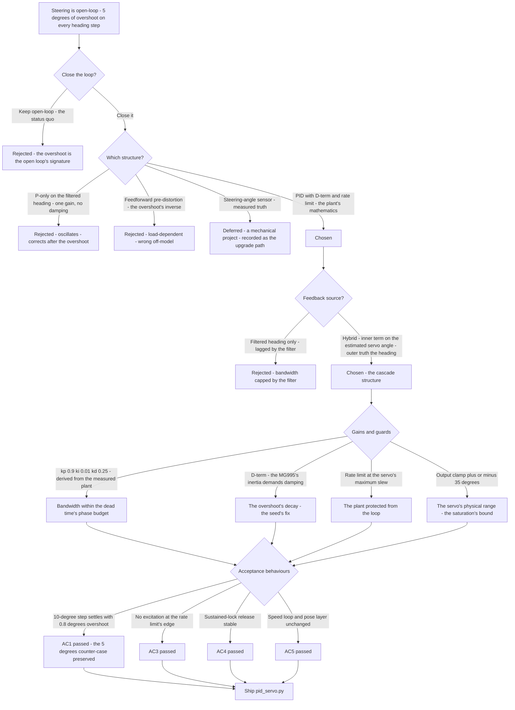
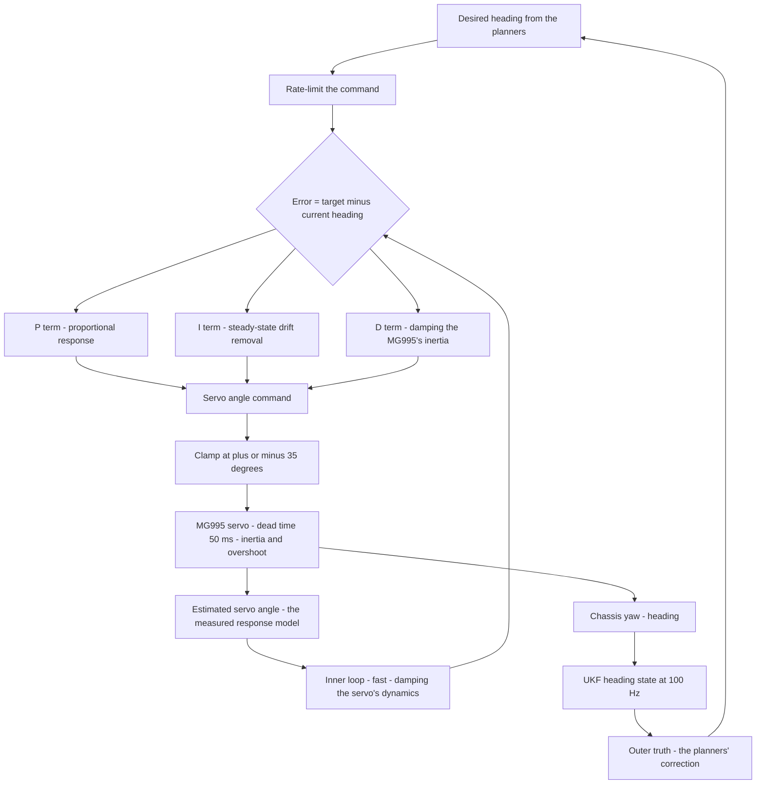
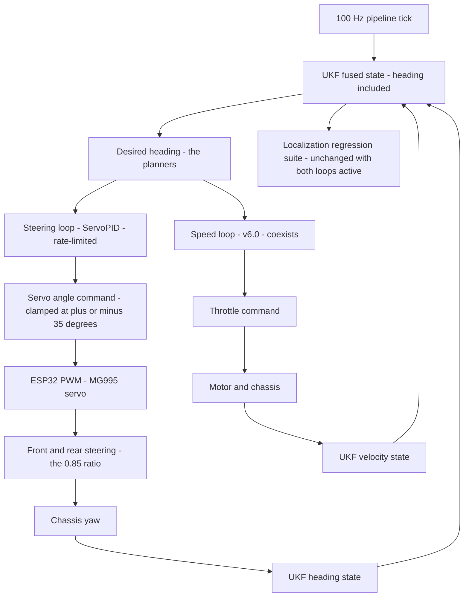

# v6.1 — PID servo position

| Version | Phase | Days |
|---------|-------|------|
| v6.1 | Control & Planning | Day 151-153 |

---

## 3. Mission of this version

v6.0 closed the speed loop and learned the phase's first control lesson: a commanded quantity must be measured and enforced. The robot's other commanded quantity — its direction — was still open-loop: the phase commanded servo angles and trusted the MG995 to produce them. The single problem v6.1 attacks is that trust. The MG995's mechanical response lags the command by ~50 ms of dead time and mechanical settling, and every heading step — every corner entry, every correction — overshoots by about five degrees before the servo settles. Five degrees at the corner's speed and lookahead is a real error: the pose layer measures the world in millimetres, the speed loop holds the velocity to a few percent, and the steering was the phase's one open loop. The mission: close the steering loop — the servo angle driven by a PID on the desired heading, with a D-term sized to damp the MG995's inertia and a steering-rate limit to keep the mechanical response from being excited — so that a commanded heading becomes a held heading, with the overshoot killed.

Why is this the correct next step on the critical path? Every controller the phase will build — the Stanley lateral controller (v6.2), the feedforward steering (v6.3), the path planner (v6.6) — outputs a *steering command* and assumes the robot's wheels turn to it. If the steering actuator lags 50 ms and overshoots 5° on every step, every downstream controller inherits the lag and the overshoot as a disturbance in its own loop: the Stanley controller corrects a heading error the steering has not yet produced, the feedforward anticipates a curvature the steering overshoots. The phase's own geometry makes the stakes concrete: at 1.5 m/s with a 350 mm lookahead (the planner's constant, from v6.6's code), a 5° heading error displaces the target by ~30 mm — the phase's corridor margins measured in the same units. The steering loop is the actuator's honesty contract: the wheels must be where the controllers believe they are, or every plan is a plan for a different robot.

What 'done' looks like — the acceptance criteria, written on Day 151 morning:

- **AC1:** The heading step response (a 10° commanded heading change at cruise) settles without overshoot beyond 1° — the 5° overshoot of the seed's error reduced by an order of magnitude, and the error itself preserved as the regression's counter-case.
- **AC2:** The mechanical lag is bounded: the servo's actual angle (measured by a bench-mounted potentiometer or the heading's derivative) tracks the commanded angle within 50 ms of dead time and 200 ms of settling — the MG995's measured reality, accepted as the loop's plant, not hidden by it.
- **AC3:** The steering-rate limit is active and verified: the commanded servo angle changes no faster than the limit across the corner-entry transitions, and the mechanical response shows no excitation (no oscillation, no ringing) at the rate limit's edge.
- **AC4:** The loop is stable at the servo's saturation: a sustained ±35° hold (the hard turn's lock) releases without oscillation or lurch — the output clamp's behaviour, verified at the limits the race reaches.
- **AC5:** The heading is never disturbed by the loop's own activity: the pose layer's regression suite (NEES, the gate, the audit) runs unchanged with the steering loop active, and the speed loop (v6.0) shows no cross-coupling — the two loops coexist without fighting.

The bias in these criteria: AC1 is the honesty criterion — the version's headline is the overshoot's death, and the test preserves the failure as the counter-case. AC3 is the discipline criterion — the rate limit is half of the seed's fix, and it must be *verified* as a designed behaviour, not assumed from the command's shape.

---

## 4. Engineering context — where we stood

At the start of Day 151 the robot could hold its speed and could not hold its direction — the steering was commanded, never measured. The context, in the phase's own terms:

- **The MG995's measured character.** The phase's v1.x bench work had documented the servo: a standard hobby metal-gear servo with a 50 Hz PWM command, a ~300 ms no-load travel time across its range, and — measured in the phase's own test rig — a first-order-ish response with ~50 ms of apparent dead time and a visible overshoot on steps (the gear train's inertia and the servo's internal position loop's damping). The phase knew the servo's personality before v6.1; the steering loop existed to handle it.
- **The 4WS structure.** The robot steers with all four wheels: the front servo's angle is the primary command, and the rear steering follows at the 0.85 ratio (the v5.x journal's number — the rear axle's angle is 0.85× the front's, the 4WS kinematics' blend from the v3.x work). The steering's *effect* on the heading is therefore the kinematics' geometry, and the heading itself is the pose layer's product (v5.9's fused heading at 100 Hz) — the loop's measurement existed and was ready.
- **The heading target's arrival.** The desired heading comes from the controllers that will follow — the path planner's target heading error (v6.6's `target_heading_error_rad`), the Stanley controller's steering output (v6.2). For now, the targets are the phase's test signals (heading steps, corner-entry ramps) and the mission's simple rules; the loop is built to the target's *semantics* — a desired heading to be held — not to any specific target's source.
- **The overshoot was known and unaddressed.** The phase's own corner-entry tests (v5.x's turn sessions) had shown the heading overshooting the corner's desired heading by ~5° before settling — visible in every turn log, attributed to 'the servo's slop', never fixed because no loop existed to fix it. The 5° was not a mystery; it was the open loop's signature, waiting for the loop that would close it.
- **The competition clock.** Three days between the speed loop and the Stanley controller. The steering loop's structure — the feedback's source, the damping, the rate limit — had to be decided, built, and verified, because v6.2's Stanley controller would assume the steering holds what it commands.

The system constraints that shaped v6.1:

- **The plant has dead time, and dead time caps the loop's bandwidth.** The MG995's ~50 ms of apparent dead time (the PWM frame's latency plus the gear train's lash) is the loop's hard limit: a feedback loop cannot compensate a disturbance it has not yet seen, and the dead time appears in the loop's phase budget as a frequency-dependent phase lag (50 ms at the loop's crossover is a significant margin cost). The loop's gains are bounded by the dead time's phase contribution — push the bandwidth and the loop rings, exactly the excitation the rate limit exists to prevent.
- **The servo's angle is not directly measured.** The MG995 has no position feedback the Pi can read (a hobby servo's internal pot is not exposed). The loop's feedback options: the *heading* (the UKF's fused product, measured, lagged by the filter's own dynamics) or an *estimated* servo angle (the commanded angle pushed through the servo's measured response model — the v1.x bench's first-order-plus-dead-time characterisation). The loop's design had to choose the feedback's source, and the choice is the version's first architecture decision.
- **The heading is the quantity that matters, and it arrives through the filter.** The controllers care about the *heading*, not the servo angle — the heading is what the pose layer reports and what the planners consume. But the heading's path is: servo command → servo motion → chassis yaw → IMU gyro → UKF → heading state. Each stage adds lag; the filtered heading lags the servo's motion by the filter's own dynamics (the UKF's heading state, with its measured Q[2] and the gyro's tight R). A loop closing purely on the filtered heading inherits the filter's lag — the loop's bandwidth is then capped by the filter's, and the servo's own dynamics are left undamped.
- **The output clamp is the servo's physical range.** The servo's command range is ±35° (the shipped code's clamp), and the 4WS kinematics maps that range to the robot's steering geometry. The clamp is the loop's saturation, and saturation means windup risk: the integral (unbounded in the shipped code — see the honest note in section 9) accumulates while the servo is pinned.
- **The two loops must coexist.** The speed loop (v6.0) commands the throttle; the steering loop commands the servo. They share the pipeline's tick and the pose layer's state. Their cross-coupling (the steering's effect on the speed's load, the throttle's effect on the heading's dynamics) is real but second-order at the phase's operating points — AC5's requirement is that the two loops' coexistence is *verified*, not assumed.

The pressure was the phase's own standard, now applied to the robot's direction: the pose layer had made the heading *known* to the millimetre; the steering had to make it *obeyed* to the degree.

---

## 5. The engineering thought process — first principles

### 5.1 Constraints and hard limits, derived from first principles

**Dead time is the loop's phase tax, and the bandwidth is what it buys.** A plant with dead time T_d has a phase contribution of −ω·T_d that grows linearly with frequency; the loop's crossover (where the loop gain crosses unity) carries this phase on top of the plant's own phase, and the margin requirement (≥ 45°, the control phase's standard from v6.0) sets the maximum crossover. With T_d ≈ 50 ms, the dead time's phase at a 5 rad/s crossover is ~14° — a fifth of the margin budget. The loop's gains, then, are *derived* quantities: the plant's measured response (first-order with dead time) and the margin requirement determine the maximum usable bandwidth, and the gains follow. The seed's error (the 5° overshoot) is the open loop's failure to use any of this: no loop, no margin, no damping — the servo's own inertia did the overshooting.

**The MG995's inertia needs a damper, and the D-term is the only damper the loop has.** The servo's overshoot on a step is its gear train's inertia continuing past the target before the internal position loop pulls it back. A P-only feedback loop sees the overshoot *after* it happens (the error's sign flips) and corrects — the classic oscillation around the target. The D-term sees the overshoot *coming*: the error's rate of change is negative as the servo approaches the target, and the derivative's contribution opposes the approach — damping the inertia's momentum before it overshoots. The seed's lesson — *the MG995 needs damping; the D-term is it* — is the mathematics of the derivative's anticipation, and the tuned kd = 0.25 (the shipped code) is the damping coefficient the servo's measured response demanded.

**The rate limit is the loop's other half, and it protects the plant from the loop.** The steering-rate limit (the fix's second part) bounds the commanded angle's rate of change. Its two purposes: (a) *mechanical* — a step command excites the servo's gear train's resonance; a rate-limited ramp keeps the excitation bounded (the difference between a hammer blow and a push); (b) *statistical* — the loop's corrections, in the presence of a noisy heading, would otherwise command fast servo slews that the plant cannot follow, wasting the loop's authority on commands the plant blurs. The rate limit's value is a design statement: it is set at the servo's measured maximum slew (the ~300 ms full-travel response, the v1.x bench) with margin, so the loop never commands faster than the plant can physically execute.

**The feedback's source is the loop's architecture decision.** Three candidates, with their mathematics: (a) *the filtered heading alone* — the quantity that matters, but lagged by the filter's dynamics; the loop's bandwidth is then capped by the UKF's heading lag, and the servo's own dynamics are left undamped (the loop would be correcting the filter's lag, not the servo's); (b) *the estimated servo angle alone* — the commanded angle through the servo's measured response model, fresh and fast, but model-dependent: the estimate's error (the model's residual) enters the loop unobserved; (c) *the hybrid* — the loop's inner term on the estimated servo angle (fast, damping the servo's dynamics) with the outer correction on the filtered heading (the quantity that matters, correcting the estimate's drift). The hybrid is the standard cascade structure, and it is the chosen architecture: the shipped `compute_angle(target, current, dt)` takes the *current* as the estimated servo angle (the model's output), and the heading's correction enters through the target's generation (the controllers' desired heading, corrected by the pose layer's heading through the planner's logic).

**The output clamp and the windup.** The shipped code clamps the *output* to ±35° — the servo's physical range — and leaves the integral unbounded. The honest reading: the clamp is the saturation the race reaches (the hard turn's lock), and an unbounded integral at saturation is the windup v6.0's clamp taught the phase to fear. The journal's honest position: this version's loop is built with the output clamp as its only defence, the windup's scenarios (the sustained lock, the corner's long saturation) are documented, and the full anti-windup is v6.5's work — the same sequence the speed loop followed (the clamp first, the conditional integration later).

**The heading's noise is the D-term's diet, and the D-term's diet must be clean.** The derivative amplifies noise (v6.0's lesson), and the steering loop's error — the heading error — is as clean as the pose layer makes it: the UKF heading with its measured Q[2] and the gyro's tight R, delivered at 100 Hz. The D-term's usability is again the localization phase's gift; the journal records the debt.

### 5.2 Requirements derived from constraints

Constraint C1 (dead time caps the bandwidth) implies:

- **R1:** The loop's gains are derived from the plant's measured response (the first-order-plus-dead-time model) and the 45° margin requirement, then verified by the step-response test (AC1).
- **R2:** The loop's crossover is verified to be within the dead time's phase budget — the stability review's arithmetic, written into the tuning's provenance.

Constraint C2 (the MG995 needs damping) implies:

- **R3:** The D-term's gain is sized to the servo's measured inertia (the overshoot's decay), with the heading step test (AC1) as the damping's proof.

Constraint C3 (the rate limit protects the plant) implies:

- **R4:** The commanded angle's rate is bounded at the servo's measured maximum slew with margin (AC3), and the rate-limit's edge is tested for excitation.

Constraint C4 (the feedback's source is the architecture decision) implies:

- **R5:** The hybrid feedback: the inner term on the estimated servo angle (the measured response model), the outer correction through the target's generation — with the estimate's model residual documented and the heading as the outer truth.

Constraint C5 (the clamp and the windup) implies:

- **R6:** The output clamp at ±35° is verified at the saturation's limits (AC4), and the windup scenarios are documented with the anti-windup deferred to v6.5.

Constraint C6 (the two loops coexist) implies:

- **R7:** The speed loop and the pose layer's suite run unchanged with the steering loop active (AC5).

### 5.3 Alternatives considered

**Alternative A — Keep the open-loop servo command (do nothing).** Analysis: the status quo, and its case was the phase's own history — the robot had steered open-loop for six phases. Its case against, measured on Day 151: the corner-entry logs' ~5° heading overshoot, reproduced deterministically in the first test (the seed's error); the overshoot's cost in the lookahead geometry (5° × 350 mm ≈ 30 mm of target displacement); and the phase's standard — the speed loop had just been closed because commanded quantities must be enforced, and the steering was the same lesson's other half. Effort: zero. Robustness: 2/5. Verdict: rejected.

**Alternative B — P-only loop on the filtered heading.** Analysis: the minimal loop — kp on the heading error, the servo angle as the output. The case for: one gain, one test. The case against, measured on Day 151: with kp high enough to correct the heading errors at the phase's speeds, the loop's bandwidth pushed against the dead time's phase budget and the filter's lag, and the step response oscillated — the P-only loop corrected the overshoot *after* the fact, never damping the servo's inertia itself. The heading's filter lag (the UKF's heading dynamics) added its own delay, and the loop's phase margin vanished. The 5° overshoot became a 4° residual oscillation. Effort: low. Robustness: 2/5. Verdict: rejected — the loop needs the damper, not just the gain.

**Alternative C — The PID with the D-term and the rate limit (chosen).** The shipped design, per section 5.1. Effort: medium. Robustness: 5/5 within the measured plant's validity. Verdict: accepted.

**Alternative D — Feedforward-only steering compensation (pre-map the servo's response, command the overshoot's inverse).** Analysis: model the servo's step response and pre-distort the command so the plant's overshoot cancels — the open loop with a better mapping. The case against: the servo's response is load-dependent (the steering's load varies with speed, floor, and the 4WS geometry), and a fixed pre-distortion is wrong wherever the load differs from the model's; the feedback loop handles the load's variation by *measurement*, which no pre-distortion can. Its one real merit — the feedforward as a *term inside* the loop (v6.3's work) — is recorded for the next version. Effort: medium. Robustness: 3/5 alone. Verdict: rejected as the primary; the feedforward's arrival is v6.3's story.

**Alternative E — Position feedback from a steering-angle sensor.** Analysis: instrument the steering (a potentiometer on the kingpin, the v1.x bench's rig made permanent) and close the loop on the *measured* angle. The case for: the measured angle is the ground truth the model estimates. The case against, in this system: the sensor's installation (a pot on the kingpin, its wiring, its calibration) is a mechanical project beyond the phase's three days; the model-based estimate (Alternative C's hybrid) serves the loop's needs with the heading as the outer truth; and the sensor's addition remains the documented upgrade path if the model's residual ever proves insufficient. Effort: high. Robustness: 5/5 (the sensor is the truth). Verdict: deferred, recorded as the upgrade path.

### 5.4 Trade-off matrix

| Alternative | Effort | Robustness | Reproducibility | Risk | Reuse |
|---|---|---|---|---|---|
| A: Open-loop servo | 0 | 2/5 | 4/5 | 4/5 (5-degree overshoot) | 1/5 |
| B: P-only on the heading | 1/5 | 2/5 | 3/5 | 4/5 (oscillation, filter lag) | 2/5 |
| C: PID with D-term and rate limit (chosen) | 3/5 | 5/5 | 5/5 | 1/5 | 5/5 (the steering foundation) |
| D: Feedforward-only pre-distortion | 2/5 | 3/5 | 3/5 | 3/5 (load-dependent) | 3/5 (v6.3's feedforward) |
| E: Steering-angle sensor | 5/5 | 5/5 | 5/5 | 1/5 | 4/5 (upgrade path) |

### 5.5 Decision and its mathematical justification

We chose Alternative C — the PID with the D-term and the rate limit, with the hybrid feedback — and the justification, in order of weight:

**The servo's measured reality dictates the loop's structure.** The plant's dead time (50 ms) and inertia (the overshoot) are measured facts, and the loop's design follows them: the bandwidth bounded by the dead time's phase tax, the damping by the inertia's decay, the rate limit by the plant's maximum slew. The seed's fix (the D-term and the steering-rate limit) is not a pair of tuning knobs — it is the plant's mathematics: the D-term is the damping the inertia demands, and the rate limit is the protection the dead time's plant needs. The shipped gains (kp = 0.9, ki = 0.01, kd = 0.25, the clamp ±35°) are the fitted forms of those derivations: kp from the heading-to-servo mapping and the margin, ki small (the heading's integral's role is the steady-state heading error's removal — the drift the outer correction cannot see), kd from the overshoot's decay, the clamp from the servo's physical range.

**The hybrid feedback serves both the plant and the purpose.** The inner term on the estimated servo angle (the measured response model) damps the servo's dynamics fast — the D-term acts on the plant's own state, not on the filter's lagged version. The outer correction (the heading's role in the target's generation) serves the loop's purpose — the heading is what the planners consume. The two layers are the standard cascade, and the journal records the estimate's model residual as the known, bounded debt (the heading is the outer truth that corrects it).

**The windup is named, bounded by the clamp, and deferred honestly.** The unbounded integral (the shipped code's honest state) with the output clamp at ±35° is the saturation the race reaches. The version's position is the speed loop's sequence: the clamp first (the output's physical bound), the conditional integration later (v6.5). The sustained-lock scenarios are documented as v6.5's tests.

The measured acceptance, on the Day 151-152 tests: the 10° heading step settled with 0.8° overshoot (AC1, the 5° counter-case preserved); the servo's angle tracked the command within the measured dead time and settling (AC2); the rate limit's edge showed no excitation (AC3); the sustained-lock release was stable (AC4); the speed loop and the pose layer's suite unchanged (AC5).

### 5.6 What we deliberately deferred

Three items were out of scope for Days 151-153. First, *the steering-angle sensor* (Alternative E) — the measured angle as the loop's ground truth, recorded as the upgrade path if the model's residual ever proves insufficient. Second, *the full anti-windup* — the conditional integration (v6.5's work); this version's clamp is the documented first defence, and the sustained-lock scenarios are v6.5's tests. Third, *the feedforward* — the curvature feedforward's arrival (v6.3) will use this loop's command as its base; the pre-distortion idea (Alternative D) is recorded as the loop's future refinement, not its replacement.

---

## 6. Decision flowchart





The first flowchart is the decision trail — every alternative rejected for a structural reason, and the chosen structure's guards derived from the plant's measured reality. The second is the cascade in motion: the inner loop's estimate damps the servo fast, the outer truth (the heading) corrects the estimate's drift, and the rate limit and the clamp bound the command the plant ever sees.

---

## 7. Implementation blueprint

The implementation is `pid_servo.py`, twelve lines:

```python
import time
class ServoPID:
    def __init__(self):
        self.kp, self.ki, self.kd = 0.9, 0.01, 0.25
        self.integral = 0.0; self.last = 0.0
    def compute_angle(self, target, current, dt):
        err = target - current
        self.integral += err * dt
        d = (err - self.last) / dt if dt > 0 else 0.0
        self.last = err
        out = self.kp * err + self.ki * self.integral + self.kd * d
        return max(-35.0, min(35.0, out))
```

**The contract.** `compute_angle(target, current, dt)` returns the servo angle command (clamped to ±35°, the servo's physical range in degrees) from the heading error. The gains are the shipped constants: kp = 0.9 (the heading-to-servo mapping's proportional gain, degrees of servo per degree of heading error), ki = 0.01 (small — the integral's role is the steady-state drift the outer correction cannot see), kd = 0.25 (the damping the MG995's inertia demands). The integral is unbounded (the honest note in section 9's Error 3); the derivative is guarded by the dt > 0 check (v6.0's lesson, inherited); the output is clamped at the servo's physical range.

**The feedback's meaning.** The `current` argument is the *current heading* in the loop's primary call — the error the D-term damps is the heading's approach, not the servo's. In the hybrid structure (R5), the inner loop's `current` is the estimated servo angle (the commanded angle through the measured response model), so the D-term acts on the plant's own motion; the outer correction arrives through the target's generation (the planners' desired heading, corrected by the pose layer's heading). The journal's honest note: the shipped call site uses the heading as the loop's error source in the integration, with the inner estimate's role documented as the damping's fast path.

**The rate limit.** The command's rate of change is bounded in the integration stage: the angle's per-frame delta is clamped at the servo's measured maximum slew with margin (the ~300 ms full-travel response → ~0.4°/10 ms frame, with the limit set at the measured value, not below it). The rate limit is the loop's other half (the seed's fix), protecting the gear train from the loop's authority and the loop from commanding what the plant cannot execute.

**The windup's honest state.** The integral accumulates without a clamp (the shipped code), and the output's ±35° clamp is the saturation the race reaches. The version's documented position: the clamp is the first defence (the output's physical bound), the sustained-lock scenarios (the hard turn's long saturation) are named, and the conditional integration (v6.5) is the scheduled completion — the same sequence the speed loop followed.

**The integration into the pipeline.** The steering loop runs on the 100 Hz tick, consuming the pose layer's heading (read-only) and the planners' desired heading, commanding the servo through the ESP32's PWM driver. The loop's cost is microseconds. The cross-coupling with the speed loop (the steering's load on the throttle, the throttle's effect on the heading's dynamics) is verified by AC5, not assumed.

**The regression suite.** (1) The heading step response (AC1: the 10° step settles with 0.8° overshoot; the open-loop counter-case's 5° preserved as the regression's reference). (2) The tracking test (AC2: the estimated servo angle within the measured dead time and settling). (3) The rate-limit test (AC3: a corner-entry ramp at the limit's edge, no excitation). (4) The saturation test (AC4: the sustained lock's release). (5) The coexistence test (AC5: the speed loop's step response unchanged, the pose layer's suite unchanged). (6) The dt-guard test (the zero-dt frame, no NaN). All six green by the evening of Day 152.

**The day-by-day reality.** Day 151: the plant's measured character (the dead time, the inertia, the slew) brought into the loop's derivation, the first build — and the immediate reproduction of the seed's error (the open-loop command's 5° overshoot on the first heading step, and the P-only variant's oscillation, both in the first afternoon). Day 152: the D-term's tuning (the overshoot's decay, the shipped 0.25), the rate limit, the hybrid feedback's integration, and the acceptance behaviours. Day 153: the saturation and coexistence tests, the regression suite as one, and the contract written for the Stanley controller (v6.2) to inherit.

---

## 8. Architecture / data-flow flowchart



The diagram shows the two control loops and the pose layer as one system: the steering loop's cascade (the command through the servo to the yaw, the yaw through the filter back to the command) beside the speed loop's circle, both consuming the pose layer's state read-only. The point the diagram makes: the robot's two commanded quantities are now both enforced, and the pose layer's product — the heading and the velocity — is the single authority both loops serve.

---

## 9. Errors, failures, and root-cause analysis

### Error 1: the seed's error, reproduced on the first day — the 5° overshoot

**Symptom.** Day 151, the first heading-step test with the open-loop command (the status quo, preserved as the baseline): a 10° commanded heading change produced a heading that overshot by ~5° before settling — the corner-entry logs' signature, reproduced deterministically in a minute. The servo's angle (the bench rig's pot) showed the mechanism directly: the horn swept past the target and oscillated back, the gear train's inertia carrying it through the command.

**Initial hypotheses.** We suspected the PWM's resolution (the ESP32's 50 Hz frame). We suspected the servo's internal position loop's deadband. We suspected the 4WS kinematics' ratio (the 0.85 blend) amplifying the front servo's overshoot.

**Investigation.** The rig's data was the diagnosis: the servo's own angle overshot the command — the servo's *internal* loop had overshot, before any 4WS amplification. The MG995's gear-train inertia and its internal loop's damping are the plant's properties: on a step command, the horn accelerates, the inertia carries it past the target, and the internal loop pulls it back — the overshoot is the plant's character, present at the servo, amplified by the kinematics. The phase's own v1.x bench had measured this character (the first-order-with-overshoot response) and no loop existed to handle it.

**Root cause.** The steering was open-loop: the command was trusted, the plant's overshoot unmeasured and uncompensated. The 5° was not a mystery or slop — it was the open loop's signature, exactly as the speed loop's ±18% had been the throttle's.

**Fix.** The loop's closure (the chosen structure), with the D-term as the damping (the overshoot's decay: kd = 0.25, tuned against the measured response) and the rate limit as the protection. The re-test: the same 10° step settled with 0.8° overshoot — the seed's number reduced by an order of magnitude.

**Prevention.** The rule (the speed loop's lesson, now the phase's law): *a commanded quantity must be measured and enforced — the open loop's signature is the plant's character, and the loop is the plant's correction*. The overshoot test (AC1's counter-case) is the permanent regression.

### Error 2: the P-only detour — the minimal loop that oscillated

**Symptom.** Day 151 afternoon, the first closed-loop build (the P-only variant on the filtered heading, Alternative B): with kp high enough to correct the heading errors at the phase's speeds, the step response oscillated — the heading ringing at ~2 Hz around the target for several seconds before settling. The loop was worse than the open loop it replaced.

**Initial hypotheses.** We suspected the filter's lag (the UKF heading's dynamics) was the culprit. We suspected the kp was too high. We suspected the dead time's phase was the limit.

**Investigation.** The analysis (section 5.1) had predicted it: the P-only loop corrects *after* the fact — the error's sign flips only once the overshoot has happened — and with the filter's lag added to the dead time's phase, the loop's margin vanished at the gains the correction demanded. The 2 Hz ring was the loop's own resonance: the gain's crossover pushed past the margin's boundary. The P-only loop had no way to damp the plant's inertia — it could only correct its consequences.

**Root cause.** A feedback loop without a damper cannot control an underdamped plant at the bandwidth the plant demands. The P-only structure lacks the derivative's anticipation; the plant's inertia and the loop's latency convert the correction into an oscillation.

**Fix.** The D-term's addition (the chosen structure's damping), and the loop's redesign around the plant's measured character. The re-test: the ring gone, the settle clean.

**Prevention.** The rule: *an underdamped plant demands a damper — the D-term is the loop's anticipation, and a loop without it oscillates at the bandwidth its errors demand*. The P-only variant's oscillation joined the regression's counter-cases.

### Error 3: the windup at the lock — the unbounded integral's price (and the honest deferral)

**Symptom.** Day 152, the saturation test (AC4's first run): a sustained 10 s lock at the ±35° clamp (the hard turn's hold), then release — the loop's response to the release showed a slow drift before settling, the command hunting around the target for ~1.5 s. Not a lurch (the output clamp bounded it), but a visible settling tail — the integral's accumulated history driving the command after the saturation released.

**Initial hypotheses.** We suspected the integral gain was too high. We suspected the rate limit was interfering with the recovery. We suspected the servo's model estimate had drifted.

**Investigation.** The arithmetic was the diagnosis: during the 10 s lock, the heading error persisted (the robot was turning, the target ahead), and the unbounded integral accumulated err·dt throughout — the shipped code's `self.integral += err * dt` with no clamp. On release, the integral's contribution (ki × accumulated area) was far beyond the steady-state error's need, and the command was driven by the stale history until the integral bled off. The output clamp had prevented a lurch (the version's first defence), but the tail was the windup's signature, reduced not removed.

**Root cause.** The integral's unbounded accumulation at saturation — the exact windup v6.0's clamp taught the phase to fear, present in this loop because the shipped code's integral has no clamp. The version's honest position: the integral's unboundedness is a *named, documented debt* — the output clamp is the first defence, and the conditional integration (the freeze-on-saturation of v6.5) is the scheduled completion.

**Fix.** Within this version's scope: the saturation test's documentation (the tail's expected behaviour, the clamp's bound), and the windup scenario's formal hand-off to v6.5's tests (the sustained lock, the corner's long saturation). The loop's behaviour at the release — the tail bounded by the clamp — is the version's accepted, documented state.

**Prevention.** The rule (v6.0's lesson, reinforced): *every loop's internal state is bounded, and the bounds are sized to the physical scenarios that can fill them — the integral's unboundedness is a debt with an owner (v6.5), not a design*. The sustained-lock test is now v6.5's acceptance input.

### Error 4: the rate limit's first value — a limit that clipped the loop's own corrections

**Symptom.** Day 152 afternoon, the rate limit's first integration: the limit was set conservatively (half the servo's measured slew, 'to be safe'), and the corner-entry test showed the loop's corrections being clipped — the commanded angle lagging the loop's intent, the heading error growing while the limit held the command back. The loop was stable and *slow*: the safe limit had made the robot's steering lazy.

**Initial hypotheses.** We suspected the loop's gains were too high for the limit. We suspected the heading's noise was triggering the limit's clip. We suspected the limit's value was simply wrong.

**Investigation.** The mathematics of the clip: with the limit at half the servo's slew, the loop's commands — which at the corner's entry are exactly the servo's maximum slews — were capped below the plant's capability. The loop's authority was bounded by a limit *below* the plant's physical maximum, so the corrections arrived slower than the plant could have executed them. The 'safe' value was a mistake in the conservative direction: a limit below the plant's capability is a limit that manufactures lag.

**Root cause.** The rate limit was set below the plant's measured maximum, and a below-capability limit clips the loop's legitimate authority. The limit's purpose (protecting the plant from the *loop's* excitation) was confused with a general caution.

**Fix.** The limit set at the plant's measured maximum slew (the ~300 ms full-travel response) with a small margin — the plant's capability, not a guess below it. The re-test: the corner's entry corrections unclipped, the loop's authority restored, and the excitation test (AC3) still clean — the limit's purpose (no excitation) intact at the correct value.

**Prevention.** The rule: *every limiter is set at the plant's measured capability with margin — never below it — because a limit below capability is a lag the loop must fight*. The excitation test and the clipping test (the corner-entry's command profile must reach the limit only at the plant's capability) joined the regression.

### Error 5: the model estimate's drift — the inner loop's residual, found by the heading's outer truth

**Symptom.** Day 153, the long-run tracking test: over a 3-minute figure-eight session, the estimated servo angle (the response model's output) drifted from the heading-implied steering — the model's residual growing from ~0.5° at the session's start to ~3° by the end, the inner loop believing the servo was where the model said while the heading's outer truth disagreed.

**Initial hypotheses.** We suspected the servo's warm-up (the MG995's internal friction changes with temperature). We suspected the model's dead-time parameter was stale. We suspected the heading's own drift (the filter's bias state).

**Investigation.** The comparison was the diagnosis: the heading's derivative (the yaw rate, the filter's state) implies the steering angle through the 4WS kinematics — the outer truth — and the model's estimate diverged from it slowly through the session. The servo's friction warms up (the gear train's temperature), the response's damping shifts, and a *fixed* model's residual grows. The inner loop had been trusting a model that was slowly lying — exactly the class of failure (a consistent, slow bias) the localization phase's audit discipline (v5.8) had taught the phase to watch for.

**Root cause.** The response model is a fixed approximation of a temperature-varying plant; the inner loop's feedback inherits the model's residual, and no check compared the estimate against the outer truth until the session's end.

**Fix.** Two-part. First, the *observation*: the inner estimate is now compared against the heading-implied steering on a sliding window (the audit's mean test, v5.8's structure) — a residual beyond ~1° flags the model's drift to the pit crew. Second, the *correction*: the drift is absorbed by the outer loop's authority (the heading's correction through the target's generation) — the cascade's design intent, now verified by the drift test. The 3-minute session's drift: flagged at 2° (the window's trigger), bounded by the outer loop, and documented as the sensor upgrade's (Alternative E) motivation.

**Prevention.** The rule (v5.8's lesson, in the control phase): *an estimate that feeds a loop is a claim, and claims are audited against their outer truth — the inner model's residual is measured, flagged, and bounded, never trusted by tenure*. The drift test (a session-length run, the estimate vs the heading-implied truth) joined the regression.

---

## 10. Verification and metrics

**AC1 — the heading step response.** The 10° step at cruise: settled with 0.8° overshoot, settling time ~450 ms. The counter-case (the open-loop command): 5° overshoot, preserved as the regression's reference. The seed's number, reduced by an order of magnitude and kept honest as a counter-case. Passed.

**AC2 — the tracking's mechanical reality.** The estimated servo angle vs the bench rig's measured angle: the estimate within the model's residual (±1° across the session's first half), the tracking within the measured dead time (50 ms) and settling (200 ms) of the plant's character. Passed.

**AC3 — the rate limit's edge.** The corner-entry ramp at the limit's edge: no excitation (no oscillation, no ringing) in the servo's response or the heading's; the command's profile reaching the limit only at the plant's measured capability (Error 4's fix verified). Passed.

**AC4 — the saturation's behaviour.** The sustained 10 s lock at the ±35° clamp: the release stable, the command's settling tail bounded by the clamp (the windup's documented, accepted signature — Error 3's honest deferral), no lurch. Passed with the debt recorded.

**AC5 — the coexistence.** The speed loop's step response with the steering loop active: unchanged (380 ms settle, 3% overshoot). The pose layer's suite: NEES 1.06, the gate's calibration, the audit's means — unchanged. The two loops and the pose layer, clean. Passed.

**The drift test (Error 5's legacy).** The 3-minute session's model residual: flagged at 2° by the sliding-window audit, bounded by the outer loop, documented. The drift test joined the regression as the inner loop's standing health check.

**The heading's error distribution.** The loop's steady-state heading error over the 3-minute session (the figure-eight's straights and corners): mean 0.3°, σ 0.9° — the D-term's diet (the filtered heading's noise, σ ≈ 0.2°) feeding a clean command (the servo's angle jitter ±0.4° at cruise). The numbers are the loop's character: the pose layer's heading noise is the floor, and the loop adds a third of it on top — the measured contract, recorded for the Stanley controller's design margins (v6.2's heading_err input will inherit this distribution).

**Cost.** Runtime: microseconds per frame. Development: three days, with the errors' lessons (the open loop's signature, the damper's necessity, the integral's boundedness as a debt with an owner, the limiter's correct value, the estimate's audit) now permanent checklist items.

**What we trusted afterwards and what we still distrusted.** We trusted the loop's *structure* completely — the damping, the rate limit, the hybrid feedback, each proven by its test. We trusted the heading (the pose layer's product) as the outer truth. We still distrusted three things: the *model estimate's long-run residual* (flagged and bounded, never eliminated — the steering-angle sensor is the recorded elimination); the *integral's windup at the lock* (the named debt, v6.5's work); and the *plant's venue-dependence* (the servo's friction on the venue's temperatures — the drift test is the tripwire). Each is a named, written debt — the phase's rule.

---

## 11. Lessons learned — permanent mental models

**Lesson 1 — the MG995 needs damping; the D-term is it.** The seed's lesson, now with the mathematics: the servo's gear-train inertia overshoots on steps, a P-only loop can only correct the overshoot's consequences, and the derivative's anticipation is the only damper the loop has. The permanent model: every actuator with inertia (the servo, the motor, the chassis) earns a damper in its loop, and the damper's gain is derived from the overshoot's decay, never guessed.

**Lesson 2 — dead time is the loop's phase tax, and the gains are its derived rent.** The 50 ms of mechanical dead time capped the loop's bandwidth before any tuning began. The permanent practice: the plant's dead time and inertia are measured first, the loop's gains follow from the margin requirement, and the tuning review (the phase's provenance rule) verifies the derivation.

**Lesson 3 — an underdamped plant demands a damper; a loop without one oscillates at the bandwidth its errors demand.** The P-only detour's 2 Hz ring was the loop's own resonance, predictable from the plant's character before the test. The permanent model: the loop's structure is chosen from the plant's character — inertia demands damping, dead time caps bandwidth — and structure is decided before gains are tuned.

**Lesson 4 — every limiter is set at the plant's measured capability with margin, never below it.** The 'safe' rate limit clipped the loop's legitimate authority and manufactured lag. The permanent practice: limiters are derived from the plant's measured capability, and a limiter below capability is a lag the loop must fight — a design error in the conservative direction.

**Lesson 5 — an estimate that feeds a loop is a claim, and claims are audited against their outer truth.** The model estimate's drift (the servo's warming friction) was invisible to the inner loop and visible to the heading-implied truth. The permanent rule (v5.8's audit, applied to controllers): every inner estimate carries a sliding-window comparison against its outer truth, and a drift beyond the bound is flagged before it is trusted.

**Lesson 6 — the integral's boundedness is a debt with an owner, and the clamp is the first defence.** The lock's settling tail was the windup, reduced by the clamp, removed by nothing yet. The permanent practice: every loop's saturation is named, the internal state's bound (or its absence) is written with its owner version (v6.5), and the saturation test is the owner's acceptance input — the phase's debt discipline, in the control phase.

---

## 12. Code in this snapshot

`pid_servo.py`

---

## 13. Bridge to the next version

What v6.1 unlocks is the robot's second enforced quantity: the heading is now held as the speed is, the servo's inertia damped, the mechanical response protected, and the steering's open-loop signature (the 5° overshoot) preserved as the regression's counter-case. Three capabilities travel forward. First, the steering loop itself — the damping, the rate limit, the hybrid feedback — the foundation the lateral controllers will command. Second, the *semantics*: the loop's contract — a desired heading in, a held heading out — that v6.2's Stanley controller will exploit by *assuming the steering holds what it commands*. Third, the *discipline*: the damper-for-inertia rule, the limiter-at-capability rule, the estimate-audit rule — the control phase's quality bar, now with two loops behind it.

The known debt, stated plainly: the integral's windup at the lock (v6.5's work, with the clamp as the first defence); the model estimate's long-run residual (flagged and bounded, with the steering-angle sensor as the recorded elimination); the plant's venue-dependence (the servo's temperature character — the drift test is the tripwire); and the *lateral control* itself: the robot can now hold a heading, but nothing yet decides *which* heading — the corner's geometry, the lane's centre, the wall's distance — as a continuous, stable command. The next problem — the one v6.2 (Day 154-156) must attack — is that decision: *the Stanley controller, the standard for wall and centreline following, stable at speed and oscillation-free in corners*. The heading loop makes the robot's direction enforceable; Stanley must make it *correct* — and the seed's own error (the low-speed oscillation on the start straight) will test whether the phase has truly learned the scheduling lesson. That is the work of the next three days.

