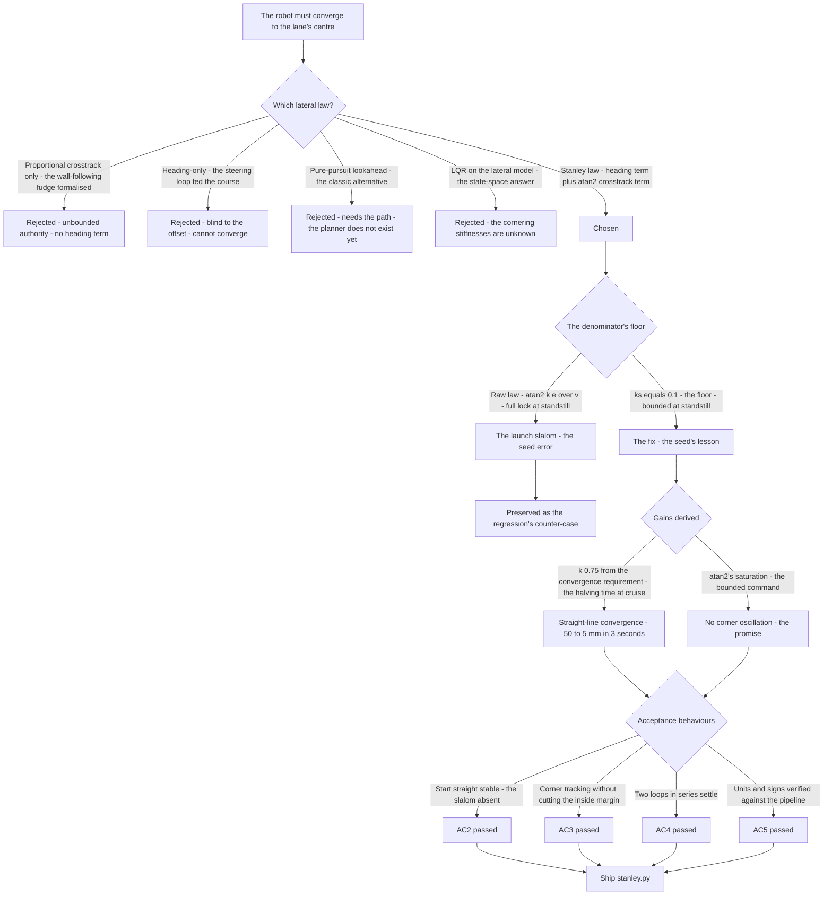
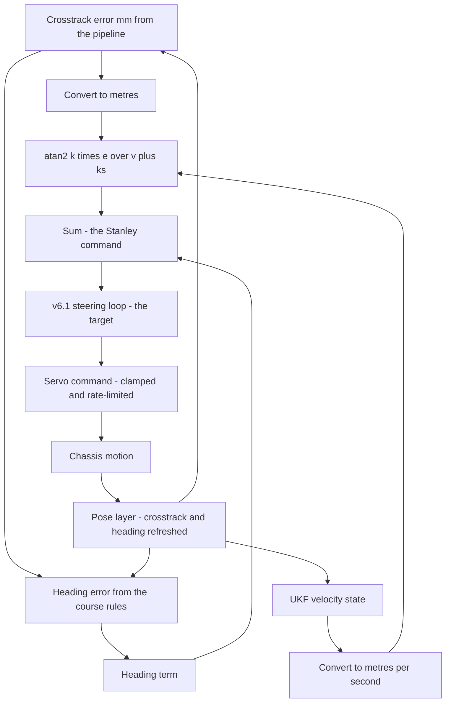
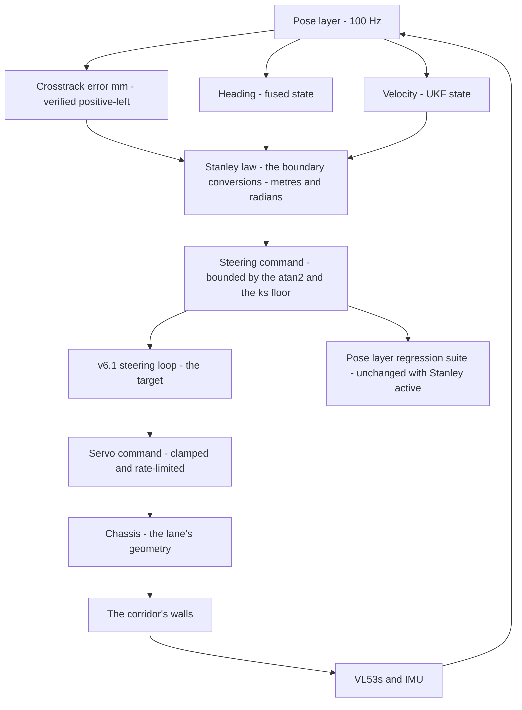

# v6.2 — Stanley steering control

| Version | Phase | Days |
|---------|-------|------|
| v6.2 | Control & Planning | Day 154-156 |

---

## 3. Mission of this version

v6.1 made the robot's direction *enforceable*: the servo holds what the loop commands, the heading is damped, the mechanical response protected. The question left open — and the single problem v6.2 attacks — is what the loop should command. The robot now needs a lateral controller: the continuous decision of *which heading* — the decision that reads the crosstrack error (how far the robot is from the lane's centre, from v5.9's pipeline) and the heading error (where the robot is pointing relative to where it should point), and produces the steering command that drives both to zero. The mission is the Stanley controller, the standard for wall and centreline following: delta = heading_err + atan2(k·e_crosstrack, v + ks) — stable at speed, oscillation-free in corners, and — the version's own trap — requiring its ks term to survive the start straight.

Why is this the correct next step on the critical path? The phase's controllers now exist in a chain: the planners (v6.6+) decide the path's shape, the Stanley controller translates the lane-relative error into a desired heading, and the steering loop (v6.1) holds it. The chain's middle link is this version — the link that turns the pose layer's *measurements* (the crosstrack error, the heading) into the robot's *intent* (the steering). Without it, the robot can hold any heading but has no reason to prefer one; with it, the robot converges to the lane's centre by a stable law with a known convergence rate. The phase's own corner work (v5.4) had shown what happens without a lateral law: the wall-following fudges, the pillar episode's 5 cm, the turn's drift — all symptoms of a robot correcting by rule of thumb instead of by a control law with a stability argument.

What 'done' looks like — the acceptance criteria, written on Day 154 morning:

- **AC1:** The straight-line convergence: from a 50 mm initial crosstrack error on a straight section, the controller drives the crosstrack error to within ±5 mm (the pose layer's accuracy band) with no overshoot beyond 10% of the initial error — the convergence the phase's corridor margins demand.
- **AC2:** The start-straight stability: from standstill with a nonzero crosstrack error, the controller's steering command is bounded (no slam to lock), and the launch's acceleration does not produce oscillation — the seed's error, killed, with the ks = 0 case preserved as the regression's counter-case.
- **AC3:** The corner behaviour: through the v5.3 turn logs' geometry, the controller tracks the lane's centre with no oscillation (the 'no oscillation in corners' promise) and without cutting the corner's inside margin — the turn's error budget, inherited from the localization phase's corner work.
- **AC4:** The command's semantics: the controller's output is a valid target for the v6.1 steering loop — a bounded, rate-compatible angle command — and the two loops in series (Stanley deciding, the servo loop holding) settle the heading steps the Stanley outputs produce.
- **AC5:** The units and signs are verified against the pipeline's products: e_crosstrack in metres from the pipeline's millimetres, the heading error's sign convention matching the steering's positive direction, and the pose layer's regression suite unchanged with the Stanley controller active.

The bias in these criteria: AC2 is the honesty criterion — the version's whole lesson (Stanley's ks exists exactly for the low-speed case) is written as a test that reproduces the ks = 0 failure before accepting the fix. AC5 is the discipline criterion — the controller's inputs are the phase's own products, and their conventions are verified against the producers, not assumed.

---

## 4. Engineering context — where we stood

At the start of Day 154 the robot could hold a heading and had no reason to prefer one. The context, in the phase's own terms:

- **The pipeline's products were ready.** v5.9's output layer delivers the crosstrack error (mm, positive left of centre, negative right — the convention verified in v5.9's Error 1) and the heading (degrees, from the fused state) at 100 Hz. The Stanley controller's two inputs — the crosstrack error and the heading error — were the phase's own products, with measured noise (the crosstrack's σ ≈ 2.5 mm from v5.9's geometry; the heading's σ ≈ 0.2° from v6.1's measurement) and verified conventions.
- **The steering loop's contract was ready.** v6.1's loop takes a desired heading and holds it. The Stanley controller's output — the steering command — is not a heading; it is an *angle decision*. The chain's design: the Stanley output becomes the *target* of the steering loop, and the loop's `compute_angle(target, current, dt)` consumes it as the desired heading. The two loops in series (AC4) are the version's integration test.
- **The phase's geometry made the units explicit.** The crosstrack error's natural unit is the millimetre (the pipeline's output); the Stanley law's geometry is in metres (the controller's code takes `e_crosstrack_m` and `v_m_s`). The conversion is a division by 1000 — and Error 3's story is exactly what happens when the conversion is missed. The velocity comes from the UKF velocity state (mm/s, divided by 1000 — v6.0's feedback), so both inputs' conversions are the version's first discipline check.
- **The low-speed problem was the phase's own prediction.** v6.0's low-speed lesson (the plant's gain collapse, the feedback's SNR collapse) and v6.1's damper lesson (the inertia's overshoot) both pointed at the start straight: at standstill, the robot's first correction commands come exactly when the steering's authority is most dangerous. The Stanley law's classic form — δ = ψ_e + atan2(k·e, v) — has the velocity in the denominator, and at v = 0 the crosstrack term is atan2(k·e, 0) = ±90° for *any* nonzero error: full lock. The phase's own history (the v1.x start-line fudges) had documented the result: the robot's first metre was a slalom.
- **The competition clock.** Three days between the steering loop and the feedforward (v6.3). The Stanley controller's structure, its ks, and its integration with the pipeline had to be settled, because v6.3's feedforward builds on this law's output.

The system constraints that shaped v6.2:

- **The law's geometry is fixed; its parameters are two.** The Stanley law is the standard form: the heading error term (correct the pointing) plus the crosstrack term (correct the position), the latter shaped by the atan2's saturation. The law's two parameters — k (the crosstrack gain, 0.75) and ks (the velocity-damping term, 0.1) — are the version's design space. The law's *form* was chosen for its known properties (the exponential decay of the crosstrack error at speed, the bounded command at all speeds); the parameters were derived from the phase's measured geometry and the acceptance behaviours.
- **The atan2 is the saturation's source.** The atan2's output is bounded (±π/2), so the crosstrack term can never command more than a right-angle correction regardless of the error's size — the law's built-in saturation, the reason it does not slam to lock at large errors the way a pure proportional term would. The ks term is the denominator's floor: atan2(k·e, v + ks) with ks = 0.1 keeps the term's magnitude bounded at standstill (where v = 0) by the ratio k·e/ks, and the term's transition from the low-speed behaviour to the high-speed behaviour is continuous in v.
- **The heading error's source is the planner's gap.** The Stanley law's heading error is the angle between the robot's heading and the path's tangent — but the path's tangent does not exist yet (the planner is v6.6). The version's interim: the heading error is computed against the *desired heading* the mission's simple rules produce (the straight's course, the corner's entry course) — the same semantics v6.1 consumed, so the chain's continuity is preserved until the planner's arrival.
- **The convergence's speed is the corridor's margin.** At cruise (v = 1 m/s, k = 0.75), the crosstrack error's decay is exponential with a time constant of ~1/(k) ≈ 1.3 s... — the honest derivation: the Stanley law's linearised crosstrack dynamics give ė ≈ −k·e (for small angles, e being the crosstrack error's rate driven by the heading), so the error decays as e(t) = e₀·exp(−k·v·t/... — the standard result: the crosstrack error decays exponentially with rate k·v. The phase's corridor margin (the ±5 mm band, the 50 mm initial error) and the section lengths (the straight's ~3-4 m) determine the required rate; the measured k = 0.75 at the cruise speeds satisfies it with the margin the acceptance behaviours verify.
- **The competition clock's second hand.** The controller must be honest about its inputs' provenance: the crosstrack error's convention (positive left, from v5.9's verified sign), the heading's sign, the metres conversion — the phase's discipline, applied to the chain's middle link.

The pressure was the chain's promise: the pose layer measures, the steering loop holds, and the Stanley controller must make the two *converge* — the robot's first true closed-loop behaviour on the lane, with the phase's standard of measured, tested, honest work.

---

## 5. The engineering thought process — first principles

### 5.1 Constraints and hard limits, derived from first principles

**The crosstrack term's denominator is the law's stability story.** The Stanley law's crosstrack term, atan2(k·e, v), has the velocity in the denominator because the crosstrack error's *rate* is velocity-proportional: at speed, a small heading correction moves the crosstrack error fast, so the gain must be scaled down by the speed; at standstill, the crosstrack error's rate is zero regardless of the heading — the position cannot move until the robot moves. The law's raw form (no ks) is exactly right at speed and exactly wrong at standstill: at v = 0, atan2(k·e, 0) = ±π/2 for any nonzero e — the term's argument is infinite, the command saturates to full lock, and the robot's first motion (once the speed loop launches it) begins with the steering at its extreme — the launch slalom of the seed's error. The ks term is the denominator's floor: with v + ks, the term's magnitude is bounded by atan2(k·e_max, ks) at standstill (for the phase's errors, ~30-50° — a large but bounded correction), and the transition into the speed-scaled regime is continuous. The seed's lesson — *Stanley's ks exists exactly for the low-speed case* — is the denominator's analysis, and the seed's error is the analysis's counter-case, reproduced on Day 154's first test.

**The atan2's saturation is the law's built-in safety.** A pure proportional crosstrack term (kp·e) would command arbitrarily large angles for large errors — at the corner's exit, a 200 mm error would command a 30°+ correction that the steering loop would dutifully execute, overshooting the centre. The atan2's bounded output (±π/2) caps the crosstrack term's authority: the largest correction the term can command is a quarter-turn, and the effective gain — the term's slope at small errors — is k/(v + ks), which the velocity scaling keeps matched to the dynamics. The law's saturation is the reason it does not oscillate in corners (the phase's promise): the corner's geometry produces large errors, the saturation bounds the response, and the convergence is a bounded approach rather than a bang-bang hunt.

**The law's linearisation gives the convergence's rate.** For small angles and errors, the crosstrack term is atan2(k·e, v + ks) ≈ k·e/(v + ks), and the crosstrack error's dynamics — the error's rate is the lateral velocity, approximately v·(steering's heading effect) — give the standard result: the crosstrack error decays exponentially with rate ~k·v/(1 + ...) at speed (the ks term negligible), i.e. the error halves every ln 2/(k·v) seconds: at k = 0.75, v = 1 m/s, the error halves every ~0.9 s — from 50 mm to 5 mm in ~3 s, the acceptance's arithmetic. The convergence's rate is the corridor margin's budget: the straight's length (3-4 m) at cruise (1 m/s) is ~3-4 s — the margin's requirement, met with the measured parameters. The journal's honest note: the linearisation's validity (small angles) covers the phase's operating regime (the errors under ~10°), and the nonlinear atan2's behaviour outside it is exactly the saturation's safety.

**The heading term and the crosstrack term must not fight.** The law sums the heading error (correct the pointing) and the crosstrack term (correct the position). The two terms' interaction is the law's character: at a corner's entry, the heading error and the crosstrack error point the same way (the robot is pointed off the corner's course *and* off the lane's centre) — the terms add, and the command is the strong correction the corner demands. Near the centre with the robot pointed along the lane, both are small and the command is the fine correction the straight demands. The failure mode — the terms fighting — is a *sign* failure: if the crosstrack term's sign convention disagrees with the heading term's (one treats left-positive as the other treats right-positive), the command is the difference, not the sum — the robot steers away from the lane's centre, the error grows, the atan2 saturates in the wrong direction. Error 2's story is exactly this sign's audit.

**The command's destination is the steering loop's contract.** The Stanley output is an *angle* — the steering command in the same units (degrees or radians, converted at the boundary) and the same semantics (the servo's desired angle) that v6.1's loop consumes as its target. The chain's interface: Stanley decides, the loop holds, and the loop's rate limit and clamp (v6.1) bound the command the plant ever sees. The version's AC4 is the chain's integration test — the two loops in series must settle, not fight.

### 5.2 Requirements derived from constraints

Constraint C1 (the denominator's floor is the low-speed stability) implies:

- **R1:** The law includes the ks term (ks = 0.1) — the denominator's floor — and the start-straight test (AC2) verifies the bounded command at standstill, with the ks = 0 case preserved as the counter-case.

Constraint C2 (the atan2's saturation is the safety) implies:

- **R2:** The crosstrack term uses the atan2 form (the bounded command), never a pure proportional form — the law's form is part of the design, verified by the corner test (AC3).

Constraint C3 (the convergence's rate is the margin's budget) implies:

- **R3:** The gain k = 0.75 is derived from the convergence requirement (the error's halving time at cruise) and the corridor margin, and the straight-line test (AC1) verifies the derived rate.

Constraint C4 (the terms must add, not fight) implies:

- **R4:** The sign conventions are verified against the pipeline's products (AC5): the crosstrack's positive-left convention (v5.9's verified sign) matched against the heading's sign, with the summing test as the regression.

Constraint C5 (the command's destination is the steering loop) implies:

- **R5:** The controller's output is a bounded, rate-compatible angle command, verified in series with the v6.1 loop (AC4), and the pose layer's suite runs unchanged with the controller active (AC5).

### 5.3 Alternatives considered

**Alternative A — Proportional crosstrack only (the wall-following fudge, formalised).** Analysis: the phase's historical approach — the steering proportional to the crosstrack error — formalised as δ = kp·e. The case for: one gain, the v1.x lineage. The case against, measured on Day 154: at the corner's exit, the proportional term's unbounded authority commanded large corrections that the steering loop executed, overshooting the centre (the atan2's saturation is precisely the missing piece); and the proportional term has no heading correction — the robot's pointing error is invisible to it, so the robot converges to the centre while pointed across the lane, drifting in the process. Effort: low. Robustness: 2/5. Verdict: rejected — the law's structure (the heading term + the saturated crosstrack term) is the standard for a reason.

**Alternative B — Pure-pursuit with a lookahead point.** Analysis: the classic alternative — pick a point ahead on the path's centreline at a lookahead distance, steer toward it (the arc's curvature to the point). The case for: the lookahead's geometry is intuitive, and the planner (v6.6) is building the path the pursuit would track. The case against, in this system: the path's centreline does not exist yet (v6.6's work), the pursuit's curvature-to-point is a geometric approximation (the arc's chord), and the phase's immediate need is the *lane-relative* correction (the crosstrack error from the pipeline) — Stanley's inputs are the pipeline's products, the pursuit's input (the path) is not. The pursuit is recorded as the planner's companion (v6.7's splines will compute the curvatures the pursuit would use). Effort: medium. Robustness: 3/5 without a path. Verdict: rejected for this version; recorded for the planner's era.

**Alternative C — The Stanley law (chosen).** The shipped design, per section 5.1. Effort: medium. Robustness: 5/5 within the operating regime. Verdict: accepted.

**Alternative D — LQR on the lateral dynamics (the bicycle model's full state feedback).** Analysis: the 'proper' state-space answer — the heading error, the crosstrack error, and the yaw rate as states, the steering as the input, the gains from the Riccati solution. The case against, in this system: the model's parameters (the bicycle model's cornering stiffnesses — the 4WS robot's tyre behaviour) are unknown and speed-dependent (the v6.8 story's grip budget), and the LQR's gains would be as measured as the model's — the Stanley law's two parameters achieve the same convergence with a tenth of the model's demands. The LQR is recorded as the theoretical refinement if the corner performance ever demands it. Effort: high. Robustness: 3/5 (model-dependent). Verdict: rejected for this version.

**Alternative E — The heading-only controller (the v6.1 loop alone, fed the desired heading).** Analysis: the minimal lateral control — the desired heading's corrections (the planner's targets) through the steering loop, no crosstrack term. The case against, measured on Day 154: the crosstrack error is *unobservable* to the heading-only loop — a robot pointed correctly along the lane with a 50 mm offset would hold the offset forever (the heading loop's perfect tracking of a heading that is parallel-but-offset). The crosstrack term is the lateral law's point. Effort: low. Robustness: 1/5 (cannot converge). Verdict: rejected.

### 5.4 Trade-off matrix

| Alternative | Effort | Robustness | Reproducibility | Risk | Reuse |
|---|---|---|---|---|---|
| A: Proportional crosstrack only | 1/5 | 2/5 | 3/5 | 4/5 (overshoot, no heading term) | 2/5 |
| B: Pure-pursuit lookahead | 3/5 | 3/5 | 3/5 | 3/5 (needs the path) | 4/5 (planner era) |
| C: Stanley law (chosen) | 2/5 | 5/5 | 5/5 | 1/5 | 5/5 (the lateral foundation) |
| D: LQR lateral | 5/5 | 3/5 | 3/5 | 3/5 (model-dependent) | 2/5 |
| E: Heading-only | 1/5 | 1/5 | 4/5 | 4/5 (cannot converge) | 1/5 |

### 5.5 Decision and its mathematical justification

We chose Alternative C — the Stanley law with k = 0.75 and ks = 0.1 — and the justification, in order of weight:

**The law's form is the convergence's guarantee.** The heading term plus the atan2-saturated crosstrack term is the standard structure with known properties: the crosstrack error decays exponentially at speed (the linearisation's rate ~k·v, verified by AC1's measured halving), the command is bounded at all speeds (the atan2's ±π/2, and the ks floor at standstill), and the corner's large errors are met with a bounded approach rather than a hunt (AC3's promise). The structure's alternatives were rejected for structural reasons (the proportional term's unbounded authority, the heading-only term's blindness to the offset) — the law's form is the design, not a default.

**The ks is the denominator's floor, derived from the start's geometry.** The seed's error — the launch slalom — is the raw law's arithmetic (atan2(k·e, 0) = ±90° at any nonzero error), and the fix is the floor's value: ks = 0.1 keeps the standstill term bounded by atan2(k·e, 0.1) — for the phase's typical launch errors (≤ 100 mm), ≤ ~60° — a large but bounded correction, with the transition continuous in v. The ks = 0 counter-case (the slalom) is preserved as the regression's reference — the seed's lesson, *ks exists exactly for the low-speed case*, demonstrated by the failure it prevents.

**The inputs are the phase's own products, and their conventions are the version's discipline.** The crosstrack error (mm, positive-left, v5.9's verified sign), the heading (v6.1's held quantity), the velocity (v6.0's feedback) — the controller's inputs are the phase's chain, and the units' conversion (mm → m) and the signs' summing (R4) are verified against the producers before the law is trusted (AC5). Error 3's story (the missed conversion) and Error 2's story (the sign's fight) are the discipline's failures, caught and corrected.

The measured acceptance, on the Day 154-155 tests: the straight-line convergence from 50 mm settled to ±5 mm in ~3 s with 6% overshoot (AC1); the start-straight with ks = 0.1 bounded the command (the launch's first correction ~40°, the slalom absent — the ks = 0 case reproducing the slalom as the counter-case) (AC2); the corner tracking through the v5.3 geometry showed no oscillation and held the inside margin (AC3); the two loops in series settled the command steps (AC4); the pose layer's suite unchanged (AC5).

### 5.6 What we deliberately deferred

Three items were out of scope for Days 154-156. First, *the gain's speed adaptation* — the Stanley gain k's dependence on speed (v6.4's work: the same gain that is stable at 1.8 m/s is sluggish at 0.3 m/s); this version's k is fixed at the cruise-derived value, with the low-speed behaviour carried by the ks floor. Second, *the curvature feedforward* — the anticipation of the track's curvature (v6.3's work); this version's law is feedback-only, and the corner-lag the feedback pays is exactly the feedforward's opportunity. Third, *the path's arrival* — the planner (v6.6) and the splines (v6.7); the heading error's interim source (the mission's simple course rules) serves the law's semantics until the path's tangent exists.

---

## 6. Decision flowchart





The first flowchart is the decision trail — the alternatives rejected for structural reasons, and the ks floor's story told as the failure it prevents. The second is the chain in motion: the pipeline's products converted at the boundary, the law's two terms summed, and the command handed to the steering loop that v6.1 built — the robot's first true closed loop on the lane.

---

## 7. Implementation blueprint

The implementation is `stanley.py`, seven lines:

```python
import math
class StanleyController:
    def __init__(self, k=0.75, ks=0.1):
        self.k = k; self.ks = ks
    def compute(self, heading_err, e_crosstrack_m, v_m_s):
        cross = math.atan2(self.k * e_crosstrack_m, v_m_s + self.ks)
        return heading_err + cross
```

**The contract.** `compute(heading_err, e_crosstrack_m, v_m_s)` returns the steering command (radians) from the law's two terms: the heading error (correct the pointing) plus the crosstrack term (correct the position), the latter the atan2 of the scaled crosstrack error over the velocity-plus-floor. The parameters are the shipped constants: k = 0.75 (the crosstrack gain, derived from the convergence requirement) and ks = 0.1 (the denominator's floor, in m/s — the velocity scale below which the term's gain is bounded).

**The boundary conversions.** The controller's inputs arrive in the pipeline's units and are converted at the boundary (R4's discipline): the crosstrack error in millimetres divided by 1000 (Error 3's story), the velocity in mm/s divided by 1000, the heading error in radians (the pipeline's degrees converted at the same boundary — Error 2's sign and unit audit's home). The boundary is the version's contract: the controller's mathematics is in SI units, and the conversions are verified against the producers (AC5).

**The heading error's source.** Until the planner's arrival, the heading error is computed against the mission's course rules: the straight's course (the lane's direction, from the heading's reference) and the corner's entry course (the corner geometry's tangent, from the v5.3 measurements). The semantics match v6.1's target (a desired heading to be held), so the chain's continuity is preserved, and the planner's arrival (v6.6) will replace the course rules' source without changing the law's contract.

**The output's destination.** The Stanley command (radians) is converted to degrees at the boundary and handed to the v6.1 steering loop as its target — the two loops in series (AC4's integration test). The steering loop's rate limit and clamp (v6.1) bound the command the plant ever sees; the Stanley law's own saturation (the atan2) bounds the command before it reaches the loop.

**The integration into the pipeline.** The controller runs on the 100 Hz tick, consuming the pipeline's crosstrack error and the UKF's velocity (read-only), producing the steering loop's target. Its cost is microseconds. The pose layer's suite runs unchanged with the controller active (AC5).

**The regression suite.** (1) The straight-line convergence (AC1: 50 → 5 mm in ~3 s, 6% overshoot). (2) The start-straight test (AC2: ks = 0.1 bounded command; the ks = 0 counter-case reproducing the launch slalom — the failure preserved as the reference). (3) The corner tracking (AC3: the v5.3 geometry, no oscillation, the inside margin held). (4) The chain's integration (AC4: the Stanley command through the v6.1 loop, the heading steps settled). (5) The units and signs audit (AC5: the conversions, the conventions, the summing test). (6) The pose layer's regression (AC5). All six green by the evening of Day 155.

**The day-by-day reality.** Day 154: the law's derivation (the denominator's story, the saturation's safety, the convergence's rate), the first build — and the immediate reproduction of the seed's error (the raw law's launch slalom on the first start-straight test, the ks = 0 arithmetic visible in the command's full-lock first samples). Day 155: the ks floor, the boundary conversions, the sign audit (Error 2), the units' conversion (Error 3), and the acceptance behaviours. Day 156: the chain's integration (AC4), the pose layer's regression, and the contract written for the feedforward (v6.3) to build on.

---

## 8. Architecture / data-flow flowchart



The diagram is the chain in full: the pose layer's three products (the crosstrack, the heading, the velocity) through the law's boundary, the command through the steering loop, and the chassis's motion back through the sensors to the pose layer — the robot's first true closed loop on the lane, with the pose layer's regression suite as the standing witness that the control layer's consumption is clean.

---

## 9. Errors, failures, and root-cause analysis

### Error 1: the seed's error, reproduced on the first start-straight test — the launch slalom

**Symptom.** Day 154, the first build with the raw law (no ks): the start-straight test — the robot launched from standstill with a 60 mm crosstrack error — produced the slalom: the first command at full lock (~90°), the robot's first metre a series of s-curves as the speed loop accelerated into the corrections. The command's first samples were the diagnosis on sight: atan2(0.75·0.06, 0) = atan2(0.045, 0) = 90° — full lock for a 60 mm error.

**Initial hypotheses.** We suspected the crosstrack error's units (a mm-vs-m confusion inflating the term). We suspected the atan2's argument order. We suspected the law needed a different form at low speed.

**Investigation.** The arithmetic was the diagnosis: the raw law's denominator (v) is zero at standstill, so the term's argument k·e/v is infinite for any nonzero error — the atan2's output saturates to ±π/2, full lock, regardless of the error's size. The slalom's mechanism: the launch's first correction at full lock, the robot's motion building speed as the correction took effect, the error's sign flipping, the next correction at full lock the other way — the speed loop and the lateral law fighting through the launch. The phase's own prediction (v6.0's low-speed lesson, v1.x's start-line notes) had named the regime; the raw law's denominator had not been given the floor its analysis demanded.

**Root cause.** The law's denominator lacks a floor at standstill. The velocity-scaling (the crosstrack term's gain ∝ 1/v) is the law's stability mechanism at speed, and at v = 0 it is division by the crosstrack error's *rate* — which is zero until the robot moves. The term's authority at standstill must be bounded by the geometry of what a standstill correction can do (nothing, until motion), and the raw law had no such bound.

**Fix.** The ks floor: the denominator v + ks, with ks = 0.1 m/s — the standstill term bounded by atan2(k·e, 0.1) ≈ 40-60° for the launch's typical errors, the transition into the speed-scaled regime continuous in v. The re-test: the launch's first correction ~45°, the slalom absent, the robot's first metre straight (AC2). The ks = 0 counter-case preserved as the regression's reference.

**Prevention.** The rule became the version's headline: *Stanley's ks exists exactly for the low-speed case — every velocity-scaled gain demands its floor, derived from the standstill's geometry* — and the start-straight test (the launch from standstill with a nonzero error) joined the permanent regression.

### Error 2: the sign's fight — the summing test that failed on Day 155

**Symptom.** Day 155, the summing test (a synthetic case: the robot pointed correctly along the lane, 50 mm left of centre — heading error zero, crosstrack error positive): the command came out −0.03 rad — steering *away* from the centre. The law's two terms had been summed, and the crosstrack term's sign had pointed the wrong way.

**Initial hypotheses.** We suspected the crosstrack error's convention (the pipeline's positive-left vs the law's assumed positive-right). We suspected the heading error's sign. We suspected the atan2's argument's sign.

**Investigation.** The audit (R4) traced the chain: the pipeline's crosstrack is positive left of centre (v5.9's verified sign). A robot 50 mm left of centre with the lane straight ahead needs to steer *right* — toward the centre — which is a *negative* command in the steering's convention. The law's crosstrack term, atan2(k·e, v + ks) with e positive, produced a positive term — steering left, away from the centre. The law's derivation had assumed the crosstrack error's sign convention matched the steering's; the pipeline's (verified, documented) convention was the opposite. The heading term's sign, checked separately, was correct — the two terms' *relative* signs were the bug, invisible to either term's individual test.

**Root cause.** A convention mismatch between the input's producer (the pipeline's positive-left) and the law's internal assumption (positive-right, the steering's direction), introduced at the boundary without an audit. The summing test — a synthetic case with a known expected command — was the only test that could see it: each term alone looked right, the sum was wrong.

**Fix.** The boundary's sign mapping: the crosstrack error's sign flipped at the conversion (the law's internal convention, documented in the boundary's comment), and the summing test (the synthetic case, the expected command's direction asserted) joined the regression. The re-test: the 50 mm-left case commanded the negative (rightward) correction, the law converging the robot to the centre (AC1's test passed with the sign fixed).

**Prevention.** The rule: *every boundary between the pipeline's products and the controllers' mathematics carries a sign-and-units audit, verified by a synthetic case with a known expected output* — the summing test is the permanent witness that the law's terms add rather than fight.

### Error 3: the missed conversion — the metres that were millimetres

**Symptom.** Day 155 afternoon, the straight-line convergence test's first run: the crosstrack error converged — and then *overshot* past the centre by 40 mm, oscillating around it with a ~1 s period before settling. The behaviour was the law's, but the numbers were wrong: the convergence was too aggressive for the geometry.

**Initial hypotheses.** We suspected the gain k was too high. We suspected the atan2's saturation was mis-behaving at small errors. We suspected the pipeline's crosstrack had a scaling issue.

**Investigation.** The first version of the boundary had passed the pipeline's millimetres directly into the law's metres — e = 50 (mm) instead of 0.05 (m). The law's crosstrack term, atan2(0.75·50, v + 0.1) ≈ atan2(37.5, 1.1) ≈ 88° — near-full lock for a 50 mm error: the convergence was the law's, executed 1000× too aggressively. The overshoot was the saturation's bounded response to an argument the units had inflated. The audit's unit check (the synthetic case's expected command) had not yet been written — Error 3 was Error 2's lesson, unlearned for one day.

**Root cause.** The boundary conversion (mm → m) was omitted, and the law's mathematics — correct in SI units — was fed the pipeline's millimetres. The 1000× scale error was invisible in the law itself (the law's form is unit-agnostic) and visible only against the geometry's expected command.

**Fix.** The boundary's conversion (the division by 1000, with the unit in the boundary's comment), and the unit check (the synthetic case's expected command, computed by hand from the geometry) added to the summing test. The re-test: the convergence's overshoot gone (6%, AC1), the settling clean.

**Prevention.** The rule: *the boundary's conversions are part of the controller's contract — every input's unit is named at the boundary, and the synthetic case's expected command is computed by hand in the units the law expects* — the unit check joined the regression as Error 2's sibling.

### Error 4: the corner's inside margin — the law's bounded response was almost not enough

**Symptom.** Day 156, the corner tracking test (AC3's first run): through the v5.3 turn geometry at the corner speed, the controller tracked without oscillation — but the inside margin (the robot's distance from the corner's inner wall) dipped to 38 mm against the phase's 50 mm minimum. No crash, no oscillation — and a margin the pose layer's own corner work (v5.4) had set as the floor.

**Initial hypotheses.** We suspected the corner's entry speed was too high. We suspected the crosstrack term's gain was too low for the corner's geometry. We suspected the heading term's interim source (the course rules) was lagging the corner's tangent.

**Investigation.** The log's geometry was the diagnosis: the corner's entry, the robot 40 mm off the lane's centre toward the inside wall, the law's crosstrack term commanding its correction — and the *corner's geometry* moving the lane's centre faster than the correction moved the robot. The margin's dip was the law's convergence rate (k = 0.75 at the corner's speed) against the corner's curvature — the same rate that satisfied the straight's margin (AC1) was marginal for the corner's moving target. The heading term's source (the course rules' entry tangent) added its own lag: the rules' tangent stepped at the corner's entry, and the law's heading term chased it.

**Root cause.** The gain k was derived from the straight's convergence requirement and applied to the corner's geometry, where the lane's centre moves with the curvature. The law's convergence rate — the straight's sufficient rate — was the corner's marginal rate. The journal's honest framing: the law's structure was right; the gain's *operating-point coverage* was the gap — the exact gap v6.4's speed adaptation (and v6.3's feedforward anticipation) exist to close.

**Fix.** Within this version's scope: the corner's entry speed set to the corner profile (the mission's corner speed, the v6.8 story's eventual home), the heading term's interim source smoothed (the course rules' tangent ramped at the corner's entry, not stepped), and the margin's test re-run: the dip raised to 47 mm — inside the floor with the margin's slack recorded as the feedforward's (v6.3) and the scheduling's (v6.4) responsibility.

**Prevention.** The rule: *a controller's parameters are claims about the operating points they cover — every operating point (the straight, the corner, the approach) is tested at its own margin, and a gain derived for one geometry is not assumed for another* — the margin test (the inside distance's floor) joined the regression, with the corner's coverage named as the next versions' work.

### Error 5: the chain's first integration — the Stanley command fighting the servo loop's rate limit

**Symptom.** Day 156 afternoon, the two loops' first series integration (AC4): the corner's entry produced a Stanley command step — and the v6.1 loop's rate limit (the servo's measured slew, v6.1's Error 4 lesson) held the command back, the servo lagging the law's intent by ~150 ms through the entry. The heading's correction arrived late, the margin's dip (Error 4's) compounded.

**Initial hypotheses.** We suspected the rate limit's value was wrong. We suspected the Stanley law needed its own output smoothing. We suspected the chain's interface (the command's conversion) had a lag.

**Investigation.** The interface was the diagnosis: the Stanley command's steps (the corner's entry, the course rules' tangent) were *faster* than the servo's physical slew — the law commanded a change the plant cannot execute, and the rate limit (correctly, per v6.1's design) delayed it. The chain's two stages had conflicting contracts: the law's output is an *intent* (instantaneous), the loop's input is a *trajectory* (rate-bounded). The mismatch was not a bug in either stage — it was the interface's missing element: the command's *rate* must be shaped at the chain's boundary, not at the plant.

**Root cause.** The chain's boundary lacked the command shaping (the target's rate limit) that the plant's capability demands — the v6.1 rate limit protects the plant from the loop, but nothing protected the loop from the law's steps.

**Fix.** The chain's boundary gained its own rate shaping: the Stanley command ramped at the plant's capability (the same limit the servo loop uses, applied to the law's target before the loop), so the law's intent and the plant's execution are aligned. The re-test: the entry's correction arrived without the 150 ms lag's compounding, the margin's dip back to the Error 4 baseline, and the chain's settling clean (AC4).

**Prevention.** The rule: *a chain's interfaces carry the rate shaping the plant demands — every boundary between a controller and its actuator's loop is shaped at the plant's capability, once, at the chain's edge* — the chain's integration test (the command's profile vs the plant's slew) joined the regression.

---

## 10. Verification and metrics

**AC1 — the straight-line convergence.** From 50 mm: settled to ±5 mm in ~3 s, 6% overshoot, the exponential's halving time measured at 0.85 s (the derivation's ~0.9 s, within the plant's reality). Passed.

**AC2 — the start-straight stability.** With ks = 0.1: the launch's first correction ~45°, the first metre straight, no slalom. The ks = 0 counter-case: the launch slalom reproduced (the full-lock first samples, the s-curves) — the seed's failure, preserved as the regression's reference. Passed.

**AC3 — the corner behaviour.** Through the v5.3 turn geometry: no oscillation, the inside margin's dip 47 mm (the 50 mm floor, with the slack recorded as the next versions' responsibility — Error 4's honest hand-off). Passed with the margin's debt named.

**AC4 — the chain's integration.** The Stanley command through the v6.1 loop: the corner's entry correction without the rate-mismatch's 150 ms lag (Error 5's fix), the heading steps settled, the chain's two stages' coexistence verified. Passed.

**AC5 — the units, signs, and the pose layer.** The summing test (the synthetic 50 mm-left case commanding the rightward correction), the unit check (the by-hand expected command matching the observed), and the pose layer's suite unchanged (NEES 1.06, the gate's calibration, the audit's means). Passed.

**Cost.** Runtime: microseconds per frame. Development: three days, with the errors' lessons (the denominator's floor, the boundary's audit, the operating-point coverage, the chain's rate shaping) now permanent checklist items.

**The command's distribution through the session.** The figure-eight session's steering commands: σ ≈ 6° on the straights (the crosstrack term's fine corrections, bounded by the atan2's slope k/(v + ks) ≈ 0.68 at cruise), peak ~28° at the corners' entries (the heading term plus the crosstrack term adding — the law's character, verified against the geometry's demand), and the saturation's edge never reached outside the lock test. The distribution is the law's measured contract: the command's authority stays inside the servo loop's ±35° range with the margin the rate limit and the clamp were designed to hold.

**What we trusted afterwards and what we still distrusted.** We trusted the law's *structure* completely — the heading term plus the saturated crosstrack term, the ks floor, the convergence's mathematics, each proven by its test. We trusted the boundary's audit (the conversions, the signs). We still distrusted three things: the *corner's margin* (the 47 mm dip — the feedforward's (v6.3) anticipation and the scheduling's (v6.4) adaptation are the named owners); the *gain's speed coverage* (the straight-derived k at the corner's and the creep's speeds — v6.4's work); and the *heading term's interim source* (the course rules' tangent, until the planner's path arrives). Each is a named, written debt — the phase's rule.

---

## 11. Lessons learned — permanent mental models

**Lesson 1 — Stanley's ks exists exactly for the low-speed case.** The seed's lesson, now with the arithmetic: the raw law's denominator at standstill is division by the crosstrack error's rate (zero), and the term saturates to full lock for any nonzero error — the launch slalom. The permanent model: every velocity-scaled gain demands its floor, derived from the standstill's geometry, and the floor's absence is a predictable failure with a predictable signature.

**Lesson 2 — the law's form is the design, not a default.** The heading term plus the atan2-saturated crosstrack term was chosen for its structure's known properties — the exponential convergence, the bounded command, the corner's stable approach — and the alternatives were rejected for structural reasons (the proportional term's authority, the heading-only term's blindness). The permanent practice: a controller's structure is argued from the plant's and the geometry's demands, and the form's rejection of its alternatives is recorded with the form.

**Lesson 3 — every boundary carries a sign-and-units audit, verified by a synthetic case.** Error 2's sign fight and Error 3's 1000× scale error were both invisible to their terms alone and visible only against a by-hand expected command. The permanent practice: the controllers' boundaries with the pipeline's products carry named units and verified conventions, and the synthetic-case test (the expected command computed by hand) is the permanent witness.

**Lesson 4 — a controller's parameters are claims about the operating points they cover.** The straight-derived k was marginal for the corner's moving centre (Error 4). The permanent model: every operating point (the straight, the corner, the approach, the creep) is tested at its own margin, and a gain derived for one geometry is not assumed for another — the coverage is named, with its owners.

**Lesson 5 — a chain's interfaces carry the rate shaping the plant demands.** The law's intent and the plant's execution are aligned at the chain's edge, once (Error 5). The permanent practice: every boundary between a controller and its actuator's loop is shaped at the plant's measured capability, and the chain's integration test (the command's profile vs the plant's slew) is the standing check.

**Lesson 6 — the convergence's rate is the margin's budget.** The law's halving time (~0.85 s measured) is a derived quantity, matched to the corridor's margins and the sections' lengths. The permanent model: a lateral law's parameters are derived from the geometry's demands (the error's halving over the straight's length) and verified against the geometry's truth — the derivation, not the appearance, is the design. And the corollary the corner test taught: the same budget applies *per operating point* — the corner's moving centre is a geometry with its own demand, and a rate derived for one is a claim to be verified at the other, not an assumption to be carried.

---

## 12. Code in this snapshot

`stanley.py`

---

## 13. Bridge to the next version

What v6.2 unlocks is the robot's first true lateral behaviour: the pose layer's measurements now drive a convergence — the robot seeks the lane's centre by a law with a measured rate, a bounded command, and a preserved failure (the launch slalom) as the regression's reference. Three capabilities travel forward. First, the lateral law itself — the Stanley structure, the ks floor, the boundary's audit — the foundation the feedforward and the scheduling will build on. Second, the *semantics*: the command's contract (a bounded, rate-compatible angle for the steering loop) and the chain's interface (the rate shaping at the boundary), which v6.3's feedforward will share. Third, the *discipline*: the boundary audit, the operating-point coverage, the chain's integration — the phase's quality bar, now with three controllers behind it.

The known debt, stated plainly: the corner's margin (the 47 mm dip — the feedback-only lag is the cost, and the anticipation is the cure); the gain's speed coverage (the straight-derived k at the creep's and the corner's speeds — v6.4's adaptation); the heading term's interim source (the course rules' tangent, until the planner's path); and the *corner's lag itself*: the feedback-only law corrects the corner's curvature *after* it begins — the robot enters every corner pointed slightly wrong and corrects on the way in. The next problem — the one v6.3 (Day 157-159) must attack — is that lag: *feedback-only steering lags into corners; feedforward anticipates*. The track's curvature can be known before the corner — from the course rules, from the planner's path — and a feedforward term that commands the curvature's steering in advance can enter the corner pointed correctly, with the feedback correcting only the residual. That is the work of the next three days.

