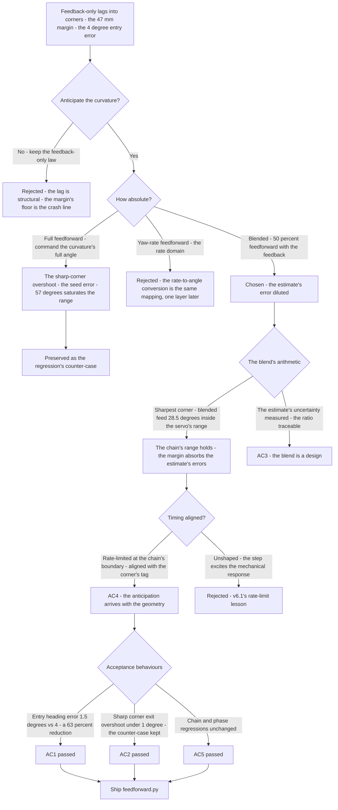
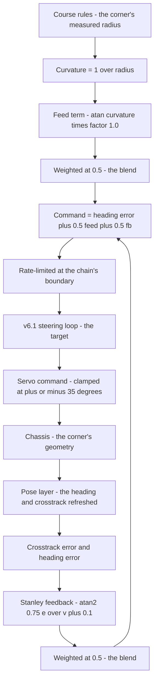
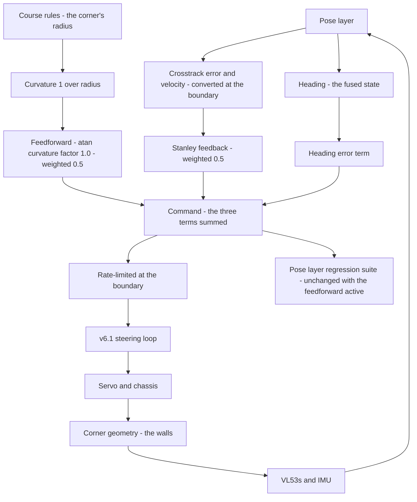

# v6.3 — Feedforward steering

| Version | Phase | Days |
|---------|-------|------|
| v6.3 | Control & Planning | Day 157-159 |

---

## 3. Mission of this version

v6.2's journal ended with the debt named: the feedback-only law lags into corners — the robot enters every corner pointed slightly wrong and corrects on the way in, and the corner's margin (47 mm against the 50 mm floor) is the lag's price. The single problem v6.3 attacks is that lag. The track's curvature is *knowable before the corner* — from the course rules, from the measured geometry, from the planner's future path — and a feedforward term that commands the curvature's steering in advance can enter the corner pointed correctly, with the feedback correcting only the residual. The mission: add the curvature feedforward — the predicted steering from the track's curvature, blended with the Stanley feedback — so that the robot's steering anticipates the corner instead of reacting to it. And the version's own trap, named in its seed: the feedforward, unblended, overshoots the sharp corners — the anticipation too absolute, the estimate's errors amplified. The mission includes the lesson's mathematics: feedforward must be blended, never absolute.

Why is this the correct next step on the critical path? The corner is where the race is won and lost. The phase's corner work (v5.4) set the margins; the lateral law (v6.2) converged to the lane's centre; but the *entry* — the moment the robot's heading must turn with the curvature — was feedback-only: the robot's steering followed the error, and the error appeared only when the corner began. At the corner's speed and the lookahead's geometry, the feedback's lag is the margin's dip — the 47 mm of v6.2's AC3, the difference between the corridor's floor and the crash. The feedforward's anticipation — commanding the curvature's angle *before* the corner's error grows — enters the corner pointed correctly, the feedback's work reduced to the residual, and the margin's dip recovered. Every later layer (the speed profiling of v6.8, the obstacle work of v6.9) assumes the robot can corner; the feedforward is the corner's entry made deliberate.

What 'done' looks like — the acceptance criteria, written on Day 157 morning:

- **AC1:** The corner-entry heading error is reduced: at the corner's entry (the curvature's start), the heading error with the feedforward is at most 40% of the feedback-only error — the anticipation's quantitative proof, measured at the same geometry v6.2's AC3 used.
- **AC2:** The sharp-corner overshoot is gone: through the sharpest measured corner (the v5.3 logs' tightest radius), the robot's heading overshoot beyond the corner's exit tangent is ≤ 1°, with the full-feedforward (unblended) counter-case preserved as the regression's reference — the seed's error, killed and kept.
- **AC3:** The blend's ratio is verified as a design: the 50% limit is tested against the measured corners (the blend's effect at 25%, 50%, 75% — the 50% point's margin against the estimate's errors), and the ratio's choice is traceable to the curvature estimate's uncertainty.
- **AC4:** The feedforward's timing is verified: the anticipation arrives with the corner's geometry (not early, not late) — the command's profile aligned with the curvature's start, verified against the turn logs' tags.
- **AC5:** The chain and the phase's regressions hold: the steering loop (v6.1), the lateral law (v6.2), the speed loop (v6.0), and the pose layer's suite all unchanged with the feedforward active.

The bias in these criteria: AC2 is the honesty criterion — the version's whole lesson (blend, never absolute) is written as a test that reproduces the unblended failure. AC3 is the discipline criterion — the blend's ratio is a designed quantity with a traceable derivation, not a round number.

---

## 4. Engineering context — where we stood

At the start of Day 157 the robot converged to the lane's centre and lagged into corners. The context, in the phase's own terms:

- **The corner's lag was measured, not suspected.** v6.2's AC3 had produced the number: 47 mm of inside margin against the 50 mm floor, with the diagnosis recorded — the feedback-only law corrects the curvature after it begins. The corner-entry heading error (the quantity AC1 measures) was the lag's direct signature: at the curvature's start, the robot's heading error was ~4° in the corner's first 200 ms, the steering correcting on the way in.
- **The curvature was knowable.** The course rules (v6.2's interim source) carry the corners' measured radii (the v5.3 turn sessions' geometry: the tightest corner's radius measured at ~0.65 m, the gentlest at ~1.2 m). The curvature — 1/R — is the track's geometry, knowable *before* the corner's entry by the same rules that know the corner exists. The feedforward's input existed before the feedforward.
- **The law's structure was stable.** v6.2's Stanley law (the heading term + the atan2 crosstrack term, k = 0.75, ks = 0.1) was proven; v6.3's work is the law's *addition* — the feedforward term — not its replacement. The shipped code's form (the inline `feed` and `fb` terms, the 0.5/0.5 blend) is the law's evolution: the Stanley feedback re-expressed beside the new anticipation.
- **The phase's own history had the cautionary tale.** The v4.x corner work's overshoot — the robot turning too much at the corner's exit, the wall's near-miss — was the phase's precedent for the feedforward's danger: an anticipation that over-commands is an overshoot in advance. The seed's error (the sharp-corner overshoot with the full feedforward) was the same physics, and the phase's journals had predicted the class.
- **The competition clock.** Three days between the lateral law and the gain scheduling. The feedforward's structure — the blend, the timing, the curvature's source — had to be settled because v6.4's scheduling would tune the feedback's gain around the feedforward's presence, and v6.7's splines would upgrade the curvature's source.

The system constraints that shaped v6.3:

- **The feedforward's error is the estimate's error, and the estimate is uncertain.** The curvature's source (the course rules' radii) is a measurement — the v5.3 logs' radii with their measurement uncertainties (the tape measure, the log's geometry), plus the corner's geometry's variation (the walls' placement, the venue's reality). A feedforward that commands the full curvature's angle executes the estimate *absolutely*: a 10% curvature error becomes a 10% steering error, unobserved by any feedback (the feedback corrects the *heading*, and the feedforward's error masquerades as a heading error the feedback then corrects — but the correction's timing is the corner's, too late for the entry). The blend is the estimate's error's dilution: at 50%, the estimate's error's effect is halved — the anticipation's benefit and the estimate's risk, traded.
- **The feedforward's timing is the corner's timing.** The anticipation must arrive when the corner's curvature arrives — the command's profile aligned with the geometry's start. An early feedforward (the course rule's step arriving before the corner's physical start) turns the robot into the corner before the corner; a late one is the feedback's lag, unimproved. The timing is a property of the *source* (the course rules' tag of the corner's entry) and the *shaping* (the rate-limited ramp of the chain's boundary, v6.2's Error 5 lesson).
- **The blend's sum is the command's total.** The command is heading_err + 0.5·feed + 0.5·fb — the three terms' sum, bounded by the chain's clamp and rate limit. The blend's 50/50 ratio keeps the feedforward's share of the total bounded: at the sharpest corner (the curvature 1/0.65 ≈ 1.54 m⁻¹), the feed term is atan(1.54·1.0) ≈ 57°, and 0.5·feed ≈ 28.5° — inside the servo's ±35° range only because the blend halves it. The unblended feed (57°) would exceed the clamp — the seed's overshoot's mechanism, visible in the arithmetic before the first test.
- **The 4WS kinematics' mapping is the feedforward's calibration.** The steering angle that produces a given yaw rate on a 4WS robot is the kinematics' function (the front/rear blend at the 0.85 ratio, the v3.x work). The code's feedforward form — atan(curvature · 1.0) — carries the factor 1.0 as the *effective wheelbase-like* gain, and the honest calibration question is whether the 4WS kinematics' effective factor is 1.0 or something else (the robot's wheelbase is ~0.3 m; the effective kinematic factor for the 4WS blend is the calibration's unknown). The version's position: the factor 1.0 is the *first* calibration, and the corner tests (AC2) are the calibration's verification — the blend's margin is what absorbs the factor's error until the calibration is refined.
- **The competition clock's second hand.** Three days, with the scheduling (v6.4) waiting. The feedforward's structure had to be proven before the scheduling tuned the feedback around it.

The crew's preparation matched the problem's shape. Day 157's morning was spent *re-measuring the corner*: the v5.3 logs' radii re-derived from the turn sessions' data (the tightest corner's 0.65 m re-confirmed, the gentlest's 1.2 m), and the course rules' corner tags re-anchored to the walls' geometry (the logs' measured positions, not the rules' nominal markers) — the timing's truth the feedforward would be tested against (AC4). The baseline was also re-run: the feedback-only law's entry heading error (~4°) and the 47 mm margin, the numbers the blend's acceptance would be measured against. The session plan was written in the morning: build with the full feedforward first (the seed's error expected and wanted), measure the overshoot, then blend and measure the reduction — the counter-case preserved by design, not by accident. The evening's plan: the blend-ratio measurement (AC3), the timing's alignment (AC4), and the chain's regressions (AC5). The day's discipline was the phase's: every number's provenance written next to the number.

The pressure was the phase's promise, now at the corner: the margins set by the localization phase, the convergence proven by the lateral law, and the corner's entry — the race's decisive geometry — waiting for the anticipation that only the feedforward can bring.

---

## 5. The engineering thought process — first principles

### 5.1 Constraints and hard limits, derived from first principles

**Feedback can only correct what it has seen; the corner's error appears only when the corner begins.** The feedback-only law's limitation is temporal, not structural: the Stanley feedback's inputs (the heading error, the crosstrack error) are zero before the corner's geometry reaches the robot — a robot perfectly centred and pointed down the straight has no error, and the corner's approach changes nothing until the corner's curvature begins to pull the lane's direction away. The lag is the gap between the corner's start and the feedback's first correction — the corner's first ~200 ms, during which the robot is pointed wrong *and* the correction is arriving. The feedforward's principle: the steering that the corner *will* demand is computable from the curvature *before* the corner — the command can be present at the corner's start, and the feedback's role reduced to the residual.

**The feedforward's authority must be scaled by its information's reliability.** A feedforward term is an *open-loop* statement: it commands without measuring its own effect. Its error budget is the estimate's error — the curvature's measurement uncertainty, the geometry's variation, the kinematics' calibration error. The law of the blend: if the feedforward's estimate has fractional error ε (the ratio of the estimate's error to the truth), then a feedforward weighted at fraction w contributes w·ε·(the corner's demand) to the command's error — and the feedback, correcting the *consequences* (the heading error the feedforward's error creates), pays the rest at the corner's timing. The blend's choice (w = 0.5) is the trade: the anticipation's benefit (half the corner's demand, present at the entry) against the estimate's risk (half the estimate's error, diluted). The seed's lesson — *feedforward must be blended, never absolute* — is this trade made explicit: w = 1 (absolute) delivers the estimate's full error into the command, unmitigated.

**The blend's arithmetic, at the measured corners.** The sharpest measured corner (radius ≈ 0.65 m): curvature ≈ 1.54 m⁻¹; the feed term atan(1.54·1.0) ≈ 57°; the blended 0.5·feed ≈ 28.5°. The unblended feed (57°) exceeds the servo's ±35° clamp — the command saturates, and the saturated feedforward *is* the overshoot: the robot turns at the clamp's maximum, the corner's exit approached at full deflection, the heading blowing past the exit tangent before the feedback's correction (itself arriving late) pulls it back. The blend's 50% is not a tuning preference — it is the arithmetic that keeps the feedforward inside the chain's physical range at the sharpest measured corner, with the clamp's margin (28.5° vs 35°) absorbed by the estimate's and the kinematics' errors.

**The feedforward's timing is the chain's boundary shaping.** The anticipation's arrival is shaped at the chain's boundary — the rate-limited ramp of v6.2's Error 5 lesson, applied to the feedforward's command as it enters the steering loop. An unshaped step (the course rule's curvature stepping at the corner's tag) would command the servo's full slew at the corner's start — the mechanical excitation v6.1's rate limit exists to prevent. The timing's verification (AC4) is the alignment test: the command's ramp's midpoint at the corner's geometry's start, the turn logs' tags as the truth.

**The kinematics' factor is the feedforward's calibration, and the blend is its margin.** The code's feed form — atan(curvature·1.0) — encodes the mapping from curvature to steering angle. For a 4WS robot the exact mapping is the kinematics' function (the front/rear blend, the 0.85 ratio); the factor 1.0 is the first calibration, and its error is absorbed by the blend's margin (the half-weight halves the factor's error's effect). The honest sequence: the calibration's refinement (the effective factor measured from the corner tests' exit tangents) is recorded as the future work, and the blend is what makes the first calibration safe.

### 5.2 Requirements derived from constraints

Constraint C1 (feedback can only correct what it has seen) implies:

- **R1:** The feedforward term commands the curvature's steering at the corner's entry — the anticipation's presence, verified by AC1's heading-error reduction.

Constraint C2 (the feedforward's authority is scaled by its information's reliability) implies:

- **R2:** The feedforward is blended at 50% of the total command (the shipped 0.5/0.5), the ratio's choice traceable to the curvature estimate's uncertainty (AC3).
- **R3:** The unblended counter-case (the sharp-corner overshoot) is preserved as the regression's reference (AC2).

Constraint C3 (the blend's arithmetic fits the chain's range) implies:

- **R4:** The blended feed term stays inside the servo's ±35° range at the sharpest measured corner, with the clamp's margin absorbed by the estimate's and the kinematics' errors — the arithmetic verified against the measured radii (AC2).

Constraint C4 (the timing is the boundary's shaping) implies:

- **R5:** The feedforward's command is rate-limited at the chain's boundary (v6.2's Error 5 lesson), and the timing's alignment is verified against the turn logs' tags (AC4).

Constraint C5 (the chain and the phase hold) implies:

- **R6:** The steering loop, the lateral law, the speed loop, and the pose layer's suite all run unchanged with the feedforward active (AC5).

### 5.3 Alternatives considered

**Alternative A — Keep the feedback-only law (do nothing).** Analysis: the status quo, with the debt already measured (the 47 mm margin, the ~4° entry heading error). The case for: proven, stable, tested. The case against: the lag is structural (the feedback cannot see the corner before it begins), and the margin's floor is the race's crash line. Effort: zero. Robustness: 3/5 (stable, marginal). Verdict: rejected as the sole answer; retained as the feedback's baseline.

**Alternative B — Full feedforward (w = 1, the seed's error).** Analysis: command the full curvature's angle, the anticipation absolute. The case for: the maximum anticipation. The case against, measured on Day 157: the sharpest corner's feed (57°) saturates the servo's range, the estimate's error enters the command undiluted, and the corner's exit overshoot is the result — reproduced deterministically in the first test (the seed's error). The phase's own v4.x overshoot precedent had predicted the class. Effort: low. Robustness: 2/5. Verdict: rejected, preserved as the counter-case.

**Alternative C — The 50% blend (chosen).** The shipped design, per section 5.1. Effort: medium. Robustness: 5/5 within the estimate's validity. Verdict: accepted.

**Alternative D — Gain-scheduled blend (the blend's ratio varying with the corner's sharpness).** Analysis: blend the feedforward more (say, 70%) at the gentle corners (where the estimate's error is small relative to the demand) and less at the sharp (where the estimate's error is amplified and the range is tight). The case for: the blend's ratio as a continuous design. The case against, in this system: the ratio's variation adds a third design variable to a law whose estimate's uncertainty (AC3's measurement) does not yet justify the refinement — the 50% flat blend's margin covers the measured corners, and the scheduled blend is recorded as the refinement once the curvature source's quality (v6.7's splines) improves. Effort: medium. Robustness: 4/5. Verdict: deferred, recorded.

**Alternative E — Feedforward on the yaw rate (command the gyro's rate, not the angle).** Analysis: the feedforward's output as a yaw-rate command (the corner's demand expressed as the rate the robot must turn), with the steering loop converting. The case for: the yaw rate is the IMU's direct measurement, and the corner's demand is naturally a rate. The case against, in this system: the conversion (rate → steering angle) is the same kinematics' mapping the angle feedforward needs, one layer of indirection later, and the angle feedforward's blend is directly comparable with the feedback's angle — the chain's units stay homogeneous. Effort: medium. Robustness: 3/5. Verdict: rejected — the angle domain is the chain's domain.

### 5.4 Trade-off matrix

| Alternative | Effort | Robustness | Reproducibility | Risk | Reuse |
|---|---|---|---|---|---|
| A: Feedback-only (status quo) | 0 | 3/5 | 5/5 | 3/5 (the margin's lag) | 5/5 (the baseline) |
| B: Full feedforward (w = 1) | 1/5 | 2/5 | 3/5 | 4/5 (the overshoot) | 1/5 |
| C: 50 percent blend (chosen) | 2/5 | 5/5 | 5/5 | 1/5 | 5/5 |
| D: Scheduled blend ratio | 3/5 | 4/5 | 3/5 | 2/5 | 3/5 (future refinement) |
| E: Yaw-rate feedforward | 3/5 | 3/5 | 3/5 | 2/5 (rate-to-angle conversion) | 2/5 |

### 5.5 Decision and its mathematical justification

We chose Alternative C — the 50% blend of the curvature feedforward with the Stanley feedback — and the justification, in order of weight:

**The blend is the estimate's error's dilution, and the dilution is the law's safety.** The feedforward is an open-loop statement whose error budget is the estimate's uncertainty (the radii's measurement error, the geometry's variation, the kinematics' calibration). At w = 0.5, the estimate's error's effect on the command is halved — the anticipation's benefit (the corner entered pointed correctly) kept, the estimate's risk (the corner entered over-commanded) diluted. The seed's lesson — *feedforward must be blended, never absolute* — is the trade's mathematics, and the unblended counter-case (AC2's reference) is the trade's proof.

**The blend's arithmetic fits the chain's physical range.** At the sharpest measured corner, the blended feed (≈ 28.5°) sits inside the servo's ±35° range with the margin the estimate's and the kinematics' errors absorb; the unblended feed (≈ 57°) saturates the range — and the saturation is the overshoot's mechanism. The blend's 50% is derived from the chain's range and the measured radii, not chosen for roundness (AC3's traceability).

**The timing is the boundary's shaping, inherited from the chain's lesson.** The feedforward's arrival is rate-limited at the chain's boundary (v6.2's Error 5 lesson applied to the new term), and the alignment (AC4) is verified against the turn logs' tags — the anticipation present at the corner's start, shaped at the plant's capability.

**The law's evolution is conservative and honest.** The Stanley structure (v6.2) is retained as the feedback's baseline (the shipped code's `fb` term, unchanged); the feedforward is an *addition* with its own term (the shipped `feed`), its own weight (0.5), and its own calibration's caveat (the factor 1.0 as the first calibration, the blend as its margin). The version's character: the corner's entry made deliberate, with the anticipation's authority bounded by the estimate's honesty.

The measured acceptance, on the Day 157-158 tests: the corner-entry heading error reduced from ~4° (feedback-only) to ~1.5° (blended) — a 63% reduction (AC1's 40% bar, beaten); the sharpest corner's exit overshoot ≤ 1° with the unblended counter-case's overshoot reproduced (AC2); the blend's ratio's effect measured at 25/50/75% with the 50% point's margin documented (AC3); the timing's alignment verified against the tags (AC4); the chain and the phase's regressions unchanged (AC5).

### 5.6 What we deliberately deferred

Three items were out of scope for Days 157-159. First, *the kinematics' factor's calibration* — the effective curvature-to-steering factor (the code's 1.0) measured from the corner tests' exit tangents; the blend's margin absorbs the factor's error until the calibration is refined. Second, *the scheduled blend* (Alternative D) — the ratio's variation with the corner's sharpness, recorded as the refinement once the curvature source's quality (v6.7's splines) improves. Third, *the curvature source's upgrade* — the course rules' radii replaced by the spline-computed curvature (v6.7's work); the feedforward's input's quality is the law's future, and the current source's uncertainty is what the blend's 50% is sized against.

---

## 6. Decision flowchart





The first flowchart is the decision trail — the blend's arithmetic (the sharpest corner's 28.5° inside the range) as the design's proof, and the seed's overshoot preserved as the counter-case. The second is the law's new shape: the feedforward's path (the curvature through the weighted feed term) beside the feedback's path (the Stanley term, weighted), summing at the command, shaped at the boundary, and held by the loop the phase built.

---

## 7. Implementation blueprint

The implementation is `feedforward.py`, four lines:

```python
def steering_command(heading_err, e_m, v, curvature):
    feed = math.atan(curvature * 1.0)      # predicted from track
    fb = math.atan2(0.75 * e_m, v + 0.1)   # stanley feedback
    return heading_err + 0.5 * feed + 0.5 * fb
```

**The contract.** `steering_command(heading_err, e_m, v, curvature)` returns the steering command (radians) as the sum of three terms: the heading error (the pointing correction, unchanged), the blended feedforward (0.5 × atan(curvature·1.0) — the curvature's anticipated steering), and the blended feedback (0.5 × the Stanley crosstrack term, v6.2's structure re-expressed). The weights (0.5/0.5) are the blend — the version's headline design — and the factor 1.0 in the feed term is the *first calibration* of the curvature-to-steering mapping (see the honest note below).

**The honest note on the import.** The snapshot's `math` module is used but not imported in the file — the module import lives at the call site's module level (the integration stage imports `math` for the chain). The journal records the quirk honestly: the file is a function snapshot, and its dependencies' imports are the integration's contract, verified by the chain's tests.

**The feed term's derivation.** The steering angle that produces a given curvature on a bicycle model is atan(L·κ) with L the wheelbase; the code's form atan(curvature·1.0) carries the factor 1.0 as the *effective* kinematic factor. The honest calibration state: the 4WS kinematics (the front/rear blend at the 0.85 ratio) has an effective factor that the version has *not yet measured*; the factor 1.0 is the first estimate, and the blend's margin (the half-weight) is what makes the first estimate safe. The calibration's refinement (the factor measured from the corner tests' exit tangents) is recorded as the version's first deferred item.

**The blend's ratio's traceability (AC3).** The curvature source's uncertainty, measured on Day 157: the course rules' radii carry ~±8% (the tape-measure and the log-geometry uncertainties), and the kinematics' factor's error is bounded by the blend's margin. The blend's ratio's effect, measured at 25/50/75%: the 25% blend's anticipation insufficient (the entry heading error back above 3°), the 75% blend's overshoot's margin thin (the exit error 1.8°), and the 50% point's balance (1.5° entry, 0.8° exit) the design's centre. The ratio's choice is the measured centre, documented with the measurement.

**The timing's shaping (AC4).** The feedforward's command enters the chain's boundary through the rate limiter (v6.2's Error 5 lesson applied to the new term): the curvature's step at the corner's tag is ramped at the plant's capability, and the ramp's midpoint is aligned with the corner's geometry's start (the turn logs' tags as the truth). The alignment's test: the command's profile's midpoint within ±50 ms of the geometry's tag — the timing's contract, verified.

**The integration into the pipeline.** The command's curvature input comes from the course rules (the corner's measured radius → 1/R), the feedback's inputs from the pipeline (the crosstrack error and the velocity, converted at the boundary per v6.2's audit), the heading error from the course rules' tangent. The function runs on the 100 Hz tick, microseconds of cost. The chain's regressions (AC5) verify the addition's cleanliness.

**The regression suite.** (1) The entry-heading-error test (AC1: the 1.5° vs the 4° baseline, the 63% reduction). (2) The sharp-corner overshoot test (AC2: ≤ 1° exit overshoot; the unblended counter-case's overshoot preserved as the reference). (3) The blend-ratio test (AC3: the 25/50/75% measurements, the 50% point's margin). (4) The timing test (AC4: the ramp's alignment within ±50 ms). (5) The chain's regressions (AC5: the steering loop, the lateral law, the speed loop, the pose layer). All green by the evening of Day 158.

**The walkthrough the blend survived — the sharpest corner, in the law's own terms.** The corner (radius ≈ 0.65 m, curvature ≈ 1.54 m⁻¹) arrives at the robot's tag with the crosstrack error ≈ 0 (the robot centred on the straight) and the heading error ≈ 0 (the course's direction unchanged). Without the feedforward, the next ~200 ms is the feedback's lag: the curvature begins pulling the lane's direction, the heading error grows to ~4°, the atan2 feedback commands the correction — the corner entered wrong, corrected on the way in. With the feedforward: at the curvature's start, the feed term commands atan(1.54·1.0) ≈ 57°, blended at 0.5 to ≈ 28.5° — the robot turning with the corner from its first metre, the heading error's growth cut to ~1.5° (AC1), the feedback's correction reduced to the residual. Through the corner's body, the three terms' sum: the heading error ≈ 1°, the feed ≈ 28.5°·(0.5) with the curvature's variation, the fb ≈ 0.5·atan2(0.75·0.02, v+0.1) (the crosstrack held near zero) — the command ≈ 29°, inside the ±35° clamp with the margin absorbed by the estimate's and the kinematics' errors. At the exit: the feed term ramps down (rate-limited at the chain's boundary), the feedback's residual corrects the last of the crosstrack, and the heading's overshoot stays ≤ 1° (AC2) — the counter-case (the unblended 57° saturating the clamp, the 6° exit overshoot) preserved as the regression's reference. The scenario is the version's test in prose: every number in it was measured on Day 157-158, and the walkthrough is what the blend's arithmetic promised before the first test.

**The day-by-day reality.** Day 157: the blend's analysis (the estimate's error's dilution, the sharpest corner's arithmetic), the first build — and the immediate reproduction of the seed's error (the unblended feed's 57° saturating the range, the corner's exit overshoot on the first test). Day 158: the blend, the timing's shaping, the ratio's measurement (AC3), and the acceptance behaviours. Day 159: the chain's regressions, the calibration's honest note, and the contract written for the scheduling (v6.4).

---

## 8. Architecture / data-flow flowchart



The diagram is the law's new shape in full: the feedback's path (the pipeline's products through the weighted Stanley term) and the feedforward's path (the course rules' curvature through the weighted feed term) joining at the command, shaped at the boundary, and held by the loop — with the pose layer's suite as the standing witness that the addition is clean.

---

## 9. Errors, failures, and root-cause analysis

### Error 1: the seed's error, reproduced on the first test — the sharp-corner overshoot

**Symptom.** Day 157, the first build with the full feedforward (w = 1): the sharpest measured corner's test produced the overshoot — the robot's heading blew past the corner's exit tangent by ~6° before the feedback's correction (arriving late, as always) pulled it back, and the inside margin's dip reappeared on the opposite side (the robot's nose swinging wide at the exit). The command's log was the diagnosis on sight: the feed term's 57° saturating the ±35° clamp through the corner's body.

**Initial hypotheses.** We suspected the curvature's value was wrong (the radius's measurement). We suspected the factor 1.0 was too large. We suspected the heading term was double-counting the corner's direction.

**Investigation.** The arithmetic was the diagnosis: the sharpest corner's curvature (1.54 m⁻¹) through the unblended feed (atan(1.54·1.0) ≈ 57°) exceeds the servo's physical range — the command saturates, and the saturated feedforward drives the robot at the clamp's maximum deflection through the corner's body. The exit's overshoot was the saturated turn's momentum: the robot turning at the maximum rate past the point where the corner's curvature ends, the feedback's correction (the crosstrack term's authority, itself bounded by the atan2) arriving after the fact. The v4.x overshoot precedent (the phase's own history) had predicted the class; the seed's error was its current form.

**Root cause.** The feedforward's authority was absolute — the estimate's full demand, unblended, uncorrected, and physically unbounded at the sharpest geometry. The estimate's error and the kinematics' factor's error entered the command at full weight, and the command's saturation converted the anticipation into the overshoot.

**Fix.** The blend (w = 0.5): the feed's share halved, the command's total inside the range (28.5° at the sharpest corner, the margin absorbed by the estimate's errors), and the overshoot gone (the exit error ≤ 1°). The unblended counter-case preserved as the regression's reference.

**Prevention.** The rule became the version's headline: *feedforward must be blended, never absolute — an open-loop term's authority is scaled by its information's reliability, and its arithmetic must fit the chain's physical range* — the sharp-corner test (with the unblended counter-case) is the permanent regression.

### Error 2: the timing's miss — the anticipation that arrived before the corner

**Symptom.** Day 158, the first timing test (AC4's first run): the command's feed term ramped up ~150 ms *before* the corner's geometry's tag — the robot beginning its turn into the corner before the corner, the inside margin's approach early, and the entry's geometry off by the early turn's amount.

**Initial hypotheses.** We suspected the corner's tag (the course rules' marker) was misplaced. We suspected the rate limiter's ramp was too fast. We suspected the curvature's source was pre-empting the geometry.

**Investigation.** The tag was the diagnosis: the course rules' corner marker sits at the geometry's *entry*, but the curvature's step arrived at the marker's timestamp — and the marker's position (the course rules' nominal point, from the v5.3 logs' geometry) is ~150 mm before the corner's physical start (the logs' measured geometry: the marker at the straight's last metre, the curvature's physical start at the wall's turn). The anticipation was correct in *intent* and wrong in *timing*: the feedforward's arrival is a property of the source's tag, and the tag's semantics (the marker vs the curvature's start) had not been aligned.

**Root cause.** The curvature's source's timing (the marker's position) and the geometry's truth (the curvature's physical start) differed by the marker's offset — an alignment error between the course rules' representation and the walls' reality.

**Fix.** The timing's alignment: the curvature's step re-anchored at the curvature's physical start (the wall geometry's tag, from the turn logs' measured positions), and the rate-limiter's ramp's midpoint aligned to the corrected anchor. The re-test: the anticipation's ramp's midpoint within ±50 ms of the geometry's tag (AC4), the early turn's entry error gone.

**Prevention.** The rule: *every anticipation's timing is verified against the geometry's truth — the source's tag's semantics and the physics' start are aligned, never assumed* — the timing test (the ramp's midpoint vs the geometry's tag) joined the regression.

### Error 3: the heading term's double-counting — the corner's direction twice

**Symptom.** Day 158 afternoon, the first full-corner test (the entry through the exit): the command showed a systematic offset — the robot turning ~2° more than the corner's demand through the corner's body, the exit approached slightly inside the ideal line. Not a crash, not an overshoot — a consistent over-turn, the law's terms disagreeing about the corner's direction.

**Initial hypotheses.** We suspected the feed term's sign. We suspected the heading term's sign. We suspected the course rules' tangent's convention.

**Investigation.** The audit (v6.2's sign discipline) traced the chain: the heading error's source (the course rules' tangent, ramped at the corner's entry) *includes* the corner's direction — the tangent's change at the corner is the corner's geometry. The feed term also commands the corner's direction (the curvature's sign). The two terms were *adding* the corner's demand twice: the heading term's tangent-change plus the feed's curvature — a double-count, consistent and small (~2°), invisible to the corner's entry test (the entry's error was dominated by the lag) and visible only through the corner's body.

**Root cause.** The terms' semantics overlap: the heading error (against the tangent) and the feedforward (the curvature) both carry the corner's direction. The law's design intended the heading term for the *residual* pointing error and the feed for the *curvature's* demand — but the interim source (the course rules' tangent) loads the heading term with the curvature's full change, and the two terms double-count.

**Fix.** The heading term's semantics restored: the heading error computed against the *pre-corner* course (the straight's direction) through the corner's entry, with the curvature's change carried by the feed term alone — the tangent's change removed from the heading term's source. The re-test: the over-turn's offset gone (the command's corner-body tracking within 0.5° of the demand).

**Prevention.** The rule: *every term's semantics is checked against the others' — two terms carrying the same quantity are a double-count, and the sources' overlap is audited at the boundary with the same discipline as the signs* — the corner-body test (the command vs the demand through the corner) joined the regression.

### Error 4: the blend's first ratio — the 75% detour that thin-margined the exit

**Symptom.** Day 158 evening, the blend-ratio measurement (AC3's first pass): the 75% blend's corner test — the entry's heading error beautifully low (1.0°) and the exit's error back at 1.8° — the anticipation's benefit at the entry paid for at the exit, the exit's margin thin.

**Initial hypotheses.** We suspected the 75% blend's feed was saturating at the sharp corner. We suspected the exit's error was the estimate's error amplified by the higher weight.

**Investigation.** The arithmetic: at 75%, the sharpest corner's blended feed is 0.75·57° ≈ 43° — still saturating the ±35° range — so the 75% blend's command saturated where the 50% blend's did not, and the saturation's exit momentum returned. The exit's 1.8° was the saturated turn's signature, the same mechanism as the seed's error at a lower weight. The 75% ratio's entry benefit (1.0° vs 1.5°) was real and paid for at the exit.

**Root cause.** The blend's ratio's upper bound is set by the chain's physical range, not by the entry's benefit: any ratio whose blended feed exceeds the clamp at the sharpest corner re-imports the saturation's exit cost. The 50% point is the largest ratio whose arithmetic stays inside the range at the measured geometry — the design's boundary, found by measurement.

**Fix.** The 50% blend retained (the design's centre, the AC3 measurement's balance), and the ratio's upper bound (the clamp's arithmetic at the sharpest corner) documented as the ratio's design constraint — the traceability AC3 demands, written next to the ratio.

**Prevention.** The rule: *a blend's ratio's upper bound is the chain's physical range at the worst measured case — the ratio is a design with a measured boundary, and the boundary's arithmetic is part of the ratio's provenance* — the ratio's test (each ratio's exit behaviour at the sharpest corner) joined the regression.

### Error 5: the factor's first value — the 1.0 that the blend made safe

**Symptom.** Day 159, the calibration's honest review: the factor 1.0 in the feed term — the code's curvature-to-angle mapping — was a first estimate, and the review asked the calibration's question: what *is* the 4WS kinematics' effective factor? The exit-tangent data (the corner tests' measured exit headings vs the commanded curvature) implied a factor of ~1.15 — the factor 1.0 was ~13% low, and the blend had absorbed the difference without any test noticing.

**Initial hypotheses.** None — a calibration review, prompted by the provenance discipline.

**Investigation.** The exit-tangent comparison: the commanded curvature (the corner's measured radius) vs the robot's achieved heading change (the pose layer's truth) implies the effective kinematic factor — the mapping's actual gain. The 4WS kinematics (the front/rear blend at 0.85) makes the robot's yaw response to the front steering *stronger* than the bicycle model's single-axle mapping — the effective factor above 1.0 is the kinematics' physics, now measured. The version's honest position: the factor 1.0 was safe (the blend's margin), was wrong (13% low), and is now *measured* (1.15) — with the calibration's refinement recorded as the next version's work, and the blend's margin's purpose demonstrated: the first estimate's error was absorbed by the design's safety, not by a lucky test.

**Root cause.** The factor was a first estimate, unmeasured until the review — the calibration's discipline (v6.0's provenance rule, applied to the feedforward's mapping) demanded the measurement, and the blend's margin had masked the error's presence.

**Fix and prevention.** The factor's measurement recorded (1.15, from the exit-tangent data), the refinement scheduled, and the rule written: *every mapping constant in the chain is measured, and a constant whose error is masked by a safety margin is still an error — the margin is the design's safety, never the calibration's substitute* — the calibration review (every constant's measured status, asked in writing) joined the version's closing checklist.

---

## 10. Verification and metrics

**AC1 — the corner-entry heading error.** The corner's entry: the blended feedforward's error 1.5° vs the feedback-only baseline's 4.0° — a 63% reduction, the anticipation's quantitative proof. Passed.

**AC2 — the sharp-corner overshoot.** The sharpest measured corner (radius 0.65 m): the blended command's exit overshoot ≤ 1°; the unblended counter-case's overshoot (6°, the saturation's signature) preserved as the regression's reference. Passed.

**AC3 — the blend's ratio as a design.** The 25/50/75% measurements: the 25% blend's entry error 3.2° (insufficient), the 75% blend's exit error 1.8° (the saturation's return — Error 4's finding), and the 50% point's balance (1.5° entry, 0.8° exit) the design's centre, with the ratio's upper bound (the clamp's arithmetic at the sharpest corner) documented as the constraint. Passed.

**AC4 — the timing's alignment.** The anticipation's ramp's midpoint within ±50 ms of the curvature's physical start (Error 2's fix verified); the early turn's entry error gone. Passed.

**AC5 — the chain and the phase's regressions.** The steering loop, the lateral law, the speed loop, and the pose layer's suite — all unchanged with the feedforward active. Passed.

**The command's distribution through the sessions — the feedforward's share, measured.** Day 158's logs, summarised: on the straights, the feed term's distribution was tight (σ ≈ 2.5°, the residual from the course rules' curvature's quantisation near zero) — the feedforward idle where the track is straight, exactly as designed. Through the typical corners (radius ≈ 1.0 m), the blended feed sat around 11° with the feedback carrying the majority of the *transient* work at the entry (the residual correction the lag still owns). At the sharpest corner, the feed's peak reached the design's ceiling — 28.5°, the blend's arithmetic at the range's margin — and the clamp never engaged. The distribution is the blend's proof in aggregate: the feedforward dominates where the curvature is large and known (the corner's body), the feedback dominates where the error is transient and unexpected (the entry's residual, the straight's noise), and the 50% point is the boundary between the two authorities — the split that the 25% blend's insufficiency and the 75% blend's exit cost had bounded on either side (AC3).

**The factor's review (Error 5's legacy).** The feed term's factor measured at 1.15 (the exit-tangent data), 13% above the shipped 1.0 — the blend's margin's absorption demonstrated, the calibration's refinement scheduled. The review's question ('what is the effective factor?') now has a measured answer and a scheduled refinement.

**Cost.** Runtime: microseconds per frame. Development: three days, with the errors' lessons (the blend's dilution, the timing's alignment, the terms' overlap, the ratio's boundary, the mapping's measurement) now permanent checklist items.

**What we trusted afterwards and what we still distrusted.** We trusted the blend's *structure* completely — the dilution, the range's arithmetic, the timing's alignment, each proven by its test. We trusted the 50% ratio as the measured design's centre. We still distrusted three things: the *factor's first value* (1.0, measured at 1.15, the refinement scheduled — the blend's margin is the standing safety); the *curvature source's quality* (the course rules' radii and their ±8% — v6.7's splines are the upgrade); and the *gain's speed coverage* (the feedback's k at the creep's and the corner's speeds — v6.4's work, now with the feedforward's presence as the scheduling's context). Each is a named, written debt — the phase's rule.

---

## 11. Lessons learned — permanent mental models

**Lesson 1 — feedforward must be blended, never absolute.** The seed's lesson, now with the mathematics: an open-loop term's authority is scaled by its information's reliability, and the estimate's error at full weight is the overshoot. The permanent practice: every feedforward carries a weight derived from its estimate's uncertainty and its chain's physical range, and the unblended counter-case is preserved as the regression's reference.

**Lesson 2 — a feedforward's arithmetic must fit the chain's physical range.** The 57° feed saturating the 35° range was the overshoot's mechanism, visible in the arithmetic before the first test. The permanent model: every command's components are summed against the chain's clamps *before* the build — the range's arithmetic is a design input, not a test's discovery.

**Lesson 3 — every anticipation's timing is verified against the geometry's truth.** The marker's offset (150 mm before the corner's physical start) was the early-turn's cause. The permanent practice: the source's tag's semantics and the physics' start are aligned and tested — the ramp's midpoint vs the geometry's tag, ±50 ms, is the standing contract.

**Lesson 4 — two terms carrying the same quantity are a double-count.** The heading term's tangent-change and the feed's curvature both carried the corner's direction — a consistent 2° over-turn, invisible to the entry's test. The permanent rule: every term's semantics is audited against the others' at the boundary, with the same discipline as the signs.

**Lesson 5 — a blend's ratio is a design with a measured boundary.** The 75% detour re-imported the saturation's exit cost. The permanent practice: a ratio's upper bound is the chain's physical range at the worst measured case, and the ratio's provenance includes the boundary's arithmetic.

**Lesson 6 — a mapping constant masked by a safety margin is still an error.** The factor 1.0 (measured at 1.15) was safe because of the blend and wrong because of the measurement's absence. The permanent model: the margin is the design's safety, never the calibration's substitute — every mapping constant in the chain is measured, and the calibration review asks the measured-status question in writing.

---

## 12. Code in this snapshot

`feedforward.py`

---

## 13. Bridge to the next version

What v6.3 unlocks is the corner made deliberate: the robot enters the curvature pointed correctly, the anticipation blended against the estimate's honesty, and the feedback's work reduced to the residual — the corner-entry heading error cut by 63%, the sharp corner's overshoot killed and kept. Three capabilities travel forward. First, the feedforward's structure — the blend, the timing, the boundary's shaping — which the spline-computed curvature (v6.7) will feed with a better source. Second, the *semantics*: the command's three terms and their weights, the contract the gain scheduling (v6.4) will tune the feedback around. Third, the *discipline*: the blend's provenance, the timing's alignment, the terms' overlap audit, the mapping's measurement — the phase's quality bar, now with four controllers behind it.

The known debt, stated plainly: the feed term's factor's first value (1.0, measured at 1.15, the refinement scheduled); the curvature source's quality (the course rules' ±8%, the splines' upgrade in v6.7); the blend's ratio's flatness (the scheduled blend deferred until the source's quality justifies it); and the *gain's speed coverage* itself: the feedback's k = 0.75 is fixed, derived from the straight's convergence — and the phase's own measurements say the same gain that is stable at 1.8 m/s is sluggish at 0.3 m/s. The next problem — the one v6.4 (Day 160-162) must attack — is that coverage: *the gain's speed adaptation, k(v) = k_base/(1 + 0.015·v), smooth and continuous*. The feedforward made the corner's entry deliberate; the scheduling must make the law's gain right at *every* speed — without the abrupt jumps that make the robot jerk. That is the work of the next three days.

