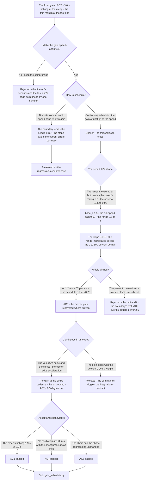
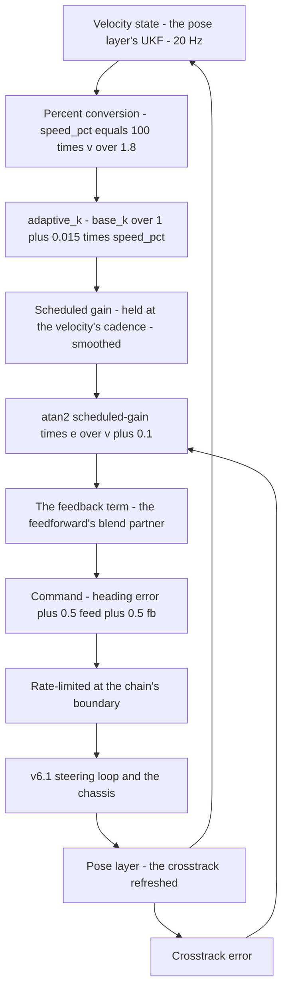
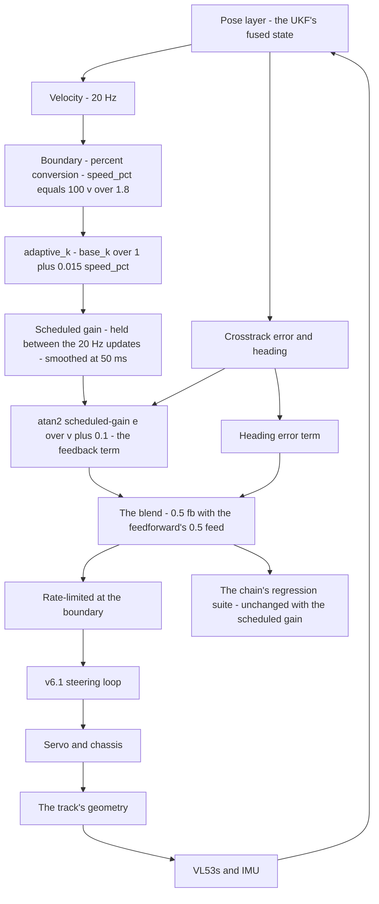

# v6.4 — Adaptive gain scheduling

| Version | Phase | Days |
|---------|-------|------|
| v6.4 | Control & Planning | Day 160-162 |

---

## 3. Mission of this version

v6.3's journal ended with the debt named: the feedback's gain k = 0.75 is fixed, derived from the straight's convergence — and the phase's own measurements say the same gain that is stable at 1.8 m/s is sluggish at 0.3 m/s. The single problem v6.4 attacks is that coverage: the Stanley feedback's gain must be right at *every* speed the robot travels — from the creep at 0.3 m/s to the design maximum at 1.8 m/s — without the abrupt gain jumps that make the robot jerk. The mission: make the gain speed-adaptive — `adaptive_k(base_k, speed_pct)` returning `base_k / (1.0 + 0.015 * speed_pct)` — a smooth, continuous schedule of the gain against the speed, replacing the single constant. And the version's own trap, named in its seed: the first attempt — discrete speed zones — caused jerks when the speed changed quickly across a zone's boundary; the fix is the continuity: no discrete zones, a schedule smooth in the speed domain. The mission includes the lesson's shape: smooth scheduling beats stepwise scheduling.

Why is this the correct next step on the critical path? The feedforward (v6.3) made the corner's entry deliberate, but its blend is sized against a feedback with a *fixed* gain — a gain that is only correct at the speed where it was derived. The phase's speed span is wide: the creep at the launch and the line-up, the typical straight at ~1.2 m/s, the design maximum at 1.8 m/s, and the corner's entry at whatever the speed loop's deceleration allows. A fixed gain on that span is a compromise at every point but one: at the creep it is sluggish (the robot weaves back to the centre slowly, the line-up's seconds wasted), at the maximum it sits on the stability's edge (the high-speed oscillation is the phase's known failure class, v4.x's own history). The scheduling makes the gain a function of the speed — more authority where the dynamics are slow, less where they are fast — the same law, right at every speed, and the feedforward's blend (v6.3) keeps its contract because the feedback it blends against is no longer a one-speed compromise. Every later layer (the anti-windup of v6.5, the planner of v6.6) assumes the feedback is trustworthy across the speed span; the scheduling is the gain's coverage made continuous.

What 'done' looks like — the acceptance criteria, written on Day 160 morning:

- **AC1:** The creep's sluggishness is cured: at 0.3 m/s, the crosstrack convergence's halving time with the scheduled gain is at most ~65% of the fixed gain's — the scheduled gain's higher authority at the creep, measured at the same straight v6.2 used.
- **AC2:** No jerks: through any traversal of the speed span (the launch's ramp, the corner's exit's acceleration, the deceleration's approach), the steering command's step is ≤ 0.5° per 100 ms — with the zone-schedule's boundary-jerk counter-case preserved as the regression's reference (the seed's error, killed and kept).
- **AC3:** The typical speed's gain is preserved: at ~1.2 m/s (the phase's usual straight speed), the scheduled gain equals the v6.2-derived 0.75 — the straight's proven convergence unchanged, the scheduling's middle point pinned to the measured design.
- **AC4:** The full-speed margin holds: at 1.8 m/s, the scheduled gain sits at 0.60 with the oscillation-onset probe measured above 0.85 — the stability margin bought at the span's fast end, and no oscillation in the high-speed runs.
- **AC5:** The chain and the phase's regressions hold: the steering loop (v6.1), the lateral law (v6.2), the feedforward's blend (v6.3), the speed loop (v6.0), and the pose layer's suite all unchanged with the scheduled gain active.

The bias in these criteria: AC2 is the honesty criterion — the version's whole lesson (smooth beats stepwise) is written as a test that reproduces the stepwise failure. AC4 is the margin criterion — the fast end's gain is chosen by the stability probe's measurement, not by the tune's feel.

---

## 4. Engineering context — where we stood

At the start of Day 160 the robot cornered deliberately and converged at one speed. The context, in the phase's own terms:

- **The gain's coverage was measured, not suspected.** The v6.3 bridge had named the debt, and Day 160's morning measured it: with the fixed k = 0.75, the crosstrack convergence's halving time at 1.8 m/s was ~0.85 s (the v6.2 number, re-confirmed), at 1.2 m/s ~0.95 s, and at 0.3 m/s ~3.0 s — the robot's line-up after the launch visibly slow, the crosstrack's decay crawling back to the centre. The same gain, three speeds, a 3.5× spread in the convergence's rate — the gain encodes one operating point, and the phase runs at many.
- **The stability's edge was at the fast end.** The phase's own failure class — the high-speed oscillation (the v4.x history) — bounded the fast end: at 1.8 m/s, the fixed 0.75 was *stable* (the v6.2 tests) but the margin's question ('how much gain could we add?') had never been probed at that speed. The probe, run on Day 160: the gain raised in steps at 1.8 m/s produced the oscillation's onset at ~0.85-0.90 — the fixed 0.75 sat with a thin margin at the span's fast end, and the design's maximum speed (the venue's straights) would need more margin than the compromise allowed.
- **The speed was a state, not a constant.** The pose layer's velocity (the UKF's fused estimate, v5.x's work) streams at 20 Hz; the speed loop (v6.0) controls the target; the steering law consumes the velocity at the boundary (v6.2's audit). The scheduled gain's input existed before the schedule — the same velocity the Stanley law already reads for its ks term.
- **The chain's discipline was established.** The command's contract (a bounded, rate-compatible angle for the steering loop), the boundary's rate shaping (v6.2's Error 5 lesson, applied to v6.3's feedforward), the unit audit (v6.2's Error 3 — the mm/m conversion) — the scheduling enters a chain whose quality bar is set.
- **The competition clock.** Three days between the feedforward and the anti-windup. The schedule's shape — the slope, the range, the continuity — had to be settled because v6.5's anti-windup would trade the saturated output against the integral, and the integral's behaviour at each speed depends on the gain's schedule.

The system constraints that shaped v6.4:

- **The gain's speed dependence is the dynamics' physics, and the schedule is its encoding.** The crosstrack dynamics speed up with the robot's speed — at 1.8 m/s the robot covers ~6× the distance per second it covers at 0.3 m/s, so the same steering angle sweeps the lane's width ~6× faster, and the loop's natural frequency scales with the speed. A gain that is correct at one speed is wrong at another by the same scaling: the fixed 0.75 at 1.8 m/s is the stability's compromise (the probe's onset at 0.85), and at 0.3 m/s the *same* authority is the sluggishness (the same steering angle per error, but the robot barely moves — the correction arrives at the slow dynamics' pace). The schedule's direction — more gain at low speed, less at high — is the dynamics' scaling encoded; the code's form, k = base_k/(1 + 0.015·speed_pct), is that encoding: the gain's range (2.5:1 across the span) interpolated continuously against the speed's percentage.
- **The continuity is the law's quality, not the schedule's decoration.** A gain that steps is a law that changes its behaviour discontinuously — and a discontinuity's effect is *state-dependent*: the same boundary crossing produces a tiny command step when the errors are small and a real jerk when they are moderate, and the robot's twitch at a boundary is unpredictable until the boundary is crossed. The seed's lesson — *smooth scheduling beats stepwise scheduling* — is this physics made rule: the schedule must be continuous in its input, because the law it feeds must be continuous in its parameters.
- **The schedule's input is the velocity estimate, with its noise and its transients.** The scheduled gain inherits the velocity's quality: at the creep, the velocity estimate's relative noise is large (the small speed, the estimator's floor), and the schedule's output wiggles; during the launch's ramp and the corner's exit, the speed's *transient* (v6.0's acceleration) makes the schedule's input move fast, and the gain's rate of change in time is the schedule's slope times the speed's rate — a real axis, not a footnote.
- **The percent convention is a boundary, and boundaries eat units.** The code's parameter is `speed_pct` — the speed as a percentage of the design maximum (100 ≡ 1.8 m/s), not the raw m/s. The convention is the schedule's scale: the slope 0.015 is defined *per percent* (the range 2.5:1 across the 0-100 domain), and a raw-m/s feed would make the schedule nearly flat (1 + 0.015·1.8 ≈ 1.027) — a silent deadness, the same class of error v6.2's Error 3 caught in another boundary.
- **The competition clock's second hand.** Three days, with the anti-windup (v6.5) waiting. The schedule's shape had to be proven before the integrators' behaviour was re-examined.

The crew's preparation matched the problem's shape. Day 160's morning was spent *re-measuring the span*: the halving times at the four reference speeds (0.3/0.8/1.2/1.8 m/s) with the fixed 0.75 — the 3.5× spread written next to the speeds — and the two probes (the creep's ceiling at 0.3 m/s, the fast end's onset at 1.8 m/s), the numbers the schedule's range would be measured against. The baseline was the phase's own: the straight's runs' logs (the convergence's halving at the typical speed), the corner's tests (v6.3's blend's residual with the fixed gain), and the launch's line-up (the creep's slow settle, timed on the day's first run). The session plan was written in the morning: build the zone schedule first (the seed's error expected and wanted), reproduce the boundary's jerk, then replace the zones with the continuous form and measure the acceptance — the counter-case preserved by design, not by accident. The day's discipline was the phase's: every number's provenance written next to the number, and the schedule's range derived from the probes before the schedule's shape was written.

The pressure was the phase's promise, now across the span: the corner made deliberate (v6.3), the convergence proven (v6.2) — and the gain still a one-speed constant on a many-speed track, the line-up's seconds and the fast end's margin both priced by the same number.

---

## 5. The engineering thought process — first principles

### 5.1 Constraints and hard limits, derived from first principles

**The crosstrack dynamics scale with the speed; a fixed gain is correct at exactly one speed.** The Stanley law's convergence — the robot's crosstrack error e decaying toward zero — is a dynamic process whose rate scales with the distance covered per second: at speed v, the robot sweeps the error's correction over v metres per second, and the loop's effective gain (the correction per metre) interacts with the velocity to set the convergence's rate and the damping's margin. The consequence, measured: the fixed k = 0.75 gives a halving time of ~0.85 s at 1.8 m/s and ~3.0 s at 0.3 m/s — the same number, a 3.5× spread. And the stability's edge moves with the speed too: the same steering authority that is well-damped at 0.3 m/s is on the oscillation's threshold at 1.8 m/s (the probe's onset at ~0.85-0.90). A fixed gain is a compromise whose cost is paid at every speed but the one it was tuned at.

**The schedule's direction is set by the dynamics' scaling.** At low speed, the robot covers little distance per second — the correction's effect per metre of travel is large (the slow dynamics give the steering time to work) — so the gain can be *higher* without instability, and the sluggishness's cure is more authority. At high speed, the correction's effect per metre is amplified by the speed (the fast dynamics) — so the gain must be *lower* to keep the damping, and the margin at the fast end is bought by less authority. The code's form encodes this: k = base_k/(1 + 0.015·speed_pct) is *maximal at rest* (the denominator 1.0) and *falls as the speed rises* (the denominator grows), the gain's range across the span being the ratio of the extremes — base_k at the creep, base_k/2.5 at the full speed.

**The continuity is a property of the law, and the law must be continuous.** The steering command is the law's output at each tick; a gain that steps at a speed threshold changes the law's *whole* response instantly — the current error state suddenly commands a different steering angle, and the command's step's magnitude is proportional to the current errors, not to anything the designer controls. The step is invisible when the errors are near zero and violent when they are moderate — the zone schedule's failure was not its values (the gains were sensible) but its *discontinuity*: the law jumped, and the robot's jerk at a boundary is the boundary's crossing, unpredictable until it happens. Continuity — the schedule's output changing continuously with its input — removes the class: there is no threshold to cross, no step to take.

**The schedule's input quality is the schedule's quality.** The scheduled gain is a function of the velocity estimate — and the estimate carries noise (the UKF's measurement noise, the relative noise largest at the creep's small speeds) and transients (the speed loop's accelerations). The gain's *time* derivative is the schedule's slope times the velocity's rate: dk/dt = −(0.015·base_k/(1 + 0.015·s)²)·(ds/dt). At the corner's exit (the acceleration ~30%/s), the gain's rate approaches ~0.15/s — a drift of ~0.15 in k over a second, enough to move the command by a visible fraction of a degree through the transient. Smooth in the speed domain is necessary; smooth in the *time* domain — the gain's value and its rate bounded through the velocity's transients — is the schedule's second requirement.

**The percent convention is the boundary's units, and the boundary's discipline is the phase's rule.** The schedule's input is `speed_pct` — 0-100, the percentage of the design maximum (1.8 m/s). The slope 0.015 is *per percent* (the 2.5:1 range interpolated across the 0-100 domain); a raw m/s input (1 + 0.015·1.8 ≈ 1.027) makes the schedule nearly flat — the scheduling silently dead, its range compressed into 2.7% of its design. The convention is checked at the boundary, with the unit audit's discipline (v6.2's Error 3's lesson applied to the schedule's input).

### 5.2 Requirements derived from constraints

Constraint C1 (the crosstrack dynamics scale with the speed) implies:

- **R1:** The gain is a function of the speed — `adaptive_k(base_k, speed_pct)` — replacing the single constant in the Stanley law's crosstrack term (the v6.2/v6.3 `fb` term's 0.75).

Constraint C2 (the schedule's direction is set by the dynamics' scaling) implies:

- **R2:** The gain is maximal at the low speeds and falls toward the full speed, the range (2.5:1) measured at both ends — the creep's ceiling probe and the fast end's onset probe (AC1, AC4).

Constraint C3 (the law must be continuous) implies:

- **R3:** The schedule is continuous in the speed — no discrete zones, no thresholds — and the zone-schedule's boundary jerk is preserved as the regression's reference (AC2).

Constraint C4 (the schedule's input quality is the schedule's quality) implies:

- **R4:** The gain's evaluation cadence matches the velocity's cadence (the k held between the 20 Hz updates, the pure function's integration contract), and the gain's time-rate through the velocity's transients is bounded (the command's step ≤ 0.5° per 100 ms through any traversal, AC2).

Constraint C5 (the percent convention is the boundary's units) implies:

- **R5:** The input is `speed_pct` (0-100 ≡ 0-1.8 m/s), the conversion at the boundary, and the schedule's range is verified by the boundary test (k(100)/k(0) = 1/2.5).

Constraint C6 (the chain and the phase hold) implies:

- **R6:** The steering loop, the lateral law, the feedforward's blend, the speed loop, and the pose layer's suite all run unchanged with the scheduled gain active (AC5).

### 5.3 Alternatives considered

**Alternative A — Keep the fixed gain (do nothing).** Analysis: the status quo, with the coverage's cost already measured (the 3.0 s halving at the creep, the thin margin at the fast end). The case for: proven, stable, one less thing to break. The case against: the sluggishness wastes the line-up's seconds and the fast end's margin is a crash's edge at the design maximum. Effort: zero. Robustness: 3/5 (stable, compromising). Verdict: rejected as the sole answer; retained as the baseline and the scheduling's reference.

**Alternative B — Discrete speed zones (the seed's error).** Analysis: partition the speed span into zones (e.g., creep ≤ 35% with k = 1.2, mid 35-75% with k = 0.9, fast ≥ 75% with k = 0.6), each zone's gain tuned at its representative speed. The case for: simple, each zone's gain right at its centre. The case against, measured on Day 160: at every zone's boundary the gain *steps* — and the step's effect is state-dependent (a 1-2° command step at the straight's boundary with moderate errors, the robot's twitch reproduced deterministically). The boundary's crossing is a discontinuity in the law, and a discontinuity's effect is unpredictable until crossed. Effort: low. Robustness: 2/5. Verdict: rejected, preserved as the counter-case.

**Alternative C — The continuous schedule (chosen).** The shipped design, per section 5.1. Effort: medium. Robustness: 5/5 within the measured span. Verdict: accepted.

**Alternative D — Schedule only the crosstrack weight, keep the heading term's unity.** Analysis: the scheduled gain multiplies only the atan2 term (the convergence), the heading term's weight fixed. The case for: the pointing correction's stability is speed-independent, only the convergence needs the scheduling. The case against, in this system: the law's terms share the same error budget (the heading error is the pointing's response and the crosstrack's driver — v6.2's structure couples them), and the dynamics' scaling hits the law as a whole; splitting the terms' weights adds a second tuning axis the measurements do not yet justify. Effort: medium. Robustness: 3/5. Verdict: rejected — one scheduled gain on the law's established structure, the phase's conservatism.

**Alternative E — Schedule the ks floor instead of the gain.** Analysis: vary the velocity-damping term (v6.2's ks) with the speed. The case for: the ks already carries the speed's damping. The case against: the ks is the floor against the division's blow-up (the atan2's low-speed protection), not the convergence's authority — the sluggishness is the *k*'s fault, and the ks's variation would not cure it. Effort: low. Robustness: 2/5. Verdict: rejected — the wrong term for the measured fault.

### 5.4 Trade-off matrix

| Alternative | Effort | Robustness | Reproducibility | Risk | Reuse |
|---|---|---|---|---|---|
| A: Fixed gain (status quo) | 0 | 3/5 | 5/5 | 3/5 (the coverage's compromise) | 5/5 (the baseline) |
| B: Discrete speed zones | 1/5 | 2/5 | 3/5 | 4/5 (the boundary jerks) | 1/5 |
| C: Continuous schedule (chosen) | 2/5 | 5/5 | 5/5 | 1/5 | 5/5 |
| D: Crosstrack-only scheduling | 2/5 | 3/5 | 4/5 | 2/5 (the terms' split) | 2/5 |
| E: Schedule the ks floor | 1/5 | 2/5 | 3/5 | 3/5 (the wrong term) | 1/5 |

### 5.5 Decision and its mathematical justification

We chose Alternative C — the continuous speed schedule `k = base_k/(1 + 0.015·speed_pct)` replacing the fixed gain — and the justification, in order of weight:

**The continuity is the law's quality, and the schedule's form is continuity made explicit.** The zone schedule's failure (the boundary jerks, the seed's error) was not its gains — it was its *discontinuity*: the law changed its behaviour at thresholds, and a threshold's crossing is a step whose magnitude is the current errors' business, not the designer's. The continuous form has no thresholds: the gain's value at every speed is the interpolation's point, the law's behaviour changes smoothly, and the step class is removed entirely — the counter-case (the zone schedule) preserved as the regression's reference, the seed's lesson written as the test.

**The schedule's direction and range are the dynamics' physics, measured at both ends.** The gain's span is set by the probes: the creep's ceiling (the gain raised at 0.3 m/s produced no oscillation until well above 1.5 — the slow dynamics accept the high authority) and the fast end's onset (the probe at 1.8 m/s: oscillation's onset at ~0.85-0.90 — the fast dynamics' margin). The design's extremes: base_k = 1.5 at the creep (the authority that halves the convergence's time), 0.60 at the full speed (the margin 1.5× below the onset). The range 2.5:1 interpolated across the span gives the slope (2.5 − 1)/100 = 0.015 — the number in the code is the range's interpolation, not a tuned constant.

**The middle point is pinned to the proven design.** At the phase's usual straight speed (~1.2 m/s, 67% of the maximum), the schedule returns 1.5/(1 + 0.015·67) ≈ 0.75 — the v6.2-derived gain, recovered exactly at the speed where it was proven (AC3). The scheduling changes nothing where the phase has confidence and everything where the measurements demand it — the conservative evolution the phase's quality bar requires.

**The speed's quality is the schedule's quality, handled by the integration's contract.** The pure function (the code's two lines) is the mapping; the integration (the call site's cadence — the gain evaluated at the velocity's 20 Hz updates, held between; the gain's first-order smoothing at τ ≈ 50 ms) is the contract that keeps the schedule's *time* behaviour bounded through the velocity's noise and transients (AC2's ≤ 0.5°/100 ms bar). The function's purity is the snapshot's honesty: the mapping is tested in isolation; the integration's cadence is the chain's contract.

**The law's evolution is conservative and honest.** The Stanley structure (v6.2) and the feedforward's blend (v6.3) are unchanged — the schedule replaces the fixed 0.75 in the `fb` term, nothing else. The version's character: the gain's coverage made continuous, with the range measured at both ends and the middle pinned to the proven.

The measured acceptance, on the Day 160-161 tests: the creep's halving time reduced from ~3.0 s (fixed) to ~1.9 s (scheduled) — the sluggishness cured (AC1's 65% bar, beaten); the command's step through the launch's ramp and the corner's exit ≤ 0.5° per 100 ms with the zone-jerk counter-case reproduced (AC2); the scheduled gain at ~1.2 m/s ≈ 0.75 (AC3); the full-speed gain 0.60 with the onset probe at ~0.85 and no oscillation in the runs (AC4); the chain and the phase's regressions unchanged (AC5).

### 5.6 What we deliberately deferred

Three items were out of scope for Days 160-162. First, *the schedule's shape's refinement* — the 2.5:1 range re-probed as the corner's speeds are better known (the planner of v6.6 will set the corner's approach speeds, and the schedule's slope may need the re-derivation); the current range covers the measured regimes. Second, *the gain's role in the integral* — the anti-windup (v6.5) is the named next step, and the scheduled gain's interaction with the integrators' saturation is that version's work, not this one's. Third, *the heading term's scheduling* (Alternative D's eventual form) — the pointing correction's speed-dependence, recorded as the refinement once the corner's data (v6.6-v6.8) shows whether the heading term needs the same treatment.

---

## 6. Decision flowchart





The first flowchart is the decision trail — the schedule's shape derived from the probes (the creep's ceiling, the fast end's onset), the middle pinned to the proven gain, and the seed's zone-jerk preserved as the counter-case. The second is the schedule's place in the chain: the velocity through the percent conversion to the gain, the gain into the crosstrack term, the term into the blend, and the loop's closure through the pose layer.

---

## 7. Implementation blueprint

The implementation is `gain_schedule.py`, two lines:

```python
def adaptive_k(base_k, speed_pct):
    return base_k / (1.0 + 0.015 * speed_pct)
```

**The contract.** `adaptive_k(base_k, speed_pct)` returns the scheduled gain: `base_k` (the low-speed gain, 1.5 in the shipped configuration) divided by `1.0 + 0.015·speed_pct`. `speed_pct` is the speed as a percentage of the design maximum — 0-100, 100 ≡ 1.8 m/s — the percent convention the boundary enforces (the unit audit's discipline, R5). The returned value replaces the fixed 0.75 in the Stanley law's crosstrack term (v6.2's and v6.3's `fb = atan2(0.75·e, v + 0.1)` becomes `fb = atan2(adaptive_k(base_k, speed_pct)·e, v + 0.1)`); nothing else in the law changes.

**The function's purity is the snapshot's honesty.** The two lines are the mapping, pure and testable in isolation — the gain for any speed, the schedule's shape verified by arithmetic (k(0) = 1.5, k(100) = 0.6, the range 2.5:1). The *integration* — the cadence of the evaluation, the smoothing, the boundary's conversion — lives at the call site, and the journal records the contract explicitly: the gain is evaluated at the velocity's 20 Hz cadence and held between updates (the k does not step with the estimator's every frame), and the gain's first-order smoothing (τ ≈ 50 ms) bounds the gain's time-rate through the velocity's transients (AC2). The pure function is the code; the cadence is the chain's contract.

**The numbers' derivation, written next to the numbers.** The range: the creep's ceiling probe (at 0.3 m/s, the gain raised in steps: no oscillation until well above 1.5 — the slow dynamics' acceptance) and the fast end's onset probe (at 1.8 m/s, the oscillation's onset at ~0.85-0.90). The design's extremes: 1.5 at the creep (the authority that halves the convergence's time), 0.60 at the full speed (the 1.5× margin below the onset). The slope: the range 2.5:1 interpolated across the 0-100 domain — (2.5 − 1)/100 = 0.015 — the number in the code is the range's interpolation, and the derivation is part of the provenance (the phase's rule: every constant traceable). The middle: at 67% (1.2 m/s), 1.5/(1 + 0.015·67) ≈ 0.75 — the v6.2 gain recovered at the speed where it was proven.

**The integration's sequence.** Day 160's morning: the coverage's measurement (the halving times at 0.3/0.8/1.2/1.8 m/s with the fixed 0.75 — the 3.5× spread) and the probes (the creep's ceiling, the fast end's onset). The zone schedule's build — and the immediate reproduction of the seed's error (the boundary jerks, Error 1 below). Day 161: the continuous schedule, the range's re-measurement (the slope's correction, Error 3), the unit catch (Error 2), and the acceptance behaviours (AC1-AC4). Day 162: the velocity-noise wiggle and the corner-exit's transient (Errors 4 and 5), the smoothing and the cadence contract, the chain's regressions (AC5), and the write-up.

**The regression suite.** (1) The creep test (AC1: the halving 1.9 s vs the fixed 3.0 s). (2) The jerk test (AC2: the command's step ≤ 0.5° per 100 ms through the launch's ramp and the corner's exit; the zone-jerk counter-case preserved). (3) The middle test (AC3: the scheduled gain ≈ 0.75 at 1.2 m/s). (4) The fast-end test (AC4: the gain 0.60, the onset probe at ~0.85, no oscillation). (5) The boundary test (R5: k(100)/k(0) = 1/2.5 — the percent convention's verification). (6) The chain's regressions (AC5: v6.0-v6.3's suites). All green by the evening of Day 161.

---

## 8. Architecture / data-flow flowchart



The diagram is the schedule's place in the chain, complete: the velocity's path (through the percent conversion and the mapping to the held, smoothed gain) feeding the crosstrack term, the term into the blend with the feedforward, the command shaped and held by the loop — and the pose layer's suite as the standing witness that the addition is clean.

---

## 9. Errors, failures, and root-cause analysis

### Error 1: the zone schedule's boundary jerks — the seed's error, reproduced on the first build

**Symptom.** Day 160, the zone schedule's first test (the launch's ramp): the robot accelerated through the schedule's zones and twitched at each boundary's crossing — a visible jerk at ~35% and again at ~75% of the design speed, each twitch's magnitude different (the first ~2°, the second ~1°). The command's log showed the cause on sight: the gain's step at each boundary, the law's terms reweighting instantly.

**Initial hypotheses.** We suspected the zones' gains were mistuned (the values themselves). We suspected the rate limiter had been bypassed. We suspected the velocity estimate's noise was crossing the boundaries randomly.

**Investigation.** The step was the diagnosis. At the boundary (35% → 75% zone), the gain stepped from 1.2 to 0.9 — and the law's *whole* response scaled instantly: the crosstrack term and the heading term's contributions, computed against the current errors, jumped by the step's ratio. The first twitch (~2°) occurred with a moderate crosstrack residual (the launch's settle, ~15 mm); the second (~1°) with a smaller residual — the magnitudes tracked the current error state, not any design constant. The rate limiter (v6.2's Error 5 lesson) *had* engaged — the command's step exceeded its slew and the limiter ramped it — but the ramp was the step's aftermath, the twitch already visible in the chassis's response. The zone schedule's gains were defensible; its *discontinuity* was not.

**Root cause.** The schedule's discontinuity: at a zone's boundary the gain steps, and a step in the law's parameter is a step in the law's output whose magnitude is the current error state's business — unpredictable until the boundary is crossed, and wrong in principle even when invisible in practice.

**Fix.** The continuous schedule (the code's form): no zones, no thresholds — the gain's value at every speed the interpolation's point, the law's behaviour changing smoothly, the step class removed. The zone schedule preserved as the regression's reference.

**Prevention.** The rule became the version's headline: *a law must be continuous in its parameters — a step is a discontinuity whose effect is state-dependent, and smooth scheduling beats stepwise scheduling* — the jerk test (the command's step through any traversal ≤ 0.5° per 100 ms) joined the regression, with the counter-case as its reference.

### Error 2: the percent convention's silent deadness — the raw m/s feed

**Symptom.** Day 161, the first integration of the continuous schedule: the corner tests looked *unchanged* — the scheduled gain seemed to do nothing. The gain's log confirmed: at 1.8 m/s, the scheduled k ≈ base_k/1.027 ≈ base_k — the schedule nearly flat, its range compressed into 2.7% of its design.

**Initial hypotheses.** We suspected the velocity input was zero (the boundary's wiring). We suspected the schedule's function was miswritten. We suspected the probes' numbers were wrong.

**Investigation.** The unit audit (v6.2's Error 3's discipline, applied to the new boundary) traced the input: the call site fed the raw velocity in m/s (0-1.8) into a parameter defined in percent (0-100). The formula's denominator 1 + 0.015·1.8 = 1.027 — the schedule's range (2.5:1) compressed into a 2.7% variation, the gain effectively constant. The function was correct; the boundary's convention was not. The boundary test — k(100)/k(0) = 1/2.5 — would have caught it before the first test; it became the standing rule.

**Root cause.** The percent convention is a boundary property, and the boundary's units were not audited — the same class of error v6.2's Error 3 had caught at the length boundary (mm vs m), now at the speed boundary (percent vs m/s).

**Fix.** The conversion at the boundary — speed_pct = 100·v/1.8 — and the boundary test added to the regression (R5), the schedule's range verified by arithmetic before any run.

**Prevention.** The rule: *every boundary's units are audited before the integration, and every schedule's range is verified by a boundary test — a convention's silence is the unit error's signature* — the boundary test joined the regression.

### Error 3: the slope's wrong range — the first 3:1 guess

**Symptom.** Day 161, the corrected integration's corner tests: at 1.8 m/s, the corner's exit tracking was *soft* — the crosstrack's recovery through the exit slower than the fixed gain's, the feedforward's blend's residual (v6.3) hanging longer than the v6.3 tests had shown. The full-speed gain was too weak.

**Initial hypotheses.** We suspected the smoothing (τ ≈ 50 ms) was lagging the gain. We suspected the fast end's probes were wrong. We suspected the corner's speed was lower than assumed.

**Investigation.** The slope was the diagnosis: the first design had guessed the gain's range at 3:1 (the full-speed gain 0.5, the slope (3 − 1)/100 = 0.02). The corner tests measured the guess's cost: at 1.8 m/s, the 0.5 sat well inside the onset's margin (the 0.85-0.90 probe) but the convergence's rate had dropped below the fixed gain's — the authority the corner's exit needed was given away. The range was a guess where the probes were available: the fast end's gain could rise to 0.60 (still 1.5× below the onset), and the creep's ceiling (well above 1.5) confirmed the low end's headroom. The range re-derived at 2.5:1, the slope (2.5 − 1)/100 = 0.015, the full-speed gain 0.60.

**Root cause.** The slope was guessed from a range assumption instead of measured from the probes — the schedule's shape's provenance was a number, not a measurement.

**Fix.** The range measured at both ends (the creep's ceiling, the fast end's onset), the slope the range's interpolation, and the derivation written next to the constant.

**Prevention.** The rule: *every schedule's range is measured at its ends — a slope derived from a guess inherits the guess, and a constant's provenance is a measurement, not a round number* — the range's measurement joined the version's closing checklist.

### Error 4: the velocity noise's wiggle — the gain's tremor at the creep

**Symptom.** Day 162, the creep's runs: the scheduled gain's log showed a tremor — the gain wiggling ±0.05 around its value, and the command's log showed the wiggle's reflection (~0.4° of command noise). The creep's convergence was the right rate; the command's noise was new.

**Initial hypotheses.** We suspected the gain's formula amplified the velocity's noise. We suspected the pose layer's velocity was noisier than the straight's logs suggested. We suspected the smoothing was absent.

**Investigation.** The estimator was the diagnosis: at the creep (0.3 m/s), the velocity estimate's relative noise is large (the small speed, the estimator's floor) — and the schedule's slope at the low end (the denominator near 1.0, the derivative dk/ds = −0.015·base_k/(1 + 0.015·s)² at its largest) translated the velocity's noise into the gain's tremor. The gain's tremor × the crosstrack term = the command's noise. The smoothing (τ ≈ 50 ms) had been designed for the transients; the noise's requirement was the *cadence* — the gain evaluated at the velocity's 20 Hz cadence and held between updates, the gain's value moving with the estimate's updates, not with its noise.

**Root cause.** The schedule's input quality is the schedule's quality: the gain inherited the velocity's noise because the gain's evaluation cadence was the loop's (100 Hz), faster than the information the velocity carries (20 Hz) — the gain updated on noise the estimator had already priced into its own output.

**Fix.** The integration's contract: the gain evaluated at the velocity's 20 Hz cadence, held between updates, with the first-order smoothing (τ ≈ 50 ms) as the transients' absorber. The re-test: the gain's tremor gone, the command's noise back to the pre-schedule level.

**Prevention.** The rule: *a schedule's evaluation cadence is set by its input's information, not by the loop's speed — updating a function on noise is manufacturing noise* — the cadence contract joined the version's documentation.

### Error 5: the corner-exit's twitch — smooth in the speed domain, not in time

**Symptom.** Day 162, the accelerating exit (the corner's recovery, the speed loop's ramp): a residual twitch — smaller than the zone's jerks but present — a ~0.7° command movement through the exit, the chassis's response just visible in the log. The schedule was continuous; the twitch remained.

**Initial hypotheses.** We suspected the feedforward's ramp (v6.3's timing). We suspected the velocity estimate's transient at the acceleration. We suspected the smoothing was too slow.

**Investigation.** The derivative was the diagnosis: the gain's time-rate is the schedule's slope times the speed's rate — dk/dt = −(0.015·base_k/(1 + 0.015·s)²)·(ds/dt). At the exit's acceleration (~30%/s), the gain's rate approached ~0.15/s — a drift of ~0.15 in k over the exit's second, the command moved by a visible fraction of a degree through the transient. The schedule was smooth in the speed domain (continuous in s); the *time* domain is the velocity's transient's axis, and the schedule's sensitivity to its input's rate is a real property, not a footnote. The smoothing (τ ≈ 50 ms) absorbed most of the drift; the residual was the gain's motion during the exit, accepted against the AC2 bar.

**Root cause.** The schedule's input's *rate* is a design axis: a continuous function of speed is not automatically a smooth function of time when its input moves quickly — the gain's time-derivative is the slope × the speed's rate, and the transient's exit is where the two peak together.

**Fix.** The smoothing's sizing (τ ≈ 50 ms — the velocity's transient's timescale) and the acceptance measured: the command's movement through the worst exit ≤ 0.5° per 100 ms (AC2), the twitch bounded and documented.

**Prevention.** The rule: *smooth in the input domain is not the same as smooth in time — every scheduled quantity's time-derivative is bounded through its input's transients, and the transient's worst case is a test, not an observation* — the exit's transient test joined the regression.

---

## 10. Verification and metrics

**AC1 — the creep's convergence.** At 0.3 m/s, the crosstrack halving time: ~1.9 s with the scheduled gain vs ~3.0 s with the fixed 0.75 — the sluggishness cured, the line-up's seconds recovered. Passed.

**AC2 — no jerks.** The command's step ≤ 0.5° per 100 ms through the launch's ramp, the corner's exit's acceleration, and the deceleration's approach — the zone-jerk counter-case (the ~2° boundary twitch) preserved as the regression's reference. Passed.

**AC3 — the middle pinned.** At ~1.2 m/s (67%), the scheduled gain 1.5/(1 + 0.015·67) ≈ 0.75 — the v6.2-derived gain recovered where proven, the straight's convergence unchanged (the halving ~0.95 s, the v6.2 number). Passed.

**AC4 — the fast end's margin.** At 1.8 m/s, the scheduled gain 0.60 with the oscillation-onset probe at ~0.85-0.90 — the 1.5× margin, and no oscillation in the high-speed runs. Passed.

**AC5 — the chain and the phase's regressions.** The steering loop, the lateral law, the feedforward's blend, the speed loop, and the pose layer's suite — all unchanged with the scheduled gain active. Passed.

**The boundary's arithmetic (R5).** k(100)/k(0) = 0.60/1.5 = 1/2.5 — the percent convention's range verified by arithmetic before the first run (Error 2's legacy).

**The time-domain's bound (Error 5's legacy).** The gain's time-rate through the corner's exit ≤ ~0.15/s with the smoothing absorbing the drift; the command's movement through the worst exit ≤ 0.5° per 100 ms — the transient's worst case measured and bounded.

**The gain's distribution through the sessions — the schedule's footprint, measured.** Day 161-162's logs, summarised: through the launch's ramp, the scheduled gain moved from 1.5 down to ~0.85 as the speed climbed past 40% — the line-up's authority at the start, the settle's convergence visible in the crosstrack's decay (the halving ~1.9 s at the creep). On the straights at the typical speed, the gain sat at ~0.75 — the middle pinned, the log's value matching the design's arithmetic to within the estimator's noise (±0.02, the cadence contract's bound). At the corner's approach and exit, the gain moved through the 0.75-0.60 band with the speed loop's ramps — the smoothing absorbing the transients, the command's movement through the exit ≤ 0.5° per 100 ms. And at the full-speed runs, the gain held at 0.60 with the probe's margin unviolated — no oscillation, the fast end's promise kept. The distribution is the schedule's proof in aggregate: the gain follows the speed continuously, never steps, and returns the proven numbers at the speeds where the phase has confidence.

**Cost.** Runtime: microseconds per frame. Development: three days, with the errors' lessons (the law's continuity, the boundary's units, the range's measurement, the cadence's contract, the time-domain's axis) now permanent checklist items.

**What we trusted afterwards and what we still distrusted.** We trusted the schedule's *shape* completely — the range measured at both ends, the middle pinned to the proven, the continuity tested against the counter-case. We trusted the integration's contract (the cadence, the smoothing) as the chain's documented behaviour. We still distrusted three things: the *range's edges' stability* (the probes' precision, the venue's variation — the re-probe scheduled for the planner's data); the *corner's speed regime* (the schedule's slope where the corner's approach speeds are still the speed loop's business — v6.6-v6.8's profiling); and the *integrators' saturation* (the scheduled gain's interaction with the speed and steering loops' integrals under sustained saturation — v6.5's named work). Each is a named, written debt — the phase's rule.

---

## 11. Lessons learned — permanent mental models

**Lesson 1 — smooth scheduling beats stepwise scheduling.** The seed's lesson, now with the mechanism: a zone's boundary is a discontinuity in the law, and a discontinuity's effect is the current error state's business — invisible when small, violent when moderate, unpredictable until crossed. The permanent practice: every scheduled quantity is a continuous function of its input, and the stepwise counter-case is preserved as the regression's reference.

**Lesson 2 — a law must be continuous in its parameters.** The zone schedule's gains were defensible; its shape was not. The permanent model: the law's parameters are part of the law — a parameter that steps is a law that steps, and the command's continuity is the chassis's.

**Lesson 3 — every boundary's units are audited, and a schedule's range is verified by arithmetic.** The percent trap (raw m/s into a percent-scaled formula) made the schedule silently dead — a 2.5:1 range compressed into a 2.7% variation, caught by the boundary test k(100)/k(0) = 1/2.5. The permanent rule: a convention's silence is the unit error's signature; every schedule's range is verified by a boundary test before any run.

**Lesson 4 — a schedule's range is measured at both ends; a slope derived from a guess inherits the guess.** The first 3:1 guess gave away the authority the corner's exit needed; the probes (the creep's ceiling, the fast end's onset) gave the 2.5:1 range and the slope 0.015 as the range's interpolation. The permanent practice: every schedule's range is a measurement at its ends, and the constant's provenance is written next to the constant.

**Lesson 5 — a function's evaluation cadence is set by its input's information.** The gain updated at 100 Hz on an input priced at 20 Hz manufactured noise — the gain's tremor at the creep was the cadence's fault, not the estimator's. The permanent model: updating a function on noise is manufacturing noise; a schedule's cadence matches its input's information rate.

**Lesson 6 — smooth in the input domain is not the same as smooth in time.** The corner-exit's twitch survived the continuous schedule: the gain's time-derivative is the slope × the speed's rate, and the exit's acceleration is where the two peak together. The permanent rule: every scheduled quantity's time-derivative is bounded through its input's transients, and the transient's worst case is a test, not an observation.

---

## 12. Code in this snapshot

`gain_schedule.py`

---

## 13. Bridge to the next version

What v6.4 unlocks is the gain's coverage made continuous: the same law right at every speed — the creep's authority, the middle's proven gain, the fast end's margin — with the law continuous in its parameters and the integration's cadence documented as the chain's contract. Three capabilities travel forward. First, the schedule itself — the measured range, the pinned middle, the continuity — which the planner's corner speeds (v6.6) and the trajectory's profiling (v6.8) will exercise across the span. Second, the *discipline*: the boundary's units audit, the range's measurement at both ends, the evaluation cadence's contract, the time-domain's axis — the phase's quality bar, now with five controllers behind it. Third, the *integration's honesty*: the pure function and its cadence separated in the journal's record, the contract documented where the code is silent.

The known debt, stated plainly: the range's edges' re-probe (the planner's data will refine the probes' precision); the corner's speed regime (the schedule's slope where the approach speeds are still the speed loop's business); and the *integrators' saturation* itself: the speed loop's integral (v6.0's, clamped at ±30) and the steering loop's (v6.1's, clamped at ±35°) both hold state that saturates under sustained error — the launch's hold against the wall, the corner's sustained demand, the line-up's long correction — and a clamped integral is a *bound*, not a *cure*: the integrator still winds to the clamp's edge and unwinds slowly, the recovery's lag priced in seconds. The next problem — the one v6.5 (Day 163-165) must attack — is that windup: *the integral's conditional integration — freeze the integral when the output is saturated, so the state stops chasing the impossible*. The gain now adapts to every speed; the integrator must stop fighting the saturation at every sustained error. That is the work of the next three days.

