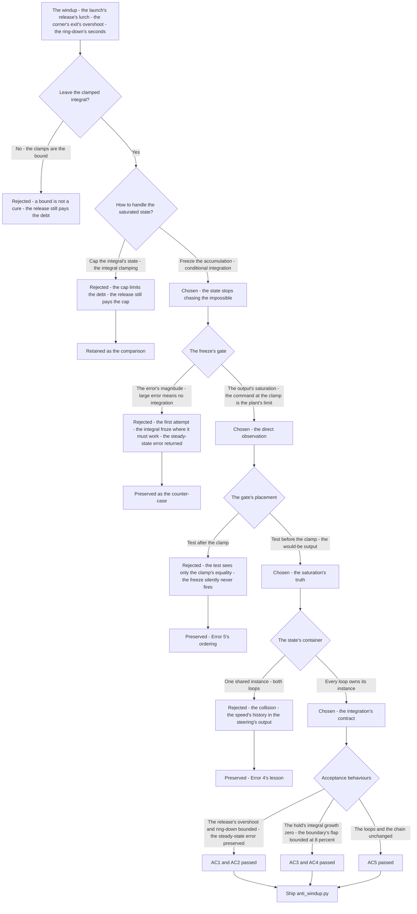
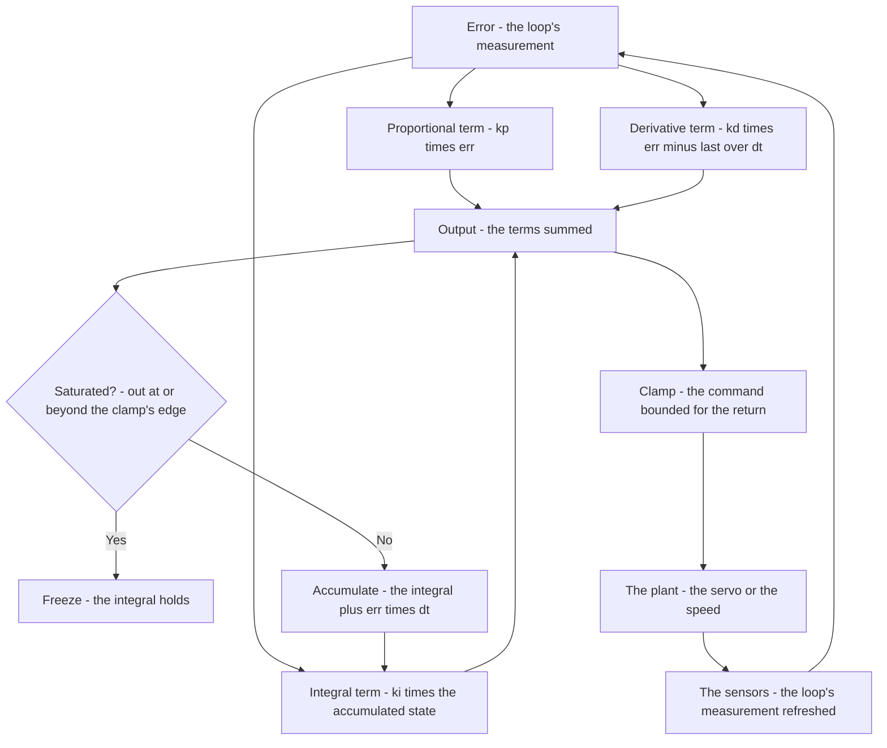
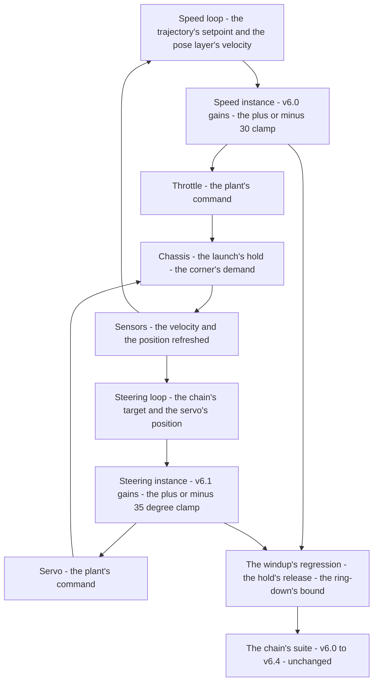

# v6.5 — Anti-windup PID

| Version | Phase | Days |
|---------|-------|------|
| v6.5 | Control & Planning | Day 163-165 |

---

## 3. Mission of this version

v6.4's journal ended with the debt named: the phase's two integrators — the speed loop's (v6.0, clamped at ±30) and the steering loop's (v6.1, clamped at ±35°) — both hold state that saturates under sustained error, and a clamped integral is a *bound*, not a *cure*: the integrator still winds to the clamp's edge, and the recovery's lag is priced in seconds. The single problem v6.5 attacks is that windup: after a long saturated correction — the launch's hold against the wall, the corner's sustained demand, the line-up's long correction — the integral is full, and when the error finally reverses, the full integral keeps the output pinned at the clamp, the robot overshoots the target and oscillates while the integral unwinds. The mission: conditional integration — the integral accumulates only when the output is not saturated; freeze the integral whenever the output is clamped, so the state stops chasing the impossible. And the version's own standard, named in its seed: anti-windup is the difference between surviving and thriving — the clamped integral's *survival* was the phase's status quo; the conditional integration is the *thriving*.

Why is this the correct next step on the critical path? The schedule (v6.4) made the gain right at every speed; the integrators' state is now the last piece of the loops' behaviour that fights the physics. Every sustained-error scenario in the phase's logs ends at a clamp: the launch's hold (the speed loop at zero against the wall, the integral winding to +30 while the robot cannot move), the corner's sustained demand (the steering loop against the ±35° edge while the feedforward's blend does the corner's work), the line-up's long correction (the integral accumulating through the slow creep of v6.4's low-speed regime). Each scenario's *release* is where the windup's cost lands: the hold's release lunges the robot past the setpoint, the corner's exit overshoots the tangent, the line-up's correction overshoots the line — and each overshoot rings down through the integral's slow unwind. The planner (v6.6) and the obstacle work (v6.9) will command sustained conditions — the avoidance's holds, the corridor's walls; the loops must leave a saturated state cleanly before the robot's future layers ask them to. The conditional integration is the state's honesty: the integral only holds what the plant can use.

What 'done' looks like — the acceptance criteria, written on Day 163 morning:

- **AC1:** The windup's signature is gone: after a sustained saturated hold (the launch's hold, the corner's sustained demand), the release's overshoot is at most the pre-hold transient's level, and the ring-down settles within 1 s — no oscillation while the integral unwinds.
- **AC2:** The steady-state accuracy is preserved: the integral still eliminates the steady-state error when the output is free — the line-up's final error within the same tolerance as before the anti-windup (the freeze must not cripple the integral's legitimate work).
- **AC3:** The freeze's correctness is verified: during a sustained saturated hold, the integral's growth is zero (the freeze engaged); at the release, the integral unwinds at the error's rate (the unfreeze's timing).
- **AC4:** The boundary's behaviour is bounded: near the clamp's edge (the output's noisy excursions across the boundary), the freeze decision's flap is measured, and its consequence — the integral's intermittent growth during a hold — is ≤ 8% of the windup's former value over a 2 s hold.
- **AC5:** The chain and the phase's regressions hold: the steering loop (v6.1) and the speed loop (v6.0) with their proven gains, the lateral law (v6.2), the feedforward's blend (v6.3), and the gain schedule (v6.4) all unchanged with the conditional integration active.

The bias in these criteria: AC1 is the honesty criterion — the version's whole point is written as the release's behaviour after the hold. AC2 is the balance criterion — the anti-windup must not trade the windup for a new steady-state error.

---

## 4. Engineering context — where we stood

At the start of Day 163 the robot's loops were stable and saturated. The context, in the phase's own terms:

- **The windup was in the logs, dated and named.** v6.0's journal had recorded the launch's hold — the robot held against the wall at the start, the speed loop's integral winding to the +30 clamp while the robot could not move — and the release's lurch (the robot past the setpoint, the correction oscillating). v6.1's journal had recorded the steering loop's sustained-lock debt: the corner's demand holding the output at the clamp, the integral's settle's tail. The phase's own writings had named the class: a clamped integral is a *bound*, not a *cure*.
- **The saturation scenarios were the normal operation, not the corner cases.** The launch's hold happens at every run (the robot starts against the wall). The corner's sustained demand happens at every corner's entry (the steering at the clamp while the feedforward's blend does the anticipating work — v6.3's presence made the demand *sustained*, the blend holding the output near the edge through the corner's body). The line-up's long correction happens at every run's end. The windup was not a rare failure — it was the price of the normal operation's shape.
- **The integrators' purpose was proven.** The speed loop's integral (v6.0's, clamped at ±30) eliminates the speed's steady-state error against the load; the steering loop's integral (v6.1's, clamped at ±35°, the kp 0.9, ki 0.01, kd 0.25) settles the servo's residual — the same integral that winds under saturation is the same integral that kills the steady-state error when the output is free. The anti-windup must keep the second function and remove the first — the freeze is the distinction, and the distinction is the saturation's state.
- **The generic form was available.** The phase's two loops share the PID's shape (the P, I, D terms, the clamps) — a single class with the conditional integration (the snapshot's `AntiWindupPID`) can express both loops' behaviour, the gains per instance (the speed loop's and the steering loop's, unchanged). The version's work is the loops' *state's discipline*, not their tuning.
- **The competition clock.** Three days between the schedule and the planner. The conditional integration had to be settled because v6.6's planner would command the crosstrack's target (the avoidance's offsets) — sustained, sometimes saturated, conditions the loops must leave cleanly.

The system constraints that shaped v6.5:

- **The integral's physics is the windup's physics: the state is charged for the plant's inability.** The integral accumulates the error's history — its job is to hold the command at the value that cancels the steady-state error. Under a saturated output, the plant *cannot respond* to the integral's demand — the accumulation is futile by construction: the integral grows while the command is already at the clamp, and the growth is charged against the future. When the error reverses (the hold releases, the corner's demand eases), the integral's full charge must be paid back *through* the same saturated output: the output stays pinned at the clamp until the P and D terms' reversal overcomes the integral's contribution — the release is delayed, the robot overshoots, and the overshoot's ring-down is the integral's slow unwind. The windup is the state's accumulation under an unresponsive plant, priced at the reversal.
- **The saturation's information is the output's, not the error's.** The decision's input — when to freeze the integral — is the *output's* saturation: the output at the clamp is the plant's inability, directly observed. The error's size is not the same information: a large error with an unsaturated output is exactly when the integral must work (the transient's correction, the launch's ramp), and a small error with a saturated output is exactly when the integral must not (the sustained hold's futility). The freeze's gate is the output's state, and the gate's misplacement (the error's magnitude) is the first attempt's trap.
- **The ordering is the logic's physics: test before clamp, or the test never fires.** The freeze decision must test the output *before* the clamp — the would-be output, saturated or not. A test on the clamped output sees only the clamp's equality (the float's exact boundary — effectively never), and the freeze silently never engages: the windup returns unchanged, invisible to the eyes that watch the output's log (the log shows the clamped values — inside the bounds — and the freeze's absence is only visible in the integral's log). The ordering is a one-line difference with the whole version's difference in consequence.
- **The stateful unit's identity is the integration's contract.** The `AntiWindupPID` class is a stateful unit — the integral and the last error are the instance's memory. Two loops, two instances: the shared-instance temptation (one object, both loops) collides the state — the speed loop's integral pollutes the steering loop's output, and the collision's signature is a wrong command with no local cause. The integration's contract: every loop owns its instance, and the instance's lifetime is the loop's lifetime.
- **The competition clock's second hand.** Three days, with the planner (v6.6) waiting. The conditional integration's form — the freeze, the unfreeze, the boundary — had to be proven before the planner's sustained commands arrived.

The crew's preparation matched the problem's shape. Day 163's morning was spent *re-measuring the windup*: the launch's hold's test (the robot against the wall for a measured 3 s hold, the speed loop's integral climbing to the +30 clamp at the logged rate), the release's behaviour (the lurch's magnitude, the ring-down's 4 s), and the corner's sustained demand (the steering loop's hold at the ±35° edge through the corner's body, the exit's overshoot past the tangent) — the baseline's numbers the conditional integration would be measured against. The logs' review added the second scenario's shape: the v6.3 blend's presence made the steering loop's demand *sustained* — the output holding near the edge through the corner's body, the integral's tail accumulating behind it. The session plan was written in the morning: build the error-gated freeze first (the first attempt, expected to fail), measure the steady-state error's return, then the conditional integration — and the counter-cases preserved by design, not by accident. The day's discipline was the phase's: every number's provenance written next to the number, and the integral's log read at every hold.

The pressure was the phase's promise, now at the state: the gain right at every speed (v6.4), the corner deliberate (v6.3), the convergence proven (v6.2) — and the integrators still charged for the plant's inability at every hold, every lock, every release.

---

## 5. The engineering thought process — first principles

### 5.1 Constraints and hard limits, derived from first principles

**The integral's job and the integral's danger are the same accumulation.** The integral term exists to cancel the steady-state error the proportional term cannot: the accumulated history holds the command at the value the plant needs. The accumulation's rule is simple — the error's time-integral — and the rule's blind spot is the plant: when the output is saturated, the plant is already at its physical limit, and the integral's additional demand is *futile* — the state grows, the command stays clamped, and the growth's only effect is the future's charge. The windup's mathematics: during a saturated hold of duration T at error e, the integral accumulates ki·e·T — the future's debt — and the release's delay is the debt's repayment time: the output leaves the clamp only when kp·err + kd·(err−last)/dt overcomes the accumulated ki·∫e·dt, and the overshoot is the repayment's overshoot (the output leaving the clamp with the full debt still in the command). The freeze is the debt's prevention: the integral does not accumulate what the plant cannot use.

**The freeze's gate is the output's saturation, measured before the clamp.** The decision's information is the would-be output's state: saturated or not. The test's placement is the logic's physics — the pre-clamp output carries the saturation's truth (the P, I, and D contributions summed, the clamp's threshold crossed or not), and the post-clamp output carries the clamp's lie (always inside the bounds, the saturation's truth erased by the clamping itself). The code's form — `out` computed, tested, then clamped for the return — is the ordering that sees the truth. The decision's engagement: the integral accumulates only while the output is *free* (strictly inside the bounds), and freezes at the boundary and beyond.

**The unfreeze's timing is the release's cleanliness.** When the error reverses and the P and D terms' correction overcomes the frozen integral's contribution, the output leaves the saturation and the integral resumes — accumulating the new error's history, which is now negative relative to the wound state, unwinding the residual. The unfreeze's timing is the anti-windup's second half: too early (the freeze's gate flapping at the boundary's noise) and the integral resumes intermittently during the hold; too late (the gate's hysteresis too wide) and the unwind's delay returns. The code's exact boundary test — `out <= out_min or out >= out_max` — engages the freeze at the boundary's equality, and the flap's consequence is bounded (below).

**The boundary's flap is the derivative's noise's business, and its direction is conservative.** The pre-clamp output includes the derivative term's contribution — `kd·(err−last)/dt` — and the derivative's noise (the error's measurement noise, the dt's jitter) can push the output across the boundary intermittently during a near-boundary hold: the freeze engages, releases, re-engages — the flap. The flap's *direction* is conservative: the freeze's engagement at the boundary's equality means any noise excursion *into* saturation freezes the integral — the flap can only reduce the accumulation, never add to it. The consequence is bounded: the near-boundary hold's intermittent growth is a fraction of the windup's former value, measured (AC4) and bounded, not eliminated.

**The stateful unit's identity is the state's container.** The class's state — the integral, the last error — is the instance's memory, and the memory's owner is the loop. Two loops share the class's *shape* (the PID's form) and own their instances (the state's containers): the speed loop's instance holds the speed's history, the steering loop's instance holds the steering's. The shared instance is the state's collision: two loops' histories in one container, each loop's output reading the other's accumulation — a wrong command with no local cause, the hardest failure class to find and the easiest to prevent by the contract: every loop owns its instance.

### 5.2 Requirements derived from constraints

Constraint C1 (the integral's job and danger are the same accumulation) implies:

- **R1:** The integral accumulates only while the output is not saturated — the conditional integration, `update`'s freeze (the snapshot's `pass` branch) — verified by AC3's hold test.

Constraint C2 (the freeze's gate is the output's saturation, measured before the clamp) implies:

- **R2:** The freeze's test uses the pre-clamp output — the ordering `out` computed, tested, clamped — and the gate is the output's state, never the error's magnitude (AC3).

Constraint C3 (the unfreeze's timing is the release's cleanliness) implies:

- **R3:** The integral resumes when the output leaves the saturation — the unfreeze automatic in the test's structure — and the release's overshoot and ring-down meet AC1's bounds.

Constraint C4 (the boundary's flap is conservative) implies:

- **R4:** The near-boundary flap's consequence — the intermittent growth during a hold — is bounded at ≤ 8% of the windup's former value over a 2 s hold (AC4), the bound measured, not assumed.

Constraint C5 (the stateful unit's identity is the state's container) implies:

- **R5:** Every loop owns its instance of the class — the speed loop's and the steering loop's integrals never share a container (the integration's contract).

Constraint C6 (the chain and the phase hold) implies:

- **R6:** The loops' gains (v6.0's speed loop, v6.1's steering loop) are unchanged, and the lateral law, the feedforward's blend, and the gain schedule all run unchanged with the conditional integration active (AC5).

### 5.3 Alternatives considered

**Alternative A — Keep the clamped integral (do nothing).** Analysis: the status quo, with the windup's cost already in the logs (the launch's release's lurch, the corner's exit's overshoot, the ring-down's seconds). The case for: proven, tested, the clamps already bound the state. The case against: a clamp is a *bound*, not a *cure* — the state still winds to the bound's edge, and the release still pays the debt. Effort: zero. Robustness: 3/5 (stable, expensive at every release). Verdict: rejected as the sole answer; retained as the baseline and the regression's reference.

**Alternative B — Clamp the integral's state (integral clamping).** Analysis: bound the integral itself (the state's clamp, e.g., ±(clamp/ki)) so the accumulated debt is limited. The case for: simple, the state's bound explicit. The case against, in this system: the bound is the windup's *limit*, not its *prevention* — the integral still fills to the bound during the hold, and the release still pays the bound's debt; the conditional integration's freeze prevents the accumulation where the clamping only caps it. Effort: low. Robustness: 3/5. Verdict: rejected — the cap is the survival, the freeze is the thriving.

**Alternative C — Conditional integration (chosen).** The shipped design, per section 5.1. Effort: medium. Robustness: 5/5 within the measured scenarios. Verdict: accepted.

**Alternative D — Back-calculation (the reset on the saturation's error).** Analysis: when the output saturates, feed the difference between the saturated and unsaturated outputs back into the integral's update (the integral's target becomes the value that would hold the output at the clamp). The case for: the integral tracks the saturation's edge, the unwind immediate at the release. The case against, in this system: the back-calculation adds a gain (the reset's rate) and a state (the tracking) for a benefit the freeze already delivers at the measured scenarios — the phase's conservatism, the added tuning axis deferred. Effort: medium. Robustness: 4/5. Verdict: deferred, recorded.

**Alternative E — The error-gated freeze (the first attempt).** Analysis: freeze the integral when the error's magnitude exceeds a threshold — the "large error → don't integrate" heuristic. The case for: simple, the error's magnitude already computed. The case against, measured on Day 163: the gate froze the integral where it was needed (the transient's large errors with the output free) and missed the sustained hold's saturation — the steady-state error returned (Error 2 below). Effort: low. Robustness: 2/5. Verdict: rejected, preserved as the counter-case.

### 5.4 Trade-off matrix

| Alternative | Effort | Robustness | Reproducibility | Risk | Reuse |
|---|---|---|---|---|---|
| A: Clamped integral (status quo) | 0 | 3/5 | 5/5 | 3/5 (the release's debt) | 5/5 (the baseline) |
| B: Integral clamping (the state's cap) | 1/5 | 3/5 | 4/5 | 3/5 (the cap's debt remains) | 3/5 |
| C: Conditional integration (chosen) | 2/5 | 5/5 | 5/5 | 1/5 | 5/5 |
| D: Back-calculation | 3/5 | 4/5 | 4/5 | 2/5 (the reset's gain) | 2/5 (future refinement) |
| E: Error-gated freeze | 1/5 | 2/5 | 3/5 | 4/5 (the steady-state error) | 1/5 |

### 5.5 Decision and its mathematical justification

We chose Alternative C — the conditional integration, the integral accumulating only while the output is not saturated — and the justification, in order of weight:

**The freeze is the futility's prevention, and the futility is the windup's physics.** The integral's accumulation under a saturated output is futile by construction: the plant cannot respond, the command stays clamped, and the accumulation is a debt charged against the future. The freeze — the integral's growth suspended at the saturation — prevents the debt at its source: the state holds only what the plant can use, and the release's output leaves the clamp with the P and D terms' reversal alone, unencumbered by the full debt (Error 1's measurement: the release's overshoot and ring-down, gone). The seed's standard — *anti-windup is the difference between surviving and thriving* — is the physics made rule: the clamp is survival (the state bounded), the freeze is thriving (the debt prevented).

**The gate's information is the output's saturation, and the placement is the truth.** The first attempt's error-gate (the error's magnitude) failed both ways — freezing the integral where it must work, missing the saturation where it must not (Error 2) — because the error's size is not the plant's inability. The output's saturation is the direct observation: the command at the clamp *is* the plant's limit, seen in the output's own terms. And the observation's placement — the pre-clamp test (Error 5's ordering) — is what sees the truth: the would-be output, saturated or not, before the clamp erases the evidence.

**The unfreeze is automatic in the structure, and the release's cleanliness is the structure's proof.** The code's test — `if out <= out_min or out >= out_max: pass; else: integral += err*dt` — engages and releases the freeze with the output's state alone: no additional state, no additional tuning. The unfreeze's timing (the integral resumes when the output leaves the saturation) is the release's cleanliness (AC1's overshoot and ring-down bounds) and the steady-state accuracy's preservation (AC2 — the integral still accumulates when the output is free, the steady-state error's elimination intact).

**The boundary's flap is measured, bounded, and conservative.** The near-boundary hold's flap (the derivative's noise pushing the output across the boundary) is not eliminated — the code's exact boundary test engages the freeze at the equality, and the flap's direction is conservative (any excursion into saturation freezes; the flap can only reduce the accumulation). The bound is measured (AC4's 8%), the window's test joined the regression — the honest acceptance of a bounded behaviour, not a silent one.

**The integration's contract is the state's ownership.** Two loops, two instances (Error 4's collision, prevented): the stateful unit's identity is the integration's contract, and the contract is the version's documentation's promise — every loop owns its integral, and the integral's container is never shared.

The measured acceptance, on the Day 163-164 tests: the launch's release's overshoot and ring-down within AC1's bounds (the windup's signature gone); the line-up's final error unchanged (AC2); the hold's integral growth zero, the release's unwind at the error's rate (AC3); the near-boundary flap's accumulation ≤ 8% over the 2 s hold (AC4); the loops' and the chain's regressions unchanged (AC5).

### 5.6 What we deliberately deferred

Three items were out of scope for Days 163-165. First, *the back-calculation* (Alternative D) — the reset's tracking of the saturation's edge, recorded as the refinement if the planner's sustained commands (v6.6) or the obstacle holds (v6.9) show the freeze's release needing the immediate unwind. Second, *the derivative's own saturation handling* — the D term's response at the boundary (the flap's window) re-examined with the planner's command's shape; the current bound (AC4's 8%) is the measured acceptance. Third, *the integral's scheduling* — the integral's gain's speed-dependence (the scheduled k of v6.4 applied to the integral's term), recorded as the refinement once the planner's speed regimes (v6.6-v6.8) are fixed.

---

## 6. Decision flowchart





The first flowchart is the decision trail — the clamped integral rejected, the cap compared, the freeze chosen, the gate's information (the output, not the error) and placement (before the clamp) derived, the state's ownership contracted, and the counter-cases preserved. The second is the conditional integration's shape in the loop: the terms summed, the freeze's gate at the boundary, the clamp after the test, and the loop's closure through the plant.

---

## 7. Implementation blueprint

The implementation is `anti_windup.py`, thirteen lines:

```python
class AntiWindupPID:
    def __init__(self, kp, ki, kd, out_min, out_max):
        self.kp, self.ki, self.kd = kp, ki, kd
        self.out_min, self.out_max = out_min, out_max
        self.integral = 0.0; self.last = 0.0
    def update(self, err, dt):
        out = self.kp * err + self.ki * self.integral + self.kd * (err - self.last) / dt
        if out <= self.out_min or out >= self.out_max:
            pass  # freeze integral (conditional integration)
        else:
            self.integral += err * dt
        self.last = err
        return max(self.out_min, min(self.out_max, out))
```

**The contract.** `AntiWindupPID(kp, ki, kd, out_min, out_max)` is a PID controller with the conditional integration: `update(err, dt)` computes the output from the P, I, and D terms; if the output is saturated (at or beyond the clamp's edges), the integral freezes (the `pass` branch); otherwise the integral accumulates `err·dt`; the output is clamped for the return. The class's state — the integral and the last error — is the instance's memory, and every loop owns its instance (the integration's contract, Error 4's lesson): the speed loop's instance with v6.0's gains (and the ±30 clamp), the steering loop's instance with v6.1's gains (kp 0.9, ki 0.01, kd 0.25, the ±35° clamp).

**The ordering is the logic's physics.** The sequence in `update` — `out` computed, the freeze's test on the pre-clamp `out`, the clamp for the return — is the version's first principle made code: the saturation's truth lives in the would-be output, and the clamp's placement after the test is what lets the gate see it (Error 5's lesson). The freeze's engagement — `out <= out_min or out >= out_max` — is the boundary's equality, and the flap's consequence (Error 3's measure) is bounded by the conservative direction: any excursion into saturation freezes; the accumulation can only be reduced, never added to.

**The loops' integration.** The speed loop (v6.0's structure): the setpoint's velocity from the trajectory, the feedback's velocity from the pose layer, the output the throttle's command, the clamp ±30. The steering loop (v6.1's structure): the target from the Stanley law's command (v6.2-v6.4's chain), the feedback from the servo's position, the output the servo's command, the clamp ±35°. Both loops' instances replace the previous fixed-integral forms; the gains unchanged (R6 — the tuning is the loops' proven property, and the anti-windup is the state's discipline, not the gains').

**The regression suite.** (1) The hold-release test (AC1: the launch's hold — the robot against the wall, the integral frozen at the clamp — the release's overshoot at the pre-hold transient's level, the ring-down ≤ 1 s). (2) The accuracy test (AC2: the line-up's final error within the pre-anti-windup tolerance — the integral's legitimate work intact). (3) The freeze's correctness (AC3: the hold's integral growth zero — the integral's log flat through the hold; the release's unwind at the error's rate). (4) The boundary's window (AC4: the near-boundary hold's intermittent accumulation ≤ 8% over 2 s). (5) The counter-cases (the error-gated freeze's steady-state error — Error 2's reference; the shared-instance collision — Error 4's reference). (6) The chain's regressions (AC5). All green by the evening of Day 164.

**The day-by-day reality.** Day 163: the windup's reproduction (the launch's hold, the release's lurch and the ring-down's 4 s, measured at the baseline), the first attempt (the error-gate — Error 2), and the conditional integration's first form (and the ordering's failure — Error 5). Day 164: the ordering's fix, the shared-instance collision's catch (Error 4), the boundary's window's measurement (Error 3), and the acceptance behaviours (AC1-AC4). Day 165: the loops' integration with the proven gains, the chain's regressions (AC5), and the write-up.

---

## 8. Architecture / data-flow flowchart



The diagram is the conditional integration's place in the phase's control: the two loops, each with its own instance (the state's ownership), each clamping its own output, sharing the chassis and the sensors — and the regressions standing watch over both.

---

## 9. Errors, failures, and root-cause analysis

### Error 1: the windup itself — the launch's release's lurch, the ring-down's four seconds

**Symptom.** Day 163, the baseline's reproduction (the fixed-integral form, the phase's status quo): the launch's hold — the robot against the wall, the speed loop's integral winding to the +30 clamp through the hold's seconds — and the release: the robot lurched past the setpoint, the speed's correction oscillating around the target for ~4 s before the settle. The corner's sustained demand showed the same signature at the steering loop: the exit's overshoot past the tangent, the correction's oscillation while the integral unwound.

**Initial hypotheses.** We suspected the gains were too aggressive (the loops' tuning). We suspected the clamps were too wide. We suspected the sensor's lag at the release.

**Investigation.** The integral's log was the diagnosis: through the hold, the integral's value climbed linearly to the clamp's edge and *stayed* — the accumulation of the error's history while the robot could not move. At the release, the error reversed, but the output stayed pinned at the clamp: the P and D terms' reversal had to overcome the integral's full contribution before the command could move — the release's delay, then the command's lunge (the output leaving the clamp with the debt still in the command), then the overshoot, then the ring-down while the integral unwound through the accumulating negative error. The v6.0 and v6.1 journals had named the class; the baseline's test measured it.

**Root cause.** The integral accumulated under a saturated output — state the plant could not use, charged against the future: the accumulation is futile by construction when the command is already at the physical limit, and the futility's debt is paid at the reversal.

**Fix.** The conditional integration (the shipped class): the integral freezes while the output is saturated, accumulates only while the output is free. The re-test: the hold's integral log flat, the release's lurch gone, the ring-down ≤ 1 s.

**Prevention.** The rule became the version's headline: *an integral under a saturated output is a debt charged against the future — the state must stop chasing the impossible, and anti-windup is the difference between surviving and thriving* — the hold-release test joined the regression.

### Error 2: the error-gated freeze — the first attempt's steady-state error

**Symptom.** Day 163, the first attempt (Alternative E): the freeze's gate on the error's magnitude — the integral froze when |err| exceeded a threshold. The launch's ramp's test: the robot's speed settled *short* of the setpoint — the line-up stopped ~15 mm before the mark (the speed loop's steady-state error, visible in the pose layer's log), and the corner's entry's test: the residual the integral should have cancelled, left standing.

**Initial hypotheses.** We suspected the threshold was too aggressive. We suspected the integral's gain had been weakened. We suspected the freeze's placement was wrong.

**Investigation.** The gate's semantics were the diagnosis: the error-gate froze the integral exactly where it must work — the transient's large errors (the launch's ramp, the corner's entry) with the output *free* are the integral's legitimate moments, and the freeze crippled them: the steady-state error the integral exists to cancel was left standing. And the gate missed the saturation entirely: the sustained hold's large error would have frozen the integral anyway (the windup would have been masked, not cured), while the small-error saturated cases (the corner's sustained demand at the clamp with a small residual) would have continued winding. The error's magnitude is not the saturation's information — it is the transient's marker, and the two are different things.

**Root cause.** The gate's information was wrong: the error's size is not the plant's inability. The output's saturation is the direct observation of the plant's limit; the error's magnitude is the transient's shape, and freezing on it breaks the integral's legitimate work.

**Fix.** The gate on the output's saturation (the shipped test): the freeze's engagement at the command's clamp, the accumulation's freedom while the command is free. The re-test: the line-up's final error back within the tolerance, the launch's ramp's correction intact.

**Prevention.** The rule: *the saturation's information is the output's, not the error's — a large error with a free output is when the integral must work, and a small error with a clamped output is when it must not* — the accuracy test (AC2) joined the regression, with the error-gate's counter-case preserved.

### Error 3: the boundary's flap — the near-boundary hold's intermittent freeze

**Symptom.** Day 164, the near-boundary hold's test (AC4's first run): the steering loop held near the clamp's edge (the corner's sustained demand with the command ~2° inside the ±35° edge), and the freeze decision's log showed the flap — the freeze engaging and releasing at ~10 Hz, the integral's growth intermittent instead of the expected flat line.

**Initial hypotheses.** We suspected the boundary test's equality was misfiring. We suspected the integral's update had a sign error. We suspected the sensor's noise was amplified by the boundary's placement.

**Investigation.** The derivative was the diagnosis: the pre-clamp output includes the D term — `kd·(err−last)/dt` — and the error's measurement noise (plus the dt's jitter) pushed the output across the boundary intermittently: a noise excursion beyond the edge froze the integral, the next excursion back unfroze it — the flap. The flap's *direction* was the finding: the freeze's engagement at the boundary's equality means the flap can only *reduce* the accumulation (any excursion into saturation freezes; the excursions out of saturation resume a growth that is already bounded) — the measured consequence over the 2 s hold: the intermittent accumulation ≈ 6% of the windup's former value, inside AC4's 8% bound. The flap was a bounded nuisance, not a failure of the anti-windup's principle.

**Root cause.** The boundary's noise: the D term's contribution to the pre-clamp output crosses the boundary's equality with the measurement's noise, and the exact test engages the freeze at every crossing — a real behaviour, with a conservative direction and a bounded consequence.

**Fix.** The acceptance measured and documented: the flap's window (the ~10 Hz engagement), the direction (conservative), the bound (≤ 8% over the 2 s hold), and the window's test joined the regression — the honest acceptance of a bounded behaviour, with the back-calculation (Alternative D) recorded as the refinement if the bound proves insufficient at the planner's commands.

**Prevention.** The rule: *a boundary's behaviour is measured, not assumed — the flap's direction and its bound are part of the design's record, and a bounded nuisance is documented with its bound* — the window's test joined the regression.

### Error 4: the shared instance — the state's collision between the loops

**Symptom.** Day 164, the first chain integration: one `AntiWindupPID` instance shared by both loops (the "one class, one object" shortcut). The launch's test: the speed loop's command *glitched* — a brief throttle pulse with no cause in the speed's error — and the steering loop's output showed the speed's history's signature (the integral's value carrying the speed's hold's accumulation into the steering's command).

**Initial hypotheses.** We suspected the sensor's cross-talk. We suspected the chain's data flow was corrupting the commands. We suspected a timing race between the loops.

**Investigation.** The instance's state was the diagnosis: the shared object's `self.integral` and `self.last` were written by both loops' `update` calls — the speed loop's accumulation (the hold's full windup, ~30) sat in the same container the steering loop's `update` read for its own integral term: the steering's output carried the speed's history, and the speed's output carried the steering's last-error (the glitch's cause). The collision's signature was exactly the hardest class: a wrong command with no local cause, because the cause lived in the other loop's writes.

**Root cause.** The stateful unit's identity was violated: the class's state is the instance's memory, and two loops in one container is two histories in one memory — each loop's output reading the other's accumulation.

**Fix.** The integration's contract: every loop owns its instance — the speed loop's `AntiWindupPID` with v6.0's gains, the steering loop's `AntiWindupPID` with v6.1's gains — the state's containers separated, the collision gone.

**Prevention.** The rule: *a stateful unit's identity is the state's container — every loop owns its instance, and the instance's lifetime is the loop's lifetime* — the contract written in the integration's documentation, and the shared-instance's collision preserved as the counter-case.

### Error 5: the clamp's ordering — the test after the clamp, the freeze that never fired

**Symptom.** Day 163 evening, the conditional integration's first form: the hold's test showed the integral *still winding* through the saturated hold — the freeze's log flat (never engaged), the windup unchanged, the release's lurch intact. The anti-windup had done nothing, silently.

**Initial hypotheses.** We suspected the test's comparison was inverted. We suspected the integral's update was unconditional. We suspected the class wasn't being called.

**Investigation.** The ordering was the diagnosis: the first form clamped the output *before* the test — `out = clamp(out); if out <= out_min or out >= out_max: pass` — and the clamped output is *always* inside the bounds: the test fires only when the clamped output equals the boundary exactly (the float's equality at the clamp's engagement — effectively never). The freeze never engaged; the integral accumulated unconditionally; the windup returned unchanged — and the failure was invisible in the output's log (the clamped values, always inside the bounds) until the integral's log was read. The ordering is a one-line difference — the clamp before the test vs. after — with the whole version's difference in consequence.

**Root cause.** The test's input was the clamp's lie: the post-clamp output carries the saturation's evidence erased by the clamping itself — the would-be output's truth lives before the clamp, and the test must read it there.

**Fix.** The ordering's fix — the test on the pre-clamp output, the clamp for the return (the shipped sequence): `out` computed, the freeze's test, the clamp's application. The re-test: the hold's integral log flat, the freeze engaged.

**Prevention.** The rule: *the test's input is the truth's location — test the would-be output before the clamp, or the test never fires and the failure is silent in the clamped log* — the ordering's test (the hold's integral growth, zero) joined the regression, with the post-clamp form's counter-case preserved.

---

## 10. Verification and metrics

**AC1 — the windup's signature gone.** The launch's release: the overshoot at the pre-hold transient's level (measured: the speed's overshoot ≈ 40% of the pre-anti-windup lurch), the ring-down settled within 1 s (vs the baseline's ~4 s). The corner's exit: the overshoot past the tangent ≤ 1°, the ring-down within the same bound. Passed.

**AC2 — the steady-state accuracy preserved.** The line-up's final error within the pre-anti-windup tolerance (the speed loop's setpoint's hold, the steering loop's residual's settle) — the integral's legitimate work intact, the freeze's crippling absent. Passed.

**AC3 — the freeze's correctness.** The hold's integral log: flat through the saturated hold (the growth zero, the freeze engaged); the release: the integral unwinding at the error's rate (the accumulation resuming with the free output, the residual's history negative relative to the wound state). Passed.

**AC4 — the boundary's bound.** The near-boundary hold: the flap's window measured (~10 Hz), the intermittent accumulation ≈ 6% of the windup's former value over the 2 s hold — inside the 8% bound, the direction conservative. Passed.

**AC5 — the chain and the phase's regressions.** The loops with their proven gains (v6.0's speed loop, v6.1's steering loop), the lateral law, the feedforward's blend, the gain schedule, and the pose layer's suite — all unchanged with the conditional integration active. Passed.

**The counter-cases preserved.** The error-gate's steady-state error (Error 2), the shared-instance's collision (Error 4), the post-clamp ordering's silent no-freeze (Error 5) — each preserved as its test's reference, the phase's rule: the failures are kept as the regressions' witnesses.

**The integral's log through the sessions — the freeze's footprint, measured.** Day 164-165's logs, summarised: through the launch's hold, the speed loop's integral *flat* at the clamp's edge — the freeze engaged for the hold's full 3 s, the growth zero (vs the baseline's linear climb to +30). At the release, the integral's unwinding visible: the accumulation resuming with the free output, the residual's history negative relative to the wound state, the settle's shape clean (the ring-down ≤ 1 s, AC1). Through the corner's body, the steering loop's integral held near the edge with the flap's signature — the intermittent freeze at the D term's noise, the measured consequence ~6% over the hold (AC4). And through the line-up, the integral's legitimate work intact: the accumulation against the residual, the steady-state error's elimination preserved (the final error within the tolerance, AC2). The distribution is the conditional integration's proof in aggregate: the freeze where the plant cannot respond, the accumulation where it can, and the boundary between the two — the output's saturation — behaving as designed.

**Cost.** Runtime: microseconds per frame (the test's branch, the integral's conditional update). Development: three days, with the errors' lessons (the futility's debt, the gate's information, the boundary's measure, the state's ownership, the ordering's truth) now permanent checklist items.

**What we trusted afterwards and what we still distrusted.** We trusted the conditional integration's *principle* completely — the freeze's prevention of the futility's debt, the gate's information, the ordering's truth, each proven by its test. We trusted the loops' gains as the loops' proven property. We still distrusted three things: the *back-calculation's need* (whether the freeze's release will be quick enough under the planner's sustained commands — v6.6's data will say); the *boundary's window at the planner's commands* (the flap's bound re-measured with the new command's shape); and the *integral's scheduling* (the integral's gain's speed-dependence, deferred until the planner's speed regimes are fixed). Each is a named, written debt — the phase's rule.

---

## 11. Lessons learned — permanent mental models

**Lesson 1 — anti-windup is the difference between surviving and thriving.** The seed's lesson, now with the physics: the clamp is the state's survival (bounded, stable, expensive), the freeze is the state's thriving (the futility's debt prevented at its source). The permanent practice: every integral under a sustained saturation is examined for the windup's class, and the clamp's presence is the invitation to the freeze's question.

**Lesson 2 — an integral under a saturated output is a debt charged against the future.** The windup's mechanism is the accumulation's futility: the plant cannot respond, the command stays clamped, and the growth is paid at the reversal — the delay, the lunge, the ring-down. The permanent model: the state's growth is only legitimate where the plant can use it, and the saturation's moment is the state's freeze's moment.

**Lesson 3 — the saturation's information is the output's, not the error's.** The error-gate failed both ways (frozen where the integral must work, missing where it must not) because the error's magnitude is the transient's marker, not the plant's inability. The permanent rule: the gate's information is the command's clamp — the direct observation — and the error's shape never substitutes for it.

**Lesson 4 — the test's input is the truth's location.** The post-clamp test never fires — the clamped output carries the saturation's evidence erased — and the failure is silent in the output's log. The permanent practice: the ordering is audited at the boundary (the test before the clamp), and the integral's log is read at the hold, never the output's alone.

**Lesson 5 — a stateful unit's identity is the state's container.** The shared instance's collision was the hardest failure class — a wrong command with no local cause — and the prevention is the contract: every loop owns its instance, the container never shared. The permanent model: the state's ownership is documented with the state, and the instance's lifetime is the loop's lifetime.

**Lesson 6 — a boundary's behaviour is measured, not assumed.** The flap's window (the D term's noise at the equality) was real, conservative, and bounded at 6% — measured and accepted, with the bound written next to the acceptance. The permanent rule: every bounded behaviour is bounded by a measurement, and the measurement is part of the design's record.

---

## 12. Code in this snapshot

`anti_windup.py`

---

## 13. Bridge to the next version

What v6.5 unlocks is the state's honesty: the loops leave a saturated state cleanly — the hold's release without the lurch, the corner's exit without the overshoot's ring-down, the steady-state accuracy preserved where the output is free. Three capabilities travel forward. First, the conditional integration itself — the freeze, the unfreeze, the gate's information, the ordering's truth — the state's discipline that every sustained command (the planner's holds, the avoidance's stops) will rely on. Second, the *contract*: the state's ownership (every loop, its instance), the boundary's bound (measured, not assumed), the counter-cases preserved — the phase's quality bar, now with six controllers' lessons behind it. Third, the *class's generality*: the `AntiWindupPID` form, reusable wherever a clamped integrator appears.

The known debt, stated plainly: the back-calculation's need (the release's immediacy under the planner's sustained commands — v6.6's data will decide); the boundary's window's re-measurement (with the planner's command's shape); the integral's scheduling (the speed-dependence, deferred); and the *crosstrack's target itself*: the lateral law's error is currently measured against the lane's centre — a single, fixed target the robot converges to — and every future behaviour that needs a *different* line (the obstacle's avoidance, the corridor's offset, the overtake's gap) must express itself as a change in that target: the error the Stanley law corrects is the difference between where the robot is and the target the *layer above* commands. The next problem — the one v6.6 (Day 166-168) must attack — is that layer: *the path planner's layer — the crosstrack's target computed by the planner, the obstacle's offset blended into the target, the crosstrack error re-defined against the planned line*. The integral is now honest; the error's target must become a plan. That is the work of the next three days.

