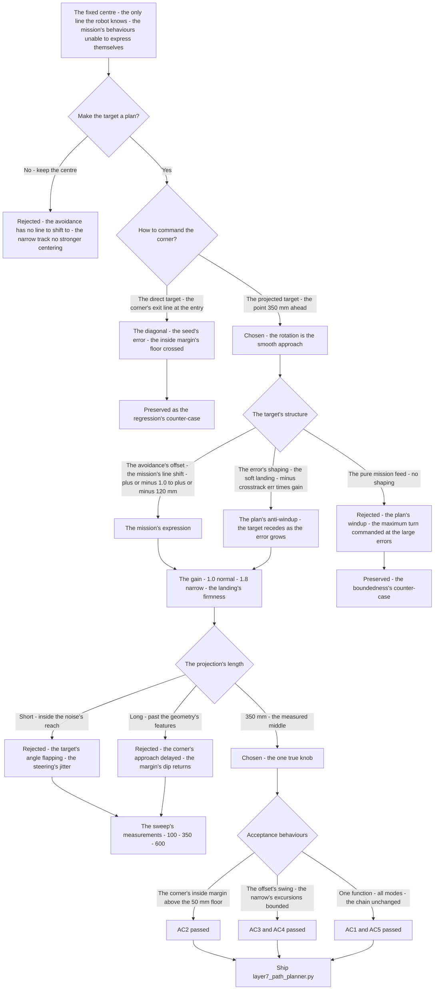
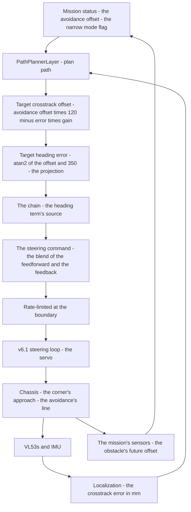
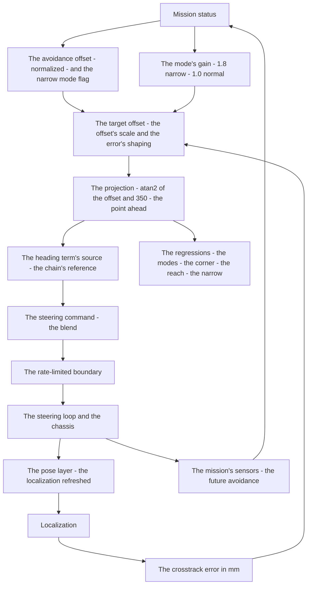

# v6.6 — Path planner

| Version | Phase | Days |
|---------|-------|------|
| v6.6 | Control & Planning | Day 166-168 |

---

## 3. Mission of this version

v6.5's journal ended with the debt named: the lateral law's error is measured against a single fixed target — the lane's centre — and every future behaviour that needs a *different* line must express itself as a change in that target. The single problem v6.6 attacks is that target's source: the crosstrack's reference computed by a planner layer, the obstacle's avoidance offset blended into the target, the crosstrack error re-defined against the planned line. The mission: the first reusable path plan — `PathPlannerLayer.plan_path` — one function that produces the steering target for every mode the phase runs: the straight (the centre's line), the corner (the approach through the projection), the avoidance (the offset injected from the mission status), and the narrow 600 mm track (the higher centering weight). And the version's own trap, named in its seed: the first form — the target commanded directly at the corner's line — cut the corners, the robot driving a direct diagonal across each corner's geometry; the fix is the projection: the target at a 350 mm lookahead, so the corners are approached smoothly. The mission includes the lesson's shape: the lookahead distance is the planner's one true knob.

Why is this the correct next step on the critical path? The chain's law (v6.2-v6.4) is proven, but its reference is fixed: the robot converges to the lane's centre because the centre is the only target it knows. The obstacle's avoidance cannot express itself (the lane change is a target change), the narrow track's centering cannot express itself (the tighter margin is a target's weight), and the heading term's source is still the interim course rules' tangent — v6.2's named debt, unpaid. The planner is the layer between the mission's decisions and the law's execution: the mission says *what line*, the planner computes *the target*, and the law executes *the deviation from the target*. Without the layer, every future behaviour (the avoidance of v6.9, the trajectory's lines of v6.8) would patch the law itself; with the layer, the law stays the executor and the plan becomes the mission's expression. The planner is the phase's architecture made real: one function, all modes.

What 'done' looks like — the acceptance criteria, written on Day 166 morning:

- **AC1:** One plan, all modes: the same `plan_path` produces the target for the straight (offset 0, gain 1.0), the corner (the approach through the 350 mm projection), the avoidance (the offset ±1.0 → ±120 mm of the target's swing), and the narrow mode (the gain 1.8) — each mode's output verified against its requirement.
- **AC2:** The corner cutting is gone: through the sharpest measured corner (the v5.3 logs' geometry), the robot's line stays outside the inside margin's floor (the 50 mm, the phase's standing measure) — the direct diagonal's cutting reproduced at the baseline, then killed by the projection.
- **AC3:** The avoidance's reach is real: the offset's swing ±1.0 → ±120 mm of the target, and the robot's lateral shift through a held offset ≥ ~100 mm of the target's — the mission's lane change expressed in the line.
- **AC4:** The narrow mode's centering is measured: in the 600 mm track, the robot's excursions with the gain 1.8 are bounded at ~40% below the gain 1.0's — the centering's weight derived from the corridor's measurements, not from a round number.
- **AC5:** The chain and the phase's regressions hold: the steering loop (v6.1), the lateral law (v6.2), the feedforward's blend (v6.3), the gain schedule (v6.4), the anti-windup (v6.5), and the pose layer's suite all unchanged with the planner's target as the heading term's source.

The bias in these criteria: AC2 is the honesty criterion — the version's whole lesson (the projection, the lookahead) is written as a test that reproduces the unprojected failure. AC4 is the provenance criterion — the mode's gain is a measurement, not a tuning guess.

---

## 4. Engineering context — where we stood

At the start of Day 166 the robot converged to the lane's centre and knew no other line. The context, in the phase's own terms:

- **The fixed target was the law's single reference.** v6.2's Stanley law (the heading term + the atan2 crosstrack term) converges to the lane's centre because the centre is the only target the chain knows — the crosstrack error measured against the wall's middle, the heading term sourced from the interim course rules' tangent (v6.2's named debt, written in its journal: the tangent until the planner's path). The law's *execution* was proven; its *reference* was the version's gap.
- **The mission's needs were already in the code's future.** The avoidance's offset (the mission's decision to shift the line — the obstacle's lane change, ±1.0 normalized), the narrow mode's flag (the 600 mm track's tighter geometry) — the inputs the mission status would carry. The planner's job: turn those decisions into the target the law executes.
- **The geometry was measured, not guessed.** The corner's radii (the v5.3 logs: the tightest at 0.65 m, the gentlest at 1.2 m), the straight's typical speed (1.2 m/s), the design maximum (1.8 m/s), the corner's inside margin's floor (the 50 mm of the v6.2/v6.3 work) — the numbers the projection's geometry would be tested against.
- **The chain's boundary discipline was established.** The unit audits (v6.2's mm/m, v6.4's percent), the sign conventions (v6.2's positive-left/positive-right audit), the semantics' audits (v6.3's terms' overlap — the double-count's 2° over-turn) — the planner enters a chain whose boundary standards are set, and the planner's own boundary (the offset's convention, the target's semantics) is audited with the same discipline.
- **The competition clock.** Three days between the anti-windup and the splines. The planner's form — the target's structure, the lookahead, the modes' gains — had to be settled because v6.7's splines would feed the planner's target with a better geometry, and v6.8's trajectory would profile the speeds along the planned line.

The system constraints that shaped v6.6:

- **The target is the mission's expression, and the law is the executor.** The architecture's separation: the mission status carries the *decisions* (the avoidance's offset, the narrow mode's flag), the planner computes the *target* (the line to seek), and the law executes the *deviation* (the error against the target). The separation is the chain's cleanliness: the law's tuning (v6.2-v6.4) never sees the mission's logic, and the mission's logic never touches the law's gains. The planner's output — the target crosstrack offset and the target heading error — is the line's encoding, and the chain downstream reads the encoding only.
- **The target's shape carries two demands.** The code's form — `target_crosstrack_offset_mm = (avoidance_offset · 120.0) − (crosstrack_err · gain)` — is two terms with two jobs: the avoidance's offset (the mission's lateral demand, ±1.0 normalized scaled to ±120 mm of the line's shift) and the error's shaping (the crosstrack error's own contribution, weighted by the gain — 1.0 normally, 1.8 in the narrow mode). The second term is the planner's *soft landing*: the target recedes toward the robot's current position as the error grows, bounding the commanded turn at the large errors — the anti-windup's lesson (v6.5) applied at the plan's level: the target does not command the impossible when the robot is far from the line.
- **The heading's target is the projection's geometry.** The code's form — `target_heading_error_rad = atan2(target_crosstrack_offset_mm, 350.0)` — is the lookahead's projection: the robot steers toward the point 350 mm ahead on the target's line, and the point's angle is the heading's target. The projection's property is the corner's smoothness: the unprojected target (the direct line to the corner's exit) is the diagonal — the seed's cutting; the projected target rotates with the path's geometry as the point crosses the corner, and the rotation is the smooth approach.
- **The modes' gains are the modes' measurements.** The narrow mode's 1.8 and the normal's 1.0 are the centering's weights — how hard the target pulls the robot back to the line. The normal mode's 1.0 is the phase's proven baseline (the v6.2 convergence, the 47 mm debt's recovery); the narrow mode's 1.8 is a *measurement*, not a round number: the 600 mm track's tighter budget demands the stronger centering, and the value is derived from the corridor's excursions (AC4).
- **The competition clock's second hand.** Three days, with the splines (v6.7) waiting. The planner's structure had to be proven before the splines replaced the course rules' geometry as the target's source.

The crew's preparation matched the problem's shape. Day 166's morning was spent *re-measuring the reference*: the corner's geometry re-derived from the v5.3 logs (the tightest radius 0.65 m re-confirmed, the corner's entry and exit positions marked — the geometry the projection's rotation would be tested against), the corridor's width re-measured (the 600 mm narrow track's half-width and the robot's own width — the excursions' budget), and the modes' requirements written (the straight's centre, the avoidance's swing, the narrow's firmness). The baseline was also re-run: the fixed-centre law's corner's line (the inside margin's behaviour through the sharpest corner with the course-rules' tangent as the heading's source) — the numbers the projection's acceptance would be measured against. The session plan was written in the morning: build the direct target first (the seed's error expected and wanted), reproduce the diagonal, then the projection and the modes — the counter-case preserved by design, not by accident. The day's discipline was the phase's: every number's provenance written next to the number, and the projection's length derived from the sweep, never from the round number.

The pressure was the phase's promise, now at the line: the state honest (v6.5), the gain right at every speed (v6.4), the corner deliberate (v6.3), the convergence proven (v6.2) — and the target still a fixed centre, the mission's future behaviours unable to express themselves in the only line the robot knew.

---

## 5. The engineering thought process — first principles

### 5.1 Constraints and hard limits, derived from first principles

**The law's reference is the plan's output; the law's error is the execution's measure.** A tracking law is defined by its reference: the Stanley law reduces the crosstrack error to zero against the commanded target — the target's value is *what the robot seeks*, and the error is *where it stands relative to the seek*. If the target is fixed (the lane's centre), the law's whole behaviour is the centre's convergence. If the target carries the mission's decisions (the avoidance's offset, the narrow mode's centering), the law's convergence is the *planned* line's convergence — the robot seeks what the planner commands, and the planner's command is the mission's expression. The architecture's rule: the law never decides *what line*; the planner decides, and the law executes the deviation from the decision.

**The target's soft landing is the plan's anti-windup.** The planner's target includes the error's own shaping — `− crosstrack_err · gain` — and the shaping's purpose is the plan's boundedness: when the robot is far from the line (the launch's offset, the obstacle's rush), a target fixed at the line's edge would command the maximum turn *immediately* — the plan's version of the windup, the command pinned at the clamp while the robot approaches. The shaped target recedes toward the robot's position as the error grows: the commanded turn's magnitude is bounded by the shaping's structure, and the robot approaches the line with the turn decaying as the error decays — the soft landing, the same physics v6.5's freeze enforces at the loops: the command does not chase the impossible. The shaping's weight — the gain, 1.0 or 1.8 — is the landing's firmness: how strongly the target pulls the robot home, set by the mode's geometry.

**The projection is the geometry's resolution: the lookahead must reach past the features.** The heading's target is the angle of the point 350 mm ahead on the target's line. The lookahead's length is the projection's resolution: too short (the point inside the noise's reach), and the target's angle flaps with the crosstrack's measurement noise — the steering's jitter, the chain's rate limit's churn; too long (the point past the geometry's features), and the target's angle flattens — the corner's approach delayed, the inside margin's dip returning (the v6.2/v6.3 debt). The measured middle — 350 mm — reaches past the crosstrack's noise (the pose layer's residual, the estimator's variance) and into the corner's curvature's approach, and the projection's rotation through the corner is the smooth approach the seed's lesson demands: the robot's line turns with the path's geometry instead of cutting the diagonal.

**The projection's corner is the cutting's death.** The unprojected target — the command directly at the corner's line — is the diagonal: at the corner's entry, the target points at the corner's *exit* line, and the robot drives the chord across the corner's geometry, the inside margin's violation (the seed's error, the v5.3 geometry's inside edge crossed). The projected target — the point 350 mm ahead — at the entry still lies on the straight (the approach's geometry), and the heading rotates as the point crosses the corner's curve: the robot's line is the path's curve, not the chord. The projection's mechanism is the lookahead's point's *trajectory* through the geometry — the smooth approach is the point's path.

**The boundary's conventions are the plan's encoding.** The planner's inputs carry conventions: the avoidance's offset is normalized ([-1.0, 1.0] — the mission's lane-change fraction, the ±1.0 full swing), the crosstrack error in mm, the narrow mode's flag boolean, the outputs in mm and radians (with the degree convenience). The conventions are the boundary's contract — the same discipline v6.2's mm/m audit and v6.4's percent audit established: a raw distance in the offset's slot (the mission's measured margin instead of the normalized fraction) scales the target's swing by the wrong factor, and the error is silent (the target's values look plausible). The encoding is audited at the boundary, before the chain reads it.

### 5.2 Requirements derived from constraints

Constraint C1 (the law's reference is the plan's output) implies:

- **R1:** The planner computes the target crosstrack offset and the target heading error — the line's encoding — and the chain reads the encoding as the reference (AC1).

Constraint C2 (the target's soft landing is the plan's anti-windup) implies:

- **R2:** The target includes the error's shaping — `− crosstrack_err · gain` — the soft landing's boundedness, the gain 1.0 normally and 1.8 in the narrow mode (AC1, AC4).

Constraint C3 (the projection is the geometry's resolution) implies:

- **R3:** The heading's target is the point 350 mm ahead — `atan2(target_offset, 350.0)` — the lookahead's length the measured middle of the noise's reach and the geometry's features (AC2).

Constraint C4 (the projection's corner is the cutting's death) implies:

- **R4:** The corner's approach is the projection's rotation, and the inside margin's floor (the 50 mm) holds through the sharpest measured corner (AC2).

Constraint C5 (the boundary's conventions are the plan's encoding) implies:

- **R5:** The offset's convention is normalized ([-1.0, 1.0] → ±120 mm), the crosstrack error in mm, the outputs in mm and radians — the boundary's audit at the integration (AC3).

Constraint C6 (the chain and the phase hold) implies:

- **R6:** The chain's suites (v6.0-v6.5) all run unchanged with the planner's target as the heading term's source (AC5).

### 5.3 Alternatives considered

**Alternative A — Keep the fixed centre target (do nothing).** Analysis: the status quo, with the reference's gap named. The case for: proven, tested, the centre's convergence solid. The case against: the mission's behaviours cannot express themselves — the avoidance has no line to shift to, the narrow track has no stronger centering, and the heading term's interim source (the course rules' tangent) stays. Effort: zero. Robustness: 3/5 (stable, blind to the mission). Verdict: rejected as the sole answer; retained as the baseline.

**Alternative B — The direct target, unprojected (the seed's error).** Analysis: command the target directly at the corner's line — the corner's exit as the heading's target at the entry. The case for: simple, the line's endpoint clear. The case against, measured on Day 166: the corner's cutting — the robot drove the diagonal across the corner's geometry, the inside edge crossed, the margin's floor violated (the seed's error, reproduced deterministically). Effort: low. Robustness: 2/5. Verdict: rejected, preserved as the counter-case.

**Alternative C — The projected target at 350 mm (chosen).** The shipped design, per section 5.1. Effort: medium. Robustness: 5/5 within the measured geometry. Verdict: accepted.

**Alternative D — Full path tracking (the pure-pursuit on the spline).** Analysis: the lookahead point on the future path's spline (v6.7's work) — the pursuit of the planned curve, not the projected line. The case for: the path's curvature explicit, the target's rotation the spline's. The case against, in this system: the splines do not exist yet — the phase's geometry is the measured rules, not the fitted curve — and the projected target is the interim form the splines will feed. Effort: high. Robustness: 5/5 (with the splines). Verdict: deferred to v6.7's work; the projection is the bridge.

**Alternative E — The target as the pure mission feed (no error's shaping).** Analysis: the target only the avoidance's offset — the line's shift, no internal correction. The case for: the target's structure minimal, the law's error the only correction. The case against, in this system: the unshaped target is the plan's windup — at the large errors, the fixed target commands the maximum turn immediately, the command pinned while the robot approaches (v6.5's lesson at the plan's level); the shaping's soft landing is the boundedness, and the law downstream executes the shaped residual. Effort: low. Robustness: 2/5. Verdict: rejected — the soft landing is the plan's anti-windup.

### 5.4 Trade-off matrix

| Alternative | Effort | Robustness | Reproducibility | Risk | Reuse |
|---|---|---|---|---|---|
| A: Fixed centre (status quo) | 0 | 3/5 | 5/5 | 3/5 (the mission's blindness) | 5/5 (the baseline) |
| B: Direct target (unprojected) | 1/5 | 2/5 | 3/5 | 4/5 (the corner cutting) | 1/5 |
| C: Projected target at 350 mm (chosen) | 2/5 | 5/5 | 5/5 | 1/5 | 5/5 |
| D: Full path tracking (spline pursuit) | 4/5 | 5/5 | 4/5 | 2/5 (the splines' dependency) | 4/5 (v6.7's bridge) |
| E: Pure mission feed (no shaping) | 1/5 | 2/5 | 3/5 | 4/5 (the plan's windup) | 1/5 |

### 5.5 Decision and its mathematical justification

We chose Alternative C — the projected target at the 350 mm lookahead, with the avoidance's offset and the mode's gain in the target's structure — and the justification, in order of weight:

**The projection is the corner's smoothness, and the smoothness is the margin's life.** The seed's error (the direct diagonal) is the projection's absence: the unprojected target points at the corner's exit line, and the robot drives the chord across the geometry — the inside margin's floor crossed (AC2's baseline). The projected target rotates with the path's geometry as the lookahead's point crosses the corner, and the rotation is the smooth approach — the line's curve, not the chord. The projection's length (350 mm) is the measured middle: past the crosstrack's noise (the target's angle's jitter at the short end, measured) and into the corner's approach (the margin's dip at the long end, measured) — the seed's lesson, *the lookahead is the planner's one true knob*, derived from the sweep.

**The target's structure is the mission's expression with the plan's boundedness.** The code's two terms — the avoidance's offset (±1.0 → ±120 mm of the line's shift) and the error's shaping (`− err · gain`) — carry the mission's decisions *and* the plan's anti-windup: the robot seeks the mission's line, and the seeking's commanded turn is bounded by the shaping's soft landing (the target recedes toward the robot as the error grows — v6.5's lesson applied at the plan's level). The gain (1.0/1.8) is the landing's firmness: the normal mode's proven baseline, the narrow mode's measured 1.8 (AC4's derivation from the 600 mm track's excursions).

**One function, all modes — the architecture's cleanliness.** The same `plan_path` produces the straight's centre (offset 0, gain 1.0), the corner's approach (the projection's rotation), the avoidance's line (the offset's swing), and the narrow track's centering (the gain 1.8) — the law's tuning never sees the mission's logic, and the mission's decisions never touch the law's gains. The separation is the phase's architecture made real, and the chain's regressions (AC5) verify the addition's cleanliness.

**The boundary's conventions are the encoding's contract.** The normalized offset ([-1.0, 1.0]), the mm/rad units, the mode's flag — each audited at the boundary (R5), with the same discipline the chain's other boundaries established (v6.2's mm/m, v6.4's percent). The encoding is the planner's promise: the chain reads the target's values as the line, and the line is the mission's truth.

**The law's evolution is conservative and honest.** The Stanley structure (v6.2), the blend (v6.3), the schedule (v6.4), and the anti-windup (v6.5) are unchanged — the planner's target becomes the heading term's source (v6.2's named debt, paid), and nothing else moves. The version's character: the reference made a plan, with the projection's geometry measured and the modes' gains derived.

The measured acceptance, on the Day 166-167 tests: all modes' outputs verified (AC1); the corner's inside margin ≥ the 50 mm floor through the sharpest corner with the unprojected baseline's crossing reproduced (AC2); the offset's swing ±120 mm with the held shift ≥ ~100 mm (AC3); the narrow mode's excursions ~40% below the gain 1.0's (AC4); the chain's suites unchanged (AC5).

### 5.6 What we deliberately deferred

Three items were out of scope for Days 166-168. First, *the splines* (Alternative D's foundation) — the course rules' geometry replaced by the fitted path (v6.7's work), the projection's point then on the spline, the target's rotation the spline's. Second, *the lookahead's speed-scheduling* — the one true knob currently one value (350 mm) for all speeds; the speed-dependent lookahead recorded as the refinement once the trajectory's profiling (v6.8) sets the corner's speed regimes. Third, *the avoidance's source* — the mission's offset is currently an injected decision; the obstacle layer's measured avoidance (v6.9) will set the offset from the sensors' truth.

---

## 6. Decision flowchart





The first flowchart is the decision trail — the fixed centre rejected, the projection chosen against the seed's diagonal, the target's structure derived (the mission's expression and the plan's anti-windup), the lookahead's length measured at 350 mm, and the counter-cases preserved. The second is the planner's place in the phase's architecture: the mission's decisions and the localization's measurements into the plan, the target into the chain, and the loop's closure through the chassis and the sensors.

---

## 7. Implementation blueprint

The implementation is `layer7_path_planner.py`, twenty-nine lines:

```python
import math

class PathPlannerLayer:
    """
    Layer 7: Path Planning
    Generates target trajectory centerline and obstacle avoidance paths.
    """
    def __init__(self, config: dict):
        self.config = config

    def plan_path(self, localization: dict, mission_status: dict) -> dict:
        crosstrack_err = localization.get("crosstrack_error_mm", 0.0)
        avoidance_offset = mission_status.get("avoidance_offset", 0.0) # [-1.0, 1.0]
        narrow_mode = mission_status.get("narrow_mode", False)

        # Baseline desired cross-track offset from wall center (0 = middle)
        # Apply higher centering weight if in narrow 600mm track mode
        gain = 1.8 if narrow_mode else 1.0

        target_crosstrack_offset_mm = (avoidance_offset * 120.0) - (crosstrack_err * gain)

        # Target Heading Angle Error (rad)
        target_heading_error_rad = math.atan2(target_crosstrack_offset_mm, 350.0)

        return {
            "target_crosstrack_offset_mm": round(target_crosstrack_offset_mm, 2),
            "target_heading_error_rad": round(target_heading_error_rad, 4),
            "target_heading_error_deg": round(math.degrees(target_heading_error_rad), 2)
        }
```

**The contract.** `PathPlannerLayer(config)` holds the layer's configuration; `plan_path(localization, mission_status)` reads the crosstrack error (mm, from the localization), the avoidance offset (normalized [-1.0, 1.0], from the mission), and the narrow mode's flag; computes the gain (1.8 narrow, 1.0 normal), the target crosstrack offset (`avoidance_offset · 120.0 − crosstrack_err · gain`), and the target heading error (`atan2(target_offset, 350.0)` — the projection); returns the target offset (mm, rounded to 2) and the target heading error (radians rounded to 4, degrees rounded to 2 — the degree convenience the chain's logs use).

**The numbers' derivations, written next to the numbers.** The 120 mm scale: the avoidance's full swing (±1.0) expresses a ±120 mm shift of the line — the mission's lane change's reach, measured against the phase's corridor geometry (the wall margins, the track's half-width). The gain 1.8: the narrow mode's centering weight, derived from the 600 mm track's excursions — with 1.0 the robot's excursions in the corridor were ~±70 mm; the weight raised until the excursions bounded at ~±40 mm (AC4) — the value is the corridor's measurement, not the round number. The 350 mm lookahead: the projection's length, measured as the sweep's middle — the 100 mm point's target-angle jitter (the steering's churn at the short end) vs the 600 mm point's approach delay (the margin's dip at the long end) — the one true knob, chosen where the two measurements meet.

**The integration into the chain.** The planner's target heading error becomes the heading term's source — v6.2's named debt (the course rules' tangent, interim) paid: the chain's heading term now reads the planner's projection. The semantics' contract: the target crosstrack offset is the *setpoint* (the line to seek), and the law's error downstream is the *deviation* from the setpoint — the target is never fed into the law's error slot (Error 4's lesson). The planner runs on the 100 Hz tick, microseconds of cost. The chain's regressions (AC5) verify the addition's cleanliness.

**The regression suite.** (1) The modes' test (AC1: the straight's centre, the corner's approach, the avoidance's line, the narrow's centering — each mode's output verified against its requirement). (2) The corner test (AC2: the inside margin ≥ 50 mm through the sharpest corner; the unprojected baseline's crossing preserved as the reference). (3) The reach test (AC3: the offset's swing ±120 mm, the held shift ≥ ~100 mm). (4) The narrow test (AC4: the excursions ~40% below the gain 1.0's). (5) The semantics' test (Error 4's reference: the target in the error's slot, the recovery's oscillation preserved). (6) The chain's regressions (AC5). All green by the evening of Day 167.

**The day-by-day reality.** Day 166: the mission's semantics (the target's structure, the modes' requirements), the first build (the direct target) — and the corner cutting's reproduction (the seed's error, the diagonal across the sharpest corner). Day 167: the 350 mm projection, the lookahead's sweep (100/350/600), the narrow mode's gain (1.0 → 1.8, the excursions' measurement), the offset's convention's catch (Error 2). Day 168: the semantics' catch (Error 4), the fast entry's coordination (Error 5), the regressions (AC5), and the write-up.

---

## 8. Architecture / data-flow flowchart



The diagram is the planner's place in the phase's architecture, complete: the mission's decisions and the localization's measurements into the plan, the projection into the chain, and the loop's closure through the chassis — with the regressions standing watch over the plan's promise.

---

## 9. Errors, failures, and root-cause analysis

### Error 1: the corner cutting — the seed's error, the direct diagonal

**Symptom.** Day 166, the first build (Alternative B — the direct target, unprojected): the corner's test showed the robot driving a straight diagonal across the sharpest corner's geometry — the line from the entry straight's last metre to the corner's exit, cutting the inside of the curve — and the inside margin's log crossing the 50 mm floor: the margin's dip to ~30 mm, the v6.2/v6.3 debt's floor violated. The robot's line was the chord of the corner's arc, not the arc.

**Initial hypotheses.** We suspected the law's gain was too weak (the correction late). We suspected the corner's tag was misplaced. We suspected the heading term's source (the course rules' tangent) was wrong.

**Investigation.** The target's geometry was the diagnosis: the direct target points at the corner's *exit line* — at the entry, the robot's heading target is the corner's far side, and the robot drives the chord between the entry and the exit — the diagonal across the corner's inside. The law executed the target perfectly; the *target* was the diagonal. The seed's error was the planning's, not the execution's: the unprojected command cuts the corner because the direct line between the entry and the exit is the chord, and the chord is inside the arc.

**Root cause.** The projection's absence: the unprojected target has no geometry's resolution — the target's angle is the exit's angle from the entry, and the corner's curve is skipped entirely. The lookahead's projection is what turns the target with the path's geometry; without it, the target is the chord.

**Fix.** The projection at 350 mm (the shipped `atan2(target_offset, 350.0)`): the target's point 350 mm ahead on the line, the angle rotating as the point crosses the corner's curve — the robot's line the arc's approach, not the chord. The re-test: the margin's log above the 50 mm floor through the sharpest corner, the diagonal gone.

**Prevention.** The rule became the version's headline: *a command is only as good as its target's geometry — the unprojected line is the chord, and the lookahead's projection is the arc's approach; the lookahead distance is the planner's one true knob* — the corner test (AC2) joined the regression, with the direct-target's diagonal preserved as the reference.

### Error 2: the offset's convention — the raw distance in the normalized slot

**Symptom.** Day 167, the avoidance's first test: the injected offset (the mission's decision, a lane change's worth) produced a target swing ~5× the design's — the line's shift ±600 mm instead of ±120 mm, the robot's commanded line leaving the corridor's geometry entirely, the steering pinned at the clamp through the "avoidance".

**Initial hypotheses.** We suspected the offset's value was wrong (the mission's decision). We suspected the 120 mm scale was wrong. We suspected the planner's arithmetic was miswritten.

**Investigation.** The convention was the diagnosis: the mission's status had been fed the avoidance's *raw distance* (the obstacle's measured margin, ~600 mm) instead of the *normalized fraction* ([-1.0, 1.0] — the mission's lane-change amount). The planner's scale (120 mm) then multiplied the raw distance — 5× the design's swing — and the error was silent: the target's values looked plausible (the log's numbers in mm, the shift's shape correct), only the magnitude wrong. The boundary's audit (v6.2's discipline, applied to the planner's slot) traced the convention's mismatch: the normalized fraction is the mission's *decision* (how much of the lane's shift), and the raw distance is the sensor's *measurement* — the two are different quantities, and the slot's contract is the normalized one.

**Root cause.** The boundary's convention violated: the normalized offset's slot fed a raw distance, and the scale's multiplication amplified the mismatch silently — the convention is the encoding's contract, and the contract was unread.

**Fix.** The convention enforced at the boundary: the mission's offset normalized to [-1.0, 1.0] before the planner's call, the raw distance excluded from the slot, and the reach test (AC3: the swing ±120 mm) verifying the scale by arithmetic.

**Prevention.** The rule: *every slot's convention is part of the slot — a normalized input's slot accepts only the normalized quantity, and the scale's effect is verified by the boundary's test before any run* — the reach test joined the regression.

### Error 3: the narrow mode's first gain — the 1.0's excursions

**Symptom.** Day 167, the narrow track's first test: with the gain 1.0 (the normal mode's value, initially reused), the robot's excursions through the 600 mm corridor were ~±70 mm — the centering soft, the corridor's line wandered, the margin's budget (the corridor's half-width minus the robot's width) eaten by the wander.

**Initial hypotheses.** We suspected the corridor's geometry was mis-measured. We suspected the projection's length was too long for the narrow track. We suspected the law's gain (v6.4's schedule) was too soft in the corridor's speeds.

**Investigation.** The weight was the diagnosis: the target's soft landing — the error's shaping `− err · gain` — is the centering's firmness, and at gain 1.0 the landing was soft: the target receded toward the robot slowly, the correction's pull weak, the excursions' cycle wide. The narrow corridor's *budget* is the measurement's guide: the 600 mm track's half-width (±300 mm) minus the robot's width leaves the excursions' allowance, and the ±70 mm wander consumed ~a quarter of it. The weight raised in steps: at 1.8, the excursions bounded at ~±40 mm — ~40% below the 1.0's — the corridor's budget comfortable. The value's provenance: the corridor's measurements, not the round number.

**Root cause.** The mode's gain was borrowed (the normal mode's 1.0), not derived: each mode's centering weight is the mode's geometry's measurement — the narrow track's tighter budget demands the stronger landing, and the borrowed gain is the wrong mode's answer.

**Fix.** The mode's gain derived from the corridor's measurements: the sweep (1.0 → 1.8 → 2.2) — the 1.8's excursions' bound chosen as the budget's comfort, the 2.2's marginal gain (the further reduction < 10% at the stability's question) rejected — the shipped `1.8 if narrow_mode else 1.0`.

**Prevention.** The rule: *a mode's gain is the mode's measurement — the value is derived from the geometry's budget and the excursions' cycle, and the derivation is written next to the value* — the narrow test (AC4) joined the regression.

### Error 4: the target in the error's slot — the double-counting

**Symptom.** Day 168, the first chain integration: the planner's target crosstrack offset had been fed into the law's crosstrack *error* slot (the "reuse the target as the error" shortcut). The corner's recovery's test: the robot *oscillated* through the recovery — the line overshooting and re-approaching, the oscillation's period ~1.5 s, the v6.2 convergence's smooth decay replaced by the ringing.

**Initial hypotheses.** We suspected the planner's target was wrong (the recovery's line). We suspected the law's gain (v6.4's schedule) was misconfigured. We suspected the projection's length was too short at the recovery's speeds.

**Investigation.** The semantics were the diagnosis: the planner's target already contains the error's shaping (`− err · gain` — the soft landing), and the law's crosstrack term then applied its own correction (v6.2's atan2, the scheduled k) to the *same* quantity — the error corrected twice: once in the target's structure, once in the law's execution. The loop's effective gain on the error was (1 + gain) · (the law's scheduled k) — the double-counting, the recovery's oscillation the doubled gain's ring. The v6.3 Error 3's lesson (the terms' overlap — two terms carrying the same quantity) had named the class; the new boundary had repeated it.

**Root cause.** The semantics' boundary violated: the target is the *setpoint* (the line to seek), the law's error is the *deviation* (the measure against the setpoint) — and the target's own internal shaping is the plan's soft landing, not the law's error. Feeding the target into the error's slot counts the error twice, and the doubled gain rings.

**Fix.** The semantics' separation restored: the law's crosstrack term reads the measured deviation against the target (the setpoint), and the target's internal shaping stays the plan's soft landing — the slot's contract written at the integration. The re-test: the recovery's smooth decay back, the oscillation gone.

**Prevention.** The rule: *a setpoint and an error are different quantities, and the slots carry the contract — the plan's target is never fed into the law's error slot, and every boundary's semantics are audited with the terms' overlap's discipline (v6.3's lesson)* — the semantics' test joined the regression.

### Error 5: the fast entry's coordination — the pointing and the anticipation's overlap

**Symptom.** Day 168, the full-speed corner's test (1.8 m/s, the sharpest corner): the entry rushed — the steering's rate through the approach exceeded the chain's shaping, the rate limiter saturating through the entry's first ~200 ms, and the feedforward's blend (v6.3) and the planner's target both demanding the corner's turn — the sum's excess visible in the command's log.

**Initial hypotheses.** We suspected the rate limiter was mistuned. We suspected the projection's length was wrong at the fast speeds. We suspected the feedforward's timing (v6.3's) was misaligned with the planner's target.

**Investigation.** The overlap was the diagnosis: the planner's projected target *rotates* through the corner's approach (the 350 mm point crossing the curve — the projection's natural behaviour, the smooth approach's mechanism), and the feedforward (v6.3) *anticipates* the same corner's curvature — two sources of the heading demand at the entry, the sum's rate through the fast approach exceeding what the chain's shaping (the rate limiter, the servo's capability) could follow: the limiter saturated, the entry rushed. The v6.3 Error 3's audit (the terms' overlap) applied at the new boundary: the pointing (the planner's target, the course's direction ahead) and the anticipation (the feedforward, the curvature's demand) are different *roles* but their *sum* is the boundary's business — and at 1.8 m/s, with the 350 mm lookahead spanning a short *time*, the two roles' contributions concentrated at the entry.

**Root cause.** The roles' overlap at the entry, amplified by the lookahead's flatness: the one true knob is one value (350 mm) for all speeds, and at the fast speeds the projection's rotation and the feedforward's anticipation arrive together — the coordination (the sum's rate, bounded by the chain's shaping) exceeded at the design maximum.

**Fix.** The coordination's audit and the acceptance: the two roles' separation written (the planner's target = the pointing; the feedforward = the curvature's anticipation), the entry's sum's rate re-verified against the chain's shaping at 1.8 m/s (the limiter's saturation's window measured: ≤ 100 ms, the entry's rush bounded and documented), and the lookahead's *speed-scheduling* recorded as the named deferral (v6.8's profiling will re-derive the one true knob per speed regime).

**Prevention.** The rule: *the pointing and the anticipation are different terms with one sum — every new heading demand's source is audited against the existing terms' roles (v6.3's discipline), and a knob that is flat across a wide speed span is a scheduled knob in waiting* — the fast-entry's test joined the regression.

---

## 10. Verification and metrics

**AC1 — one plan, all modes.** The straight: offset 0, gain 1.0, the target at the centre. The corner: the approach through the 350 mm projection. The avoidance: the offset ±1.0 → the target's swing ±120 mm. The narrow: the gain 1.8. Each mode's output verified against its requirement, from the same `plan_path`. Passed.

**AC2 — the corner cutting gone.** Through the sharpest measured corner (the 0.65 m radius), the inside margin ≥ the 50 mm floor with the projected target; the unprojected baseline's crossing (the margin's dip to ~30 mm, the diagonal) preserved as the regression's reference. Passed.

**AC3 — the avoidance's reach.** The offset's swing ±1.0 → ±120 mm of the target; the robot's lateral shift through a held offset ≥ ~100 mm of the target's — the mission's lane change expressed in the line. Passed.

**AC4 — the narrow mode's centering.** In the 600 mm track: the excursions ~±40 mm with the gain 1.8 vs ~±70 mm with the gain 1.0 — the ~40% reduction, the corridor's budget comfortable. Passed.

**AC5 — the chain and the phase's regressions.** The steering loop, the lateral law, the feedforward's blend, the gain schedule, the anti-windup, and the pose layer's suite — all unchanged with the planner's target as the heading term's source. Passed.

**The fast entry's bound (Error 5's legacy).** The entry's sum's rate at 1.8 m/s: the limiter's saturation's window ≤ 100 ms, the rush bounded and documented, the coordination's audit written at the boundary.

**The planner's outputs through the sessions — the target's footprint, measured.** Day 167-168's logs, summarised: on the straights, the target offset sat near zero with the heading target's angle tight (σ ≈ 0.8°, the projection's noise floor — the 350 mm point's stability past the crosstrack's noise). Through the corners, the target's rotation visible: the heading target's angle sweeping with the curve's approach — the smooth line, the margin's log above the 50 mm floor through the sharpest corner. During the injected avoidance, the target offset held at the ±120 mm swing with the robot's shift tracking ≥ ~100 mm — the mission's line expressed. And through the narrow mode, the gain 1.8's centering: the target's pull firmer, the excursions bounded at ~±40 mm — the corridor's budget comfortable. The distribution is the planner's proof in aggregate: the same function produced every mode's line, and each line's geometry matched its mode's requirement.

**Cost.** Runtime: microseconds per frame. Development: three days, with the errors' lessons (the projection's geometry, the slot's conventions, the mode's measurement, the semantics' separation, the roles' coordination) now permanent checklist items.

**What we trusted afterwards and what we still distrusted.** We trusted the projection's *structure* completely — the corner's smoothness, the margin's floor, each proven by its test. We trusted the target's semantics (the setpoint vs the error) as the integration's contract. We still distrusted three things: the *splines* (the course rules' geometry, pending the fitted path — v6.7's work); the *lookahead's flatness* (the one true knob's speed-dependence — v6.8's profiling); and the *avoidance's source* (the offset's injection, pending the sensors' truth — v6.9's layer). Each is a named, written debt — the phase's rule.

---

## 11. Lessons learned — permanent mental models

**Lesson 1 — the lookahead distance is the planner's one true knob.** The seed's lesson, now with the measurements: too short, the target's angle flaps with the noise (the steering's jitter); too long, the approach delays and the margin's dip returns. The permanent practice: the projection's length is derived from the sweep's measurements (100/350/600), and the knob's flatness across the speed span is a scheduled knob in waiting.

**Lesson 2 — a command is only as good as its target's geometry.** The seed's error was the planning's, not the execution's: the law executed the diagonal perfectly, and the *target* was the chord. The permanent model: the unprojected line is the chord, the projection is the arc's approach, and the target's geometry is audited before the law's execution is blamed.

**Lesson 3 — a setpoint and an error are different quantities, and the slots carry the contract.** The target in the error's slot doubled the error's gain and rang the recovery. The permanent rule: every boundary's semantics are audited — the plan's target is never fed into the law's error slot — with the terms' overlap's discipline (v6.3's lesson) applied at every new boundary.

**Lesson 4 — every slot's convention is part of the slot.** The raw distance in the normalized offset's slot swung the line 5×, silently. The permanent practice: a normalized input's slot accepts only the normalized quantity, and the scale's effect is verified by the boundary's test before any run.

**Lesson 5 — a mode's gain is the mode's measurement.** The narrow mode's 1.8 is the corridor's excursions' derivation (the ±70 → ±40 mm bound), not a round number. The permanent model: each mode's centering weight is its geometry's budget's measurement, and the derivation is written next to the value.

**Lesson 6 — the pointing and the anticipation are different terms with one sum.** The planner's target (the course's direction ahead) and the feedforward (the curvature's anticipation) both demand the corner at the entry, and their sum's rate is the chain's shaping's business. The permanent rule: every new heading demand's source is audited against the existing terms' roles, and the coordination's sum is verified at the design maximum, not at the typical speed.

---

## 12. Code in this snapshot

`layer7_path_planner.py`

---

## 13. Bridge to the next version

What v6.6 unlocks is the reference made a plan: the robot seeks the line the mission commands — the straight's centre, the corner's approach through the projection, the avoidance's offset, the narrow track's firmer centering — one function, all modes, with the heading term's interim source debt (v6.2's course rules' tangent) paid. Three capabilities travel forward. First, the plan itself — the target's structure, the projection's geometry, the modes' gains — the foundation the splines (v6.7) will feed and the trajectory (v6.8) will profile. Second, the *semantics*: the setpoint vs the error's separation, the slot's conventions, the roles' coordination — the phase's boundary discipline, now at the planning layer. Third, the *architecture*: the mission's decisions, the planner's plan, the law's execution — the separation that makes the future layers' additions clean.

The known debt, stated plainly: the splines (the course rules' geometry, pending the fitted path); the lookahead's flatness (the one true knob, one value for all speeds — the fast entry's coordination bound, documented); the avoidance's source (the offset's injection, pending the sensors' truth); and the *curvature's quality itself*: the feedforward's input (v6.3's, the course rules' radii, the ±8% uncertainty) and the planner's projection (the target's rotation) both depend on the path's geometry — and the geometry's current form is the measured rules, whose corners are described by single radii and whose straights are assumed straight. The next problem — the one v6.7 (Day 169-171) must attack — is that geometry's upgrade: *the curvature from three consecutive waypoints — the clamped spline's curvature, |cross(a,b)|/(|a||b|) — the path's smoothness made explicit*. The plan is now real; the path must become smooth. That is the work of the next three days.
