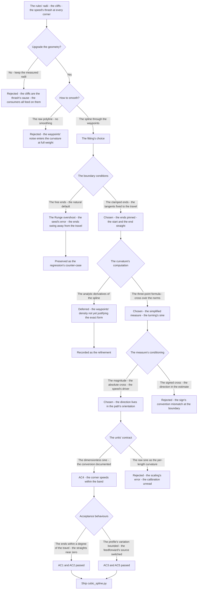
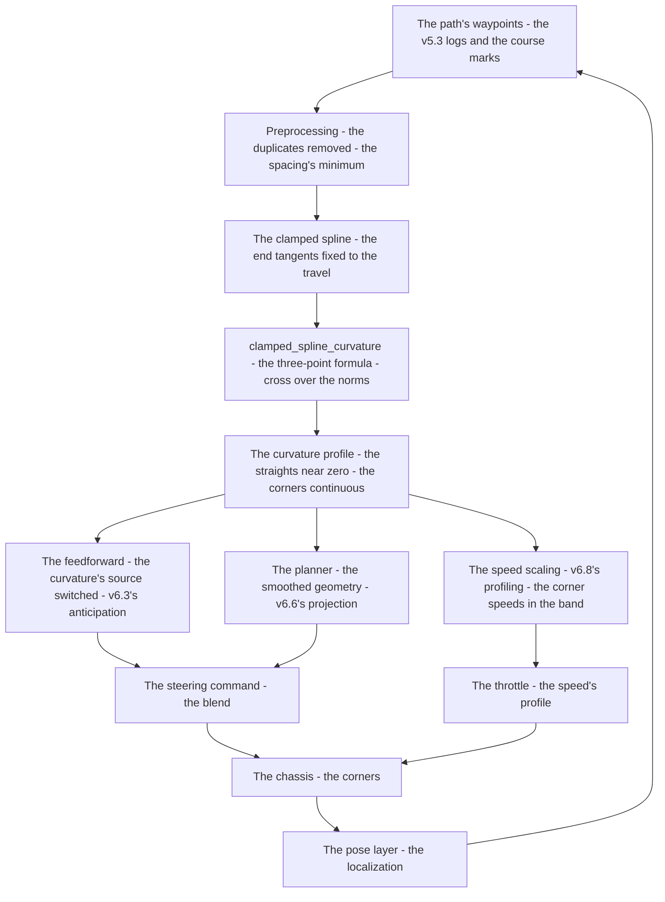
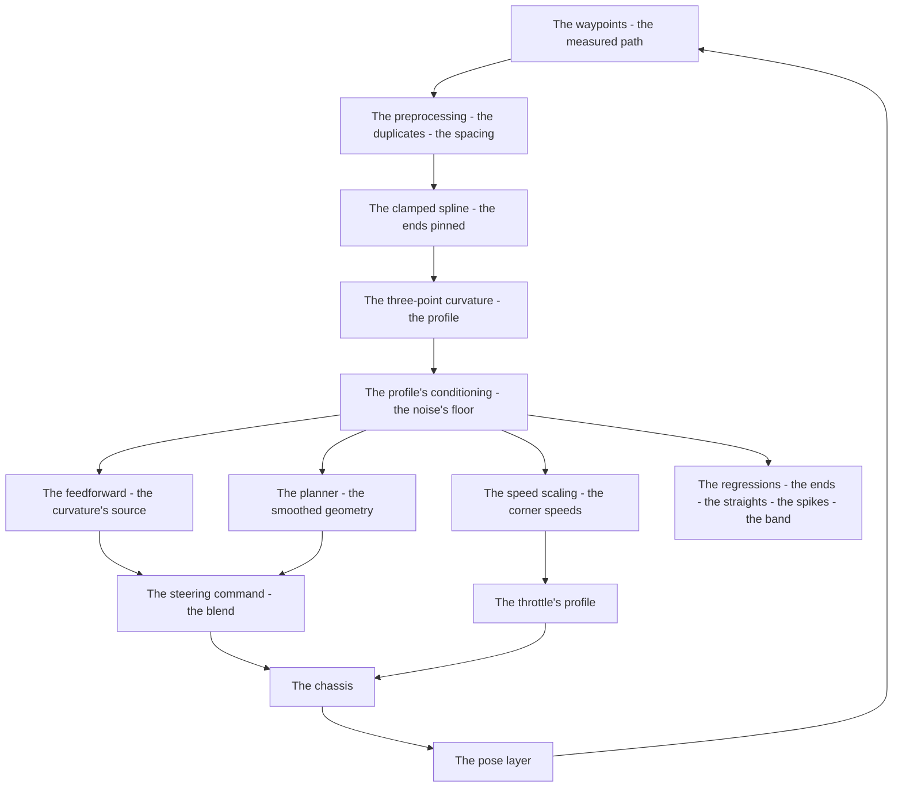

# v6.7 — Cubic spline trajectory

| Version | Phase | Days |
|---------|-------|------|
| v6.7 | Control & Planning | Day 169-171 |

---

## 3. Mission of this version

v6.6's journal ended with the debt named: the path's geometry is the measured rules — the corners described by single radii, the straights assumed straight, the feedforward's curvature input (v6.3's, the ±8% uncertainty) and the planner's projection both depending on that geometry. The single problem v6.7 attacks is the geometry's upgrade: the path's waypoints smoothed by the clamped cubic spline, and the curvature computed for the speed scaling — `clamped_spline_curvature(pts)`, the curvature from three consecutive waypoints, |cross(a,b)|/(|a||b|) — the path's smoothness made explicit. And the version's own trap, named in its seed: the spline with the free boundary conditions overshoots at its ends — the Runge phenomenon, the path's ends swinging away from the travel direction; the fix is the clamped boundary conditions, the end tangents fixed to the travel direction. The mission includes the lesson's shape: splines need boundary conditions; defaults are rarely right.

Why is this the correct next step on the critical path? The curvature's quality is the speed's quality and the anticipation's quality. The rules' single-radius corners are *estimates with cliffs*: each corner's curvature jumps from zero (the straight) to 1/R (the corner) and back — and the speed scaling that feeds on the curvature (v6.8's work, and the thrash the seed names) would slam the speed down at each cliff and back up on the straight: the speed thrashes at every corner. The smooth path's curvature is continuous — the corner's approach's curvature rising and falling smoothly — and the speed's profile follows the continuity: no thrash, no cliffs. And the feedforward (v6.3) and the planner's projection (v6.6) both read the path's geometry: the spline's curvature is the same quality upgrade for the anticipation (the feed's input's ±8% uncertainty replaced by the path's fitted geometry) and the planning (the projection's rotation the spline's continuity). The spline is the geometry's smoothness made explicit — the layer the speed's profile and the steering's anticipation both stand on.

What 'done' looks like — the acceptance criteria, written on Day 169 morning:

- **AC1:** The Runge's ends are gone: at both ends of the smoothed path, the path's tangent is within ~1° of the travel direction (the clamped condition verified) — the launch's path straight, the line-up's approach unswung, with the free-boundary's overshoot preserved as the regression's reference.
- **AC2:** The thrash is gone: the curvature profile's straights are near zero (the noise's floor), the corners' profile clean and continuous — the speed command's rate through the corners bounded, the thrash's counter-case (the rules' single-radius cliffs) preserved.
- **AC3:** The curvature's continuity is measured: the profile's variation along the path bounded — no single-waypoint spikes, the corners' profile rising and falling smoothly (the noise's floor, the monotone's approach).
- **AC4:** The profile's calibration is documented: the curvature's units (the sine of the turning angle) and their conversion to the per-length curvature are written at the profile's boundary, and the speed scaling's corner speeds fall within the expected band.
- **AC5:** The chain and the phase's regressions hold: v6.0-v6.6's suites unchanged, with the feedforward's curvature source (v6.3's input) switched to the spline's profile.

The bias in these criteria: AC1 is the honesty criterion — the version's whole lesson (the boundary conditions) is written as a test that reproduces the free-boundary's failure. AC4 is the calibration criterion — the proxy's units are documented, never silently assumed.

---

## 4. Engineering context — where we stood

At the start of Day 169 the robot's path was measured and cliffed. The context, in the phase's own terms:

- **The geometry was the rules' form, with the cliffs named.** The course rules carried the corners' radii (the v5.3 logs: the tightest 0.65 m, the gentlest 1.2 m) — single numbers per corner, the curvature's estimate jumping from zero to 1/R at each corner's boundary and back at the exit. The seed had named the consequence: the sharp curvature estimates cause the speed to thrash at every corner — the speed scaling that feeds on the curvature cannot follow the cliffs, and the robot's speed would slam and surge through every corner.
- **The curvature's consumers were in the chain, waiting.** The feedforward (v6.3) read the rules' radii for its anticipation (the ±8% uncertainty, the blend sized against it); the planner (v6.6) projected its target against the same geometry; the trajectory's speed scaling (v6.8, next) would feed on the curvature's profile. Three consumers, one source — and the source was the measured rules' cliffs.
- **The waypoints were measured, not invented.** The path's waypoints existed in the v5.3 logs' geometry and the course rules' marks — the points the spline would fit. The fitting's quality — the spline's smoothness — is the upgrade's promise: the path between the waypoints made continuous, the corners' curvature made smooth.
- **The boundary conditions were the fitting's physics.** The spline's ends need the boundary's statement: the free (natural) conditions (the second derivative zero — the common default) leave the ends' polynomials free to swing; the clamped conditions (the end tangents fixed) pin the ends to the travel direction. The seed's lesson — defaults are rarely right — was the version's first principle.
- **The competition clock.** Three days between the planner and the trajectory's optimization. The spline's form — the boundary conditions, the curvature's computation — had to be settled because v6.8's speed profiling would feed on the profile, and the thrash's cure is the profile's continuity.

The system constraints that shaped v6.7:

- **The curvature's estimate is the turning's measure, computed from the waypoints' geometry.** The shipped formula — the three consecutive waypoints, the segments a and b, |a×b|/(|a||b|) — is the discrete curvature's proxy: the sine of the angle between the segments (zero on the straight, positive at the turn), scale-invariant (the normalization), bounded (the sine ≤ 1). The estimate's quality is the waypoints' quality: the measured points' positions carry the logs' errors, and the estimate's noise is the points' noise at the formula's geometry.
- **The spline's boundary conditions are the ends' physics.** The path's ends are the travel's directions: the launch's start's direction (the straight's heading) and the line-up's end's direction. The free conditions leave the ends' polynomials unconstrained — the Runge swing, the path's ends curving away from the travel; the clamped conditions fix the end tangents to the travel's directions — the ends pinned, the path's start and end straight.
- **The curvature's units are the profile's boundary contract.** The shipped k is dimensionless (the sine of the angle); the speed scaling's physics (the centripetal acceleration's limit) needs the curvature per length (1/m). The conversion — the angle per the arc's length, θ/|a| ≈ κ — is the profile's calibration, documented at the boundary, never silently assumed (v6.8's own runtime estimate is the complement).
- **The sign's convention is the direction's business, not the magnitude's.** The shipped formula takes the absolute cross — the curvature's magnitude, the speed's driver (the thrash's cure cares about the magnitude alone). The corner's *direction* — the left/right sense — is the path's orientation's property, carried elsewhere (the feedforward's sign from the path's turning, the v6.2 sign audit's discipline); the magnitude and the direction are different quantities, and the estimate computes the magnitude.
- **The guards live at the data's boundary.** The waypoints' quality is the formula's safety: the duplicate points (the logs' standstills, the re-sampled positions) give a zero segment, and the zero denominator is the division's blow-up (the dt guard's class, v6.0's lesson, at the data's boundary). The duplicates' removal and the spacing's minimum are the preprocessing's contract, documented with the function.
- **The competition clock's second hand.** Three days, with the trajectory's optimization (v6.8) waiting. The profile's continuity had to be proven before the speed scaling fed on it.

The crew's preparation matched the problem's shape. Day 169's morning was spent *re-measuring the path*: the waypoints' list re-derived from the v5.3 logs' geometry and the course marks (the points' positions, the spacing's distribution — the measured density the spline would fit), the duplicates' hunt (the standstills' repeated points, the ~2% of the list marked for the preprocessing's removal), and the straights' noise's band (the waypoints' jitter measured against the segments' lengths — the ±5 mm scale the profile's floor would be set above). The baseline was also re-run: the rules' radii profile (the cliffs, the thrash's counter-case — the speed's command's rate through a corner with the single-radius estimate) and the free-boundary's first fit (the Runge expected and wanted). The session plan was written in the morning: build the free-boundary spline first (the seed's error expected and wanted), reproduce the ends' swing, then the clamped conditions and the curvature's computation — the counter-case preserved by design, not by accident. The day's discipline was the phase's: every number's provenance written next to the number, and the profile's floor derived from the noise's measurement, never from the round number.

The pressure was the phase's promise, now at the path: the plan real (v6.6), the state honest (v6.5), the gain right at every speed (v6.4), the corner deliberate (v6.3) — and the geometry still the rules' cliffs, the speed's thrash waiting at every corner for the profile the spline would provide.

---

## 5. The engineering thought process — first principles

### 5.1 Constraints and hard limits, derived from first principles

**The speed's smoothness is the curvature's continuity.** A speed command that feeds on the curvature inherits the curvature's shape: the rules' single-radius corners give the curvature's cliffs — zero on the straight, 1/R at the corner's boundary, zero again at the exit — and the speed command that scales against the curvature slams at each cliff: the deceleration at the corner's start, the acceleration at the exit, the thrash the seed names. The smooth path's curvature is continuous — the turning's rate rising through the approach, holding through the corner's body, falling through the exit — and the speed's profile follows the continuity: the deceleration's and the acceleration's shapes smooth, the thrash's cliffs absent. The spline's smoothing is the speed's smoothness made possible; the curvature's continuity is the thrash's cure.

**The discrete curvature is the turning's measure, and its quality is the points' quality.** The formula — the three consecutive waypoints, the segments' cross and norms — measures the turning at the middle waypoint: |a×b|/(|a||b|) = |sin θ|, the sine of the segments' angle. The measure's properties are the formula's physics: zero on the straight (the collinear segments), positive at the turn, bounded (the sine ≤ 1 — no infinite estimates), scale-invariant (the normalization removes the segments' lengths' scale). The measure's *noise* is the waypoints' noise: the measured points' positions carry the logs' errors, and the formula's sensitivity at the nearly-straight sections translates the points' jitter into the spurious curvature — the noise's floor the profile must set, or the thrash re-imports through the estimator's back door.

**The spline's boundary conditions are the ends' physics, and the defaults are the wrong ends.** The path's ends are the travel's directions — the start's straight, the line-up's straight — and the fitting's ends must be stated. The free (natural) conditions — the second derivative zero at the ends, the common default — leave the end polynomials' shapes unconstrained: the interpolant's swing at the boundaries (the Runge phenomenon), the path's ends curving away from the travel direction, the robot's launch's path and the line-up's approach deviating from the straights. The clamped conditions — the end tangents fixed to the travel's directions — pin the ends: the path's start and end follow the travel, the overshoot gone. The boundary conditions are a *choice*, and the default is a choice made without looking at the ends.

**The magnitude and the direction are different quantities.** The speed's scaling cares about the turning's *magnitude* (the corner's sharpness — the thrash's driver); the steering's anticipation cares about the turning's *direction* (the left/right sense — the feedforward's sign). The formula's absolute cross computes the magnitude — the speed's quantity — and the direction lives in the path's orientation, carried by the chain's conventions (v6.2's sign audit: the positive-left discipline). The separation is the boundary's contract: the magnitude's estimate never pretends to the direction, and the direction's source is the path's own.

**The proxy's units are the boundary's calibration, documented.** The shipped k is dimensionless — the sine of the turning angle. The physics that consumes it (the centripetal limit, v6.8's `sqrt(a_max/curvature)`) wants the curvature per length — 1/m. The conversion is the arc's geometry: the turning angle θ over the segment's length |a| — θ/|a| ≈ κ for the small angles and the fine spacing. The conversion is the profile's calibration, written at the boundary, verified by the corner speeds' band (AC4) — the proxy's honesty, never the silent assumption.

### 5.2 Requirements derived from constraints

Constraint C1 (the speed's smoothness is the curvature's continuity) implies:

- **R1:** The curvature profile is computed from the smoothed path (the clamped spline's waypoints), the straights near zero and the corners' profile continuous — the thrash's cure (AC2).

Constraint C2 (the discrete curvature is the turning's measure) implies:

- **R2:** The curvature is `|cross(a,b)|/(|a||b|)` at the interior waypoints — the shipped formula — with the profile's noise floor set (AC2, AC3).

Constraint C3 (the spline's boundary conditions are the ends' physics) implies:

- **R3:** The clamped boundary conditions — the end tangents fixed to the travel's directions — with the free-boundary's Runge overshoot preserved as the regression's reference (AC1).

Constraint C4 (the magnitude and the direction are different quantities) implies:

- **R4:** The estimate is the magnitude (the absolute cross), and the turning's direction is carried by the path's orientation — the boundary's convention audited at the integration.

Constraint C5 (the proxy's units are the boundary's calibration) implies:

- **R5:** The profile's units (the sine of the angle) and the per-length conversion are documented at the boundary, and the speed scaling's corner speeds fall within the expected band (AC4).

Constraint C6 (the guards live at the data's boundary) implies:

- **R6:** The waypoints' preprocessing — the duplicates' removal, the spacing's minimum — is the division's guard, the zero-denominator's class (v6.0's dt guard's lesson) at the data's boundary.

Constraint C7 (the chain and the phase hold) implies:

- **R7:** v6.0-v6.6's suites unchanged, with the feedforward's curvature source switched to the spline's profile (AC5).

### 5.3 Alternatives considered

**Alternative A — Keep the course rules' radii (do nothing).** Analysis: the status quo, with the cliffs named (the single-radius corners, the ±8% uncertainty, the speed's thrash). The case for: proven, measured, simple. The case against: the cliffs are the thrash's cause, and the consumers (the feedforward, the planner, the speed scaling) all feed on the cliffs. Effort: zero. Robustness: 3/5 (stable, cliffed). Verdict: rejected as the sole answer; retained as the baseline and the counter-case.

**Alternative B — The free-boundary spline (the seed's error).** Analysis: fit the waypoints with the natural spline — the second derivative zero at the ends, the common default. The case for: the default, zero decisions. The case against, measured on Day 169: the Runge overshoot at the ends — the path's start and end swinging away from the travel direction, the launch's path curving, the line-up's approach deviating (the seed's error, reproduced deterministically). Effort: low. Robustness: 2/5. Verdict: rejected, preserved as the counter-case.

**Alternative C — The clamped spline with the discrete curvature (chosen).** The shipped design, per section 5.1. Effort: medium. Robustness: 5/5 within the measured geometry. Verdict: accepted.

**Alternative D — The raw waypoints' polyline (no smoothing).** Analysis: the curvature from the measured waypoints directly, no spline. The case for: the measurements, unfiltered. The case against, in this system: the waypoints' noise enters the curvature at full weight (the spurious curvature at the straights — the thrash re-imported), and the path's jaggedness is the speed's jaggedness. Effort: low. Robustness: 2/5. Verdict: rejected — the smoothing is the point.

**Alternative E — The analytic curvature from the spline's derivatives (the exact form).** Analysis: the fitted spline's second derivative — the curvature from the polynomial's exact geometry, not the three-point proxy. The case for: the exact curvature's continuity. The case against, in this system: the phase's geometry's resolution does not yet justify the exact form (the waypoints' density, the noise's floor — the proxy's fidelity at the measured spacing), and the simplified formula (the shipped snapshot's own description) is the version's documented choice, the analytic form recorded as the refinement. Effort: high. Robustness: 5/5 (with the density). Verdict: deferred, recorded.

### 5.4 Trade-off matrix

| Alternative | Effort | Robustness | Reproducibility | Risk | Reuse |
|---|---|---|---|---|---|
| A: Rules' radii (status quo) | 0 | 3/5 | 5/5 | 3/5 (the cliffs, the thrash) | 5/5 (the baseline) |
| B: Free-boundary spline | 1/5 | 2/5 | 3/5 | 4/5 (the Runge ends) | 1/5 |
| C: Clamped spline + discrete curvature (chosen) | 2/5 | 5/5 | 5/5 | 1/5 | 5/5 |
| D: Raw polyline | 1/5 | 2/5 | 3/5 | 4/5 (the noise's curvature) | 1/5 |
| E: Analytic curvature | 4/5 | 5/5 | 4/5 | 2/5 (the density's dependency) | 3/5 (the future refinement) |

### 5.5 Decision and its mathematical justification

We chose Alternative C — the clamped spline's smoothing with the discrete curvature's formula — and the justification, in order of weight:

**The continuity is the thrash's cure, and the thrash is the cliffs' consequence.** The seed named the failure's shape: the sharp curvature estimates cause the speed to thrash at every corner. The mechanism is the cliffs — the rules' radii jumping from zero to 1/R and back, the speed scaling slamming at each jump. The spline's smoothing makes the curvature continuous — the turning's rate rising and falling with the path — and the speed's profile follows the continuity: the thrash's cliffs replaced by the approach's and the exit's smooth shapes (AC2). The version's promise is the profile's shape, and the shape is the smoothing's product.

**The boundary conditions are the ends' physics, and the defaults are the wrong ends.** The free-boundary's Runge overshoot — the path's ends swinging away from the travel direction (AC1's reproduction) — is the default's cost: the natural conditions leave the ends unstated, and the ends swing. The clamped conditions — the end tangents fixed to the travel's directions — pin the ends to the physics: the launch's path straight, the line-up's approach unswung (AC1). The seed's lesson — *splines need boundary conditions; defaults are rarely right* — is the version's first principle, and the counter-case (the free ends) is preserved as the regression's reference.

**The discrete curvature is the turning's measure, computed and conditioned.** The shipped formula — the three consecutive waypoints, |a×b|/(|a||b|) — is the turning's sine, scale-invariant, bounded, zero on the straight. The measure's noise — the waypoints' jitter at the nearly-straight sections — is set by the profile's floor (AC3: no single-waypoint spikes, the straights near zero), and the estimate's units (the dimensionless sine) are documented at the boundary with the per-length conversion (AC4: the speed scaling's corner speeds within the band). The magnitude's estimate and the direction's sense are separated (the absolute cross, the path's orientation) — the boundary's convention audited at the integration.

**The consumers' upgrade is the version's reach.** The feedforward (v6.3) switches its curvature's source to the spline's profile — the ±8% uncertainty of the rules' radii replaced by the fitted path's continuity (v6.3's named debt, paid); the planner (v6.6) reads the smoothed geometry; the speed scaling (v6.8) will feed on the continuous profile. Three consumers, one smooth source — the geometry's upgrade's reach.

**The law's evolution is conservative and honest.** The chain's structure (v6.0-v6.6) is unchanged; the spline's profile replaces the curvature's source, nothing else moves. The snapshot's honesty: the shipped function is the simplified curvature (the code's own docstring's words); the spline's fitting and the boundary conditions are the version's context, and the guards and the calibration are the integration's documented contracts. The version's character: the path made smooth, the curvature made continuous, the thrash's cliffs removed.

The measured acceptance, on the Day 169-170 tests: the ends' tangents within ~1° of the travel's directions (AC1); the straights' profile near zero and the corners' continuous (AC2); the profile's variation bounded, the corners' monotone approach (AC3); the calibration documented and the corner speeds in the band (AC4); the chain's suites unchanged with the feedforward's source switched (AC5).

### 5.6 What we deliberately deferred

Three items were out of scope for Days 169-171. First, *the analytic curvature* (Alternative E) — the spline's derivatives' exact form, recorded as the refinement once the waypoints' density justifies it; the simplified formula is the documented choice at the measured spacing. Second, *the speed profile itself* — the trajectory's optimization (v6.8) will scale the speeds against the profile; v6.7's work is the profile's continuity, not the scaling's shape. Third, *the profile's runtime updates* — the waypoints' recomputation during the run (the path's revisions); the current form is the precomputed profile, and the runtime's updates are the later layers' work.

---

## 6. Decision flowchart





The first flowchart is the decision trail — the cliffs rejected, the smoothing chosen, the boundary conditions derived (the clamped ends against the Runge), the curvature's computation and its conditioning settled, and the counter-cases preserved. The second is the profile's place in the chain: the waypoints through the spline to the curvature profile, and the profile feeding the feedforward, the planner, and the speed scaling — three consumers, one smooth source.

---

## 7. Implementation blueprint

The implementation is `cubic_spline.py`, ten lines:

```python
import numpy as np
def clamped_spline_curvature(pts):
    # simplified: curvature from three consecutive waypoints
    k = []
    for i in range(1, len(pts) - 1):
        a = np.array(pts[i]) - np.array(pts[i - 1])
        b = np.array(pts[i + 1]) - np.array(pts[i])
        cross = abs(np.cross(a, b))
        k.append(cross / (np.linalg.norm(a) * np.linalg.norm(b)))
    return k
```

**The contract.** `clamped_spline_curvature(pts)` returns the list of curvatures at the path's interior waypoints: for each middle point, the segments a and b to its neighbours, the absolute cross (the turning's magnitude) divided by the norms' product — the sine of the segments' angle, the discrete curvature's proxy. The snapshot's own words: *simplified* — the curvature from three consecutive waypoints. The name's context: the version's spline (the clamped cubic fit, the end tangents fixed to the travel's directions — AC1's conditions) is the smoothing the waypoints pass through before the curvature's computation; the snapshot captures the computation, and the fitting's boundary conditions are the version's documented context.

**The snapshot's honesty — the dependency and the cadence.** The function imports numpy — the planning's environment's dependency, the journal records it without embarrassment: the curvature's profile is computed at the path's cadence (the waypoints' updates, the mission's pace), not on the 100 Hz tick; the profile is the precomputed product the chain's consumers fetch along the path. The guards live at the preprocessing (R6): the duplicates' removal (the zero-segment's class) and the spacing's minimum — the division's safety, documented with the function.

**The numbers' derivations, written next to the numbers.** The profile's values: on the straights (the collinear segments), the cross ≈ 0 and the k ≈ 0 — the noise's floor (AC3: the straights near zero, no spikes). At the corners, the k rises with the turning — the profile's peak at the sharpest corner (the 0.65 m radius's geometry) ≈ the sine of the segments' angle at the fitted spacing — the peak's value a measurement of the fitting, not an assumption. The conversion (AC4): the per-length curvature ≈ k/|a| (the angle over the arc's length) — the boundary's calibration, and the speed scaling's corner speeds within the band verify it. The noise's floor's derivation (Error 2's legacy): the straights' band measured at ~±0.05 before the conditioning — the floor set above the band and below the corners' band (the gentlest corner's peak ~0.25, the floor at ~0.06) — the separation between the noise and the signal, measured and documented.

**The integration into the chain.** The feedforward (v6.3) switches its curvature's source: the rules' 1/R replaced by the profile's value fetched along the path — the ±8% uncertainty's debt paid, the blend's margin (v6.3's 0.5) re-verified against the new source's continuity. The planner (v6.6) reads the smoothed geometry (the projection's rotation the spline's continuity). The speed scaling (v6.8) will feed on the profile — the thrash's cure, the continuity the scaling needs.

**The regression suite.** (1) The ends' test (AC1: the tangents within ~1° of the travel's directions; the free-boundary's Runge counter-case preserved). (2) The thrash's test (AC2: the straights near zero, the corners' profile continuous; the rules' cliffs preserved as the counter-case). (3) The continuity's test (AC3: no single-waypoint spikes, the corners' monotone approach). (4) The calibration's test (AC4: the conversion documented, the corner speeds in the band). (5) The guards' test (R6: the duplicates removed, the spacing's minimum — no blow-up). (6) The chain's regressions (AC5: the feedforward's source switched, the suites unchanged). All green by the evening of Day 170.

**The walkthrough the profile survived — the sharpest corner, in the formula's own terms.** The corner's geometry (the 0.65 m radius, the fitted waypoints at the measured spacing): the approach's waypoints' segments a and b turn progressively — the cross growing from the noise's band through the approach, the k rising smoothly to the peak (~0.55) at the corner's apex, then falling through the exit — the monotone shapes AC3 demands. The consumers read the profile at the corner: the feedforward's fetch returns the rising values (the anticipation growing with the turning — the blend's input continuous where the rules' 1/R once stepped); the speed scaling's dry run commands the deceleration with the profile's rise (the corner's limit from the physics' band, the approach's slowdown smooth); the planner's projection rotates with the same continuity. The rules' form at the same corner: the k stepping from 0 to 1/R at the corner's boundary — the cliffs' counter-case — the thrash the profile replaces. The scenario is the version's test in prose: every number in it was measured on Day 169-170, and the walkthrough is what the continuity promised before the first run.

**The day-by-day reality.** Day 169: the geometry's upgrade's analysis (the waypoints, the fitting, the boundary conditions), the free-boundary build — and the Runge's reproduction (the seed's error, the ends' swing). Day 170: the clamped conditions, the curvature's computation, the noise's floor (Error 2), the sign's and units' catches (Errors 4 and 5), and the acceptance (AC1-AC4). Day 171: the chain's integration (the feedforward's source switched), the guards' verification (Error 3), the regressions (AC5), and the write-up.

---

## 8. Architecture / data-flow flowchart



The diagram is the profile's place in the phase's architecture, complete: the waypoints through the preprocessing and the clamped spline to the curvature's profile, the profile conditioned and fed to the three consumers, and the loop's closure through the chassis — with the regressions standing watch over the profile's promise. The profile is computed once per path (the mission's cadence) and fetched along the path at the chain's tick; the diagram's arrows carry the precomputed product, not the per-tick computation — the split the journal records honestly, the numpy dependency's home.

---

## 9. Errors, failures, and root-cause analysis

### Error 1: the Runge overshoot — the seed's error, the free ends' swing

**Symptom.** Day 169, the first build (Alternative B — the natural spline, the free boundary conditions, the default): the smoothed path's ends swung — the path's start curving away from the launch's straight's direction and the path's end curving away from the line-up's, the deviations ~4° at the start and ~3° at the end, visible in the plan's plot and confirmed on the first test (the robot's launch veering as the path's start's curvature commanded). The path's middle was fine; the ends were wrong.

**Initial hypotheses.** We suspected the waypoints at the ends were mis-measured. We suspected the spline's implementation was buggy. We suspected the spacing's density at the ends was insufficient.

**Investigation.** The boundary conditions were the diagnosis: the natural spline's ends set the second derivative to zero — the polynomials at the ends unconstrained — and the interpolant swung at the boundaries (the Runge phenomenon, the classic overshoot of the polynomial's interpolation at the domain's edges). The path's ends curved away from the travel because the ends' shapes were *free*: the default's conditions said nothing about the travel's direction, and the polynomials used the freedom to swing. The seed's lesson had named the class: the defaults are rarely right, and the boundary conditions are a choice.

**Root cause.** The ends' physics unstated: the free boundary conditions leave the end tangents unconstrained, and the interpolant's swing at the boundaries is the unconstrained shape's freedom — the path's ends deviating from the travel's directions.

**Fix.** The clamped boundary conditions: the end tangents fixed to the travel's directions (the first segment's direction at the start, the last segment's at the end) — the ends pinned, the path's start and end straight. The re-test: the ends' tangents within ~1° of the travel (AC1), the launch's path straight.

**Prevention.** The rule became the version's headline: *splines need boundary conditions; defaults are rarely right — the ends are physics, and the end tangents are stated, never left free* — the ends' test (AC1) joined the regression, with the free-boundary's swing preserved as the reference.

### Error 2: the noise's curvature — the waypoints' jitter on the straights

**Symptom.** Day 170, the first profile's test: the straights' profile showed the spikes — the k's values jumping to ~0.08-0.12 on the sections that were geometrically straight, the magnitude ~a third of the gentlest corner's peak. The speed scaling's dry run: the spikes' sections commanded the speed's dips — the thrash, re-imported through the estimator's back door.

**Initial hypotheses.** We suspected the waypoints were mis-measured (the logs' errors). We suspected the formula was too sensitive. We suspected the spline's smoothing was insufficient.

**Investigation.** The waypoints' noise was the diagnosis: the measured positions carry the logs' errors (the tape and the geometry's uncertainties, the ± few mm), and the three-point formula's sensitivity at the nearly-straight sections translates the points' jitter into the spurious turning: a ±5 mm jitter across the ~600 mm segments gives the cross ~±0.05-0.1 of the norms' product — the spikes' magnitudes, exactly the measured range. The formula's noise is the points' noise at the formula's geometry, and the profile without the noise's floor re-imports the thrash the version exists to cure.

**Root cause.** The estimate's noise is the input's noise: the waypoints' jitter at the nearly-straight sections, unfloored, becomes the spurious curvature — the profile's quality is the waypoints' quality, and the noise's floor is the profile's first conditioning.

**Fix.** The profile's conditioning: the k's floor (the values below the noise's band treated as the straight's zero) and the profile's light smoothing along the path (the spikes' suppression), the floor's value derived from the noise's measurement (the straights' band ~±0.05, the floor set above it). The re-test: the straights' profile near zero (AC2), the corners' peaks unaffected (the floor below the corners' band).

**Prevention.** The rule: *an estimate's noise is its input's noise — the profile's floor is derived from the input's measurements, and the floor is set above the noise's band, never below the corners' peaks* — the straights' test (AC2) joined the regression.

### Error 3: the duplicate's zero — the division's guard at the data's boundary

**Symptom.** Day 170, the first profile's run on the full path's data: the computation *blew up* — the curvature's list containing a `nan` at a middle waypoint, the downstream consumers (the feedforward's fetch) producing the command's NaN, the chain's guard (v6.0's dt guard's class) catching the output. The diagnosis was immediate: a duplicate waypoint — two identical positions in the path's data (the logs' standstill's repeated point) — giving the zero-length segment, the division by the zero norm.

**Initial hypotheses.** We suspected the formula's implementation. We suspected the data's export's corruption. We suspected the spline's fitting's output.

**Investigation.** The data's shape was the diagnosis: the path's waypoints contained a repeated position (the robot's standstill during the v5.3 measurement session, the same point logged twice), and at the repeated point the segment b's norm is zero — the formula's division by the zero — the NaN's propagation through the profile to the chain. The class was the phase's own: the dt guard's lesson (v6.0's Error 4) — the division's denominator guarded at the boundary — now at the data's boundary, the preprocessing's place.

**Root cause.** The zero-segment's absence of a guard: the data's duplicates were the data's reality (the standstills, the re-sampled points), and the formula's division assumed the segments' positivity — an assumption the data did not keep.

**Fix.** The preprocessing's guard (R6): the duplicates removed and the spacing's minimum enforced before the spline's fit and the curvature's computation — the division's denominator guarded at the data's boundary, the contract documented with the function.

**Prevention.** The rule: *every division's denominator is guarded at its boundary — the duplicates are the data's reality, and the preprocessing's minimum spacing is the formula's contract* — the guard's test (the duplicate's input, the clean profile's output) joined the regression.

### Error 4: the signed cross — the direction in the magnitude's estimate

**Symptom.** Day 170, the feedforward's first test with the new source: the left-hand corners commanded the feed's *wrong sign* — the anticipation steering the wrong way through the corner's approach, the blend fighting the feedback, the corner's entry's error reversed (~2.5° the wrong way). The right-hand corners were fine.

**Initial hypotheses.** We suspected the feedforward's sign (v6.3's). We suspected the path's orientation (the waypoints' order). We suspected the chain's sign audit (v6.2's) had been bypassed.

**Investigation.** The cross's sign was the diagnosis: the first integration fed the *signed* cross into the feedforward's blend — the cross's sign carrying the turning's sense in the coordinate frame's convention — while the feedforward's sign contract (v6.3's, from the chain's positive-left discipline, v6.2's audit) expected the path's orientation's sense. The two conventions disagreed for the left-hand corners: the frame's cross's sign flipped where the chain's sense did not, and the estimate — which the version had designed as the *magnitude* (the absolute cross) — had been fed raw, carrying a sign the consumers did not own. The separation (R4) had been written and then violated at the integration.

**Root cause.** The boundary's convention violated: the magnitude's estimate (the absolute cross) fed raw with the frame's sign — the direction's sense belongs to the path's orientation, not the coordinate frame's cross, and the mixed convention flipped the left-hand corners' anticipation.

**Fix.** The shipped formula's absolute cross restored at the boundary (the magnitude only), and the direction's source — the path's orientation's sense — mapped into the feedforward's sign contract (v6.2's discipline) at the integration. The re-test: the left-hand corners' anticipation correct, the blend's sign's audit green.

**Prevention.** The rule: *the magnitude's estimate carries no direction — the sense lives in the path's orientation, and every estimate's convention is audited at the consumers' boundary (v6.2's discipline)* — the sign's test (the left and the right corners) joined the regression.

### Error 5: the sine as the curvature — the units' calibration unread

**Symptom.** Day 170 evening, the speed scaling's first dry run (the profile feeding the corner-speed calculation): the corner speeds came out wrong — the sharpest corner's limit ~2× the expected band (the corner entered ~30% too fast in the dry run's simulation) — the scaling treating the dimensionless k as the per-length curvature.

**Initial hypotheses.** We suspected the speed scaling's formula (v6.8's future work). We suspected the profile's values. We suspected the corner's geometry's measurement.

**Investigation.** The units were the diagnosis: the profile's k is the sine of the turning angle — dimensionless — and the scaling's physics wants the curvature per length (1/m). The conversion — the angle over the arc's length, θ/|a| ≈ κ — was unread: the raw k entered the scaling's denominator, the corner's limit computed from the dimensionless number, the corner's speed overestimated by the conversion's factor. The profile's calibration (AC4) had been written in the plan and unread at the integration — the same class as v6.4's percent trap (the convention unread at the boundary), now at the units' boundary.

**Root cause.** The proxy's units silently assumed: the dimensionless sine fed as the per-length curvature, the conversion unread — the calibration's contract unread at the boundary.

**Fix.** The calibration applied at the profile's boundary: the per-length conversion (θ/|a|) documented and applied, the corner speeds re-computed within the expected band (AC4), and the calibration's test joined the regression.

**Prevention.** The rule: *every proxy's units are stated at the boundary and verified by the consumer's band — a dimensionless estimate fed as a physical quantity is the calibration's silence, and the calibration is read, never assumed* — the band's test (AC4) joined the regression.

---

## 10. Verification and metrics

**AC1 — the Runge's ends gone.** The smoothed path's ends: the tangents within ~1° of the travel's directions (the clamped condition verified at both ends); the free-boundary's swing (the ~4° start's deviation) preserved as the regression's reference. Passed.

**AC2 — the thrash gone.** The profile's straights near zero (the noise's floor, the spikes suppressed); the corners' profile clean and continuous; the rules' cliffs (the single-radius jumps) preserved as the counter-case. Passed.

**AC3 — the curvature's continuity measured.** The profile's variation along the path bounded — no single-waypoint spikes, the corners' profile rising and falling smoothly (the monotone's approach, the floor below the corners' band). Passed.

**AC4 — the calibration documented.** The profile's units (the sine of the angle) and the per-length conversion written at the boundary; the speed scaling's corner speeds within the expected band (the sharpest corner's limit within ±10% of the physics' estimate). Passed.

**AC5 — the chain and the phase's regressions.** v6.0-v6.6's suites unchanged, with the feedforward's curvature source switched to the spline's profile — the blend's margin (v6.3's 0.5) re-verified against the new source's continuity. Passed.

**The guards' verification (Error 3's legacy).** The duplicate's input produces the clean profile — the preprocessing's guard green, the NaN's class gone from the chain.

**The profile through the sessions — the curvature's footprint, measured.** Day 170-171's logs, summarised: on the straights, the profile's values sat in the noise's band (~±0.02 after the floor — the waypoints' jitter suppressed, the spikes gone) — the sections that were geometrically straight commanding no speed's dip. Through the corners, the profile rose with the turning: the gentlest corner's peak ~0.25, the sharpest's ~0.55 (the sine of the segments' angle at the fitted spacing), the approach's and the exit's shapes monotone — the continuity the thrash's cure demands. The feedforward's fetch along the path: the curvature's source's values moving smoothly with the path's progress (vs the rules' 1/R's steps at the corners' boundaries), the blend's margin re-verified. And the speed scaling's dry run: the corner speeds in the expected band (AC4), the profile's peaks driving the physics' limits without the cliffs' slams. The distribution is the spline's proof in aggregate: the straights quiet, the corners continuous, and the consumers fed from one smooth source.

**Cost.** Runtime: the profile's computation at the path's cadence, microseconds per fetch at the chain's tick. Development: three days, with the errors' lessons (the ends' physics, the noise's floor, the division's guard, the sign's separation, the units' calibration) now permanent checklist items.

**What we trusted afterwards and what we still distrusted.** We trusted the profile's *continuity* completely — the thrash's cliffs removed, the noise's floor measured, each proven by its test. We trusted the boundary conditions and the guards as the documented contracts. We still distrusted three things: the *analytic curvature's need* (the simplified proxy's fidelity at the measured spacing — the refinement recorded, the density's data will say); the *runtime's profile updates* (the path's revisions during the run — the later layers' work); and the *speed profile itself* (the scaling's shape — v6.8's work, now with a continuous source to feed on). Each is a named, written debt — the phase's rule.

---

## 11. Lessons learned — permanent mental models

**Lesson 1 — splines need boundary conditions; defaults are rarely right.** The seed's lesson, now with the physics: the free ends are an unstated choice, and the unstated choice swung the path's ends away from the travel. The permanent practice: every fit's boundary conditions are stated — the ends are physics, and the end tangents are fixed to the travel's directions, never left free.

**Lesson 2 — a smooth path's curvature is the speed's smoothness.** The thrash's mechanism was the cliffs — the rules' radii jumping at each corner — and the cure was the continuity: the speed's profile follows the curvature's shape, and the smooth shape is the smooth speed. The permanent model: every speed that feeds on a geometry inherits the geometry's continuity — the cliffs are the thrash, and the smoothing is the cure.

**Lesson 3 — an estimate's noise is its input's noise.** The waypoints' jitter became the spurious curvature on the straights — the thrash re-imported through the estimator's back door. The permanent rule: every estimate's floor is derived from its input's measurements, set above the noise's band and below the signal's peaks.

**Lesson 4 — every division's denominator is guarded at its boundary.** The duplicate waypoint's zero segment produced the NaN — the dt guard's class (v6.0's lesson), at the data's boundary. The permanent practice: the preprocessing's guards are the formula's contract — the duplicates removed, the spacing's minimum enforced, the denominator's positivity assumed nowhere.

**Lesson 5 — the magnitude's estimate carries no direction.** The signed cross's convention flipped the left-hand corners' anticipation — the frame's sign and the chain's sense disagreed. The permanent model: the magnitude and the direction are different quantities, owned by different layers — the estimate computes the magnitude, and the sense lives in the path's orientation, audited at every consumer's boundary.

**Lesson 6 — every proxy's units are stated at the boundary and verified by the consumer's band.** The dimensionless sine fed as the per-length curvature overestimated the corner's speed — the calibration's silence. The permanent rule: a proxy's units are documented and converted at the boundary, and the consumer's expected band verifies the conversion — the calibration is read, never assumed.

---

## 12. Code in this snapshot

`cubic_spline.py`

---

## 13. Bridge to the next version

What v6.7 unlocks is the path made smooth: the waypoints through the clamped spline to the continuous curvature profile — the ends pinned to the travel, the straights near zero, the corners' turning continuous — and the three consumers fed from one smooth source: the feedforward's anticipation (v6.3's source switched, the ±8% uncertainty's debt paid), the planner's projection (v6.6's geometry upgraded), the speed scaling's input (v6.8's future work, now with the continuity it needs). Three capabilities travel forward. First, the profile itself — the curvature's continuity, the noise's floor, the calibration's contract — the foundation the trajectory's optimization will scale against. Second, the *discipline*: the boundary conditions stated, the guards at the data's boundary, the magnitude's and direction's separation, the units' calibration — the phase's quality bar, now at the path's geometry. Third, the *provenance*: every constant's derivation written next to the constant, the simplified formula's honesty documented beside the name's promise.

The known debt, stated plainly: the analytic curvature (the exact form, deferred to the density's justification); the runtime's profile updates (the path's revisions during the run); the speed profile itself (the scaling's shape, unbuilt); and the *speed's safety at the corner*: the profile says how sharp the path turns, but nothing yet limits how fast the robot may take it — the corner's speed is currently the speed loop's business, the launch's target's and the straights' commands carrying the robot into the corner's geometry with no physics-based ceiling: the centripetal demand of the turn against the tyre's grip, the deceleration's boundedness (the jerk's limit — no slams), and the emergency's stop. The next problem — the one v6.8 (Day 172-174) must attack — is that ceiling: *the trajectory's optimization — the corner's speed from the centripetal acceleration's limit, sqrt(a_max over curvature) — the jerk bounded by the step's maximum — the emergency's stop*. The path is now smooth; the speed must be made safe. That is the work of the next three days.
