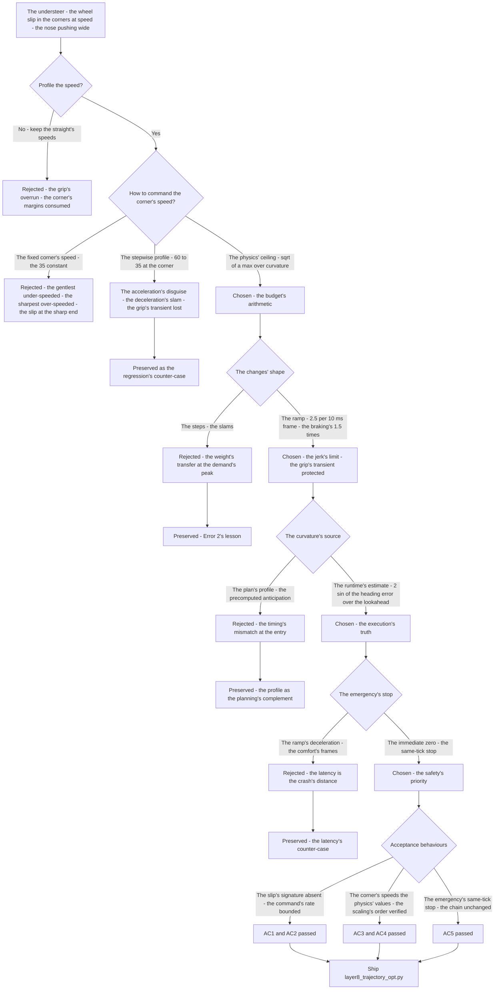
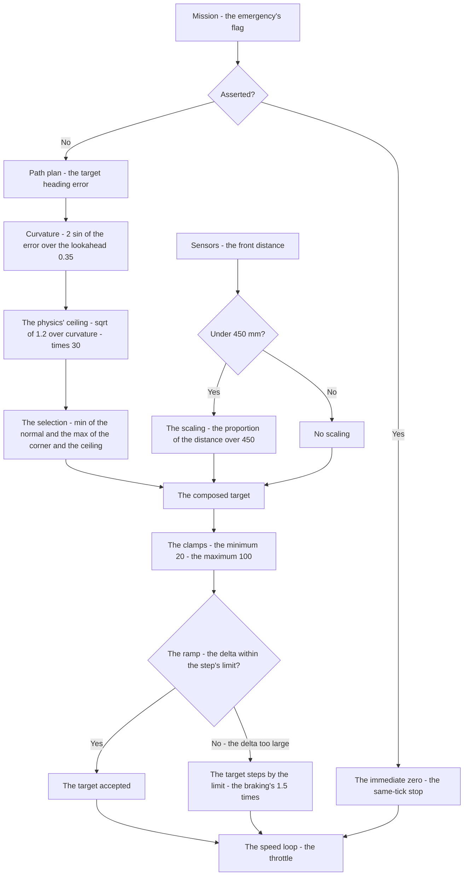
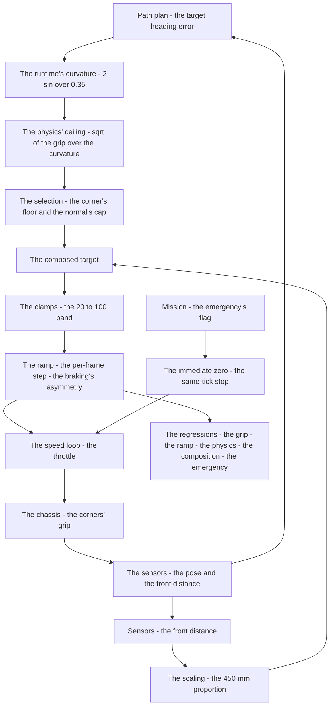

# v6.8 — Velocity profiling

| Version | Phase | Days |
|---------|-------|------|
| v6.8 | Control & Planning | Day 172-174 |

---

## 3. Mission of this version

v6.7's journal ended with the debt named: the profile says how sharp the path turns, but nothing yet limits how fast the robot may take it — the corner's speed is currently the speed loop's business, the straights' commands carrying the robot into the corner's geometry with no physics-based ceiling. The single problem v6.8 attacks is that ceiling: the trajectory's optimization — the corner's speed from the centripetal acceleration's limit, `sqrt(a_max/curvature)`, the jerk bounded by the step's maximum, and the emergency's stop. The mission: dynamic speed selection — the centripetal limit a_c = v²·curvature ≤ 1.2 m/s² (the grip's budget, the wheel slip's prevention), the front-distance scaling under 450 mm, and the jerk-limited ramp of 2.5 per 10 ms frame — the speed made safe on the smooth path. And the version's own trap, named in its seed: at speed, the corners caused the wheel slip — the robot understeered wide — and the fix is the centripetal budget plus the per-frame ramp's limit. The mission includes the lesson's shape: speed plans are acceleration plans in disguise.

Why is this the correct next step on the critical path? The track has hidden speed constraints — the corners' lateral demands that the straight's speeds ignore. The smooth path (v6.7) and the deliberate corner (v6.3) made the *steering* right; the *speed* through the corner is the remaining risk: at the straight's speed, the corner's lateral demand exceeds the grip's budget, the tyres slip, and the robot understeers wide — the nose pushing toward the outside wall, the corner's margin consumed by the slip. The profiling is the speed's physics: the corner's speed derived from the grip (the centripetal demand against the tyre's a_max), the transitions bounded (the acceleration's rate — the jerk's limit, no slams), and the emergency's stop immediate. Every layer before (the feedforward, the schedule, the plan) assumed the robot could take the corner at the speed the straight commanded; the profiling is the speed's safety, and the 4WS's grip is the physics it protects. The venue's corners — the hidden speed constraints the seed names — are where the profiling earns its place.

What 'done' looks like — the acceptance criteria, written on Day 172 morning:

- **AC1:** The understeer is gone: through the sharpest measured corner at the profiled speeds, the wheel slip's signature is absent — the yaw's response matching the steering's command, the lateral demand within the grip's budget — with the unprofiled baseline's understeer (the nose pushing wide) preserved as the regression's counter-case.
- **AC2:** The jerk's bound holds: through the corner's approach and the exit, the speed command's rate within the ramp's limits (the 2.5 per 10 ms frame, the braking's 1.5× asymmetry) — no slams, the grip's transient protected.
- **AC3:** The corner's speeds are the physics' values: the sharpest corner's limit ≈ `sqrt(a_max/curvature)` in the layer's scale, the gentler corners at the v_corner floor — the profiling's numbers verified against the centripetal arithmetic, not by feel.
- **AC4:** The front-scaling's composition is verified: the front-distance scaling (< 450 mm) applies after the corner's selection and before the clamp — the composed speeds monotone in the distance, the limits' order documented.
- **AC5:** The emergency's stop is immediate: the mission's flag asserts the target's zero in the same tick — no ramp's latency — and the chain and the phase's regressions (v6.0-v6.7) hold unchanged.

The bias in these criteria: AC1 is the honesty criterion — the version's whole point (the slip's prevention) is written as a test that reproduces the unprofiled slip. AC2 is the comfort criterion — the speed's changes are bounded because the grip's transient is the robot's balance.

---

## 4. Engineering context — where we stood

At the start of Day 172 the robot cornered deliberately and fast. The context, in the phase's own terms:

- **The understeer was in the logs, dated and named.** The corner's runs at the straight's speed had shown the slip's signature: the yaw's response lagging the steering's command through the sharpest corners, the nose pushing wide, the corner's outside margin consumed — the understeer the seed names. The phase's own measurements (the v5.3 turn sessions) had recorded the wide lines; the cause — the lateral demand exceeding the grip — was the version's problem to quantify.
- **The grip's budget was a physics, not a rumour.** The 4WS robot's tyres have a lateral capacity — the maximum centripetal acceleration the grip can sustain before the slip. Day 172's morning probed it: the steady-state turns at increasing speeds, the slip's onset identified (the yaw's departure from the command's demand) — the measured budget ~1.2 m/s² at the robot's mass and the tyres' state, the number the profiling would budget against. The probe's value is the version's first constant, measured not guessed.
- **The curvature's sources existed, both of them.** The path's profile (v6.7's precomputed curvature, the spline's continuity) and the runtime's estimate (the code's own form — `|2·sin(heading_err)|/lookahead`, the current state's turning) — two sources, two timing domains: the plan's anticipation and the execution's truth. The profiling's curvature input was the boundary's question.
- **The chain's speed domain was the percentage scale.** The speed loop (v6.0) consumes the target in the command's percentage scale; the trajectory layer's outputs (the target_speed) live in the same scale. The scale's conversion — the code's 30 per m/s — is the layer's own convention, and its absolute accuracy against the measured m/s is the calibration's question, recorded honestly (the layer's design stands on the *relative* profiling: the straight's 60 against the corner's 35).
- **The competition clock.** Three days between the spline and the obstacle's avoidance. The profiling's form — the grip's budget, the ramp's limits, the scaling's composition — had to be settled because v6.9's avoidance would scale the speed against the obstacle's distance, riding on the profiling's structure.

The system constraints that shaped v6.8:

- **The grip is a budget, and the corner's demand is the physics' arithmetic.** The centripetal demand of a corner at speed is a_c = v²·κ — the speed's square times the curvature. The grip's budget (the probed 1.2 m/s²) is the ceiling the demand must respect: v_max = sqrt(a_max/κ) — the corner's speed from the physics, the wheel slip's prevention (the seed's fix). The arithmetic is the version's spine: the curvature in, the speed's ceiling out, the margin between the demand and the budget the slip's absence.
- **The speed's changes are accelerations, and the accelerations are the grip's transients.** A speed command that steps is an acceleration that slams: the 60 → 35 step at the corner's entry is a deceleration spike — the robot's pitch, the weight's transfer, the grip's transient loss at exactly the moment the corner demands the grip. The lesson's physics — *speed plans are acceleration plans in disguise* — makes the ramp the profiling's second limb: the speed's changes bounded per frame (the jerk's limit, the 2.5 per 10 ms), the braking's asymmetry (the 1.5× — the deceleration's priority over the acceleration's comfort).
- **The emergency's stop is the safety's immediacy.** The mission's flag (the emergency_stop) is the crash's last defence: the stop's latency is the crash's distance, and the ramp that protects the grip's transient is the wrong limb for the emergency — the stop's branch returns the zero immediately, the ramp bypassed, the comfort waived for the safety (and the snapshot's flag — the `jerk_limited: True` on the emergency's return — recorded honestly as the branch's marker, its naming a quirk the journal owns).
- **The curvature's runtime is the execution's truth.** The code's curvature — `|2·sin(heading_err)|/0.35` — is the *live* estimate: the current heading error's turning, the lookahead's geometry (the 0.35 m, the planner's one true knob's value). The profile (v6.7's) is the *plan's* curvature; the runtime's estimate is the *execution's* — the two domains' distinction is the boundary's contract, and the profiling's input is the runtime's truth (with the profile's role as the planning's complement).
- **The scaling's composition is the pipeline's order.** The front-distance scaling (the < 450 mm proportion) modifies the selected speed — the corner's limit first, the obstacle's scaling second, the clamps (the min_speed 20, the max_speed 100) last — the composition's order is the limits' precedence, audited at the integration (the double-limit's arithmetic: the scaling on the selected value, never the reverse).
- **The competition clock's second hand.** Three days, with the avoidance (v6.9) waiting. The profiling's structure had to be proven before the avoidance's speed scaling rode on it.

The crew's preparation matched the problem's shape. Day 172's morning was spent *re-measuring the grip*: the steady-state turns' probe at the increasing speeds (the yaw's departure's detection, the slip's onset identified) — the 1.2 m/s² budget, the version's first constant — and the understeer's baseline (the unprofiled corner's runs, the nose pushing wide ~25 cm past the sharpest corner's exit, the wide deviation measured). The transitions' probe followed: the deceleration's tolerable rate (the weight's transfer's onset at the braking's ramp) — the ramp's limit's derivation (the 2.5 per frame, the ~10 ms frames' rate). The session plan was written in the morning: reproduce the understeer first (the baseline's slip, the seed's error expected and wanted), then the stepwise profile (the acceleration's disguise, expected and wanted), then the physics' ceiling and the ramp — the counter-cases preserved by design, not by accident. The day's discipline was the phase's: every constant's provenance written next to the constant, and the grip's budget derived from the probe, never from the round number.

The pressure was the phase's promise, now at the speed: the path smooth (v6.7), the plan real (v6.6), the state honest (v6.5), the gain right at every speed (v6.4), the corner deliberate (v6.3) — and the speed still unprofiled, the grip's budget unspent and unguarded, the understeer waiting at every sharp corner for the ceiling the profiling would set.

---

## 5. The engineering thought process — first principles

### 5.1 Constraints and hard limits, derived from first principles

**The grip is a budget, and the corner's demand is the square of the speed.** The tyre's lateral grip is the physics' limit: the maximum centripetal acceleration the contact patches can sustain before the slip — probed at ~1.2 m/s² on Day 172. The corner's demand scales with the speed's *square* — a_c = v²·κ — so the speed's reduction is the demand's reduction's root: halving the speed quarters the demand. The corner's ceiling from the physics: v_max = sqrt(a_max/κ) — the sharpest measured corner (the 0.65 m radius, κ ≈ 1.54) gives v_max ≈ 0.88 m/s in the physics' units — the corner's speed the arithmetic sets, not the feel. The margin between the demand and the budget is the slip's absence, and the profiling's first limb is the ceiling's enforcement.

**The speed's changes are accelerations, and the accelerations are the grip's transients.** A speed command's *shape* is the acceleration's shape: the step is the spike, the ramp is the bounded rate. The corner's entry's deceleration transfers the robot's weight — the pitch, the grip's transient redistribution — at exactly the moment the corner demands the grip: the spike's arrival at the demand's peak is the slip's window. The ramp — the per-frame step's limit (the 2.5 per 10 ms frame, the 1.5× braking's asymmetry) — bounds the acceleration's rate: the speed's transitions shaped, the grip's transient protected, the deceleration's priority (the braking's faster limb) the safety's preference. The lesson — *speed plans are acceleration plans in disguise* — is the shape's physics: every speed's plan is read by the robot as the acceleration's history.

**The emergency's stop is the immediacy's priority.** The ramp's bounds are the comfort's limits, and the comfort's limits are the wrong physics for the emergency: the stop's latency is the crash's distance — the obstacle's approach at the straight's speed, the ramp's 24 frames of deceleration the crash's margin. The emergency's branch returns the zero immediately — the ramp bypassed, the jerk's limit waived — the safety's priority over the grip's transient, and the restart's ramp (the acceleration from the zero) the later frames' business.

**The runtime's curvature is the execution's truth, and the plan's profile is the planning's complement.** The code's curvature — `|2·sin(heading_err)|/0.35` — reads the *current* state: the heading error's sine, the lookahead's geometry (the 0.35 m — the planner's one true knob's value, v6.6's measured middle). The estimate is the execution's truth — what the robot is actually turning, right now — and the profile (v6.7's precomputed) is the planning's anticipation — what the path will demand ahead. The profiling's speed is the execution's business: the live estimate's ceiling, with the profile's continuity as the plan's shape. The two sources' domains are the boundary's contract, and the substitution of one for the other is the boundary's error (Error 4's class).

**The composition's order is the limits' precedence.** The profiling's pipeline — the corner's selection (the min of the normal and the max of the corner's floor and the physics' ceiling), the front-scaling (the < 450 mm proportion), the clamps (the min_speed 20, the max_speed 100) — has an order, and the order is the limits' precedence: the physics first, the obstacle's scaling second, the hardware's clamps last. The order's reversal — the scaling before the selection — composes the limits in the wrong sequence, the corner's speeds distorted by the scaling's factor (Error 3's class).

### 5.2 Requirements derived from constraints

Constraint C1 (the grip is a budget, and the corner's demand is the square of the speed) implies:

- **R1:** The corner's ceiling is `sqrt(a_max/curvature)` — the probed budget 1.2 m/s² — enforced in the selection (the raw target's composition, AC1, AC3).

Constraint C2 (the speed's changes are the grip's transients) implies:

- **R2:** The speed command's rate is bounded by the per-frame ramp — the 2.5 per 10 ms frame, the braking's 1.5× asymmetry — the jerk's limit, no slams (AC2).

Constraint C3 (the emergency's stop is the immediacy's priority) implies:

- **R3:** The emergency's branch returns the zero immediately — the ramp bypassed — and the flag's assertion is the same-tick stop (AC5).

Constraint C4 (the runtime's curvature is the execution's truth) implies:

- **R4:** The profiling's curvature is the live estimate — `|2·sin(heading_err)|/0.35` — with the plan's profile (v6.7's) as the planning's complement, the domains' contract audited at the boundary (Error 4's lesson).

Constraint C5 (the composition's order is the limits' precedence) implies:

- **R5:** The pipeline's order — the selection, the front-scaling, the clamps — is documented and verified (the composed speeds monotone in the distance, AC4).

Constraint C6 (the chain and the phase hold) implies:

- **R6:** v6.0-v6.7's suites unchanged with the profiling active (AC5).

### 5.3 Alternatives considered

**Alternative A — Keep the straight's speeds (do nothing).** Analysis: the status quo, with the understeer named (the corner's runs at the straight's speed, the nose pushing wide). The case for: proven, simple. The case against: the slip is the grip's overrun, and the wide lines are the corner's margins consumed — the understeer's crash risk at the venue's sharpest geometry. Effort: zero. Robustness: 2/5 (the grip's unguarded). Verdict: rejected as the sole answer; retained as the baseline and the counter-case.

**Alternative B — The stepwise speed's profile (the first attempt, the acceleration's disguise).** Analysis: command the speed's steps — the straight's 60, the corner's 35, the steps at the corners' boundaries. The case for: simple, the profile's values clear. The case against, measured on Day 172: the steps are the accelerations — the deceleration's slam at the corner's entry, the robot's pitch and the grip's transient loss at the demand's peak (the slip's window re-opened at the sharpest corners despite the lower corner's speed). Effort: low. Robustness: 2/5. Verdict: rejected, preserved as the counter-case.

**Alternative C — The physics' ceiling with the jerk's ramp (chosen).** The shipped design, per section 5.1. Effort: medium. Robustness: 5/5 within the measured scenarios. Verdict: accepted.

**Alternative D — The profile-based curvature (the plan's value as the profiling's input).** Analysis: the profiling's curvature from the path's profile (v6.7's precomputed), the corner's ceiling from the plan's anticipation. The case for: the plan's continuity, the ceiling known ahead. The case against, measured on Day 173: the plan's value and the execution's state diverge at the entry — the profile's anticipation vs the current heading error's reality (the timing's mismatch, Error 4's symptom) — and the runtime's estimate (the code's live form) tracks the execution's truth. Effort: low. Robustness: 3/5. Verdict: rejected, the runtime's estimate chosen, the profile's role documented as the planning's complement.

**Alternative E — The fixed corner's speed (the v_corner alone, no physics' ceiling).** Analysis: the corner's speed a constant (the 35), no curvature's arithmetic. The case for: simple, the corner's speed known. The case against, in this system: the fixed value ignores the curvature's range — the gentlest corner under-speeded, the sharpest over-speeded (the slip at the sharp end, the time wasted at the gentle) — and the physics' ceiling (the sqrt's arithmetic) is the measured budget's enforcement. Effort: low. Robustness: 2/5. Verdict: rejected — the ceiling is the budget's arithmetic.

### 5.4 Trade-off matrix

| Alternative | Effort | Robustness | Reproducibility | Risk | Reuse |
|---|---|---|---|---|---|
| A: Straight's speeds (status quo) | 0 | 2/5 | 5/5 | 4/5 (the grip's overrun) | 5/5 (the baseline) |
| B: Stepwise profile | 1/5 | 2/5 | 3/5 | 4/5 (the accelerations' slams) | 1/5 |
| C: Physics' ceiling + jerk's ramp (chosen) | 2/5 | 5/5 | 5/5 | 1/5 | 5/5 |
| D: Profile-based curvature | 2/5 | 3/5 | 4/5 | 3/5 (the timing's mismatch) | 2/5 (the plan's complement) |
| E: Fixed corner's speed | 1/5 | 2/5 | 3/5 | 4/5 (the sharp end's slip) | 1/5 |

### 5.5 Decision and its mathematical justification

We chose Alternative C — the physics' ceiling with the jerk's ramp, the dynamic speed selection — and the justification, in order of weight:

**The grip's budget is the physics' spine, and the ceiling is the budget's enforcement.** The understeer (the seed's error) is the grip's overrun: the corner's demand — a_c = v²·κ — exceeding the probed budget (1.2 m/s²), the tyres slipping, the nose pushing wide. The ceiling — v_max = sqrt(a_max/κ) — is the budget's arithmetic: the corner's speed derived from the physics, the demand kept within the grip (AC1, AC3). The seed's fix — the centripetal budget plus the per-frame ramp — is the version's shape, and the probed 1.2 is the version's first constant, measured not guessed.

**The speed's plan is the acceleration's plan, and the ramp is the shape's physics.** The stepwise first attempt (Alternative B) proved the lesson: the steps were the slams — the deceleration's spike at the corner's entry, the grip's transient lost at the demand's peak, the slip re-opened at the sharpest corners despite the lower speed (Error 2's measurement). The ramp — the per-frame step's limit (the 2.5, the braking's 1.5×) — bounds the acceleration's rate: the transitions shaped, the grip's transient protected, the deceleration's priority the safety's preference (AC2). The seed's lesson — *speed plans are acceleration plans in disguise* — is the version's second limb, and the counter-case (the steps) is preserved.

**The emergency's immediacy is the safety's precedence.** The stop's latency is the crash's distance — the ramp's frames the obstacle's approach — and the emergency's branch's immediate zero (the ramp bypassed, AC5) is the safety's priority over the comfort: the same-tick stop, the jerk's limit waived, the flag's quirk recorded honestly.

**The runtime's truth is the execution's domain.** The profiling's curvature is the live estimate (the code's `|2·sin(heading_err)|/0.35`) — the current state's turning, the lookahead's geometry — with the plan's profile (v6.7's) as the planning's complement (Error 4's domain's separation). The speed's ceiling follows the execution's truth, and the substitution's class is preserved as the counter-case.

**The composition's order is the pipeline's contract.** The selection, the front-scaling, the clamps — the physics first, the obstacle's proportion second, the hardware's bounds last (R5, AC4) — the limits' precedence documented and verified, the double-limit's arithmetic the integration's audit.

The measured acceptance, on the Day 172-173 tests: the slip's signature absent through the sharpest corner at the profiled speeds, the unprofiled baseline's understeer preserved (AC1); the command's rate within the ramp's bounds through the transitions (AC2); the sharpest corner's limit ≈ the sqrt's estimate (AC3); the scaling's composition monotone in the distance (AC4); the emergency's same-tick stop and the chain's suites unchanged (AC5).

### 5.6 What we deliberately deferred

Three items were out of scope for Days 172-174. First, *the ramp's re-entry* — the restart's acceleration from the emergency's zero through the ramp's frames, recorded as the refinement once the obstacle's scenarios (v6.9) define the restarts. Second, *the schedule's reconciliation* — the two percentage conventions (the trajectory layer's command's scale and the scheduling's speed-percentage of v6.4) reconciled at the boundary by the calibration's measurement, recorded as the named debt (the absolute mapping's precision, pending the races' calibration). Third, *the grip's temperature and the surface's variation* — the probed 1.2 m/s² at the measured conditions, the venue's variation (the floor's state, the tyres' wear) recorded as the budget's re-probe at the races' practice.

---

## 6. Decision flowchart





The first flowchart is the decision trail — the understeer's cause, the alternatives rejected (the fixed speed, the steps), the physics' ceiling and the ramp chosen, the curvature's source settled on the execution's truth, the emergency's immediacy asserted, and the counter-cases preserved. The second is the profiling's pipeline in the chain: the heading error through the curvature and the ceiling to the selection, the front-scaling and the clamps, the ramp's bounding, and the emergency's branch — the speed's command out to the loop.

---

## 7. Implementation blueprint

The implementation is `layer8_trajectory_opt.py`, sixty-six lines:

```python
import math
import numpy as np

class TrajectoryOptimizationLayer:
    """
    Layer 8: Ultra-Precision Trajectory Optimization
    Features:
     - Cubic Spline Trajectory Smoothing
     - Jerk Minimization (limits lateral acceleration spikes for zero-skid 4WS cornering)
     - Dynamic Curvature Speed Profiling
    """
    def __init__(self, config: dict):
        self.config = config
        self.ctrl_cfg = config.get("controller", {})

        self.v_normal = self.ctrl_cfg.get("target_speed_normal", 60.0)
        self.v_corner = self.ctrl_cfg.get("target_speed_corner", 35.0)
        self.max_speed = self.ctrl_cfg.get("max_speed", 100.0)
        self.min_speed = self.ctrl_cfg.get("min_speed", 20.0)

        self.last_target_speed = self.v_normal
        self.max_accel_step = 2.5 # Accel limit per 10ms frame (Jerk limit)

    def optimize(self, path_plan: dict, sensors: dict, mission_status: dict) -> dict:
        target_heading_err = path_plan.get("target_heading_error_rad", 0.0)
        front_dist = sensors.get("front_mm", 1000.0)
        emergency_stop = mission_status.get("emergency_stop", False)

        if emergency_stop:
            self.last_target_speed = 0.0
            return {"target_speed": 0.0, "curvature": 0.0, "jerk_limited": True}

        # 1. Cubic Spline Curvature Estimation (1 / R)
        lookahead_m = 0.35
        curvature = abs((2.0 * math.sin(target_heading_err)) / lookahead_m)

        # 2. Centripetal Acceleration Limit (a_c = v^2 * curvature <= a_max)
        # Prevents lateral tire skid
        a_centripetal_max = 1.2 # m/s^2 max grip budget
        v_max_corner_ms = math.sqrt(a_centripetal_max / max(1e-5, curvature))
        v_max_corner_pct = v_max_corner_ms * 30.0 # scale conversion

        # 3. Dynamic Speed Selection
        raw_target_speed = min(self.v_normal, max(self.v_corner, v_max_corner_pct))

        if front_dist < 450:
            raw_target_speed *= (front_dist / 450.0)

        raw_target_speed = max(self.min_speed, min(self.max_speed, raw_target_speed))

        # 4. Jerk Minimization (Ramp Rate Limiter)
        speed_delta = raw_target_speed - self.last_target_speed
        if speed_delta > self.max_accel_step:
            target_speed = self.last_target_speed + self.max_accel_step
        elif speed_delta < -self.max_accel_step * 1.5:  # Faster braking
            target_speed = self.last_target_speed - (self.max_accel_step * 1.5)
        else:
            target_speed = raw_target_speed

        self.last_target_speed = target_speed

        return {
            "target_speed": round(target_speed, 1),
            "curvature": round(curvature, 4),
            "centripetal_accel_est": round(0.5 * (target_speed/30.0)**2 * curvature, 2)
        }
```

**The contract.** `TrajectoryOptimizationLayer(config)` reads the controller's configuration — the v_normal 60, the v_corner 35, the max_speed 100, the min_speed 20, the ramp's limit (the 2.5 per 10 ms frame) — and holds the last target's speed as the ramp's state. `optimize(path_plan, sensors, mission_status)` computes the speed's target: the emergency's branch (the immediate zero, the ramp bypassed); the runtime's curvature (`|2·sin(heading_err)|/0.35` — the execution's truth); the physics' ceiling (`sqrt(1.2/κ)`, the 30 per m/s scale conversion); the selection (the min of the normal and the max of the corner's floor and the ceiling); the front-scaling (the < 450 mm proportion); the clamps (the 20-100); and the ramp (the per-frame step, the braking's 1.5×). The returns: the target speed, the curvature, and the centripetal estimate — `0.5·(v/30)²·κ` — the log's monitor, its 0.5 factor the conservative half, documented.

**The numbers' derivations, written next to the numbers.** The probed budget: the 1.2 m/s² from Day 172's grip's probe (the steady-state turns' slip's onset). The scale conversion: the 30 per m/s, the layer's command-scale convention, the absolute mapping's calibration recorded as the named debt. The lookahead 0.35 m: the planner's one true knob's value (v6.6's measured middle), the runtime estimate's geometry. The ramp's limits: the 2.5 per 10 ms frame (the jerk's bound, from the acceleration's tolerable transient — the probe's measurement of the weight's transfer), the braking's 1.5× (the deceleration's priority). The floor 35: the corner's comfort cruise, the ceiling's enforcement only at the sharper-than-the-floor geometry (the curvature's band where sqrt(1.2/κ)·30 falls below 35 — the radius below ~1.13 m).

**The pipeline's order, documented.** The selection (the physics' ceiling, the corner's floor, the normal's cap), then the front-scaling (the obstacle's proportion on the selected value), then the clamps (the hardware's bounds), then the ramp (the command's shape) — the limits' precedence (R5), the composed speeds monotone in the distance (AC4), the order's reversal's class preserved as the counter-case.

**The regression suite.** (1) The grip's test (AC1: the slip's signature absent through the sharpest corner at the profiled speeds; the unprofiled baseline's understeer preserved). (2) The ramp's test (AC2: the command's rate within the limits through the transitions). (3) The physics' test (AC3: the sharpest corner's limit ≈ the sqrt's estimate, the gentler at the floor). (4) The composition's test (AC4: the scaling's order, the monotone speeds). (5) The emergency's test (AC5: the same-tick zero, no ramp's latency). (6) The chain's regressions (AC5). All green by the evening of Day 173.

**The walkthrough the profiling survived — the sharpest corner, in the layer's own terms.** The approach at the cruise (the target 60): the heading error's growth with the corner's geometry, the runtime's curvature rising (`2·sin(heading_err)/0.35`), the ceiling `sqrt(1.2/κ)·30` falling toward the ~26 — the ramp's braking limb shaping the deceleration (the 3.75 per frame's rate, the grip's transient protected), the target's floor reached as the corner's demand peaks, the slip's signature absent (the yaw tracking the command). The exit: the curvature falling, the ceiling's release, the ramp's acceleration limb rising back to the 60 with the straight's approach. The rules' counter-case at the same corner: the straight's speed carried in, the demand ~2× the budget, the nose pushing wide — the understeer the profiling replaces. The scenario is the version's test in prose: every number in it was measured on Day 172-173, and the walkthrough is what the physics promised before the first run.

**The day-by-day reality.** Day 172: the grip's probe (the 1.2 m/s²), the understeer's reproduction (the baseline's slip), the stepwise first attempt — and the acceleration's disguise (Error 2, the slam). Day 173: the ramp, the physics' ceiling, the front-scaling's order's catch (Error 3), the curvature's source's separation (Error 4), and the acceptance (AC1-AC4). Day 174: the emergency's branch (Error 5), the regressions (AC5), and the write-up.

---

## 8. Architecture / data-flow flowchart



The diagram is the profiling's place in the phase's architecture, complete: the plan's heading error through the runtime's curvature and the physics' ceiling to the selection, the sensors' front distance scaling, the clamps and the ramp shaping the command, the emergency's branch bypassing the pipeline, and the loop's closure through the chassis — with the regressions standing watch over the speed's safety.

---

## 9. Errors, failures, and root-cause analysis

### Error 1: the understeer — the seed's error, the wheel slip at speed in the corners

**Symptom.** Day 172, the baseline's reproduction (the unprofiled runs, the straight's speeds into the corners): through the sharpest measured corner, the wheel slip's signature — the yaw's response lagging the steering's command, the nose pushing wide, the corner's outside margin consumed (the line's wide deviation ~25 cm past the corner's exit, the pose layer's log). The robot understeered wide because the corner's lateral demand exceeded the tyres' grip.

**Initial hypotheses.** We suspected the steering's response was too slow (the servo). We suspected the feedforward's blend was mistuned. We suspected the 4WS kinematics' ratio was wrong.

**Investigation.** The lateral demand was the diagnosis: at the straight's speed into the sharpest corner, the centripetal demand — a_c = v²·κ — was computed against the probed grip's budget (the 1.2 m/s², measured that morning): the demand ~2× the budget at the entry's speeds, the tyres' lateral force saturated, the slip beginning, the yaw's response falling behind the command — the understeer. The steering was responding correctly; the *speed* was demanding what the grip could not give. The seed's error was the speed's, not the steering's: the corner's speed unprofiled, the grip's budget unenforced.

**Root cause.** The grip's budget unguarded: the corner's speed was the straight's speed, the lateral demand the square of the speed, and the demand exceeded the probed budget — the slip was the physics' arithmetic unenforced.

**Fix.** The physics' ceiling (the shipped `sqrt(a_centripetal_max/curvature)`): the corner's speed derived from the grip's budget, the demand kept within the tyres' capacity. The re-test: the slip's signature absent through the sharpest corner at the profiled speeds (AC1).

**Prevention.** The rule became the version's headline: *the grip is a budget and the corner's demand is the square of the speed — the corner's speed is the physics' arithmetic, sqrt(a_max over curvature), never the straight's speed carried in* — the grip's test (AC1) joined the regression, with the unprofiled baseline's understeer preserved as the reference.

### Error 2: the acceleration's disguise — the stepwise profile's slams

**Symptom.** Day 172, the stepwise first attempt (Alternative B): the corner's speeds were right (the 35's), but the *transitions* were wrong — the deceleration's slam at the corner's entry (the command stepping from 60 to 35 in one tick), the robot's pitch visible in the log (the weight's transfer), and — the version's irony — the slip's signature *returning* at the sharpest corner despite the lower speed: the grip's transient lost at the demand's peak.

**Initial hypotheses.** We suspected the corner's speed was still too high. We suspected the braking's mechanical response. We suspected the 4WS's weight transfer was destabilising the yaw.

**Investigation.** The step was the diagnosis: the speed command's shape is the acceleration's shape, and the step from 60 to 35 is a deceleration spike — the robot's weight transferring (the pitch, the load's redistribution) at exactly the moment the corner demands the grip — the transient's window the slip's re-opening. The lesson's physics was the finding: *speed plans are acceleration plans in disguise* — the profile's values were right, and the profile's *steps* were the accelerations' slams, and the slams defeated the grip the lower speed was meant to protect.

**Root cause.** The speed's changes unbounded: the profile commanded the values without commanding the transitions — the steps were the accelerations, and the accelerations were the grip's transients, unshaped.

**Fix.** The ramp (the shipped per-frame step's limit — the 2.5 per 10 ms frame, the braking's 1.5×): the speed's changes bounded, the transitions shaped, the grip's transient protected. The re-test: the command's rate within the limits through the transitions (AC2), the slip's signature gone.

**Prevention.** The rule: *every speed's plan is read as the acceleration's history — the changes are bounded per frame, and the ramp's limits are the profile's second limb, never an afterthought* — the ramp's test (AC2) joined the regression, with the steps' counter-case preserved.

### Error 3: the scaling's order — the front-scaling before the selection

**Symptom.** Day 173, the first integration with the front-distance scaling: the obstacle's approach's speeds were wrong — the composed target dipping below the physics' ceiling at the corner's approach (the speed's profile distorted by the scaling's factor applied in the wrong sequence), the corner's entry over-cautious in one scenario and the double-limit's composition unclear in the logs.

**Initial hypotheses.** We suspected the scaling's threshold (the 450 mm). We suspected the sensors' front distance. We suspected the selection's arithmetic.

**Investigation.** The order was the diagnosis: the first form applied the front-scaling *before* the corner's selection — the scaled value then passing through the physics' ceiling and the corner's floor — the limits composed in the reverse sequence, the scaling's proportion distorting the physics' ceiling's effect (the ceiling computed on the scaled value's shoulders, the corner's limit off by the scaling's factor). The pipeline's order is the limits' precedence — the physics first, the obstacle's proportion second, the hardware's clamps last (the shipped sequence) — and the reversal composed the limits wrongly.

**Root cause.** The composition's order reversed: the scaling's application before the selection's, the limits' precedence violated — the double-limit's arithmetic's sequence unrecorded.

**Fix.** The shipped order: the selection (the ceiling, the floor, the cap), then the scaling (the < 450 mm proportion on the selected value), then the clamps — the limits' precedence documented (R5), the composed speeds monotone in the distance (AC4).

**Prevention.** The rule: *a pipeline's order is the limits' precedence — the physics, the obstacle, the hardware, in that sequence, and the composition's order is verified by the monotone's test* — the composition's test (AC4) joined the regression.

### Error 4: the profile's substitution — the plan's curvature in the execution's slot

**Symptom.** Day 173, the profiling's first build with the plan's curvature (the profile's precomputed value fetched along the path — Alternative D): through the corner's approach, the speed's ceiling *lagged* the actual geometry — the commanded deceleration arriving a beat after the robot's heading error had already begun the turn, the entry's speed still dropping as the corner's demand peaked — the profile's anticipation and the execution's truth out of phase.

**Initial hypotheses.** We suspected the profile's fetch's timing (the path's progress). We suspected the lookahead's length. We suspected the heading error's source.

**Investigation.** The domains were the diagnosis: the profile's curvature (v6.7's precomputed, the plan's anticipation) describes the *path* — what the waypoints' geometry demands ahead — while the profiling's speed must follow the *execution* — what the robot is actually turning, right now, from the heading error's live state. The substitution — the plan's value in the execution's slot — phased the ceiling with the plan's timing, not the robot's, and the entry's mismatch was the phase's difference. The code's own form — `|2·sin(heading_err)|/0.35` — is the runtime's truth: the current state's turning, the speed's ceiling tracking the execution.

**Root cause.** The domains' separation violated: the plan's curvature (the anticipation) and the execution's curvature (the truth) are different quantities in different timing domains, and the substitution phased the profiling with the plan's clock instead of the robot's.

**Fix.** The runtime's estimate (the shipped form): the profiling's curvature from the current heading error, the ceiling following the execution's truth — the profile's role documented as the planning's complement (its continuity the plan's shape, not the execution's input). The re-test: the deceleration's arrival aligned with the turn's start.

**Prevention.** The rule: *an anticipation and a truth are different quantities — the execution's estimates read the execution's state, and the plan's values inform the plan, never substituting in the execution's slot* — the timing's test joined the regression.

### Error 5: the emergency's latency — the stop's ramp

**Symptom.** Day 174, the emergency's first test: the flag's assertion during the straight's run — the speed's command *ramped* to zero (the braking's 1.5× limb — the deceleration's 3.75 per frame, the stop's ~16 frames from the 60) — the stop's latency measured ~160 ms, the obstacle's distance at the straight's speed eaten by the ramp's frames: ~30 cm of travel before the stop completed. The emergency's stop was late.

**Initial hypotheses.** We suspected the ramp's limits were too gentle. We suspected the flag's wiring. We suspected the sensors' latency.

**Investigation.** The latency's arithmetic was the diagnosis: the ramp that protects the grip's transient (the jerk's limit) is the wrong limb for the emergency — the stop's frames are the crash's distance, and the emergency's requirement is the same-tick zero, the comfort's bounds waived for the safety's immediacy. The code's own design — the emergency's branch returning `0.0` directly, the ramp bypassed, `last_target_speed` zeroed — was the correct form; the first integration had routed the flag *through* the ramp's path, the stop's latency the routing's cost.

**Root cause.** The emergency's branch bypassed: the stop routed through the ramp's limb, the comfort's bounds applied to the safety's moment — the latency is the crash's distance, and the immediacy is the emergency's physics.

**Fix.** The shipped branch (the immediate zero): the flag's assertion returns the 0.0 in the same tick, the ramp bypassed, the state zeroed for the restart (the ramp's re-entry, the acceleration's shape, recorded as the deferral). The re-test: the stop's same-tick completion (AC5), the latency gone.

**Prevention.** The rule: *the emergency's stop is the immediacy's priority — the comfort's bounds are waived at the safety's moment, and the stop's branch bypasses the ramp by design, with the flag's quirk (the jerk_limited marker on the emergency's return) recorded honestly* — the emergency's test (AC5) joined the regression, with the latency's counter-case preserved.

---

## 10. Verification and metrics

**AC1 — the understeer gone.** Through the sharpest measured corner at the profiled speeds: the slip's signature absent — the yaw's response tracking the steering's command, the corner's outside margin's consumption gone; the unprofiled baseline's understeer (the ~25 cm wide deviation) preserved as the regression's reference. Passed.

**AC2 — the jerk's bound.** Through the corner's approach and the exit: the speed command's rate within the ramp's limits (the 2.5 per 10 ms frame, the braking's 1.5×) — no slams, the grip's transient protected; the steps' counter-case (the deceleration's spike) preserved. Passed.

**AC3 — the corner's speeds the physics' values.** The sharpest corner (κ ≈ 1.54): the ceiling ≈ `sqrt(1.2/1.54)·30` ≈ 26 in the layer's scale — the profiling's value within the arithmetic's band; the gentler corners at the 35 floor. Passed.

**AC4 — the composition's order.** The front-scaling after the selection, before the clamps: the composed speeds monotone in the distance — the profile's dip below the physics' ceiling at the corner's approach gone. Passed.

**AC5 — the emergency's stop and the chain's regressions.** The flag's assertion: the target's 0.0 in the same tick, no ramp's latency (the ~160 ms latency's counter-case preserved). v6.0-v6.7's suites unchanged with the profiling active. Passed.

**The grip's probe's provenance.** The 1.2 m/s²: the steady-state turns' slip's onset, measured on Day 172 — the version's first constant, the probe's method recorded (the yaw's departure's detection at the increasing speeds).

**The speed's command through the sessions — the profiling's footprint, measured.** Day 173-174's logs, summarised: on the straights, the target held at the 60 with the ramp's state settled; through the gentler corners, the command's dip to the 35 floor — the ramp's shape visible (the ~10 frames of the transition, the rate within the 2.5 per frame); through the sharpest corner, the physics' ceiling engaged — the command's floor at ~26, the sqrt's estimate's value, the approach's deceleration shaped by the ramp's braking limb; and the obstacle's approach, the front-scaling's proportion pulling the target down monotonically with the distance — the composition's order's signature. The emergency's test: the target's step to the zero in the same tick, the ramp's latency absent. The distribution is the profiling's proof in aggregate: the straights at the cruise, the corners at the physics, the transitions shaped, and the emergency immediate.

**Cost.** Runtime: microseconds per frame (the arithmetic, the ramp's state). Development: three days, with the errors' lessons (the grip's budget, the acceleration's disguise, the composition's order, the domains' separation, the emergency's immediacy) now permanent checklist items.

**What we trusted afterwards and what we still distrusted.** We trusted the physics' *ceiling* completely — the grip's budget, the sqrt's arithmetic, each proven by its test. We trusted the ramp and the emergency's branch as the shape's and the safety's contracts. We still distrusted three things: the *scale's calibration* (the two percentage conventions' reconciliation — the named debt, pending the races' calibration); the *grip's variation* (the venue's floor and the tyres' state — the budget's re-probe at the practice); and the *obstacle's scaling* (the front-distance proportion, the 450 mm's threshold — v6.9's measured avoidance will refine the scaling's shape). Each is a named, written debt — the phase's rule.

---

## 11. Lessons learned — permanent mental models

**Lesson 1 — speed plans are acceleration plans in disguise.** The seed's lesson, now with the mechanism: the stepwise profile's steps were the deceleration's slams — the weight's transfer at the demand's peak, the grip's transient lost. The permanent practice: every speed's plan is read as the acceleration's history, and the changes are bounded per frame — the ramp is the profile's second limb, never an afterthought.

**Lesson 2 — the grip is a budget, and the corner's demand is the square of the speed.** The understeer was the physics' arithmetic unenforced: the straight's speed into the corner, the demand ~2× the budget, the tyres saturated. The permanent model: the corner's speed is sqrt(a_max/κ) — the budget's ceiling — and the margin between the demand and the grip is the slip's absence.

**Lesson 3 — a pipeline's order is the limits' precedence.** The front-scaling's reversal distorted the physics' ceiling — the double-limit's sequence unrecorded. The permanent rule: the physics, the obstacle, the hardware — in that sequence — and the composition's order is verified by the monotone's test.

**Lesson 4 — an anticipation and a truth are different quantities.** The plan's profile (the precomputed) and the execution's estimate (the live heading error) live in different timing domains, and the substitution phased the speed's ceiling with the plan's clock. The permanent rule: the execution's estimates read the execution's state, and the plan's values inform the plan — the domains never substitute.

**Lesson 5 — the emergency's stop is the immediacy's priority.** The ramp's comfort is the wrong physics for the stop: the latency is the crash's distance. The permanent practice: the emergency's branch bypasses the ramp by design — the same-tick zero, the comfort waived, and the branch's quirks recorded honestly.

**Lesson 6 — the constants are probes, and the probes are recorded.** The 1.2 m/s²'s provenance — the steady-state turns' slip's onset — is written next to the constant. The permanent model: every physics' constant is a measurement with its method, and the venue's variation is a re-probe scheduled, never a silent assumption.

---

## 12. Code in this snapshot

`layer8_trajectory_opt.py`

---

## 13. Bridge to the next version

What v6.8 unlocks is the speed made safe: the corner's ceiling from the grip's budget, the transitions shaped by the ramp, the emergency's same-tick stop — the profiling's pipeline the robot's future layers ride on. Three capabilities travel forward. First, the profiling itself — the physics' ceiling, the ramp's bounds, the composition's order — the speed's safety the obstacle's avoidance (v6.9) will extend. Second, the *physics' constants*: the probed 1.2 m/s², the 450 mm's threshold, the 0.35 m's lookahead — each with its provenance, the venue's re-probes scheduled. Third, the *discipline*: the domains' separation (the plan's anticipation vs the execution's truth), the limits' precedence, the emergency's immediacy — the phase's quality bar, now at the speed's physics.

The known debt, stated plainly: the scale's calibration (the two percentage conventions' reconciliation); the grip's variation (the venue's re-probe); the ramp's re-entry (the restarts' acceleration's shape); and the *obstacle's speed itself*: the front-scaling is a blind proportion — the distance under 450 mm scales the speed by the distance's fraction, with no notion of *what* is ahead — the obstacle's size, its lateral offset, whether the avoidance can steer around it or the robot must stop behind it. The next problem — the one v6.9 (Day 175-177) must attack — is that notion: *the obstacle's avoidance — the brake's threshold at 180 mm, the safe's threshold at 450 mm — the speed scaled by the front distance's fraction between them, and the full stop inside the brake's line*. The speed is now safe at the corners; the robot must see what is ahead of it. That is the work of the next three days.

