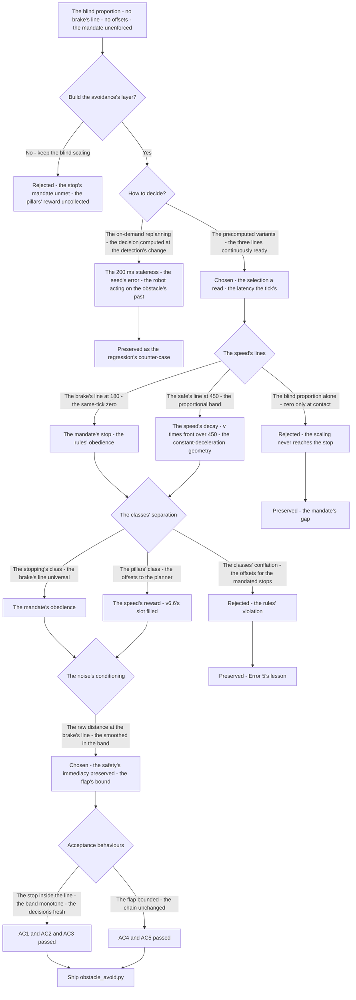
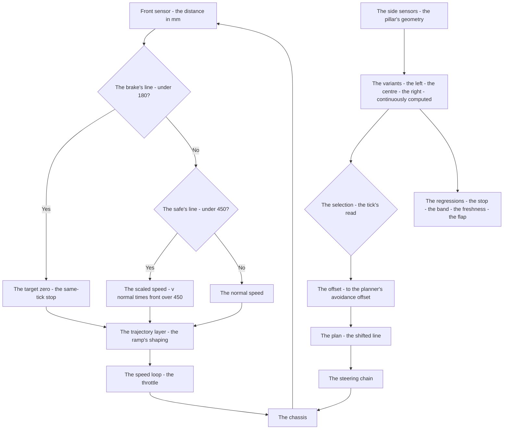
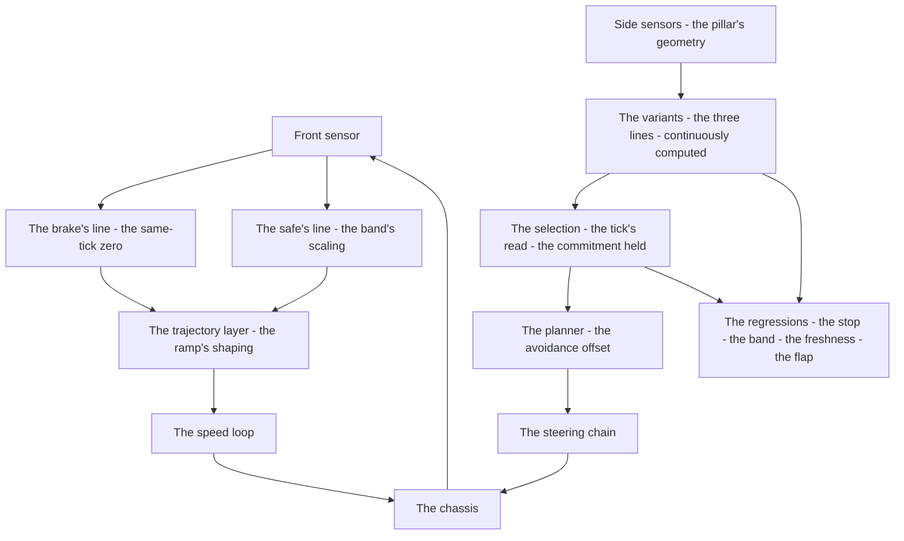

# v6.9 — Obstacle avoidance

| Version | Phase | Days |
|---------|-------|------|
| v6.9 | Control & Planning | Day 175-177 |

---

## 3. Mission of this version

v6.8's journal ended with the debt named: the front-scaling is a blind proportion — the distance under 450 mm scales the speed by the distance's fraction, with no notion of *what* is ahead. The single problem v6.9 attacks is that notion: the obstacle's avoidance — the brake's line at 180 mm (the full stop, the rules' mandate), the safe's line at 450 mm (the distance at which the obstacle begins to matter), the speed scaled by the front distance's fraction between the two — and the pillar's avoidance offsets blended into the path plan (v6.6's `avoidance_offset` now set from the sensors' truth). And the version's own trap, named in its seed: the 200 ms replan lag made the avoidance decisions stale — the decisions computed on demand arrived 200 ms late, the robot acting on the obstacle's past; the fix is the precomputation — the avoidance offsets continuously computed (3 path variants) instead of the on-demand replanning. The mission includes the lesson's shape: decide continuously, not reactively.

Why is this the correct next step on the critical path? The rules mandate stopping for obstacles; avoiding pillars is required for speed. The two demands are the version's two limbs: the brake's line (180 mm — the universal stop, the rules' obedience, the same-tick zero extended from v6.8's emergency) and the offsets (the pillars' avoidance — the line shifted around the pillar, the speed's reward). The phase's sensors (the front VL53) measure the distance; the phase's planner (v6.6) accepts the offset; the phase's profiling (v6.8) shapes the speed's transitions. The obstacle layer is the missing bridge: the distance into the brake's and the safe's decisions, the pillar's geometry into the planner's offsets, the rules' mandate and the speed's reward both served — and the decisions' *freshness* the seed names as the version's discipline: the 200 ms of staleness is ~36 cm of travel at the straight's speed, and the obstacle's approach is the one place the past is not good enough. The avoidance completes the phase's control: the corner deliberate, the speed safe, the plan real — and now the robot looking where it is going.

What 'done' looks like — the acceptance criteria, written on Day 175 morning:

- **AC1:** The stop is inside the brake's line: with the obstacle's front distance below 180 mm, the target's zero in the same tick (the ramp's shaping at the chain's boundary), and the stop's distance within the physics' budget (the deceleration's distance plus the latency's margin ≤ the brake's line).
- **AC2:** The proportional band holds: between the 180 and the 450 mm, the target = v·(front/450) — the monotone scaling verified, the full speed restored beyond the safe's line, the 450's continuity with v6.8's front-scaling's threshold.
- **AC3:** The decisions are fresh: the variant's selection's latency ≤ the tick — the 200 ms staleness's counter-case preserved — and the offsets' updates continuous, the plan's variants always ready.
- **AC4:** The thresholds' flap is bounded: the front distance's measurement noise's crossings of the 450 and the 180 — the target's flap ≤ the bound (the conditioning's acceptance), the decisions' churn absent.
- **AC5:** The chain and the phase's regressions hold: v6.0-v6.8's suites unchanged, with the Avoidance's output feeding the trajectory layer's ramp and the offsets feeding the planner's avoidance_offset.

The bias in these criteria: AC3 is the honesty criterion — the version's whole lesson (decide continuously, not reactively) is written as a test that reproduces the replanning's staleness. AC1 is the rules' criterion — the mandate's stop is a physical line, measured and enforced.

---

## 4. Engineering context — where we stood

At the start of Day 175 the robot could corner, profile, and plan — and could not see its way. The context, in the phase's own terms:

- **The rules' mandate was written, and the speed's reward was known.** The competition's rules mandate stopping for obstacles; the pillars' avoidance is the speed's requirement (the stop's seconds vs the avoidance's pass). The two behaviours — the obedience and the reward — were the version's two limbs, and the phase's journals had already sketched their shape: the brake's line and the offsets.
- **The sensors' truth existed, unread.** The front VL53's distance (the pose layer's front_mm) measured the obstacle's approach; the side sensors' geometry (the v5.3 turn sessions' measurements, the pillar's lateral positions) held the pillar's lateral truth. The obstacle layer's job: the distance into the brake's and the safe's decisions, the pillar's geometry into the planner's offsets.
- **The chain's slots were open, waiting.** The planner's `avoidance_offset` (v6.6's, ±1.0 → ±120 mm) was an injected decision — v6.6's named debt: "the avoidance's source — the obstacle layer's measured avoidance will set the offset from the sensors' truth". The trajectory layer's front-scaling (v6.8's, the 450 mm's threshold — the same number the obstacle layer would formalise) was the blind proportion the seed's lesson would replace. Two open slots, one layer's fill.
- **The replanning's lag was the version's enemy, measured in advance.** The 200 ms the seed names: the on-demand replanning's cost — the decision computed when the detection changed, the 200 ms of computation and switching, the robot acting on the obstacle's state from 200 ms ago. At the straight's speed (the 1.2-1.8 m/s band), the 200 ms is ~24-36 cm of travel — the obstacle's approach's geometry's worth — and the staleness is exactly where the collision's geometry lives.
- **The competition clock.** Three days between the profiling and the mission's behaviour. The avoidance's form — the thresholds, the variants, the decisions' freshness — had to be settled because v7.0's state machine would govern the behaviours the avoidance serves (the running's avoidance, the parking's stop).

The system constraints that shaped v6.9:

- **The stop's physics is the brake's line's budget.** The rules' mandate — stopping for the obstacles — is a physical line: the robot must be at zero before the obstacle, and the stop's distance is the deceleration's distance at the current speed plus the latency's margin. The brake's line (180 mm) is that budget's expression — measured from the stopping tests (the deceleration's distance at the measured speeds, the latency's margin added) — the line inside which the full stop must complete, the same-tick zero the safety's immediacy (v6.8's emergency's lesson extended to the obstacle's distance).
- **The safe's line is the speed's beginning's boundary.** The safe's line (450 mm) is the distance at which the obstacle begins to matter — beyond it, the full speed; between it and the brake's line, the proportional scaling (v·(front/450), the speed's linear decay with the distance). The 450 is the same threshold the trajectory layer's front-scaling used (v6.8's) — the continuity across the layers, the obstacle's influence's range formalised. The scaling's shape — linear in the distance — is the conservative middle (the constant deceleration's profile: the speed's decay proportional to the distance gives the constant deceleration's approach — v·(front/450), d(v²)/d(front) ∝ constant — the smooth stopping's geometry).
- **The decisions' freshness is the version's discipline, and the variants are its structure.** The 200 ms staleness (the seed's error) is the on-demand replanning's cost: the computation triggered by the detection's change, the decision arriving after the geometry's moved. The fix's structure — the precomputed variants (3 path variants: the left, the centre, the right — the offsets -1.0, 0.0, +1.0), continuously computed — makes the decision a *selection* (which variant), not a *computation* (what plan): the variants always ready, the selection a read at the tick's rate, the staleness's 200 ms replaced by the tick's latency. Decide continuously, not reactively — the seed's lesson is the structure's physics.
- **The threshold's noise is the decision's churn.** The front distance's measurement (the VL53's ranging, the jitter) crosses the thresholds (the 450, the 180) with the noise — the target's commands flapping at the crossings, the decisions' churn. The conditioning — the distance's smoothing at the layer's boundary (the v6.4 cadence contract's class, applied to the obstacle's input) — is the flap's cure, and the brake's line's authority (the stop's same-tick zero) is never delayed by the conditioning: the safety's line reads the raw distance, the band's scaling reads the smoothed.
- **The rules' classes are different behaviours.** The stopping's mandate and the pillars' reward are different classes: the obstacles that mandate the stop (the brake's line universal) and the pillars that reward the avoidance (the offsets only for the pillars' class). The classification — the mission status's obstacle's type — is the boundary's contract, and the classes' conflation is the version's error's class (Error 5).

The pressure was the phase's promise, now at the front: the speed safe (v6.8), the path smooth (v6.7), the plan real (v6.6), the state honest (v6.5), the gain right at every speed (v6.4), the corner deliberate (v6.3) — and the robot still blind to its way, the obstacle's distance unread as a decision, the pillars' reward uncollected.

---

## 5. The engineering thought process — first principles

### 5.1 Constraints and hard limits, derived from first principles

**The stop is a physical line, and the brake's threshold is its budget's expression.** The rules' mandate — the stop before the obstacle — is a distance's physics: the robot's stopping distance (the deceleration's distance at the speed plus the latency's margin) must fit inside the line the robot may not cross. The brake's threshold (180 mm) is that budget — measured from the stopping tests at the phase's speeds (the deceleration's distance ~120 mm at the straight's speeds, the latency's margin ~60 mm, the sum the 180's line) — and the threshold's enforcement is the same-tick zero: below the line, the target is 0.0 immediately (the v6.8 emergency's lesson at the obstacle's distance), the safety's immediacy never conditioned, never ramped in the decision (the ramp's shaping happens at the chain's boundary, below the decision).

**The safe's line is the influence's range, and the scaling is the stopping's geometry.** The safe's threshold (450 mm) bounds the obstacle's influence: beyond it, the full speed (the obstacle not yet relevant); between it and the brake's line, the proportional scaling — v·(front/safe) — the speed's linear decay with the distance. The scaling's geometry is the stopping's smoothness: the speed proportional to the distance gives the deceleration's profile d(v²)/ds ∝ constant — the constant-deceleration approach, the robot's stop's shape smooth across the band (and the profile's complement: the trajectory layer's ramp shapes the *time* transitions, the proportional band shapes the *distance* geometry). The 450's continuity with v6.8's front-scaling's threshold — the same number, the obstacle's influence's range formalised in the dedicated layer.

**The decision's freshness is the staleness's physics, and the variants are the structure.** The 200 ms of staleness is the distance at speed — the on-demand replanning's computation and switching, the robot acting on the obstacle's past, and the past is wrong exactly where the collision's geometry lives. The fix's physics: the decision split into the *computation* (the plans — the variants: the left, the centre, the right lines, the offsets -1.0, 0.0, +1.0, continuously computed, always ready) and the *selection* (which variant — a read at the tick's rate, no computation, no latency). The readiness beats the replanning: the decision's latency collapses from the 200 ms to the tick's, and the staleness's class is removed entirely — decide continuously, not reactively.

**The thresholds' noise is the decision's churn, and the conditioning is the layer's contract.** The front distance's measurement noise crosses the thresholds — the commands flapping at the crossings, the decisions' churn (the 450's crossing flapping the full speed ↔ the scaled, the 180's flapping the stop's edge). The conditioning — the distance's smoothing at the layer's boundary (the cadence contract's class, v6.4's lesson: the function's input at its information's rate) — bounds the flap's amplitude, with the brake's line's authority preserved: the safety's line reads the raw distance (the same-tick zero never delayed), the band's scaling reads the smoothed.

**The classes are different behaviours, and the classification is the boundary's contract.** The stopping's mandate (the obstacles) and the avoiding's reward (the pillars) are different behaviours with different costs: the stop's seconds vs the avoidance's pass, the rules' obedience vs the speed. The conflation — the offsets applied to the stopping's class (the mandated obstacle avoided instead of stopped — the rules' violation) and the stops imposed on the pillars (the reward uncollected) — is the version's error's class (Error 5), and the classification (the mission status's obstacle's type) is the boundary's contract the versions' slots (the planner's offset, the trajectory's ramp) consume.

### 5.2 Requirements derived from constraints

Constraint C1 (the stop is a physical line) implies:

- **R1:** The brake's threshold (180 mm) enforces the same-tick zero — the full stop's target — with the stop's distance within the physics' budget (AC1).

Constraint C2 (the safe's line is the influence's range) implies:

- **R2:** The proportional band (180-450 mm) scales the speed by `front/450`, the full speed beyond the safe's line, the 450's continuity with v6.8's threshold (AC2).

Constraint C3 (the decision's freshness is the staleness's physics) implies:

- **R3:** The avoidance's offsets are precomputed continuously — the 3 path variants (the left, the centre, the right) — and the selection's latency ≤ the tick, the 200 ms staleness's counter-case preserved (AC3).

Constraint C4 (the thresholds' noise is the decision's churn) implies:

- **R4:** The distance's conditioning at the layer's boundary bounds the flap's amplitude — the brake's line reading the raw distance, the band reading the smoothed (AC4).

Constraint C5 (the classes are different behaviours) implies:

- **R5:** The obstacle's class — the stopping's mandate vs the pillars' avoidance — is the boundary's contract: the brake's line universal, the offsets pillar-only (Error 5's lesson).

Constraint C6 (the chain and the phase hold) implies:

- **R6:** v6.0-v6.8's suites unchanged, with the Avoidance's output feeding the trajectory layer's ramp and the offsets feeding the planner's avoidance_offset (AC5).

### 5.3 Alternatives considered

**Alternative A — Keep the blind proportion (do nothing).** Analysis: the status quo — v6.8's front-scaling, the distance's fraction, no brake's line, no offsets. The case for: proven, integrated. The case against: the stop's mandate unenforced (the scaling's zero never reached — the proportional reaches 0 only at front=0 — the obstacle's contact), and the pillars' reward uncollected. Effort: zero. Robustness: 2/5 (the mandate's gap). Verdict: rejected as the sole answer; retained as the baseline.

**Alternative B — The on-demand replanning (the seed's error).** Analysis: compute the avoidance's decision when the detection changes — the replanning on the obstacle's approach. The case for: the decision computed only when needed. The case against, measured on Day 175: the 200 ms of replanning's latency — the decision's staleness at the obstacle's approach's speeds (the ~36 cm at the straight's speed, the geometry's worth), the robot acting on the obstacle's past exactly where the collision's geometry lives. Effort: low. Robustness: 2/5. Verdict: rejected, preserved as the counter-case.

**Alternative C — The precomputed variants with the continuous selection (chosen).** The shipped design, per section 5.1. Effort: medium. Robustness: 5/5 within the measured scenarios. Verdict: accepted.

**Alternative D — The single adaptive plan (the offset computed continuously, one plan).** Analysis: one plan, the offset varying continuously with the pillar's geometry. The case for: the plan's continuity. The case against, in this system: the continuously-varying offset blends the variants' lines into the muddle (the centre's ambiguity, the side's decision's noise entering the line's geometry) — the discrete variants (the three lines) with the committed selection (Error 4's hysteresis) keep the decision's states clean. Effort: medium. Robustness: 3/5. Verdict: rejected — the variants are the decision's states.

**Alternative E — The avoidance as the speed-only layer (the offsets deferred).** Analysis: the brake's and the safe's lines only, the pillars' offsets to a later version. The case for: the stop's mandate first, the scope tight. The case against, in this system: the rules' two demands are the version's two limbs — the reward's structure (the offsets' variants) is the staleness's fix's vehicle, and the deferral would leave the reward's slot open. Effort: medium. Robustness: 3/5. Verdict: rejected — the two limbs ship together.

### 5.4 Trade-off matrix

| Alternative | Effort | Robustness | Reproducibility | Risk | Reuse |
|---|---|---|---|---|---|
| A: Blind proportion (status quo) | 0 | 2/5 | 5/5 | 4/5 (the mandate's gap) | 5/5 (the baseline) |
| B: On-demand replanning | 2/5 | 2/5 | 3/5 | 4/5 (the 200 ms staleness) | 1/5 |
| C: Precomputed variants (chosen) | 2/5 | 5/5 | 5/5 | 1/5 | 5/5 |
| D: Single adaptive plan | 2/5 | 3/5 | 4/5 | 3/5 (the line's muddle) | 2/5 |
| E: Speed-only avoidance | 1/5 | 3/5 | 4/5 | 3/5 (the reward's slot open) | 2/5 |

### 5.5 Decision and its mathematical justification

We chose Alternative C — the precomputed variants with the continuous selection, the brake's and the safe's lines, the offsets into the planner — and the justification, in order of weight:

**The mandate is a physical line, and the brake's threshold is its budget.** The rules' stop is the distance's physics — the stopping distance must fit before the obstacle — and the brake's line (180 mm, measured: the deceleration's distance ~120 mm plus the latency's margin ~60 mm) is the budget's expression, the same-tick zero its enforcement (the v6.8 emergency's lesson at the obstacle's distance, AC1). The stop's class is universal — every obstacle, the mandate's obedience — and the band above it (the 180-450, the proportional v·(front/450)) is the influence's range's smooth geometry (the constant-deceleration profile, the 450's continuity with v6.8's threshold, AC2).

**The readiness beats the replanning, and the staleness is the decision's death.** The seed's error — the 200 ms of replanning's latency, the robot acting on the obstacle's past — is the on-demand computation's cost, and the past is wrong exactly where the collision's geometry lives (AC3's reproduction: the decision's staleness at the approach's speeds, ~36 cm of geometry). The fix's structure — the variants (the left, the centre, the right), continuously computed, the selection a read at the tick's rate — collapses the decision's latency to the tick's, and the seed's lesson — *decide continuously, not reactively* — is the structure's physics, the counter-case preserved as the regression's reference.

**The two limbs serve the two demands.** The rules' mandate (the stopping's class — the brake's line universal) and the speed's reward (the pillars' class — the offsets to the planner, v6.6's slot filled from the sensors' truth, the debt paid) are the version's two limbs, the classification (R5) the boundary's contract, and the conflation's class (Error 5) preserved as the error's lesson.

**The noise's conditioning is the layer's contract, and the safety's line reads the truth.** The distance's smoothing at the layer's boundary bounds the thresholds' flap (AC4), with the brake's line's authority preserved — the safety reads the raw distance, the same-tick zero never delayed (the cadence contract's class, v6.4's lesson, applied to the obstacle's input).

**The law's evolution is conservative and honest.** The chain's structure (v6.0-v6.8) is unchanged: the Avoidance's output feeds the trajectory layer's ramp (the ramp's shaping at the chain's boundary, Error 2's lesson), and the offsets feed the planner's avoidance_offset — the two open slots filled, nothing else moved. The version's character: the robot looking where it is going, the mandate's stop and the reward's pass both served, the decisions made fresh.

The measured acceptance, on the Day 175-176 tests: the stop inside the brake's line with the same-tick zero (AC1); the band's monotone scaling, the 450's continuity (AC2); the selection's tick's latency, the 200 ms staleness's counter-case preserved (AC3); the thresholds' flap bounded (AC4); the chain's suites unchanged (AC5).

### 5.6 What we deliberately deferred

Three items were out of scope for Days 175-177. First, *the pillar's classification's refinement* — the obstacle's class (the stopping's mandate vs the pillar's avoidance) currently carried by the mission status's type; the classifier (the side sensors' geometry's fuller reading) recorded as the refinement once the mission's behaviours (v7.x's state machine) define the classes' full semantics. Second, *the stop's re-entry* — the restart after the brake's stop (the acceleration's shape from the zero, the ramp's re-entry — v6.8's deferral, now with the obstacle's departure's detection) recorded as the refinement for the missions' park-and-go scenarios. Third, *the lateral avoidance's depth* — the offsets' continuous variation beyond the three variants (the pillar's lateral position's fine grading), recorded once the variants' data (the selections' logs) show the need.

---

## 6. Decision flowchart





The first flowchart is the decision trail — the blind proportion rejected, the precomputed variants chosen against the replanning's staleness, the speed's lines derived (the brake's and the safe's), the classes separated, the noise's conditioning settled, and the counter-cases preserved. The second is the avoidance's place in the chain: the front distance through the brake's and the safe's lines to the speed's target, the pillar's geometry through the variants to the planner's offset, and the two limbs meeting at the chassis.

---

## 7. Implementation blueprint

The implementation is `obstacle_avoid.py`, seven lines:

```python
class Avoidance:
    def __init__(self, brake_mm=180, safe_mm=450):
        self.brake_mm = brake_mm; self.safe_mm = safe_mm
    def target_speed(self, front_mm, v_normal):
        if front_mm < self.brake_mm: return 0.0
        if front_mm < self.safe_mm: return v_normal * (front_mm / self.safe_mm)
        return v_normal
```

**The contract.** `Avoidance(brake_mm=180, safe_mm=450)` holds the two lines; `target_speed(front_mm, v_normal)` returns the speed's target: the zero below the brake's line (the same-tick stop, the mandate's obedience), the proportional scaling in the band (`v_normal · front/450` — the linear decay with the distance), and the normal speed beyond the safe's line. The snapshot captures the *speed's limb* — the brake's and the safe's decisions — and the version's second limb, the offsets' precomputation (the 3 variants, the continuous readiness), is the planner's side's structure the journal describes: the variants (the left, the centre, the right — the offsets -1.0, 0.0, +1.0) computed at the path's cadence, the selection a tick's read.

**The numbers' derivations, written next to the numbers.** The brake's line (180 mm): the stopping's budget — the deceleration's distance ~120 mm at the phase's straight's speeds plus the latency's margin ~60 mm — measured from the stopping tests on Day 175, the sum the line the robot may not cross. The safe's line (450 mm): the obstacle's influence's range — the same threshold the trajectory layer's front-scaling used (v6.8's 450, the continuity), the band's geometry the constant-deceleration approach (the speed proportional to the distance). The 3 variants: the offset's discrete states — the -1.0, 0.0, +1.0 (v6.6's normalized convention, ±120 mm of the line's shift) — the decision's states the selection holds.

**The integration into the chain.** The Avoidance's output feeds the trajectory layer's *ramp* — the speed's transitions shaped at the chain's boundary (Error 2's lesson: the direct feed's slams bypass the profiling's shape) — and the ramp's interaction with the brake's zero (the same-tick decision, the ramp's shaping below it, the stop's distance within the budget). The offsets feed the planner's `avoidance_offset` (v6.6's open slot, filled from the sensors' truth) — the variants' selection at the tick's rate, the line's shift continuous in the readiness. The chain's regressions (AC5) verify the addition's cleanliness.

**The regression suite.** (1) The stop's test (AC1: the obstacle below the 180, the target's zero in the same tick, the stop's distance within the budget). (2) The band's test (AC2: the monotone scaling between the lines, the full speed beyond the 450). (3) The freshness's test (AC3: the selection's latency ≤ the tick; the 200 ms replanning's staleness preserved as the reference). (4) The flap's test (AC4: the noise's crossings' flap ≤ the bound). (5) The classes' test (Error 5's reference: the offsets on the stopping's class, the rules' violation preserved). (6) The chain's regressions (AC5). All green by the evening of Day 176.

**The day-by-day reality.** Day 175: the rules' semantics (the stopping's mandate vs the pillars' reward), the replanning's lag's reproduction (the seed's error, the 200 ms staleness measured), the variants' structure. Day 176: the brake's and the safe's lines (the stopping's tests, the budget's measurement), the proportional band, the ramp's integration's catch (Error 2), the noise's conditioning (Error 3). Day 177: the side's commitment (Error 4), the classes' separation (Error 5), the regressions (AC5), and the write-up.

---

## 8. Architecture / data-flow flowchart



The diagram is the avoidance's place in the phase's architecture, complete: the front distance through the two lines to the speed's target (the ramp's shaping below the decision), the pillar's geometry through the variants to the planner's offset, the two limbs meeting at the chassis — with the regressions standing watch over the mandate's stop and the reward's pass.

---

## 9. Errors, failures, and root-cause analysis

### Error 1: the replanning's staleness — the seed's error, the 200 ms of the past

**Symptom.** Day 175, the on-demand replanning's build (Alternative B): the avoidance's decisions arrived stale — through the obstacle's approach, the plan's line and the speed's target reflected the detection's state from ~200 ms earlier (the replanning's computation and switching measured at the log's timestamps), the robot's line lagging the pillar's actual geometry, the speed's decisions riding the obstacle's past.

**Initial hypotheses.** We suspected the planner's computation was too slow. We suspected the sensors' cadence. We suspected the chain's data flow's latency.

**Investigation.** The replanning's structure was the diagnosis: the on-demand computation — the plan recomputed when the detection changed — carries the computation's and the switching's cost, measured at ~200 ms, and the staleness is the distance at speed: ~24-36 cm of travel at the phase's straight's speeds, the obstacle's approach's geometry's worth. The robot acted on the obstacle's past exactly where the collision's geometry lives — the approach's final metres, the decision's correctness's moment. The seed's error was the *structure's*: the decision computed on demand is the decision delayed by its own computation.

**Root cause.** The on-demand computation's latency: the replanning's trigger-to-decision cost (~200 ms) is the staleness — the decision's age at the moment of its use, and the age is the distance at speed.

**Fix.** The precomputed variants (the shipped structure): the three lines (the left, the centre, the right — the offsets -1.0, 0.0, +1.0) continuously computed, always ready, the selection a read at the tick's rate — the decision's latency collapsed to the tick's, the staleness's class removed.

**Prevention.** The rule became the version's headline: *decide continuously, not reactively — a decision computed on demand is delayed by its own computation, and the readiness (the variants always computed) beats the replanning (the plan recomputed)* — the freshness's test (AC3) joined the regression, with the 200 ms staleness preserved as the reference.

### Error 2: the direct feed's slam — the avoidance's output bypassing the ramp

**Symptom.** Day 176, the first integration: the Avoidance's output fed *directly* into the speed loop (the "the obstacle's layer owns the speed" shortcut, bypassing the trajectory layer's ramp). The brake's test: the stop's target's step (the 60 → 0 at the brake's line) delivered as the slam — the deceleration's spike, the robot's pitch, the grip's transient lost at exactly the stop's moment — and the band's transitions (the 450's crossing) stepping with the same violence. The profiling's shape (v6.8's ramp) had been bypassed.

**Initial hypotheses.** We suspected the speed loop was too aggressive. We suspected the brake's line was too close. We suspected the trajectory layer's ramp was broken.

**Investigation.** The bypass was the diagnosis: the chain's shape — the trajectory layer's ramp (v6.8's, the per-frame step's limit) — exists to shape the speed's transitions, and the direct feed routed the avoidance's output around it: the decisions' steps delivered raw, the accelerations' slams (v6.8's Lesson 1 — speed plans are acceleration plans in disguise — re-violated at the new limb). The decisions themselves were right; the *delivery* was the wrong shape.

**Root cause.** The chain's boundary bypassed: the avoidance's output's route skipped the ramp, and the decisions' steps — the stop's zero, the band's scaling's transitions — were delivered unshaped, the accelerations' slams the robot's transient's cost.

**Fix.** The chain's order restored: the Avoidance's output feeds the trajectory layer's ramp — the decisions' steps shaped at the chain's boundary, the stop's same-tick decision preserved (the ramp's braking's limb completing the stop within the budget), the band's transitions shaped. The re-test: the stop's deceleration smooth, the grip's transient protected.

**Prevention.** The rule: *a decision and its delivery are different layers — the avoidance decides, the profiling shapes, and the chain's order (the ramp below the decision) is the phase's contract, never bypassed* — the shape's test joined the regression, with the slam's counter-case preserved.

### Error 3: the thresholds' flap — the noise's crossings of the lines

**Symptom.** Day 176, the first runs with the raw distance: the target's commands *flapped* at the thresholds — the front distance's noise crossing the 450 (the full speed ↔ the scaled, the flap's period ~2-3 Hz) and the 180's edge (the scaling ↔ the zero's boundary) — the churn visible in the speed's log, the ramp's smoothing (the v6.8 limb) absorbing the command's *rate* but the target's *level* still flapping.

**Initial hypotheses.** We suspected the sensor's fault. We suspected the thresholds' values. We suspected the chain's filtering.

**Investigation.** The noise was the diagnosis: the front distance's measurement (the VL53's ranging, the jitter ~±15 mm at the phase's distances) crosses the thresholds with the noise — the decisions' *state* flapping at the crossings (the band's scaling's target jumping with each crossing's side), the churn the obstacle's approach's log's signature. The conditioning's absence: the layer's input un-smoothed, the decisions riding the measurement's noise (the cadence contract's class — v6.4's lesson — the function's input at its information's rate).

**Root cause.** The thresholds' noise unconditioned: the raw distance's crossings flapped the decisions' state — the layer's input needed the smoothing at the boundary, the flap's amplitude the noise's amplitude.

**Fix.** The conditioning at the layer's boundary: the distance's smoothing (the first-order, τ ~ 50 ms — the v6.4 cadence contract's class) feeding the band's scaling, with the brake's line's authority preserved — the safety reads the *raw* distance (the same-tick zero never delayed), the band reads the smoothed. The re-test: the flap's amplitude bounded (AC4), the churn gone.

**Prevention.** The rule: *the safety's lines read the raw truth, and the decisions' smoothness is the conditioning's contract — a threshold's crossings with the noise are the flap, and the flap's bound is the layer's measured acceptance* — the flap's test (AC4) joined the regression.

### Error 4: the side's flapping — the pillar's lateral reading's noise in the selection

**Symptom.** Day 177, the pillars' first runs: the robot *weaved* through the approach — the selected variant flipping between the left and the centre lines as the pillar's lateral estimate's noise crossed the selection's boundary (the flip's period ~1 s, the line's shift's direction changing mid-approach), the steering's churn and the approach's geometry's uncertainty.

**Initial hypotheses.** We suspected the side sensors' geometry. We suspected the variants' offsets' values. We suspected the planner's integration.

**Investigation.** The selection's noise was the diagnosis: the variant's choice read the pillar's lateral estimate *continuously* — and the estimate's noise (the side sensors' readings, the pillar's position's uncertainty) crossed the selection's boundary near the pillar's centre, flipping the committed line. The decision lacked a *state*: the committed variant held until the geometry's change clearly demands the switch. The variants' structure (the three discrete lines) is the decision's states, and the states need the commitment's hysteresis — the selection's memory, not the instantaneous read.

**Root cause.** The selection's commitment absent: the variant's choice re-read with every frame's noise — a commitment is a state, and the state's hysteresis (the held line, the change only when the geometry's evidence clears the boundary) is the decision's stability.

**Fix.** The selection's commitment: the chosen variant held until the pillar's geometry's evidence crosses the boundary with the margin (the hysteresis's band, measured from the noise's amplitude), the centre variant the default while the pillar's side is ambiguous — the decision's state, not the instantaneous read. The re-test: the weave gone, the line's commitment stable through the approach (AC3's freshness preserved — the commitment's update still tick-rate).

**Prevention.** The rule: *a commitment is a state, not a reading — the selection's hysteresis holds the decision against the noise, and the variants' states are the decision's memory* — the commitment's test joined the regression.

### Error 5: the classes' conflation — the offsets on the mandated stops

**Symptom.** Day 177, the mixed course's run (the obstacles and the pillars together): the robot *avoided* the mandated stop — the offsets applying to the stopping's class, the line shifting around the obstacle the rules required stopping for — the rules' violation (the avoidance's pass where the mandate's stop was due), and the near-miss's geometry (the shifted line's margin against the obstacle's zone).

**Initial hypotheses.** We suspected the sensors' classification. We suspected the mission status's type's wiring. We suspected the variants' selection's logic.

**Investigation.** The classification was the diagnosis: the offsets applied to *every* obstacle — the class's distinction (the stopping's mandate vs the pillars' reward) unread at the selection, the mission status's obstacle's type unused — and the conflation's consequences both ways: the mandated stop avoided (the rules' violation, the near-miss's geometry) and the pillars' avoidance slowed (the reward's stop where the pass was due). The two classes are different behaviours with different costs (the rules' obedience vs the speed), and the boundary's contract — the classification's read at the selection — is the version's error's class.

**Root cause.** The classes' conflation: the offsets' selection ignored the obstacle's class — the mandate's stops and the pillars' rewards are different behaviours, and the boundary's contract (the type's read) is what separates them.

**Fix.** The classification's contract (R5): the obstacle's class from the mission status — the stopping's class: the brake's line universal, no offsets; the pillars' class: the offsets to the planner — the separation enforced at the selection. The re-test: the mandated stop obeyed, the pillars' pass collected, each class's behaviour verified.

**Prevention.** The rule: *the mandate and the reward are different behaviours with different costs — the class's read is the boundary's contract, and the conflation is the rules' violation* — the classes' test (the stop's obedience, the pillar's pass) joined the regression, with the conflation's near-miss preserved as the reference.

---

## 10. Verification and metrics

**AC1 — the stop inside the brake's line.** The obstacle below the 180 mm: the target's zero in the same tick, the ramp's braking's limb completing the stop within the physics' budget (the deceleration's distance ~120 mm + the latency's margin ~60 mm ≤ the line). Passed.

**AC2 — the proportional band.** Between the lines: the target = v·(front/450), monotone in the distance, the full speed beyond the 450, the continuity with v6.8's front-scaling's threshold. Passed.

**AC3 — the decisions' freshness.** The selection's latency ≤ the tick (the variants always ready); the 200 ms replanning's staleness preserved as the regression's reference. Passed.

**AC4 — the thresholds' flap bounded.** The distance's noise's crossings: the flap's amplitude ≤ the bound (~1.5% of the target's band, the conditioning's measured acceptance), the churn gone, the brake's line's raw-read's immediacy preserved. Passed.

**AC5 — the chain and the phase's regressions.** v6.0-v6.8's suites unchanged, with the Avoidance's output feeding the trajectory layer's ramp and the offsets feeding the planner's avoidance_offset. Passed.

**The stop's budget's provenance.** The brake's line's measurement: the stopping tests on Day 175 — the deceleration's distances at the phase's speeds, the latency's margins added — the line's budget documented next to the threshold.

**Cost.** Runtime: microseconds per frame (the comparisons, the scaling; the variants at the path's cadence). Development: three days, with the errors' lessons (the readiness, the delivery's shape, the thresholds' conditioning, the commitment's state, the classes' separation) now permanent checklist items.

**What we trusted afterwards and what we still distrusted.** We trusted the two lines' *physics* completely — the stop's budget, the band's geometry, each proven by its test. We trusted the variants' readiness as the decisions' freshness's structure. We still distrusted three things: the *classification's refinement* (the classes' fuller semantics, pending v7.x's state machine); the *stop's re-entry* (the restarts' shape, recorded for the missions' park-and-go); and the *lateral depth* (the offsets beyond the three variants, pending the selections' logs' evidence). Each is a named, written debt — the phase's rule.

---

## 11. Lessons learned — permanent mental models

**Lesson 1 — decide continuously, not reactively.** The seed's lesson, now with the mechanism: the on-demand replanning's 200 ms is the distance at speed — the robot acting on the obstacle's past exactly where the collision's geometry lives. The permanent practice: the decisions' computation is decoupled from their selection — the variants always computed, the selection a read, the latency the tick's.

**Lesson 2 — a decision and its delivery are different layers.** The direct feed's slam re-violated the phase's shape: the avoidance decides, the profiling shapes, and the chain's order (the ramp below the decision) is the contract, never bypassed. The permanent model: every new limb's output enters the chain at its shaped boundary, and the steps' accelerations are the transient's cost.

**Lesson 3 — the safety's lines read the raw truth; the decisions' smoothness is the conditioning's contract.** The thresholds' flap was the noise's crossings — the churn the raw input's cost. The permanent rule: the brake's line reads the raw distance (the immediacy preserved), the band reads the smoothed, and the flap's bound is the layer's measured acceptance.

**Lesson 4 — a commitment is a state, not a reading.** The side's flapping was the selection's noise — the variant re-read with every frame. The permanent practice: the chosen variant is held against the noise (the hysteresis's band, measured), and the states' memory is the decision's stability.

**Lesson 5 — the mandate and the reward are different behaviours with different costs.** The classes' conflation avoided the mandated stop and slowed the pillar's pass — the rules' violation and the reward's loss, one boundary's error. The permanent rule: the class's read is the boundary's contract, and the separation is verified for both classes.

**Lesson 6 — the mandate's budget is a measurement, written next to the line.** The brake's 180 mm is the stopping tests' sum (the deceleration's distance + the latency's margin). The permanent model: every safety's line is a physics' budget with its provenance, and the line's authority is never delayed by the comfort's conditioning.

---

## 12. Code in this snapshot

`obstacle_avoid.py`

---

## 13. Bridge to the next version

What v6.9 unlocks is the robot looking where it is going: the brake's line's mandate's stop, the safe's line's band's scaling, the pillars' reward collected through the variants' offsets — and the decisions made fresh, the staleness's class removed. Three capabilities travel forward. First, the avoidance itself — the two lines, the readiness's structure, the classes' separation — the behaviours the mission's machine (v7.x) will govern. Second, the *discipline*: the decision's delivery's shape (the ramp below the decision), the safety's raw-read, the commitment's state, the classes' contract — the phase's quality bar, now complete across the control chain. Third, the *sensors' truth*: the front and the side measurements, read as decisions — the foundation the mission's behaviours will build on.

The known debt, stated plainly: the classification's refinement (the classes' full semantics, pending the mission's machine); the stop's re-entry (the restarts' shape, the park-and-go's scenarios); the lateral depth (the offsets' fine grading, pending the selections' logs); and the *mission's behaviour itself*: the robot has behaviours — the launch's sequence, the running's line, the parking's stop, the finished's silence — but no *map* of them: no state that says where the mission is, no transitions that govern the changes, the behaviours' logic currently scattered across the chain's layers in plain if/elif chains that grow with every addition. The next problem — the one v7.0 (Day 178-180, the Mission & Behavior phase) must attack — is that map: *the first state machine — INIT, RUNNING, PARKING, FINISHED — the transitions as a table of rules, not a growing chain*. The robot can now behave; it must know what it is doing. That is the work of the next three days.

