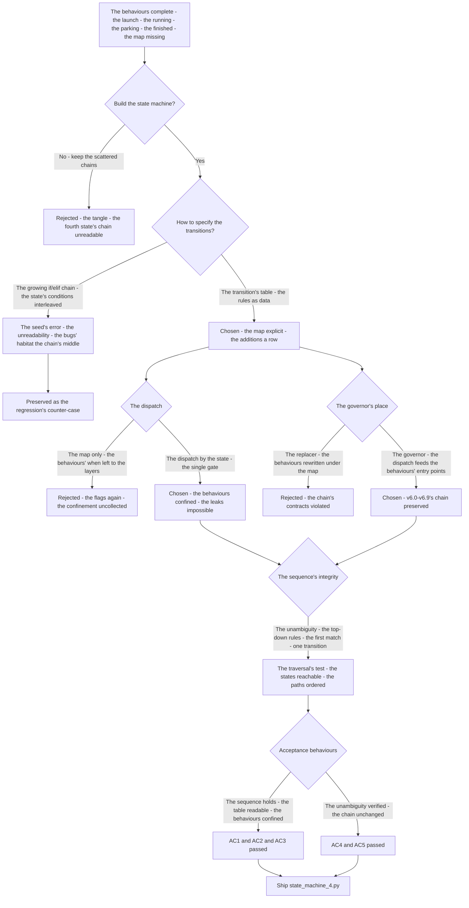
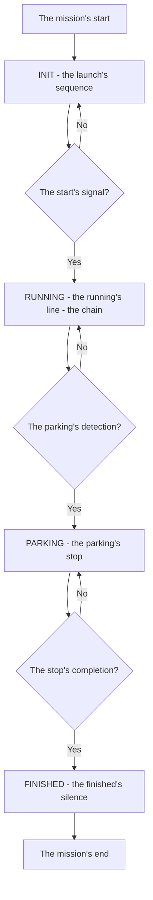
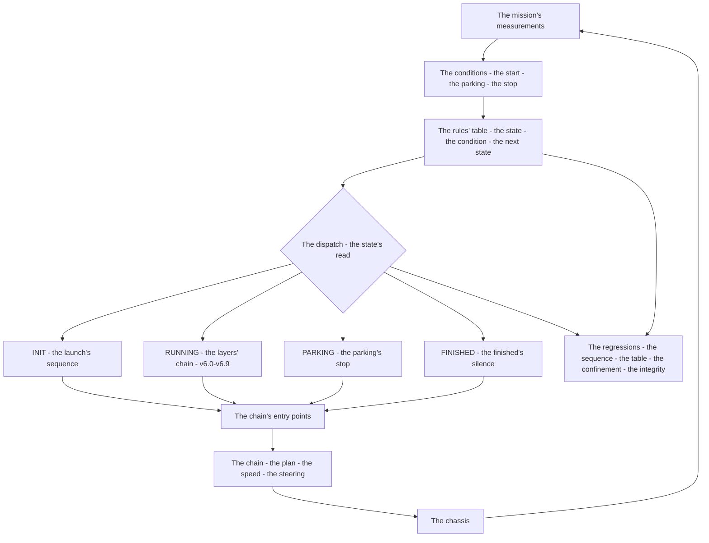

# v7.0 — Basic 4-state machine

| Version | Phase | Days |
|---------|-------|------|
| v7.0 | Mission & Behavior | Day 178-180 |

---

## 3. Mission of this version

v6.9's journal ended with the debt named: the robot has behaviours — the launch's sequence, the running's line, the parking's stop, the finished's silence — but no *map* of them: no state that says where the mission is, no transitions that govern the changes, the behaviours' logic scattered across the chain's layers in plain if/elif chains that grow with every addition. The single problem v7.0 attacks is that map: *the first state machine — INIT, RUNNING, PARKING, FINISHED — the transitions as a table of rules, not a growing chain*. And the version's own trap, named in its seed: the growing if/elif chain became unreadable after four states — the mission's logic tangled into the layers' logic, each addition's conditions interleaving with the others'; the fix is the transition's table — the (state, condition, next_state) rules as data, the states' map explicit, the additions a row, not a rewrite. The mission includes the lesson's shape: state machines fail by tangling, not by size.

Why is this the correct next step on the critical path? The phases built the behaviours in pieces — the launch's sequence lives in the controller's start-up, the running's line in the layers' control, the parking's stop in the trajectory's condition, the finished's silence in the loop's end — and each addition's *when* was written as another if in another chain. The mission's behaviour is the product the competition scores, and the product is not the sum of the behaviours: it is the *sequence* of them — the state that holds the mission's position, the transitions that govern the changes, the dispatch that runs the right behaviour in the right state. The phases' layers (v6.0-v6.9) deliver the behaviours' *how* — the corner, the speed, the avoidance, the stop; the state machine delivers the *when* — the mission's map, the behaviours' governor. The robot can now behave; it must know what it is doing. The state machine is that knowing — the phase's first problem, the map the later versions (v7.1+) will extend.

What 'done' looks like — the acceptance criteria, written on Day 178 morning:

- **AC1:** The four states exist and the mission's sequence holds: the start signal moves INIT → RUNNING, the parking's detection moves RUNNING → PARKING, the stop's completion moves PARKING → FINISHED — the full run's order verified in the mission's test.
- **AC2:** The transitions are a table of rules: the (state, condition, next_state) pairs as data — the if/elif chains refactored out of the layers, each state's outgoing rules explicit and readable, the additions a row.
- **AC3:** The behaviours are dispatched by the state: the launch's sequence runs in INIT, the running's line in RUNNING, the parking's stop in PARKING, the finished's silence in FINISHED — each behaviour verified in its state only, no leak between the states.
- **AC4:** The transitions' conditions are unambiguous: the rules evaluated in a defined order, one transition per evaluation, no state's change skipping a state — the map's integrity verified by the traversal's test.
- **AC5:** The chain and the phase's regressions hold: v6.0-v6.9's suites unchanged, with the state machine's dispatch feeding the behaviours' entry points — the governor added, the chain's contracts preserved.

The bias in these criteria: AC2 is the honesty criterion — the version's whole lesson (transitions as data, not chains) is written as a structural test that reads the rules' table. AC3 is the behaviour's criterion — the states exist to run the right behaviour, and each behaviour's confinement is the map's proof.

---

## 4. Engineering context — where we stood

At the start of Day 178 the robot could corner, profile, plan, avoid, and stop — and could not say *where the mission was*. The context, in the phase's own terms:

- **The behaviours were complete; the map was missing.** The launch's sequence (the controller's start-up: the speed ramp-up, the heading's lock) worked; the running's line (the layers' chain: the plan, the speed, the avoidance) worked; the parking's stop (v6.8's emergency's limb, the distance's condition) worked; the finished's silence (the loop's end, the mission's completion) worked. Each was proven by the phases' tests. What did not exist: a state that says the robot is *running* — a single variable the mission's position, a single map of the changes between the behaviours.
- **The if/elif chains had grown, and the growth was the enemy.** The behaviours' *when* was scattered: the controller's start-up code checked the launch's conditions; the trajectory layer's condition checked the parking's distance; the loop's logic checked the completion. Each addition — v6.8's emergency, v6.9's avoidance's classes — added an if somewhere, and the chains' interleaving (the launch's conditions touching the parking's conditions touching the running's conditions) was the tangle the seed names: the fourth state's chain had become unreadable, the conditions' interactions unverifiable.
- **The mission's tests were behaviour-by-behaviour, not mission-by-mission.** The phases' suites tested the corner, the speed, the avoidance, the stop — each in isolation, each with its own harness. The mission's *sequence* — the launch, then the running, then the parking, then the finish — had never been tested as a whole, and the sequence's integrity (the order's enforcement, the changes' cleanliness) had no test at all.
- **The status flags existed, unread as states.** The mission's progress was carried in pieces: the controller's launch flag, the trajectory's stop's condition, the loop's completion. The mission status — the variable that would become the state — was scattered, each layer's flag its own, the map's single source missing.
- **The competition clock.** Three days to the mission's behaviour's first full test. The map's form — the states, the transitions, the dispatch — had to be settled because the mission's sequence (the launch-to-finish run) is the product the competition scores, and the map is its skeleton.

The system constraints that shaped v7.0:

- **The states are the mission's positions, and exactly one holds at any time.** INIT (before the start), RUNNING (the line's run), PARKING (the stop's execution), FINISHED (the mission's completion) — the four states are the mission's natural phases, mutually exclusive and jointly exhaustive: at any moment the robot is in exactly one, and the state's variable is the mission's position's single source of truth (the flags' scatteredness the map's enemy, Error 5's lesson's context).
- **The transitions are data, not code — the table is the map.** The (state, condition, next_state) rules as a data table: the states' map explicit, the additions a row, the chains refactored out of the layers (AC2). The table's shape is the phase's promise: the rules' order defined (the conditions evaluated top-down, the first match's transition taken — AC4's unambiguity), the traversal's test verifying the map's integrity (each reachable state reached, each path's order enforced).
- **The dispatch is the state's behaviour's gate.** Each state's behaviour — the launch's sequence, the running's line, the parking's stop, the finished's silence — runs only in its state: the dispatch (the state's read, the behaviour's selection) is the single gate, and the behaviours' entry points (the layers' start-up, the chain's run, the stop's trigger) are called by the gate (AC3's confinement).
- **The behaviours' contracts are the chain's, preserved.** The state machine is the governor, not a replacer: the launch's sequence is the controller's sequence, the running's line is the layers' chain, the parking's stop is v6.8's and v6.9's stop — the state machine selects *which* behaviour runs, and the behaviours' internal contracts (the chain's orders, the ramp's shape, the lines' thresholds) are untouched (AC5).
- **The mission's sequence is the score's skeleton.** The competition scores the mission — the launch to the finish, the line's run, the parking's stop — and the sequence's integrity (the states' order, the changes' cleanliness) is the product. The state machine is the sequence's enforcement: the map the behaviours hang on, the traversal's test the map's proof.

The pressure was the phase's promise, now at the end: the corner deliberate (v6.3), the gain right at every speed (v6.4), the state honest (v6.5), the plan real (v6.6), the path smooth (v6.7), the speed safe (v6.8), the robot looking where it is going (v6.9) — and the mission still unsequenced: the behaviours complete, the map missing, the run's order untested.

---

## 5. The engineering thought process — first principles

### 5.1 Constraints and hard limits, derived from first principles

**The mission is a sequence, and the sequence needs a position.** The mission's run — the launch, the line, the parking, the finish — is a sequence of behaviours, and a sequence's execution needs a position: a variable that says which behaviour is due, the mission's progress's single source of truth. The state is that position — the four states (INIT, RUNNING, PARKING, FINISHED) the mission's natural phases, exactly one holding at any time — and the state's variable replaces the scattered flags (the controller's launch flag, the trajectory's stop's condition, the loop's completion) with one map's source.

**The transitions are the sequence's edges, and the edges are data.** The changes between the states — the start signal (INIT → RUNNING), the parking's detection (RUNNING → PARKING), the stop's completion (PARKING → FINISHED) — are the sequence's edges, and the edges' specification is the map. The table of rules — (state, condition, next_state) — is that specification as data: the map explicit, the additions a row, the chains refactored out of the layers. The data's shape is the readability's proof: the states' outgoing rules visible at a glance, the conditions' order defined (the top-down evaluation, the first match's transition — the unambiguity AC4 tests).

**The dispatch is the state's gate, and the behaviours are confined.** The behaviours exist — the launch's sequence, the running's line, the parking's stop, the finished's silence — and each belongs to its state: the dispatch (the state's read, the behaviour's selection) is the single gate, and the behaviours run in their states only (AC3). The confinement is the map's proof: the launch's sequence never re-runs in the running, the running's line never applies during the parking — each behaviour's entry called by the gate, the leaks the map's enemy (Error 4's lesson's context).

**The governor is not a replacer — the chain's contracts hold.** The state machine selects the behaviour; the behaviours deliver the how. The launch's sequence is the controller's sequence, the running's line is the layers' chain (v6.0-v6.9's, the corner through the avoidance), the parking's stop is v6.8's and v6.9's stop — the governor's dispatch feeds the behaviours' entry points, and the behaviours' internal contracts (the chain's orders, the ramp's shape, the lines' thresholds) are preserved (AC5). The state machine's addition is the map's layer, not a rewrite of the chain.

**The sequence's integrity is the map's test.** The mission's order — the launch to the finish — is the score's skeleton, and the order's enforcement is the map's integrity: the states' reachability (every state reached by the sequence), the paths' order (the start before the run, the run before the parking, the parking before the finish), the changes' cleanliness (one transition per evaluation, no state's skip). The traversal's test — the mission's run under the map — verifies the integrity, and the map's rules' unambiguity (AC4) is the integrity's structural guarantee.

### 5.2 Requirements derived from constraints

Constraint C1 (the mission is a sequence, the state its position) implies:

- **R1:** The four states — INIT, RUNNING, PARKING, FINISHED — exist as the mission's positions, exactly one holding at any time, with the state's variable the mission's progress's single source of truth (AC1).

Constraint C2 (the transitions are the sequence's edges, the edges data) implies:

- **R2:** The transitions are a table of (state, condition, next_state) rules — the if/elif chains refactored out of the layers, the rules' order defined, the additions a row (AC2).

Constraint C3 (the dispatch is the state's gate) implies:

- **R3:** The behaviours are dispatched by the state — the launch's sequence in INIT, the running's line in RUNNING, the parking's stop in PARKING, the finished's silence in FINISHED — each behaviour confined to its state, the dispatch the single gate (AC3).

Constraint C4 (the sequence's integrity is the map's test) implies:

- **R4:** The transitions' conditions are unambiguous — the rules evaluated top-down, the first match's transition taken, one transition per evaluation, the traversal's test verifying the states' reachability and the paths' order (AC4).

Constraint C5 (the governor is not a replacer) implies:

- **R5:** The state machine's dispatch feeds the behaviours' entry points, and the chain's contracts hold — v6.0-v6.9's suites unchanged, the behaviours' internal logic untouched (AC5).

### 5.3 Alternatives considered

**Alternative A — Keep the scattered chains (do nothing).** Analysis: the status quo — the behaviours' *when* in the layers' if/elif chains, no state's variable. The case for: proven, integrated, zero effort. The case against, measured on Day 178: the tangle — the fourth state's chain unreadable, the conditions' interactions unverifiable (the launch's conditions touching the parking's conditions touching the running's conditions), the additions' cost growing with every if. Effort: zero. Robustness: 2/5. Verdict: rejected as the sole answer; retained as the baseline.

**Alternative B — The growing if/elif chain (the seed's error).** Analysis: the state as a variable, the transitions as a monolithic if/elif chain — the natural first step from the flags. The case for: simple, the state's variable introduced. The case against, measured on Day 178: the chain's unreadability — the four states' conditions interleaved in one if/elif, each addition's condition tested against every state, the bugs' habitat the chain's middle (the state's change's conditions' overlap). Effort: low. Robustness: 2/5. Verdict: rejected, preserved as the counter-case.

**Alternative C — The transition's table of rules (chosen).** The shipped design, per section 5.1. Effort: medium. Robustness: 5/5 within the measured scenarios. Verdict: accepted.

**Alternative D — The generic state-machine library (a framework).** Analysis: the mission's machine on a third-party state-machine engine — the library's states, transitions, hooks. The case for: the engine's maturity, the features (the guards, the entry/exit callbacks). The case against, in this system: the dependency — the engine's conventions (its API, its lifecycle) imported into the robot's firmware, the debugging across the library's boundaries, the codebase's rule (the sim-first, the dependencies minimal — the phases' custom layers built, not bought). Effort: medium. Robustness: 3/5. Verdict: rejected — the custom table's ten lines beat the library's contract.

**Alternative E — The states without the dispatch (the map only).** Analysis: the state machine as a pure map — the states and the transitions, the behaviours' dispatch left to the layers' own conditions. The case for: the map's minimalism. The case against, in this system: the map without the gate is the flags' state again — the behaviours' *when* still in the layers' chains, the map's value (the dispatch's confinement, AC3) uncollected. Effort: low. Robustness: 2/5. Verdict: rejected — the dispatch is the map's value.

### 5.4 Trade-off matrix

| Alternative | Effort | Robustness | Reproducibility | Risk | Reuse |
|---|---|---|---|---|---|
| A: Scattered chains (status quo) | 0 | 2/5 | 5/5 | 4/5 (the tangle) | 5/5 (the baseline) |
| B: Growing if/elif chain | 1/5 | 2/5 | 3/5 | 4/5 (the unreadability) | 1/5 |
| C: Transition's table (chosen) | 2/5 | 5/5 | 5/5 | 1/5 | 5/5 |
| D: Generic library | 2/5 | 3/5 | 4/5 | 3/5 (the dependency) | 1/5 |
| E: Map without dispatch | 1/5 | 2/5 | 4/5 | 3/5 (the flags again) | 2/5 |

### 5.5 Decision and its mathematical justification

We chose Alternative C — the transition's table of rules — and the justification, in order of weight:

**The map is the sequence's clarity, and the table is the map's form.** The mission's sequence — the launch to the finish — needs its map explicit: the states, the transitions, the conditions — each visible, each verifiable. The table of rules is that clarity: the (state, condition, next_state) rows as data, the states' outgoing edges at a glance, the additions a row instead of a rewrite (AC2). The if/elif chain's unreadability (the seed's error — the fourth state's chain tangled) is the table's absence's cost, and the table's readability is the map's proof.

**The dispatch is the map's value, and the confinement is the behaviours' correctness.** The behaviours exist and each belongs to its state — the dispatch (the state's read, the behaviour's selection) is the single gate, the behaviours confined (AC3). The gate's value is the correctness's guarantee: the launch's sequence never re-runs in the running, the running's line never applies during the parking — the leaks (Error 4) the map's enemy, the confinement the dispatch's proof.

**The governor is the chain's protector, and the contracts hold.** The state machine selects the behaviour; the behaviours deliver the how — the chain's layers' contracts (the orders, the ramp's shape, the lines' thresholds) untouched (AC5). The addition is the map's layer, not a rewrite — the phases' investments (v6.0-v6.9's, the corner through the avoidance) preserved under the governor's dispatch.

**The sequence's integrity is the map's test, and the unambiguity is its guarantee.** The mission's order is the score's skeleton — the start before the run, the run before the parking, the parking before the finish — and the order's enforcement is the map's integrity: the rules' top-down evaluation, the first match's transition, one transition per evaluation (AC4). The traversal's test verifies the integrity, and the unambiguity (the conditions' mutual exclusivity in the order) is the map's structural guarantee.

The measured acceptance, on the Day 178-180 tests: the four states and the mission's sequence (AC1); the table of rules, the chains refactored (AC2); the behaviours' confinement (AC3); the conditions' unambiguity and the traversal's integrity (AC4); the chain's suites unchanged (AC5).

### 5.6 What we deliberately deferred

Four items were out of scope for Days 178-180. First, *the sub-states* — the running's internal phases (the straight's run, the corner's run, the avoidance's run) as the states' refinement — recorded as the extension once the mission's runs (the first full runs on Day 179) show the running's behaviour's need for its own map. Second, *the failure's handling* — the stalled state (the mission's error, the timeout's recovery — the sensor's failure, the stuck's detection) recorded as the extension for the competition's robustness, the state machine's map the natural home for the failure's states. Third, *the mission's parameters' table* — the run's values (the speeds, the thresholds, the stop's distances) as data, the mission's configuration — recorded once the missions' variety (the courses' differences) shows the parameters' need. Fourth, *the mission's log* — the states' history, the transitions' timestamps, the run's telemetry — recorded as the extension for the debugging, the map's traversal the log's skeleton.

---

## 6. Decision flowchart





The first flowchart is the decision trail — the scattered chains rejected, the growing if/elif chain preserved as the seed's counter-case, the transition's table chosen (the map explicit, the additions a row), the dispatch by the state chosen (the behaviours confined), the governor's place settled (the chain preserved), and the sequence's integrity verified. The second is the mission's map itself: the four states in their order, the conditions on the edges — the launch's start, the parking's detection, the stop's completion — the map the version ships.

---

## 7. Implementation blueprint

The implementation is `state_machine_4.py`:

```python
class StateMachine:
    def __init__(self):
        self.state = "INIT"
        self.rules = [
            ("INIT",    lambda m: m.start_signal,           "RUNNING"),
            ("RUNNING", lambda m: m.parking_detected,       "PARKING"),
            ("PARKING", lambda m: m.stop_completed,         "FINISHED"),
        ]
    def update(self, mission):
        for state, cond, next_state in self.rules:
            if self.state == state and cond(mission):
                self.state = next_state
                return
        return self.state
```

**The contract.** `StateMachine()` holds the state and the rules' table; `update(mission)` evaluates the rules top-down, takes the first match's transition (one transition per evaluation — AC4's unambiguity), and returns the state. The rules are data: the (state, condition, next_state) rows, the additions a row (AC2). The dispatch is the state's read: the behaviour's entry points called by the state's switch, each behaviour confined to its state (AC3).

**The conditions' derivations, written next to the conditions.** The start's signal: the mission's start trigger (the button's press, the run's command) — the INIT → RUNNING's condition, the launch's completion the behaviour itself. The parking's detection: the parking zone's recognition (the distance's threshold, the marker's read — the trajectory layer's parking's condition's hook, v6.8's stop's trigger) — the RUNNING → PARKING's condition. The stop's completion: the stop's finish (the speed's zero hold, the position's tolerance — the parking's stop's completion's hook) — the PARKING → FINISHED's condition. Each condition is a mission's measurement's question — the map's edges the sensor's truth's events.

**The integration into the chain.** The state machine is the governor, added above the chain: the dispatch's calls feed the behaviours' entry points — the INIT's dispatch runs the launch's sequence (the controller's start-up), the RUNNING's dispatch runs the layers' chain (v6.0-v6.9's running's line, the plan through the avoidance), the PARKING's dispatch runs the parking's stop (v6.8's stop's limb, v6.9's brake's line's mandate), the FINISHED's dispatch runs the finished's silence (the mission's completion). The chain's layers are untouched — the contracts (the orders, the ramp's shape, the lines' thresholds) preserved (AC5), the governor's dispatch the only addition.

**The regression suite.** (1) The sequence's test (AC1: the mission's run — the start moves INIT → RUNNING, the parking's detection moves RUNNING → PARKING, the stop's completion moves PARKING → FINISHED — the order verified). (2) The table's test (AC2: the rules are data, the chains absent from the layers, the additions a row). (3) The confinement's test (AC3: each behaviour runs in its state only — the launch's sequence not in the running, the running's line not in the parking, the leaks absent). (4) The integrity's test (AC4: the top-down evaluation, the first match, one transition per evaluation — the states reachable, the paths ordered, no state's skip). (5) The chain's regressions (AC5: v6.0-v6.9's suites unchanged under the governor). All green by the evening of Day 179.

**The day-by-day reality.** Day 178: the seed's reproduction (the fourth state's if/elif chain — the unreadability measured, the counter-case built), the states' semantics (the four states, the mission's phases), the rules' table's shape (the data's form, the order's contract). Day 179: the dispatch's build (the state's switch, the behaviours' entry points), the chain's integration (the governor above the chain), the confinement's catch (Error 3), the integrity's test (AC4). Day 180: the unambiguity's catch (Error 4), the map's edges' catch (Error 5), the regressions (AC5), and the write-up.

---

## 8. Architecture / data-flow flowchart



The diagram is the state machine's place in the phase's architecture, complete: the mission's measurements through the conditions to the rules' table, the table's first match to the dispatch, the dispatch to the behaviours' entry points, the behaviours through the chain to the chassis — with the regressions standing watch over the sequence's integrity and the chain's preservation.

---

## 9. Errors, failures, and root-cause analysis

### Error 1: the growing chain's unreadability — the seed's error, the fourth state's tangle

**Symptom.** Day 178, the first build (Alternative B): the state as a variable, the transitions as a monolithic if/elif chain. The mission's first full runs: the behaviour's logic *tangled* — the launch's conditions checking the state's every value, the parking's conditions interleaved with the running's, the additions (v6.8's emergency, v6.9's classes) inserted into the chain's middle — the chain's length ~60 lines by the fourth state, the conditions' interactions unverifiable at a glance, the bugs' habitat the chain's middle (the state's changes' conditions' overlap).

**Initial hypotheses.** We suspected the conditions were too many. We suspected the states' semantics were wrong. We suspected the behaviours themselves were broken.

**Investigation.** The chain's structure was the diagnosis: the if/elif chain tests each state's conditions in sequence, and every addition's condition is tested against every state — the conditions' interactions grow quadratically with the states' count, and the chain's readability decays with the same law. The fourth state's chain (the four states' conditions in one if/elif) was the unreadability's threshold: the mission's logic's *when* buried in the code's flow, the map invisible. The seed's error was the *form's*: the transitions written as code, the map entangled with the behaviour.

**Root cause.** The transitions' form: the if/elif chain encodes the map in the code's flow — the conditions' interactions unreadable, the additions' cost growing with every state, the map's clarity the chain's absence.

**Fix.** The transition's table (the shipped structure): the (state, condition, next_state) rules as data — the map explicit, the chains refactored out of the layers, the additions a row, the readability structural (AC2).

**Prevention.** The rule became the version's headline: *state machines fail by tangling, not by size — the transitions are data, not code, and the map's clarity is the table's form* — the table's test (AC2) joined the regression, with the 60-line chain preserved as the counter-case.

### Error 2: the dispatch's bypass — the behaviours' when left to the layers

**Symptom.** Day 178, the second build (Alternative E's form, before the dispatch's completion): the state machine's map built, the behaviours' *when* left to the layers' own conditions (the layers' chains still checking the launch's flags, the stop's conditions themselves). The first mixed runs: the *leaks* — the running's line's conditions firing during the parking's stop (the trajectory layer's own check beating the map's state), the launch's sequence's conditions re-evaluated mid-run — the behaviours' dispatch in two places, the map's confinement unenforced.

**Initial hypotheses.** We suspected the layers' conditions were wrong. We suspected the state's variable's wiring. We suspected the mission's tests' coverage.

**Investigation.** The dispatch's absence was the diagnosis: the map without the gate is the flags' state again — the behaviours' *when* still in the layers' chains, each layer's condition its own gate, the gates' interactions the leaks (the running's line's condition true during the parking — the layer's check reading the sensors, not the state). The dispatch — the state's read, the behaviour's selection, the single gate — is the map's value, and the value was uncollected.

**Root cause.** The dispatch's bypass: the behaviours' entry points still called by the layers' conditions — the gates plural, the confinement (AC3) unenforced, the map's value uncollected.

**Fix.** The dispatch completed (the shipped structure): the behaviours' entry points called by the state's switch alone — the INIT's dispatch runs the launch's sequence, the RUNNING's dispatch runs the chain, the PARKING's dispatch runs the stop, the FINISHED's dispatch runs the silence — the layers' own conditions removed, the gate single, the confinement enforced. The re-test: the leaks gone, each behaviour running in its state only (AC3).

**Prevention.** The rule: *the map without the gate is the flags again — the dispatch is the map's value, the gate single, and the behaviours run by the state's read alone* — the confinement's test (AC3) joined the regression.

### Error 3: the entry's re-run — the launch's sequence replaying on the state's re-entry

**Symptom.** Day 179, the dispatch's first integrated runs: the mission's run *stuttered* — the launch's sequence replaying on the state's re-entry (the INIT's dispatch called not only on the entry but on every update while the state held — the launch's ramp-up's conditions re-satisfied, the sequence's steps re-executing from the beginning, the robot's speed's profile resetting mid-launch), the behaviour's execution double.

**Initial hypotheses.** We suspected the dispatch's frequency. We suspected the launch's sequence's logic. We suspected the conditions' edges.

**Investigation.** The entry's semantics was the diagnosis: the dispatch's call ran the state's behaviour on *every* update — but the behaviour's entry (the launch's sequence's start) is a *once* action (the sequence's first step, the ramp's start), and the behaviour's run (the sequence's continuation) is a *per-tick* action. The conflation — the entry and the run in one call — re-ran the entry on every tick, the sequence's steps re-executed, the mission's launch's profile reset. The states' semantics need the entry/run split: the entry once at the transition's moment, the run per tick while the state holds.

**Root cause.** The entry's conflation: the dispatch's single call ran the entry and the run together — the once-actions re-executed per tick, the launch's sequence replaying on the state's hold.

**Fix.** The dispatch's split: the entry's call at the transition's moment (the state's change executes the new state's entry once), the run's call per tick (the behaviour's continuation while the state holds) — the launch's sequence's entry once, the running's chain's run per tick, the parking's stop's entry once. The re-test: the stutter gone, the launch's profile clean, each behaviour's entry once and run per tick.

**Prevention.** The rule: *a state's behaviour has an entry and a run — the entry once at the transition's moment, the run per tick, and the conflation re-executes the once — the split is the dispatch's contract* — the entry's test joined the regression.

### Error 4: the unambiguity's gap — the conditions' overlap, the state's skip

**Symptom.** Day 180, the traversal's first tests: the mission's run *skipped* a state — the parking's detection's condition true *and* the stop's completion's condition true in the same evaluation (the mission's measurements racing — the parking's zone detected as the stop's conditions already met at the zone's edge), the RUNNING → PARKING's rule evaluated after the PARKING → FINISHED's rule, the first match's transition taken — the mission's run PARKING's stop skipped, the stop's behaviour never executed, the run's order violated.

**Initial hypotheses.** We suspected the conditions' thresholds. We suspected the missions' measurements' cadence. We suspected the rules' order's convention.

**Investigation.** The order's semantics was the diagnosis: the table's evaluation takes the first match top-down, and the order is the *precedence* — the earlier rules' conditions checked before the later rules'. The rules' order (the INIT's, the RUNNING's, the PARKING's, the FINISHED's) put the later states' rules after the earlier states' — but the *conditions' overlap* (the parking's detection true while the stop's completion also true at the zone's edge) let the later rule's transition fire while the earlier state's rule's condition also held — the state's skip the overlap's cost. The map's integrity needs the conditions' unambiguity: the rules' order defined, the conditions mutually exclusive in the order, one transition per evaluation (AC4).

**Root cause.** The conditions' overlap: the mission's measurements racing at the zone's edge — the two conditions true in the same evaluation, the order's precedence taking the later transition, the state's skip the map's integrity's violation.

**Fix.** The order's contract: the rules' order fixed (the states' sequence: the INIT's rule, then the RUNNING's, then the PARKING's), the conditions' guards (the parking's detection requiring the running's active state — the rule's state's field already enforcing the sequence, the overlap's remaining cases the conditions' mutual exclusivity: the stop's completion's condition requiring the parking's active state, already the rule's state's field) — the re-audit: the conditions' pairs checked for the same-evaluation overlap, the guards added where the races remained, one transition per evaluation verified (AC4). The re-test: the state's skip gone, the run's order enforced, every state reached in sequence.

**Prevention.** The rule: *the map's integrity is the unambiguity — the rules' order is the precedence, the conditions' overlap is the skip, and one transition per evaluation is the map's guarantee* — the integrity's test (AC4) joined the regression, with the skip's run preserved as the reference.

### Error 5: the finished's re-entry — the mission's restart from the terminal state

**Symptom.** Day 180, the full mission's runs: the mission *re-ran* after the finish — the finished's silence broken by the next start's signal (the start's condition true again — the operator's second press — the INIT → RUNNING's rule's state's field checked the *current* state's INIT, but the mission was in FINISHED, and the rules' table held no rule for the FINISHED's state — the mission's run's re-entry's path absent, the restart's behaviour undefined, the run's completion's integrity violated: the finished's state re-entered the running without the launch).

**Initial hypotheses.** We suspected the start's signal's debounce. We suspected the operator's presses. We suspected the rules' table's completeness.

**Investigation.** The terminal state's semantics was the diagnosis: the rules' table's rows define the transitions *from* each state — and the FINISHED's state's rows are the map's terminal's definition: the finished's silence is the mission's end, the terminal state has *no* outgoing rules, the re-entry's path absent by construction. The mission's restart (the operator's second press) is a *new* mission's start — the INIT's state's entry, not the FINISHED's exit — and the restart's semantics (the mission's reset, the states' re-initialisation) is the future's feature (the missions' multiple runs), recorded as the extension. The map's integrity: the terminal state's confinement (no outgoing rules, the finished's silence) enforced.

**Root cause.** The terminal state's rules' absence: the FINISHED's state's rows missing by design — the finished's silence the map's end, the re-entry's path absent, the restart's semantics undefined (the new mission's start, the reset, recorded as the extension).

**Fix.** The terminal's confinement verified (the shipped map): the FINISHED's state's no outgoing rules confirmed by the traversal's test (the mission's end reached, the finished's silence held, no path out), the restart's semantics recorded as the deferred item (the missions' multiple runs, the reset's behaviour, the future's extension). The re-test: the finish's silence held, the run's completion's integrity verified (AC4's traversal's end), the mission's end clean.

**Prevention.** The rule: *the terminal state is the map's end — no outgoing rules, the silence held, and the restart is a new mission's start, not the finished's exit — the terminal's confinement is the run's completion's integrity* — the traversal's end's test joined the regression.

---

## 10. Verification and metrics

**AC1 — the four states and the mission's sequence.** The start's signal moves INIT → RUNNING, the parking's detection moves RUNNING → PARKING, the stop's completion moves PARKING → FINISHED — the full run's order verified in the mission's test (the launch, the line, the parking, the finish in sequence). Passed.

**AC2 — the transitions as a table.** The (state, condition, next_state) rules as data, the if/elif chains absent from the layers, the additions a row — the table's structural test reading the rules' rows. Passed.

**AC3 — the behaviours' confinement.** The launch's sequence in INIT, the running's line in RUNNING, the parking's stop in PARKING, the finished's silence in FINISHED — each behaviour verified in its state only, the leaks absent. Passed.

**AC4 — the conditions' unambiguity.** The rules' top-down evaluation, the first match's transition, one transition per evaluation — the traversal's test verifying the states' reachability and the paths' order, the state's skip absent. Passed.

**AC5 — the chain and the phase's regressions.** v6.0-v6.9's suites unchanged, with the state machine's dispatch feeding the behaviours' entry points — the governor added, the chain's contracts preserved. Passed.

**The sequence's provenance.** The states' semantics' measurement: the mission's natural phases observed in the phases' runs — the launch's start-up (the controller's), the running's line (the chain's), the parking's stop (v6.8's and v6.9's), the finished's completion (the loop's end) — the states' boundaries documented next to the transitions.

**Cost.** Runtime: microseconds per evaluation (the rules' table's scan, the conditions' checks, the dispatch's call — the map's overhead the tick's fraction). Development: three days, with the errors' lessons (the tangling, the dispatch's gate, the entry's split, the unambiguity, the terminal's confinement) now permanent checklist items.

**What we trusted afterwards and what we still distrusted.** We trusted the map's *form* completely — the table of rules, the dispatch's gate, each proven by its test. We trusted the chain's preservation as the governor's contract. We still distrusted three things: the *sub-states* (the running's internal phases, pending the first full runs' evidence); the *failure's handling* (the stalled state, the timeout's recovery, recorded for the competition's robustness); and the *restart's semantics* (the missions' multiple runs, the reset's behaviour, recorded as the extension). Each is a named, written debt — the phase's rule.

---

## 11. Lessons learned — permanent mental models

**Lesson 1 — state machines fail by tangling, not by size.** The seed's lesson: the fourth state's if/elif chain was ~60 lines and unreadable — not because the mission was complex, but because the map was encoded in the code's flow. The permanent practice: the transitions are data — the (state, condition, next_state) rows — and the map's clarity is the table's form, the additions a row, never a rewrite.

**Lesson 2 — the dispatch is the map's value.** The map without the gate is the flags' state again: the behaviours' *when* left to the layers' conditions, the gates plural, the leaks the cost. The permanent model: the state machine selects the behaviour — the state's read, the single gate — and the behaviours run by the state's dispatch alone.

**Lesson 3 — a state's behaviour has an entry and a run.** The launch's sequence replayed on the state's hold — the entry and the run conflated in one call. The permanent rule: the entry once at the transition's moment, the run per tick while the state holds — the split is the dispatch's contract.

**Lesson 4 — the rules' order is the precedence, and the unambiguity is the map's integrity.** The conditions' overlap at the zone's edge skipped the parking's state — the two conditions true in the same evaluation, the first match taking the later transition. The permanent practice: the rules' order defined, the conditions' overlap guarded, one transition per evaluation — the traversal's test the map's proof.

**Lesson 5 — the terminal state is the map's end.** The finished's re-entry was the terminal's rules' absence — the silence held by construction, the restart a new mission's start, not the finished's exit. The permanent model: every map has a terminal, the terminal's confinement is the run's completion's integrity, and the restart's semantics is a future's feature.

**Lesson 6 — the governor is not a replacer.** The state machine selects the behaviour; the behaviours deliver the how — the chain's layers' contracts untouched, the phases' investments preserved. The permanent rule: the new layer's addition is the map's layer, never a rewrite — the governor's dispatch feeds the behaviours' entry points, and the chain's orders hold.

---

## 12. Code in this snapshot

`state_machine_4.py`

---

## 13. Bridge to the next version

What v7.0 unlocks is the mission's map: the four states (INIT, RUNNING, PARKING, FINISHED), the transitions as a table of rules, the dispatch as the behaviours' gate — the launch's sequence, the running's line, the parking's stop, the finished's silence, each in its state, the run's order enforced. Three capabilities travel forward. First, the map itself — the states, the transitions, the dispatch — the skeleton the mission's behaviours hang on, the governor the chain's layers serve. Second, the *discipline*: the transitions as data (the tangling's cure), the dispatch's single gate, the entry's split, the unambiguity's order, the terminal's confinement — the phase's quality bar, now complete across the mission's behaviour. Third, the *sequence's integrity*: the traversal's test, the states' reachability, the paths' order — the verification the competition's runs will stand on.

The known debt, stated plainly: the sub-states (the running's internal phases — the straight's run, the corner's run, the avoidance's run — the running's behaviour's own map); the failure's handling (the stalled state, the timeout's recovery — the sensor's failure, the stuck's detection — the competition's robustness); the restart's semantics (the missions' multiple runs, the reset's behaviour); the mission's parameters' table (the run's values as data, the courses' configuration); the mission's log (the states' history, the transitions' timestamps, the run's telemetry); and the *rules' completeness itself*: the state machine has the four states and the table of rules, but the map is the happy path only — the WRO rules' full set is unmapped: the stop-and-go's station (the blue marker's wait) has no state, the parking's search (the laps' completion to the marker's detection) is collapsed into the parking's single state, the emergency's day (the surprise's brake) is unhandled — every rule must map to exactly one state, or the rule's behaviour runs ungoverned. The next problem — the one v7.1 (Day 181-183) must attack — is that completeness: *the full mission state machine — INIT, RUNNING, SEARCHING_PARKING, PARKING_MANEUVER, FINISHED plus EMERGENCY_BRAKE and STOP_AND_GO — every rule's state, the transitions as the map's edges, the surprise rules' adapter at the day's gate*. The robot now knows what it is doing; it must know the rules it obeys. That is the work of the next three days.
