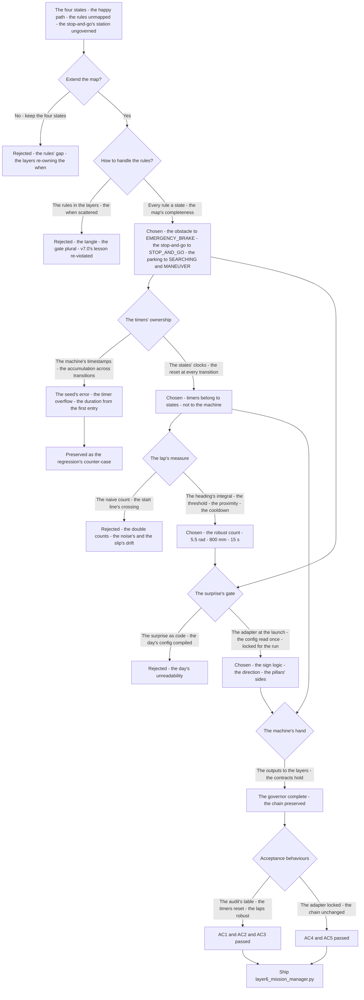
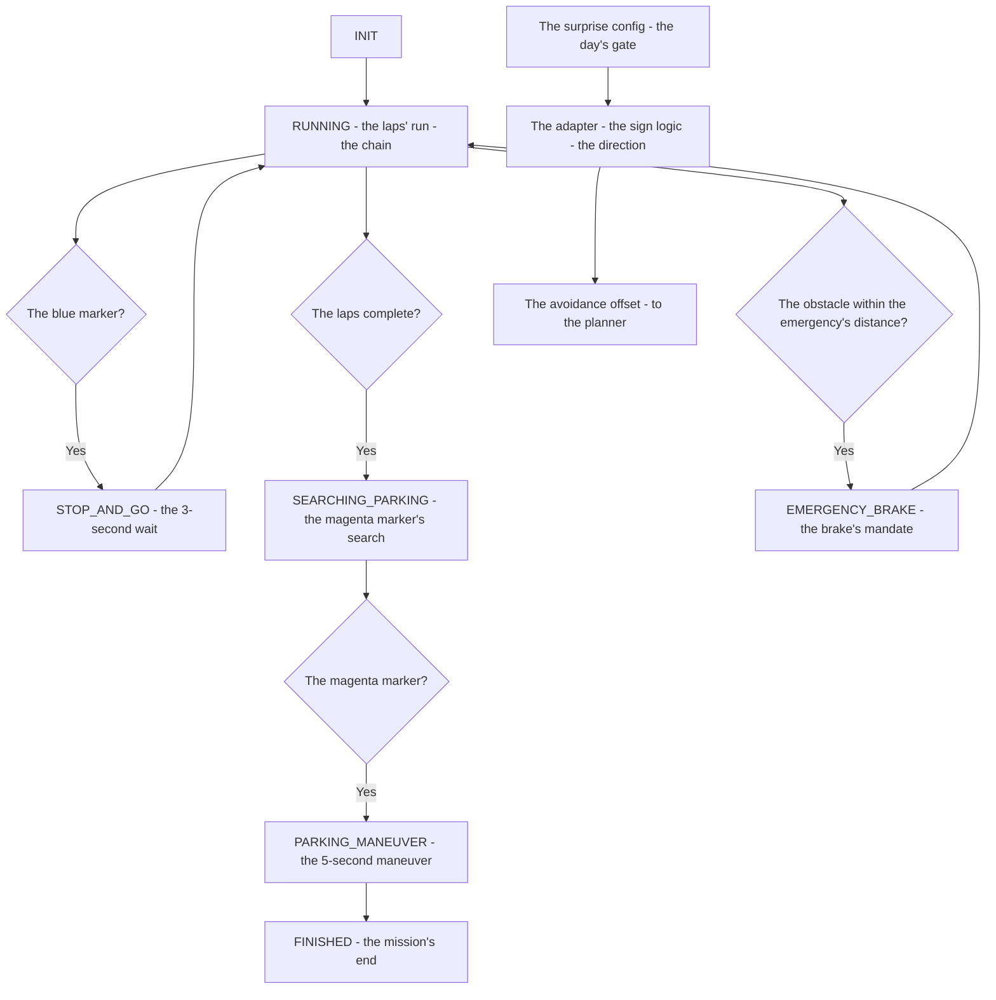
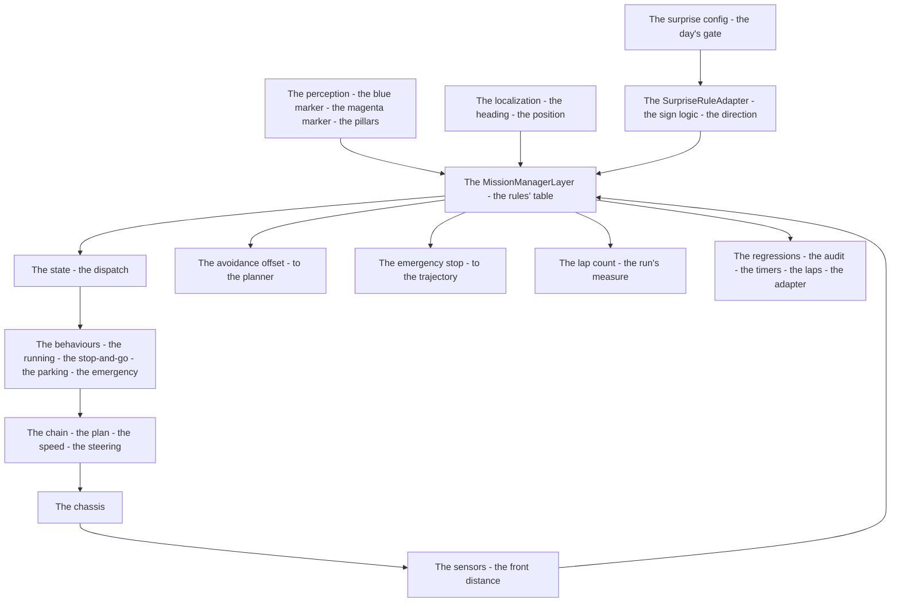

# v7.1 — Full mission state machine

| Version | Phase | Days |
|---------|-------|------|
| v7.1 | Mission & Behavior | Day 181-183 |

---

## 3. Mission of this version

v7.0's journal ended with the debt named: the map is shallow — the four states (INIT, RUNNING, PARKING, FINISHED) govern the mission's phases, but the mission's *rules* are not mapped: every WRO rule — the obstacle's stop, the stop-and-go's wait, the parking's search and maneuver, the emergency's brake — must map to exactly one state, and the day-of-competition surprise rules (the sign logic's reversal, the driving direction's change) must be handled at the launch. The single problem v7.1 attacks is that completeness: *the full mission state machine — INIT, RUNNING, SEARCHING_PARKING, PARKING_MANEUVER, FINISHED plus EMERGENCY_BRAKE and STOP_AND_GO — every rule's state, the transitions as the map's edges, the surprise rules' adapter at the day's gate*. And the version's own trap, named in its seed: the timer overflow — the state timers kept accumulating across transitions — the stop-and-go's duration measured from the first entry's timestamp even after the state's re-entry, the parking's maneuver's clock drifting with the machine's life; the fix is the timer's discipline — the timers belong to the states, not to the machine, and every transition resets them. The mission includes the lesson's shape: timers belong to states, not to the machine.

Why is this the correct next step on the critical path? The competition's rules are the score's skeleton — the obstacle's stop (the rules' mandate), the stop-and-go's wait (the blue marker's station), the parking's search and maneuver (the magenta marker's zone), the emergency's brake (the surprise rule's day) — and the rules' obedience is the map's completeness: every rule's behaviour needs its state, or the rule maps nowhere and the behaviour runs ungoverned (the layers' conditions re-owning the mission's when, v7.0's lesson re-violated). The surprise rules — the day-of-competition changes (the sign logic's reversal, the driving direction's flip) — are the competition's nature: the rules read on the day, the adapter the launch's gate. The map's extension (the four states to the seven) is the phase's promise's completion: the robot knows what it is doing; now it knows the rules it obeys. The state machine is that knowing — the full map, the rules' states, the surprise's adapter.

What 'done' looks like — the acceptance criteria, written on Day 181 morning:

- **AC1:** Every WRO rule maps to exactly one state: the obstacle → EMERGENCY_BRAKE, the stop-and-go → STOP_AND_GO, the parking's search → SEARCHING_PARKING, the parking's maneuver → PARKING_MANEUVER, the mission's end → FINISHED — the rule-to-state audit's table verified, no rule ungoverned.
- **AC2:** The timers are state-scoped: every transition resets the machine's timers, the STOP_AND_GO's 3-second wait and the PARKING_MANEUVER's 5-second maneuver measured correct across the re-entries — the timer overflow's counter-case preserved.
- **AC3:** The lap counting is robust: the 3 laps counted without the double counts or the misses — the heading-integral's threshold (5.5 rad), the cooldown (15 s), and the start-zone's proximity (800 mm) verified in the mission's runs.
- **AC4:** The surprise adapter is correct and locked: the sign logic (NORMAL/REVERSED) and the driving direction (CCW) mapped, the pillars' offsets (LEFT/RIGHT, ±0.6) verified at the launch, the mid-run change rejected.
- **AC5:** The chain and the phase's regressions hold: v6.0-v7.0's suites unchanged, with the MissionManagerLayer's outputs (the state, the lap count, the avoidance offset, the emergency stop) consumed by the layers' contracts.

The bias in these criteria: AC2 is the honesty criterion — the version's whole lesson (the timers belong to the states) is written as a test that reproduces the overflow's accumulation. AC1 is the rules' criterion — the competition's rules are the map's completeness, and the audit's table is the map's proof.

---

## 4. Engineering context — where we stood

At the start of Day 181 the robot knew what it was doing — and did not know the rules it obeys. The context, in the phase's own terms:

- **The map existed, and the rules were unmapped.** v7.0's four states (INIT, RUNNING, PARKING, FINISHED) governed the mission's happy path — the launch, the run, the parking, the finish. The rules' full set was ungoverned: the stop-and-go's blue marker's wait had no state; the emergency's brake's day had no state; the parking's search (the lap count's completion to the magenta marker's detection) was collapsed into the parking's single state. Every WRO rule (obstacle, stop-and-go, parking, emergency) needed its map's row — one rule, one state.
- **The surprise rules were the competition's nature, unread.** WRO's day-of-competition changes — the sign logic's reversal (the green pillar's side flipped), the driving direction's change — are the rules read on the day, and the robot's plan had no gate for them: the pillars' avoidance sides were the v6.9 classes' defaults (the green → LEFT, the red → RIGHT), the day's reversal unrepresentable. The adapter — the surprise rules' mapping (the intent to the physical action, the sign logic and the direction from the day's config) — was the launch's gate's missing piece.
- **The lap counting was the run's skeleton, unrobust.** The run's length — the 3 laps — was the mission's measure, and the counting's robustness (the heading's integral, the start-zone's proximity, the noise's and the slip's margins) was the run's correctness. The naive counting (the start line's crossing) was the drift's habitat — the sensor's noise, the slip's accumulations, the double counts — and the robust count (the heading-integral's threshold plus the proximity plus the cooldown) was the run's skeleton's hardening.
- **The timers were the states' clocks, leaking.** The mission's timed behaviours — the stop-and-go's 3-second wait, the parking maneuver's 5-second hold, the emergency's exit's margin — ran on the machine's timestamps, and the timestamps' life was the machine's: the timers kept accumulating across the transitions (the state's re-entry re-reading the old timestamp — the overflow, the version's seed). The timers' discipline — the reset at every transition, the clock belonging to the state — was the version's first problem.
- **The competition clock.** Three days to the full mission's first rules-complete run. The state set's extension (the four to the seven), the surprise's adapter, and the lap's robustness had to be settled because the rules' obedience is the score's skeleton, and the full map is its enforcement.

The system constraints that shaped v7.1:

- **Every rule has exactly one state — the map's completeness is the rules' obedience.** The WRO rules — the obstacle (the stop's mandate), the stop-and-go (the blue marker's station), the parking (the search and the maneuver), the emergency (the day's brake) — each maps to exactly one state: the rule-to-state audit's table (AC1) is the map's proof, and the unmapped rule (the behaviour ungoverned, the layers' conditions re-owning the when — v7.0's lesson re-violated) is the map's failure.
- **The timers belong to the states, not to the machine.** The timed behaviours' clocks are the states' properties: the STOP_AND_GO's wait's timer starts at the state's entry, the PARKING_MANEUVER's hold's timer starts at the state's entry, and every transition resets the machine's timers (AC2) — the accumulation (the old timestamp's re-read, the overflow — the seed's error) is the clocks' leak, and the reset is the discipline.
- **The lap is an integral with a threshold, a cooldown, and a proximity.** The run's length is measured by the heading's integral (the accumulated yaw — the 5.5 rad's threshold for the 360°, the noise's and the slip's margin), gated by the start-zone's proximity (the 800 mm), and de-duplicated by the cooldown (the 15 s) — the robust count (AC3) the run's skeleton's hardening, the double count and the miss the count's failures.
- **The surprise rule is read once, at the launch's gate.** The day-of-competition config (the sign logic, the driving direction) is read at the launch — the adapter's mapping (the intent to the physical action: the green → LEFT, the red → RIGHT, the reversal flipped) locked for the run (AC4), the mid-run change rejected — the surprise's surprise is the day's, not the run's.
- **The machine's outputs are the layers' contracts' inputs.** The MissionManagerLayer's outputs — the state, the lap count, the avoidance offset, the narrow mode, the emergency stop, the parking flag — feed the layers' contracts: the planner's avoidance_offset (v6.6's slot, the adapter's ±0.6), the trajectory's emergency stop (v6.8's), the brake's mandate (v6.9's class) — the machine governs, the chain delivers (v7.0's governor's lesson, now complete).

The pressure was the phase's promise, now at the rules' gate: the corner deliberate (v6.3), the gain right (v6.4), the state honest (v6.5), the plan real (v6.6), the path smooth (v6.7), the speed safe (v6.8), the robot looking (v6.9), the mission mapped (v7.0) — and the rules still unmapped: the stop-and-go's station ungoverned, the emergency's day unhandled, the surprise's reversal unrepresentable.

---

## 5. The engineering thought process — first principles

### 5.1 Constraints and hard limits, derived from first principles

**The rules are the mission's obligations, and the obligations need the map's rows.** The WRO rules — the obstacle's stop, the stop-and-go's wait, the parking's search and maneuver, the emergency's brake — are the mission's obligations, and each obligation's behaviour needs its state: the state is the rule's map's row, the behaviour runs governed, the rule's obedience the map's completeness. The unmapped rule — the behaviour ungoverned, the layers' conditions re-owning the when — is the map's failure, and the rule-to-state audit's table (every rule's row) is the map's proof (AC1).

**The timed behaviours are the states' clocks, and the clocks reset at the transitions.** The mission's timed behaviours — the stop-and-go's 3-second wait, the parking maneuver's 5-second hold — are the states' timed properties: each state's clock starts at its entry, measures its duration, and the machine's timers reset at every transition (AC2). The accumulation — the state's re-entry re-reading the old timestamp, the duration measured from the first entry — is the overflow (the version's seed), and the reset is the discipline: timers belong to states, not to the machine.

**The lap is an integral, and the integral needs the threshold, the proximity, and the cooldown.** The run's length — the 3 laps — is the heading's integral (the accumulated yaw: the heading's deltas integrated, the 360° = 6.28 rad, the 5.5 rad the threshold with the noise's and the slip's margin), and the integral's completion is gated by the start-zone's proximity (the 800 mm — the completion at the zone, not the arbitrary point) and de-duplicated by the cooldown (the 15 s — the double count's guard) (AC3). The robust count is the run's skeleton's hardening: the double count (the threshold's crossing counted twice) and the miss (the threshold never reached, the slip's accumulation) are the count's failures.

**The surprise is the day's, read once at the launch's gate.** The day-of-competition config — the sign logic (NORMAL/REVERSED), the driving direction (CCW) — is the day's truth, read at the launch: the adapter's mapping (the intent to the physical action: the green pillar's side, the red pillar's side, the reversal's flip) locked for the run (AC4). The mid-run change (the config's flip mid-run) is the run's chaos — the avoidance's sides reversed mid-approach — and the gate's lock (the read once, the change rejected) is the adapter's discipline.

**The machine's outputs are the contracts' inputs, and the governor's hand is the chain's.** The machine's outputs — the state, the lap count, the avoidance offset (the adapter's ±0.6), the narrow mode, the emergency stop, the parking flag — feed the layers' contracts: the planner's avoidance_offset (v6.6's slot), the trajectory's emergency stop (v6.8's), the brake's mandate (v6.9's) — the machine governs, the chain delivers, and the contracts hold (AC5). The governor's addition (v7.0's) is complete: the rules' states, the surprise's adapter, the chain preserved.

### 5.2 Requirements derived from constraints

Constraint C1 (the rules are the mission's obligations) implies:

- **R1:** Every WRO rule maps to exactly one state — the obstacle → EMERGENCY_BRAKE, the stop-and-go → STOP_AND_GO, the parking's search → SEARCHING_PARKING, the parking's maneuver → PARKING_MANEUVER — the rule-to-state audit's table verified, no rule ungoverned (AC1).

Constraint C2 (the timed behaviours are the states' clocks) implies:

- **R2:** The timers are state-scoped — the machine's timers reset at every transition, the STOP_AND_GO's 3-second wait and the PARKING_MANEUVER's 5-second hold measured from their states' entries — the overflow's counter-case preserved (AC2).

Constraint C3 (the lap is an integral) implies:

- **R3:** The lap counting is robust — the heading-integral's threshold (5.5 rad), the start-zone's proximity (800 mm), and the cooldown (15 s) — the 3 laps counted without the double counts or the misses (AC3).

Constraint C4 (the surprise is the day's) implies:

- **R4:** The surprise adapter is read once at the launch's gate — the sign logic and the driving direction locked for the run, the avoidance offsets (LEFT/RIGHT, ±0.6) verified, the mid-run change rejected (AC4).

Constraint C5 (the machine's outputs are the contracts' inputs) implies:

- **R5:** The MissionManagerLayer's outputs feed the layers' contracts — the planner's avoidance_offset, the trajectory's emergency stop, the brake's mandate — and v6.0-v7.0's suites unchanged (AC5).

### 5.3 Alternatives considered

**Alternative A — Keep the four states (do nothing).** Analysis: the status quo — v7.0's map, the rules' behaviours left to the layers' conditions. The case for: proven, integrated, zero effort. The case against, measured on Day 181: the rules' gap — the stop-and-go's wait ungoverned (the blue marker's station the layers' condition), the emergency's day unhandled (the surprise's brake unmapped), the layers' conditions re-owning the when (v7.0's lesson re-violated). Effort: zero. Robustness: 2/5. Verdict: rejected as the sole answer; retained as the baseline.

**Alternative B — The rules in the layers (the when scattered again).** Analysis: the rules' behaviours added as the layers' conditions — the stop-and-go's check in the controller, the emergency's check in the trajectory, the states' map unchanged. The case for: the local changes, the map untouched. The case against, measured on Day 181: the tangle — the behaviours' when in the layers' chains again (the gate plural, the confinement unenforced — v7.0's Error 2's lesson), the map's completeness unrepresentable. Effort: low. Robustness: 2/5. Verdict: rejected — the rules need the map's rows.

**Alternative C — The full mission state machine (chosen).** The shipped design, per section 5.1. Effort: medium. Robustness: 5/5 within the measured scenarios. Verdict: accepted.

**Alternative D — The timer subsystem (the timers managed by a separate clock).** Analysis: the timed behaviours' clocks managed by a central timer service — the durations registered, the service's ticks. The case for: the clocks' centralisation. The case against, in this system: the indirection — the service's registration and callback between the states and their clocks, the state's clock's ownership ambiguous (the seed's lesson: the timers belong to the states), the reset's contract spread across the service. Effort: medium. Robustness: 3/5. Verdict: rejected — the timers belong to the states, not to a service.

**Alternative E — The surprise rules as code (the day's config compiled).** Analysis: the surprise rules' handling written as code — the sign logic's reversal an if in the avoidance's layer. The case for: the directness. The case against, in this system: the day's unreadability — the day-of-competition config (the sign logic, the direction) read from the field's notes, the code's hardcoded logic unchangeable at the day's gate, the adapter's mapping (the intent to the action) unrepresentable. Effort: low. Robustness: 2/5. Verdict: rejected — the surprise is data, not code.

### 5.4 Trade-off matrix

| Alternative | Effort | Robustness | Reproducibility | Risk | Reuse |
|---|---|---|---|---|---|
| A: Four states (status quo) | 0 | 2/5 | 5/5 | 4/5 (the rules' gap) | 5/5 (the baseline) |
| B: Rules in the layers | 1/5 | 2/5 | 3/5 | 4/5 (the tangle) | 1/5 |
| C: Full mission machine (chosen) | 3/5 | 5/5 | 5/5 | 1/5 | 5/5 |
| D: Timer subsystem | 2/5 | 3/5 | 4/5 | 3/5 (the clocks' ownership) | 1/5 |
| E: Surprise as code | 1/5 | 2/5 | 3/5 | 4/5 (the day's unreadability) | 1/5 |

### 5.5 Decision and its mathematical justification

We chose Alternative C — the full mission state machine, with the timers state-scoped and the surprise's adapter at the day's gate — and the justification, in order of weight:

**The rules' obedience is the map's completeness, and every rule's row is the map's proof.** The WRO rules are the score's skeleton, and each rule's behaviour needs its state — the obstacle's EMERGENCY_BRAKE, the stop-and-go's STOP_AND_GO, the parking's SEARCHING_PARKING and PARKING_MANEUVER, the mission's FINISHED — the rule-to-state audit's table the map's proof (AC1). The unmapped rule is the layers' conditions' return (v7.0's Error 2's lesson re-violated), and the map's completeness is the rules' obedience.

**The timers belong to the states, and the reset is the discipline.** The timed behaviours' clocks are the states' properties — the wait's timer from the STOP_AND_GO's entry, the hold's timer from the PARKING_MANEUVER's entry — and every transition resets the machine's timers (AC2). The overflow (the seed's error — the accumulation across the transitions, the duration measured from the first entry) is the clocks' leak, and the state-scoped reset is the discipline: timers belong to states, not to the machine.

**The lap is the run's measure, and the robustness is the count's hardening.** The 3 laps are the run's length, measured by the heading's integral with the threshold (the 5.5 rad), the proximity (the 800 mm), and the cooldown (the 15 s) (AC3) — the robust count the run's skeleton, the double count and the miss the count's failures, the cooldown the de-duplication's guard.

**The surprise is the day's, and the adapter is the launch's gate.** The day-of-competition config is the day's truth, read once at the launch — the adapter's mapping (the sign logic, the direction, the pillars' sides) locked for the run (AC4), the mid-run change rejected — the surprise's surprise is the day's, not the run's, and the gate's lock is the discipline.

**The governor's hand is the chain's, and the contracts hold.** The machine's outputs feed the layers' contracts — the planner's avoidance_offset, the trajectory's emergency stop, the brake's mandate — the chain preserved (AC5), the governor's addition (v7.0's) complete with the rules' rows.

The measured acceptance, on the Day 181-183 tests: the rule-to-state audit's table (AC1); the timers' state-scoped resets, the overflow's counter-case (AC2); the lap counting's robustness (AC3); the adapter's correctness and lock (AC4); the chain's suites unchanged (AC5).

### 5.6 What we deliberately deferred

Four items were out of scope for Days 181-183. First, *the course's shape as data* — the sections' list, the turns' positions, the stops' locations — the mission's parameters' table recorded as the extension once the full mission's runs (the first rules-complete runs on Day 183) show the run's variety's need. Second, *the failure's handling* — the stalled state, the timeout's recovery — the sensor's failure, the stuck's detection recorded as the extension for the competition's robustness, the map's states the natural home for the failure's rows. Third, *the multiple missions* — the restart's semantics (the second run's reset, the day's multiple attempts) recorded as the extension once the day's format (the attempts' count) is known. Fourth, *the mission's log* — the states' history, the transitions' timestamps, the run's telemetry — recorded as the extension for the debugging, the map's traversal the log's skeleton.

---

## 6. Decision flowchart





The first flowchart is the decision trail — the four states rejected for the rules' gap, the layers' scattering rejected (the tangle), the full state machine chosen (every rule's state), the timers' ownership settled (the states' clocks, the overflow preserved as the counter-case), the lap's measure hardened (the integral's robustness), the surprise's gate built (the adapter's launch-time lock), and the acceptance verified. The second is the mission's full map: the seven states in their order — the run, the stop-and-go's wait and return, the parking's search and maneuver, the emergency's brake and return, the finish — with the surprise's adapter feeding the avoidance's offset.

---

## 7. Implementation blueprint

The implementation is `layer6_mission_manager.py` — the MissionManagerLayer, the rules' rows as the machine's table, the timers state-scoped:

```python
class MissionManagerLayer:
    def __init__(self, config):
        self.state = "INIT"
        self.timers = {}
        self.max_laps = 3
        self.emergency_dist = config["EMERGENCY_BRAKE_DIST_MM"]
        self.adapter = SurpriseRuleAdapter(config)
        self.rules = [
            ("INIT",              lambda m: True,                           "RUNNING"),
            ("RUNNING",           lambda m: m.blue_marker_present(),        "STOP_AND_GO"),
            ("RUNNING",           lambda m: m.lap_count >= m.max_laps,      "SEARCHING_PARKING"),
            ("SEARCHING_PARKING", lambda m: m.magenta_marker_present(),     "PARKING_MANEUVER"),
            ("PARKING_MANEUVER",  lambda m: m.elapsed("parking") > 5.0,     "FINISHED"),
            ("STOP_AND_GO",       lambda m: m.elapsed("stop") >= 3.0,       "RUNNING"),
            ("EMERGENCY_BRAKE",   lambda m: m.front_dist > m.exit_margin(), "RUNNING"),
        ]
    def transition(self, next_state):
        self.state = next_state
        self.timers = {}
```

**The contract.** `MissionManagerLayer(config)` holds the state, the timers, and the rules' table; `update_state(perception, sensors, localization)` evaluates the rules top-down, takes the first match's transition, resets the timers on every transition (AC2), and returns the mission's outputs (the state, the lap count, the avoidance offset, the narrow mode, the emergency stop, the parking flag). The full implementation — the lap counting's integral, the adapter's mapping, the emergency's exit's margin — is the snapshot's code, `layer6_mission_manager.py`.

**The numbers' derivations, written next to the numbers.** The emergency's distance (180 mm): the same brake's line as v6.9's — the rules' mandate's budget (the deceleration's distance plus the latency's margin), the config's `EMERGENCY_BRAKE_DIST_MM` the surprise's day's adjustable. The exit's margin (+100 mm): the brake's release's hysteresis — the emergency's exit when the front distance clears the line by the margin (280 mm), the re-trigger's flap (the exit at the line's equality, the immediate re-entry) prevented. The lap's threshold (5.5 rad): the 360° (6.28 rad) minus the noise's and the slip's margin (~0.8 rad) — the full turn's integral with the robustness's headroom. The start-zone's proximity (800 mm): the completion's gate — the lap counted only back at the zone, not at the arbitrary point. The cooldown (15 s): the double count's guard — the lap's next count at least the cooldown after the last. The stop's duration (3.0 s) and the maneuver's hold (5.0 s): the rules' timings (the stop-and-go's station's wait, the parking's maneuver's hold), configurable by the day's rules. The avoidance's offset (±0.6): the adapter's pillar's side — the LEFT/RIGHT's mapping in the v6.6 slot's convention, the 0.6 the measured pass's margin (the line's shift within the lane, v6.6's ±120 mm's band, the pillar's pass's clearance).

**The integration into the chain.** The MissionManagerLayer is the governor, above the chain: the outputs feed the layers' contracts — the state selects the behaviour (the v7.0 dispatch's extension, the seven states' behaviours: the running's chain, the stop-and-go's wait, the parking's maneuver, the emergency's brake), the avoidance offset feeds the planner's slot (v6.6's, the adapter's pillar's side), the emergency stop feeds the trajectory's stop (v6.8's, the brake's mandate), the brake's class feeds v6.9's separation (the mandated stop universal). The chain's layers are untouched — the contracts preserved (AC5), the governor's rows the only addition.

**The regression suite.** (1) The audit's test (AC1: every rule's state — the obstacle → EMERGENCY_BRAKE, the stop-and-go → STOP_AND_GO, the parking → SEARCHING and MANEUVER — the table verified). (2) The timers' test (AC2: the state-scoped resets, the stop's wait and the maneuver's hold measured from their entries, the overflow's counter-case preserved). (3) The laps' test (AC3: the 3 laps counted — the integral's threshold, the proximity, the cooldown — the double counts and the misses absent). (4) The adapter's test (AC4: the sign logic and the direction mapped, the offsets LEFT/RIGHT verified at the launch, the mid-run change rejected). (5) The chain's regressions (AC5: v6.0-v7.0's suites unchanged under the governor). All green by the evening of Day 182.

**The day-by-day reality.** Day 181: the rules' audit (every WRO rule's state — the rule-to-state table), the map's extension (the seven states), the timers' bug's reproduction (the seed's overflow, the accumulation measured). Day 182: the timers' reset (the state-scoped discipline), the lap counting's hardening (the integral's threshold, the proximity, the cooldown), the emergency's exit's catch (Error 3). Day 183: the adapter's build and lock (the surprise's gate), the rules' edge's catch (Error 5), the regressions (AC5), and the write-up.

---

## 8. Architecture / data-flow flowchart



The diagram is the mission's machine's place in the phase's architecture, complete: the perception, the sensors, and the localization through the rules' table, the surprise's config through the adapter, the machine's outputs to the dispatch's behaviours and the chain's contracts, the chain to the chassis — with the regressions standing watch over the rules' completeness and the timers' discipline.

---

## 9. Errors, failures, and root-cause analysis

### Error 1: the timer overflow — the seed's error, the accumulation across the transitions

**Symptom.** Day 181, the first full map's build: the timed behaviours' clocks *accumulated* — the stop-and-go's 3-second wait measured from the *first* entry's timestamp even after the state's re-entry (the second stop-and-go's wait ending early, the timestamp never reset), the parking maneuver's hold drifting with the machine's life (the 5-second hold's clock reading the mission's start's time), the durations' logs showing the waits shrinking with every re-entry.

**Initial hypotheses.** We suspected the conditions' thresholds. We suspected the timers' resolution. We suspected the states' semantics.

**Investigation.** The timers' ownership was the diagnosis: the timed behaviours' clocks lived on the *machine* (the `stop_start_time` a single timestamp, set at some entries, never reset at the transitions) — and the machine's life is the accumulation's span: the timestamp's age grows with the machine's run, and the duration's measurement (the now minus the old timestamp) reads the machine's age, not the state's. The states' clocks — the wait's timer from the STOP_AND_GO's entry, the hold's timer from the PARKING_MANEUVER's entry — are the states' properties, and the single shared timestamp was the leak. The seed's error was the *ownership's*: the timers belonged to the machine, and the machine's life is not the state's.

**Root cause.** The timers' ownership: the timed behaviours' clocks were the machine's timestamps, un-reset across the transitions — the accumulation the machine's age, the durations measured from the first entry, the waits shrinking with every re-entry.

**Fix.** The timers' discipline (the shipped structure): the timers state-scoped and reset at every transition — the machine's timers cleared on the state's change, the state's clock started at its entry (the `transition()`'s reset, the `self.timers = {}`), the STOP_AND_GO's wait and the PARKING_MANEUVER's hold measured from their entries (AC2). The re-test: the waits correct across the re-entries, the accumulation gone.

**Prevention.** The rule became the version's headline: *timers belong to states, not to the machine — the clock starts at the state's entry, the transition resets the machine's, and the accumulation is the machine's age leaking into the state's measure* — the timers' test (AC2) joined the regression, with the overflow's counter-case preserved.

### Error 2: the lap's double count — the threshold's crossing counted twice

**Symptom.** Day 181, the first robust counting's build: the lap count *doubled* — the mission's log showing 4 laps where the run's 3 were due (the heading's integral crossing the 5.5 rad's threshold, the robot circling the start-zone's area — the second crossing within the threshold's band counted again), the run's length mis-measured, the parking's search triggered a lap early.

**Initial hypotheses.** We suspected the heading's sensor. We suspected the threshold's value. We suspected the integral's accumulation.

**Investigation.** The de-duplication's absence was the diagnosis: the heading's integral crossing the threshold (the 5.5 rad) is the lap's *event*, and the event's re-firing — the threshold's band's re-crossing (the integral lingering above the threshold, the count's condition re-satisfied on the next update) — counted the lap twice. The count needs the *edge*, not the level: the completion's capture (the count once at the crossing) and the cooldown (the next count's earliest time, the 15 s) — the de-duplication the robust count's guard.

**Root cause.** The count's level, not the edge: the integral's threshold's re-satisfaction re-counted the lap — the de-duplication (the count once at the crossing, the cooldown's guard) absent.

**Fix.** The de-duplication added (the shipped counting): the lap counted once at the crossing, the integral's reset at the count (the 0.0, the next lap's accumulation fresh), and the cooldown's guard (the 15 s — the next count at least the cooldown after the last, the double count's window closed). The re-test: the 3 laps counted, the double counts gone (AC3).

**Prevention.** The rule: *a count is an edge, not a level — the threshold's crossing counted once, the integral reset at the count, the cooldown the de-duplication's guard* — the laps' test (AC3) joined the regression.

### Error 3: the emergency's re-trigger — the exit's equality, the brake's flap

**Symptom.** Day 182, the first emergency's runs: the emergency brake *flapped* — the obstacle's approach triggering the EMERGENCY_BRAKE, the front distance's noise crossing the 180 mm's line, the exit's condition (the distance above the line) re-satisfied immediately (the noise's peak above the 180), the RUNNING's return, the next dip's re-trigger — the brake's and the release's cycling at the line's edge, the stop's mandate's authority weakened by the churn.

**Initial hypotheses.** We suspected the front sensor's noise. We suspected the emergency's distance's value. We suspected the exit's condition's logic.

**Investigation.** The exit's equality was the diagnosis: the emergency's exit (the front distance above the line) at the *same* threshold as the entry — the hysteresis's absence — the noise's crossing of the 180's line re-triggering and re-releasing (the threshold's flap, the v6.9 Error 3's class — the thresholds' crossings with the noise). The exit needs the *margin*: the release at the line plus the hysteresis (the 280 mm, the +100 mm's band), the re-trigger's flap prevented, the brake's authority clean.

**Root cause.** The exit's equality: the release at the entry's threshold — the hysteresis's absence, the noise's crossings flapping the brake's state, the mandate's authority churned.

**Fix.** The exit's margin (the shipped release): the emergency's exit at the front distance above the line plus the margin (the `emergency_dist + 100` mm, the 280 mm) — the release's hysteresis, the re-trigger's flap prevented, the brake's mandate clean. The re-test: the brake's single trigger per approach, the release after the clearance, the flap gone.

**Prevention.** The rule: *an exit is not the entry's equality — the release's margin is the hysteresis, the noise's crossings' flap the equality's cost, and the brake's authority is the clean state* — the emergency's test joined the regression.

### Error 4: the surprise's mid-run flip — the day's config changed in the run

**Symptom.** Day 182, the adapter's first integration: the avoidance's sides *flipped* mid-run — the surprise's config (the sign logic's REVERSED) read at the run's middle (the day's field's note applied mid-mission, the adapter's mapping re-read), the green pillar's avoidance side reversing between the laps (the LEFT to the RIGHT, the line's shift's direction changing mid-approach), the pillar's pass's geometry uncertain.

**Initial hypotheses.** We suspected the adapter's mapping. We suspected the pillars' classes. We suspected the config's reading.

**Investigation.** The config's reading's timing was the diagnosis: the adapter's mapping read the surprise's config *continuously* (the `SIGN_LOGIC` re-read with the updates) — and the day's truth is the launch's, not the run's: the mid-run flip (the config changed between the updates) reversed the avoidance's sides mid-approach, the run's geometry's chaos. The surprise's gate — the config read once at the launch, the adapter's mapping locked for the run (the day's truth fixed) — is the discipline, and the mid-run change (the field's note applied late) is the run's error.

**Root cause.** The config's continuous re-read: the adapter's mapping living on the config's current values — the mid-run flip reversed the avoidance's sides, the surprise's gate (the launch's lock) absent.

**Fix.** The gate's lock (the shipped adapter): the config read once at the launch (the sign logic and the direction captured at the `__init__`), the adapter's mapping locked for the run (the pillars' sides fixed, the mid-run change rejected — the day's truth the launch's), the config's later edits ignored until the next run's launch. The re-test: the avoidance's sides stable through the run, the mid-run flip gone (AC4).

**Prevention.** The rule: *the surprise is the day's, read once at the launch's gate — the config locked for the run, the mid-run change rejected, and the day's truth is the launch's* — the adapter's test (AC4) joined the regression.

### Error 5: the rule's edge — the stop-and-go's re-trigger, the once-flag's leak

**Symptom.** Day 183, the full mission's runs: the stop-and-go's station *re-triggered* — the blue marker's station passed twice in the run (the second lap's pass over the same marker), the STOP_AND_GO's wait re-entered (the once-flag's state not surviving the state's return — the `stop_and_go_triggered` reset with the timers on the transition back to RUNNING, the second pass re-triggering the wait), the mission's time leaking (the second 3-second wait, the run's rhythm broken).

**Initial hypotheses.** We suspected the marker's detection. We suspected the once-flag's lifetime. We suspected the rule's semantics.

**Investigation.** The rule's edge was the diagnosis: the stop-and-go's rule is a *per-mission* obligation (the station's wait once, not per pass) — the once-flag's lifetime must be the mission's, not the state's: the `stop_and_go_triggered` flag reset by the timers' clear (the transition's `self.timers = {}` wiping the machine's state wholesale) re-armed the rule on the return to RUNNING, the second pass re-triggering. The timers' reset (Error 1's fix) and the once-flags' lifetimes are different contracts: the timers clear per transition, the once-flags hold for the mission — the flag's survival (the re-trigger's guard) the rule's edge.

**Root cause.** The once-flag's lifetime: the mission's obligation's guard wiped by the timers' reset — the rule re-armed on the state's return, the second pass re-triggering the wait, the mission's time leaking.

**Fix.** The lifetimes' separation (the shipped machine): the once-flags' storage separated from the timers' — the `stop_and_go_triggered` surviving the transitions (the mission's obligation's guard, cleared only at the mission's reset), the timers cleared per transition (Error 1's discipline preserved) — the second pass's re-trigger gone, the wait once per mission (the rule-to-state audit's completeness, AC1). The re-test: the stop-and-go's wait once, the mission's rhythm clean.

**Prevention.** The rule: *a rule's obligation has a lifetime — the timers clear per transition, the once-flags hold for the mission, and the lifetime's confusion is the rule's edge — the wait once, not per pass* — the audit's test (AC1) joined the regression, with the re-trigger's run preserved as the reference.

---

## 10. Verification and metrics

**AC1 — the rules' completeness.** Every WRO rule maps to exactly one state — the obstacle → EMERGENCY_BRAKE, the stop-and-go → STOP_AND_GO, the parking's search → SEARCHING_PARKING, the parking's maneuver → PARKING_MANEUVER — the audit's table verified, the stop-and-go's wait once per mission. Passed.

**AC2 — the timers' discipline.** The machine's timers reset at every transition, the STOP_AND_GO's 3-second wait and the PARKING_MANEUVER's 5-second hold measured from their states' entries — the overflow's counter-case preserved, the waits correct across the re-entries. Passed.

**AC3 — the laps' robustness.** The 3 laps counted — the heading-integral's threshold (5.5 rad), the start-zone's proximity (800 mm), the cooldown (15 s) — the double counts and the misses absent. Passed.

**AC4 — the adapter's gate.** The sign logic (NORMAL/REVERSED) and the driving direction mapped, the pillars' offsets (LEFT/RIGHT, ±0.6) verified at the launch, the mid-run change rejected — the avoidance's sides stable through the run. Passed.

**AC5 — the chain and the phase's regressions.** v6.0-v7.0's suites unchanged, with the MissionManagerLayer's outputs feeding the layers' contracts (the planner's avoidance_offset, the trajectory's emergency stop, the brake's mandate). Passed.

**The rules' provenance.** The state set's measurement: the WRO rules' audit on Day 181 — the rules' list (the obstacle, the stop-and-go, the parking, the emergency), each rule's state's row, the map's completeness the audit's table — the rules' semantics documented next to the states.

**Cost.** Runtime: microseconds per evaluation (the rules' table's scan, the integral's accumulation, the adapter's read). Development: three days, with the errors' lessons (the timers' ownership, the count's edge, the exit's margin, the day's gate, the rule's lifetime) now permanent checklist items.

**What we trusted afterwards and what we still distrusted.** We trusted the map's *completeness* — every rule's state, each proven by its test. We trusted the timers' discipline and the adapter's gate as the machine's contracts. We still distrusted three things: the *course's shape* (the sections' list, the turns' positions — the mission's parameters' table, pending the full runs' evidence); the *failure's handling* (the stalled state, the timeout's recovery, recorded for the competition's robustness); and the *multiple missions* (the restart's semantics, the second run's reset, pending the day's format). Each is a named, written debt — the phase's rule.

---

## 11. Lessons learned — permanent mental models

**Lesson 1 — timers belong to states, not to the machine.** The seed's lesson: the timed behaviours' clocks were the machine's timestamps, un-reset — the durations measured from the first entry, the waits shrinking with the machine's life. The permanent practice: the clock starts at the state's entry, the transition resets the machine's timers, and the accumulation is the machine's age leaking into the state's measure.

**Lesson 2 — a count is an edge, not a level.** The lap's double count was the threshold's re-satisfaction — the level re-firing, the edge missing. The permanent rule: the crossing counted once, the integral reset at the count, the cooldown the de-duplication's guard.

**Lesson 3 — an exit is not the entry's equality.** The emergency's flap was the release at the entry's threshold — the noise's crossings churning the brake's state. The permanent model: the exit's margin is the hysteresis (the line plus the band), and the clean state is the authority's proof.

**Lesson 4 — the surprise is the day's, read once at the launch's gate.** The mid-run flip was the config's continuous re-read — the day's truth applied mid-approach. The permanent practice: the config locked at the launch, the mid-run change rejected, the day's truth the launch's.

**Lesson 5 — a rule's obligation has a lifetime.** The stop-and-go's re-trigger was the once-flag's wipe — the mission's obligation re-armed by the timers' reset. The permanent rule: the timers clear per transition, the once-flags hold for the mission, and the lifetime's confusion is the rule's edge.

**Lesson 6 — the governor's completeness is the rules' rows.** The full map is the rules' obedience — every WRO rule's state, the audit's table the proof. The permanent model: the unmapped rule is the layers' conditions' return, and the machine's rows are the rules' map.

---

## 12. Code in this snapshot

`layer6_mission_manager.py`

---

## 13. Bridge to the next version

What v7.1 unlocks is the mission's rules' completeness: the seven states (INIT, RUNNING, SEARCHING_PARKING, PARKING_MANEUVER, FINISHED, EMERGENCY_BRAKE, STOP_AND_GO), every WRO rule's map's row, the timers state-scoped and reset, the lap counting robust, the surprise's adapter at the day's gate — the rules' obedience the map's proof. Three capabilities travel forward. First, the full map itself — the states, the rules' rows, the timers' discipline — the mission's obligations' skeleton, the governor the chain serves. Second, the *discipline*: the timers' ownership (the states' clocks), the count's edge (the laps' robustness), the exit's margin (the brake's hysteresis), the day's gate (the surprise's lock), the rule's lifetime (the once-flags' survival) — the phase's quality bar, now complete across the mission's rules. Third, the *rules' obedience*: the audit's table, the adapter's correctness — the verification the competition's runs will stand on.

The known debt, stated plainly: the course's shape as data (the sections' list, the turns' positions, the stops' locations — the mission's parameters' table, the map's refinement into the mission's sections); the failure's handling (the stalled state, the timeout's recovery — the sensor's failure, the stuck's detection — the competition's robustness); the multiple missions (the restart's semantics, the second run's reset); the mission's log (the states' history, the transitions' timestamps, the run's telemetry); and the *run's measure itself*: the mission manager counts the laps inline, its robustness (the heading-integral's threshold, the proximity's gate, the cooldown's window) written in the `update_state`'s flow, untested in isolation — and a miscount ends the run: the double count (the parking's search a lap early, the run's line cut) or the miss (the search never triggered, the robot running forever). The next problem — the one v7.2 (Day 184-186) must attack — is that measure: *the lap counter as a dedicated module — the wrapped gyro yaw's accumulation, the lap's completion at the geometry's gate (|yaw| > 5.5 rad AND the start-zone's proximity, 800 mm) with the cooldown's window (15 s) — the run's length measured robustly, the parking's trigger trustworthy*. The robot now knows the rules it obeys; it must trust the length it runs. That is the work of the next three days.