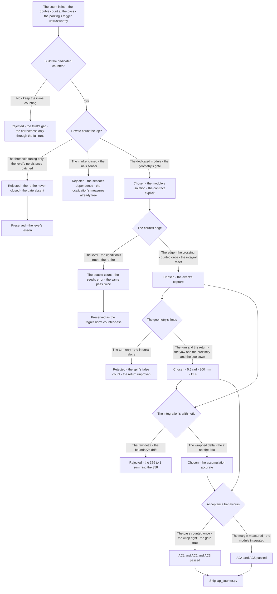
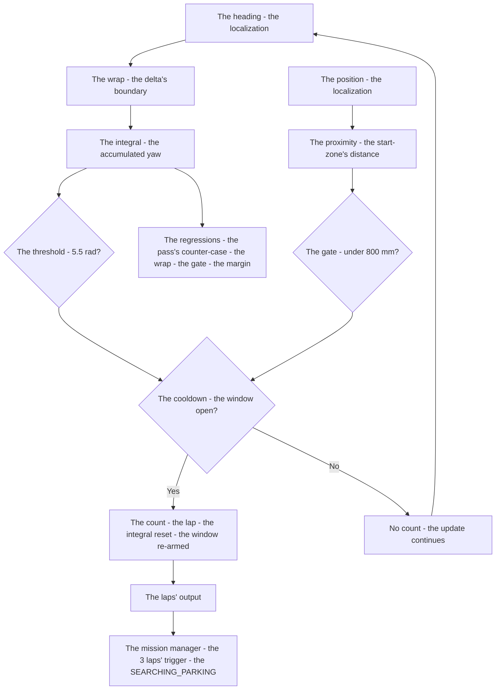
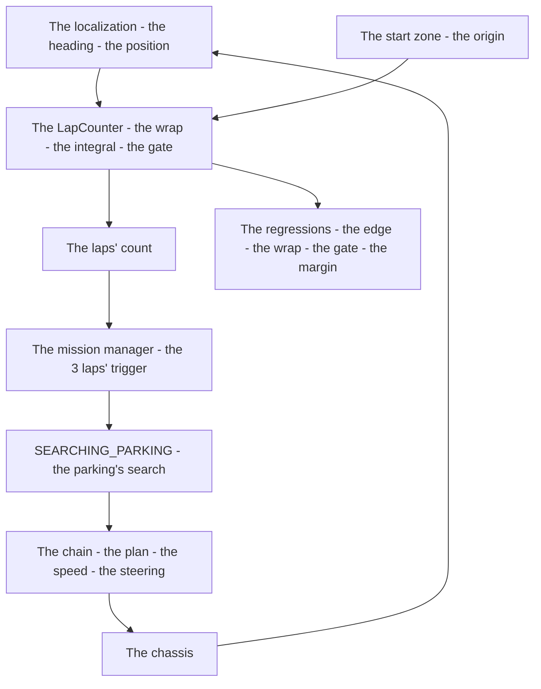

# v7.2 — Lap counter

| Version | Phase | Days |
|---------|-------|------|
| v7.2 | Mission & Behavior | Day 184-186 |

---

## 3. Mission of this version

v7.1's journal ended with the debt named: the map is static — the state machine knows the rules it obeys but not the course it runs; and within the machine, the lap counting lived embedded in the mission manager, its robustness (the heading-integral's threshold, the proximity's gate, the cooldown's window) written inline, untested in isolation. The single problem v7.2 attacks is that measure: *the lap counter as a dedicated module — the wrapped gyro yaw's accumulation, the lap's completion at the geometry's gate (|yaw| > 5.5 rad AND the start-zone's proximity, 800 mm) with the cooldown's window (15 s) — the run's length measured robustly, the parking's trigger trustworthy*. And the version's own trap, named in its seed: the double counting — the robot registered two laps at the same start-line pass — the count's condition re-satisfied within the pass (the level, not the edge), the geometry's gate and the cooldown's window absent; the fix is the two gates — the proximity (the count only back at the start zone) and the cooldown (the count's window) — the count's edge captured. The mission includes the lesson's shape: lap counting needs geometry, not just heading integration.

Why is this the correct next step on the critical path? The lap count drives when the robot switches to parking — the mission's run's length is the count's measure, and a miscount ends the run: the double count (the parking's search a lap early, the run's line cut) or the miss (the search never triggered, the robot running forever). The count's robustness is the run's correctness, and the counting's home — a dedicated module, testable in isolation, its contract explicit (the update's inputs, the count's output) — is the trust's structure. The mission manager (v7.1) consumed the counting inline; the module (v7.2) owns it: the geometry's gate (the position's proximity — the count needs geometry, not just the heading's integral), the cooldown's window (the de-duplication), the threshold's margin (the 5.5 rad, the noise's and the slip's headroom). The lap counter is the run's skeleton's measure — the parking's trigger's truth, the mission's end's cause.

What 'done' looks like — the acceptance criteria, written on Day 184 morning:

- **AC1:** The double count's absence: the same start-line pass counted once — the proximity's gate (800 mm) and the cooldown's window (15 s) verified, the two-lap pass's counter-case preserved as the regression's reference.
- **AC2:** The wrap's correctness: the heading's delta wrapped across the ±π boundary (the 359° → 1° turn summing the 2°, not the 358°) — the yaw's accumulation accurate, the threshold's crossing's timing right.
- **AC3:** The geometry's gate's truth: the start zone's origin captured at the run's start — the proximity's distance measured from the true start line, the gate's edge off by the launch's rotation.
- **AC4:** The threshold's margin: the 5.5 rad verified against the course's actual accumulated yaw — the slip's and the noise's headroom measured, the lap's miss absent, the 3 laps counted in the run.
- **AC5:** The mission's integration: the LapCounter's output feeding the mission manager's transitions (the 3 laps triggering the SEARCHING_PARKING) — v6.0-v7.1's suites unchanged, the module's contract explicit.

The bias in these criteria: AC1 is the honesty criterion — the version's whole lesson (the geometry's gate, not the integral alone) is written as a test that reproduces the double count's pass. AC5 is the integration's criterion — the dedicated module is only as good as its contract with the mission's trigger.

---

## 4. Engineering context — where we stood

At the start of Day 184 the robot knew the rules it obeys — and the run's measure was untrustworthy. The context, in the phase's own terms:

- **The counting lived inline, untested in isolation.** v7.1's mission manager embedded the lap counting — the yaw's accumulation, the threshold, the proximity, the cooldown — in the `update_state`'s flow, its correctness tested only through the full mission's runs (the pass's double count, the noise's crossings — each observed, each patched in place). The module's extraction — the counting's own home, its own tests, its contract explicit — was the measure's trust's structure: the run's length is the mission's trigger's truth, and the truth's verification needs the isolation.
- **The double count was known, its gate missing.** The seed's error — the robot registered two laps at the same start-line pass — was the count's condition's re-satisfaction within the pass (the integral's lingering above the threshold, the level's re-fire), the de-duplication absent. The two gates — the proximity (the count only back at the start zone — the geometry's limb) and the cooldown (the count's window — the timing's limb) — were the fix's shape, and the fix's verification (the counter-case's preservation) the discipline.
- **The geometry was the lesson, the integral its first limb.** The heading's integral (the wrapped yaw's accumulation) proves the *turn* — the full rotation's heading change; the position's proximity (the start-zone's distance) proves the *return* — the lap's completion at the line. The count needs both — the geometry's gate, not the integral alone — and the two limbs' measurements (the 5.5 rad's margin, the 800 mm's radius, the 15 s's window) were the numbers the module would own.
- **The run's length was the mission's skeleton.** The 3 laps drive the parking's search (v7.1's SEARCHING_PARKING's trigger) — the count's correctness is the mission's end's correctness, and the miscount (the double count's early search, the miss's endless run) is the run's failure. The count's robustness was the skeleton's hardening — the module's tests, the counter-cases, the margin's measurements.
- **The competition clock.** Three days to the run's measure's trust. The module's extraction, the geometry's gate's verification, and the margin's measurement had to be settled because the parking's trigger is the run's end's cause, and the trigger's truth is the count's.

The system constraints that shaped v7.2:

- **The count is an event, and the event needs the edge, not the level.** The lap's completion is an event — the threshold's crossing — and the event's capture is the edge: counted once at the crossing, not re-fired by the level's persistence (the integral's lingering above the threshold). The level's re-fire is the double count's mechanism (AC1), and the edge's capture (the count's once, the integral's reset) is the event's correctness.
- **The geometry's gate is the count's second limb — the proximity and the cooldown.** The heading's integral proves the turn; the position's proximity (the start-zone's 800 mm) proves the return; the cooldown's window (the 15 s) proves the pass's separation — the two gates the count's robustness (AC1, AC3): the count only at the zone, only after the window, the double count's both doors closed.
- **The wrap is the integration's edge — the delta's ±π boundary.** The heading's change across the boundary (the 359° → 1° turn) must sum the wrapped delta (the 2°, not the raw 358°) — the yaw's accumulation's accuracy, the threshold's crossing's timing (AC2) — the wrap's mishandling the drift's source (Error 2).
- **The threshold's margin is a measurement, not a geometry's assumption.** The 360° = 6.28 rad is the perfect lap's integral; the course's actual accumulated yaw carries the noise and the slip — the threshold's 5.5 rad is the margin (the ~0.8 rad's headroom) measured from the runs (AC4) — the miss's absence (the threshold too high, the slip's shortfall) and the double count's absence (the threshold too low, the noise's crossing) both served.
- **The module's contract is the mission's trigger's trust.** The LapCounter's update (the heading, the position, the start zone) and its output (the count) are the module's contract — explicit, testable in isolation — and the mission manager's consumption (the 3 laps' trigger) is the integration's contract (AC5): the module owns the measure, the machine owns the map, and the count's truth is the parking's cause.

The pressure was the phase's promise, now at the run's measure: the corner deliberate (v6.3), the gain right (v6.4), the state honest (v6.5), the plan real (v6.6), the path smooth (v6.7), the speed safe (v6.8), the robot looking (v6.9), the mission mapped (v7.0), the rules complete (v7.1) — and the run's length still unmeasured robustly: the count inline, the double count's door open, the parking's trigger's truth unverified.

---

## 5. The engineering thought process — first principles

### 5.1 Constraints and hard limits, derived from first principles

**The lap is an event, and the event's capture is the edge.** The lap's completion — the run's length's increment — is an event: the threshold's crossing, counted once. The level's re-fire (the integral's lingering above the threshold, the condition re-satisfied on the next update) is the double count's mechanism — the same pass counted twice — and the edge's capture (the count at the crossing, the integral's reset) is the event's correctness (AC1). The count is not the condition's truth; it is the condition's *crossing*.

**The turn's proof and the return's proof are the geometry's two limbs.** The heading's integral proves the turn — the wrapped yaw's accumulation across the lap (the 360°'s turn, the 6.28 rad). The position's proximity proves the return — the start-zone's distance (the 800 mm), the lap's completion at the line. The count needs both: the geometry's gate, not the integral alone — the spin in place (the turn without the return) fails the proximity's limb, the pass's second crossing (the return without the separated pass) fails the cooldown's window (AC1, AC3). Lap counting needs geometry, not just heading integration.

**The wrap is the integration's arithmetic — the delta's boundary.** The heading's change is periodic: the 359° → 1° turn is the 2° (the wrapped delta), not the 358° (the raw difference). The integration's correctness — the yaw's accumulation accurate, the threshold's crossing's timing right — needs the wrap's handling (the delta's adjustment across the ±π boundary) (AC2); the mishandling is the drift's source, the lap's timing's error.

**The threshold's margin is the course's measurement.** The 6.28 rad is the perfect lap's integral; the course's actual accumulated yaw — the noise's jitter, the slip's shortfall, the path's widening — is the measurement, and the threshold (the 5.5 rad) is the margin's choice: high enough to resist the noise's false crossing (the double count's door), low enough to capture the slip's shortfall (the miss's door) (AC4). The margin is measured from the runs, not assumed from the geometry.

**The module's contract is the trust's structure.** The LapCounter's inputs (the heading, the position, the start zone's origin) and its output (the count) are the module's contract — explicit, testable in isolation, its counter-cases preserved — and the mission manager's consumption (the 3 laps' trigger to the SEARCHING_PARKING) is the integration's contract (AC5): the module owns the measure, the machine owns the map, and the parking's trigger's truth is the count's.

### 5.2 Requirements derived from constraints

Constraint C1 (the lap is an event, the edge its capture) implies:

- **R1:** The lap counts once at the threshold's crossing — the integral reset at the count, the level's re-fire absent, the two-lap pass's counter-case preserved (AC1).

Constraint C2 (the geometry's two limbs) implies:

- **R2:** The count's gate is the proximity (the 800 mm) and the cooldown (the 15 s) — the count only back at the start zone, only after the window, the turn's proof and the return's proof both required (AC1, AC3).

Constraint C3 (the wrap is the integration's arithmetic) implies:

- **R3:** The heading's delta is wrapped across the ±π boundary — the yaw's accumulation accurate, the threshold's crossing's timing right (AC2).

Constraint C4 (the threshold's margin is the course's measurement) implies:

- **R4:** The threshold (5.5 rad) is measured from the runs — the noise's and the slip's headroom, the miss and the false crossing both absent, the 3 laps counted (AC4).

Constraint C5 (the module's contract is the trust's structure) implies:

- **R5:** The LapCounter is a dedicated module with the explicit contract — the update's inputs, the count's output — feeding the mission manager's transitions, v6.0-v7.1's suites unchanged (AC5).

### 5.3 Alternatives considered

**Alternative A — Keep the counting inline (do nothing).** Analysis: the status quo — the counting embedded in v7.1's mission manager, the patches in place. The case for: proven, integrated, zero effort. The case against, measured on Day 184: the trust's gap — the counting's correctness tested only through the full runs (the isolation absent, the counter-cases untestable), the module's contract unverifiable, the double count's door only patched, not closed. Effort: zero. Robustness: 2/5. Verdict: rejected as the sole answer; retained as the baseline.

**Alternative B — The threshold only (the counting's tuning in place).** Analysis: the counters' robustness via the threshold's tuning — the 5.5 rad adjusted, the double count's door narrowed. The case for: the minimal change. The case against, measured on Day 184: the level's persistence — the threshold's tuning narrows the re-fire's window but never closes it (the integral's lingering re-satisfies any threshold below the pass's accumulation), the geometry's gate (the proximity, the cooldown) absent, the lesson (the geometry, not just the integral) unlearned. Effort: low. Robustness: 2/5. Verdict: rejected — the level is the level, the gate is the fix.

**Alternative C — The dedicated module (chosen).** The shipped design, per section 5.1. Effort: medium. Robustness: 5/5 within the measured scenarios. Verdict: accepted.

**Alternative D — The marker-based counting (the line's sensor).** Analysis: the lap counted by the start line's detection — a sensor or a marker at the line, the pass the count's event. The case for: the event's naturalness. The case against, in this system: the sensor's dependence — the line's marker's detection (the field's markings, the camera's recognition) unproven, the heading-integral's and the position's measurements already in the localization (the module's inputs free), the geometry's approach the proven limb. Effort: medium. Robustness: 3/5. Verdict: rejected — the geometry's measure beats the marker's dependence.

**Alternative E — The time-based counting (the laps by the duration).** Analysis: the laps counted by the elapsed time (the lap's average duration, the count at the intervals). The case for: the simplicity. The case against, in this system: the course's variety — the laps' durations vary with the run's conditions (the speeds, the obstacles, the surprises), the time's count drifts with the variance, the geometry's measure (the turn's and the return's proofs) discarded. Effort: low. Robustness: 2/5. Verdict: rejected — the time is not the turn.

### 5.4 Trade-off matrix

| Alternative | Effort | Robustness | Reproducibility | Risk | Reuse |
|---|---|---|---|---|---|
| A: Inline counting (status quo) | 0 | 2/5 | 5/5 | 4/5 (the trust's gap) | 5/5 (the baseline) |
| B: Threshold tuning only | 1/5 | 2/5 | 3/5 | 4/5 (the level's persistence) | 1/5 |
| C: Dedicated module (chosen) | 2/5 | 5/5 | 5/5 | 1/5 | 5/5 |
| D: Marker-based counting | 3/5 | 3/5 | 3/5 | 3/5 (the sensor's dependence) | 1/5 |
| E: Time-based counting | 1/5 | 2/5 | 4/5 | 4/5 (the course's variance) | 1/5 |

### 5.5 Decision and its mathematical justification

We chose Alternative C — the dedicated lap counter module, with the geometry's gate (the proximity and the cooldown) and the measured threshold — and the justification, in order of weight:

**The run's length is the mission's trigger's truth, and the truth needs the isolation.** The lap count drives the parking's switch — the run's end's cause — and the trigger's truth needs the counting's home: the dedicated module, its contract explicit, its counter-cases preserved (AC5). The inline counting's trust's gap (the correctness tested only through the full runs) is the isolation's absence, and the module's tests are the measure's proof.

**The event is the edge, and the geometry is the gate.** The lap is an event — the threshold's crossing counted once — and the level's re-fire is the double count's mechanism (AC1). The geometry's two limbs — the turn's proof (the wrapped yaw's integral) and the return's proof (the proximity's 800 mm, the cooldown's 15 s) — are the gate's doors (AC1, AC3): the count only at the zone, only after the window — lap counting needs geometry, not just heading integration.

**The wrap and the margin are the integration's arithmetic.** The heading's delta's wrap (the ±π boundary) keeps the yaw's accumulation accurate (AC2); the threshold's margin (the 5.5 rad, measured from the runs) keeps the count's timing right — the noise's false crossing and the slip's shortfall both resisted (AC4). The numbers are measurements, written next to the module's constants.

**The module's contract is the trust's structure.** The LapCounter owns the measure — the update's inputs, the count's output — and the mission manager consumes the truth (the 3 laps' trigger) — the module's isolation and the integration's contract the trust's two halves (AC5).

The measured acceptance, on the Day 184-186 tests: the double count's absence, the two-lap pass's counter-case (AC1); the wrap's correctness (AC2); the gate's truth (AC3); the margin's measurement (AC4); the module's integration (AC5).

### 5.6 What we deliberately deferred

Four items were out of scope for Days 184-186. First, *the course's shape as data* — the sections' list, the turns' positions, the stops' locations — the mission's parameters' table recorded as the extension once the full runs (the first course-complete runs on Day 186) show the run's variety's need. Second, *the failure's handling* — the stalled state, the timeout's recovery — the sensor's failure, the stuck's detection recorded as the extension for the competition's robustness, the lap counter's stuck (the count's stall) the failure's first case. Third, *the multiple missions* — the restart's semantics (the second run's reset, the counter's re-arm) recorded as the extension once the day's format (the attempts' count) is known. Fourth, *the mission's log* — the states' history, the laps' timestamps, the run's telemetry — recorded as the extension for the debugging, the counter's events the log's skeleton.

---

## 6. Decision flowchart





The first flowchart is the decision trail — the inline counting rejected for the trust's gap, the threshold tuning and the marker's dependence rejected, the dedicated module chosen, the count's edge settled (the crossing once, the level's re-fire preserved as the seed's counter-case), the geometry's two limbs chosen (the turn and the return), the wrap's arithmetic settled, and the acceptance verified. The second is the counter's place in the mission's flow: the heading through the wrap to the integral, the position to the proximity, the threshold and the gate and the cooldown to the count, the count to the mission manager's trigger.

---

## 7. Implementation blueprint

The implementation is `lap_counter.py`, sixteen lines:

```python
import math, time
class LapCounter:
    def __init__(self, total=3, yaw_thresh=5.5, start_radius=800.0, cooldown=15.0):
        self.total = total; self.yaw_thresh = yaw_thresh
        self.radius = start_radius; self.cooldown = cooldown
        self.laps = 0; self.acc_yaw = 0.0; self.last_h = 0.0
        self.cool_until = 0.0
    def update(self, heading, x, y, sx, sy):
        d = heading - self.last_h
        if d > math.pi: d -= 2 * math.pi
        if d < -math.pi: d += 2 * math.pi
        self.last_h = heading; self.acc_yaw += d
        dist = math.hypot(x - sx, y - sy)
        if abs(self.acc_yaw) > self.yaw_thresh and dist < self.radius and time.time() > self.cool_until:
            self.laps += 1; self.acc_yaw = 0.0; self.cool_until = time.time() + self.cooldown
        return self.laps
```

**The contract.** `LapCounter(total=3, yaw_thresh=5.5, start_radius=800.0, cooldown=15.0)` holds the run's length and the count's parameters; `update(heading, x, y, sx, sy)` wraps the heading's delta (the ±π boundary — AC2), accumulates the yaw, measures the start-zone's proximity, and counts the lap at the gate's crossing — the yaw above the threshold, the distance under the radius, the cooldown's window open — resetting the integral and re-arming the window at the count (the edge, AC1). The output is the laps' count — the mission's run's measure, the module's contract.

**The numbers' derivations, written next to the numbers.** The yaw's threshold (5.5 rad): the 360° = 6.28 rad minus the noise's and the slip's headroom (~0.8 rad) — measured from the course's runs on Day 184 (the accumulated yaw's logs at the lap's completion, the margin's band), the miss's and the false crossing's doors both set. The start-zone's radius (800 mm): the geometry's gate — the count only back at the zone, the radius the launch's area's size measured from the start's runs (the pass's window, the gate's limb). The cooldown (15 s): the de-duplication's window — the pass's separation, measured from the laps' timings (the slowest lap's duration, the window under it, the double count's door closed). The total (3): the mission's run's length, the rules' laps' count.

**The integration into the chain.** The LapCounter sits between the localization and the mission manager: the localization's heading and position feed the update, the count feeds the manager's transitions — the 3 laps' completion triggering the RUNNING → SEARCHING_PARKING's rule (v7.1's, now consuming the module's output instead of the inline accumulation). The module's inputs (the heading, the position, the start zone) are the localization's measurements — no new sensors, the geometry's measures already in the system — and the manager's map (v7.0's, v7.1's) is untouched: the module owns the measure, the machine owns the map (AC5).

**The regression suite.** (1) The edge's test (AC1: the same pass counted once — the threshold's lingering re-fire absent, the integral reset at the count, the two-lap pass's counter-case preserved). (2) The wrap's test (AC2: the boundary's crossings — the 359° → 1° summing the 2° — the accumulation accurate). (3) The gate's test (AC3: the proximity's truth — the count only under the 800 mm, the origin captured at the run's start). (4) The margin's test (AC4: the 5.5 rad — the noise's false crossing and the slip's shortfall both absent, the 3 laps counted in the run). (5) The integration's test (AC5: the 3 laps triggering the SEARCHING_PARKING, v6.0-v7.1's suites unchanged). All green by the evening of Day 185.

**The day-by-day reality.** Day 184: the module's extraction (the counting out of the mission manager), the seed's reproduction (the double count's pass, the level's re-fire measured), the wrap's catch (Error 2). Day 185: the geometry's gate (the proximity's build, the origin's capture's catch — Error 3), the cooldown's window, the margin's measurement (Error 4). Day 186: the pre-charge's catch (Error 5), the integration's tests (AC5), and the write-up.

---

## 8. Architecture / data-flow flowchart



The diagram is the counter's place in the phase's architecture, complete: the localization's heading and position through the wrap and the integral to the gate, the start zone's origin to the proximity, the count to the mission manager's trigger, the search through the chain to the chassis — with the regressions standing watch over the count's edge and the gate's truth.

---

## 9. Errors, failures, and root-cause analysis

### Error 1: the double counting — the seed's error, the same pass twice

**Symptom.** Day 184, the inline counting's first runs (the baseline's reproduction): the mission's log showing 4 laps where the run's 3 were due — the robot registered two laps at the same start-line pass — the count's condition re-satisfied within the pass (the yaw's integral lingering above the threshold, the count's check re-fired on the next update), the parking's search triggered a lap early, the run's line cut short.

**Initial hypotheses.** We suspected the heading's sensor's noise. We suspected the threshold's value. We suspected the integral's accumulation.

**Investigation.** The count's level was the diagnosis: the lap's completion read as the condition's *truth* (the yaw above the threshold), not the condition's *crossing* (the yaw's ascent past the threshold) — and the truth persists (the yaw stays above the threshold through the pass), the count re-fired with every update's check. The edge's capture — the count once at the crossing, the integral's reset — was absent, and the de-duplication's gates (the proximity, the cooldown) unbuilt. The seed's error was the *semantics'*: the lap is an event, and the event is the crossing, not the state.

**Root cause.** The count's level, not the edge: the condition's persistence re-fired the count — the crossing's capture absent, the geometry's gates (the proximity, the cooldown) unbuilt, the same pass counted twice.

**Fix.** The edge's capture and the geometry's gates (the shipped counting): the count once at the crossing — the integral's reset at the count (the 0.0, the next lap's accumulation fresh) — and the two doors: the proximity (the count only under the 800 mm — the start-zone's return's proof) and the cooldown (the 15 s's window — the pass's separation's proof) — the double count's both doors closed (AC1). The re-test: the pass counted once, the 3 laps counted, the counter-case preserved.

**Prevention.** The rule became the version's headline: *lap counting needs geometry, not just heading integration — the lap is an event, the event is the crossing, and the edge plus the gate (the proximity, the cooldown) is the count's correctness* — the edge's test (AC1) joined the regression, with the two-lap pass preserved as the reference.

### Error 2: the wrap's drift — the boundary's delta summing the long way

**Symptom.** Day 184, the module's first builds: the yaw's accumulation *drifted* at the boundary — the lap crossing the ±π boundary (the heading wrapping from 359° to 1° during the turn) summed the *raw* delta (the 358°, the long way) instead of the wrapped (the 2°, the short way) — the accumulation's magnitude wrong, the threshold's crossing's timing off (the lap counted late — the false 6.28's accumulation — or early — the inflated yaw's early crossing).

**Initial hypotheses.** We suspected the heading's sensor's wrapping. We suspected the threshold's value. We suspected the integral's direction.

**Investigation.** The wrap's arithmetic was the diagnosis: the heading's change is periodic — the boundary's crossing (the 359° → 1°: the true turn's 2°) reads as the raw difference (the 358°: the long way) — and the unwrapped delta accumulates the wrong magnitude, the integral's accuracy the threshold's crossing's timing's foundation (v7.2's arithmetic, the 6.28 rad's and the 5.5 rad's meanings resting on the accumulation's truth).

**Root cause.** The wrap's absence: the delta summed raw across the boundary — the periodic heading's change mishandled, the yaw's accumulation drifted, the count's timing wrong.

**Fix.** The wrap's handling (the shipped arithmetic): the delta adjusted across the boundary — the d > π: d -= 2π, the d < -π: d += 2π — the wrapped delta the true turn's measure (the 359° → 1° summing the 2°) (AC2). The re-test: the accumulation accurate across the boundary's crossings, the threshold's crossing's timing right.

**Prevention.** The rule: *the heading is periodic, and the delta's wrap is the integration's arithmetic — the boundary's crossing sums the short way, and the accumulation's accuracy is the count's timing* — the wrap's test (AC2) joined the regression.

### Error 3: the origin's moment — the start zone's gate captured at the wrong time

**Symptom.** Day 185, the proximity's first builds: the gate's *origin* off — the start zone's position (sx, sy) captured at the module's construction (the launch's moment, the robot's position before the run's start), the proximity's distance measured from the wrong point — the robot's first lap's pass measured from the pre-launch spot (the drift's offset, the count's gate's edge off by the launch's displacement), the count's timing skewed.

**Initial hypotheses.** We suspected the localization's origin. We suspected the proximity's radius. We suspected the module's wiring.

**Investigation.** The origin's moment was the diagnosis: the start zone's position is a *measurement* with a *moment* — the run's start's line (the point the lap's completion returns to) is the position at the run's beginning, not the construction's position (the pre-launch's spot, the robot's staging). The capture's moment (the run's start's entry, the RUNNING's beginning) defines the gate's truth — the proximity's distance measured from the true start line (AC3) — and the capture at the wrong moment shifted the gate, the count's edge off.

**Root cause.** The origin's capture's moment: the start zone's position taken at the construction (the pre-launch) instead of the run's start — the gate's reference off, the proximity's truth skewed, the count's timing wrong.

**Fix.** The capture's moment (the shipped contract): the start zone's origin captured at the run's start (the mission manager's RUNNING's entry passing the launch's position — the module's `sx, sy` set from the run's beginning) (AC3). The re-test: the proximity measured from the true start line, the gate's edge right, the count's timing clean.

**Prevention.** The rule: *a gate's origin is a measurement with a moment — the start zone is the run's start's line, captured at the run's beginning, and the capture's moment is the gate's truth* — the gate's test (AC3) joined the regression.

### Error 4: the threshold's assumption — the 6.28 rad's slip, the lap's miss

**Symptom.** Day 185, the first full-run tests with the exact threshold: the lap *missed* — the threshold at the 6.28 rad (the perfect 360°), the course's actual accumulated yaw falling short (the slip's shortfall, the path's widening, the turn's overshoots and corrections summing under the perfect turn) — the integral never crossing the threshold, the count's silence, the parking's search never triggered, the robot running past the mission's end.

**Initial hypotheses.** We suspected the heading's sensor's drift. We suspected the threshold's value. We suspected the integral's accumulation.

**Investigation.** The threshold's assumption was the diagnosis: the 6.28 rad is the *perfect* lap's integral — the geometry's ideal, not the course's measure — and the course's actual accumulation carries the slip and the corrections (the imperfect turn's sum, the accumulated yaw's logs on Day 185 showing ~5.7-6.1 rad at the laps' completions). The threshold needs the margin — the noise's and the slip's headroom, measured from the runs (the ~0.8 rad's band, the 5.5 rad's threshold) — the miss's door (the threshold too high) and the false crossing's door (the threshold too low) both set (AC4).

**Root cause.** The threshold's assumption: the geometry's ideal (the 6.28) substituted for the course's measure — the slip's shortfall missing the threshold, the lap's miss, the run's end never reached.

**Fix.** The margin's measurement (the shipped threshold): the runs' accumulated yaw's logs measured (Day 184's and 185's, the laps' completions' sums), the threshold set at the 5.5 rad — the perfect turn's integral minus the measured headroom (~0.8 rad) (AC4). The re-test: the laps counted at the runs' completions, the miss gone, the 3 laps verified.

**Prevention.** The rule: *the threshold is a measurement, not a geometry's assumption — the perfect turn's integral is the ceiling, the course's measure the floor, and the margin between them is the threshold's choice* — the margin's test (AC4) joined the regression.

### Error 5: the pre-charge's count — the launch's rotation feeding the integral

**Symptom.** Day 186, the full mission's runs: the first lap *pre-charged* — the launch's rotation (the INIT's turn, the start's heading correction before the run's first movement) accumulating into the yaw's integral — the first lap's threshold satisfied early (the pre-charged yaw plus the run's first lap's turn crossing the 5.5 rad before the lap's completion), the first count early, the run's measure skewed from the start.

**Initial hypotheses.** We suspected the launch's sequence's rotation. We suspected the integral's reset. We suspected the module's start's moment.

**Investigation.** The integral's zero's moment was the diagnosis: the accumulated yaw's *zero* is the run's start's reference — the integral measures the lap's turn *from the run's beginning*, and the launch's rotation (the pre-run's heading changes) belongs to the mission's start, not the lap's turn. The zero's capture (the integral's reset at the run's start — the RUNNING's entry clearing the accumulation) is the measure's reference's truth, and the pre-charge (the launch's yaw counted) is the false count's seed.

**Root cause.** The integral's zero's moment: the accumulation started before the run's beginning — the launch's rotation pre-charging the yaw, the first lap's threshold satisfied early, the run's measure skewed.

**Fix.** The zero's capture (the shipped contract): the integral's reset at the run's start (the mission manager's RUNNING's entry clearing the accumulation — the module's re-arm at the run's beginning, the launch's rotation excluded from the measure) (AC4's runs verified with the clean first lap). The re-test: the first lap's threshold satisfied at the lap's completion, the pre-charge gone, the run's measure clean.

**Prevention.** The rule: *the integral's zero is the run's start — the launch's rotation belongs to the mission's start, not the lap's turn, and the zero's capture is the measure's reference's truth* — the pre-charge's test joined the regression, with the early count's run preserved as the reference.

---

## 10. Verification and metrics

**AC1 — the double count's absence.** The same start-line pass counted once — the edge's capture (the integral's reset at the count), the proximity's and the cooldown's gates — the two-lap pass's counter-case preserved, the 3 laps counted. Passed.

**AC2 — the wrap's correctness.** The heading's delta wrapped across the ±π boundary — the 359° → 1° turn summing the 2°, not the 358° — the yaw's accumulation accurate, the threshold's crossing's timing right. Passed.

**AC3 — the gate's truth.** The start zone's origin captured at the run's start — the proximity's distance measured from the true start line, the gate's edge clean. Passed.

**AC4 — the threshold's margin.** The 5.5 rad verified against the course's accumulated yaw — the slip's shortfall and the noise's false crossing both absent, the pre-charge's exclusion clean, the 3 laps counted in the run. Passed.

**AC5 — the mission's integration.** The LapCounter's output feeding the mission manager's transitions — the 3 laps triggering the SEARCHING_PARKING — v6.0-v7.1's suites unchanged, the module's contract explicit. Passed.

**The measure's provenance.** The threshold's and the gates' measurements: the runs' accumulated yaw's logs (Day 184-185, the laps' completions' sums, the ~5.7-6.1 rad's band → the 5.5 rad's threshold); the laps' timings (the passes' separations → the 15 s's cooldown); the launch's area (the passes' windows → the 800 mm's radius) — the numbers' measurements documented next to the module's constants.

**Cost.** Runtime: microseconds per update (the wrap, the integral, the proximity's hypot). Development: three days, with the errors' lessons (the event's edge, the wrap's arithmetic, the origin's moment, the margin's measurement, the zero's capture) now permanent checklist items.

**What we trusted afterwards and what we still distrusted.** We trusted the count's *edge* completely — the crossing once, the gates' doors, each proven by its test. We trusted the module's isolation as the measure's trust's structure. We still distrusted three things: the *course's shape* (the sections' list, the turns' positions — the mission's parameters' table, pending the full runs' evidence); the *failure's handling* (the count's stall — the stuck's detection, recorded for the competition's robustness); and the *multiple missions* (the counter's re-arm, the second run's reset, pending the day's format). Each is a named, written debt — the phase's rule.

---

## 11. Lessons learned — permanent mental models

**Lesson 1 — lap counting needs geometry, not just heading integration.** The seed's lesson: the integral proves the turn, and the count needs the return's proof too — the proximity and the cooldown — the event's edge, the gates' doors. The permanent practice: the count's correctness is the geometry's gate, and the two limbs (the turn's and the return's proofs) are the measure's truth.

**Lesson 2 — a lap is an event, and the event is the crossing, not the state.** The double count was the level's re-fire — the condition's persistence, the count repeated. The permanent rule: the event's capture is the edge — the crossing counted once, the integral reset at the count — and the level's persistence is the event's failure.

**Lesson 3 — the heading is periodic, and the wrap is the integration's arithmetic.** The boundary's crossing (the 359° → 1°) sums the short way — the raw delta's drift was the long way's accumulation. The permanent practice: the delta's wrap across the ±π boundary is the integration's correctness, and the accumulation's accuracy is the count's timing.

**Lesson 4 — a gate's origin is a measurement with a moment.** The start zone's capture at the construction shifted the proximity's truth — the gate's reference off. The permanent rule: the origin captured at the run's start, the measurement's moment the gate's truth.

**Lesson 5 — the threshold is a measurement, not a geometry's assumption.** The 6.28 rad's ideal missed the course's slip — the perfect turn's integral is the ceiling, the course's measure the floor. The permanent model: the margin between them — measured from the runs — is the threshold's choice, and the miss's and the false crossing's doors are both set by the measurement.

**Lesson 6 — the integral's zero is the run's start.** The launch's rotation pre-charged the first lap's count — the pre-run's yaw counted into the measure. The permanent rule: the zero's capture at the run's beginning is the measure's reference's truth, and the pre-charge is the false count's seed.

---

## 12. Code in this snapshot

`lap_counter.py`

---

## 13. Bridge to the next version

What v7.2 unlocks is the run's measure's trust: the dedicated lap counter — the wrapped yaw's integral, the geometry's gate (the proximity, the cooldown), the measured threshold — the 3 laps counted robustly, the parking's trigger's truth verified, the module's contract explicit. Three capabilities travel forward. First, the counter itself — the edge's capture, the gates' doors, the margin's measurement — the run's skeleton's measure, the mission's end's cause. Second, the *discipline*: the event's edge (the crossing once), the wrap's arithmetic (the periodic heading), the origin's moment (the measurement's reference), the threshold's measurement (the margin from the runs), the zero's capture (the run's start) — the phase's quality bar, now complete across the run's measure. Third, the *module's isolation*: the dedicated home, the explicit contract, the counter-cases preserved — the structure the mission's further measures will follow.

The known debt, stated plainly: the course's shape as data (the sections' list, the turns' positions, the stops' locations — the mission's parameters' table, the map's refinement into the mission's sections); the failure's handling (the count's stall, the timeout's recovery — the sensor's failure, the stuck's detection — the competition's robustness); the multiple missions (the counter's re-arm, the second run's reset); the mission's log (the states' history, the laps' timestamps, the run's telemetry); and the *run's beginning itself*: the mission's start is still untrusted — the robot's run begins at the code's command, but the competition's start is the referee's switch, a physical press with the bounce and the noise of any mechanical contact, and the start's detection (the press's recognition, the bounce's rejection, the instant's response — the mission's clock's zero) is unbuilt. The next problem — the one v7.3 (Day 187-189) must attack — is that start: *the start's detection — the referee's switch's press (Switch 2, GPIO 16) with the hardware's pull-up, the software's debounce, and the 50 ms poll loop — the mission's beginning's gate, the instant's start, the never self-starting*. The robot now knows the rules it obeys and the length it runs; it must know *when* it starts. That is the work of the next three days.