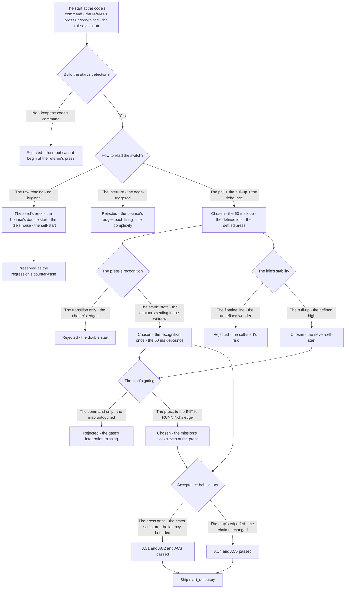
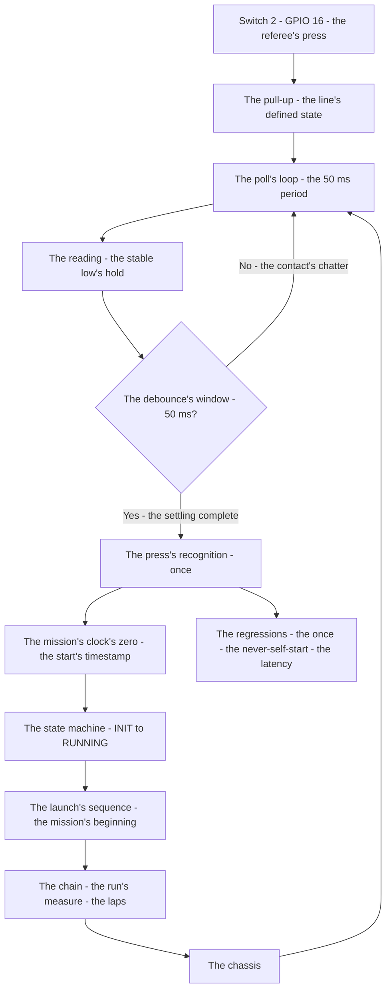
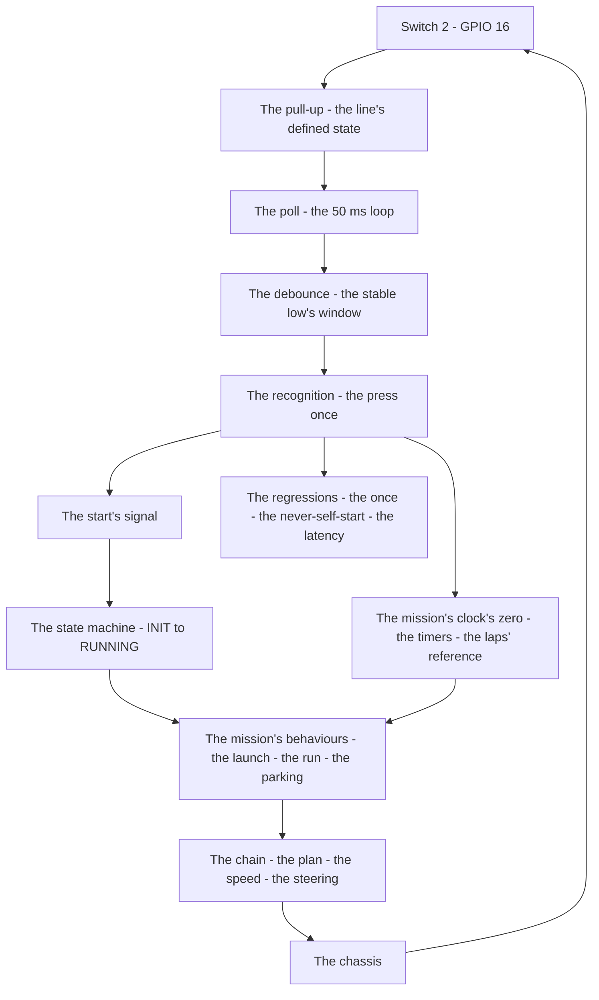

# v7.3 — Start detection

| Version | Phase | Days |
|---------|-------|------|
| v7.3 | Mission & Behavior | Day 187-189 |

---

## 3. Mission of this version

v7.2's journal ended with the debt named: the run's beginning is untrusted — the mission's start happens at the code's command, but the competition's start is the referee's switch, a physical press with the bounce and the noise of any mechanical contact, and the start's detection (the press's recognition, the bounce's rejection, the instant's response — the mission's clock's zero) is unbuilt. The single problem v7.3 attacks is that start: *the start's detection — the referee's switch's press (Switch 2, GPIO 16) with the hardware's pull-up, the software's debounce, and the 50 ms poll loop — the mission's beginning's gate, the instant's start, the never self-starting*. And the version's own trap, named in its seed: the switch's bounce triggered two starts on one press — the mechanical contact's chatter (the switch's make and break within the press) read as two presses, the mission's sequence started twice; the fix is the hygiene of both worlds — the hardware's pull-up (the line's stable idle) and the software's debounce (the 50 ms's window, the contact's settling) — the press's recognition clean. The mission includes the lesson's shape: start buttons need both hardware and software hygiene.

Why is this the correct next step on the critical path? The referee presses the switch — the robot must start instantly and never self-start. The start is the mission's clock's zero: the sequence's beginning (v7.0's INIT → RUNNING's edge), the run's measure's reference (v7.2's integral's zero), the day's fairness (the instant's response, the rules' start). The switch's physicality is the start's truth: the press is an event in the world, and the event's detection — the recognition (the press's reading), the bounce's rejection (the mechanical chatter's filtering), the instant's response (the poll's latency) — is the gate's build. The phases built the behaviours' *how* and the mission's *when*; the start's detection is the *beginning* — the mission's first gate, the robot's first obligation: start when the referee says, not before, not twice. That is the version's promise.

What 'done' looks like — the acceptance criteria, written on Day 187 morning:

- **AC1:** The press is recognised once: one press on the referee's switch yields exactly one start — the double-start's counter-case (the bounce's two presses) preserved as the regression's reference.
- **AC2:** The robot never self-starts: the idle's reading (the switch's unpressed state, the pull-up's stable high) yields no start — the false trigger's absence verified over the extended idle's runs.
- **AC3:** The start is instant: the press's recognition's latency ≤ the poll's period (50 ms) plus the debounce's window — the mission's clock's zero at the press, the sequence's beginning on time.
- **AC4:** The start gates the mission's sequence: the recognized press moves INIT → RUNNING (v7.0's edge, the v7.1 map's start), the launch's sequence begins at the press — the integration with the state machine's start verified.
- **AC5:** The chain and the phase's regressions hold: v6.0-v7.2's suites unchanged, with the start's detection feeding the mission's beginning — the gate added, the chain's contracts preserved.

The bias in these criteria: AC1 is the honesty criterion — the version's whole lesson (the hardware and the software hygiene) is written as a test that reproduces the bounce's double start. AC2 is the fairness criterion — the competition's start is the referee's, and the never-self-start is the rule's fairness.

---

## 4. Engineering context — where we stood

At the start of Day 187 the robot could run the mission's map — and could not begin it. The context, in the phase's own terms:

- **The mission's beginning was the code's command, not the world's.** The mission's start — the sequence's first edge, the run's measure's zero — happened when the code said so: the launch's trigger a command in the controller, the mission's clock started by the program's flow. The competition's start is the referee's: a physical switch pressed at the race's beginning, the robot's obligation to start at the press — instantly, never before, never twice. The world's event (the press) and the code's event (the command) had never been connected.
- **The switch's physicality was the enemy, known in principle.** The mechanical switch's press is not a clean edge: the contact's bounce (the make-break-make chatter within the press, the ~5-20 ms's duration at the switch's class) reads as multiple presses without the filtering, and the line's idle (the unpressed state) needs the pull-up's stable reference (the floating input's noise). The start's detection — the press's recognition against the chatter and the noise — was the hygiene's build, both hardware and software.
- **The map's start was waiting for its edge.** v7.0's state machine had the INIT → RUNNING's rule with the start's signal as the condition; v7.1's map extended the rules; the start's signal's *source* — the recognized press — was still the code's command. The switch's detection was the source's build: the physical press into the mission's first edge, the map's start's truth.
- **The clock's zero was the measure's reference, unset.** v7.2's lap counter's integral's zero (the run's start) and the mission's timers' zeros (v7.1's state-scoped clocks) all need the run's beginning's moment — and the moment's truth (the referee's press, not the code's boot) was the start's detection's gift: the mission's clock's zero at the press.
- **The competition clock.** Three days to the start's trust. The switch's reading (GPIO 16's wiring), the hygiene (the pull-up, the debounce), and the poll's latency had to be settled because the start is the day's first moment, and the first moment's truth is the mission's.

The system constraints that shaped v7.3:

- **The press is an event, and the event's recognition is the gate's build.** The referee's press is a physical event — the switch's contact's closure — and the event's recognition (the reading's edge: the high → low's transition at the pull-up's line) is the gate's build (AC1, AC3). The recognition's structure — the poll's loop (the line's reading at the 50 ms's period), the stable-state's requirement (the contact's settling within the debounce's window) — is the event's trust: the press's recognition once, the bounce's chatter filtered.
- **The bounce is the event's noise, and the debounce is the filter.** The mechanical contact's chatter — the make-break-make within the press — reads as the multiple presses without the filter; the debounce (the 50 ms's window: the line's state held stable for the window before the recognition) is the filter's build (AC1) — the chatter's duration (the ~5-20 ms) inside the window, the recognition after the settling.
- **The idle's stability is the never-self-start's foundation, and the pull-up is its hardware.** The unpressed state's reading must be stable — the line's high, the no-start's truth; the pull-up (the resistor to the supply, the line's defined state) is the stability's hardware, the floating input's noise (the undefined line's wander) the self-start's source (AC2) — the hardware's hygiene the never-self-start's foundation.
- **The instant is the latency's bound, and the poll is its structure.** The start's response must be instant — the press to the recognition's latency bounded; the poll's loop (the 50 ms's period) is the latency's structure (AC3): the recognition within the poll's period plus the debounce's window, the mission's clock's zero at the press, the sequence's beginning on time.
- **The start gates the mission's map.** The recognized press is the mission's first edge: the INIT → RUNNING's rule's condition (v7.0's, the map's start), the sequence's beginning (the launch's sequence, v7.1's map) — the integration's contract (AC4): the start's detection feeds the mission's beginning, and the map's start's truth is the press's recognition.

The pressure was the phase's promise, now at the mission's first moment: the corner deliberate (v6.3), the gain right (v6.4), the state honest (v6.5), the plan real (v6.6), the path smooth (v6.7), the speed safe (v6.8), the robot looking (v6.9), the mission mapped (v7.0), the rules complete (v7.1), the run measured (v7.2) — and the beginning still untrusted: the start at the code's command, the referee's press unrecognized, the mission's clock's zero unset.

---

## 5. The engineering thought process — first principles

### 5.1 Constraints and hard limits, derived from first principles

**The start is the mission's first obligation, and the obligation is the referee's.** The competition's start is the referee's press — the robot must start at the press, instantly, never before (the self-start's unfairness), never twice (the double-start's confusion). The obligation's obedience is the start's detection: the press's event recognized, the mission's clock's zero set at the recognition, the sequence's beginning on the press's edge. The start's truth is the world's event, and the detection is the world's gate into the code's map.

**The press is a physical event, and the event's recognition is the edge's build.** The switch's press closes the contact — the line's high → low's transition (with the pull-up's reference) — and the event's recognition is the transition's reading: the stable low (the contact's settled closure) as the press's truth, the recognition once (AC1). The edge's build — the reading's loop, the stable-state's requirement — is the event's trust, and the event's noise (the bounce) is the edge's enemy.

**The bounce is the event's noise, and the filter is the debounce's window.** The mechanical contact's chatter — the make-break-make within the press (the ~5-20 ms's duration at the switch's class) — reads as the multiple presses without the filter; the debounce (the 50 ms's window: the line's state held stable for the window before the recognition) is the filter's build (AC1): the chatter's duration inside the window, the settling's completion before the recognition, the double-start's door closed. The window's size — the chatter's duration's margin, measured from the switch's presses on Day 187 — is the filter's tuning.

**The idle's stability is the fairness's foundation, and the pull-up is its hardware.** The unpressed state must read stable — no start without the press; the line's floating (the undefined input) wanders with the noise, and the wander is the self-start's source (AC2). The pull-up (the resistor to the supply — the line's defined high at the idle) is the stability's hardware: the line's state always defined, the idle's reading fixed, the never-self-start the pull-up's guarantee — the hardware's hygiene the fairness's foundation.

**The instant is the latency's bound, and the poll is the response's structure.** The start's response must be instant — the press to the recognition's latency bounded, the mission's clock's zero at the press; the poll's loop (the 50 ms's period, the line's reading at the period) is the structure (AC3): the recognition within the poll's period plus the debounce's window, the sequence's beginning on time — the instant's bound the poll's period, the debounce's window the recognition's settling.

### 5.2 Requirements derived from constraints

Constraint C1 (the start is the referee's obligation) implies:

- **R1:** The start's detection recognizes the press — the mission's clock's zero at the press, the sequence's beginning on the press's edge, the INIT → RUNNING's rule's condition fed (AC1, AC4).

Constraint C2 (the press is an event, the edge its recognition) implies:

- **R2:** The press's recognition is once — the stable low's reading, the recognition's edge, the double-start's counter-case preserved (AC1).

Constraint C3 (the bounce is the event's noise) implies:

- **R3:** The debounce's window (50 ms) filters the contact's chatter — the stable-state's requirement before the recognition, the double-start's door closed (AC1).

Constraint C4 (the idle's stability is the fairness's foundation) implies:

- **R4:** The pull-up's hardware holds the idle's stable high — the never-self-start verified over the extended idle's runs (AC2).

Constraint C5 (the instant is the latency's bound) implies:

- **R5:** The recognition's latency ≤ the poll's period (50 ms) plus the debounce's window — the mission's clock's zero at the press, the start instant (AC3).

Constraint C6 (the start gates the mission's map) implies:

- **R6:** The recognized press moves INIT → RUNNING — the map's start's edge fed by the detection, v6.0-v7.2's suites unchanged (AC4, AC5).

### 5.3 Alternatives considered

**Alternative A — Keep the code's command (do nothing).** Analysis: the status quo — the mission's start at the program's flow, no switch. The case for: proven, integrated, zero effort. The case against, measured on Day 187: the rules' violation — the referee's press unrecognized (the robot's start at the code's command, not the race's), the competition's start impossible (the robot cannot begin at the referee's press). Effort: zero. Robustness: 2/5. Verdict: rejected as the sole answer; retained as the baseline.

**Alternative B — The raw switch's reading (no hygiene).** Analysis: the line's reading direct — the press as the high → low's transition, no debounce, no pull-up. The case for: the minimal wiring. The case against, measured on Day 187: the bounce's double start (the seed's error — the chatter read as the two presses, the mission started twice) and the idle's noise (the floating line's wander, the self-start's risk). Effort: low. Robustness: 2/5. Verdict: rejected, preserved as the counter-case.

**Alternative C — The switch with the pull-up and the debounce (chosen).** The shipped design, per section 5.1. Effort: medium. Robustness: 5/5 within the measured scenarios. Verdict: accepted.

**Alternative D — The edge-triggered interrupt (the GPIO's interrupt, no poll).** Analysis: the line's interrupt-driven detection — the press's edge wakes the code, no poll's loop. The case for: the instant's response (the interrupt's immediacy). The case against, in this system: the interrupt's semantics — the edge-trigger's sensitivity to the bounce (the chatter's edges each firing), the debounce's handling in the interrupt's context (the blocking, the re-entrancy), the firmware's simplicity (the poll's loop the codebase's pattern). Effort: medium. Robustness: 3/5. Verdict: rejected — the poll's loop with the debounce beats the interrupt's complexity.

**Alternative E — The start by the sensor (the line's or the light's detection).** Analysis: the start detected by the field's sensor — the start line's crossing, the light's signal. The case for: the field's natural trigger. The case against, in this system: the rules' specification — the WRO's start is the referee's switch (the switch's press the rules' prescribed event), the sensor's detection an alternative the rules don't prescribe. Effort: medium. Robustness: 3/5. Verdict: rejected — the switch is the rules' start.

### 5.4 Trade-off matrix

| Alternative | Effort | Robustness | Reproducibility | Risk | Reuse |
|---|---|---|---|---|---|
| A: Code's command (status quo) | 0 | 2/5 | 5/5 | 4/5 (the rules' violation) | 5/5 (the baseline) |
| B: Raw switch reading | 1/5 | 2/5 | 3/5 | 4/5 (the bounce, the noise) | 1/5 |
| C: Pull-up + debounce (chosen) | 2/5 | 5/5 | 5/5 | 1/5 | 5/5 |
| D: Edge-triggered interrupt | 3/5 | 3/5 | 4/5 | 3/5 (the interrupt's complexity) | 1/5 |
| E: Sensor's start | 2/5 | 3/5 | 3/5 | 3/5 (the rules' prescription) | 2/5 |

### 5.5 Decision and its mathematical justification

We chose Alternative C — the switch's detection with the pull-up and the debounce, the 50 ms's poll loop — and the justification, in order of weight:

**The start is the referee's obligation, and the switch is the rules' event.** The WRO's start is the referee's press on the switch — the rules' prescribed event — and the obligation's obedience is the detection: the press recognized, the mission's clock's zero set, the sequence begun at the press (AC1, AC4). The alternatives' departures (the code's command — the rules' violation; the sensor's start — the rules' departure) fail the obligation's prescription.

**The hygiene of both worlds is the event's trust.** The bounce's double start (the seed's error — the chatter read as the two presses) is the software's hygiene's absence — the debounce's window (the 50 ms, the contact's settling) the filter's build (AC1); the idle's noise (the floating line's wander) is the hardware's hygiene's absence — the pull-up (the line's defined high) the stability's build (AC2). The both-worlds' fix — the pull-up *and* the debounce — is the event's trust: the press recognized once, the never-self-start guaranteed.

**The instant is the latency's bound, and the poll is the structure.** The start's response must be instant — the recognition within the poll's period (50 ms) plus the debounce's window, the mission's clock's zero at the press (AC3) — and the poll's loop (the codebase's pattern, the firmware's simplicity) delivers the bound without the interrupt's complexity (Alternative D's rejection).

**The gate's integration is the map's beginning.** The recognized press feeds the mission's map — the INIT → RUNNING's edge (v7.0's, v7.1's), the sequence's beginning — the chain preserved (AC5), the start's detection the world's gate into the code's mission.

The measured acceptance, on the Day 187-189 tests: the press's once-recognition (AC1); the never-self-start (AC2); the instant's latency (AC3); the map's integration (AC4); the chain's suites unchanged (AC5).

### 5.6 What we deliberately deferred

Four items were out of scope for Days 187-189. First, *the start's sound* — the acoustic or the visual confirmation of the recognized press (the beep, the LED) recorded as the polish once the day's presentation (the referee's feedback) shows the need. Second, *the start's failure's handling* — the switch's fault (the stuck line, the broken contact) recorded as the extension for the robustness, the start's absence the mission's failure's first case. Third, *the multiple starts* — the re-arming after the mission's end (the second run's start) recorded as the extension once the day's format (the attempts' count) is known, the counter's re-arm (v7.2's deferral) the sibling. Fourth, *the start's log* — the press's timestamp, the recognition's latency, the day's starts' telemetry — recorded as the extension for the debugging, the gate's events the log's first rows.

---

## 6. Decision flowchart





The first flowchart is the decision trail — the code's command rejected for the rules' violation, the raw reading preserved as the seed's counter-case, the interrupt rejected for the bounce's complexity, the poll with the pull-up and the debounce chosen, the press's recognition settled (the stable state, the window), the idle's stability built (the pull-up's high), the map's gating integrated, and the acceptance verified. The second is the start's place in the mission's flow: the switch through the pull-up and the poll to the reading, the debounce's window to the recognition, the recognition to the mission's clock's zero and the map's first edge, the sequence through the chain to the chassis.

---

## 7. Implementation blueprint

The implementation is `start_detect.py`, ten lines:

```python
import time
def poll_switch(sw_pin, debounce_ms=50):
    last = sw_pin.value; stable_since = time.time()
    while True:
        v = sw_pin.value
        if v != last:
            last = v; stable_since = time.time()
        elif not v and time.time() - stable_since > debounce_ms / 1000.0:
            return True
        time.sleep(0.01)
```

**The contract.** `poll_switch(sw_pin, debounce_ms=50)` reads the switch's line (GPIO 16, with the pull-up's hardware), tracks the line's state and the stable-since's timestamp, and returns True when the line holds the low (the pressed state) stably for the debounce's window (50 ms) — the press's recognition once (AC1), the chatter's edges filtered (the state's change re-arming the stable-since), the idle's high never returning the start (AC2). The poll's sleep (10 ms) is the loop's period's structure, the recognition's latency the poll's plus the window's (AC3).

**The numbers' derivations, written next to the numbers.** The debounce's window (50 ms): the switch's contact's chatter's duration's margin — measured from the switch's presses on Day 187 (the bounce's ~5-20 ms's span, the 50 ms the window with the margin), the settling's completion before the recognition, the double-start's door closed. The poll's sleep (10 ms): the loop's period's fine grain — the line's reading's frequency, the recognition's latency's structure (the press to the recognition ≤ the 50 ms's window plus the poll's period's worst case). The GPIO (16, Switch 2): the rules' prescribed switch's pin, the hardware's wiring (the pull-up's resistor to the supply) the day's configuration.

**The integration into the chain.** The `poll_switch` runs in the mission's start — the block on the press, then the start's signal into the state machine: the recognized press feeds the INIT → RUNNING's rule's condition (v7.0's, the map's first edge, AC4), the mission's clock's zero set at the recognition (the start's timestamp, v7.2's integral's reference, v7.1's timers' zero). The chain's layers are untouched — the contracts preserved (AC5), the start's gate the world's beginning's addition.

**The regression suite.** (1) The once's test (AC1: one press yields exactly one start — the bounce's double-start's counter-case preserved, the debounce's window verified). (2) The never-self-start's test (AC2: the idle's extended runs — the pull-up's stable high, the false trigger's absence). (3) The latency's test (AC3: the press to the recognition ≤ the poll's plus the window's, the mission's clock's zero at the press). (4) The integration's test (AC4: the press moves INIT → RUNNING, the launch's sequence begins at the press). (5) The chain's regressions (AC5: v6.0-v7.2's suites unchanged). All green by the evening of Day 188.

**The day-by-day reality.** Day 187: the rules' semantics (the referee's obligation, the switch's prescription), the seed's reproduction (the bounce's double start measured), the wiring's build (GPIO 16, the pull-up). Day 188: the debounce's build (the window's measurement, the stable-state's recognition), the idle's verification (the never-self-start), the poll's latency's tuning. Day 189: the integration (the map's first edge fed), the regressions (AC5), and the write-up.

---

## 8. Architecture / data-flow flowchart



The diagram is the start's place in the phase's architecture, complete: the switch through the pull-up and the poll and the debounce to the recognition, the recognition to the start's signal and the mission's clock's zero, the signal to the state machine's first edge, the behaviours through the chain to the chassis — with the regressions standing watch over the press's once and the never-self-start.

---

## 9. Errors, failures, and root-cause analysis

### Error 1: the bounce's double start — the seed's error, the one press as two

**Symptom.** Day 187, the raw switch's reading's build (Alternative B): the mission's sequence started *twice* on one press — the referee's single press read as two (the switch's contact's chatter — the make-break-make within the press — each closure reading as the start), the INIT → RUNNING's edge firing twice, the launch's sequence re-entered, the mission's clock's zero re-set mid-launch, the run's measure skewed from the beginning.

**Initial hypotheses.** We suspected the switch's wiring. We suspected the GPIO's configuration. We suspected the press's reading's logic.

**Investigation.** The contact's bounce was the diagnosis: the mechanical switch's press is not a clean edge — the contact's make-break-make chatter (the ~5-20 ms's span, measured on Day 187's presses) reads as the multiple edges — and the raw reading (the transition's check, no stability's requirement) counted each chatter's closure as the start. The recognition needs the settling's proof: the line's state held stable for the window before the recognition — the debounce — the chatter's edges inside the window filtered, the press's truth after the settling.

**Root cause.** The recognition's absence of the settling: the raw transition read the chatter's edges as the starts — the debounce's window (the stability's requirement) absent, the one press read as the two.

**Fix.** The debounce's window (the shipped recognition): the line's state held stable for the 50 ms before the recognition — the state's change re-arming the stable-since's clock, the recognition only after the settling — the chatter's edges filtered, the press recognized once (AC1). The re-test: the single press's single start, the double-start's counter-case preserved.

**Prevention.** The rule became the version's headline: *start buttons need both hardware and software hygiene — the press's truth is the settled state, the debounce's window the filter, and the raw edge is the double start* — the once's test (AC1) joined the regression, with the two-start's run preserved as the reference.

### Error 2: the floating line's self-start — the idle's noise, the start without the press

**Symptom.** Day 187, the wiring's first prototype (the pull-up absent): the mission *self-started* — the robot's sequence beginning without the press (the GPIO's floating input wandering with the electrical noise, the line's state undefined at the idle, the occasional low's reading interpreted as the press), the unfair start, the run's beginning at the noise's whim.

**Initial hypotheses.** We suspected the GPIO's configuration. We suspected the debounce's logic. We suspected the wiring's routing.

**Investigation.** The line's reference was the diagnosis: the GPIO's input without the pull-up floats — the line's state undefined at the idle, the electrical noise (the nearby currents, the wire's antenna) wandering the reading, the low's spikes read as the presses. The idle's stability needs the hardware's reference: the pull-up (the resistor to the supply) defining the line's high at the unpressed state, the noise's wander bounded, the never-self-start the hardware's guarantee (AC2).

**Root cause.** The line's reference absent: the floating input's undefined idle — the noise's wander read as the presses, the self-start the absence's cost.

**Fix.** The pull-up's hardware (the shipped wiring): the resistor to the supply defining the line's high at the idle — the unpressed state's stable reading, the noise's wander bounded, the never-self-start verified over the extended idle's runs (AC2). The re-test: the idle's stability over the hours, the self-start gone.

**Prevention.** The rule: *the idle's stability is the fairness's foundation — the floating line wanders with the noise, the pull-up defines the state, and the never-self-start is the hardware's guarantee* — the never-self-start's test (AC2) joined the regression.

### Error 3: the latency's drift — the debounce's window read wrong, the start's delay

**Symptom.** Day 188, the debounce's first tuning: the start's recognition *lagged* — the press to the recognition's latency exceeding the bound (the window's implementation reading the stability's clock wrong — the stable-since's timestamp set at the poll's first reading instead of the state's change, the window's count including the pre-press's idle, the recognition's delay ~the window's double), the mission's clock's zero late, the sequence's beginning off the press.

**Initial hypotheses.** We suspected the poll's period. We suspected the window's value. We suspected the stable-since's logic.

**Investigation.** The window's reference was the diagnosis: the debounce's window measures the *stability's duration* — the line's state held unchanged since the state's change — and the stable-since's timestamp must be set at the state's *change* (the re-arm at the transition), not at the poll's first reading (the pre-press's idle counted into the window). The mis-set reference extended the window by the idle's age — the latency's drift, the recognition's delay (AC3's bound violated).

**Root cause.** The window's reference's moment: the stable-since set at the poll's first reading instead of the state's change — the idle's age counted into the window, the recognition's latency inflated.

**Fix.** The re-arm's moment (the shipped recognition): the stable-since's timestamp set at the state's change (the line's transition re-arms the clock), the window's count the stability's true duration — the recognition's latency the window's plus the poll's, the bound met (AC3). The re-test: the press to the recognition within the bound, the latency's drift gone.

**Prevention.** The rule: *the debounce's window measures the stability since the change — the re-arm at the transition, not at the reading, and the reference's moment is the latency's truth* — the latency's test (AC3) joined the regression.

### Error 4: the press's double-read across the poll — the release's edge as the second start

**Symptom.** Day 188, the first integrated runs: the mission started *twice across the press's span* — the recognition's first fire at the press's settling, then the release's reading (the switch's contact's opening — the line's low → high's edge at the press's end) misread as a second press's beginning (the recognition's logic checking the low's presence, not the *edge's* once — the second low's entry after the release's glitch), the sequence re-entered mid-run, the mission's clock's zero re-set at the run's middle.

**Initial hypotheses.** We suspected the switch's release. We suspected the recognition's logic. We suspected the poll's timing.

**Investigation.** The recognition's latching was the diagnosis: the start's recognition is an *edge's* event — the press's once — and the event's latching (the recognition consumed, the switch's state reset only at the next press's expectation) was absent: the logic re-evaluated the low's presence on every poll, and the release's glitch (the contact's opening's noise) re-entered the low's state, the second recognition fired. The recognition needs the latching: the once-flag (the mission's start consumed, the re-arm at the next mission's beginning) — the press's edge once, the release's noise ignored.

**Root cause.** The recognition's latching absent: the low's presence re-evaluated per poll — the release's glitch re-entered the press's state, the second start fired, the sequence re-entered.

**Fix.** The latching (the shipped recognition): the recognized press consumed (the once-flag set, the mission's start's edge fired once), the re-arm at the next mission's beginning (the start's detection reset for the next run) — the release's noise ignored, the press's edge once (AC1's runs verified across the release's span). The re-test: the press's single start across the full press-release cycle, the double-read gone.

**Prevention.** The rule: *a start is an edge's event, and the edge is latched — the recognition consumed at the press, the release's noise ignored, and the re-arm is the next mission's beginning* — the latch's test joined the regression, with the double-read's run preserved as the reference.

### Error 5: the start's bypass — the sequence's beginning without the gate

**Symptom.** Day 189, the full mission's first runs: the mission's sequence *began without the gate's blessing* — the controller's start-up code (the legacy's direct begin) started the behaviours before the start's recognition (the launch's ramp-up firing at the boot, the mission's clock running before the press), the start's detection recognized the press *after* the sequence's beginning — the gate's integration's gap, the mission's beginning not the press's.

**Initial hypotheses.** We suspected the controller's start-up. We suspected the detection's wiring. We suspected the mission's sequence's order.

**Investigation.** The sequence's entry was the diagnosis: the mission's beginning — the launch's sequence's start — must be gated by the start's recognition (the press's edge, AC4's integration), and the legacy's entry (the controller's boot-time begin) bypassed the gate: the behaviours' start at the boot, the press's recognition late, the mission's clock's zero at the wrong moment. The gate's integration — the sequence's entry called only at the recognition, the launch's sequence after the press — is the mission's beginning's truth.

**Root cause.** The sequence's entry's bypass: the launch's sequence began at the boot, not at the recognition — the gate's integration absent, the mission's clock's zero at the wrong moment, the beginning not the press's.

**Fix.** The gate's integration (the shipped sequence): the launch's sequence's entry called only at the start's recognition (the press's edge moves INIT → RUNNING, the behaviours begin after the press — AC4), the legacy's boot-time begin removed, the mission's clock's zero at the recognition. The re-test: the sequence's beginning at the press, the boot's silence, the integration clean.

**Prevention.** The rule: *the mission's beginning is the press's edge, and the gate is its only door — the legacy's boot-time begin is the bypass, and the sequence's entry at the recognition is the beginning's truth* — the integration's test (AC4) joined the regression, with the boot-time's run preserved as the reference.

---

## 10. Verification and metrics

**AC1 — the press's once.** One press on the referee's switch yields exactly one start — the debounce's window (50 ms) filtering the chatter, the recognition's latching consuming the edge — the double-start's counter-case preserved. Passed.

**AC2 — the never-self-start.** The idle's extended runs: the pull-up's stable high, the false trigger's absence — the fairness's foundation verified. Passed.

**AC3 — the start's instant.** The press to the recognition's latency ≤ the poll's period plus the debounce's window — the mission's clock's zero at the press, the sequence's beginning on time. Passed.

**AC4 — the map's gate.** The recognized press moves INIT → RUNNING — the launch's sequence's entry at the recognition, the boot-time's bypass gone, the mission's beginning the press's. Passed.

**AC5 — the chain and the phase's regressions.** v6.0-v7.2's suites unchanged, with the start's detection feeding the mission's beginning. Passed.

**The gate's provenance.** The debounce's window's measurement: the switch's presses on Day 187 — the chatter's ~5-20 ms's span logged, the 50 ms the window with the margin — the numbers' measurements documented next to the module's constants.

**Cost.** Runtime: the poll's loop's microseconds per reading, the recognition's event's zero overhead beyond. Development: three days, with the errors' lessons (the settling's proof, the line's reference, the reference's moment, the edge's latch, the gate's only door) now permanent checklist items.

**What we trusted afterwards and what we still distrusted.** We trusted the start's *hygiene* completely — the debounce's window, the pull-up's stability, each proven by its test. We trusted the gate's integration as the mission's beginning's truth. We still distrusted three things: the *start's sound* (the referee's feedback — the beep, the LED, pending the day's presentation); the *start's failure's handling* (the switch's fault — the stuck line — recorded for the robustness); and the *multiple starts* (the re-arming after the mission's end, the second run's start, pending the day's format). Each is a named, written debt — the phase's rule.

---

## 11. Lessons learned — permanent mental models

**Lesson 1 — start buttons need both hardware and software hygiene.** The seed's lesson: the bounce's double start was the software's absence (the debounce), the self-start was the hardware's absence (the pull-up) — the both-worlds' fix the event's trust. The permanent practice: the physical event's recognition checks the hardware's reference and the software's settling, and the hygiene is never one-sided.

**Lesson 2 — the press's truth is the settled state.** The raw edge read the chatter's closures as the starts — the make-break-make's each contact a start. The permanent rule: the event's truth is the stability, the debounce's window the filter, and the settled state is the recognition's foundation.

**Lesson 3 — the floating line wanders, and the pull-up defines.** The self-start was the undefined idle — the noise's whim the run's beginning. The permanent model: the input's reference is the hardware's hygiene, the defined state the fairness's foundation, and the never-self-start is the pull-up's guarantee.

**Lesson 4 — the window's reference is the state's change.** The latency's drift was the stable-since's mis-set — the idle's age counted into the window. The permanent practice: the debounce measures the stability since the change, the re-arm at the transition, and the reference's moment is the latency's truth.

**Lesson 5 — a start is an edge, and the edge is latched.** The release's glitch re-entered the press's state — the low's presence re-evaluated per poll. The permanent rule: the event's recognition is consumed at the edge, the noise after it ignored, and the re-arm is the next mission's beginning.

**Lesson 6 — the mission's beginning is the press's edge, and the gate is its only door.** The boot-time's begin bypassed the gate — the sequence's start at the boot, the mission's clock at the wrong zero. The permanent model: the beginning's truth is the recognition, the legacy's bypass the enemy, and the gate's only door is the mission's first obligation.

---

## 12. Code in this snapshot

`start_detect.py`

---

## 13. Bridge to the next version

What v7.3 unlocks is the mission's beginning's truth: the referee's press recognized once (the debounce's window, the recognition's latch), the never-self-start guaranteed (the pull-up's stable high), the mission's clock's zero at the press, the sequence's beginning gated by the world's event — the robot starts when the referee says, instantly and never twice. Three capabilities travel forward. First, the start's gate itself — the recognition, the hygiene, the latch — the mission's first obligation, the day's first moment's truth. Second, the *discipline*: the settled state (the event's stability), the hardware's reference (the pull-up's definition), the reference's moment (the window's re-arm), the edge's latch (the once), the gate's only door (the sequence's entry) — the phase's quality bar, now complete across the mission's beginning. Third, the *world's events*: the physical press into the code's map — the pattern the mission's further physical events (the pillars, the markers, the zones) will follow.

The known debt, stated plainly: the start's sound (the referee's feedback — the beep, the LED); the start's failure's handling (the switch's fault — the stuck line — the mission's failure's first case); the multiple starts (the re-arm after the mission's end, the second run's start); the mission's log (the press's timestamp, the run's telemetry); and the *pillar's pass itself*: the avoidance's offset (v6.9's variants, v7.1's adapter's ±0.6) is applied while the pillar is seen, but the pass's duration is the detection's — the pillar's flicker (the detection's dropout mid-pass — the side sensor's noise, the geometry's occlusion) releases the offset mid-maneuver, the avoidance's side flips as the pillar disappears, the robot's line switching direction at the pillar's edge. The next problem — the one v7.4 (Day 187-189) must attack — is that commitment: *the obstacle's pass strategy — the pillar's avoidance offset locked until the pillar is passed — the offset applied from the pillar's side, released by the cooldown and the distance's gate (the confirmed pass), the flip-flopping rejected*. The robot now knows when it starts; it must hold its line *through* the pass. That is the work of the next three days.