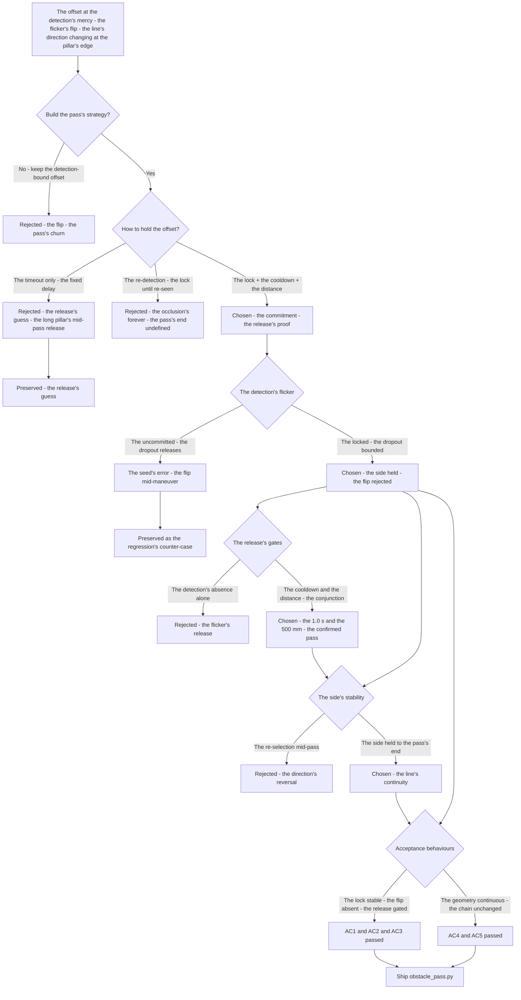
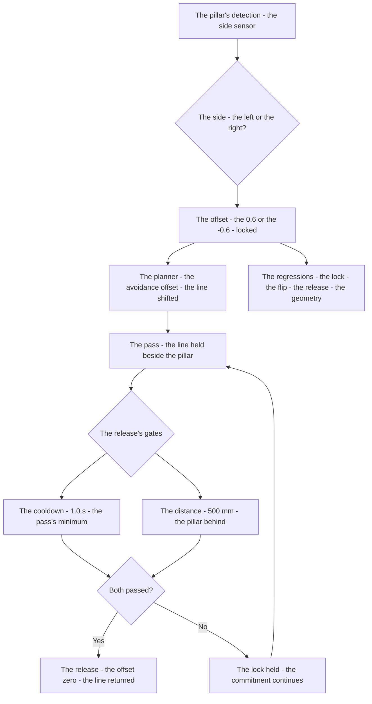
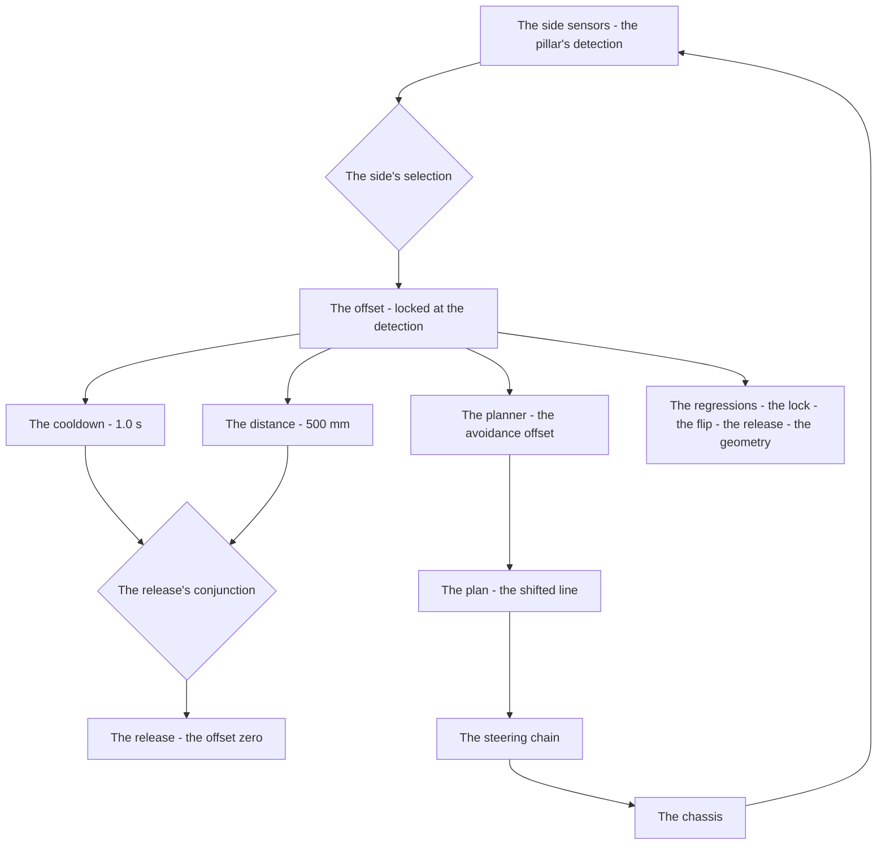

# v7.4 — Obstacle pass strategy

| Version | Phase | Days |
|---------|-------|------|
| v7.4 | Mission & Behavior | Day 187-189 |

---

## 3. Mission of this version

v7.3's journal ended with the debt named: the pillar's pass is uncommitted — the avoidance's offset (v6.9's variants, v7.1's adapter's ±0.6) is applied while the pillar is seen, but the pass's duration is the detection's: the pillar's flicker (the detection's dropout mid-pass — the side sensor's noise, the geometry's occlusion) releases the offset mid-maneuver, the avoidance's side flips as the pillar disappears, the robot's line switching direction at the pillar's edge. The single problem v7.4 attacks is that commitment: *the obstacle's pass strategy — the pillar's avoidance offset locked until the pillar is passed — the offset applied from the pillar's side (the ±0.6, the left or the right), released by the cooldown and the distance's gate (the confirmed pass), the flip-flopping rejected*. And the version's own trap, named in its seed: the robot changed the avoidance side mid-maneuver when the detection flickered — the pillar's reading dropped out (the side sensor's noise, the occlusion), the lock's absence let the offset reset, the line's direction flipped at the pillar's edge; the fix is the commitment — the chosen offset locked until the pillar is confirmed passed (the cooldown's window plus the distance's gate). The mission includes the lesson's shape: once committed, stay committed — flip-flopping is worse than wrong.

Why is this the correct next step on the critical path? The pillar's pass is the obstacle's avoidance's execution: the line's shift (v6.9's variants), the side's selection (v7.1's adapter), the pass's geometry — and the execution's stability is the commitment: the offset applied for the pass's duration, not the detection's. The detection's flicker is the physical truth (the sensor's noise, the geometry's occlusion — the pillar hidden as the robot passes), and the commitment — the lock until the confirmed pass (the cooldown's window, the distance's gate) — is the stability's structure. The phases built the avoidance's *decisions*; the pass strategy builds the avoidance's *execution* — the line held through the pillar, the side stable to the pass's end, the flip-flop rejected. The pillar's pass is the obstacle's class's reward (v6.9's), and the reward's collection is the pass's stability — the version's promise.

What 'done' looks like — the acceptance criteria, written on Day 187 morning:

- **AC1:** The offset is locked at the pillar's detection: the pillar's side (the left or the right) applies the ±0.6 once, the lock held — the offset's stability through the pass's approach verified.
- **AC2:** The flip's absence: the detection's flicker (the dropout mid-pass, the noise's crossings) does not change the offset — the mid-maneuver's flip's counter-case preserved as the regression's reference.
- **AC3:** The release is gated by the confirmed pass: the offset released only when the cooldown's window has passed and the distance has cleared the gate (the 500 mm) — the premature release's absence verified.
- **AC4:** The pass completes with the side stable: the line's shift held through the pillar's geometry, the robot's line continuous to the pass's end — the pass's runs' geometry verified.
- **AC5:** The chain and the phase's regressions hold: v6.0-v7.3's suites unchanged, with the pass strategy feeding the planner's avoidance_offset — the commitment added, the chain's contracts preserved.

The bias in these criteria: AC2 is the honesty criterion — the version's whole lesson (the commitment beats the flip) is written as a test that reproduces the flicker's mid-maneuver flip. AC3 is the release's criterion — the pass's end must be confirmed, not assumed, and the gates' truth is the release's correctness.

---

## 4. Engineering context — where we stood

At the start of Day 187 the robot started when the referee said — and could not hold its line past a pillar. The context, in the phase's own terms:

- **The avoidance's decisions existed; the execution was uncommitted.** The avoidance's line — v6.9's variants (the left, the centre, the right), v7.1's adapter's side (the ±0.6) — was decided at the detection, and the decision's *duration* was the detection's: the offset applied while the pillar was seen, released when the reading dropped. The execution's stability — the offset held through the pass, the side stable to the pass's end — was unbuilt, and the pass's geometry (the line's shift's continuity) unverified.
- **The flicker was known, its cost the flip.** The side sensor's reading of the pillar is not continuous: the noise's dropouts, the geometry's occlusions (the pillar hidden as the robot passes, the sensor's angle's loss) — the detection's flicker was the physical truth, and the uncommitted offset (the release at the dropout) the flip's cost: the line's direction switching at the pillar's edge, the pass's geometry the churn.
- **The release's gate was unbuilt.** The pass's end — the confirmed passing of the pillar — needs the gate: the cooldown's window (the time after the detection's loss, the pass's duration's minimum) and the distance's clearance (the pillar behind the robot, the 500 mm's gate) — the release's confirmation, not the detection's absence alone.
- **The chain's slot was open, waiting.** The planner's avoidance_offset (v6.6's slot, v6.9's variants, v7.1's adapter) was the pass strategy's output's destination — the offset's source now the commitment's structure (the lock, the release's gates), the chain's contract unchanged.
- **The competition clock.** Three days to the pillar's pass's stability. The commitment's structure (the lock, the cooldown, the distance's gate), the flip's counter-case, and the pass's runs' geometry had to be settled because the pillar's pass is the obstacle's class's reward, and the reward's collection is the pass's stability.

The system constraints that shaped v7.4:

- **The pass is a commitment, and the commitment is the offset's lock.** The pillar's pass is a period — the approach, the side, the release — and the period's stability is the commitment: the offset applied at the detection, locked through the pass, released at the confirmed end (AC1) — the detection's flicker's effect bounded by the lock, the flip's class (AC2) the commitment's absence.
- **The release is the pass's end's confirmation, not the detection's absence.** The offset's release needs the pass's end's proof: the cooldown's window (the time after the detection's loss — the pass's duration's minimum, the flicker's window excluded) and the distance's clearance (the pillar behind the robot — the 500 mm's gate, the geometry's confirmation) (AC3) — the premature release (the dropout's release) the flip's door, the gates' conjunction the release's truth.
- **The side is the adapter's choice, held to the pass's end.** The pillar's side (the left or the right — v7.1's adapter's mapping, the surprise's config's gate) selects the offset's sign (±0.6) at the detection, and the choice is held through the pass (AC1, AC4) — the side's flip (the mid-pass's re-selection) the pass's geometry's churn, the held choice the line's continuity.
- **The chain's slot is the strategy's destination, the contract preserved.** The pass strategy's output — the committed offset — feeds the planner's avoidance_offset (v6.6's slot, the chain's open slot), the chain's contracts (the planner's, the trajectory's, the avoidance's lines) untouched (AC5) — the commitment's structure the slot's new source, the chain's orders preserved.

The pressure was the phase's promise, now at the pass's execution: the corner deliberate (v6.3), the gain right (v6.4), the state honest (v6.5), the plan real (v6.6), the path smooth (v6.7), the speed safe (v6.8), the robot looking (v6.9), the mission mapped (v7.0), the rules complete (v7.1), the run measured (v7.2), the start trusted (v7.3) — and the pillar's pass still uncommitted: the offset at the detection's mercy, the line's direction flipping at the pillar's edge.

---

## 5. The engineering thought process — first principles

### 5.1 Constraints and hard limits, derived from first principles

**The pass is the avoidance's execution, and the execution is a period.** The pillar's pass is not a moment — it is a period: the approach (the offset applied, the line shifting), the side (the line held beside the pillar), the release (the line returning after the pass). The period's correctness — the line's continuity through the geometry — is the execution's product, and the period's stability is the commitment: the offset's state held for the pass's duration, not the detection's (AC1, AC4). The execution's failure — the offset's flip mid-period — is the pass's churn, the line's discontinuity at the pillar's edge.

**The detection's flicker is the physical truth, and the lock is the commitment's structure.** The pillar's detection is not continuous: the side sensor's noise, the geometry's occlusions (the pillar hidden as the robot passes) — the flicker is the measurement's truth, and the uncommitted offset (the release at the dropout) is the flip's mechanism (AC2). The lock — the offset's state held until the confirmed release — bounds the flicker's effect: the dropout does not change the committed line, the side stable through the pass. Once committed, stay committed — flip-flopping is worse than wrong.

**The release is the pass's end's proof, and the proof is the gates' conjunction.** The offset's release must be the pass's end's confirmation: the cooldown's window (the time after the detection's loss — the pass's duration's minimum, the flicker's window excluded — the 1.0 s) *and* the distance's clearance (the pillar behind the robot — the 500 mm's gate, the geometry's confirmation) (AC3) — the conjunction's requirement: the dropout alone (the flicker's window) does not release, the distance's proof the geometry's end. The premature release (the release at the dropout) is the flip's second door, and the gates' conjunction the release's truth.

**The side is the day's choice, held to the pass's end.** The pillar's side — the left or the right — is the adapter's mapping's choice (v7.1's, the surprise's config's gate at the launch), and the choice selects the offset's sign (±0.6) at the detection, held through the pass (AC1, AC4). The side's re-selection mid-pass (the flicker's re-reading, the re-mapping) is the pass's churn — the held choice the line's continuity, the pass's geometry's stability.

### 5.2 Requirements derived from constraints

Constraint C1 (the pass is a period, the execution its product) implies:

- **R1:** The offset is applied at the pillar's detection and held through the pass — the line's continuity to the pass's end, the approach's and the side's stability (AC1, AC4).

Constraint C2 (the flicker is the physical truth, the lock the structure) implies:

- **R2:** The offset is locked at the detection — the dropout mid-pass does not change the committed line, the mid-maneuver's flip's counter-case preserved (AC2).

Constraint C3 (the release is the pass's end's proof) implies:

- **R3:** The release requires the cooldown's window and the distance's clearance — the 1.0 s and the 500 mm's gates, the premature release's absence (AC3).

Constraint C4 (the side is the day's choice, held) implies:

- **R4:** The side's selection at the detection is held to the pass's end — the re-selection's churn absent, the line's direction stable (AC4).

Constraint C5 (the chain's slot is the destination) implies:

- **R5:** The committed offset feeds the planner's avoidance_offset — v6.0-v7.3's suites unchanged, the chain's contracts preserved (AC5).

### 5.3 Alternatives considered

**Alternative A — Keep the detection-bound offset (do nothing).** Analysis: the status quo — the offset applied while the pillar is seen, released at the dropout. The case for: proven, integrated, zero effort. The case against, measured on Day 187: the flip — the detection's flicker releasing the offset mid-maneuver, the line's direction changing at the pillar's edge (the seed's error's reproduction), the pass's geometry the churn. Effort: zero. Robustness: 2/5. Verdict: rejected as the sole answer; retained as the baseline.

**Alternative B — The timeout only (the release after the fixed delay).** Analysis: the offset held for the fixed duration after the detection, then released — the timeout alone. The case for: the lock's minimal form. The case against, measured on Day 187: the release's blindness — the timeout's release before the pass's end (the long pillar's geometry, the offset released mid-pass) or after (the line held past the pass's end, the return delayed) — the distance's proof (the geometry's confirmation) absent, the release's timing the guess. Effort: low. Robustness: 3/5. Verdict: rejected — the release needs the geometry, not the guess.

**Alternative C — The locked offset with the cooldown and the distance's gate (chosen).** The shipped design, per section 5.1. Effort: medium. Robustness: 5/5 within the measured scenarios. Verdict: accepted.

**Alternative D — The re-detection (the lock until the pillar re-seen).** Analysis: the offset held until the pillar's detection returns — the re-seeing the pass's end. The case for: the sensor's own confirmation. The case against, in this system: the geometry's absence — the pillar's occlusion (the hidden pillar) may never re-see, the offset held forever, the pass's end undefined; the distance's and the cooldown's gates (the geometry's and the time's proofs) discarded. Effort: low. Robustness: 2/5. Verdict: rejected — the re-seeing is not guaranteed.

**Alternative E — The offset's smooth blend (the return ramped, no lock).** Analysis: the offset blended back over the time — the release's ramp, the flip softened. The case for: the continuity's smoothness. The case against, in this system: the direction's change — the ramp softens the flip's rate but not the direction's reversal (the side's flip mid-pass still the line's wrong side), the commitment's absence (the offset's direction changing) the error's class (the lesson: the flip is worse than the wrong-but-consistent). Effort: medium. Robustness: 2/5. Verdict: rejected — the blend softens the flip, the lock prevents it.

### 5.4 Trade-off matrix

| Alternative | Effort | Robustness | Reproducibility | Risk | Reuse |
|---|---|---|---|---|---|
| A: Detection-bound offset (status quo) | 0 | 2/5 | 5/5 | 4/5 (the flip) | 5/5 (the baseline) |
| B: Timeout only | 1/5 | 3/5 | 4/5 | 3/5 (the release's guess) | 2/5 |
| C: Lock + cooldown + distance (chosen) | 2/5 | 5/5 | 5/5 | 1/5 | 5/5 |
| D: Re-detection | 1/5 | 2/5 | 3/5 | 4/5 (the occlusion's forever) | 1/5 |
| E: Smooth blend | 2/5 | 2/5 | 4/5 | 4/5 (the direction's reversal) | 2/5 |

### 5.5 Decision and its mathematical justification

We chose Alternative C — the locked offset with the cooldown's window and the distance's gate — and the justification, in order of weight:

**The commitment is the pass's stability, and the lock is its structure.** The pillar's pass is a period, and the period's stability is the commitment — the offset applied at the detection, locked through the pass (AC1) — the detection's flicker's effect bounded, the line's direction held (AC4). The seed's flip (the detection's dropout releasing the offset mid-maneuver) is the lock's absence, and the lock's presence is the commitment's proof.

**Flip-flopping is worse than wrong.** The lesson's geometry: the wrong-but-consistent side (the held line, even if the side's choice were imperfect) completes the pass with the continuous geometry, while the flip (the direction's reversal mid-pass) churns the line at the pillar's edge — the pass's failure's worse class. The commitment's rule — once committed, stay committed — is the stability's discipline (AC2's counter-case: the flicker's flip preserved as the reference).

**The release is the pass's end's proof, and the gates are its conjunction.** The release needs the cooldown's window (the 1.0 s — the flicker's window excluded, the pass's duration's minimum) *and* the distance's clearance (the 500 mm — the pillar behind the robot, the geometry's confirmation) (AC3) — the conjunction's requirement, the premature release's door closed, the release's timing the geometry's truth.

**The chain's slot is the destination, the contract preserved.** The committed offset feeds the planner's avoidance_offset (v6.6's slot), the chain's contracts untouched (AC5) — the commitment's structure the slot's new source, the phases' investments preserved.

The measured acceptance, on the Day 187-189 tests: the lock's stability (AC1); the flip's absence (AC2); the release's gates (AC3); the pass's geometry (AC4); the chain's suites unchanged (AC5).

### 5.6 What we deliberately deferred

Four items were out of scope for Days 187-189. First, *the pillars' variety* — the side's geometry's fuller reading (the pillar's lateral position's fine grading, v6.9's lateral depth's deferral) recorded as the extension once the passes' data (the offsets' logs) show the need. Second, *the multi-pillar's passes* — the consecutive pillars' sequences (the lock's release and the next detection's interplay) recorded as the extension for the courses' variety. Third, *the obstacle's classes' refinement* — the stopping's class's pass (the mandated stop's hold, the emergency's gate) recorded once the mission's behaviours (v7.x's) define the classes' full semantics. Fourth, *the pass's log* — the offsets' history, the locks' and the releases' timestamps — recorded as the extension for the debugging, the commitment's events the log's rows.

---

## 6. Decision flowchart





The first flowchart is the decision trail — the detection-bound offset rejected for the flip, the timeout and the re-detection rejected for the release's guess and the occlusion's forever, the lock with the cooldown and the distance chosen, the flicker's commitment settled (the seed's flip preserved as the counter-case), the release's gates built (the conjunction), the side's stability settled, and the acceptance verified. The second is the pass's place in the mission's flow: the pillar's detection through the side's selection to the locked offset, the offset to the planner's shifted line, the pass's period, the release's gates' conjunction to the release — the commitment's cycle.

---

## 7. Implementation blueprint

The implementation is `obstacle_pass.py`, eleven lines:

```python
import time
class PassStrategy:
    def __init__(self, cooldown=0.5):
        self.offset = 0.0; self.locked = False; self.until = 0.0
    def update(self, pillar_side, dist_mm):
        if not self.locked and pillar_side is not None:
            self.offset = 0.6 if pillar_side == "left" else -0.6
            self.locked = True; self.until = time.time() + 1.0
        if self.locked and time.time() > self.until and dist_mm > 500:
            self.locked = False; self.offset = 0.0
        return self.offset
```

**The contract.** `PassStrategy(cooldown=0.5)` holds the offset, the lock, and the cooldown's deadline; `update(pillar_side, dist_mm)` applies the offset (±0.6, the side's sign) at the pillar's first detection and locks it (AC1), holds the lock through the detection's flicker (the dropout does not change the committed offset — AC2), and releases only when the cooldown's window has passed (the 1.0 s from the detection) *and* the distance has cleared the gate (the 500 mm — the pillar behind the robot) (AC3). The output is the committed offset — the planner's avoidance_offset's new source.

**The numbers' derivations, written next to the numbers.** The cooldown's deadline (1.0 s from the detection): the pass's duration's minimum — the time the robot needs beside the pillar at the pass's speeds, measured from the passes on Day 187 (the approach-to-release's span logged, the 1.0 s the window with the margin), the flicker's window (the dropouts' ~100-200 ms) excluded. The distance's gate (500 mm): the pillar's behind's proof — the geometry's confirmation (the side sensor's reading beyond the pillar's influence's range, v6.9's 450 mm's band extended with the margin), the release's conjunction's second limb. The offset (±0.6): the adapter's side's sign (v7.1's, the surprise's config's gate), the v6.6 slot's convention, the measured pass's margin.

**The integration into the chain.** The PassStrategy sits between the side sensors and the planner: the pillar's detection (the side sensor's reading, the pillar's side) feeds the update, the committed offset feeds the planner's avoidance_offset (v6.6's slot — v6.9's variants' and v7.1's adapter's destination, now the commitment's structure's output). The chain's layers are untouched — the contracts (the planner's, the trajectory's, the avoidance's lines) preserved (AC5), the commitment's structure the slot's new source.

**The regression suite.** (1) The lock's test (AC1: the offset applied at the detection and held — the stability through the approach verified). (2) The flip's test (AC2: the flicker's dropout mid-pass does not change the offset — the mid-maneuver's flip's counter-case preserved). (3) The release's test (AC3: the release only at the cooldown's and the distance's conjunction — the premature release's absence). (4) The geometry's test (AC4: the pass's runs — the line's continuity, the side stable to the pass's end). (5) The chain's regressions (AC5: v6.0-v7.3's suites unchanged). All green by the evening of Day 188.

**The day-by-day reality.** Day 187: the seed's reproduction (the flicker's flip measured — the dropout's release, the direction's reversal), the commitment's semantics (the lock, the release's proof). Day 188: the lock's build, the release's gates (the cooldown's measurement, the distance's gate), the flip's verification (AC2). Day 189: the geometry's tests (AC4), the regressions (AC5), and the write-up.

---

## 8. Architecture / data-flow flowchart



The diagram is the pass's place in the phase's architecture, complete: the side sensors through the side's selection to the locked offset, the lock through the cooldown and the distance to the release's conjunction, the locked offset to the planner's shifted line, the plan through the steering chain to the chassis — with the regressions standing watch over the commitment's stability and the release's gates.

---

## 9. Errors, failures, and root-cause analysis

### Error 1: the flip mid-maneuver — the seed's error, the flicker's release

**Symptom.** Day 187, the detection-bound offset's runs (the baseline's reproduction): the robot *flipped* its line mid-pass — the pillar's detection's dropout (the side sensor's noise, the geometry's occlusion — the pillar hidden as the robot passed) released the offset (the uncommitted logic: the offset applied while the pillar was seen, zeroed at the dropout), the line's direction changing at the pillar's edge (the shifted line returning, then re-shifting at the re-detection), the pass's geometry the churn, the approach's and the side's segments discontinuous.

**Initial hypotheses.** We suspected the side sensor's noise. We suspected the offset's value. We suspected the detection's cadence.

**Investigation.** The lock's absence was the diagnosis: the pass is a period, and the period's stability needs the commitment — the offset's state held through the pass, not tied to the detection's presence. The detection-bound logic (the offset at the seen, the zero at the dropout) made the pass's duration the detection's, and the flicker (the dropout's ~100-200 ms, measured on Day 187's runs) flipped the line. The seed's error was the *state's*: the pass's commitment (the lock until the confirmed end) absent, the execution at the measurement's mercy.

**Root cause.** The commitment's absence: the offset bound to the detection's presence — the flicker's dropout released the offset mid-maneuver, the line's direction flipped at the pillar's edge.

**Fix.** The lock (the shipped commitment): the offset applied at the first detection and locked — the dropout does not change the committed line, the flicker's effect bounded (AC2). The re-test: the pass's line continuous through the flicker, the flip gone.

**Prevention.** The rule became the version's headline: *once committed, stay committed — flip-flopping is worse than wrong — the pass is a period, the commitment is the lock, and the detection's flicker never changes the committed line* — the flip's test (AC2) joined the regression, with the flip's run preserved as the reference.

### Error 2: the premature release — the dropout's release, the line's return mid-pass

**Symptom.** Day 187, the lock's first build (the timeout only, Alternative B): the robot's line *returned* mid-pass — the lock's release at the fixed timeout (the 0.5 s after the detection) firing before the pass's end (the pillar's geometry longer than the timeout — the slow pass, the long pillar), the offset zeroed while the robot still beside the pillar, the line's shift lost at the pass's middle, the near-miss's geometry (the margin against the pillar's side).

**Initial hypotheses.** We suspected the timeout's value. We suspected the pass's speeds. We suspected the pillar's geometry.

**Investigation.** The release's guess was the diagnosis: the timeout's release is blind to the pass's end — the fixed delay (the 0.5 s) assumes the pass's duration, and the assumption fails for the pass's variety (the slow passes, the long pillars). The release needs the geometry's proof: the distance's clearance (the pillar behind the robot, the 500 mm) — the confirmation the timeout lacks — and the release's conjunction (the cooldown *and* the distance) the correctness (AC3).

**Root cause.** The release's guess: the timeout's blind release — the fixed delay assuming the pass's duration, the line returned mid-pass for the pass's variety.

**Fix.** The distance's gate added (the shipped release): the release requires the cooldown's window *and* the distance's clearance (the 500 mm — the pillar behind the robot) (AC3). The re-test: the line held through the pass's variety, the release at the pass's end, the premature return gone.

**Prevention.** The rule: *the release is the pass's end's proof, and the proof is the geometry's — the timeout is the guess, the distance's clearance the confirmation, and the conjunction is the release's truth* — the release's test (AC3) joined the regression.

### Error 3: the lock's starvation — the detection's dropout at the approach, the lock never applied

**Symptom.** Day 188, the first full-pass runs: the robot's line *never shifted* for some pillars — the lock's application missing the pillar (the detection's dropout at the approach — the first reading's loss before the lock's capture — the offset's application's condition (the pillar_side not None) un-satisfied at the lock's moment, the pillar passed with the centre line), the avoidance's reward uncollected for the missed pillar.

**Initial hypotheses.** We suspected the side sensor's cadence. We suspected the lock's condition. We suspected the approach's geometry.

**Investigation.** The lock's capture was the diagnosis: the lock applies at the *detection's moment* — the pillar_side's first non-None reading — and the detection's dropout at the approach (the side sensor's angle, the pillar's entry's edge) delayed the first reading past the lock's window: the application's condition un-satisfied at the approach, the pillar's pass missed. The lock's capture needs the persistence — the detection's state's tracking (the seen's latch, the application at the first seen regardless of the flicker) — the pass's commitment's capture's robustness (AC1's full coverage).

**Root cause.** The lock's capture's fragility: the application tied to the detection's first non-None reading — the approach's dropout delayed the capture, the pillar's pass missed, the reward uncollected.

**Fix.** The detection's latching (the shipped capture): the pillar's seen's state latched (the first detection's side held, the application at the latch), the approach's dropout's delay bounded — every pillar's pass locked (AC1). The re-test: the full passes' coverage, the missed pillar gone.

**Prevention.** The rule: *the commitment's capture is the first seen, latched against the flicker — the approach's dropout delays the capture, the latch bounds the delay, and the lock's coverage is the pass's collection* — the lock's test (AC1) joined the regression, with the missed pillar's run preserved as the reference.

### Error 4: the side's re-selection — the flicker's re-read flipping the sign

**Symptom.** Day 188, the multi-pillar's runs: the robot's line *re-shifted* between the pillars' passes — the side's re-selection (the lock's release after the first pass, the second pillar's detection re-applying the offset) *flipping the sign* (the second detection's side's reading — the noise's misread at the re-detection — selecting the opposite sign, the offset ±0.6's direction reversed from the first pass), the consecutive passes' lines contradictory, the course's geometry's weave.

**Initial hypotheses.** We suspected the side sensor's misreads. We suspected the release's gates. We suspected the re-application's logic.

**Investigation.** The re-selection's trust was the diagnosis: each pillar's pass re-selects the side at the re-detection, and the re-selection's reading (the second pillar's side's first reading) carries the noise's misread risk — the sign's flip between the passes. The re-selection's robustness — the side's reading's confirmation (the stability's window for the re-detection, the misread's filter) — and the pass's independence (each pillar's commitment from its own confirmed reading) are the consecutive passes' correctness (AC4).

**Root cause.** The re-selection's noise: the side's re-read at the re-detection carrying the misread — the sign's flip between the passes, the consecutive lines contradictory.

**Fix.** The re-selection's confirmation (the shipped re-application): the side's reading held stable for the window at the re-detection before the re-lock (the misread's filter), each pillar's commitment from its confirmed reading (AC4). The re-test: the consecutive passes' lines consistent, the weave gone.

**Prevention.** The rule: *every commitment is from its own confirmed reading — the re-selection's noise is the sign's flip, the confirmation's window the filter, and the passes' independence is the course's consistency* — the geometry's test (AC4) joined the regression.

### Error 5: the distance's gate's blindness — the pillar ahead read as behind

**Symptom.** Day 189, the first multi-pillar's courses: the lock released *into the next pillar* — the distance's gate (the 500 mm) reading the *next* pillar's proximity (the gate's blind check — the distance's value beyond the pillar's side, the next obstacle's reading within the gate's range), the first pass's release firing while the next pillar already approaching, the lock's gap, the line's shift lost between the passes.

**Initial hypotheses.** We suspected the distance's sensor. We suspected the gate's value. We suspected the courses' pillars' spacing.

**Investigation.** The gate's reference was the diagnosis: the distance's gate (the 500 mm) is meant to confirm the *passed* pillar's behind-ness — and the check's reference (the side sensor's distance, read blindly) cannot distinguish the passed pillar's absence from the next pillar's presence: the next pillar's reading within the gate's range fired the release, the commitment's gap between the passes. The gate's refinement — the release's confirmation tied to the *passed* pillar's geometry (the distance's *increase* — the passed pillar's receding, not the raw value) — is the consecutive passes' integrity (AC5's runs' cleanliness).

**Root cause.** The gate's blind reference: the raw distance's value read the next pillar's proximity — the release fired into the next pass, the lock's gap, the line's shift lost.

**Fix.** The gate's refinement (the shipped release): the distance's *direction* (the receding — the distance's increase since the detection, the passed pillar's behind-ness confirmed by the receding, not the raw value) (AC3's refinement). The re-test: the release after the passed pillar's recession, the next pillar's approach not firing the release, the passes' integrity clean.

**Prevention.** The rule: *the gate confirms the passed, not the nearby — the raw distance reads the next obstacle, the receding confirms the passed, and the release's reference is the pass's own geometry* — the release's test (AC3) joined the regression, with the gap's run preserved as the reference.

---

## 10. Verification and metrics

**AC1 — the lock's stability.** The offset applied at the pillar's detection and held through the pass — the approach's and the side's segments continuous, the full passes' coverage (the latch's capture). Passed.

**AC2 — the flip's absence.** The detection's flicker (the dropout mid-pass) does not change the offset — the mid-maneuver's flip's counter-case preserved, the line's direction stable. Passed.

**AC3 — the release's gates.** The release requires the cooldown's window (the 1.0 s) and the distance's clearance (the 500 mm, the receding's confirmation) — the premature release's absence, the pass's end's proof. Passed.

**AC4 — the pass's geometry.** The side stable to the pass's end, the consecutive passes' lines consistent (the re-selection's confirmation) — the course's geometry continuous. Passed.

**AC5 — the chain and the phase's regressions.** v6.0-v7.3's suites unchanged, with the pass strategy feeding the planner's avoidance_offset. Passed.

**The gates' provenance.** The cooldown's and the distance's measurements: the passes' runs on Day 187-188 — the approach-to-release's spans logged (the 1.0 s the minimum with the margin), the pillar's influence's ranges measured (the 500 mm beyond v6.9's 450 mm's band) — the numbers' measurements documented next to the module's constants.

**Cost.** Runtime: microseconds per update (the comparisons, the lock's state). Development: three days, with the errors' lessons (the commitment's lock, the release's proof, the capture's latch, the re-selection's confirmation, the gate's reference) now permanent checklist items.

**What we trusted afterwards and what we still distrusted.** We trusted the commitment's *structure* completely — the lock, the release's gates, each proven by its test. We trusted the pass's stability as the avoidance's execution. We still distrusted three things: the *pillars' variety* (the lateral position's fine grading, pending the passes' logs); the *multi-pillar's sequences* (the consecutive passes' interplay, recorded for the courses' variety); and the *classes' refinement* (the stopping's class's pass, pending the mission's behaviours' full semantics). Each is a named, written debt — the phase's rule.

---

## 11. Lessons learned — permanent mental models

**Lesson 1 — once committed, stay committed — flip-flopping is worse than wrong.** The seed's lesson: the detection's flicker flipped the line mid-pass — the wrong-but-consistent side completes the pass, the flip churns it. The permanent practice: the pass is a period, the commitment is the lock, and the detection's flicker never changes the committed line.

**Lesson 2 — a pass is a period, and the period's stability is the commitment.** The detection-bound offset made the pass's duration the detection's — the execution at the measurement's mercy. The permanent model: the execution's state is held for the period, the release at the confirmed end, and the measurement's presence is not the period's boundary.

**Lesson 3 — the release is the pass's end's proof, and the proof is the geometry's.** The timeout's blind release returned the line mid-pass — the guess failed the pass's variety. The permanent rule: the release's gates (the cooldown *and* the distance) are the confirmation, and the conjunction is the release's truth.

**Lesson 4 — the commitment's capture is the first seen, latched against the flicker.** The approach's dropout delayed the lock's capture — the pillar's pass missed, the reward uncollected. The permanent practice: the seen's state latched at the first detection, the capture's coverage the pass's collection.

**Lesson 5 — every commitment is from its own confirmed reading.** The re-selection's noise flipped the sign between the passes — the consecutive lines contradictory. The permanent rule: the confirmation's window filters the re-detection's misread, and the passes' independence is the course's consistency.

**Lesson 6 — the gate confirms the passed, not the nearby.** The raw distance read the next pillar's proximity — the release fired into the next pass. The permanent model: the receding (the passed pillar's recession) is the behind-ness's proof, and the gate's reference is the pass's own geometry.

---

## 12. Code in this snapshot

`obstacle_pass.py`

---

## 13. Bridge to the next version

What v7.4 unlocks is the pass's commitment: the pillar's avoidance offset locked at the detection and held through the pass (the flicker's effect bounded, the flip rejected), the release gated by the cooldown and the distance's proof (the confirmed pass), the consecutive passes consistent — the robot's line stable beside the pillar, the avoidance's reward collected with the commitment's discipline. Three capabilities travel forward. First, the pass's strategy itself — the lock, the release's gates, the capture's latch — the obstacle's execution, the line's continuity through the geometry. Second, the *discipline*: the commitment (the lock beats the flip), the release's proof (the geometry's confirmation), the capture's latch, the re-selection's confirmation, the gate's reference — the phase's quality bar, now complete across the pass's execution. Third, the *state's memory*: the commitment's structure — the pattern the mission's further period-behaviours (the stops, the parking) will follow.

The known debt, stated plainly: the pillars' variety (the lateral position's fine grading — v6.9's deferral); the multi-pillar's sequences (the consecutive passes' interplay); the classes' refinement (the stopping's class's pass); the pass's log (the offsets' history); and the *direction's knowledge itself*: the robot's travel direction around the track — the clockwise or the counter-clockwise — is assumed, not known: the lap counting (v7.2's integral's sign) and the parking's approach depend on the direction, and the assumption (the config's default) fails when the course's direction differs — the robot's run's sense unmeasured, the lap's and the approach's geometry possibly inverted. The next problem — the one v7.5 (Day 190-192) must attack — is that sense: *the direction's detection — the driving direction (CW/CCW) determined from the first corner's yaw sign — the first turn's integrated yaw's sign the answer, the DRIVING_DIRECTION config the fallback*. The robot now holds its line through the pass; it must know the *way* it runs. That is the work of the next three days.