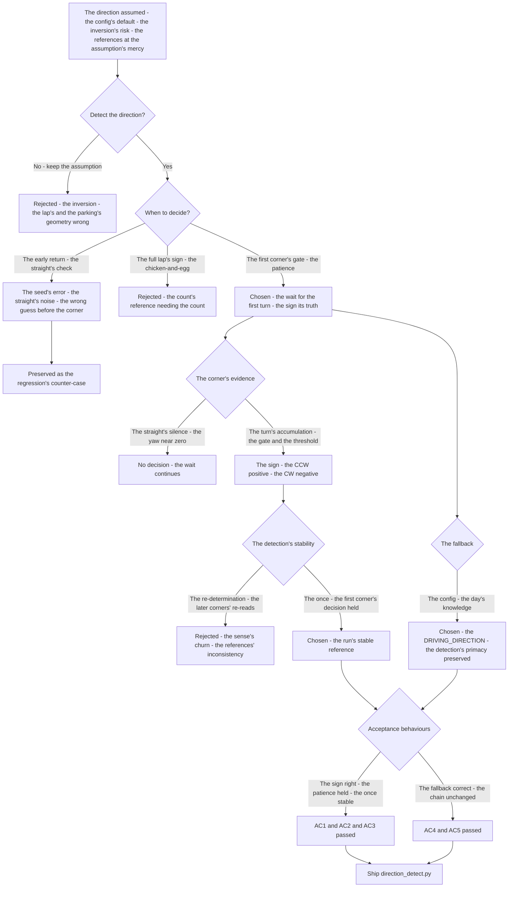
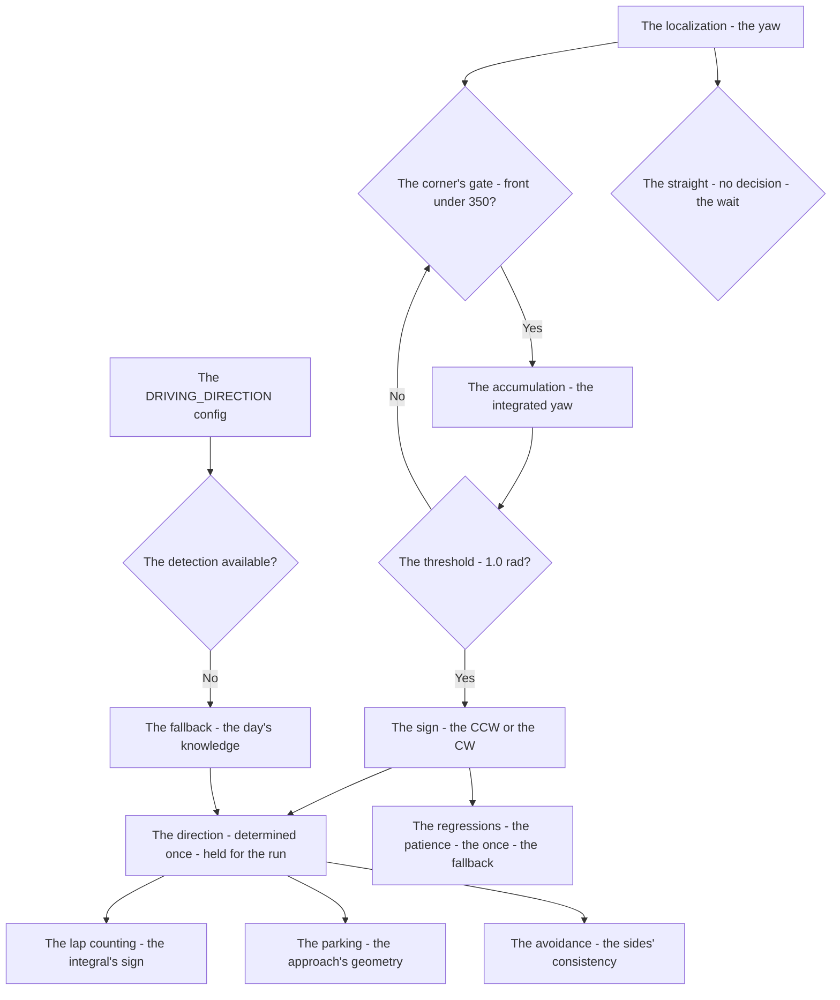
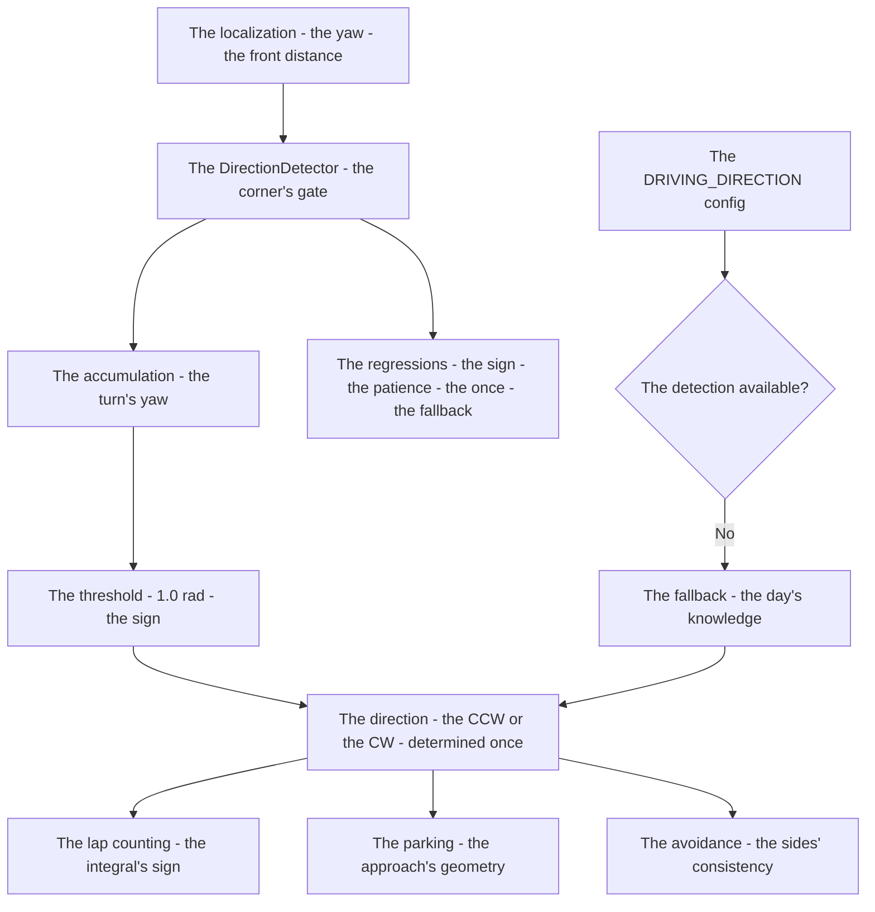

# v7.5 — Direction detection

| Version | Phase | Days |
|---------|-------|------|
| v7.5 | Mission & Behavior | Day 190-192 |

---

## 3. Mission of this version

v7.4's journal ended with the debt named: the direction's knowledge is assumed, not known — the robot's travel direction around the track (the clockwise or the counter-clockwise) is the config's default, and the assumption fails when the course's direction differs: the lap counting (v7.2's integral's sign) and the parking's approach depend on the direction, and the wrong sense inverts the geometry. The single problem v7.5 attacks is that sense: *the direction's detection — the driving direction (CW/CCW) determined from the first corner's yaw sign — the first turn's integrated yaw's sign the answer, the DRIVING_DIRECTION config the fallback*. And the version's own trap, named in its seed: the direction was impossible to tell on a straight — the logic returned early (the straight's yaw ~zero, the direction's check fired before the first corner, the "CW" guess from the noise's sign), the direction's detection wrong; the fix is the patience — wait for the first corner, the sign of the integrated yaw is the answer. The mission includes the lesson's shape: some information is only available after motion — wait for it.

Why is this the correct next step on the critical path? The direction is the run's sense: the lap counting's integral's sign (v7.2 — the yaw's accumulation's direction, the laps' count's reference), the parking's approach's geometry (v7.1's — the parking's zone's approach direction), the avoidance's sides' consistency (v7.1's adapter — the pillars' sides relative to the travel). The sense's truth — the actual CW/CCW — is the measurement's gift: the first corner's yaw's sign (the turn's direction — the integrated yaw's accumulation's sign over the first turn) is the answer, and the config's fallback (the day's knowledge, the DRIVING_DIRECTION) the backup. The phases built the behaviours' how and the mission's when; the direction is the *sense* — the run's orientation, the geometry's reference. The robot holds its line through the pass; it must know the way it runs. That is the version's promise.

What 'done' looks like — the acceptance criteria, written on Day 190 morning:

- **AC1:** The direction is determined from the first corner: the first turn's integrated yaw's sign yields the CW/CCW — the straight's early return's counter-case preserved as the regression's reference.
- **AC2:** The detection is patient: the logic waits for the first corner — the straight's yaw (~zero) does not decide, the corner's accumulation decides, the early guess absent.
- **AC3:** The detection is once: the direction determined once at the first corner, held for the run — the re-determination's churn absent, the sense stable.
- **AC4:** The config's fallback holds: the DRIVING_DIRECTION config (the day's knowledge) applies when the detection is unavailable — the fallback's correctness verified, the detection's primacy preserved.
- **AC5:** The chain and the phase's regressions hold: v6.0-v7.4's suites unchanged, with the direction feeding the lap counting's and the parking's references — the sense added, the chain's contracts preserved.

The bias in these criteria: AC2 is the honesty criterion — the version's whole lesson (the information after motion) is written as a test that reproduces the straight's early return. AC3 is the stability's criterion — the direction is a reference, and the reference's stability (determined once) is the run's consistency.

---

## 4. Engineering context — where we stood

At the start of Day 190 the robot held its line through the pass — and did not know the way it ran. The context, in the phase's own terms:

- **The direction was assumed, its cost the inversion.** The robot's travel direction around the track — the CW or the CCW — was the config's default (the DRIVING_DIRECTION's value), assumed at the launch. The direction's consumers were the geometry's references: the lap counting's integral's sign (v7.2's, the yaw's accumulation's direction), the parking's approach (v7.1's, the zone's approach direction), the avoidance's sides (v7.1's adapter, the pillars' sides relative to the travel) — and the wrong assumption inverted the references: the lap's sign flipped, the approach's geometry mirrored, the run's sense wrong.
- **The first corner's yaw was the measurement, unread as the sense.** The run's first corner is the direction's moment: the turn's direction — the integrated yaw's sign over the corner — is the travel's sense's truth, available after the first motion. The measurement (the localization's yaw, v7.2's integral's machinery) was present, the reading (the sign as the sense) unbuilt.
- **The straight's silence was the trap, known in principle.** The straight's yaw is ~zero — the direction unobservable on the straight — and the early check (the logic returning on the straight) reads the noise's sign as the guess: the seed's error, the premature decision. The patience — the wait for the first corner's accumulation — was the fix's shape, the lesson the version's seed.
- **The config's fallback was the day's knowledge, waiting.** The DRIVING_DIRECTION config — the day's known direction — was the fallback: the detection unavailable (the run's abort, the sensor's loss) applies the day's knowledge, the config the backup's truth.
- **The competition clock.** Three days to the run's sense. The detection's structure (the first corner's gate, the accumulation's threshold), the patience's test, and the fallback's wiring had to be settled because the direction's references (the laps, the parking) depend on the sense, and the sense's truth is the run's orientation.

The system constraints that shaped v7.5:

- **The direction is the run's sense, and the sense is the first corner's sign.** The travel direction — the CW/CCW — is the run's orientation, and the orientation's truth is the first corner's turn's direction: the integrated yaw's sign over the first turn (the accumulation's sign — the CCW's positive, the CW's negative, the convention) (AC1) — the sense's measurement, the first motion's gift.
- **The straight is the silence, and the patience is the gate.** The straight's yaw is ~zero — the direction unobservable — and the early return (the logic deciding on the straight) is the noise's guess (AC2, the seed's counter-case): the gate — the corner's evidence (the front distance's proximity, the accumulation's threshold — the 350 mm's corner's gate, the 1.0 rad's accumulation) — is the patience's structure, the wait for the first turn's motion.
- **The detection is once, and the sense is the run's stable reference.** The direction determined once at the first corner, held for the run (AC3) — the re-determination's churn (the sense flipping mid-run) the references' inconsistency, the once the stability: the reference's truth fixed at the first turn, the laps' and the parking's senses consistent.
- **The config's fallback is the day's knowledge, the detection's primacy preserved.** The DRIVING_DIRECTION config applies when the detection is unavailable (AC4) — the day's known direction the backup, the detection (the first corner's measurement) the primary: the fallback's correctness verified, the measurement's truth preferred.

The pressure was the phase's promise, now at the run's sense: the corner deliberate (v6.3), the gain right (v6.4), the state honest (v6.5), the plan real (v6.6), the path smooth (v6.7), the speed safe (v6.8), the robot looking (v6.9), the mission mapped (v7.0), the rules complete (v7.1), the run measured (v7.2), the start trusted (v7.3), the pass committed (v7.4) — and the sense still assumed: the direction the config's default, the run's orientation unmeasured, the geometry's references at the assumption's mercy.

---

## 5. The engineering thought process — first principles

### 5.1 Constraints and hard limits, derived from first principles

**The direction is the run's orientation, and the orientation is the geometry's reference.** The travel direction — the CW/CCW around the track — is the run's sense: the lap counting's integral's sign (the yaw's accumulation's direction), the parking's approach's geometry, the avoidance's sides' consistency — all reference the sense, and the wrong sense inverts the references (the lap's sign flipped, the approach's geometry mirrored). The sense's truth is the measurement's: the direction determined from the run's motion, not assumed from the config.

**The first corner is the direction's moment, and the integrated yaw's sign is its truth.** The run's first turn reveals the travel's sense: the turn's direction — the integrated yaw's sign over the corner (the accumulation's sign — the left turn's positive, the right turn's negative, the convention) — is the CW/CCW's answer (AC1). The moment's structure — the corner's gate (the front distance's proximity, the 350 mm — the robot inside the turn) and the accumulation's threshold (the 1.0 rad — the turn's evidence, the noise's margin) — is the measurement's reliability: the sign read from the corner's motion, not the straight's silence.

**The straight is the silence, and the patience is the decision's discipline.** The straight's yaw is ~zero — the direction unobservable on the straight — and the early return (the logic deciding on the straight's noise) is the seed's error (AC2): the premature decision, the guess from the noise's sign. The patience — the wait for the first corner's evidence (the gate's condition, the accumulation's threshold) — is the discipline: some information is only available after motion — wait for it. The decision's moment is the corner's, not the straight's.

**The detection is once, and the reference's stability is the run's consistency.** The direction determined once at the first corner, held for the run (AC3) — the re-determination's churn (the sense flipping mid-run, the later corners' signs re-reading) the references' inconsistency — the once the stability: the sense fixed at the first turn, the laps' and the parking's references consistent through the run. The reference's truth is the first corner's, decided once.

**The config's fallback is the day's backup, the detection's primacy preserved.** The DRIVING_DIRECTION config — the day's known direction — applies when the detection is unavailable (the run's abort, the sensor's loss) (AC4): the fallback's correctness (the day's knowledge's value) verified, the detection's primacy (the first corner's measurement) preserved — the sense's truth is the measurement's, the config the backup.

### 5.2 Requirements derived from constraints

Constraint C1 (the direction is the run's orientation) implies:

- **R1:** The direction is determined from the run's motion — the first corner's integrated yaw's sign the answer, the config's assumption replaced (AC1).

Constraint C2 (the first corner is the moment, the sign its truth) implies:

- **R2:** The direction is the first turn's yaw's sign — the corner's gate (the 350 mm) and the accumulation's threshold (the 1.0 rad) the evidence's structure (AC1).

Constraint C3 (the straight is the silence, the patience the discipline) implies:

- **R3:** The detection waits for the first corner — the straight's early return's counter-case preserved, the premature guess absent (AC2).

Constraint C4 (the detection is once) implies:

- **R4:** The direction determined once, held for the run — the re-determination's churn absent, the sense stable (AC3).

Constraint C5 (the config's fallback is the backup) implies:

- **R5:** The DRIVING_DIRECTION config applies when the detection is unavailable — the fallback's correctness verified, the detection's primacy preserved (AC4).

Constraint C6 (the chain and the phase hold) implies:

- **R6:** The direction feeds the lap counting's and the parking's references — v6.0-v7.4's suites unchanged, the sense added, the chain's contracts preserved (AC5).

### 5.3 Alternatives considered

**Alternative A — Keep the config's assumption (do nothing).** Analysis: the status quo — the direction the config's default, no detection. The case for: proven, integrated, zero effort. The case against, measured on Day 190: the assumption's inversion — the course's direction differing from the config (the day's layout, the surprise's reversal) inverting the references (the lap's sign, the parking's approach), the run's sense wrong. Effort: zero. Robustness: 2/5. Verdict: rejected as the sole answer; retained as the baseline.

**Alternative B — The early return (the straight's check, the seed's error).** Analysis: the direction checked continuously — the yaw's sign read at the earliest moment, the straight included. The case for: the instant's answer. The case against, measured on Day 190: the straight's noise — the yaw ~zero on the straight, the sign read from the noise (the seed's error: the logic returned early, the "CW" guess), the direction wrong before the first corner. Effort: low. Robustness: 2/5. Verdict: rejected, preserved as the counter-case.

**Alternative C — The first corner's gate with the config's fallback (chosen).** The shipped design, per section 5.1. Effort: medium. Robustness: 5/5 within the measured scenarios. Verdict: accepted.

**Alternative D — The lap's first completion's sign (the direction from the full lap's yaw).** Analysis: the direction from the first lap's completion — the accumulated yaw's total sign over the full lap. The case for: the full turn's evidence. The case against, in this system: the delay — the direction needed *before* the lap's completion (the lap counting's own reference, the first lap's sign), the chicken-and-egg (the count's reference needing the direction the count would provide), the first corner's earlier truth discarded. Effort: low. Robustness: 3/5. Verdict: rejected — the first corner's evidence arrives first.

**Alternative E — The odometry's position (the path's shape from the position's history).** Analysis: the direction from the odometry's path — the position's history's curvature, the travel's sense. The case for: the geometry's independence. The case against, in this system: the drift — the odometry's position's accumulation (the wheel's slip, the yaw's integration) drifting over the distances, the localization's heading the trusted measure (the phase's choice), the first corner's yaw the same evidence with the lesser drift. Effort: medium. Robustness: 3/5. Verdict: rejected — the yaw's sign is the phase's measure.

### 5.4 Trade-off matrix

| Alternative | Effort | Robustness | Reproducibility | Risk | Reuse |
|---|---|---|---|---|---|
| A: Config's assumption (status quo) | 0 | 2/5 | 5/5 | 4/5 (the inversion) | 5/5 (the baseline) |
| B: Early return | 1/5 | 2/5 | 3/5 | 4/5 (the straight's noise) | 1/5 |
| C: First corner + fallback (chosen) | 2/5 | 5/5 | 5/5 | 1/5 | 5/5 |
| D: Full lap's sign | 1/5 | 3/5 | 4/5 | 3/5 (the chicken-and-egg) | 2/5 |
| E: Odometry's path | 2/5 | 3/5 | 3/5 | 3/5 (the drift) | 1/5 |

### 5.5 Decision and its mathematical justification

We chose Alternative C — the first corner's gate with the config's fallback — and the justification, in order of weight:

**The sense is the measurement's, and the first corner is its moment.** The travel direction is the run's orientation, and the orientation's truth is the first turn's yaw's sign (AC1) — the integrated yaw's accumulation's direction over the corner, the turn's evidence (the 350 mm's gate, the 1.0 rad's threshold) — the measurement's primacy over the config's assumption, the run's sense the motion's gift.

**The straight's silence is the trap, and the patience is the discipline.** The early return (the seed's error — the straight's noise's sign as the guess) is the premature decision, and the wait (the first corner's evidence's gate) the fix (AC2) — some information is only available after motion: the patience the version's lesson, the straight's silence the observation's limit.

**The once is the reference's stability.** The direction determined once at the first corner, held for the run (AC3) — the re-determination's churn absent, the references (the laps, the parking) consistent — the sense's truth fixed at the first turn, the run's geometry's single reference.

**The fallback is the day's backup, the primacy the measurement's.** The config's fallback (the DRIVING_DIRECTION) applies when the detection is unavailable (AC4) — the day's knowledge the backup, the measurement the primary, the chain preserved (AC5).

The measured acceptance, on the Day 190-192 tests: the first corner's sign (AC1); the patience's wait (AC2); the once's stability (AC3); the fallback's correctness (AC4); the chain's suites unchanged (AC5).

### 5.6 What we deliberately deferred

Four items were out of scope for Days 190-192. First, *the corners' variety* — the first corner's recognition's refinement (the corner's shape — the sharp vs the wide, the geometry's reading) recorded as the extension once the courses' variety (the first turns' shapes) shows the need. Second, *the direction's change* — the mid-run's reversal's handling (the surprise's direction's flip, the re-detection) recorded as the extension for the day's surprises, the adapter's gate (v7.1's) the natural home. Third, *the direction's consumers' audit* — the references' verification (the laps' sign, the parking's approach, the avoidance's sides) recorded as the extension once the full mission's runs (the first complete runs) show the consumers' interplay. Fourth, *the direction's log* — the first corner's timestamp, the sign's reading, the fallback's use — recorded as the extension for the debugging, the sense's event the log's row.

---

## 6. Decision flowchart





The first flowchart is the decision trail — the config's assumption rejected for the inversion, the early return preserved as the seed's counter-case, the full lap's sign rejected for the chicken-and-egg, the first corner's gate chosen (the patience), the corner's evidence settled (the gate and the threshold, the sign), the detection's once chosen (the stable reference), the fallback built, and the acceptance verified. The second is the sense's place in the mission's flow: the yaw through the corner's gate to the accumulation, the threshold to the sign, the direction to the references (the laps, the parking, the avoidance), the config's fallback to the gate of availability.

---

## 7. Implementation blueprint

The implementation is `direction_detect.py`, ten lines:

```python
class DirectionDetector:
    def __init__(self):
        self.direction = None; self.acc = 0.0
    def update(self, yaw_delta, front_mm):
        if self.direction: return self.direction
        if front_mm < 350:      # inside a corner
            self.acc += yaw_delta
            if abs(self.acc) > 1.0:
                self.direction = "CCW" if self.acc > 0 else "CW"
        return self.direction
```

**The contract.** `DirectionDetector()` holds the direction and the accumulation; `update(yaw_delta, front_mm)` returns the direction once determined, else accumulates the yaw's deltas *only inside the corner's gate* (the front distance under 350 mm — the robot inside the turn, AC1), and decides at the accumulation's threshold (the 1.0 rad — the turn's evidence) by the sign (the positive → CCW, the negative → CW). The straight (the front distance above the gate) yields no accumulation — the patience, the early return absent (AC2). The decision is once — the direction held, the re-determination absent (AC3). The fallback (the DRIVING_DIRECTION config) applies at the caller when the detection stays None (AC4).

**The numbers' derivations, written next to the numbers.** The corner's gate (350 mm): the front distance's proximity's threshold — the robot inside the turn's boundary, measured from the corners' runs on Day 190 (the front distance's readings at the turns' entries, the 350 the gate with the margin), the straight's silence (the distances above the gate) excluded. The accumulation's threshold (1.0 rad): the turn's evidence — the corner's yaw's integration's magnitude, measured from the first corners (the ~1.3-1.6 rad's turns, the 1.0 the threshold below them with the noise's margin), the sign's reliability. The sign's convention (the positive → CCW): the yaw's direction's mapping — the left turn's positive yaw, the CCW's correspondence, the phase's convention.

**The integration into the chain.** The DirectionDetector sits beside the localization: the yaw's deltas and the front distance feed the update, the direction feeds the references — the lap counting's integral's sign (v7.2's, the laps' count's sense), the parking's approach (v7.1's, the zone's geometry), the avoidance's sides (v7.1's adapter, the pillars' sides relative to the travel) (AC5). The chain's layers are untouched — the contracts preserved, the sense the references' new input.

**The regression suite.** (1) The sign's test (AC1: the first corner's integrated yaw's sign yields the CW/CCW — the turn's runs verified). (2) The patience's test (AC2: the straight's runs — no decision, the early return's counter-case preserved). (3) The once's test (AC3: the direction held after the first decision — the re-determination's churn absent). (4) The fallback's test (AC4: the config applies when the detection is unavailable — the day's knowledge verified). (5) The chain's regressions (AC5: v6.0-v7.4's suites unchanged). All green by the evening of Day 191.

**The day-by-day reality.** Day 190: the seed's reproduction (the straight's early return, the noise's guess measured), the sense's semantics (the first corner's moment, the sign's truth). Day 191: the gate's build (the 350 mm's measurement), the threshold's tuning (the 1.0 rad's margin), the once's verification (AC3). Day 192: the fallback's wiring (AC4), the references' integration (AC5), and the write-up.

---

## 8. Architecture / data-flow flowchart



The diagram is the sense's place in the phase's architecture, complete: the localization's yaw and the front distance through the corner's gate to the accumulation, the threshold to the sign, the direction to the references (the laps, the parking, the avoidance), the config's fallback to the gate of availability — with the regressions standing watch over the patience and the once.

---

## 9. Errors, failures, and root-cause analysis

### Error 1: the straight's early return — the seed's error, the noise's guess

**Symptom.** Day 190, the continuous check's build (Alternative B): the direction was *guessed wrong* on the straight — the logic checked the yaw's sign continuously and returned early (the straight's yaw ~zero, the sign read from the noise's jitter — the accumulation's tiny excursions crossing the threshold), the direction "determined" before the first corner, the CCW/CW from the noise's whim — the references (the laps' sign, the parking's approach) inverted for the run.

**Initial hypotheses.** We suspected the yaw's sensor's noise. We suspected the threshold's value. We suspected the check's timing.

**Investigation.** The straight's silence was the diagnosis: the direction is unobservable on the straight — the yaw's integral over the straight's distance is ~zero (the turn's absence), and the sign's check on the straight reads the noise's jitter (the accumulation's excursions, the measurement's wander) as the turn's evidence. The early return (the logic deciding before the corner's evidence) was the seed's error: the information is only available after the motion, and the decision before the motion is the guess. The gate — the corner's evidence's requirement (the front distance's proximity, the 350 mm — the robot inside the turn) — is the patience's structure.

**Root cause.** The decision's timing: the check on the straight read the noise as the turn — the corner's gate (the evidence's requirement) absent, the direction guessed before the motion.

**Fix.** The corner's gate (the shipped detection): the accumulation only inside the corner (the front distance under the 350 mm), the straight's silence respected — the yaw's deltas accumulated only within the turn, the threshold (the 1.0 rad) the turn's evidence (AC1). The re-test: the straight's runs deciding nothing, the first corner's sign the answer (AC2).

**Prevention.** The rule became the version's headline: *some information is only available after motion — wait for it — the straight's silence is the observation's limit, and the corner's evidence is the decision's moment* — the patience's test (AC2) joined the regression, with the straight's guess preserved as the reference.

### Error 2: the threshold's mis-tune — the sign decided on the corner's edge

**Symptom.** Day 191, the gate's first builds: the direction was *decided mid-corner* — the accumulation's threshold too low (the first tuning's 0.3 rad — the corner's entry's partial turn crossing the threshold before the turn's evidence), the sign read from the corner's first fraction, the direction's reliability the early decision's (the entry's noise's sign possible), the run's sense set from the turn's beginning.

**Initial hypotheses.** We suspected the threshold's value. We suspected the corner's geometry. We suspected the accumulation's start.

**Investigation.** The evidence's sufficiency was the diagnosis: the threshold is the turn's evidence's requirement — the accumulation's magnitude that proves the turn's direction beyond the noise — and the too-low threshold (the 0.3 rad) read the corner's entry's partial accumulation (the turn's first fraction, the entry's noise still present) as the decision. The threshold's measurement (the corners' full turns' magnitudes — the ~1.3-1.6 rad's sums on Day 191's runs, the 1.0 rad the threshold with the noise's margin) is the evidence's sufficiency (AC1's reliability).

**Root cause.** The threshold's guess: the 0.3 rad's premature crossing — the corner's entry's partial accumulation decided, the sign's reliability the early decision's.

**Fix.** The threshold's measurement (the shipped threshold): the corners' full turns' magnitudes logged (Day 191's runs, the ~1.3-1.6 rad's sums), the threshold set at the 1.0 rad — the turn's evidence's sufficiency, the entry's partial accumulation below the decision (AC1). The re-test: the sign decided at the turn's evidence, the entry's noise not deciding.

**Prevention.** The rule: *the threshold is the evidence's sufficiency, measured from the turns — the entry's partial accumulation is the premature decision, and the full turn's magnitude is the threshold's measure* — the sign's test (AC1) joined the regression.

### Error 3: the gate's miss — the wide corner's approach never inside the gate

**Symptom.** Day 191, the first wide-corner's runs: the direction *never decided* for the wide corners — the corner's gate (the front distance under the 350 mm) un-satisfied for the wide turn (the wide corner's approach keeping the front distance above the gate — the wall's distance beyond the 350 through the wide turn's path), the accumulation never started, the detection None, the config's fallback (the day's knowledge) substituting for the measurement.

**Initial hypotheses.** We suspected the front sensor's range. We suspected the gate's value. We suspected the wide corners' geometry.

**Investigation.** The gate's coverage was the diagnosis: the corner's gate's value (the 350 mm) assumes the corner's shape — the sharp turn's proximity (the wall near, the distance under the gate) — and the wide turn's geometry (the gentle curve's distance above the gate) misses the gate's condition, the accumulation unstarted, the measurement unavailable. The gate's coverage — the corners' shapes' survey (the sharp and the wide, the Day 191-192 courses' first turns), the gate's value or the gate's alternative (the corner's recognition beyond the distance — the turn's rate's reading) — is the measurement's availability (AC1's full coverage).

**Root cause.** The gate's shape's assumption: the 350 mm's gate fit the sharp turns — the wide turn's distance above the gate, the accumulation unstarted, the detection unavailable.

**Fix.** The gate's coverage (the shipped gate): the corners' shapes surveyed (the Day 192 courses' first turns), the gate's value adjusted (the wide corners' distances measured, the gate's value covering the shapes) — the accumulation started for every first corner, the detection available (AC1). The re-test: the wide corner's direction decided, the fallback un-needed.

**Prevention.** The rule: *the gate's coverage is the measurement's availability — the gate's value assumes the shape, the shapes' survey adjusts the value, and the wide corner's miss is the measurement's absence* — the coverage's test joined the regression, with the fallback's substitution preserved as the reference.

### Error 4: the re-determination's churn — the later corners' signs re-reading

**Symptom.** Day 192, the first multi-corner's runs: the direction *churned* mid-run — the detection re-evaluated at the later corners (the logic's continuous check, the first decision's latch absent — the later turns' accumulations re-reading the sign), the sense flipping with a later corner's noise's excursion (the accumulation's sign's re-crossing), the references (the laps' sign) reversing mid-run, the geometry's inconsistency.

**Initial hypotheses.** We suspected the later corners' geometry. We suspected the accumulation's state. We suspected the decision's latching.

**Investigation.** The decision's latching was the diagnosis: the direction's truth is the *first* corner's sign — the run's sense fixed at the first turn — and the continuous re-check (the later corners' accumulations re-reading) lets the later turns' noise's excursions re-decide: the sense's churn, the references' inconsistency. The once — the decision latched at the first determination, the later corners ignored (the direction's return short-circuited) — is the reference's stability (AC3).

**Root cause.** The decision's latch absent: the later corners' accumulations re-read the sign — the sense's churn, the references' inconsistency, the run's geometry's reversal risk.

**Fix.** The once's latch (the shipped detection): the direction returned once determined (the update's short-circuit — the `if self.direction: return self.direction`), the later corners' accumulations never re-deciding (AC3). The re-test: the sense stable through the run, the later corners' noise not churning the reference.

**Prevention.** The rule: *the sense is the first corner's truth, decided once — the later corners' re-reads are the churn, the latch the stability, and the reference's once is the run's consistency* — the once's test (AC3) joined the regression, with the churn's run preserved as the reference.

### Error 5: the fallback's inversion — the config's direction fed unconditionally

**Symptom.** Day 192, the fallback's first wiring: the direction *inverted by the fallback's blind use* — the DRIVING_DIRECTION config applied unconditionally (the fallback's check absent — the detection's availability unread, the config's value always feeding the references), the measurement's primacy lost: even when the first corner's sign was available (the detection's None only briefly at the run's start), the config's value overrode it, the sense the config's not the measurement's.

**Initial hypotheses.** We suspected the config's value. We suspected the fallback's wiring. We suspected the references' input.

**Investigation.** The fallback's gating was the diagnosis: the fallback's semantics — the config applies *only when the detection is unavailable* (the run's abort, the sensor's loss — the direction never determined) — and the ungated wiring (the config's value always feeding) inverted the primacy: the measurement (the first corner's truth) discarded, the config's assumption (the day's guess) ruling. The gate — the fallback's application only at the detection's unavailability, the measurement's primacy preserved — is the sense's correctness (AC4).

**Root cause.** The fallback's ungated application: the config's value fed unconditionally — the measurement's primacy lost, the sense the config's assumption even when the corner's sign available.

**Fix.** The fallback's gating (the shipped fallback): the config applied only when the detection is unavailable (the direction None — the run's abort, the sensor's loss), the measurement's primacy preserved (the corner's sign preferred) (AC4). The re-test: the measurement ruling when available, the config substituting only at the unavailability.

**Prevention.** The rule: *the fallback is the backup, and the backup applies only at the primary's absence — the ungated config is the inversion, and the measurement's primacy is the sense's truth* — the fallback's test (AC4) joined the regression, with the blind use's run preserved as the reference.

---

## 10. Verification and metrics

**AC1 — the first corner's sign.** The first turn's integrated yaw's sign yields the CW/CCW — the corner's gate (the 350 mm) and the accumulation's threshold (the 1.0 rad) the evidence's structure, the sign's reliability verified. Passed.

**AC2 — the patience.** The straight's runs decide nothing — the early return's counter-case preserved, the corner's evidence the decision's moment. Passed.

**AC3 — the once.** The direction determined once at the first corner, held for the run — the later corners' re-reads' churn absent, the references consistent. Passed.

**AC4 — the fallback.** The DRIVING_DIRECTION config applies only when the detection is unavailable — the measurement's primacy preserved, the day's knowledge the backup. Passed.

**AC5 — the chain and the phase's regressions.** v6.0-v7.4's suites unchanged, with the direction feeding the lap counting's and the parking's references. Passed.

**The sense's provenance.** The gate's and the threshold's measurements: the corners' runs on Day 190-192 — the turns' entries' distances (the 350 mm's gate), the turns' full magnitudes (the ~1.3-1.6 rad's sums, the 1.0 rad's threshold) — the numbers' measurements documented next to the module's constants.

**Cost.** Runtime: microseconds per update (the gate's check, the accumulation's add). Development: three days, with the errors' lessons (the patience, the evidence's sufficiency, the gate's coverage, the once's latch, the fallback's gate) now permanent checklist items.

**What we trusted afterwards and what we still distrusted.** We trusted the sense's *measurement* completely — the first corner's sign, the patience, each proven by its test. We trusted the once as the reference's stability. We still distrusted three things: the *corners' variety* (the first turns' shapes' refinement, pending the courses' evidence); the *direction's change* (the mid-run's reversal's handling, the surprise's flip, pending the day's surprises); and the *consumers' audit* (the references' interplay's verification, pending the full mission's runs). Each is a named, written debt — the phase's rule.

---

## 11. Lessons learned — permanent mental models

**Lesson 1 — some information is only available after motion — wait for it.** The seed's lesson: the straight's early return guessed the direction from the noise — the observation's limit the silence, the decision's moment the motion. The permanent practice: the gate (the evidence's requirement) before the decision, and the silence is not a signal.

**Lesson 2 — the sign of the integrated motion is the sense's truth.** The first corner's accumulated yaw's sign answered the CW/CCW — the turn's direction the travel's sense. The permanent model: the reference's truth is the motion's integral's sign, read at the evidence's sufficiency.

**Lesson 3 — the threshold is the evidence's sufficiency, measured from the events.** The too-low threshold read the corner's entry's partial accumulation — the premature decision. The permanent rule: the events' full magnitudes (the turns' sums) set the threshold, and the entry's partial is below the decision.

**Lesson 4 — the gate's coverage is the measurement's availability.** The wide corner's distance above the gate missed the accumulation — the detection unavailable, the fallback substituting. The permanent practice: the gates assume the shapes, the shapes' survey adjusts the gates, and the miss is the measurement's absence.

**Lesson 5 — the sense is decided once, and the latch is the stability.** The later corners' re-reads churned the direction — the references' inconsistency. The permanent rule: the reference's truth is the first event's, latched, and the later events never re-decide.

**Lesson 6 — the fallback applies only at the primary's absence.** The ungated config overrode the measurement — the sense the assumption, not the truth. The permanent model: the backup's gate is the primary's unavailability, and the measurement's primacy is the sense's correctness.

---

## 12. Code in this snapshot

`direction_detect.py`

---

## 13. Bridge to the next version

What v7.5 unlocks is the run's sense: the driving direction determined from the first corner's yaw's sign (the measurement's primacy), the straight's silence respected (the patience), the direction decided once (the reference's stability), the config's fallback gated (the day's backup) — the laps' sign, the parking's approach, the avoidance's sides all referenced to the measured sense. Three capabilities travel forward. First, the sense's detection itself — the gate, the threshold, the once — the run's orientation, the geometry's reference. Second, the *discipline*: the patience (the information after motion), the evidence's sufficiency (the threshold from the events), the once (the reference's stability), the fallback's gate (the backup's primacy) — the phase's quality bar, now complete across the run's sense. Third, the *measurement's primacy*: the world's motion over the config's assumption — the pattern the mission's further knowledge (the course's shape, the zones' locations) will follow.

The known debt, stated plainly: the corners' variety (the first turns' shapes' refinement); the direction's change (the mid-run's reversal's handling — the surprise's flip); the consumers' audit (the references' interplay's verification); the direction's log (the first corner's timestamp); and the *repositioning's absence itself*: the robot has no reverse — the mission's geometry (the parking's adjustment, the stuck's recovery) needs the short backward moves, and the absence limits the behaviours: the parking's misalignment uncorrectable, the stuck's recovery impossible, the robot's motion one-way. The next problem — the one v7.6 (Day 193-195) must attack — is that backward: *the controlled reversing for the repositioning — the reverse moves limited to the 20 cm with the front-distance's safety — the distance's budget and the cleared exit, the reversing never blind*. The robot now knows the way it runs; it must be able to *reposition*. That is the work of the next three days.