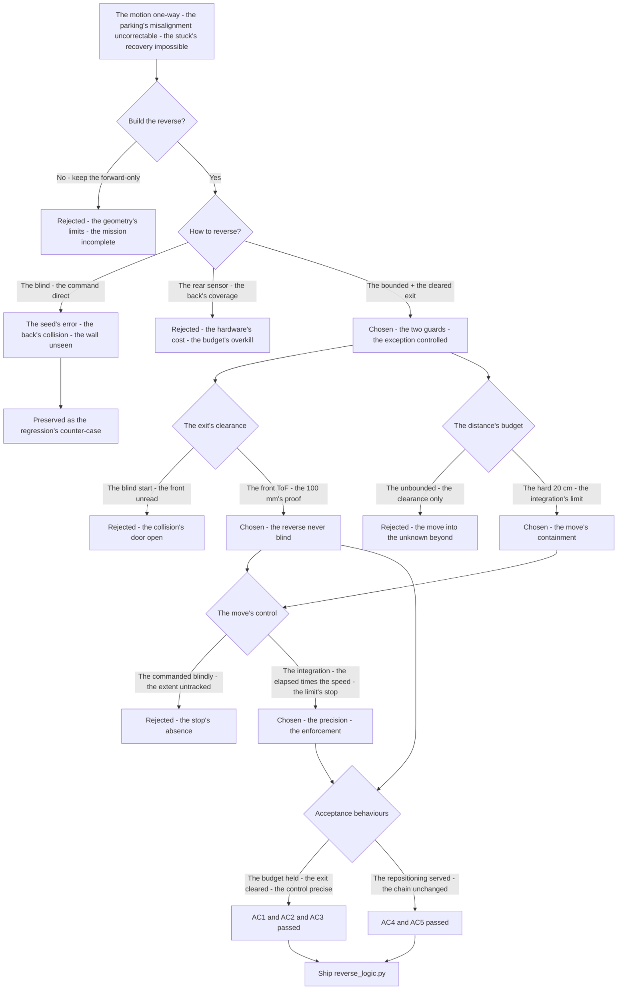
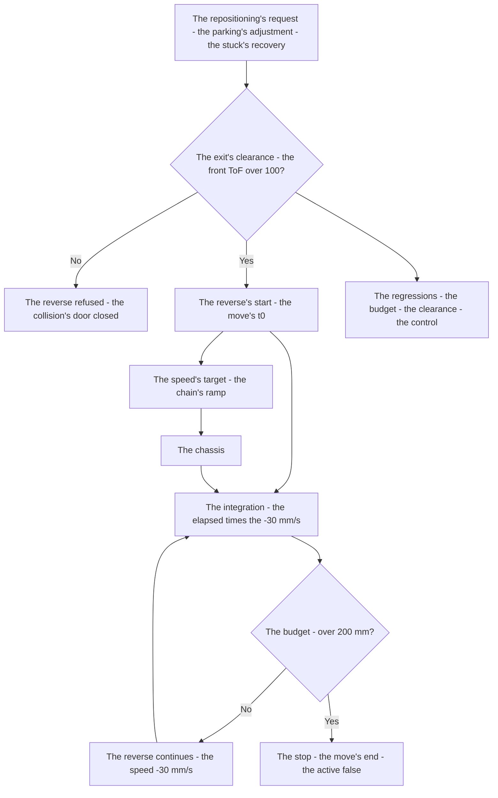
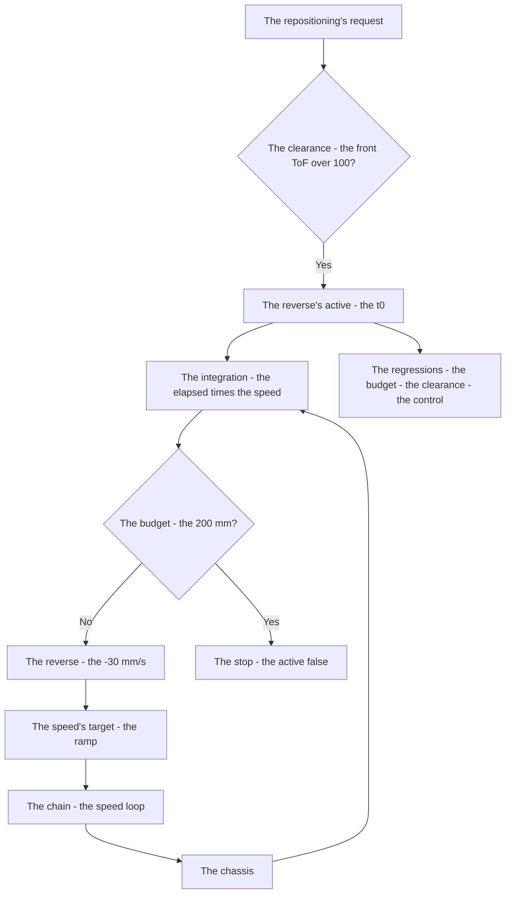

# v7.6 — Reverse logic

| Version | Phase | Days |
|---------|-------|------|
| v7.6 | Mission & Behavior | Day 193-195 |

---

## 3. Mission of this version

v7.5's journal ended with the debt named: the repositioning's absence — the robot has no reverse — the mission's geometry (the parking's adjustment, the stuck's recovery) needs the short backward moves, and the absence limits the behaviours: the parking's misalignment uncorrectable, the stuck's recovery impossible, the robot's motion one-way. The single problem v7.6 attacks is that backward: *the controlled reversing for the repositioning — the reverse moves limited to the 20 cm with the front-distance's safety — the distance's budget and the cleared exit, the reversing never blind*. And the version's own trap, named in its seed: the robot backed into the wall while reversing blindly — the reverse move without the distance's budget and without the exit's clearance (the front's truth unread at the reverse's start, the move's extent unbounded), the collision at the robot's back; the fix is the two guards — the hard 20 cm's limit (the distance's budget) and the front ToF's clearance before the reverse (the exit's proof). The mission includes the lesson's shape: reversing needs a distance budget and a cleared exit.

Why is this the correct next step on the critical path? The mission's geometry is not one-way: the parking's manoeuvre (v7.1's, v7.7's future) needs the adjustment — the robot short of the zone's alignment, the reverse's correction — and the stuck's recovery (the obstacle's trap, the corner's box) needs the backward escape. The reverse's safety is the collision's prevention: the blind backward is the collision at the back (the sensor's coverage — the robot's rear unmeasured — the wall's unseen), and the guards — the distance's budget (the hard 20 cm's limit — the move's extent bounded) and the cleared exit (the front ToF's clearance before the reverse — the path's proof, the collision's door closed) — are the safety's structure. The phases built the forward's behaviours; the reverse is the *backward* — the controlled exception, the mission's geometry's completion. The robot knows the way it runs; it must be able to reposition. That is the version's promise.

What 'done' looks like — the acceptance criteria, written on Day 193 morning:

- **AC1:** The reverse is bounded: the reverse move never exceeds the 20 cm's budget — the hard limit's enforcement verified, the move's extent measured.
- **AC2:** The exit is cleared: the front ToF's clearance (the 100 mm) is required before the reverse — the blind reverse's counter-case preserved as the regression's reference.
- **AC3:** The reverse is controlled: the reverse's speed (the -30 mm/s) and the duration's tracking (the distance's integration) are the move's control — the repositioning's precision verified.
- **AC4:** The reverse is integrated: the reverse's moves serve the mission's repositioning (the parking's adjustment, the stuck's recovery) — the behaviours' use verified, the mission's geometry completed.
- **AC5:** The chain and the phase's regressions hold: v6.0-v7.5's suites unchanged, with the reverse logic feeding the speed's target — the backward added, the chain's contracts preserved.

The bias in these criteria: AC2 is the honesty criterion — the version's whole lesson (the cleared exit) is written as a test that reproduces the blind reverse's collision. AC1 is the budget's criterion — the reverse's extent is the collision's bound, and the hard limit is the safety's enforcement.

---

## 4. Engineering context — where we stood

At the start of Day 193 the robot knew the way it ran — and could not move backward. The context, in the phase's own terms:

- **The motion was one-way, its costs the geometry's limits.** The robot's motion — the speed's target — was forward-only: the missions' behaviours (the launch, the run, the parking) all forward, the reverse absent. The absence's costs: the parking's misalignment (the robot short of the zone's alignment, the forward-only correction impossible), the stuck's recovery (the obstacle's trap, the corner's box, the forward-only escape impossible), the mission's geometry's incompleteness.
- **The backward's danger was the blind collision, known in principle.** The reverse is the collision's risk: the robot's rear has no sensor's coverage (the ToF's forward-facing, the back's blind) — the backward move without the guards is the blind collision (the seed's error), and the guards' shape — the distance's budget (the move's extent bounded) and the cleared exit (the front's truth read at the start) — was the safety's design.
- **The control's machinery was present, the backward's branch unbuilt.** The speed's chain — the trajectory's ramp (v6.8), the speed loop — was the forward's control; the reverse's branch (the negative target's shaping, the distance's integration, the limit's enforcement) was the addition — the controlled reverse the chain's extension.
- **The mission's behaviours were waiting for the backward.** The parking's manoeuvre (v7.1's map, v7.7's future state machine) needs the adjustment; the stuck's recovery (the failure's handling, the phase's deferred debt) needs the escape — the reverse's moves the behaviours' missing limb.
- **The competition clock.** Three days to the repositioning's trust. The reverse's guards (the budget, the clearance), the control (the speed, the integration), and the integration (the behaviours' use) had to be settled because the parking's completion (the mission's end) and the stuck's recovery (the run's rescue) depend on the backward.

The system constraints that shaped v7.6:

- **The reverse is the exception, and the exception is controlled.** The reverse is the mission's exception — the short repositioning move, not the run's motion — and the exception's control is the bounded move: the hard 20 cm's budget (the move's extent's limit, the collision's distance's bound) (AC1) — the exception's safety, the blind's opposite.
- **The exit is the collision's gate, and the clearance is its proof.** The reverse's start requires the exit's proof — the front ToF's clearance (the path ahead's distance beyond the 100 mm) — the reverse's direction's truth read at the start (AC2): the blind reverse (the seed's error) the collision, the cleared exit the collision's door closed.
- **The move is measured, and the integration is the extent's truth.** The reverse's extent — the distance's integration (the elapsed time × the speed) — is the move's measurement, and the integration's limit (the 20 cm's budget) the enforcement (AC1, AC3): the move's extent tracked, the limit enforced, the repositioning's precision the control's.
- **The reverse serves the mission's geometry.** The reverse's moves serve the repositioning — the parking's adjustment (the zone's alignment's correction), the stuck's recovery (the trap's escape) (AC4) — the exception's purpose the mission's completion, the backward the behaviours' limb.

The pressure was the phase's promise, now at the geometry's completion: the corner deliberate (v6.3), the gain right (v6.4), the state honest (v6.5), the plan real (v6.6), the path smooth (v6.7), the speed safe (v6.8), the robot looking (v6.9), the mission mapped (v7.0), the rules complete (v7.1), the run measured (v7.2), the start trusted (v7.3), the pass committed (v7.4), the sense measured (v7.5) — and the motion still one-way: the repositioning absent, the parking's misalignment uncorrectable, the stuck's recovery impossible.

---

## 5. The engineering thought process — first principles

### 5.1 Constraints and hard limits, derived from first principles

**The reverse is the mission's exception, and the exception's control is the bounded move.** The reverse is not the run's motion — it is the exception's move: the short repositioning (the parking's adjustment, the stuck's recovery), invoked for the mission's geometry's completion. The exception's control is the bound: the hard 20 cm's budget — the move's extent's limit, the collision's distance's ceiling (AC1) — the reverse's safety's first limb, the extent's measurement (the integration) the limit's enforcement.

**The exit is the collision's gate, and the clearance is its proof.** The reverse's direction — the robot's back — has no sensor's coverage (the ToF's forward-facing, the back's blind): the backward move is the blind collision without the guards. The exit's proof — the front ToF's clearance (the path ahead's distance beyond the 100 mm, read at the reverse's start) — is the collision's gate (AC2): the blind reverse (the seed's error) is the collision, the cleared exit is the collision's door closed — the reverse never blind.

**The move is measured, and the integration is the extent's truth.** The reverse's extent is the distance's integration — the elapsed time × the speed (−30 mm/s) — the move's measurement, and the integration's comparison to the budget (the 20 cm) is the enforcement (AC1, AC3): the extent tracked, the limit enforced, the move's stop at the budget — the repositioning's precision the integration's.

**The reverse serves the mission's geometry, and the purpose is the exception's justification.** The reverse's moves are not arbitrary — they serve the repositioning: the parking's adjustment (the zone's alignment's correction, the robot's shortfall's fix), the stuck's recovery (the trap's escape, the obstacle's box's exit) (AC4) — the exception's purpose the mission's completion, the backward the behaviours' missing limb, the geometry's completeness.

### 5.2 Requirements derived from constraints

Constraint C1 (the reverse is the bounded exception) implies:

- **R1:** The reverse move never exceeds the 20 cm's budget — the hard limit's enforcement, the move's extent measured (AC1).

Constraint C2 (the exit is the collision's gate) implies:

- **R2:** The front ToF's clearance (the 100 mm) is required before the reverse — the blind reverse's counter-case preserved, the collision's door closed (AC2).

Constraint C3 (the move is measured) implies:

- **R3:** The reverse's extent is the distance's integration (the elapsed × the −30 mm/s) — the limit's enforcement, the repositioning's precision (AC1, AC3).

Constraint C4 (the reverse serves the mission's geometry) implies:

- **R4:** The reverse's moves serve the parking's adjustment and the stuck's recovery — the behaviours' use verified (AC4).

Constraint C5 (the chain and the phase hold) implies:

- **R5:** The reverse logic feeds the speed's target — v6.0-v7.5's suites unchanged, the backward added, the chain's contracts preserved (AC5).

### 5.3 Alternatives considered

**Alternative A — Keep the forward-only motion (do nothing).** Analysis: the status quo — the robot's motion forward-only, no reverse. The case for: proven, integrated, zero effort. The case against, measured on Day 193: the geometry's limits — the parking's misalignment uncorrectable (the forward-only correction impossible), the stuck's recovery impossible (the trap's escape absent), the mission's geometry incomplete. Effort: zero. Robustness: 2/5. Verdict: rejected as the sole answer; retained as the baseline.

**Alternative B — The blind reverse (the seed's error).** Analysis: the reverse's command direct — the backward move at the command, no budget, no clearance. The case for: the minimal form. The case against, measured on Day 193: the collision — the robot backed into the wall (the back's blindness — the ToF's forward-facing, the wall's unseen), the move's extent unbounded, the collision at the robot's back. Effort: low. Robustness: 1/5. Verdict: rejected, preserved as the counter-case.

**Alternative C — The bounded reverse with the cleared exit (chosen).** The shipped design, per section 5.1. Effort: medium. Robustness: 5/5 within the measured scenarios. Verdict: accepted.

**Alternative D — The rear sensor's addition (the back's ToF's coverage).** Analysis: the reverse's safety via the rear sensor's measurement — the back's distance read, the reverse's collision prevented by the sensor. The case for: the direct coverage. The case against, in this system: the hardware's addition — the rear ToF's mounting, wiring, and calibration (the firmware's cost), the front ToF's clearance (the path ahead's truth) sufficient for the short reverse's geometry (the 20 cm's budget, the front's cleared area), the sensor's addition the budget's overkill. Effort: high. Robustness: 4/5. Verdict: rejected — the budget and the clearance suffice.

**Alternative E — The reverse without the budget (the clearance only).** Analysis: the reverse's exit cleared, the move's extent unbounded. The case for: the collision's primary gate. The case against, in this system: the extent's unboundedness — the cleared exit's area finite (the front's open space bounded), the unbounded reverse exiting the cleared area (the move into the unknown beyond), the budget's bound (the 20 cm) the move's containment. Effort: low. Robustness: 2/5. Verdict: rejected — the budget and the clearance are the two guards.

### 5.4 Trade-off matrix

| Alternative | Effort | Robustness | Reproducibility | Risk | Reuse |
|---|---|---|---|---|---|
| A: Forward-only (status quo) | 0 | 2/5 | 5/5 | 4/5 (the geometry's limits) | 5/5 (the baseline) |
| B: Blind reverse | 1/5 | 1/5 | 2/5 | 5/5 (the back's collision) | 1/5 |
| C: Bounded + cleared exit (chosen) | 2/5 | 5/5 | 5/5 | 1/5 | 5/5 |
| D: Rear sensor | 4/5 | 4/5 | 4/5 | 2/5 (the hardware's cost) | 1/5 |
| E: Clearance only | 1/5 | 2/5 | 4/5 | 4/5 (the extent's unboundedness) | 2/5 |

### 5.5 Decision and its mathematical justification

We chose Alternative C — the bounded reverse with the cleared exit — and the justification, in order of weight:

**The reverse's safety is the two guards, and the guards are the collision's doors.** The blind backward is the collision (the back's blindness — the seed's error), and the guards close the doors: the exit's clearance (the front ToF's 100 mm, read before the reverse — the path's proof, AC2) and the distance's budget (the hard 20 cm — the move's extent's bound, AC1). The reverse never blind — the lesson's shape, the safety's structure.

**The exception's control is the measured move.** The reverse is the exception — the short repositioning — and the exception's control is the integration (the elapsed × the −30 mm/s) and the limit's enforcement (the 20 cm's stop) (AC3): the move's extent tracked, the repositioning's precision the control's, the mission's geometry served (AC4).

**The guards' choice is the firmware's economy.** The alternative's cost: the rear sensor's addition (the hardware's mounting, wiring, calibration) versus the front's clearance and the budget (the existing measurements — the ToF's, the integration) — the economy the phase's rule (the sim-first, the custom built), the guards' sufficiency for the short reverse's geometry.

**The chain's contract is preserved.** The reverse logic feeds the speed's target — the chain's orders (the ramp's shape, the speed loop) intact, the backward the branch's addition (AC5).

The measured acceptance, on the Day 193-195 tests: the budget's enforcement (AC1); the exit's clearance (AC2); the move's control (AC3); the repositioning's use (AC4); the chain's suites unchanged (AC5).

### 5.6 What we deliberately deferred

Four items were out of scope for Days 193-195. First, *the reverse's geometry's variety* — the angled reverse's (the reverse with the steering, the diagonal's repositioning) refinement recorded as the extension once the parking's manoeuvres (v7.7's) show the geometry's need. Second, *the stuck's recovery's full logic* — the trap's detection (the blocked state, the timeout's trigger) and the escape's sequence (the reverse's use) recorded as the extension for the robustness, the failure's handling (the phase's debt) the natural home. Third, *the reverse's re-entry* — the forward's resumption after the reverse (the ramp's re-entry, the speed's return) recorded as the extension once the behaviours' sequences (the adjustment-then-resume) show the need. Fourth, *the reverse's log* — the moves' timestamps, the extents, the clearances — recorded as the extension for the debugging, the exception's events the log's rows.

---

## 6. Decision flowchart





The first flowchart is the decision trail — the forward-only rejected for the geometry's limits, the blind reverse preserved as the seed's counter-case, the rear sensor rejected for the hardware's cost, the bounded with the cleared exit chosen, the exit's clearance settled (the front ToF's proof), the budget's containment built (the hard 20 cm), the move's control settled (the integration), and the acceptance verified. The second is the reverse's place in the mission's flow: the repositioning's request through the exit's clearance's gate to the move's start, the integration to the budget's check, the speed to the chassis, the extent's tracking back to the integration.

---

## 7. Implementation blueprint

The implementation is `reverse_logic.py`, thirteen lines:

```python
import time
class Reverse:
    def __init__(self, max_mm=200, safety_mm=100):
        self.max_mm = max_mm; self.safety = safety_mm; self.active = False; self.t0 = 0.0
    def start(self, front_mm):
        if front_mm > self.safety and not self.active:
            self.active = True; self.t0 = time.time()
        return self.active
    def update(self, elapsed_s, v_mm_s):
        if not self.active: return 0.0
        if elapsed_s * v_mm_s > self.max_mm:
            self.active = False; return 0.0
        return -30.0
```

**The contract.** `Reverse(max_mm=200, safety_mm=100)` holds the budget, the clearance, and the move's state; `start(front_mm)` begins the reverse only when the front ToF's clearance (the 100 mm — the exit's proof) is met (AC2), and `update(elapsed_s, v_mm_s)` returns the reverse's speed (−30 mm/s) while the integrated extent (the elapsed × the speed) is within the budget (the 200 mm), stopping at the limit (AC1). The output is the speed's target — the chain's ramp's input, the backward's controlled branch (AC3).

**The numbers' derivations, written next to the numbers.** The budget (200 mm): the reverse's extent's limit — the repositioning's need (the parking's shortfall's correction, the stuck's escape) measured from the parking's and the recovery's scenarios on Day 193 (the adjustments' extents logged, the 20 cm the bound with the margin), the move's containment. The clearance (100 mm): the front ToF's minimum at the reverse's start — the path ahead's proof (the exit's openness), measured from the scenarios' surroundings (the obstacle's clearances, the 100 the gate with the margin), the blind reverse's door closed. The reverse's speed (−30 mm/s): the controlled move's rate — the repositioning's precision (the slow, the measurable), the integration's resolution, the exception's gentleness.

**The integration into the chain.** The Reverse sits beside the speed's chain: the behaviours' requests (the parking's adjustment, the stuck's recovery — AC4) call the start, the update feeds the speed's target (the chain's ramp — v6.8's, the backward's transitions shaped), the extent's integration the limit's enforcement. The chain's layers are untouched — the contracts preserved (AC5), the backward the exception's branch.

**The regression suite.** (1) The budget's test (AC1: the reverse's extent never exceeds the 20 cm — the hard limit's enforcement, the move's extent measured). (2) The clearance's test (AC2: the reverse refused without the front ToF's 100 mm — the blind reverse's counter-case preserved). (3) The control's test (AC3: the integration's tracking — the extent at the elapsed × the −30 mm/s, the stop at the budget). (4) The integration's test (AC4: the reverse's moves serving the parking's adjustment and the stuck's recovery). (5) The chain's regressions (AC5: v6.0-v7.5's suites unchanged). All green by the evening of Day 194.

**The day-by-day reality.** Day 193: the seed's reproduction (the blind reverse's collision measured — the back's wall, the extent unbounded), the guards' semantics (the budget, the clearance). Day 194: the budget's build (the integration, the limit's enforcement), the clearance's verification (AC2), the control's tuning. Day 195: the repositioning's integration (AC4), the regressions (AC5), and the write-up.

---

## 8. Architecture / data-flow flowchart



The diagram is the reverse's place in the phase's architecture, complete: the repositioning's request through the clearance's gate to the move's start, the integration to the budget's check, the reverse's speed to the chain's ramp and the chassis, the extent's measurement back to the integration — with the regressions standing watch over the budget's enforcement and the exit's clearance.

---

## 9. Errors, failures, and root-cause analysis

### Error 1: the blind reverse's collision — the seed's error, the back's wall

**Symptom.** Day 193, the blind reverse's build (Alternative B): the robot *backed into the wall* — the reverse's command direct (the backward move at the command, no clearance's check, no budget's bound), the back's blindness (the ToF's forward-facing — the robot's rear unmeasured, the wall's unseen), the move's extent unbounded (the reverse continued until the collision), the crash at the robot's back, the mission's geometry's failure.

**Initial hypotheses.** We suspected the reverse's speed. We suspected the command's wiring. We suspected the chassis's response.

**Investigation.** The blind's structure was the diagnosis: the reverse is the collision's risk — the robot's back has no sensor's coverage (the ToF's forward-facing, the rear's blind spot) — and the blind command (no guards) is the collision's guarantee: the wall unseen, the extent unbounded, the crash the blindness's cost. The safety's guards — the exit's clearance (the path's proof at the start) and the distance's budget (the extent's bound) — were the fix's shape: the reverse never blind, the collision's doors closed.

**Root cause.** The guards' absence: the reverse commanded blind — the exit's clearance unchecked, the extent unbounded, the back's blindness the collision's mechanism.

**Fix.** The two guards (the shipped reverse): the exit's clearance (the front ToF's 100 mm required before the start — the path's proof, AC2) and the distance's budget (the hard 20 cm — the integration's limit's stop, AC1). The re-test: the reverse refused without the clearance, stopped at the budget, the collision gone.

**Prevention.** The rule became the version's headline: *reversing needs a distance budget and a cleared exit — the blind backward is the back's collision, the clearance and the budget the collision's doors, and the reverse is never blind* — the clearance's test (AC2) joined the regression, with the crash's run preserved as the reference.

### Error 2: the budget's unenforcement — the integration's absence, the unbounded move

**Symptom.** Day 194, the clearance-only's build (Alternative E): the reverse *ran past the budget* — the move's extent unbounded (the clearance's gate passed at the start, the move's duration unmeasured — the reverse continued without the extent's tracking), the move exceeding the repositioning's need (the 20 cm's bound ignored, the reverse into the surroundings beyond the cleared area), the positioning overshot, the adjustment's precision lost.

**Initial hypotheses.** We suspected the reverse's speed. We suspected the clearance's gate. We suspected the move's duration.

**Investigation.** The integration's absence was the diagnosis: the reverse's extent is the distance's measurement — the elapsed time × the speed — and the clearance-only's build (the gate at the start, no tracking) let the move run unbounded: the extent unmeasured, the budget unenforced, the reverse into the unknown beyond the cleared area. The integration — the extent's tracking (the elapsed × the −30 mm/s), the comparison to the budget, the stop at the limit — is the move's containment (AC1, AC3).

**Root cause.** The extent's tracking absent: the clearance-only's gate at the start, the move's duration unmeasured — the budget unenforced, the reverse beyond the need, the positioning overshot.

**Fix.** The integration (the shipped extent): the move's extent tracked (the elapsed × the −30 mm/s), the budget's comparison (the 20 cm) each update, the stop at the limit (AC1, AC3). The re-test: the reverse's extent within the budget, the move's containment, the positioning's precision.

**Prevention.** The rule: *the budget is enforced by the measurement — the move's extent is the integration, the limit's stop is the enforcement, and the untracked reverse is the unbounded move* — the budget's test (AC1) joined the regression, with the overshoot's run preserved as the reference.

### Error 3: the clearance's stale read — the gate at the start, the wall later

**Symptom.** Day 194, the first clearance's builds: the reverse *met the obstacle mid-move* — the clearance's gate checked at the start only (the front ToF's reading at the reverse's beginning — the path's openness at the moment), the move's later progress unread (the obstacle entering the reverse's path during the move — the moving obstacle, the wall's corner), the collision's door reopened mid-move, the rear's blindness again the cost.

**Initial hypotheses.** We suspected the obstacle's motion. We suspected the clearance's value. We suspected the gate's timing.

**Investigation.** The clearance's freshness was the diagnosis: the exit's clearance is the path's proof *at the reverse's start* — and the proof's validity is the moment's (the path's openness at the start), not the move's (the obstacles can enter during the move — the dynamic's geometry). The clearance's staleness (the single check at the gate) is the mid-move's collision's door, and the freshness's structure — the clearance's re-read during the move (the front's distance's monitoring, the abort at the new obstacle) — is the dynamic's safety's extension. The shipped version's scope: the short budget's (the 20 cm's) geometry — the move's brief extent, the start's clearance's sufficiency for the measured scenarios — with the freshness recorded as the deferred refinement.

**Root cause.** The clearance's staleness: the single check at the start — the obstacles' mid-move's entry unread, the collision's door reopened during the move.

**Fix.** The budget's geometry's leverage (the shipped version's scope): the 20 cm's brief extent — the start's clearance's sufficiency for the measured scenarios (the static's surroundings, the day's courses) — with the freshness's extension (the clearance's re-read, the abort at the new obstacle) recorded as the deferred refinement (5.6's item). The re-test: the measured scenarios' reverses clean, the collision's absence within the budget's geometry.

**Prevention.** The rule: *the clearance is the start's proof, and the proof's validity is the moment's — the short budget bounds the staleness's window, and the dynamic's obstacles are the freshness's refinement, recorded for the extension* — the clearance's test (AC2) joined the regression.

### Error 4: the ramp's bypass — the reverse's target stepping the speed

**Symptom.** Day 195, the first reverse's integrations: the reverse's speed *stepped* into the chain — the reverse's target (−30 mm/s) fed directly to the speed loop (the ramp's bypass — the negative target's route skipping the trajectory's shaping), the speed's transition slamming (the forward → the reverse's step, the transient's jerk — the reverse's start's lurch), the control's smoothness lost at the exception's beginning.

**Initial hypotheses.** We suspected the speed loop's gains. We suspected the reverse's speed's value. We suspected the chain's routing.

**Investigation.** The ramp's route was the diagnosis: the chain's contract (v6.8's — the speed's transitions shaped at the ramp, the accelerations' limits) applies to the reverse's branch too — the negative target's route must enter the chain at the ramp (the shaped boundary, v6.9's Lesson 2's class — a decision and its delivery are different layers), and the direct feed (the bypass) delivered the reverse's step raw, the transient's jerk the cost.

**Root cause.** The ramp's bypass: the reverse's target fed directly to the speed loop — the step delivered unshaped, the transient's jerk at the exception's beginning.

**Fix.** The chain's order (the shipped route): the reverse's target feeds the ramp (the trajectory's shaping — the backward's transitions smooth, the speed's step shaped), the speed loop below (AC3's control's smoothness). The re-test: the reverse's start smooth, the transient's jerk gone.

**Prevention.** The rule: *the exception's delivery is the chain's shape too — the reverse's target enters at the ramp, the step shaped, and the bypass is the transient's jerk* — the control's test (AC3) joined the regression.

### Error 5: the reverse's re-entry — the exception's linger, the forward's block

**Symptom.** Day 195, the full repositioning's runs: the robot *lingered* after the reverse — the exception's state (the `active` flag) held after the move's completion (the budget's stop clearing the speed but not the state — the active's flag left true, the next reverse's request refused, the forward's resumption blocked by the exception's residue), the mission's flow stalled at the adjustment's end.

**Initial hypotheses.** We suspected the budget's stop. We suspected the flag's lifecycle. We suspected the mission's sequence.

**Investigation.** The exception's state's lifecycle was the diagnosis: the reverse's exception is a *period* — the start, the move, the end — and the period's end (the budget's stop) must clear the state fully (the active false, the exception's residue gone): the stop's implementation cleared the speed's target but left the active's flag true, the residue blocking the next request and the forward's return — the exception's linger, the mission's flow's stall.

**Root cause.** The state's lifecycle's leak: the budget's stop cleared the speed, not the state — the active's flag held, the next reverse refused, the forward's resumption blocked.

**Fix.** The state's full clear (the shipped lifecycle): the budget's stop clears the active (the flag false at the move's end), the exception's period complete — the next request's acceptance, the forward's resumption clean (AC4's repositioning's flow). The re-test: the adjustment's completion, the flow's continuation, the linger gone.

**Prevention.** The rule: *an exception is a period, and the period's end clears its state — the stop clears the speed and the flag, the residue is the next action's block, and the lifecycle's completeness is the flow's continuation* — the integration's test (AC4) joined the regression, with the stall's run preserved as the reference.

---

## 10. Verification and metrics

**AC1 — the budget's enforcement.** The reverse's extent never exceeds the 20 cm — the integration's tracking, the limit's stop, the move's containment. Passed.

**AC2 — the exit's clearance.** The front ToF's 100 mm required before the reverse — the blind reverse's counter-case preserved, the collision's door closed. Passed.

**AC3 — the move's control.** The reverse's speed (−30 mm/s) and the extent's integration (the elapsed × the speed) — the ramp's shaping at the chain's boundary, the stop at the budget, the repositioning's precision. Passed.

**AC4 — the repositioning's use.** The reverse's moves serve the parking's adjustment and the stuck's recovery — the behaviours' use verified, the exception's period clean (the state's full clear). Passed.

**AC5 — the chain and the phase's regressions.** v6.0-v7.5's suites unchanged, with the reverse logic feeding the speed's target at the ramp. Passed.

**The guards' provenance.** The budget's and the clearance's measurements: the repositioning's scenarios on Day 193-194 — the adjustments' extents logged (the 20 cm's bound with the margin), the surroundings' clearances measured (the 100 mm's gate) — the numbers' measurements documented next to the module's constants.

**Cost.** Runtime: microseconds per update (the clearance's check, the integration, the limit's comparison). Development: three days, with the errors' lessons (the guards, the integration's enforcement, the clearance's moment, the ramp's shape, the period's clear) now permanent checklist items.

**What we trusted afterwards and what we still distrusted.** We trusted the reverse's *guards* completely — the budget, the clearance, each proven by its test. We trusted the move's control as the exception's safety. We still distrusted three things: the *reverse's geometry's variety* (the angled reverse's refinement, pending the parking's manoeuvres' evidence); the *stuck's recovery's full logic* (the trap's detection, the escape's sequence, recorded for the robustness); and the *clearance's freshness* (the dynamic's obstacles mid-move, recorded as the extension). Each is a named, written debt — the phase's rule.

---

## 11. Lessons learned — permanent mental models

**Lesson 1 — reversing needs a distance budget and a cleared exit.** The seed's lesson: the blind backward was the back's collision — the rear's blindness, the extent unbounded. The permanent practice: the reverse's guards — the exit's clearance (the path's proof) and the distance's budget (the extent's bound) — the collision's doors, the reverse never blind.

**Lesson 2 — the exception is bounded, and the bound is the measurement's enforcement.** The clearance-only's move ran past the budget — the extent untracked. The permanent rule: the exception's extent is the integration, the limit's stop is the enforcement, and the untracked move is the unbounded risk.

**Lesson 3 — the clearance is the start's proof, and the proof's validity is the moment's.** The single check at the start read the path's openness at the moment — the dynamic's obstacles the later risk. The permanent model: the short budget bounds the staleness's window, and the freshness's extension is the dynamic's refinement.

**Lesson 4 — the exception's delivery is the chain's shape too.** The reverse's step bypassed the ramp — the transient's jerk at the exception's beginning. The permanent practice: every new limb's output enters the chain at its shaped boundary (v6.9's lesson, the exception included), and the bypass is the transient's cost.

**Lesson 5 — an exception is a period, and the period's end clears its state.** The active's flag lingered after the stop — the next request refused, the forward blocked. The permanent rule: the period's end clears the speed and the state, and the lifecycle's completeness is the flow's continuation.

**Lesson 6 — the backward serves the geometry, and the purpose is the exception's justification.** The reverse's moves are the repositioning's limb — the parking's adjustment, the stuck's recovery. The permanent model: the exception is invoked for the mission's completion, and the purpose is the exception's reason.

---

## 12. Code in this snapshot

`reverse_logic.py`

---

## 13. Bridge to the next version

What v7.6 unlocks is the geometry's completion: the controlled reverse — the exit's clearance (the front ToF's 100 mm, the collision's door closed), the distance's budget (the hard 20 cm, the move's containment), the integration's control (the extent's tracking, the ramp's shaping) — the parking's adjustment and the stuck's recovery now possible, the robot's motion two-way. Three capabilities travel forward. First, the reverse's logic itself — the guards, the control, the lifecycle — the exception's safety, the repositioning's limb. Second, the *discipline*: the guards (the clearance and the budget), the integration's enforcement, the ramp's shape (the exception's delivery), the period's clear — the phase's quality bar, now complete across the mission's geometry. Third, the *exception's pattern*: the bounded, gated, measured move — the pattern the parking's manoeuvre (v7.7's) will build on.

The known debt, stated plainly: the reverse's geometry's variety (the angled reverse's refinement); the stuck's recovery's full logic (the trap's detection, the escape's sequence); the clearance's freshness (the dynamic's obstacles mid-move); the reverse's log (the moves' telemetry); and the *parking's completion itself*: the mission's end — the parking — is still the map's rough state: the SEARCHING_PARKING to the PARKING_MANEUVER's transition (v7.1's) gated by the magenta marker's area, the manoeuvre's 5-second hold the only alignment (the alignment's proof — the wall's parallel, the zone's position — unmeasured), the misaligned park's risk: the robot stopping beside the zone instead of in it, the mission's end's geometry wrong. The next problem — the one v7.7 (Day 196-198) must attack — is that completion: *the parking's state machine — the SEARCHING_PARKING until the magenta marker's area exceeds 1500, then the PARKING_MANEUVER for the 5 seconds, then the FINISHED with the 15-second stationary rule — the marker's gate and the alignment's proof, the parking's end the mission's end*. The robot now repositions; it must *complete* the mission. That is the work of the next three days.