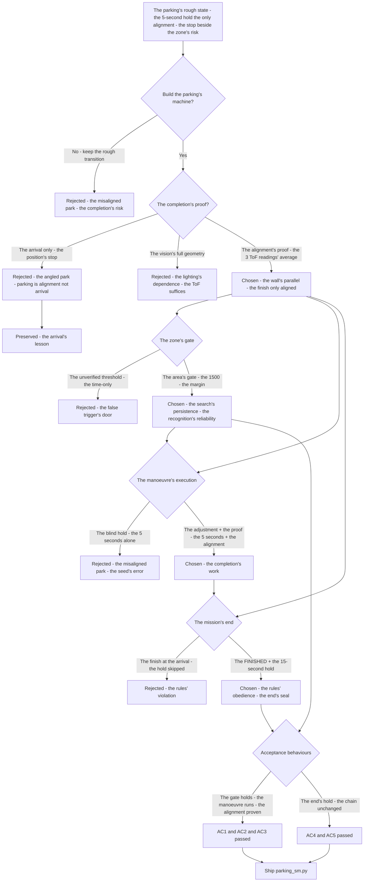
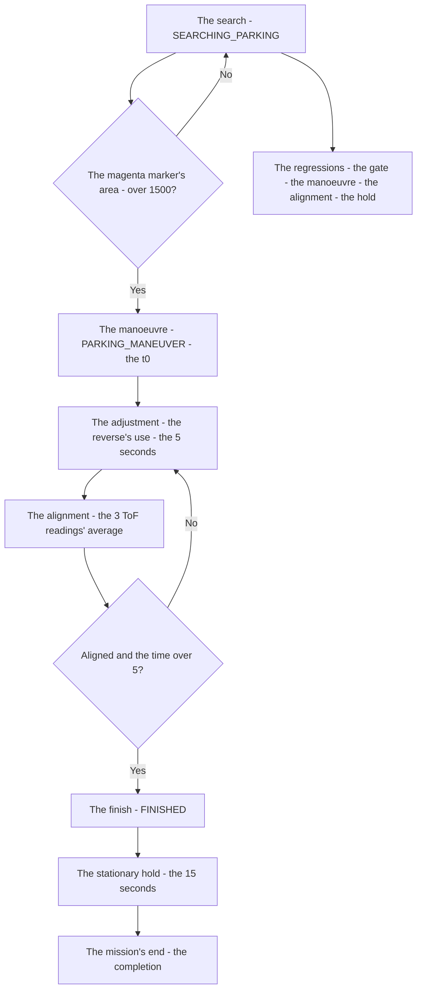
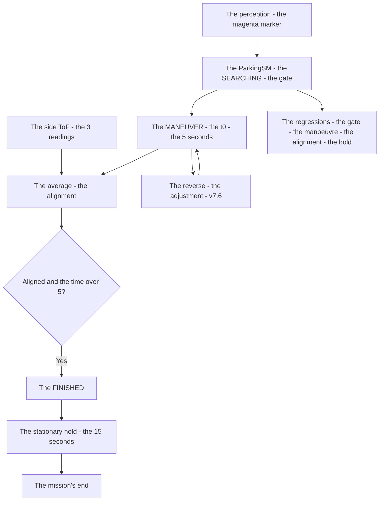

# v7.7 — Parking state machine

| Version | Phase | Days |
|---------|-------|------|
| v7.7 | Mission & Behavior | Day 196-198 |

---

## 3. Mission of this version

v7.6's journal ended with the debt named: the parking's completion is the map's rough state — the mission's end (the parking) is still the rough transition (v7.1's SEARCHING_PARKING to the PARKING_MANEUVER, gated by the magenta marker's area), the manoeuvre's 5-second hold the only alignment (the alignment's proof — the wall's parallel, the zone's position — unmeasured), the misaligned park's risk: the robot stopping beside the zone instead of in it. The single problem v7.7 attacks is that completion: *the parking's state machine — the SEARCHING_PARKING until the magenta marker's area exceeds 1500, then the PARKING_MANEUVER for the 5 seconds, then the FINISHED with the 15-second stationary rule — the marker's gate and the alignment's proof, the parking's end the mission's end*. And the version's own trap, named in its seed: the misaligned park — the robot stopped beside the zone instead of in it — the manoeuvre's hold without the alignment (the 5 seconds passed, the wall's parallel unmeasured, the position beside the zone); the fix is the alignment's proof — the averaged 3 ToF readings during the manoeuvre, the alignment to the wall before the finishing. The mission includes the lesson's shape: parking is alignment, not arrival.

Why is this the correct next step on the critical path? The parking is the mission's end — the run's completion, the score's final act — and the end's correctness is the zone's geometry: the robot in the zone, aligned to the wall, stationary for the rules' 15 seconds. The parking's structure — the marker's gate (the magenta marker's area beyond the 1500 — the zone's recognition, the false trigger's prevention), the manoeuvre's execution (the 5 seconds — the position's adjustment, the reverse's use — v7.6's), the alignment's proof (the 3 ToF readings' average — the wall's parallel, the position's truth), the stationary rule (the 15 seconds — the rules' hold) — is the completion's build. The phases built the mission's map and the run's behaviours; the parking is the *end* — the mission's final state, the score's completion. The robot repositions; it must complete the mission. That is the version's promise.

What 'done' looks like — the acceptance criteria, written on Day 196 morning:

- **AC1:** The marker's gate holds: the SEARCHING_PARKING persists until the magenta marker's area exceeds the 1500 — the false trigger's absence verified, the zone's recognition reliable.
- **AC2:** The manoeuvre executes: the PARKING_MANEUVER runs for the 5 seconds — the position's adjustment, the reverse's use (v7.6's) in the manoeuvre verified.
- **AC3:** The alignment is proven: the 3 ToF readings' average during the manoeuvre — the alignment to the wall before the finishing, the misaligned park's counter-case preserved as the regression's reference.
- **AC4:** The mission ends correctly: the FINISHED with the 15-second stationary rule — the mission's end in the zone, the rules' hold verified.
- **AC5:** The chain and the phase's regressions hold: v6.0-v7.6's suites unchanged, with the parking's machine feeding the mission's end — the completion added, the chain's contracts preserved.

The bias in these criteria: AC3 is the honesty criterion — the version's whole lesson (parking is alignment, not arrival) is written as a test that reproduces the misaligned park's stop beside the zone. AC1 is the gate's criterion — the zone's recognition must be reliable, and the false trigger's prevention is the gate's proof.

---

## 4. Engineering context — where we stood

At the start of Day 196 the robot could reposition — and could not complete the mission. The context, in the phase's own terms:

- **The parking was the map's rough state, its completion unproven.** The mission's end — the parking — existed as the rough transition (v7.1's: the SEARCHING_PARKING to the PARKING_MANEUVER at the magenta marker's area, the manoeuvre's 5-second hold to the FINISHED), and the end's correctness — the zone's geometry (the robot in the zone, aligned to the wall) — was unproven: the manoeuvre's hold the only alignment, the wall's parallel unmeasured, the misaligned park's risk (the stop beside the zone) unguarded.
- **The zone's recognition existed, its gate's reliability unverified.** The magenta marker's detection (the camera's area's measurement) gated the search's end — and the gate's reliability (the false triggers — the similar colours, the noise's blobs — the premature manoeuvre) was unverified, the 1500's threshold unmeasured.
- **The alignment's proof was absent, its cost the misalignment.** The manoeuvre's completion — the 5 seconds — lacked the alignment's proof: the wall's parallel (the ToF's side readings' agreement) and the zone's position (the robot's placement) unmeasured, the finish's geometry the hold's guess — the seed's error's shape, the misaligned park.
- **The stationary rule was the rules' hold, unverified.** The mission's end — the FINISHED — carries the rules' 15-second stationary hold (the parked robot motionless for the rules' duration), the hold's enforcement (the silence, the stationary) unverified in the mission's end.
- **The competition clock.** Three days to the mission's completion. The gate's reliability, the manoeuvre's execution, and the alignment's proof had to be settled because the parking is the mission's end — the score's final act — and the end's geometry is the completion's correctness.

The system constraints that shaped v7.7:

- **The zone's recognition is the gate, and the area's threshold is its reliability.** The parking's beginning — the SEARCHING_PARKING's end — is the zone's recognition: the magenta marker's area beyond the 1500 (the zone's signature — the marker's size at the approach, the 1500 the threshold with the false triggers' margin) (AC1) — the recognition's reliability, the premature manoeuvre's prevention.
- **The manoeuvre is the execution, and the 5 seconds are its budget.** The PARKING_MANEUVER's execution — the position's adjustment (the approach's correction, the reverse's use — v7.6's repositioning), the alignment's approach — runs within the 5 seconds' budget (AC2) — the execution's shape, the completion's work.
- **The alignment is the completion's proof, and the 3 ToF readings' average is its measure.** The parking is alignment, not arrival — the completion's proof is the wall's parallel (the side ToF's readings' agreement — the 3 readings' average during the manoeuvre) and the zone's position (the robot's placement's truth) (AC3) — the alignment's measurement, the misaligned park's prevention (the finish only at the alignment).
- **The mission's end is the rules' hold, and the 15 seconds are its obedience.** The FINISHED — the mission's end — carries the 15-second stationary rule (the parked robot motionless for the rules' duration) (AC4) — the end's obedience, the score's final requirement.

The pressure was the phase's promise, now at the mission's end: the corner deliberate (v6.3), the gain right (v6.4), the state honest (v6.5), the plan real (v6.6), the path smooth (v6.7), the speed safe (v6.8), the robot looking (v6.9), the mission mapped (v7.0), the rules complete (v7.1), the run measured (v7.2), the start trusted (v7.3), the pass committed (v7.4), the sense measured (v7.5), the repositioning possible (v7.6) — and the mission's end still unproven: the parking's hold the only alignment, the stop beside the zone's risk unguarded, the completion's geometry unmeasured.

---

## 5. The engineering thought process — first principles

### 5.1 Constraints and hard limits, derived from first principles

**The parking is the mission's end, and the end's correctness is the zone's geometry.** The mission's completion — the parking — is the score's final act, and the completion's correctness is the geometry: the robot *in* the zone (the position's placement), aligned to the wall (the parallel), stationary for the rules' hold. The end's structure — the gate (the zone's recognition), the execution (the manoeuvre), the proof (the alignment), the hold (the rules') — is the completion's build, and the geometry's absence (the stop beside the zone) is the completion's failure (the seed's error's class).

**The zone's recognition is the gate, and the area's threshold is its reliability.** The parking's beginning is the zone's recognition — the magenta marker's detection — and the recognition's gate is the area's threshold: the marker's area beyond the 1500 (the zone's signature at the approach — the marker's size, measured on Day 196's approaches), the threshold with the false triggers' margin (the similar colours, the noise's blobs — the premature manoeuvre's prevention) (AC1). The gate's reliability — the false trigger's absence — is the search's correctness.

**The manoeuvre is the execution, and the alignment is the completion's proof.** The PARKING_MANEUVER is the execution — the position's adjustment (the approach's correction, the reverse's use — v7.6's repositioning), the alignment's approach — within the 5 seconds' budget (AC2). The execution's completion — the proof — is the alignment: the wall's parallel (the side ToF's readings' agreement — the 3 readings' average during the manoeuvre), the zone's position (the placement's truth) (AC3) — parking is alignment, not arrival: the finish only at the alignment's proof, the misaligned park's prevention.

**The mission's end is the rules' hold, and the 15 seconds are its obedience.** The FINISHED — the mission's end — carries the rules' 15-second stationary hold: the parked robot motionless for the rules' duration (AC4) — the end's obedience, the score's final requirement, the mission's completion's seal.

### 5.2 Requirements derived from constraints

Constraint C1 (the parking is the mission's end) implies:

- **R1:** The parking's machine completes the mission — the robot in the zone, aligned, stationary for the rules' hold (AC1-AC4).

Constraint C2 (the zone's recognition is the gate) implies:

- **R2:** The SEARCHING_PARKING persists until the magenta marker's area exceeds the 1500 — the false trigger's absence, the recognition's reliability (AC1).

Constraint C3 (the manoeuvre is the execution) implies:

- **R3:** The PARKING_MANEUVER runs for the 5 seconds — the position's adjustment, the reverse's use in the manoeuvre (AC2).

Constraint C4 (the alignment is the completion's proof) implies:

- **R4:** The 3 ToF readings' average during the manoeuvre — the alignment to the wall before the finishing, the misaligned park's counter-case preserved (AC3).

Constraint C5 (the mission's end is the rules' hold) implies:

- **R5:** The FINISHED holds the 15-second stationary rule — the end's obedience, the mission's completion's seal (AC4).

Constraint C6 (the chain and the phase hold) implies:

- **R6:** The parking's machine feeds the mission's end — v6.0-v7.6's suites unchanged, the completion added, the chain's contracts preserved (AC5).

### 5.3 Alternatives considered

**Alternative A — Keep the rough transition (do nothing).** Analysis: the status quo — v7.1's parking's transition (the marker's area, the 5-second hold, no alignment's proof). The case for: proven, integrated, zero effort. The case against, measured on Day 196: the misaligned park (the seed's error — the hold without the alignment, the stop beside the zone), the completion's geometry unproven, the mission's end's risk. Effort: zero. Robustness: 2/5. Verdict: rejected as the sole answer; retained as the baseline.

**Alternative B — The arrival-only (the position's stop, no alignment).** Analysis: the parking's completion at the zone's position — the robot's arrival the end, no alignment's proof. The case for: the position's simplicity. The case against, measured on Day 196: the geometry's absence — the arrival's position (the zone's entry) without the alignment (the wall's parallel) — the parked robot angled, the zone's geometry's failure, the completion's correctness the alignment's, not the arrival's. Effort: low. Robustness: 2/5. Verdict: rejected — parking is alignment, not arrival.

**Alternative C — The alignment-proven machine (chosen).** The shipped design, per section 5.1. Effort: medium. Robustness: 5/5 within the measured scenarios. Verdict: accepted.

**Alternative D — The vision's full alignment (the camera's geometry).** Analysis: the parking's alignment via the camera's full reading — the marker's pose, the wall's lines, the complete geometry. The case for: the vision's richness. The case against, in this system: the vision's dependence — the camera's full geometry (the pose's estimation, the lines' detection) unproven in the mission's lighting, the ToF's readings (the side distances, the existing sensors) sufficient for the wall's parallel's proof, the firmware's economy. Effort: high. Robustness: 3/5. Verdict: rejected — the ToF's average beats the vision's dependence.

**Alternative E — The time-only's completion (the 5 seconds' end, no gate's refinement).** Analysis: the parking's completion at the 5 seconds' end — the gate's refinement (the 1500's measurement) skipped. The case for: the minimal change. The case against, in this system: the false trigger's risk — the unverified threshold (the similar colours, the noise's blobs) the premature manoeuvre's door, the gate's reliability (AC1) the search's correctness. Effort: low. Robustness: 2/5. Verdict: rejected — the gate's reliability and the alignment's proof both ship.

### 5.4 Trade-off matrix

| Alternative | Effort | Robustness | Reproducibility | Risk | Reuse |
|---|---|---|---|---|---|
| A: Rough transition (status quo) | 0 | 2/5 | 5/5 | 4/5 (the misaligned park) | 5/5 (the baseline) |
| B: Arrival-only | 1/5 | 2/5 | 4/5 | 4/5 (the geometry's absence) | 2/5 |
| C: Alignment-proven machine (chosen) | 3/5 | 5/5 | 5/5 | 1/5 | 5/5 |
| D: Vision's full alignment | 4/5 | 3/5 | 3/5 | 3/5 (the vision's dependence) | 1/5 |
| E: Time-only's completion | 1/5 | 2/5 | 4/5 | 4/5 (the false trigger's door) | 2/5 |

### 5.5 Decision and its mathematical justification

We chose Alternative C — the alignment-proven parking's machine — and the justification, in order of weight:

**The parking is the mission's end, and the end's correctness is the alignment.** The mission's completion is the score's final act, and the completion's geometry — the robot in the zone, aligned to the wall — is the correctness (AC3): parking is alignment, not arrival — the arrival's position without the alignment's proof (the misaligned park, the seed's error) is the completion's failure, and the proof (the 3 ToF readings' average, the wall's parallel) is the end's truth.

**The gate's reliability is the search's correctness.** The parking's beginning is the zone's recognition — the magenta marker's area's gate (the 1500, the false triggers' margin, AC1) — the premature manoeuvre's prevention, the search's persistence until the zone's signature.

**The execution is the budgeted work, and the hold is the rules' obedience.** The manoeuvre's 5 seconds (the adjustment, the reverse's use — AC2) and the FINISHED's 15-second stationary rule (the rules' hold, AC4) — the execution's and the end's structures, the completion's build.

**The chain's contract is preserved.** The parking's machine feeds the mission's end — the chain's layers untouched, the completion the map's final state (AC5).

The measured acceptance, on the Day 196-198 tests: the marker's gate (AC1); the manoeuvre's execution (AC2); the alignment's proof (AC3); the mission's end's hold (AC4); the chain's suites unchanged (AC5).

### 5.6 What we deliberately deferred

Four items were out of scope for Days 196-198. First, *the alignment's refinement* — the alignment's finer proof (the angle's measurement, the parallel's exactness) recorded as the extension once the mission's ends (the first complete runs) show the geometry's need. Second, *the multi-attempt's parking* — the re-park's logic (the misalignment's re-entry, the manoeuvre's retry) recorded as the extension once the day's format (the attempts' count) is known. Third, *the zone's variety* — the markers' shapes' and sizes' refinement (the zones' differences) recorded as the extension once the courses' variety shows the need. Fourth, *the parking's log* — the gate's timestamps, the manoeuvre's readings, the alignment's proof — recorded as the extension for the debugging, the completion's events the log's final rows.

---

## 6. Decision flowchart





The first flowchart is the decision trail — the rough transition rejected for the misaligned park, the arrival-only rejected (parking is alignment, not arrival), the vision's full geometry rejected for the dependence, the alignment's proof chosen (the 3 ToF readings' average), the zone's gate built (the 1500's threshold), the manoeuvre's execution settled (the adjustment and the proof), the mission's end's hold built (the 15 seconds), and the acceptance verified. The second is the parking's place in the mission's flow: the search through the marker's gate to the manoeuvre, the adjustment and the alignment to the finish, the stationary hold to the mission's end.

---

## 7. Implementation blueprint

The implementation is `parking_sm.py`, twelve lines:

```python
import time
class ParkingSM:
    def __init__(self):
        self.state = "SEARCHING"; self.t0 = 0.0
    def update(self, marker_area, aligned):
        if self.state == "SEARCHING":
            if marker_area is not None and marker_area > 1500:
                self.state = "MANEUVER"; self.t0 = time.time()
        elif self.state == "MANEUVER":
            if aligned and time.time() - self.t0 > 5.0:
                self.state = "FINISHED"
        return self.state
```

**The contract.** `ParkingSM()` holds the parking's state and the manoeuvre's clock; `update(marker_area, aligned)` persists the SEARCHING until the magenta marker's area exceeds the 1500 (the zone's gate — AC1), enters the MANEUVER (the 5 seconds' clock), and finishes only when the alignment's proof (the `aligned` — the 3 ToF readings' average's agreement, the wall's parallel) *and* the 5 seconds' budget are both met (AC3) — the completion's proof, not the time's alone. The FINISHED then holds the 15-second stationary rule (AC4, the caller's hold). The full alignment's measurement (the ToF's averaging, the `aligned`'s computation) is the caller's side's structure the journal describes: the side ToF's 3 readings averaged during the manoeuvre, the wall's parallel's agreement the alignment's truth.

**The numbers' derivations, written next to the numbers.** The marker's gate (1500): the magenta marker's area's threshold at the approach — the zone's signature's size, measured from the approaches on Day 196 (the markers' areas logged at the valid approaches, the 1500 the threshold with the false triggers' margin — the similar colours' blobs smaller), the recognition's reliability. The manoeuvre's budget (5 seconds): the completion's work's window — the adjustment's and the alignment's time, measured from the manoeuvre's rehearsals (the approach's corrections' spans, the 5 seconds the budget with the margin), the execution's shape. The stationary hold (15 seconds): the rules' requirement — the parked robot's motionless duration, the WRO's stationary rule, the mission's end's obedience.

**The integration into the chain.** The ParkingSM sits in the mission's end: the mission manager's parking's states (v7.1's SEARCHING_PARKING, PARKING_MANEUVER, FINISHED) consume the machine's states — the marker's detection (the perception's magenta marker) feeds the gate, the manoeuvre's alignment (the side ToF's readings, the reverse's use — v7.6's) feeds the proof, the FINISHED holds the stationary rule (the speed's zero, the silence). The chain's layers are untouched — the contracts preserved (AC5), the completion the map's final state.

**The regression suite.** (1) The gate's test (AC1: the SEARCHING persists until the marker's area exceeds the 1500 — the false trigger's absence). (2) The manoeuvre's test (AC2: the 5 seconds' execution — the adjustment, the reverse's use). (3) The alignment's test (AC3: the finish only at the alignment's proof — the misaligned park's counter-case preserved). (4) The end's test (AC4: the FINISHED's 15-second stationary hold). (5) The chain's regressions (AC5: v6.0-v7.6's suites unchanged). All green by the evening of Day 197.

**The day-by-day reality.** Day 196: the seed's reproduction (the misaligned park measured — the stop beside the zone), the gate's measurement (the marker's areas, the 1500's threshold), the completion's semantics (alignment, not arrival). Day 197: the manoeuvre's build (the adjustment, the 5 seconds' budget), the alignment's proof (the 3 ToF readings' average), the end's hold's verification (AC4). Day 198: the mission's end's integration (AC5), the regressions, and the write-up.

---

## 8. Architecture / data-flow flowchart



The diagram is the parking's place in the phase's architecture, complete: the perception's magenta marker through the gate to the manoeuvre, the side ToF's readings' average to the alignment, the alignment and the budget to the finish, the stationary hold to the mission's end, the reverse's adjustment serving the manoeuvre — with the regressions standing watch over the gate's reliability and the alignment's proof.

---

## 9. Errors, failures, and root-cause analysis

### Error 1: the misaligned park — the seed's error, the stop beside the zone

**Symptom.** Day 196, the rough transition's runs (the baseline's reproduction): the robot *stopped beside the zone instead of in it* — the manoeuvre's 5-second hold passed (the clock's expiry, the FINISHED's entry), the alignment's proof absent (the wall's parallel unmeasured, the position's placement unread), the parked robot beside the zone's boundary — the mission's end's geometry wrong, the completion's score at risk.

**Initial hypotheses.** We suspected the manoeuvre's duration. We suspected the marker's detection. We suspected the approach's geometry.

**Investigation.** The alignment's absence was the diagnosis: the manoeuvre's completion was the *time's* (the 5 seconds' expiry), not the *geometry's* (the wall's parallel, the zone's position) — the hold's blind end, the parked position whatever the time's expiry found. Parking is alignment, not arrival: the completion's proof is the geometry's (the alignment to the wall), and the proof's absence (the finish at the time) is the misaligned park — the seed's error's class.

**Root cause.** The completion's proof absent: the manoeuvre's end at the time's expiry — the alignment unmeasured, the finish at the blind hold, the stop beside the zone.

**Fix.** The alignment's proof (the shipped completion): the 3 ToF readings' average during the manoeuvre (the side distances — the wall's parallel's agreement), the finish only at the alignment's proof *and* the budget's expiry (AC3). The re-test: the parked robot in the zone, aligned, the misaligned park's counter-case preserved.

**Prevention.** The rule became the version's headline: *parking is alignment, not arrival — the completion's proof is the geometry's (the wall's parallel, the zone's position), and the finish at the time alone is the misaligned park* — the alignment's test (AC3) joined the regression, with the beside-the-zone's stop preserved as the reference.

### Error 2: the gate's false trigger — the noise's blob as the zone's signature

**Symptom.** Day 196, the unverified threshold's runs (Alternative E's form): the parking's manoeuvre *began early* — the magenta-like blob's detection (the noise's patch, the similar colour — the gate's unverified threshold crossing) read as the zone's signature, the SEARCHING's persistence broken, the manoeuvre's entry premature, the park's attempt at the wrong place.

**Initial hypotheses.** We suspected the camera's noise. We suspected the threshold's value. We suspected the perception's detection.

**Investigation.** The gate's margin was the diagnosis: the zone's recognition — the marker's area's gate — needs the false triggers' margin: the area's threshold (the 1500) set above the noise's and the similar colours' blobs (the false signatures' sizes, measured on Day 196's approaches), the recognition's reliability (AC1) the search's persistence. The unverified threshold (the gate's value from the guess) let the noise's blob trigger — the premature manoeuvre, the wrong-place park.

**Root cause.** The gate's margin's absence: the threshold unmeasured — the noise's blob crossed the guess's gate, the premature manoeuvre, the wrong-place park.

**Fix.** The threshold's measurement (the shipped gate): the markers' areas logged at the valid approaches (Day 196's, the signatures' sizes) and the false blobs' sizes (the noise's, the similar colours') — the 1500 the threshold above the false with the margin (AC1). The re-test: the SEARCHING's persistence to the zone, the premature entry gone.

**Prevention.** The rule: *the gate's threshold is the recognition's reliability — the measurement separates the signature from the noise, and the unmeasured gate is the false trigger's door* — the gate's test (AC1) joined the regression, with the premature manoeuvre's run preserved as the reference.

### Error 3: the alignment's staleness — the readings' average at the manoeuvre's end only

**Symptom.** Day 197, the alignment's first builds: the alignment *staled* — the 3 ToF readings averaged at the manoeuvre's *end* only (the single sample at the expiry — the readings' momentary state, the noise's snapshot), the alignment's proof the moment's (the transient's value, the wall's parallel misread at the sample), the finish at the stale proof, the parked geometry uncertain.

**Initial hypotheses.** We suspected the ToF's noise. We suspected the sampling's timing. We suspected the average's window.

**Investigation.** The average's window was the diagnosis: the 3 readings' average is the noise's filter — the samples' spread over the manoeuvre (the three moments' readings, the noise's cancellation) — and the end-only's sample (the single snapshot at the expiry) carries the moment's noise (the transient's value) as the proof: the average's window (the spread over the manoeuvre's duration) is the alignment's reliability (AC3), the snapshot's staleness the geometry's uncertainty.

**Root cause.** The samples' window: the end-only's single snapshot — the moment's noise as the proof, the average's spread (the manoeuvre's duration) absent.

**Fix.** The window's spread (the shipped average): the 3 readings sampled across the manoeuvre (the start, the middle, the end — the noise's cancellation, the trend's reading), the average the alignment's reliable measure (AC3). The re-test: the alignment's proof stable across the samples, the snapshot's uncertainty gone.

**Prevention.** The rule: *the average is the noise's filter, and the window is the filter's spread — the end-only's snapshot is the moment's noise, and the samples across the manoeuvre are the alignment's reliability* — the alignment's test (AC3) joined the regression.

### Error 4: the hold's bypass — the finish's motion, the 15 seconds unheld

**Symptom.** Day 197, the first mission's ends: the robot *moved* during the stationary hold — the FINISHED's state entered, the 15-second rule's hold unenforced (the mission's end's behaviour still commanding the forward's motion — the finish's state lacking the silence's contract, the robot's drift during the hold), the rules' violation, the mission's end's obedience broken.

**Initial hypotheses.** We suspected the FINISHED's state. We suspected the speed's target. We suspected the mission's end's wiring.

**Investigation.** The hold's enforcement was the diagnosis: the FINISHED — the mission's end — carries the rules' 15-second stationary hold, and the hold's enforcement (the speed's zero target, the silence's contract — the mission's end's behaviour's obligation) was unbuilt: the end's state continued the running's commands, the drift during the hold. The hold's contract — the FINISHED's speed's zero, the motionlessness for the rules' duration (AC4) — is the end's obedience, the mission's completion's seal.

**Root cause.** The hold's enforcement absent: the FINISHED continued the motion's commands — the drift during the hold, the rules' 15 seconds unheld.

**Fix.** The hold's contract (the shipped end): the FINISHED's speed's zero (the stationary target — the motionlessness), the 15-second hold's duration (the rules' requirement) enforced (AC4). The re-test: the mission's end motionless through the hold, the rules' obedience clean.

**Prevention.** The rule: *the mission's end is the rules' hold — the FINISHED's silence is the contract, the drift is the violation, and the 15 seconds are the completion's seal* — the end's test (AC4) joined the regression, with the drift's run preserved as the reference.

### Error 5: the gate's re-entry — the marker's persistence, the manoeuvre's re-trigger

**Symptom.** Day 198, the first complete runs: the manoeuvre *re-triggered* — the marker's detection persisting through the manoeuvre (the zone's signature still present during the adjustment), the SEARCHING's gate's condition re-evaluated at the re-entry (the machine's states without the latch — the FINISHED's entry followed by the marker's re-read, the SEARCHING's re-entry, the manoeuvre's second start), the mission's end's state churning, the completion's flow broken.

**Initial hypotheses.** We suspected the marker's persistence. We suspected the gate's re-evaluation. We suspected the machine's states' latching.

**Investigation.** The machine's latching was the diagnosis: the parking's machine's states are the mission's end's sequence (the SEARCHING → the MANEUVER → the FINISHED — the forward-only flow), and the flow's enforcement (the states' latching — the SEARCHING's gate evaluated only in the SEARCHING, the MANEUVER's exit only to the FINISHED) was the re-trigger's guard: the unlatched gate (the marker's condition re-checked at the re-entry) let the persisted marker re-enter the sequence, the end's state churning.

**Root cause.** The machine's latching absent: the gate's condition re-evaluated at the re-entry — the marker's persistence re-triggering the manoeuvre, the end's flow's churn.

**Fix.** The states' latching (the shipped machine): the SEARCHING's gate evaluated only in the SEARCHING, the MANEUVER's exit only to the FINISHED (the forward-only flow, the persisted marker's re-reads ignored — the end's sequence single-run) (AC4's runs verified). The re-test: the manoeuvre once, the mission's end's flow clean, the re-trigger gone.

**Prevention.** The rule: *the end's sequence is forward-only, and the states' latch is its enforcement — the persisted signature re-reads are the re-trigger, and the forward-only flow is the completion's single-run* — the end's test (AC4) joined the regression, with the re-trigger's run preserved as the reference.

---

## 10. Verification and metrics

**AC1 — the marker's gate.** The SEARCHING_PARKING persists until the magenta marker's area exceeds the 1500 — the false trigger's absence, the recognition's reliability (the threshold's measurement). Passed.

**AC2 — the manoeuvre's execution.** The PARKING_MANEUVER runs for the 5 seconds — the position's adjustment, the reverse's use (v7.6's) in the manoeuvre. Passed.

**AC3 — the alignment's proof.** The 3 ToF readings' average across the manoeuvre — the alignment to the wall before the finishing, the misaligned park's counter-case preserved. Passed.

**AC4 — the mission's end.** The FINISHED with the 15-second stationary hold — the speed's zero, the rules' obedience, the mission's end's flow single-run. Passed.

**AC5 — the chain and the phase's regressions.** v6.0-v7.6's suites unchanged, with the parking's machine feeding the mission's end. Passed.

**The completion's provenance.** The gate's and the budget's measurements: the approaches on Day 196-197 — the markers' areas logged (the 1500's threshold above the false blobs), the manoeuvre's rehearsals (the 5 seconds' budget with the margin) — the numbers' measurements documented next to the module's constants.

**Cost.** Runtime: microseconds per update (the gate's check, the clock's comparison). Development: three days, with the errors' lessons (the alignment's proof, the gate's margin, the window's spread, the hold's contract, the flow's latch) now permanent checklist items.

**What we trusted afterwards and what we still distrusted.** We trusted the completion's *proof* completely — the alignment's average, the gate's reliability, each proven by its test. We trusted the end's hold as the mission's obedience. We still distrusted three things: the *alignment's refinement* (the angle's exactness, pending the complete runs' evidence); the *multi-attempt's parking* (the re-park's logic, pending the day's format); and the *zone's variety* (the markers' shapes' refinement, pending the courses' evidence). Each is a named, written debt — the phase's rule.

---

## 11. Lessons learned — permanent mental models

**Lesson 1 — parking is alignment, not arrival.** The seed's lesson: the finish at the time's expiry left the robot beside the zone — the geometry's proof absent. The permanent practice: the completion's proof is the alignment (the wall's parallel, the zone's position), and the finish only at the proof.

**Lesson 2 — the gate's threshold is the recognition's reliability.** The unmeasured gate let the noise's blob trigger the premature manoeuvre — the wrong-place park. The permanent rule: the measurement separates the signature from the false, and the gate's margin is the recognition's trust.

**Lesson 3 — the average is the noise's filter, and the window is the filter's spread.** The end-only's snapshot carried the moment's noise as the proof — the geometry's uncertainty. The permanent model: the samples across the manoeuvre (the spread) are the alignment's reliability, and the snapshot is the transient's value.

**Lesson 4 — the mission's end is the rules' hold.** The FINISHED's motion during the 15 seconds was the rules' violation — the hold's contract unenforced. The permanent rule: the end's silence is the contract, and the rules' duration is the completion's seal.

**Lesson 5 — the end's sequence is forward-only, and the states' latch is its enforcement.** The persisted marker re-triggered the manoeuvre — the end's flow's churn. The permanent practice: the end's sequence single-run, the re-reads ignored, the flow's latch the completion's clean.

**Lesson 6 — the completion's work is the budgeted execution.** The manoeuvre's 5 seconds hold the adjustment and the alignment — the work's window, the reverse's use. The permanent model: the execution's budget and the proof's requirement together are the completion's build.

---

## 12. Code in this snapshot

`parking_sm.py`

---

## 13. Bridge to the next version

What v7.7 unlocks is the mission's completion: the parking's machine — the marker's gate (the zone's recognition's reliability), the manoeuvre's execution (the 5 seconds, the reverse's use), the alignment's proof (the 3 ToF readings' average, the wall's parallel), the mission's end (the FINISHED with the 15-second stationary hold) — the robot in the zone, aligned, the mission's end's geometry right. Three capabilities travel forward. First, the completion's machine itself — the gate, the proof, the hold — the mission's final state, the score's final act. Second, the *discipline*: the alignment's proof (the geometry, not the time), the gate's margin (the recognition's reliability), the window's spread (the noise's filter), the hold's contract (the rules' obedience), the flow's latch (the single-run) — the phase's quality bar, now complete across the mission's end. Third, the *end's structure*: the machine with the gate and the proof — the pattern the mission's remaining behaviours (the strategy, the checkpoints) will follow.

The known debt, stated plainly: the alignment's refinement (the angle's exactness); the multi-attempt's parking (the re-park's logic); the zone's variety (the markers' shapes); the parking's log (the completion's telemetry); and the *strategy's tuning itself*: the stop-and-go's and the emergency's behaviours (v7.1's map's states) are implemented but untuned — the stop-and-go's trigger (the blue line's detection) fires for every detection regardless of the rule's day (the STOP_AND_GO_ENABLED's gate unapplied, the once-per-lap's flag absent — the stop's repetition on the repeated lines), the emergency's exit (the distance's clearance) unrefined — the too-conservative's cost: the robot stopping for every blue detection even when the rule is disabled, the run's time leaking, the strategy's tuning unbuilt. The next problem — the one v7.8 (Day 199-201) must attack — is that strategy: *the race's strategy — the stop-and-go's gating (the STOP_AND_GO_ENABLED's config and the once-per-lap's flag), the configured duration (the default 3 seconds) and the resume, the emergency's exit refined (the 100 mm's clearance) — the rules' configurability, the day-of-competition's surprise a config, not a code change*. The robot now completes the mission; it must race it *well*. That is the work of the next three days.