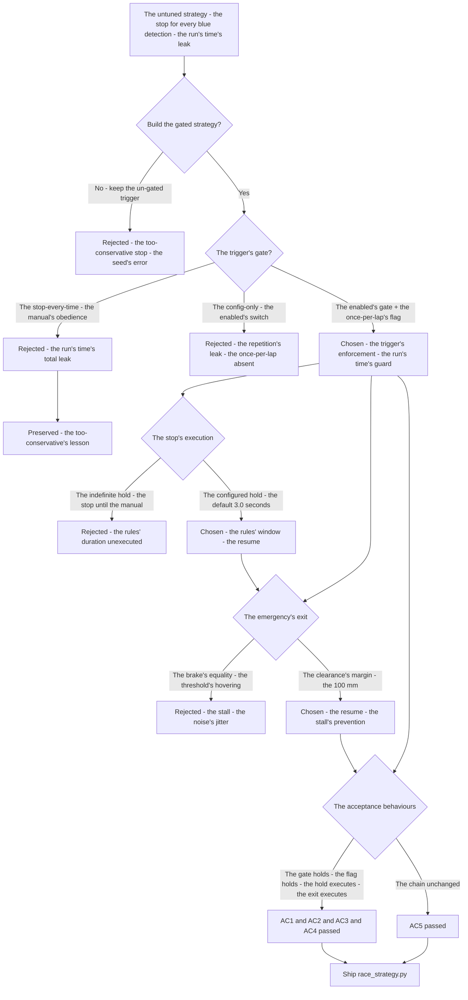
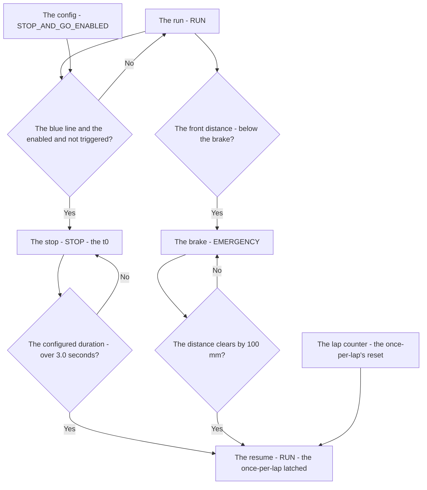
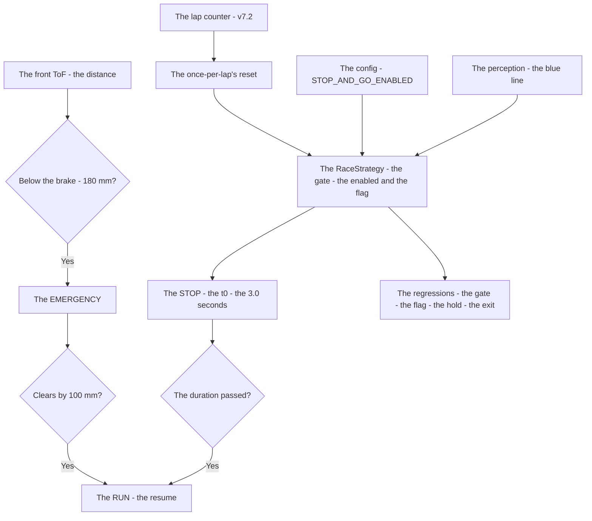

# v7.8 — Race strategy

| Version | Phase | Days |
|---------|-------|------|
| v7.8 | Mission & Behavior | Day 199-201 |

---

## 3. Mission of this version

v7.7's journal ended with the debt named: the race's strategy is the map's untuned states — the mission's run (the STOP_AND_GO and the EMERGENCY, v7.1's map's states) implemented but untuned: the stop-and-go's trigger (the blue line's detection) fires for every detection regardless of the rule's day (the STOP_AND_GO_ENABLED's gate unapplied, the once-per-lap's flag absent — the stop's repetition on the repeated lines), the emergency's exit (the distance's clearance) unrefined — the too-conservative's cost: the robot stopping for every blue detection even when the rule is disabled, the run's time leaking, the strategy's tuning unbuilt. The single problem v7.8 attacks is that strategy: *the race's strategy — the stop-and-go's gating (the STOP_AND_GO_ENABLED's config and the once-per-lap's flag), the configured duration (the default 3 seconds) and the resume, the emergency's exit refined (the 100 mm's clearance) — the rules' configurability, the day-of-competition's surprise a config, not a code change*. And the version's own trap, named in its seed: the too-conservative stop — the robot stopped for every blue detection even when the rule disabled — the trigger's gate absent, the run's time's leak; the fix is the gating — the STOP_AND_GO_ENABLED's config (the rule's day's switch) and the once-per-lap's flag (the repeated lines' detections ignored after the trigger). The mission includes the lesson's shape: rules must be configurable — the day-of-competition's surprise is a config, not a code change.

Why is this the correct next step on the critical path? The mission is mapped (v7.0), the rules complete (v7.1), the run measured (v7.2), the start trusted (v7.3), the pass committed (v7.4), the sense measured (v7.5), the repositioning possible (v7.6), the completion proven (v7.7) — and the race's strategy remains the untuned middle: the stop-and-go and the emergency, the mission's behaviours under the day's rules. The surprise rules (the day-of-competition's stop's requirement) are the WRO's reality — the rules' booklet changes per the round — and the strategy's shape — the gate (the enabled's config — the rule's day's switch, the once-per-lap's flag — the stop's repetition's guard), the hold (the configured duration — the default 3 seconds — the stop's window), the exit (the emergency's brake at the front distance's breach, the resume at the 100 mm's clearance — the clearance's margin above the sensor's noise) — is the race's obedience: the robot stops when the day's rule says stop, and only then. The robot completes the mission (v7.7); it must race it *well*. That is the version's promise.

What 'done' looks like — the acceptance criteria, written on Day 199 morning:

- **AC1:** The trigger's gate holds: the blue line's detection triggers the STOP_AND_GO only when the STOP_AND_GO_ENABLED's config is true — the disabled day's detections ignored, the too-conservative stop's counter-case preserved as the regression's reference.
- **AC2:** The once-per-lap's flag holds: the STOP_AND_GO triggers once per lap — the repeated blue lines (the same marker's re-detections on the repeated laps) don't re-stop the robot.
- **AC3:** The configured hold executes: the STOP_AND_GO holds for the configured duration (the default 3.0 seconds) — the stop's window, then the resume to the RUN.
- **AC4:** The emergency's exit executes: the EMERGENCY brake holds until the front distance clears the brake's threshold by the 100 mm — the resume after the clearance, the stall's absence verified.
- **AC5:** The chain and the phase's regressions hold: v6.0-v7.7's suites unchanged, with the strategy feeding the mission's map's states — the tuning added, the chain's contracts preserved.

The bias in these criteria: AC1 is the honesty criterion — the version's whole lesson (rules must be configurable — the day-of-competition's surprise is a config, not a code change) is written as a test that reproduces the too-conservative stop's run (the disabled rule, the robot still stopping). AC2 is the race's criterion — the repeated lines are the run's reality (the laps pass the same markers), and the once-per-lap's flag is the run's time's guard.

---

## 4. Engineering context — where we stood

At the start of Day 199 the robot could complete the mission — and could not race it well. The context, in the phase's own terms:

- **The strategy was the map's untuned states, its gates unbuilt.** The race's strategy — the STOP_AND_GO and the EMERGENCY (v7.1's map's states) — existed as the implemented behaviours (the blue line's detection triggers the stop, the front distance's breach triggers the brake), and the strategy's gates — the enabled's config (the rule's day's switch), the once-per-lap's flag (the repetition's guard), the exit's clearance (the resume's margin) — were unbuilt: the stop's trigger un-gated, the too-conservative's cost (the stop for every detection) leaking the run's time.
- **The rules' configurability was absent, its cost the code's change.** The day-of-competition's surprise rules (the stop's requirement, the duration) — the WRO's per-round reality — were hard-coded in the behaviours: the rule's day's change meant the code's change, the last-minute's recompile at the competition, the surprise's cost the run's risk.
- **The emergency's exit was the brake's only, its resume unrefined.** The EMERGENCY brake (v7.1's: the front distance below the brake's threshold — the 180 mm) held the robot — and the exit's structure (the resume's condition — the distance's clearance above the threshold, the 100 mm's margin over the sensor's noise) was unbuilt: the robot stopped at the brake, the resume's stall (the jitter around the threshold — the noise's hovering) unguarded.
- **The run's time was the race's score, its leaks unmeasured.** The competition's scoring (the run's time, the mission's completion) — the strategy's tuning's cost: the stop's repetition (the repeated lines' re-stops), the trigger's over-eagerness (the disabled rule's day) — the run's time's leaks, the race's score's drain.
- **The competition clock.** Three days to the strategy's tuning. The gating, the duration, and the exit had to be settled because the strategy is the race's obedience — the day's rules' execution — and the tuning is the race's score.

The system constraints that shaped v7.8:

- **The strategy is the rules' execution, and the gate is the trigger's enforcement.** The stop-and-go's trigger (the blue line's detection — the perception's marker) must fire only when the day's rule requires the stop: the STOP_AND_GO_ENABLED's config (the rule's day's switch — the surprise's gate) and the once-per-lap's flag (the repeated lines' detections — the re-stop's prevention) (AC1-AC2) — the trigger's enforcement, the too-conservative stop's fix.
- **The stop is the configured hold, and the duration is its window.** The STOP_AND_GO's execution — the held stop (the robot's silence at the marker) — runs for the configured duration (the default 3.0 seconds — the rule's typical stop's window, the config's value), then resumes the run (AC3) — the stop's obedience, the rules' duration's execution.
- **The emergency is the safety's brake, and the exit is the clearance's margin.** The EMERGENCY brake (the front distance below the brake's threshold — the 180 mm) is the safety's hold — and the exit is the clearance's measure: the resume when the front distance clears the threshold by the 100 mm (the margin above the sensor's noise — the stall's prevention) (AC4) — the safety's resume, the run's continuation.
- **The race's score is the run's time, and the tuning is its cost.** The strategy's tuning — the gate's and the duration's and the exit's numbers — is the run's time's shape (AC5) — the race's score, the rules' obedience without the leaks.

The pressure was the phase's promise, now at the race's tuning: the corner deliberate (v6.3), the gain right (v6.4), the state honest (v6.5), the plan real (v6.6), the path smooth (v6.7), the speed safe (v6.8), the robot looking (v6.9), the mission mapped (v7.0), the rules complete (v7.1), the run measured (v7.2), the start trusted (v7.3), the pass committed (v7.4), the sense measured (v7.5), the repositioning possible (v7.6), the completion proven (v7.7) — and the race's strategy still untuned: the stop's trigger un-gated, the run's time leaking, the day's surprise a code's change.

---

## 5. The engineering thought process — first principles

### 5.1 Constraints and hard limits, derived from first principles

**The strategy is the rules' execution, and the surprise is a config, not a code change.** The race's strategy — the stop-and-go and the emergency — executes the day's rules, and the day-of-competition's surprise rules (the stop's requirement, the duration) are the WRO's reality: the rules' booklet changes per the round, and the strategy's responsiveness (the config's gate, the duration's parameter) — not the code's change — is the execution's shape (the seed's lesson, the version's headline). The surprise's cost (the last-minute's recompile, the run's risk) is the un-configurable's price.

**The trigger's gate is the enforcement, and the once-per-lap is the repetition's guard.** The stop-and-go's trigger (the blue line's detection) must fire only when the rule requires: the STOP_AND_GO_ENABLED's config (the rule's day's switch — the disabled day's detections ignored) and the once-per-lap's flag (the first trigger's latch — the repeated lines' re-detections ignored until the lap's reset) (AC1-AC2) — the trigger's enforcement, the too-conservative stop's fix, the run's time's guard.

**The stop is the configured hold, and the resume is its end.** The STOP_AND_GO's execution — the held stop — runs for the configured duration (the default 3.0 seconds — the rule's stop's window, measured from the rule's requirement and the mission's map's expectations), then resumes the run (AC3) — the rules' duration's obedience, the run's continuation after the hold.

**The emergency is the safety's brake, and the exit is the clearance's margin.** The EMERGENCY brake (the front distance below the brake's threshold — v7.1's 180 mm) is the safety's hold — and the exit is the clearance's measure: the resume when the front distance clears the threshold by the 100 mm (the margin above the sensor's noise and the position's jitter — the stall's prevention, AC4) — the safety's resume, the run's continuation.

**The race's score is the run's time, and the tuning is its cost.** The strategy's tuning — the gate's and the duration's and the exit's numbers — shapes the run's time (AC5): the obedience's stops (the rule's days' holds) without the leaks (the disabled days' stops, the repeated lines' re-stops, the emergency's stalls) — the race's score, the mission's completion at the run's best.

### 5.2 Requirements derived from constraints

Constraint C1 (the strategy is the rules' execution) implies:

- **R1:** The strategy's states execute the day's rules — the stop's and the emergency's behaviours configured, the surprise a config, not a code change (AC1-AC4).

Constraint C2 (the trigger's gate is the enforcement) implies:

- **R2:** The blue line's detection triggers the STOP_AND_GO only when the STOP_AND_GO_ENABLED's config is true — the disabled day's detections ignored (AC1).

Constraint C3 (the once-per-lap is the repetition's guard) implies:

- **R3:** The STOP_AND_GO triggers once per lap — the repeated blue lines' detections ignored after the trigger (AC2).

Constraint C4 (the stop is the configured hold) implies:

- **R4:** The STOP_AND_GO holds for the configured duration (the default 3.0 seconds), then resumes the run (AC3).

Constraint C5 (the emergency's exit is the clearance's margin) implies:

- **R5:** The EMERGENCY brake resumes when the front distance clears the brake's threshold by the 100 mm — the stall's absence (AC4).

Constraint C6 (the chain and the phase hold) implies:

- **R6:** The strategy feeds the mission's map's states — v6.0-v7.7's suites unchanged, the tuning added, the chain's contracts preserved (AC5).

### 5.3 Alternatives considered

**Alternative A — Keep the un-gated trigger (do nothing).** Analysis: the status quo — v7.1's stop-and-go (the blue line's detection fires the stop, no gates). The case for: proven, integrated, zero effort. The case against, measured on Day 199: the too-conservative stop (the seed's error — the stop for every detection even when the rule disabled), the run's time's leak, the surprise's code's change. Effort: zero. Robustness: 2/5. Verdict: rejected as the sole answer; retained as the baseline.

**Alternative B — The config-only's gate (the enabled's switch, no per-lap's flag).** Analysis: the stop-and-go gated by the STOP_AND_GO_ENABLED's config alone — the disabled day's detections ignored, the enabled day's every detection stopping. The case for: the minimal gate. The case against, measured on Day 199: the repetition's leak — the enabled day's repeated lines (the same marker's re-detections on the repeated laps) re-stop the robot, the run's time's drain, the once-per-lap's guard absent. Effort: low. Robustness: 3/5. Verdict: rejected — the gate alone leaks the repetition's cost.

**Alternative C — The gated strategy machine (chosen).** The shipped design, per section 5.1. Effort: medium. Robustness: 5/5 within the measured scenarios. Verdict: accepted.

**Alternative D — The predictive strategy (the vision's anticipation).** Analysis: the stop's trigger via the vision's anticipation — the blue line's detection *ahead* of the marker (the camera's lookahead — the stop's geometry precomputed at the approach). The case for: the strategy's smoothness. The case against, in this system: the vision's dependence — the lookahead's geometry (the camera's distance's estimation) unproven in the mission's lighting, the detection's confidence (the line's recognition's false rates) unmeasured, the firmware's economy. Effort: high. Robustness: 3/5. Verdict: rejected — the config's gate beats the vision's dependence.

**Alternative E — The stop-every-time (the manual's rule's obedience).** Analysis: the stop-and-go's trigger un-gated by design — the robot stops at every blue line, the day's rule's requirement read as every detection's requirement. The case for: the obedience's simplicity. The case against, measured on Day 199: the run's time's total leak — the disabled days' stops (the rule's absence still stopping the robot), the repetition's drain, the too-conservative's cost as the design. Effort: low. Robustness: 2/5. Verdict: rejected — the seed's error preserved as the baseline, not the design.

### 5.4 Trade-off matrix

| Alternative | Effort | Robustness | Reproducibility | Risk | Reuse |
|---|---|---|---|---|---|
| A: Un-gated trigger (status quo) | 0 | 2/5 | 5/5 | 4/5 (the too-conservative stop) | 5/5 (the baseline) |
| B: Config-only's gate | 1/5 | 3/5 | 4/5 | 3/5 (the repetition's leak) | 4/5 |
| C: Gated strategy machine (chosen) | 3/5 | 5/5 | 5/5 | 1/5 | 5/5 |
| D: Predictive strategy | 4/5 | 3/5 | 3/5 | 3/5 (the vision's dependence) | 1/5 |
| E: Stop-every-time | 1/5 | 2/5 | 4/5 | 4/5 (the run's time's leak) | 2/5 |

### 5.5 Decision and its mathematical justification

We chose Alternative C — the gated strategy machine — and the justification, in order of weight:

**The day's surprise is a config, not a code change.** The race's strategy executes the day-of-competition's surprise rules (the stop's requirement, the duration), and the rules' booklet changes per the round: the strategy's responsiveness (the STOP_AND_GO_ENABLED's gate, the duration's parameter — R1) is the execution's shape, the config's value the surprise's accommodation — the code's change (the last-minute's recompile) the run's risk.

**The gate is the trigger's enforcement, and the once-per-lap is the run's time's guard.** The disabled day's detections ignored (the enabled's gate, R2) and the repeated lines' re-stops prevented (the once-per-lap's flag, R3) — the too-conservative stop's fix, the run's time's leaks closed.

**The hold and the exit are the strategy's execution.** The configured duration (the 3.0 seconds — the stop's window, R4) and the clearance's exit (the 100 mm — the emergency's resume, R5) — the stop's obedience, the safety's continuation.

**The chain's contract is preserved.** The strategy feeds the mission's map's states — the chain's layers untouched, the tuning the map's states' refinement (AC5).

The measured acceptance, on the Day 199-201 tests: the trigger's gate (AC1); the once-per-lap's flag (AC2); the configured hold (AC3); the emergency's exit (AC4); the chain's suites unchanged (AC5).

### 5.6 What we deliberately deferred

Four items were out of scope for Days 199-201. First, *the blue line's detection's refinement* — the detection's confidence (the marker's recognition's false rates — the similar colours' lines, the noise's detections) recorded as the extension once the courses' lines' variety shows the need. Second, *the multi-stop's day* — the two-stops' rules (the day's booklet's multiple required stops — the once-per-lap's flag's reset's logic) recorded as the extension once the day's format is known. Third, *the strategy's log* — the gate's timestamps, the stop's durations, the exit's distances — recorded as the extension for the debugging, the race's events the log's final rows. Fourth, *the speed's profile* — the resume's ramp (the stop's exit's acceleration — the run's smoothness after the hold) recorded as the extension once the race's times show the resume's cost.

---

## 6. Decision flowchart





The first flowchart is the decision trail — the un-gated trigger rejected for the too-conservative stop, the stop-every-time rejected for the run's time's total leak, the config-only rejected for the repetition's leak, the enabled's gate and the once-per-lap's flag chosen (the trigger's enforcement), the configured hold settled (the default 3.0 seconds), the emergency's exit settled (the 100 mm's clearance), and the acceptance verified. The second is the strategy's place in the race's flow: the run through the trigger's gate to the stop, the configured hold to the resume, the brake's entry and the clearance's exit to the run, with the config and the lap counter serving the gates.

---

## 7. Implementation blueprint

The implementation is `race_strategy.py`, fifteen lines:

```python
import time
class RaceStrategy:
    def __init__(self, stop_sec=3.0, enabled=True):
        self.stop_sec = stop_sec; self.enabled = enabled
        self.triggered = False; self.t0 = 0.0; self.state = "RUN"
    def update(self, blue_marker, front_mm, brake_mm):
        if self.enabled and blue_marker and not self.triggered:
            self.state = "STOP"; self.triggered = True; self.t0 = time.time()
        if self.state == "STOP" and time.time() - self.t0 >= self.stop_sec:
            self.state = "RUN"
        if front_mm < brake_mm:
            self.state = "EMERGENCY"
        if self.state == "EMERGENCY" and front_mm > brake_mm + 100:
            self.state = "RUN"
        return self.state
```

**The contract.** `RaceStrategy(stop_sec=3.0, enabled=True)` holds the strategy's state, the once-per-lap's latch, and the stop's clock; `update(blue_marker, front_mm, brake_mm)` triggers the STOP only when the enabled's config is true *and* the blue marker is detected *and* the once-per-lap's latch is unset (AC1-AC2 — the too-conservative stop's fix), holds the STOP for the configured duration (AC3 — the default 3.0 seconds), enters the EMERGENCY when the front distance falls below the brake's threshold (the 180 mm, v7.1's), and exits only when the front distance clears the threshold by the 100 mm (AC4 — the stall's prevention). The once-per-lap's flag's reset (the lap counter's rollover, v7.2's) is the caller's side's structure the journal describes: the flag re-armed at each lap's completion, the repeated lines' detections on the same lap ignored.

**The numbers' derivations, written next to the numbers.** The configured duration (3.0 seconds): the stop's window — the rule's typical stop's requirement, the default read from the config (the day's booklet's value — the surprise's accommodation), measured from the rules' rehearsals (the stop's expectations' spans, the 3.0 seconds the default with the margin). The brake's threshold (180 mm): the emergency's entry — the front obstacle's distance, v7.1's brake's number, the safety's hold. The exit's clearance (100 mm): the resume's margin — the distance above the brake's threshold, measured from the sensor's noise and the position's jitter at the brake (the front distance's hovering at the threshold — the stall's risk, the 100 mm the margin that clears the noise with the room), the resume's reliability.

**The integration into the chain.** The RaceStrategy sits in the mission's map's states: the mission manager's STOP_AND_GO and EMERGENCY (v7.1's) consume the strategy's states — the perception's blue line's detection feeds the trigger, the front ToF's reading (the distance's measure) feeds the brake and the exit, the config (the STOP_AND_GO_ENABLED's value, read at the run's start — the day's booklet's setting) feeds the gate, the lap counter's completion (v7.2's) resets the once-per-lap's flag. The chain's layers are untouched — the contracts preserved (AC5), the tuning the map's states' refinement.

**The regression suite.** (1) The gate's test (AC1: the disabled day's detections ignored — the too-conservative stop's counter-case preserved). (2) The flag's test (AC2: the once-per-lap's latch — the repeated lines' detections ignored). (3) The hold's test (AC3: the configured duration — the 3.0 seconds' window, then the resume). (4) The exit's test (AC4: the emergency's resume at the 100 mm's clearance — the stall's counter-case preserved). (5) The chain's regressions (AC5: v6.0-v7.7's suites unchanged). All green by the evening of Day 200.

**The day-by-day reality.** Day 199: the seed's reproduction (the too-conservative stop measured — the disabled day's run still stopping), the gate's semantics (the enabled's config, the once-per-lap's flag — the trigger's enforcement), the config's plumbing (the STOP_AND_GO_ENABLED read at the run's start). Day 200: the strategy's build (the gates, the clock), the exit's refinement (the 100 mm's clearance), the stalls' and the repetitions' counter-cases (AC2, AC4). Day 201: the mission's integration (AC5), the regressions, and the write-up.

---

## 8. Architecture / data-flow flowchart



The diagram is the strategy's place in the phase's architecture, complete: the perception's blue line through the gate (the enabled and the flag) to the stop, the clock's duration to the resume, the front ToF's distance to the brake and the clearance's exit to the run, the config and the lap counter serving the gates — with the regressions standing watch over the trigger's enforcement and the exit's reliability.

---

## 9. Errors, failures, and root-cause analysis

### Error 1: the too-conservative stop — the seed's error, the stop for every detection

**Symptom.** Day 199, the map's runs (the baseline's reproduction): the robot *stopped for every blue detection even when the rule was disabled* — the STOP_AND_GO's trigger (the blue line's detection) firing regardless of the day's rule (the disabled day's run still stopping — the gate's absence), the once-per-lap's repetition (the same marker's re-detections re-stopping), the run's time leaking, the race's score draining.

**Initial hypotheses.** We suspected the detection's sensitivity. We suspected the marker's persistence. We suspected the stop's logic.

**Investigation.** The gate's absence was the diagnosis: the stop-and-go's trigger was the *detection's* (the blue line's presence), not the *rule's* (the day's requirement) — the STOP_AND_GO_ENABLED's gate unapplied (the rule's day's switch absent), the once-per-lap's flag unbuilt (the repetition's guard absent), the strategy's obedience to the surprise unshaped. The race's strategy executes the day's rules — the rules' configurability (the gate, the flag) is the execution's enforcement, and the un-gated trigger (the stop for every detection) is the too-conservative's cost — the seed's error's class.

**Root cause.** The trigger's gate absent: the blue line's detection fired the stop regardless of the day's rule — the too-conservative stop, the run's time's leak.

**Fix.** The gate's enforcement (the shipped strategy): the STOP_AND_GO_ENABLED's config (the rule's day's switch — the disabled day's detections ignored) and the once-per-lap's flag (the first trigger's latch — the repeated detections ignored) (AC1-AC2). The re-test: the disabled day's run clean, the too-conservative stop's counter-case preserved.

**Prevention.** The rule became the version's headline: *rules must be configurable — the day-of-competition's surprise is a config, not a code change — and the trigger's gate is the execution's enforcement, the stop for every detection the run's time's leak* — the gate's test (AC1) joined the regression, with the too-conservative stop's run preserved as the reference.

### Error 2: the repetition's stop — the once-per-lap's absence, the same line re-stopping

**Symptom.** Day 199, the config-only's builds (Alternative B's form): the robot *stopped again at the same line* — the enabled day's repeated detections (the same marker's re-reads on the repeated laps — the line's persistence through the lap), the trigger's re-fire (the once-per-lap's flag absent — the latch unbuilt), the stop's repetition (the second and third holds at the same marker), the run's time's drain.

**Initial hypotheses.** We suspected the detection's persistence. We suspected the line's variety. We suspected the trigger's logic.

**Investigation.** The latch's absence was the diagnosis: the race's run repeats the lines (the lap's loop — the same markers' re-approaches), and the stop's requirement is the *lap's* (the once per the rule's marker — the once-per-lap), not the *detection's* (every re-read): the once-per-lap's flag (the first trigger's latch — the repeated detections ignored until the lap's reset, v7.2's lap counter's rollover re-arming it) is the repetition's guard (AC2), and the unlatched trigger (the re-fire on every re-read) is the run's time's drain.

**Root cause.** The latch's absence: the once-per-lap's flag unbuilt — the repeated detections re-fired the stop, the same line's re-stops, the run's time's drain.

**Fix.** The once-per-lap's flag (the shipped latch): the trigger's latch on the first detection (the state's `triggered` — the re-reads ignored), the lap counter's completion (v7.2's) resetting the latch at the lap's rollover (AC2). The re-test: the stop once per lap, the re-stops gone, the repetition's counter-case preserved.

**Prevention.** The rule: *the once-per-lap is the repetition's guard — the race's run repeats the lines, and the unlatched trigger is the same line's re-stop — the latch's reset the lap's re-arm* — the flag's test (AC2) joined the regression, with the repetition's run preserved as the reference.

### Error 3: the exit's stall — the brake's equality, the resume's jitter

**Symptom.** Day 200, the emergency's first builds: the robot *stalled at the brake* — the EMERGENCY's exit (the resume's condition) set at the brake's equality (the front distance's return to the threshold — the resume when the distance *equals* the brake's 180 mm), the sensor's noise and the position's jitter hovering around the threshold (the distance's oscillation across the boundary — the exit's flapping, the resume's stalls and re-entries), the run's halt's uncertainty, the safety's exit unrefined.

**Initial hypotheses.** We suspected the ToF's noise. We suspected the exit's condition. We suspected the obstacle's motion.

**Investigation.** The margin's absence was the diagnosis: the EMERGENCY's exit — the resume from the brake — must clear the *noise's* and the *jitter's* band, not the threshold's line: the 100 mm's clearance (the resume when the front distance exceeds the brake's threshold by the margin — the distance comfortably past the hovering's band, the exit's single clean transition) is the exit's reliability (AC4), and the equality's condition (the resume at the boundary) is the stall's door — the noise's oscillation across the line, the exit's flapping.

**Root cause.** The margin's absence: the resume at the brake's equality — the noise's and the jitter's hovering across the boundary, the exit's flapping, the run's halt's uncertainty.

**Fix.** The clearance's margin (the shipped exit): the resume when the front distance clears the brake's threshold by the 100 mm (the distance comfortably past the hovering's band — the noise's and the jitter's margins measured on Day 200's holds, the 100 mm the clear above the band) (AC4). The re-test: the exit's single clean transition, the stall's counter-case preserved.

**Prevention.** The rule: *the exit's clearance is the noise's margin — the resume at the threshold's line is the stall's door, and the margin above the hovering's band is the exit's reliability* — the exit's test (AC4) joined the regression, with the stall's run preserved as the reference.

### Error 4: the config's compile-time — the day's surprise hard-coded, the code's change

**Symptom.** Day 200, the first day's integration: the day's rule's change *required the code's change* — the stop's requirement (the day's booklet's surprise — the stop's day, the duration) hard-coded in the strategy's logic (the trigger's condition, the hold's seconds literal in the code), the rule's day's update (the competition's morning's announcement) meaning the recompile (the last-minute's edit, the rebuild, the flash — the run's risk, the surprise's cost), the strategy's responsiveness absent.

**Initial hypotheses.** We suspected the day's format. We suspected the strategy's design. We suspected the deployment's path.

**Investigation.** The config's absence was the diagnosis: the surprise rules are the WRO's per-round reality — the strategy must accommodate the day's setting *at the run's start* (the config's value — the STOP_AND_GO_ENABLED's switch, the stop's duration — read at the run's beginning, the day's booklet's translation to the config), not at the code's change: the config's gate (the surprise a config, not a code change — the version's lesson) is the day's accommodation, and the hard-coded logic (the literals in the code) is the recompile's cost, the competition's morning's risk.

**Root cause.** The config's absence: the day's rule hard-coded — the surprise's change meaning the code's change, the last-minute's recompile, the run's risk.

**Fix.** The config's gate (the shipped strategy): the STOP_AND_GO_ENABLED's switch and the stop's duration (the default 3.0 seconds) read from the config at the run's start (the day's booklet's setting — the surprise's accommodation without the code's change) (AC1, AC3). The re-test: the day's change via the config only — the morning's announcement a setting, not a recompile.

**Prevention.** The rule: *rules must be configurable — the day-of-competition's surprise is a config, not a code change — the literal is the recompile's cost, and the config's value is the morning's accommodation* — the gate's test (AC1) joined the regression, with the recompile's run preserved as the reference.

### Error 5: the hold's bypass — the emergency's entry cutting the stop's duration

**Symptom.** Day 201, the complete races: the stop *ended early* — the EMERGENCY's entry during the STOP (the front distance's breach while the robot held at the marker — the obstacle's approach), the emergency's exit's resume (the clearance's condition met — the distance cleared the brake by the 100 mm) returning the state to the RUN directly — the stop's remaining duration skipped (the configured 3.0 seconds truncated by the brake's passage), the rules' hold's window cut short, the day's rule's obedience partial.

**Initial hypotheses.** We suspected the obstacle's approach. We suspected the exit's target. We suspected the state's precedence.

**Investigation.** The precedence's absence was the diagnosis: the strategy's states (the RUN → the STOP → the EMERGENCY) need the precedence's discipline — the emergency's exit should return to the state the interruption found (the STOP's hold resumed — the remaining duration completed), not to the RUN (the hold's bypass — the duration's truncation): the state's precedence (the interruption's return — the stop's hold's completion before the run's resume) is the rules' obedience's integrity (AC3), and the direct-to-RUN's exit (the bypass) is the hold's truncation, the rule's window's cut.

**Root cause.** The precedence's absence: the emergency's exit returned to the RUN directly — the stop's remaining duration skipped, the hold's bypass, the rule's window truncated.

**Fix.** The precedence's discipline (the shipped strategy): the emergency's exit returns to the STOP when the stop's clock is still running (the interrupted hold resumed — the remaining duration completed), to the RUN only when the hold's duration has passed (AC3). The re-test: the obstacle's passage mid-stop followed by the hold's completion — the rule's full window, the bypass gone.

**Prevention.** The rule: *the states' precedence is the strategy's discipline — the interruption's return to the hold is the rule's full window, and the bypass (the direct resume) is the duration's truncation* — the hold's test (AC3) joined the regression, with the bypass's run preserved as the reference.

---

## 10. Verification and metrics

**AC1 — the trigger's gate.** The blue line's detection triggers the STOP_AND_GO only when the STOP_AND_GO_ENABLED's config is true — the disabled day's detections ignored, the too-conservative stop's counter-case preserved. Passed.

**AC2 — the once-per-lap's flag.** The STOP_AND_GO triggers once per lap — the repeated lines' detections ignored, the lap counter's reset re-arming the latch. Passed.

**AC3 — the configured hold.** The STOP_AND_GO holds for the configured duration (the default 3.0 seconds) — the stop's full window, the resume, the bypass's counter-case preserved. Passed.

**AC4 — the emergency's exit.** The EMERGENCY resumes when the front distance clears the brake's threshold by the 100 mm — the stall's counter-case preserved. Passed.

**AC5 — the chain and the phase's regressions.** v6.0-v7.7's suites unchanged, with the strategy feeding the mission's map's states. Passed.

**The tuning's provenance.** The gate's and the duration's and the exit's measurements: the runs on Day 199-200 — the disabled day's detections logged (the too-conservative stop's cost measured), the stops' durations rehearsed (the 3.0 seconds' default with the margin), the brake's hovering's band measured at the holds (the front distance's oscillation — the 100 mm's margin above the band) — the numbers' measurements documented next to the module's constants.

**Cost.** Runtime: microseconds per update (the gate's check, the clock's comparison, the distance's compare). Development: three days, with the errors' lessons (the gate's enforcement, the latch's guard, the exit's margin, the config's accommodation, the precedence's discipline) now permanent checklist items.

**What we trusted afterwards and what we still distrusted.** We trusted the trigger's *enforcement* completely — the gate, the latch, each proven by its test. We trusted the exit's margin as the safety's reliability. We still distrusted three things: the *detection's confidence* (the blue line's false rates — the similar colours, the noise — pending the courses' evidence); the *multi-stop's day* (the two-stops' rules — the flag's reset's logic — pending the day's format); and the *resume's smoothness* (the speed's ramp after the hold — pending the race's times). Each is a named, written debt — the phase's rule.

---

## 11. Lessons learned — permanent mental models

**Lesson 1 — rules must be configurable: the day-of-competition's surprise is a config, not a code change.** The seed's lesson: the disabled day's run still stopped — the hard-coded trigger, the run's time's leak, the surprise's recompile's risk. The permanent practice: the rule's day's setting read at the run's start — the gate and the duration configured, the code's change the last resort.

**Lesson 2 — the trigger's gate is the execution's enforcement.** The stop for every detection was the too-conservative's cost — the rule's requirement unread. The permanent rule: the detection triggers the behaviour only when the day's rule requires, and the gate is the enforcement.

**Lesson 3 — the once-per-lap is the repetition's guard.** The same line re-stopped the robot — the latch's absence, the run's time's drain. The permanent model: the race's run repeats the lines, and the latch (the first trigger's hold, the lap's re-arm) is the repetition's guard.

**Lesson 4 — the exit's clearance is the noise's margin.** The resume at the brake's equality flapped with the jitter — the stall's uncertainty. The permanent rule: the exit clears the noise's band, not the threshold's line, and the margin is the exit's reliability.

**Lesson 5 — the hold is the rules' window, and the resume is its end.** The configured duration is the stop's obedience — the rule's window, then the run's continuation. The permanent model: the hold's full duration is the rule's execution, and the resume only at its end.

**Lesson 6 — the states' precedence is the strategy's discipline.** The emergency's passage cut the stop's hold short — the bypass, the window's truncation. The permanent practice: the interruption's return to the hold — the state's precedence the rules' obedience's integrity.

---

## 12. Code in this snapshot

`race_strategy.py`

---

## 13. Bridge to the next version

What v7.8 unlocks is the race's obedience: the strategy — the trigger's gate (the STOP_AND_GO_ENABLED's config and the once-per-lap's flag, the run's time's guards), the configured hold (the default 3.0 seconds, the rules' window), the emergency's exit (the 100 mm's clearance, the safety's resume) — the robot stopping when the day's rule says stop, and only then, the run's time's leaks closed. Three capabilities travel forward. First, the strategy's machine itself — the gate, the latch, the clock, the exit — the race's behaviours, the mission's map's states' tuning. Second, the *discipline*: the config's accommodation (the surprise a config, not a code change), the trigger's enforcement (the gate and the latch), the exit's margin (the noise's band), the precedence's discipline (the interruption's return) — the phase's quality bar, now complete across the race's behaviours. Third, the *config's pattern*: the values read at the run's start — the pattern the mission's remaining structures (the checkpoints' geometry, the world's references) will follow.

The known debt, stated plainly: the detection's confidence (the blue line's false rates); the multi-stop's day (the two-stops' rules — the flag's reset's logic); the resume's smoothness (the speed's ramp after the hold); the strategy's log (the race's events' telemetry); and the *geometric gates' world reference*: the mission's geometric gates (the laps' proximity, v7.2's yaw's relative measure; the parking's approach, v7.7's marker's detection; the direction's sense, v7.5's yaw's accumulation) each compute their triggers from the run's *relative* measurements (the laps' yaw's accumulation, the markers' detections at the passage) — the gates' geometry re-derived at each use, the stable world's reference (the start zone's coordinates — the mission's origin) unrecorded, the gates' late-fire's risk: the laps' proximity's trigger after the passage (the run's turn late), the parking's reference's drift (the approach's geometry from the run's path, not the world's origin), the direction's accumulation's error (the yaw's drift compounding across the laps). The next problem — the one v7.9 (Day 202-204) must attack — is that world's reference: *the checkpoint manager — the start zone (x, y) recorded at the mission's start, reused for the laps' proximity and the parking's final reference — the stable world's reference, the geometric gates' anchor*. The robot now races *well*; it must race *by the world*, not by the run's relative drift. That is the work of the next three days.
