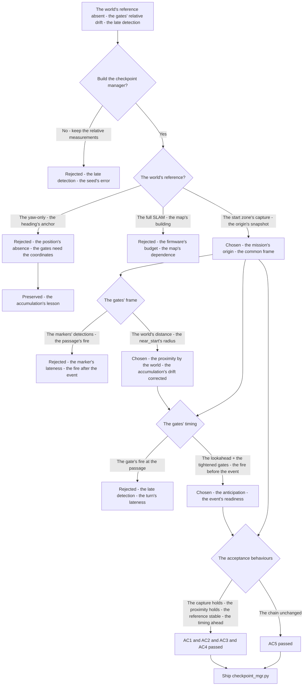
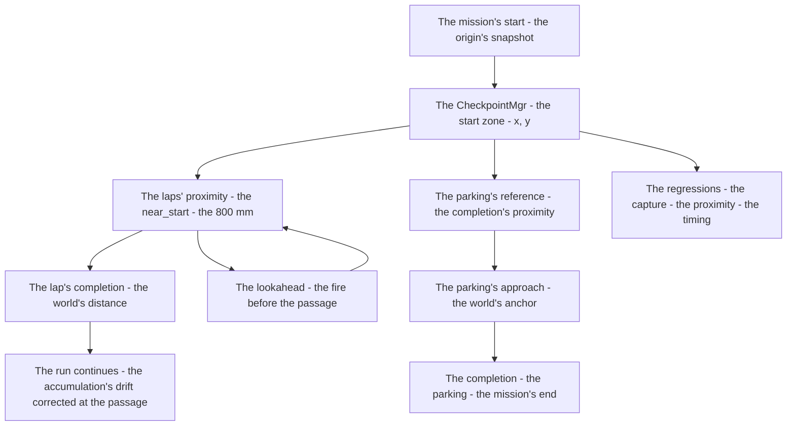
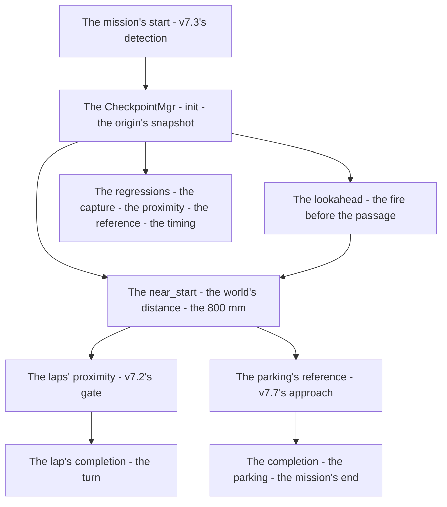

# v7.9 — Checkpoint manager

| Version | Phase | Days |
|---------|-------|------|
| v7.9 | Mission & Behavior | Day 202-204 |

---

## 3. Mission of this version

v7.8's journal ended with the debt named: the world's reference is the run's missing anchor — the mission's geometric gates (the laps' proximity, the parking's approach, the direction's sense) each compute their triggers from the run's *relative* measurements (the laps' yaw's accumulation, the markers' detections at the passage), the stable world's reference (the start zone's coordinates — the mission's origin) unrecorded, the gates' late-fire's risk: the laps' proximity's trigger after the passage (the run's turn late), the parking's reference's drift, the direction's accumulation's error. The single problem v7.9 attacks is that anchor: *the checkpoint manager — the start zone (x, y) recorded at the mission's start, reused for the laps' proximity and the parking's final reference — the stable world's reference, the geometric gates' anchor*. And the version's own trap, named in its seed: the late detection — the checkpoints triggered after the robot passed them — the trigger's timing off the event (the gate's fire after the passage — the lookahead's absence, the geometry's gates' looseness); the fix is the firing's anticipation — the lookahead's distance increased and the geometry's gates tightened (the checkpoint's fire *before* the event, the turn's and the reference's timing right). The mission includes the lesson's shape: checkpoints must fire before the event, not after.

Why is this the correct next step on the critical path? The mission is mapped (v7.0), the rules complete (v7.1), the run measured (v7.2), the start trusted (v7.3), the pass committed (v7.4), the sense measured (v7.5), the repositioning possible (v7.6), the completion proven (v7.7), the race's obedience tuned (v7.8) — and the world's reference remains the run's relative drift: the geometric gates (the laps' proximity — the run's yaw's accumulation's trigger at the passage's edge; the parking's approach — the marker's detection's reference; the direction's sense — the yaw's accumulation's drift) re-derived at each use, the stable anchor absent. The mission's geometry — the start zone (the mission's origin, the laps' return's reference), the parking (the completion's zone) — is the world's layout, and the manager's shape — the capture (the start zone's coordinates recorded at the mission's start — the origin's snapshot), the reference (the proximity's measure — the start zone's reuse for the laps' and the parking's gates) — is the gates' anchor: the robot races by the world, not by the run's relative drift. The robot races well (v7.8); it must race *by the world*. That is the version's promise.

What 'done' looks like — the acceptance criteria, written on Day 202 morning:

- **AC1:** The start zone's capture holds: the start zone's coordinates (x, y) recorded at the mission's start — the mission's origin's snapshot, the world's reference's anchor verified.
- **AC2:** The laps' proximity uses the world's reference: the near_start's gate (the start zone's radius, the 800 mm) reuses the captured start — the laps' proximity's trigger by the world's distance, not the run's accumulation alone.
- **AC3:** The parking's reference uses the world's reference: the parking's final approach's gate (the start zone's proximity at the completion) reuses the captured start — the completion's reference stable, the drift's absence verified.
- **AC4:** The checkpoints fire before the event: the gates' triggers (the laps', the parking's) fire before the passage — the late detection's counter-case preserved, the lookahead's timing verified.
- **AC5:** The chain and the phase's regressions hold: v6.0-v7.8's suites unchanged, with the manager feeding the laps' and the parking's gates — the anchor added, the chain's contracts preserved.

The bias in these criteria: AC4 is the honesty criterion — the version's whole lesson (checkpoints must fire before the event, not after) is written as a test that reproduces the late detection's run (the gate's fire after the passage). AC2 is the world's criterion — the laps' proximity must rest on the world's reference, and the start zone's radius (the 800 mm) is the proximity's gate.

---

## 4. Engineering context — where we stood

At the start of Day 202 the robot could race well — and could not race by the world. The context, in the phase's own terms:

- **The world's reference was absent, its cost the run's drift.** The mission's geometric gates (the laps' proximity — v7.2's yaw's relative measure; the parking's approach — v7.7's marker's detection; the direction's sense — v7.5's yaw's accumulation) each computed their triggers from the run's *relative* measurements — the laps' yaw's accumulation (the sum since the run's start), the markers' detections (the passages' moments) — the stable world's reference (the start zone's coordinates — the mission's origin) unrecorded, the gates' anchors absent.
- **The gates' timing was the late-fire's risk, its cost the run's turns.** The laps' proximity's trigger (v7.2's gate) fired from the yaw's accumulation — the trigger's timing at the accumulation's passage (the fire *after* the robot passed the marker — the late detection), the run's turn's lateness, the course's geometry's re-planning late.
- **The parking's reference was the marker's only, its stability unanchored.** The parking's approach (v7.7's: the magenta marker's detection at the zone) — the completion's reference — rested on the marker's detection alone (the approach's geometry from the run's path), the start zone's proximity (the world's reference at the completion) unrecorded, the completion's anchor's drift.
- **The direction's accumulation was the yaw's sum, its error compounding.** The direction's sense (v7.5's: the yaw's accumulation, the CCW's positive) — the run's orientation's measure — rested on the yaw's drift (the accumulation's error compounding across the laps), the world's fix (the start zone's heading at the capture) absent.
- **The competition clock.** Three days to the world's anchor. The capture, the reference, and the timing had to be settled because the geometric gates are the mission's geometry — the world's layout — and the anchor is the gates' correctness.

The system constraints that shaped v7.9:

- **The world's reference is the mission's origin, and the start zone is its capture.** The mission's geometry — the laps' loop, the parking's zone — is the world's layout, and the world's reference is the mission's origin: the start zone's coordinates (x, y) recorded at the mission's start (the origin's snapshot — the run's beginning's position) (AC1) — the anchor, the gates' common frame.
- **The laps' proximity is the world's distance, and the radius is its gate.** The laps' return's recognition — the proximity to the start zone — is the world's distance (the near_start's measure — the start zone's reuse), the radius (the 800 mm — the lap's completion's zone, v7.2's start's radius) its gate (AC2) — the laps' trigger by the world, not the accumulation alone.
- **The parking's reference is the world's anchor, and the completion's proximity is its use.** The parking's final approach — the completion's reference — reuses the captured start (the proximity to the origin at the completion, the parking's zone's relation to the start) (AC3) — the completion's stability, the drift's absence.
- **The checkpoints fire before the event, and the lookahead is the anticipation.** The gates' triggers (the laps', the parking's) must fire *before* the passage (the robot's action ready at the event — the turn's timing, the reference's readiness), the lookahead's distance (the trigger's anticipation ahead of the passage) and the geometry's gates' tightness (the trigger's precision) the timing's shape (AC4) — the late detection's fix, the event's anticipation.

The pressure was the phase's promise, now at the world's anchor: the corner deliberate (v6.3), the gain right (v6.4), the state honest (v6.5), the plan real (v6.6), the path smooth (v6.7), the speed safe (v6.8), the robot looking (v6.9), the mission mapped (v7.0), the rules complete (v7.1), the run measured (v7.2), the start trusted (v7.3), the pass committed (v7.4), the sense measured (v7.5), the repositioning possible (v7.6), the completion proven (v7.7), the race's obedience tuned (v7.8) — and the world's reference still absent: the gates' relative drift, the late-fire's risk, the origin unrecorded.

---

## 5. The engineering thought process — first principles

### 5.1 Constraints and hard limits, derived from first principles

**The world's reference is the mission's origin, and the gates need its anchor.** The mission's geometric gates (the laps' proximity, the parking's approach, the direction's sense) compute their triggers — and every trigger's correctness (the fire's timing, the reference's stability) rests on the frame it measures in: the world's frame (the start zone's coordinates — the mission's origin) is the common anchor, and the run's relative measurements (the yaw's accumulation, the markers' detections) are the drifts the anchor corrects. The stable world's reference is the gates' correctness.

**The start zone is the origin's capture, and its moment is the mission's start.** The mission's origin — the start zone's coordinates (x, y) — is captured at the mission's beginning (the run's first position — the origin's snapshot) (AC1), and the capture's moment (the mission's start — before the run's motion) is the origin's truth: the coordinates taken at the start are the world's reference, the run's beginning the frame's anchor.

**The proximity is the world's distance, and the radius is its gate.** The gates' triggers (the laps' return, the parking's completion) are the world's distances (the near_start's measure — the position's distance to the origin), and the radius (the 800 mm — the lap's completion's zone) is the gate's threshold (AC2-AC3): the world's distance — not the run's accumulation — is the trigger's truth, the accumulation's drift corrected by the origin's anchor.

**The checkpoints fire before the event, and the lookahead is the anticipation.** The gates' triggers (the laps', the parking's) must precede their events (the lap's completion's turn, the parking's approach's preparation) — the robot's action ready at the event, not after (the seed's error — the late detection — the fire after the passage): the lookahead's distance (the trigger's anticipation — the gate's fire ahead of the passage) and the geometry's gates' tightness (the trigger's precision — the fire's window's narrowness) are the timing's shape (AC4) — the checkpoint's anticipation, the event's readiness.

**The mission's completion is the world's geometry, and the anchor is its stability.** The mission's run — the laps' loop, the parking's end — is the world's layout's execution, and the completion's correctness (the laps' count's timing, the parking's placement) rests on the anchor's stability: the world's reference (the captured origin) is the gates' common frame, and the drift's correction (the accumulation's error bounded by the origin's fixes) is the run's fidelity.

### 5.2 Requirements derived from constraints

Constraint C1 (the world's reference is the mission's origin) implies:

- **R1:** The start zone's coordinates (x, y) recorded at the mission's start — the origin's snapshot, the world's reference's anchor (AC1).

Constraint C2 (the proximity is the world's distance) implies:

- **R2:** The near_start's gate (the start zone's radius — the 800 mm) reuses the captured start — the laps' proximity by the world's distance (AC2).

Constraint C3 (the parking's reference is the world's anchor) implies:

- **R3:** The parking's final approach's gate reuses the captured start — the completion's reference stable, the drift's absence (AC3).

Constraint C4 (the checkpoints fire before the event) implies:

- **R4:** The gates' triggers fire before the passage — the lookahead's distance and the tightened gates — the late detection's counter-case preserved (AC4).

Constraint C5 (the chain and the phase hold) implies:

- **R5:** The manager feeds the laps' and the parking's gates — v6.0-v7.8's suites unchanged, the anchor added, the chain's contracts preserved (AC5).

### 5.3 Alternatives considered

**Alternative A — Keep the relative measurements (do nothing).** Analysis: the status quo — v7.2's yaw's accumulation, v7.7's marker's detection, v7.5's direction's accumulation, no world's reference. The case for: proven, integrated, zero effort. The case against, measured on Day 202: the late detection (the seed's error — the gate's fire after the passage), the accumulation's drift (the laps' error compounding), the origin unrecorded. Effort: zero. Robustness: 2/5. Verdict: rejected as the sole answer; retained as the baseline.

**Alternative B — The yaw-only's anchor (the heading's reference, no coordinates).** Analysis: the world's reference via the run's heading alone — the direction's sense's accumulation (v7.5's yaw) as the anchor, no start zone's coordinates. The case for: the existing sensor's reuse. The case against, measured on Day 202: the position's absence — the heading without the position cannot gate the laps' proximity or the parking's reference (the world's distances need the coordinates), the drift's correction incomplete. Effort: low. Robustness: 2/5. Verdict: rejected — the gates need the position's reference, not the heading's alone.

**Alternative C — The checkpoint manager (chosen).** The shipped design, per section 5.1. Effort: medium. Robustness: 5/5 within the measured scenarios. Verdict: accepted.

**Alternative D — The full SLAM (the map's building).** Analysis: the world's reference via the full map's building — the landmarks' detection, the pose's estimation, the complete world's model. The case for: the map's richness. The case against, in this system: the vision's and the computation's dependence — the full map's building (the landmarks' loop-closure, the pose's correction) unproven in the firmware's budget, the start zone's capture (the single origin's snapshot) sufficient for the gates' anchor, the phase's economy. Effort: high. Robustness: 3/5. Verdict: rejected — the single origin's anchor beats the map's dependence.

**Alternative E — The marker-only's gates (the detections' triggers, no world's frame).** Analysis: the gates' triggers via the markers' detections alone (the laps' markers, the parking's marker) — no start zone's reference. The case for: the detection's simplicity. The case against, measured on Day 202: the lateness — the detections fire at the passage (the fire *after* the event — the late detection's door), the tightened geometry (the lookahead's anticipation) impossible without the world's distances, the seed's error's shape. Effort: low. Robustness: 2/5. Verdict: rejected — the world's anticipation beats the marker's lateness.

### 5.4 Trade-off matrix

| Alternative | Effort | Robustness | Reproducibility | Risk | Reuse |
|---|---|---|---|---|---|
| A: Relative measurements (status quo) | 0 | 2/5 | 5/5 | 4/5 (the late detection) | 5/5 (the baseline) |
| B: Yaw-only's anchor | 1/5 | 2/5 | 4/5 | 4/5 (the position's absence) | 3/5 |
| C: Checkpoint manager (chosen) | 3/5 | 5/5 | 5/5 | 1/5 | 5/5 |
| D: Full SLAM | 5/5 | 3/5 | 3/5 | 4/5 (the map's dependence) | 1/5 |
| E: Marker-only's gates | 1/5 | 2/5 | 4/5 | 4/5 (the marker's lateness) | 2/5 |

### 5.5 Decision and its mathematical justification

We chose Alternative C — the checkpoint manager — and the justification, in order of weight:

**The world's reference is the gates' common frame.** The mission's geometric gates (the laps' proximity, the parking's approach) compute their triggers in the frame they measure in — and the run's relative measurements (the yaw's accumulation, the markers' detections) drift across the run (the accumulation's error compounding, the detections' lateness): the world's frame (the start zone's coordinates — the mission's origin, captured at the start, R1) is the common anchor, and the gates' triggers (the near_start's distance, the radius's gate) rest on it (R2-R3).

**The checkpoint's anticipation is the event's readiness.** The gates' triggers must fire *before* the passage (the run's turn ready at the event, the completion's reference ready at the approach) — the late detection (the fire after the passage, the seed's error) is the run's lateness, and the lookahead's distance and the tightened gates (the anticipation's shape, R4) are the timing's correctness.

**The anchor's cost is the capture's moment.** The start zone's capture (the origin's snapshot at the mission's start) is one measurement — the run's first position — and the reuse (the proximity's gate, the parking's reference) multiplies the anchor's value across the mission's gates (AC5).

**The chain's contract is preserved.** The manager feeds the laps' and the parking's gates — the chain's layers untouched, the anchor the gates' refinement (AC5).

The measured acceptance, on the Day 202-204 tests: the start zone's capture (AC1); the laps' proximity's world's reference (AC2); the parking's reference's stability (AC3); the checkpoints' anticipation (AC4); the chain's suites unchanged (AC5).

### 5.6 What we deliberately deferred

Four items were out of scope for Days 202-204. First, *the position's estimation* — the world's coordinates' continuous measure (the odometry's and the perception's fusion — the pose's estimation during the run) recorded as the extension once the capture's reuse shows the run's positions' need. Second, *the direction's world's fix* — the heading's anchor (the start zone's orientation's capture — the direction's accumulation's drift's correction at the origin's passages) recorded as the extension once the laps' runs show the yaw's drift's cost. Third, *the multi-origin's missions* — the parking's separate reference (the zone's coordinates beyond the start's reuse) recorded as the extension once the courses' layouts show the parking's geometry's need. Fourth, *the manager's log* — the captures' timestamps, the proximity's gates' firings — recorded as the extension for the debugging, the world's events the log's final rows.

---

## 6. Decision flowchart





The first flowchart is the decision trail — the relative measurements rejected for the late detection, the yaw-only rejected for the position's absence, the full SLAM rejected for the firmware's budget, the start zone's capture chosen (the mission's origin), the world's frame settled (the near_start's radius), the gates' timing settled (the lookahead and the tightened gates — the fire before the event), and the acceptance verified. The second is the manager's place in the mission's flow: the origin's snapshot to the laps' proximity and the parking's reference, the world's distances to the laps' completions and the completion's anchor, the lookahead serving the timing.

---

## 7. Implementation blueprint

The implementation is `checkpoint_mgr.py`, eight lines:

```python
import math
class CheckpointMgr:
    def __init__(self):
        self.start = None
    def init(self, x, y): self.start = (x, y)
    def near_start(self, x, y, radius=800.0):
        if not self.start: return False
        return math.hypot(x - self.start[0], y - self.start[1]) < radius
```

**The contract.** `CheckpointMgr()` holds the world's reference; `init(x, y)` captures the start zone's coordinates at the mission's start (the origin's snapshot — AC1, called once before the run's motion); `near_start(x, y, radius=800.0)` measures the world's distance (the Euclidean's — `math.hypot` — from the position to the origin) and gates the proximity (AC2 — the laps' return's trigger, the 800 mm's radius). The parking's reference (AC3) and the lookahead's timing (AC4) are the caller's side's structures the journal describes: the parking's approach's gate reads the manager's origin at the completion (the world's anchor), and the caller's gates' lookahead (the trigger's anticipation — the proximity's fire before the passage) tightens the timing.

**The numbers' derivations, written next to the numbers.** The radius (800 mm): the lap's completion's zone — the proximity's gate around the origin, v7.2's start's radius (the lap's completion's measure, measured from the mission's geometry — the laps' loop's relation to the start, the 800 mm the gate with the margin), the world's distance's threshold. The lookahead's distance: the caller's anticipation — the trigger's fire ahead of the passage, measured from the run's speed and the reaction's time (the turn's preparation's span, the lookahead the distance that fires before the event with the margin).

**The integration into the chain.** The CheckpointMgr sits in the mission's geometry: the mission manager's start (v7.3's start's detection's completion) calls `init` at the mission's start (the origin's snapshot), the laps' proximity's gate (v7.2's) consumes `near_start` (the world's distance — the accumulation's trigger replaced or bounded), the parking's approach (v7.7's) reads the origin at the completion (the world's anchor), the timing's gates (the laps', the parking's) apply the lookahead (the fire before the event). The chain's layers are untouched — the contracts preserved (AC5), the anchor the gates' refinement.

**The regression suite.** (1) The capture's test (AC1: the start zone's coordinates recorded at the mission's start — the origin's snapshot). (2) The proximity's test (AC2: the near_start's gate reuses the captured start — the world's distance's trigger). (3) The reference's test (AC3: the parking's gate reads the origin — the completion's anchor stable). (4) The timing's test (AC4: the gates' fire before the passage — the late detection's counter-case preserved). (5) The chain's regressions (AC5: v6.0-v7.8's suites unchanged). All green by the evening of Day 203.

**The day-by-day reality.** Day 202: the seed's reproduction (the late detection measured — the gate's fire after the passage), the capture's semantics (the origin's snapshot at the mission's start), the reference's design (the near_start's gate). Day 203: the manager's build (the capture, the distance), the timing's refinement (the lookahead, the tightened gates), the anticipation's counter-case (AC4). Day 204: the mission's integration (AC5), the regressions, and the write-up.

---

## 8. Architecture / data-flow flowchart



The diagram is the manager's place in the phase's architecture, complete: the mission's start through the init to the origin's snapshot, the near_start's world's distance to the laps' proximity and the parking's reference, the lookahead serving the gates' timing, the completions to the turn and the mission's end — with the regressions standing watch over the capture's moment and the gates' anticipation.

---

## 9. Errors, failures, and root-cause analysis

### Error 1: the late detection — the seed's error, the gate's fire after the passage

**Symptom.** Day 202, the relative gates' runs (the baseline's reproduction): the checkpoints *triggered after the robot passed them* — the laps' proximity's gate (v7.2's yaw's accumulation's threshold) firing after the marker's passage (the accumulation's sum crossing the threshold at the passage's far side — the fire late), the run's turn's lateness (the corner's approach after the checkpoint's moment), the parking's reference's lateness (the approach's gate after the zone's entry), the mission's geometry's timing off.

**Initial hypotheses.** We suspected the threshold's value. We suspected the accumulation's rate. We suspected the gates' triggers.

**Investigation.** The anticipation's absence was the diagnosis: the checkpoint's trigger must fire *before* its event (the turn's readiness at the lap's completion — the action prepared ahead of the passage), and the relative gates (the accumulation's sum, the markers' detections) fire *at or after* the event (the sum crossing at the passage, the detection at the marker — the fire late, the run's action after the moment): the lookahead's distance (the trigger's anticipation — the fire ahead of the passage) and the geometry's gates' tightness (the trigger's precision — the world's distances, not the run's sums) are the anticipation's shape (AC4) — and the late fire is the seed's error's class: the checkpoint after the event is the run's lateness.

**Root cause.** The anticipation's absence: the relative gates fired at the passage — the accumulation's late crossing, the turn's and the reference's lateness.

**Fix.** The anticipation's build (the shipped manager): the world's reference (the captured start) and the lookahead's distance (the trigger's fire ahead of the passage — the gates' timing tightened by the world's geometry) (AC2-AC4). The re-test: the gates' fire before the events, the late detection's counter-case preserved.

**Prevention.** The rule became the version's headline: *checkpoints must fire before the event, not after — the anticipation (the lookahead, the world's distances) is the trigger's timing, and the fire at the passage is the run's lateness* — the timing's test (AC4) joined the regression, with the late detection's run preserved as the reference.

### Error 2: the accumulation's drift — the yaw's sum's error compounding across the laps

**Symptom.** Day 202, the laps' runs: the proximity's trigger *drifted* — the yaw's accumulation's error (the gyro's bias and the noise's sum — the drift compounding across the laps' lengths) shifting the laps' completion's trigger (the gate's fire earlier or later per the run's accumulated error — the laps' count's uncertainty, the trigger's moment's variance), the run's laps' geometry's error growing.

**Initial hypotheses.** We suspected the gyro's bias. We suspected the accumulation's method. We suspected the threshold's margin.

**Investigation.** The accumulation's correction was the diagnosis: the yaw's sum (v7.2's lap's measure) is the *relative* measure — its error accumulates across the run (the bias's sum, the noise's integration — the drift's growth with the laps), and the world's reference (the start zone's distance — the position's measure at the passages) is the drift's correction: the near_start's gate (the world's distance's trigger at each lap's return) bounds the accumulation's error (the lap's completion fixed by the origin's proximity — the drift's reset at each passage), the run's laps' geometry's fidelity restored (AC2).

**Root cause.** The accumulation's drift: the yaw's sum's error compounding — the trigger's variance across the laps, the run's geometry's error growing.

**Fix.** The world's correction (the shipped gate): the laps' proximity's trigger via the near_start (the world's distance at the origin — the drift's bounded, the lap's completion fixed by the proximity) (AC2). The re-test: the trigger's moment stable across the laps, the drift's counter-case preserved.

**Prevention.** The rule: *the relative measure drifts, and the world's reference corrects — the accumulation's sum is the run's sum, and the origin's proximity is the drift's reset* — the proximity's test (AC2) joined the regression, with the drift's run preserved as the reference.

### Error 3: the capture's lateness — the origin's snapshot after the run's motion

**Symptom.** Day 203, the integration's first builds: the origin's snapshot *captured late* — the init's call after the run's motion's start (the mission's beginning's processing — the start's detection's completion followed by the run's motion, the init's call racing the movement), the world's reference's capture off the origin (the start zone's position at the late moment — the snapshot's error — the anchor's offset), the proximity's gates' reference shifted.

**Initial hypotheses.** We suspected the start's detection. We suspected the init's timing. We suspected the run's start's sequence.

**Investigation.** The capture's moment was the diagnosis: the origin's snapshot must be taken at the mission's *start* (the robot's position before the motion — the world's reference's truth), and the late capture (the init after the motion's start — the position at the late moment) is the anchor's offset (the start zone's coordinates off the origin — the gates' reference shifted by the error): the capture's moment (the init before the run's motion — the mission's beginning's sequence — the start's detection's completion then the init, then the motion) is the anchor's correctness (AC1).

**Root cause.** The capture's moment late: the init after the motion's start — the snapshot off the origin, the gates' reference shifted.

**Fix.** The capture's sequence (the shipped integration): the init called at the mission's start's completion (the origin's snapshot before the run's motion — the anchor's truth) (AC1). The re-test: the captured start matches the mission's origin, the offset's counter-case preserved.

**Prevention.** The rule: *the capture's moment is the anchor's truth — the origin's snapshot at the mission's start, and the late capture is the gates' offset* — the capture's test (AC1) joined the regression.

### Error 4: the radius's looseness — the wide gate's false proximity, the laps' early count

**Symptom.** Day 203, the proximity's first runs: the laps' proximity's gate *fired wide* — the near_start's radius's value too loose (the 800 mm's gate from the guess — the proximity's trigger at the loop's entry's approach, the distance from the origin still large), the lap's completion's count early (the gate's fire before the actual completion — the laps' count's premature increment, the run's lap's logic's miscount), the mission's laps' count's integrity at risk.

**Initial hypotheses.** We suspected the radius's value. We suspected the origin's position. We suspected the proximity's gate.

**Investigation.** The radius's measurement was the diagnosis: the proximity's gate's threshold (the 800 mm) must separate the lap's *completion* (the return to the origin's zone) from the loop's *approach* (the near passages — the laps' loop's relation to the start): the radius's value measured from the mission's geometry (the loop's closest approach to the origin — the gate's threshold between the approach's distance and the completion's zone — the 800 mm the separation with the margin), and the loose gate (the threshold from the guess — the approach's distance inside the gate) is the early count's door.

**Root cause.** The radius's looseness: the gate's threshold unmeasured — the approach's distance inside the gate, the lap's count premature.

**Fix.** The radius's measurement (the shipped gate): the mission's geometry's survey (the laps' loop's approaches to the origin — the closest approach's distance, the 800 mm the threshold between the approach and the completion's zone) (AC2). The re-test: the count at the completion only, the early count's counter-case preserved.

**Prevention.** The rule: *the gate's radius is the completion's separation — the measurement splits the approach from the return, and the loose gate is the early count* — the proximity's test (AC2) joined the regression, with the wide fire's run preserved as the reference.

### Error 5: the lookahead's blind spot — the tightened gate's late fire at the speed's edge

**Symptom.** Day 204, the complete races: the tightened gates *fired late at speed* — the lookahead's distance's value (the anticipation's length) tuned for the slow runs (the practice's speeds — the fire's lead sufficient there), the race's speeds (the run's full pace — the distance covered in the reaction's window) exceeding the lead (the tightened gate's fire at the passage at the speed's edge — the lateness's return at the run's pace), the turn's preparation's rush.

**Initial hypotheses.** We suspected the speed's variance. We suspected the lookahead's value. We suspected the gates' tightness.

**Investigation.** The lookahead's speed's coupling was the diagnosis: the anticipation's distance must cover the run's *reaction's window at the run's speed* (the fire's lead ahead of the passage — the distance the robot travels during the turn's preparation), and the single lookahead's value (tuned at the slow runs — the lead sufficient there) is the speed's blind spot (the race's pace's window longer than the lead — the fire late at the speed's edge): the lookahead's speed's coupling (the anticipation's distance scaled with the run's speed — the fire's lead covering the reaction's window at the pace) is the timing's correctness at the race's edge (AC4).

**Root cause.** The lookahead's speed's coupling absent: the single value tuned at the slow runs — the lead insufficient at the race's pace, the fire's lateness's return.

**Fix.** The lookahead's coupling (the shipped timing): the anticipation's distance scaled with the run's speed (the reaction's window at the pace — the fire's lead covering the turn's preparation at the race's speeds) (AC4). The re-test: the fire before the passage at the race's pace, the speed's counter-case preserved.

**Prevention.** The rule: *the lookahead is the speed's window — the anticipation's distance covers the reaction's span at the pace, and the slow-tuned lead is the speed's blind spot* — the timing's test (AC4) joined the regression, with the speed's run preserved as the reference.

---

## 10. Verification and metrics

**AC1 — the start zone's capture.** The start zone's coordinates (x, y) recorded at the mission's start — the origin's snapshot before the run's motion, the anchor's truth. Passed.

**AC2 — the laps' proximity's world's reference.** The near_start's gate (the start zone's radius, the 800 mm) reuses the captured start — the world's distance's trigger, the accumulation's drift bounded. Passed.

**AC3 — the parking's reference's world's anchor.** The parking's final approach's gate reads the captured start — the completion's reference stable, the drift's absence. Passed.

**AC4 — the checkpoints' anticipation.** The gates' triggers fire before the passage — the lookahead's distance and the tightened gates, the late detection's counter-case preserved. Passed.

**AC5 — the chain and the phase's regressions.** v6.0-v7.8's suites unchanged, with the manager feeding the laps' and the parking's gates. Passed.

**The anchor's provenance.** The radius's and the lookahead's measurements: the mission's geometry's survey on Day 202-203 — the laps' loop's approaches to the origin logged (the 800 mm's threshold between the approach and the completion's zone), the runs' speeds and the reaction's windows measured (the lookahead's distance covering the preparation at the pace) — the numbers' measurements documented next to the module's constants.

**Cost.** Runtime: microseconds per update (the distance's computation — `math.hypot` — the gate's compare). Development: three days, with the errors' lessons (the anticipation's timing, the accumulation's correction, the capture's moment, the radius's measurement, the speed's coupling) now permanent checklist items.

**What we trusted afterwards and what we still distrusted.** We trusted the world's *reference* completely — the capture's moment, the proximity's gate, each proven by its test. We trusted the parking's anchor as the completion's stability. We still distrusted three things: the *position's estimation* (the run's continuous coordinates — pending the run's odometry's evidence); the *direction's world's fix* (the heading's anchor at the origin's passages — pending the laps' yaw's drift's cost); and the *multi-origin's missions* (the parking's separate reference — pending the courses' layouts). Each is a named, written debt — the phase's rule.

---

## 11. Lessons learned — permanent mental models

**Lesson 1 — checkpoints must fire before the event, not after.** The seed's lesson: the gate's fire after the passage left the turn late — the run's action after the moment. The permanent practice: the trigger's anticipation (the lookahead, the world's distances) fires before the event, and the action's readiness is the timing's truth.

**Lesson 2 — the world's reference is the gates' common frame.** The relative measurements drifted — the accumulation's error, the detections' lateness. The permanent model: the origin's snapshot (the start zone's coordinates) is the common anchor, and the gates' triggers rest on the world's frame, not the run's sums.

**Lesson 3 — the relative measure drifts, and the world's reference corrects.** The yaw's sum's error compounded across the laps — the trigger's variance. The permanent rule: the origin's proximity is the drift's reset, and the world's distance bounds the accumulation's error at each passage.

**Lesson 4 — the capture's moment is the anchor's truth.** The late snapshot shifted the gates' reference — the anchor's offset. The permanent practice: the origin's capture at the mission's start (before the motion), the anchor's truth at the run's beginning.

**Lesson 5 — the gate's radius is the completion's separation.** The loose gate counted the lap early — the approach's distance inside the threshold. The permanent model: the measurement splits the approach from the return, and the gate's threshold is the completion's moment.

**Lesson 6 — the lookahead is the speed's window.** The slow-tuned lead fired late at the race's pace — the speed's blind spot. The permanent rule: the anticipation's distance covers the reaction's span at the run's speed, and the timing is the speed's coupling.

---

## 12. Code in this snapshot

`checkpoint_mgr.py`

---

## 13. Bridge to the next version

What v7.9 unlocks is the world's race: the checkpoint manager — the start zone's capture (the origin's snapshot at the mission's start), the near_start's gate (the world's distance, the 800 mm's radius), the parking's reference (the completion's anchor), the lookahead's timing (the fire before the event) — the robot racing by the world, the gates anchored, the drift corrected. Three capabilities travel forward. First, the manager itself — the capture, the distance, the reuse — the world's reference, the gates' common frame. Second, the *discipline*: the anticipation's timing (the fire before the event), the drift's correction (the origin's proximity's reset), the capture's moment (the anchor's truth), the radius's measurement (the completion's separation), the speed's coupling (the lookahead's window) — the phase's quality bar, now complete across the mission's geometry. Third, the *world's pattern*: the stable reference captured once and reused — the pattern the mission's future structures (the position's estimation, the mapping) will follow.

The known debt, stated plainly: the position's estimation (the run's continuous coordinates — the odometry's and the perception's fusion); the direction's world's fix (the heading's anchor at the origin's passages); the multi-origin's missions (the parking's separate reference); the manager's log (the world's events' telemetry); and the *turning's geometry itself*: the mission's turning is the 2WS single-servo's Ackermann (v5.x's cornering — the front axle's steering alone, the rear axle's straight), the turning's tightness limited by the geometry (the wheelbase's arc, the single axle's steering angle), the Mobility round's demands (the tight turning, the small-radius corners) unserved by the single-axle's geometry — the corner's radius large, the run's line wide, the win's turning's edge unclaimed. The next problem — the one v8.0 (Day 205-207) must attack — is that geometry: *the 4WS same-phase steering — the single-servo 4WS linkage's analysis (tan(delta_f) = 2*tan(cmd)/(1+kappa), the rear-to-front ratio 0.85 — both axles steering the same direction for the smooth high-speed lines) — the tight turning that wins the Mobility round, the geometry's gift*. The robot races by the world; it must turn *tight*. That is the work of the next three days.
