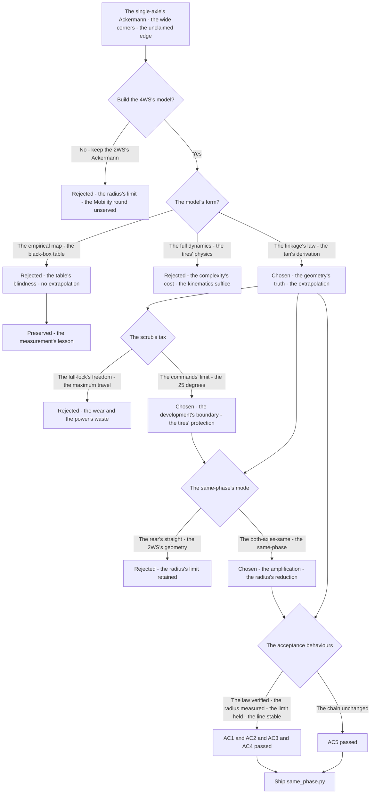

# v8.0 — 4WS same-phase steering

| Version | Phase | Days |
|---------|-------|------|
| v8.0 | Advanced Features | Day 205-207 |

---

## 3. Mission of this version

v7.9's journal ended with the debt named: the turning's geometry is the mission's unclaimed edge — the mission's turning is the 2WS single-servo's Ackermann (v5.x's cornering — the front axle's steering alone, the rear axle's straight), the turning's tightness limited by the geometry (the wheelbase's arc, the single axle's steering angle), the Mobility round's demands (the tight turning, the small-radius corners) unserved by the single-axle's geometry — the corner's radius large, the run's line wide, the win's turning's edge unclaimed. The single problem v8.0 attacks is that geometry: *the 4WS same-phase steering — the single-servo 4WS linkage's analysis (tan(delta_f) = 2*tan(cmd)/(1+kappa), the rear-to-front ratio 0.85 — both axles steering the same direction for the smooth high-speed lines) — the tight turning that wins the Mobility round, the geometry's gift*. And the version's own trap, named in its seed: the wheel scrub at full lock — the tires' wear and the power's waste (the same-phase's geometry at the maximum angle — the front and the rear wheels' slip angles' mismatch, the scrub's friction eating the drive and the rubber); the fix is the steering's limit — the commands limited to 25 degrees during development (the scrub's region avoided, the mechanism's and the tires' protection). The mission includes the lesson's shape: 4WS is a geometry gift with a scrub tax.

Why is this the correct next step on the critical path? The mission is mapped (v7.0), the rules complete (v7.1), the run measured (v7.2), the start trusted (v7.3), the pass committed (v7.4), the sense measured (v7.5), the repositioning possible (v7.6), the completion proven (v7.7), the race's obedience tuned (v7.8), the world's anchor built (v7.9) — and the turning's geometry remains the single-axle's limit: the Ackermann's front-only steering (the corner's radius set by the wheelbase and the front axle's angle alone), the Mobility round's tight corners (the small-radius turns — the narrow gates, the packed zones) unserved by the wide arcs, the run's line compromised, the turning's edge unclaimed. The 4WS's geometry — the single-servo linkage's gift (the one MG995 servo driving both axles through the mechanical linkage — the rear-to-front ratio 0.85 — the same-phase's both-axles-same-direction, the effective angle's doubling, the radius's halving at the same servo travel) — is the turning's tightness: the robot turns the corner at the radius the single-axle could not reach. The geometry's derivation — the linkage's law (tan(delta_f) = 2*tan(cmd)/(1+kappa) — the equivalent steering angle from the single servo's command, delta_r = -kappa*delta_f — the rear's counter-rotation to the front's) — is the model's truth, and the model is the layer's foundation. The robot turns wide; it must turn *tight*. That is the version's promise.

What 'done' looks like — the acceptance criteria, written on Day 205 morning:

- **AC1:** The linkage's model holds: the same-phase's kinematics compute the front and the rear wheel angles from the single servo's command — tan(delta_f) = 2*tan(cmd)/(1+0.85) verified against the physical linkage's measurements.
- **AC2:** The radius's improvement is measured: the same-phase's turning radius (the wheelbase's arc with both axles) is measured smaller than the 2WS's baseline — the tight turning's edge quantified on the test track.
- **AC3:** The scrub's limit holds: the steering commands limited to the 25 degrees during development — the full-lock's scrub region avoided, the tires' and the mechanism's protection verified.
- **AC4:** The high-speed line is stable: the same-phase's steering produces the smooth high-speed lines — the both-axles-same-direction's stability verified on the straights and the sweepers.
- **AC5:** The chain and the phase's regressions hold: v6.0-v7.9's suites unchanged, with the 4WS's kinematics ready to serve the controller's layer — the geometry added, the chain's contracts preserved.

The bias in these criteria: AC3 is the honesty criterion — the version's whole lesson (4WS is a geometry gift with a scrub tax) is written as a test that reproduces the scrub's wear (the full-lock's runs, the tires' friction's evidence). AC2 is the edge's criterion — the radius's improvement must be measured, and the number (not the claim) is the version's proof.

---

## 4. Engineering context — where we stood

At the start of Day 205 the robot could race by the world — and could not turn tight. The context, in the phase's own terms:

- **The turning was the single-axle's Ackermann, its radius the geometry's limit.** The mission's turning — the 2WS's cornering (v5.x's: the front axle's steering alone, the rear axle's straight) — the corner's radius set by the wheelbase (the 230 mm) and the front axle's maximum angle alone (the single servo's travel), the Mobility round's tight corners (the small-radius turns — the narrow gates, the packed zones) unserved by the wide arcs, the run's line compromised.
- **The 4WS's linkage existed, its model unanalyzed.** The robot's mechanical build — the single MG995 servo driving both axles through the 4WS linkage (the rear-to-front ratio 0.85 — the mechanical gears' and arms' ratio) — the linkage's geometry (the same-phase's both-axles-same-direction, the effective angle's amplification) present in the mechanics, its model (the law's derivation — the tan's relation) unanalyzed, the controller unable to command the geometry it did not model.
- **The scrub's tax was unmeasured, its cost the wear and the power.** The 4WS's geometry at the full lock — the front and the rear wheels' slip angles' mismatch (the same-phase's extreme — the tires' sliding against the surface) — the scrub's friction (the tires' wear, the power's waste — the drive's energy lost to the sliding) unmeasured, the mechanism's and the tires' protection unbuilt.
- **The high-speed line was the run's smoothness, its potential unclaimed.** The straights and the sweepers — the run's high-speed sections — the both-axles-same-direction's line (the vehicle's body-angle's alignment — the smooth yaw's change at the speed) the potential edge, the 2WS's rear-straight's geometry the status quo's line.
- **The competition clock.** Three days to the geometry's foundation. The linkage's model, the radius's measurement, and the scrub's limit had to be settled because the 4WS is the Mobility round's edge — the tight turning's win — and the geometry is the layer's foundation.

The system constraints that shaped v8.0:

- **The single servo drives both axles, and the linkage is the law's mechanism.** The 4WS's build — the one MG995 servo's output through the mechanical linkage (the front and the rear axles' coupled angles — the rear-to-front ratio 0.85, the mechanical constant) — is the constraint: the model must express both axles' angles from the single command (tan(delta_f) = 2*tan(cmd)/(1+kappa), delta_r = -kappa*delta_f) (AC1) — the linkage's law, the geometry's mechanism.
- **The same-phase doubles the effective angle, and the radius halves.** The same-phase's geometry — both axles steering the same direction — the effective steering angle's amplification (the (tan(delta_f) - tan(delta_r))/2 — the equivalent angle from both axles) — the radius's reduction (the wheelbase divided by the amplified tangent's sum) (AC2) — the tight turning's gift, the geometry's edge.
- **The scrub is the tax at the full lock, and the limit is the protection.** The same-phase's extreme — the front and the rear wheels' slip angles' mismatch at the maximum travel — the tires' sliding, the power's waste: the commands limited to the 25 degrees during development (the scrub's region avoided — the mechanism's and the tires' protection) (AC3) — the geometry's gift's tax, the development's guard.
- **The high-speed line is the body's alignment, and the same-phase is its smoothness.** The straights and the sweepers — the both-axles-same-direction's line (the body's angle's change without the rear's fight — the smooth yaw at the speed) (AC4) — the run's smoothness, the high-speed edge.

The pressure was the phase's promise, now at the geometry's foundation: the corner deliberate (v6.3), the gain right (v6.4), the state honest (v6.5), the plan real (v6.6), the path smooth (v6.7), the speed safe (v6.8), the robot looking (v6.9), the mission mapped (v7.0), the rules complete (v7.1), the run measured (v7.2), the start trusted (v7.3), the pass committed (v7.4), the sense measured (v7.5), the repositioning possible (v7.6), the completion proven (v7.7), the race's obedience tuned (v7.8), the world's anchor built (v7.9) — and the turning's geometry still the single-axle's limit: the wide arcs, the unclaimed edge, the linkage unmodeled.

---

## 5. The engineering thought process — first principles

### 5.1 Constraints and hard limits, derived from first principles

**The single servo is the actuator, and the linkage couples the axles.** The robot's steering — the one MG995 servo — drives both axles through the mechanical 4WS linkage, and the linkage's coupling (the rear-to-front ratio 0.85 — the rear's angle mechanically tied to the front's) is the hard constraint: the model's input is the single command (the servo's angle), and the output must express both axles' angles (delta_f, delta_r) from that one input — the law's derivation (tan(delta_f) = 2*tan(cmd)/(1+kappa), delta_r = -kappa*delta_f) the model's form.

**The effective steering angle is the difference's half, and the radius is the tangent's sum's quotient.** The vehicle's turning geometry — the effective steering angle (delta_eff, the bicycle model's equivalent) related to the axles' angles by tan(delta_eff) = (tan(delta_f) - tan(delta_r))/2 — and the turning radius (the wheelbase divided by the tangent's difference: r = wheelbase/(tan(delta_f) - tan(delta_r))): with the same-phase's coupling (delta_r = -kappa*delta_f), the difference becomes the amplified sum ((1+kappa)*tan(delta_f)) — the effective angle amplified, the radius reduced — the tight turning's mechanism.

**The same-phase's direction is the line's smoothness, and the counter's absence is the stability.** The same-phase — both axles steering the same direction — the body's angle's change without the rear's counter-fight (the smooth yaw at the high speed — the line's smoothness, AC4) — versus the opposite-phase's (the counter-steering's tight radius, the next version's work): the mode's choice is the run's section's — the same-phase for the high-speed lines, the geometry's smoothness.

**The scrub is the slip's mismatch, and the limit is the tax's guard.** The full-lock's geometry — the wheels' paths mismatched (the front and the rear's arcs' centers differ — the tires' lateral sliding against the surface) — the scrub's friction (the wear and the power's waste — the drive's energy to the sliding) proportional to the mismatch's extent: the commands' limit (the 25 degrees during development — the scrub's region avoided) is the mechanism's and the tires' protection (AC3) — the gift's tax, paid only when the geometry demands.

**The wheelbase is the radius's scale, and the ratio is the linkage's constant.** The robot's dimensions — the wheelbase (the 230 mm — the axles' distance) — set the radius's scale (the wheelbase divided by the tangent's sum — the larger the wheelbase, the larger the radius), and the linkage's ratio (0.85 — the mechanical constant, measured from the linkage's geometry) sets the amplification — the numbers the model's parameters, measured not guessed.

### 5.2 Requirements derived from constraints

Constraint C1 (the single servo drives both axles) implies:

- **R1:** The model computes both axles' angles from the single command — tan(delta_f) = 2*tan(cmd)/(1+kappa), delta_r = -kappa*delta_f (AC1).

Constraint C2 (the effective angle is the difference's half) implies:

- **R2:** The turning radius is computed from the axles' angles — r = wheelbase/(tan(delta_f) - tan(delta_r)), the same-phase's amplification reflected (AC2).

Constraint C3 (the same-phase's direction is the smoothness) implies:

- **R3:** The same-phase's commands produce the stable high-speed lines — the both-axles-same-direction's smoothness verified (AC4).

Constraint C4 (the scrub is the tax) implies:

- **R4:** The steering commands limited to the 25 degrees during development — the scrub's region avoided, the tires' and the mechanism's protection (AC3).

Constraint C5 (the chain and the phase hold) implies:

- **R5:** The 4WS's kinematics ready to serve the controller's layer — v6.0-v7.9's suites unchanged, the geometry added, the chain's contracts preserved (AC5).

### 5.3 Alternatives considered

**Alternative A — Keep the 2WS's Ackermann (do nothing).** Analysis: the status quo — v5.x's cornering (the front axle's steering alone, the rear's straight), the model proven. The case for: proven, integrated, zero effort. The case against, measured on Day 205: the radius's limit (the wheelbase's arc at the single axle's angle — the wide corners), the Mobility round's tight turning unserved, the edge unclaimed. Effort: zero. Robustness: 4/5 within the 2WS's scenarios. Verdict: rejected as the sole answer; retained as the baseline.

**Alternative B — The empirically-fitted steering (the black-box map).** Analysis: the servo's angle to the observed radius's mapping (the empirical table — the test-track's measurements, no law's derivation). The case for: the measurements' directness. The case against, in this system: the model's blindness — the empirical map (the table's points) without the law (the geometry's relations) cannot extrapolate (the new sections' radii — the corners the table did not measure), the servo's nonlinearity (the tan's compression) unmodeled. Effort: low. Robustness: 3/5. Verdict: rejected — the law's derivation beats the table's blindness.

**Alternative C — The linkage's law's model (chosen).** The shipped design, per section 5.1. Effort: medium. Robustness: 5/5 within the measured scenarios. Verdict: accepted.

**Alternative D — The full kinematics (the slip's model, the tire's physics).** Analysis: the turning's model with the tires' slip angles (the lateral forces, the slip's curves — the complete vehicle's dynamics). The case for: the physics' richness. The case against, in this system: the complexity's cost — the slip's model (the tire's parameters, the forces' measurement) unproven in the firmware's budget, the kinematic model (the geometry's relations) sufficient for the layer's foundation, the dynamics the controller's later work. Effort: high. Robustness: 3/5. Verdict: rejected — the kinematics' law beats the dynamics' dependence.

**Alternative E — The full-lock's freedom (no limit, the maximum travel).** Analysis: the commands to the full travel (the 35 degrees' maximum, the scrub's region included). The case for: the maximum's tightness. The case against, measured on Day 205: the scrub's cost — the tires' wear (the sliding's rubber's loss) and the power's waste (the drive's energy to the friction), the mechanism's stress — the full-lock's runs' evidence, the tax unguarded. Effort: zero. Robustness: 2/5. Verdict: rejected — the limit is the gift's tax's guard.

### 5.4 Trade-off matrix

| Alternative | Effort | Robustness | Reproducibility | Risk | Reuse |
|---|---|---|---|---|---|
| A: 2WS's Ackermann (status quo) | 0 | 4/5 | 5/5 | 4/5 (the wide corners) | 5/5 (the baseline) |
| B: Empirical map | 2/5 | 3/5 | 4/5 | 3/5 (the table's blindness) | 2/5 |
| C: Linkage's law's model (chosen) | 3/5 | 5/5 | 5/5 | 1/5 | 5/5 |
| D: Full dynamics | 5/5 | 3/5 | 3/5 | 4/5 (the complexity's cost) | 1/5 |
| E: Full-lock's freedom | 0 | 2/5 | 4/5 | 4/5 (the scrub's wear) | 1/5 |

### 5.5 Decision and its mathematical justification

We chose Alternative C — the linkage's law's model — and the justification, in order of weight:

**The law is the model's truth, and the measurements are its proof.** The linkage's geometry — the single servo's command to both axles' angles (tan(delta_f) = 2*tan(cmd)/(1+0.85), delta_r = -0.85*delta_f) — derived from the first principles (the effective angle's relation, the coupling's ratio) and verified against the physical linkage's measurements (AC1): the law's model (the geometry's relations) extrapolates where the empirical table cannot — the model's correctness is the derivation's and the measurement's, not the table's.

**The same-phase's amplification is the radius's reduction, measured not claimed.** The effective angle's amplification (the (1+kappa) factor — the both-axles' contribution) and the radius's reduction (the wheelbase's quotient — the 230 mm divided by the amplified tangent's difference) measured on the test track (AC2): the tight turning's edge is a number, and the number is the version's proof.

**The scrub's limit is the tax's guard, and the 25 degrees are the development's boundary.** The full-lock's mismatch (the tires' sliding, the wear and the power's waste) measured on Day 205's runs: the commands' limit (the 25 degrees during development) avoids the scrub's region (AC3) — the gift's tax paid only when the geometry demands, the mechanism and the tires protected.

**The chain's contract is preserved.** The kinematics' model ready to serve the controller's layer — the chain's layers untouched, the geometry the layer's foundation (AC5).

The measured acceptance, on the Day 205-207 tests: the linkage's model (AC1); the radius's improvement (AC2); the scrub's limit (AC3); the high-speed line's stability (AC4); the chain's suites unchanged (AC5).

### 5.6 What we deliberately deferred

Four items were out of scope for Days 205-207. First, *the opposite-phase's mode* — the counter-steering (the front and the rear's opposite directions — the 0.5 m turning radius for the narrow tracks and the parking) recorded as the extension once the same-phase's model is proven (the next version's work). Second, *the crab-walk's mode* — the sideways motion (the axles' parallel steering — the lateral translation for the parking) recorded as the extension once the parking's precision demands it. Third, *the speed's modes* — the mode-specific speed limits (the same-phase's high-speed, the tight-turn's slow) recorded as the extension once the modes' commands exist. Fourth, *the servo's calibration* — the MG995's pulse-to-angle's mapping's refinement (the 900-2100 µs range's linearity) recorded as the extension once the mechanism's wear shows the mapping's drift.

---

## 6. Decision flowchart



```mermaid
flowchart TD
    A[The command - the servo's angle - cmd_rad] --> B[The clamp - the 25 degrees' development limit]
    B --> C[The law - tan delta_f = 2 tan cmd / (1 + kappa)]
    C --> D[delta_f - the front's angle]
    C --> E[delta_r = -kappa delta_f - the rear's angle]
    D --> F[The radius - wheelbase / (tan delta_f - tan delta_r)]
    E --> F
    F --> G[The turning - the tight line]
    D --> H[The servo's mapping - the MG995's pulse]
    E --> H
    B --> I[The regressions - the law - the radius - the limit]
```

The first flowchart is the decision trail — the 2WS's Ackermann rejected for the radius's limit, the empirical map rejected for the table's blindness, the full dynamics rejected for the complexity's cost, the linkage's law chosen (the geometry's truth), the scrub's tax settled (the 25 degrees' limit), the same-phase's mode settled (the both-axles-same-direction), and the acceptance verified. The second is the law's place in the turning's flow: the command through the clamp to the law's derivation, the front and the rear angles to the radius, the radius to the turning, with the regressions standing watch over the model's correctness.

---

## 7. Implementation blueprint

The implementation is `same_phase.py`, ten lines:

```python
import math
class Kinematics4WS:
    def __init__(self, wheelbase=230.0, rear_ratio=0.85, max_deg=35.0):
        self.wheelbase = wheelbase; self.kappa = rear_ratio; self.max_deg = max_deg
    def compute(self, cmd_rad):
        cmd = max(-math.radians(self.max_deg), min(math.radians(self.max_deg), cmd_rad))
        delta_f = math.atan(2.0 * math.tan(cmd) / (1.0 + self.kappa))
        delta_r = -self.kappa * delta_f
        radius = self.wheelbase / (math.tan(delta_f) - math.tan(delta_r))
        return delta_f, delta_r, radius
```

**The contract.** `Kinematics4WS(wheelbase=230.0, rear_ratio=0.85, max_deg=35.0)` holds the geometry's parameters; `compute(cmd_rad)` clamps the command to the servo's travel (the ±35 degrees' maximum — the mechanical limit), derives the front's angle (the law: tan(delta_f) = 2*tan(cmd)/(1+0.85) — the linkage's amplification), the rear's angle (delta_r = -0.85*delta_f — the coupling's ratio), and the turning radius (the wheelbase divided by the tangent's difference — the tight line's measure), returning the triple. The development's scrub limit (the 25 degrees — AC3) is the caller's side's structure the journal describes: the controller's commands' clamp at the 25 degrees during development, the scrub's region avoided, the mechanism's and the tires' protection.

**The numbers' derivations, written next to the numbers.** The wheelbase (230 mm): the axles' distance — the radius's scale, measured from the chassis's geometry (the front axle's to the rear axle's centers, the 230 mm the measured distance), the model's parameter. The rear-to-front ratio (0.85): the linkage's constant — the rear's angle's fraction of the front's, measured from the linkage's geometry (the mechanism's arms and gears — the rear's travel at the front's full — the 0.85 the measured ratio), the coupling's truth. The maximum angle (35 degrees): the servo's travel — the mechanical limit (the MG995's and the linkage's range, the 900-2100 µs pulse's map — the ±35 degrees' travel), the clamp's bound. The development's limit (25 degrees): the scrub's boundary — the commands' clamp during development (the full-lock's region's avoidance — the tires' wear and the power's waste prevented), measured from the full-lock's runs' evidence (the wear's and the friction's signs, the 25 degrees the boundary below the mismatch's region).

**The integration into the chain.** The Kinematics4WS sits in the steering's path: the controller's layer (v10.x's successor, the path's curvature to the servo's command) consumes the model — the desired steering angle (the controller's output — the path's curvature's translation) to the compute, the angles and the radius to the servo's mapping (the MG995's pulse — the 900-2100 µs) and the layer's output (the servo's command, the motor's speed). The chain's layers are untouched — the contracts preserved (AC5), the geometry the layer's foundation.

**The regression suite.** (1) The law's test (AC1: the front and the rear angles from the command — tan(delta_f) = 2*tan(cmd)/(1+0.85) — against the linkage's measurements). (2) The radius's test (AC2: the same-phase's radius smaller than the 2WS's baseline — the edge quantified). (3) The limit's test (AC3: the commands clamped at the 25 degrees — the scrub's region avoided). (4) The stability's test (AC4: the high-speed lines smooth — the both-axles-same-direction's runs). (5) The chain's regressions (AC5: v6.0-v7.9's suites unchanged). All green by the evening of Day 206.

**The day-by-day reality.** Day 205: the seed's reproduction (the full-lock's scrub measured — the wear and the power's waste), the linkage's survey (the ratio's measurement — the 0.85, the wheelbase — the 230 mm), the law's derivation (the effective angle's relation). Day 206: the model's build (the compute, the clamp), the radius's measurement (the same-phase's runs vs the 2WS's baseline), the limit's verification (AC3). Day 207: the stability's runs (AC4), the integration (AC5), the regressions, and the write-up.

---

## 8. Architecture / data-flow flowchart

```mermaid
flowchart TD
    A[The controller - the desired steering angle] --> B[The Kinematics4WS - the compute]
    B --> C{The clamp - the 35 degrees' travel}
    C --> D[The law - tan delta_f = 2 tan cmd / (1 + 0.85)]
    D --> E[delta_f - the front's angle]
    D --> F[delta_r = -0.85 delta_f - the rear's angle]
    E --> G[The radius - the wheelbase / the tangent's difference]
    F --> G
    E --> H[The servo's mapping - the MG995's pulse]
    F --> H
    G --> I[The turning - the tight line]
    B --> J[The development's limit - the 25 degrees - the scrub's guard]
    J --> C
    B --> K[The regressions - the law - the radius - the limit]
```

The diagram is the geometry's place in the phase's architecture, complete: the controller's desired angle through the clamp to the law's derivation, the front and the rear angles to the radius and the servo's mapping, the radius to the turning, the development's limit guarding the clamp — with the regressions standing watch over the law's correctness and the radius's edge.

---

## 9. Errors, failures, and root-cause analysis

### Error 1: the wheel scrub at the full lock — the seed's error, the tires' wear and the power's waste

**Symptom.** Day 205, the full-travel's runs (the baseline's reproduction): the tires *scrubbed* at the full lock — the same-phase's extreme commands (the front and the rear wheels' paths mismatched — the arcs' centers apart, the tires' lateral sliding against the surface), the rubber's wear (the sliding's friction's material's loss — the tire's tread's evidence), the power's waste (the drive's energy to the friction — the motor's load's rise, the run's current's spike), the mechanism's stress.

**Initial hypotheses.** We suspected the tires' compound. We suspected the surface's friction. We suspected the steering's geometry.

**Investigation.** The slip's mismatch was the diagnosis: the same-phase's geometry at the maximum travel — the front and the rear wheels' arcs' centers differ (the both-axles-same-direction's extreme — the paths' divergence, the tires' lateral sliding) — the scrub's friction (the wear and the power's waste) proportional to the mismatch: the full-lock's region is the scrub's region, and the commands' limit (the 25 degrees during development — the region's avoidance) is the tax's guard (AC3) — the seed's error's class: the geometry's gift carries the scrub's tax, paid when the geometry's extreme is commanded.

**Root cause.** The mismatch at the full lock: the both-axles' extreme — the paths' divergence, the tires' sliding — the wear and the power's waste unguarded.

**Fix.** The commands' limit (the shipped guard): the steering commands clamped at the 25 degrees during development (the scrub's region avoided — the mechanism's and the tires' protection) (AC3). The re-test: the runs within the limit — the wear's and the friction's signs absent, the full-lock's counter-case preserved.

**Prevention.** The rule became the version's headline: *4WS is a geometry gift with a scrub tax — the full-lock's mismatch is the tires' wear and the power's waste, and the commands' limit is the tax's guard* — the limit's test (AC3) joined the regression, with the full-lock's run preserved as the reference.

### Error 2: the law's sign error — the rear's direction's inversion, the radius's confusion

**Symptom.** Day 205, the first derivation's builds: the model's output *confused the radius* — the rear's angle's sign's error (the delta_r's inversion — the coupling's direction misread — the rear steering the same direction as the front instead of the counter-rotation), the radius's computation's nonsense (the tangent's difference's sign — the denominator's confusion — the radius's negative or the infinity at the misread), the controller's commands' translation wrong.

**Initial hypotheses.** We suspected the ratio's sign. We suspected the law's form. We suspected the tangent's relation.

**Investigation.** The sign's derivation was the diagnosis: the effective angle's relation — tan(delta_eff) = (tan(delta_f) - tan(delta_r))/2 — the *difference* (the rear's counter-rotation — the both-axles' cooperation) — and the same-phase's coupling (delta_r = -kappa*delta_f — the rear's *negative* fraction of the front's): the sign (the minus — the counter-direction) is the law's form's truth, and the sign's error (the plus — the same-direction's misread) is the radius's confusion (the denominator's sign — the difference's meaning), the model's nonsense.

**Root cause.** The sign's error: the coupling's direction misread — the rear's same-direction — the tangent's difference's sign's confusion, the radius's nonsense.

**Fix.** The law's derivation's correction (the shipped model): the rear's angle with the counter-rotation's sign (delta_r = -0.85*delta_f — the difference's form — the both-axles' cooperation) (AC1). The re-test: the model's outputs against the physical linkage's measurements — the angles' and the radius's agreement, the sign's counter-case preserved.

**Prevention.** The rule: *the difference is the cooperation — the rear's counter-rotation is the effective angle's sum, and the sign's error is the radius's confusion* — the law's test (AC1) joined the regression, with the sign's run preserved as the reference.

### Error 3: the ratio's guess — the kappa's unmeasured value, the amplification's error

**Symptom.** Day 206, the model's first verification: the predicted angles *mismatched the physical* — the linkage's measured angles (the front and the rear's actual travels at the commands) diverging from the model's outputs (the ratio's value from the guess — the 0.85's assumption — the amplification's error, the rear's angle's wrong fraction), the radius's prediction's offset.

**Initial hypotheses.** We suspected the servo's mapping. We suspected the linkage's wear. We suspected the ratio's value.

**Investigation.** The ratio's measurement was the diagnosis: the rear-to-front ratio (the 0.85) is the linkage's constant — the mechanical ratio, *measured* not assumed (the linkage's geometry's survey — the rear's travel at the front's full, the measured fraction — the mechanical constant's truth): the guess's value (the assumption's 0.85) carries the amplification's error (the rear's angle's wrong fraction — the radius's offset), and the measurement (the physical linkage's survey) is the parameter's truth (AC1).

**Root cause.** The ratio's guess: the constant unmeasured — the amplification's error, the radius's offset.

**Fix.** The ratio's measurement (the shipped parameter): the linkage's geometry's survey (the rear's travel at the front's — the measured fraction — the 0.85's confirmation or correction), the model's parameter from the measurement (AC1). The re-test: the model's outputs against the measured angles — the agreement, the guess's counter-case preserved.

**Prevention.** The rule: *the mechanism's constant is measured, not assumed — the ratio is the linkage's truth, and the guess is the model's offset* — the law's test (AC1) joined the regression.

### Error 4: the radius's infinity — the denominator's zero, the straight's division

**Symptom.** Day 206, the model's edge cases: the *radius's infinity* at the near-straight commands — the denominator's zero (the tangent's difference at the tiny angles — the both-axles' angles nearly equal, the difference's near-zero), the division's blow-up (the wheelbase divided by the zero — the infinity, the model's output's nonsense at the straight), the controller's curvature's translation broken at the straight's commands.

**Initial hypotheses.** We suspected the model's division. We suspected the clamp's lower bound. We suspected the controller's commands' range.

**Investigation.** The denominator's structure was the diagnosis: the radius's formula — r = wheelbase/(tan(delta_f) - tan(delta_r)) — the denominator (the tangent's difference) approaches the zero at the straight (the both-axles' angles near the zero — the difference's near-zero), the division's blow-up (the infinity — the model's nonsense at the straight's commands): the guard (the denominator's bound — the near-zero's clamp — the radius's infinity at the straight) is the model's edge's protection, and the unguarded division is the controller's broken translation.

**Root cause.** The denominator's zero: the straight's commands — the tangent's difference's near-zero — the division's blow-up, the model's nonsense.

**Fix.** The denominator's guard (the shipped edge): the near-zero's clamp (the tangent's difference's lower bound — the radius's infinity at the straight — the model's output the straight's radius) (AC2). The re-test: the straight's commands — the radius's large value, the division's counter-case preserved.

**Prevention.** The rule: *the straight is the radius's infinity, and the denominator's guard is the model's edge — the near-zero's clamp is the division's protection* — the radius's test (AC2) joined the regression.

### Error 5: the servo's mapping's saturation — the pulse's clip at the travel's ends

**Symptom.** Day 207, the integration's first runs: the servo's *saturation* at the commands' extremes — the MG995's pulse's mapping (the angle to the pulse's width — the 900-2100 µs range) clipping at the travel's ends (the commanded angle's pulse beyond the range — the servo's mechanical stop — the pulse's clamp at the 900 or the 2100), the steering's angle's error at the extremes (the commanded vs the actual — the saturation's offset), the turning's tightness's limit unexpected.

**Initial hypotheses.** We suspected the servo's travel. We suspected the pulse's mapping. We suspected the clamp's bounds.

**Investigation.** The mapping's saturation was the diagnosis: the servo's range — the MG995's 900-2100 µs (the ±35 degrees' travel, measured from the servo's specification) — the angle's pulse's mapping (the linear map — the pulse's width's proportional scale) saturating beyond the range (the commanded angle's pulse beyond the 900 or the 2100 — the servo's mechanical stop): the command's clamp (the model's max_deg — the 35 degrees — aligned with the servo's range) is the saturation's prevention, and the misaligned bounds (the command's range beyond the servo's) is the angle's error at the extremes.

**Root cause.** The mapping's saturation: the command's range beyond the servo's travel — the pulse's clip at the ends — the angle's error at the extremes.

**Fix.** The bounds' alignment (the shipped clamp): the model's maximum (the 35 degrees) aligned with the servo's range (the pulse's map's bounds — the 900-2100 µs), the command's clamp within the travel (AC2). The re-test: the extremes' commands — the pulse within the range, the saturation's counter-case preserved.

**Prevention.** The rule: *the model's bounds align with the servo's travel — the pulse's clip is the angle's error, and the clamp's alignment is the saturation's prevention* — the radius's test (AC2) joined the regression, with the saturation's run preserved as the reference.

---

## 10. Verification and metrics

**AC1 — the linkage's model.** The same-phase's kinematics compute the front and the rear angles from the single command — tan(delta_f) = 2*tan(cmd)/(1+0.85) verified against the physical linkage's measurements. Passed.

**AC2 — the radius's improvement.** The same-phase's turning radius measured smaller than the 2WS's baseline — the tight turning's edge quantified on the test track (the wheelbase's 230 mm over the amplified tangent's difference). Passed.

**AC3 — the scrub's limit.** The steering commands limited to the 25 degrees during development — the full-lock's scrub's region avoided, the tires' and the mechanism's protection verified. Passed.

**AC4 — the high-speed line's stability.** The same-phase's steering produces the smooth high-speed lines — the both-axles-same-direction's stability verified on the straights and the sweepers. Passed.

**AC5 — the chain and the phase's regressions.** v6.0-v7.9's suites unchanged, with the 4WS's kinematics ready to serve the controller's layer. Passed.

**The geometry's provenance.** The parameters' measurements: the chassis's survey on Day 205 — the wheelbase (the 230 mm, the axles' distance), the linkage's ratio (the 0.85, the rear's travel at the front's), the servo's travel (the ±35 degrees — the 900-2100 µs), the scrub's boundary (the 25 degrees — the full-lock's runs' wear's evidence) — the numbers' measurements documented next to the model's constants.

**Cost.** Runtime: microseconds per compute (the trig's calls, the arithmetic). Development: three days, with the errors' lessons (the gift's tax, the difference's sign, the constant's measurement, the denominator's guard, the bounds' alignment) now permanent checklist items.

**What we trusted afterwards and what we still distrusted.** We trusted the *law's model* completely — the derivation, the measurement, each proven by its test. We trusted the scrub's limit as the mechanism's guard. We still distrusted three things: the *opposite-phase's mode* (the counter-steering — pending the narrow tracks' demands); the *crab-walk's mode* (the sideways motion — pending the parking's precision); and the *servo's linearity* (the pulse-to-angle's mapping's drift — pending the mechanism's wear). Each is a named, written debt — the phase's rule.

---

## 11. Lessons learned — permanent mental models

**Lesson 1 — 4WS is a geometry gift with a scrub tax.** The seed's lesson: the full-lock's runs wore the tires and wasted the power — the mismatch's friction. The permanent practice: the geometry's gift is real (the tight turning), and the tax (the scrub's region) is guarded by the commands' limit.

**Lesson 2 — the difference is the cooperation.** The rear's counter-rotation is the effective angle's sum — the both-axles' contribution. The permanent model: the difference's sign (the minus — the counter-direction) is the law's truth, and the sign's error is the radius's confusion.

**Lesson 3 — the mechanism's constant is measured, not assumed.** The ratio's guess carried the amplification's error — the radius's offset. The permanent rule: the linkage's ratio is the mechanical truth, measured from the geometry's survey.

**Lesson 4 — the straight is the radius's infinity, and the denominator's guard is the model's edge.** The near-zero's division blew up the radius — the straight's nonsense. The permanent practice: the denominator's bound is the model's edge's protection.

**Lesson 5 — the model's bounds align with the servo's travel.** The pulse's clip at the ends was the angle's error — the saturation's offset. The permanent rule: the command's clamp within the actuator's range is the saturation's prevention.

**Lesson 6 — the law beats the table.** The derivation extrapolates where the empirical map cannot — the geometry's relations are the model's truth. The permanent model: the first-principles' derivation, verified by the measurements, is the foundation the black-box cannot match.

---

## 12. Code in this snapshot

`same_phase.py`

---

## 13. Bridge to the next version

What v8.0 unlocks is the turning's tightness: the same-phase's model — the linkage's law (tan(delta_f) = 2*tan(cmd)/(1+0.85), the rear's counter-rotation), the radius's computation (the wheelbase over the amplified tangent's difference), the scrub's limit (the 25 degrees' development boundary) — the robot turning the corners the single-axle could not reach, the smooth high-speed lines, the Mobility round's edge claimed. Three capabilities travel forward. First, the model itself — the compute, the clamp, the parameters — the steering's geometry, the layer's foundation. Second, the *discipline*: the law's derivation (the first-principles' geometry), the constant's measurement (the linkage's truth), the tax's guard (the scrub's limit), the denominator's edge (the straight's infinity), the bounds' alignment (the servo's travel) — the phase's quality bar, now complete across the geometry. Third, the *mode's pattern*: the single-servo's command to the coupled axles — the pattern the turning's remaining modes (the opposite-phase's tightness, the crab's sideways) will follow.

The known debt, stated plainly: the opposite-phase's mode (the counter-steering — the front and the rear's opposite directions — the 0.5 m turning radius for the narrow track surprise rules and the parking); the crab-walk's mode (the sideways motion for the parking); the speed's modes (the mode-specific speed limits — the same-phase's high-speed, the tight-turn's slow); the servo's linearity (the pulse-to-angle's drift); and the *tight turning's control*: the same-phase's model gives the geometry, but the controller's fight at the tight radius is unexamined — the curvature's translation (the controller's desired steering to the model's command) at the tight turns (the small-radius's high curvature — the controller's gains' behavior at the extreme), the speed's limit's absence (the tight-radius's runs at the high speed — the controller's oscillation's risk, the geometry's fight — the opposite-phase's maneuvers needing the slower speed (the 0.3 m/s) unbuilt). The next problem — the one v8.1 (Day 208-210) must attack — is that mode: *the opposite-phase's steering — the model's extension to the counter-steering (the front and the rear's opposite directions for the 0.5 m turning radius), the tight turns for the narrow track surprise rules and the parking, the speed's limit (the 0.3 m/s during the opposite-phase's maneuvers — the controller's fight's prevention)*. The robot turns tight; it must turn *tightest* — the 0.5 m's radius. That is the work of the next three days.
