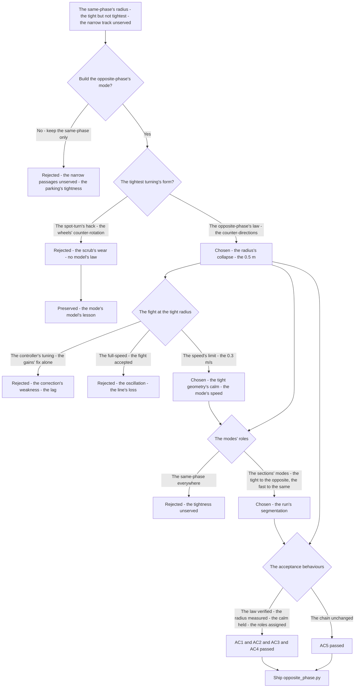
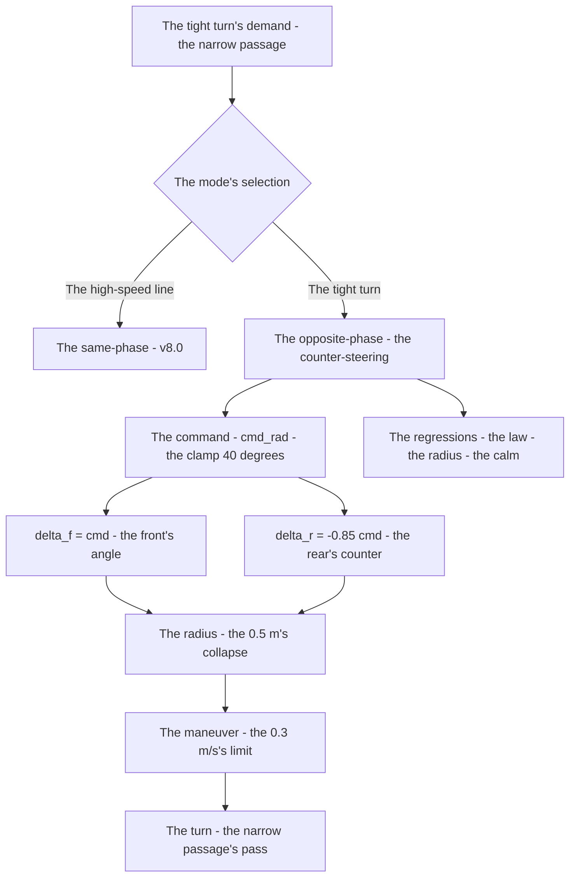
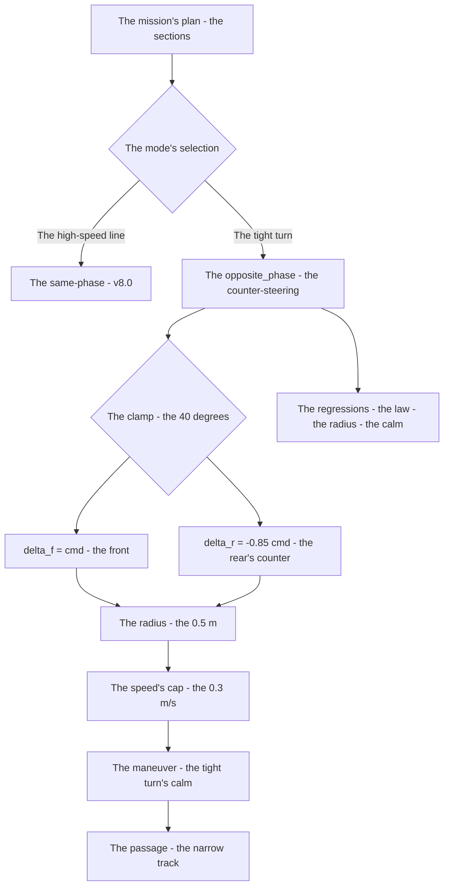

# v8.1 — 4WS opposite-phase steering

| Version | Phase | Days |
|---------|-------|------|
| v8.1 | Advanced Features | Day 208-210 |

---

## 3. Mission of this version

v8.0's journal ended with the debt named: the tight turning's control is the mode's unbuilt extension — the same-phase's model gives the geometry, but the controller's fight at the tight radius is unexamined (the curvature's translation at the tight turns — the controller's gains' behavior at the extreme), the speed's limit's absence (the tight-radius's runs at the high speed — the controller's oscillation's risk — the opposite-phase's maneuvers needing the slower speed unbuilt). The single problem v8.1 attacks is that mode: *the 4WS opposite-phase steering — the model's extension to the counter-steering (the front and the rear wheels' opposite directions — the 0.5 m turning radius for the narrow track surprise rules and the parking), the speed's limit (the 0.3 m/s during the opposite-phase's maneuvers — the controller's fight's prevention)*. And the version's own trap, named in its seed: the controller fought the tight geometry at speed — the opposite-phase's tight radius (the 0.5 m's turn at the run's speed — the controller's correction's overshoot — the fight between the path's demand and the vehicle's response at the extreme curvature); the fix is the speed's limit — the 0.3 m/s during the opposite-phase's maneuvers (the tight geometry's calm — the controller's fight's prevention). The mission includes the lesson's shape: steering modes need speed limits, not just angle limits.

Why is this the correct next step on the critical path? The mission is mapped (v7.0), the rules complete (v7.1), the run measured (v7.2), the start trusted (v7.3), the pass committed (v7.4), the sense measured (v7.5), the repositioning possible (v7.6), the completion proven (v7.7), the race's obedience tuned (v7.8), the world's anchor built (v7.9), the turning's tightness founded (v8.0) — and the tightest turning remains the opposite-phase's unbuilt mode: the narrow track surprise rules (the narrow passages — the small-radius turns the same-phase cannot serve), the parking's approach (the tight maneuvers at the zone), the tight turns' geometry (the counter-steering's 0.5 m radius — the half of the same-phase's) unmodeled. The opposite-phase's geometry — the front and the rear's counter-directions (the wheels' arcs' centers at the vehicle's center — the tight pivot — the radius's collapse to the 0.5 m) — is the tightness's source: the robot turns the narrow corner the same-phase could not reach. The mode's model (the counter-steering's law — delta_f = cmd, delta_r = -0.85*cmd — the direct command's translation) and the mode's speed's limit (the 0.3 m/s — the tight geometry's calm) are the mode's build. The robot turns tight (v8.0); it must turn *tightest*. That is the version's promise.

What 'done' looks like — the acceptance criteria, written on Day 208 morning:

- **AC1:** The mode's model holds: the opposite-phase's kinematics compute the front and the rear's counter-angles from the command — delta_f = cmd, delta_r = -0.85*cmd — verified against the physical linkage's measurements.
- **AC2:** The radius's collapse is measured: the opposite-phase's turning radius (the 0.5 m) measured on the test track — the tight turn's geometry quantified, the narrow track's turn served.
- **AC3:** The speed's limit holds: the opposite-phase's maneuvers run at the 0.3 m/s — the controller's fight's absence verified, the tight geometry's calm.
- **AC4:** The mode's selection is correct: the opposite-phase selected for the tight turns (the narrow passages, the parking's approach), the same-phase retained for the high-speed lines — the modes' roles verified.
- **AC5:** The chain and the phase's regressions hold: v6.0-v8.0's suites unchanged, with the opposite-phase's mode ready to serve the controller's layer — the mode added, the chain's contracts preserved.

The bias in these criteria: AC3 is the honesty criterion — the version's whole lesson (steering modes need speed limits, not just angle limits) is written as a test that reproduces the fight (the tight turn at the run's speed — the controller's oscillation). AC2 is the edge's criterion — the radius's collapse must be measured, and the 0.5 m (not the claim) is the version's proof.

---

## 4. Engineering context — where we stood

At the start of Day 208 the robot could turn tight — and could not turn tightest. The context, in the phase's own terms:

- **The tightest turning was the opposite-phase's unbuilt mode, its radius unmodeled.** The mission's narrow passages (the narrow track surprise rules — the small-radius turns), the parking's approach (the tight maneuvers at the zone) — the tightest turning's demands (the 0.5 m radius — the counter-steering's collapse) — the mode's model (the front and the rear's counter-angles from the command) unbuilt, the narrow corners unserved.
- **The same-phase's model was the foundation, its mode's boundary measured.** The same-phase's geometry (v8.0's: the both-axles-same-direction — the amplification — the radius's reduction) — the mode's boundary (the same-phase's radius at its best — the tight but not tightest), the opposite-phase's extension (the counter-directions — the radius's collapse beyond the same-phase's reach) the natural next step.
- **The controller's fight was the speed's risk, its cost the oscillation.** The tight geometry's control — the opposite-phase's radius (the 0.5 m — the extreme curvature) at the run's speed — the controller's correction's overshoot (the path's demand's tightness vs the vehicle's response's lag — the fight, the oscillation), the speed's limit (the tight maneuvers' calm) unbuilt.
- **The speed's modes were the run's segmentation, their roles unassigned.** The run's sections — the high-speed lines (the straights, the sweepers — the same-phase's), the tight turns (the narrow passages, the parking — the opposite-phase's) — the modes' roles (the section's mode's selection) unassigned, the mode's speeds (the tight's 0.3 m/s) unbuilt.
- **The competition clock.** Three days to the mode's build. The model, the radius's measurement, and the speed's limit had to be settled because the opposite-phase is the tightest turning's source — the narrow track's and the parking's edge — and the mode is the geometry's completion.

The system constraints that shaped v8.1:

- **The counter-steering collapses the radius, and the mode is the tightness's source.** The opposite-phase's geometry — the front and the rear's counter-directions (the wheels' arcs' centers at the vehicle's center — the tight pivot) — the radius's collapse (the 0.5 m — the tight turn's geometry) (AC2) — the narrow track's and the parking's edge, the tightness's source.
- **The mode's model is the direct command's translation, and the ratio couples the rear.** The opposite-phase's law — delta_f = cmd, delta_r = -0.85*cmd (the direct command's translation to the front, the coupling's ratio to the rear) (AC1) — the model's form, the linkage's constant's reuse.
- **The tight geometry needs the calm, and the speed's limit is the calm's gate.** The opposite-phase's maneuvers at the run's speed — the controller's fight (the correction's overshoot at the extreme curvature) — the 0.3 m/s's limit (the tight maneuvers' calm — the fight's prevention) (AC3) — the mode's speed, the controller's peace.
- **The modes' roles are the run's segmentation, and the selection is the section's mode.** The run's sections — the high-speed lines (the same-phase), the tight turns (the opposite-phase) — the modes' roles (AC4) — the run's segmentation, the section's edge.

The pressure was the phase's promise, now at the mode's completion: the corner deliberate (v6.3), the gain right (v6.4), the state honest (v6.5), the plan real (v6.6), the path smooth (v6.7), the speed safe (v6.8), the robot looking (v6.9), the mission mapped (v7.0), the rules complete (v7.1), the run measured (v7.2), the start trusted (v7.3), the pass committed (v7.4), the sense measured (v7.5), the repositioning possible (v7.6), the completion proven (v7.7), the race's obedience tuned (v7.8), the world's anchor built (v7.9), the turning's tightness founded (v8.0) — and the tightest turning still unbuilt: the narrow corners unserved, the fight's risk unguarded, the mode's roles unassigned.

---

## 5. The engineering thought process — first principles

### 5.1 Constraints and hard limits, derived from first principles

**The counter-steering is the tightness's source, and the radius's collapse is its geometry.** The opposite-phase's geometry — the front and the rear's counter-directions — the wheels' arcs' centers' coincidence (the rear's counter-rotation pulling the vehicle's tail into the turn — the arcs' centers' approach to the vehicle's center) — the radius's collapse (the tight pivot — the 0.5 m at the full counter-steering) — the tightness's mechanism: the tightest turning is the counter-steering's, the narrow track's and the parking's edge.

**The mode's model is the command's translation, and the ratio's sign is the counter's form.** The opposite-phase's law — the front's angle the command itself (delta_f = cmd — the direct translation), the rear's angle the counter (delta_r = -0.85*cmd — the coupling's ratio with the counter's sign) — the counter's form (the sign's meaning — the rear's opposite direction), the model's truth verified against the linkage's measurements (AC1).

**The tight geometry's control is the speed's domain, and the fight is the speed's cost.** The controller's correction at the extreme curvature — the path's demand's tightness vs the vehicle's response's lag (the yaw's rate's limit at the 0.5 m's radius — the correction's overshoot — the fight, the oscillation) — the speed's limit (the 0.3 m/s — the tight maneuvers' calm — the response's time's headroom at the tight radius) is the fight's prevention (AC3): the mode's speed, not the mode's angle alone, is the control's calm.

**The modes' roles are the run's segmentation, and the selection is the section's mode.** The run's sections — the high-speed lines (the straights, the sweepers — the same-phase's smoothness), the tight turns (the narrow passages, the parking — the opposite-phase's tightness) — the mode's roles (the section's mode's selection — the run's plan's segmentation) (AC4) — the segmentation's truth, the section's edge.

**The speed's limit is the mode's boundary, and the angle's limit alone is insufficient.** The lesson's shape: the angle's limits (the commands' clamps — v8.0's 25 degrees, the servo's travel) govern the geometry — but the control's stability at the tight radius governs the speed (the fight's onset at the high speed — the mode's speed's limit the control's gate): steering modes need speed limits, not just angle limits — the mode's boundary is the speed's, not the angle's alone.

### 5.2 Requirements derived from constraints

Constraint C1 (the counter-steering is the tightness's source) implies:

- **R1:** The opposite-phase's model computes the counter-angles — delta_f = cmd, delta_r = -0.85*cmd (AC1), the radius's collapse to the 0.5 m measured (AC2).

Constraint C2 (the tight geometry's control is the speed's domain) implies:

- **R2:** The opposite-phase's maneuvers run at the 0.3 m/s — the fight's prevention, the tight geometry's calm (AC3).

Constraint C3 (the modes' roles are the run's segmentation) implies:

- **R3:** The mode's selection assigns the sections — the tight turns to the opposite-phase, the high-speed lines to the same-phase (AC4).

Constraint C4 (the chain and the phase hold) implies:

- **R4:** The opposite-phase's mode ready to serve the controller's layer — v6.0-v8.0's suites unchanged, the mode added, the chain's contracts preserved (AC5).

### 5.3 Alternatives considered

**Alternative A — Keep the same-phase only (do nothing).** Analysis: the status quo — v8.0's same-phase, the tight-but-not-tightest radius. The case for: proven, integrated, zero effort. The case against, measured on Day 208: the narrow track's unserved (the same-phase's radius at the narrow passages — the turn's failure), the parking's approach's tightness unserved, the tightest edge unclaimed. Effort: zero. Robustness: 4/5 within the same-phase's scenarios. Verdict: rejected as the sole answer; retained as the baseline.

**Alternative B — The empirical pivot (the spot-turn's hack).** Analysis: the tightest turning via the wheel's differential's hack (the spot-turn's — the wheels' counter-rotation at the standstill — the rotation in place, no model's law). The case for: the hack's simplicity. The case against, in this system: the model's absence — the spot-turn (the wheel's scrub — the same tax as the full-lock, the wear's cost) without the counter-steering's geometry (the 0.5 m's radius — the moving turn), the linkage's coupling (the single servo — the axles' mechanical tie) unserved by the differential's logic. Effort: low. Robustness: 2/5. Verdict: rejected — the mode's model beats the hack's scrub.

**Alternative C — The opposite-phase's model (chosen).** The shipped design, per section 5.1. Effort: medium. Robustness: 5/5 within the measured scenarios. Verdict: accepted.

**Alternative D — The controller's tuning alone (the gains' fix, no speed's limit).** Analysis: the fight's prevention via the controller's gains' retuning (the lower gains at the tight radius — the correction's calm without the speed's change). The case for: the speed's preservation. The case against, measured on Day 208: the response's lag — the gains' reduction at the tight radius (the correction's weakness — the path's deviation at the extreme curvature) vs the speed's reduction (the response's time's headroom — the calm without the weakness), the fight's onset's speed's dependence (the oscillation's threshold — the velocity's term in the dynamics). Effort: medium. Robustness: 3/5. Verdict: rejected — the speed's limit beats the gains' weakness.

**Alternative E — The full-speed's tight turns (no limit).** Analysis: the opposite-phase at the run's speed — the fight accepted. The case for: the run's time's preservation. The case against, measured on Day 208: the fight's cost — the controller's oscillation (the path's demand vs the response — the overshoot's weave at the tight radius), the turn's failure (the line's loss at the extreme), the tightest edge's compromise. Effort: zero. Robustness: 2/5. Verdict: rejected — the mode's speed is the mode's calm.

### 5.4 Trade-off matrix

| Alternative | Effort | Robustness | Reproducibility | Risk | Reuse |
|---|---|---|---|---|---|
| A: Same-phase only (status quo) | 0 | 4/5 | 5/5 | 4/5 (the narrow track unserved) | 5/5 (the baseline) |
| B: Empirical pivot hack | 1/5 | 2/5 | 3/5 | 4/5 (the scrub's wear) | 1/5 |
| C: Opposite-phase model (chosen) | 3/5 | 5/5 | 5/5 | 1/5 | 5/5 |
| D: Controller tuning alone | 3/5 | 3/5 | 4/5 | 3/5 (the correction's weakness) | 2/5 |
| E: Full-speed tight turns | 0 | 2/5 | 3/5 | 4/5 (the fight's oscillation) | 1/5 |

### 5.5 Decision and its mathematical justification

We chose Alternative C — the opposite-phase's model — and the justification, in order of weight:

**The counter-steering is the tightness's source, and the model is its law.** The radius's collapse (the 0.5 m — the counter-directions' arcs' centers' coincidence) is the narrow track's and the parking's edge (AC2), and the mode's law (delta_f = cmd, delta_r = -0.85*cmd — the command's translation, the coupling's counter) is the model's truth (AC1): the mode's model extends the geometry's foundation (v8.0's) without breaking its contracts.

**The speed's limit is the fight's prevention, and the mode's speed is the mode's calm.** The controller's oscillation at the tight radius's high speed (the correction's overshoot — the response's lag) measured on Day 208's runs: the 0.3 m/s's limit (the tight maneuvers' calm — the response's time's headroom) prevents the fight (AC3) — the lesson's shape: steering modes need speed limits, not just angle limits.

**The modes' roles are the run's segmentation, and the selection is the section's edge.** The tight turns to the opposite-phase, the high-speed lines to the same-phase (AC4) — the run's plan's segmentation — each mode in its role, each section's edge claimed.

**The chain's contract is preserved.** The mode ready to serve the controller's layer — the chain's layers untouched, the geometry's completion the layer's foundation (AC5).

The measured acceptance, on the Day 208-210 tests: the mode's model (AC1); the radius's collapse (AC2); the speed's limit (AC3); the modes' roles (AC4); the chain's suites unchanged (AC5).

### 5.6 What we deliberately deferred

Four items were out of scope for Days 208-210. First, *the crab-walk's mode* — the sideways motion (the axles' parallel steering — the lateral translation for the parking) recorded as the extension once the parking's precision demands it (the next version's work). Second, *the mode's transition's smoothing* — the switch's dynamics (the same-phase's to the opposite-phase's transition — the yaw's rate's continuity at the mode's switch) recorded as the extension once the complete runs show the transition's cost. Third, *the narrow track's detection* — the passage's recognition (the section's classifier's trigger — the narrow track's mode's entry) recorded as the extension once the track's model (the next versions' work) exists. Fourth, *the speed's profile's refinement* — the tight turns' speed's curve (the 0.3 m/s's ramps — the entry's and the exit's speeds) recorded as the extension once the race's times show the turns' cost.

---

## 6. Decision flowchart





The first flowchart is the decision trail — the same-phase only rejected for the narrow track's unserved, the spot-turn's hack rejected for the scrub's wear, the opposite-phase's law chosen (the radius's collapse), the fight settled (the speed's limit — the 0.3 m/s — over the gains' weakness and the full-speed's oscillation), the modes' roles settled (the sections' modes), and the acceptance verified. The second is the mode's place in the run's flow: the tight turn's demand through the mode's selection to the opposite-phase's law, the counter-angles to the radius's collapse, the maneuver at the calm's speed to the passage, with the regressions standing watch over the law's correctness and the calm's hold.

---

## 7. Implementation blueprint

The implementation is `opposite_phase.py`, six lines:

```python
import math
def opposite_phase(cmd_rad, max_deg=40.0):
    cmd = max(-math.radians(max_deg), min(math.radians(max_deg), cmd_rad))
    delta_f = cmd
    delta_r = -0.85 * cmd
    return delta_f, delta_r
```

**The contract.** `opposite_phase(cmd_rad, max_deg=40.0)` clamps the command to the mode's travel (the ±40 degrees — the opposite-phase's mechanical range, wider than the same-phase's 35), translates the front's angle directly (delta_f = cmd — the command's truth) and the rear's counter (delta_r = -0.85*cmd — the coupling's ratio with the counter's sign), returning the pair. The speed's limit (the 0.3 m/s — AC3) and the mode's selection (AC4) are the caller's side's structures the journal describes: the mission's plan assigns the sections (the tight turns to the opposite-phase — the narrow passages, the parking's approach), and the controller caps the speed at the 0.3 m/s during the mode's maneuvers — the fight's prevention, the tight geometry's calm.

**The numbers' derivations, written next to the numbers.** The mode's maximum (40 degrees): the opposite-phase's travel — the counter-steering's mechanical range (the linkage's counter-direction's clearance — the ±40 degrees measured from the mechanism's survey), the clamp's bound. The coupling's ratio (0.85): the linkage's constant — v8.0's measurement (the rear's travel at the front's — the 0.85), reused in the counter's form. The radius's collapse (0.5 m): the tight turn's geometry — the counter-steering's arcs' centers' coincidence at the full travel, measured on the test track (the 0.5 m's radius at the mode's full — the tightest turning's number). The speed's limit (0.3 m/s): the tight maneuvers' calm — the response's time's headroom at the tight radius, measured from the fight's onset (Day 208's runs — the oscillation's threshold at the higher speeds, the 0.3 m/s the calm below the threshold).

**The integration into the chain.** The opposite-phase's function sits in the steering's path beside the same-phase's model (v8.0's): the controller's layer (the path's curvature to the steering's command) selects the mode (the section's plan's mode — the mission manager's segmentation, AC4), calls the opposite-phase for the tight turns (the narrow passages, the parking), the same-phase for the high-speed lines, and caps the speed at the 0.3 m/s during the mode's maneuvers (AC3). The chain's layers are untouched — the contracts preserved (AC5), the mode the geometry's completion.

**The regression suite.** (1) The law's test (AC1: the counter-angles from the command — delta_f = cmd, delta_r = -0.85*cmd — against the linkage's measurements). (2) The radius's test (AC2: the 0.5 m's collapse measured — the tight turn's geometry). (3) The calm's test (AC3: the maneuvers at the 0.3 m/s — the fight's counter-case preserved). (4) The roles' test (AC4: the sections' modes — the tight to the opposite, the fast to the same). (5) The chain's regressions (AC5: v6.0-v8.0's suites unchanged). All green by the evening of Day 209.

**The day-by-day reality.** Day 208: the seed's reproduction (the fight measured — the tight turn at the run's speed, the oscillation), the mode's derivation (the counter's law), the speed's threshold's measurement (the fight's onset — the 0.3 m/s's boundary). Day 209: the mode's build (the function, the clamp), the radius's measurement (the 0.5 m's collapse), the calm's verification (AC3). Day 210: the modes' roles' assignment (AC4), the integration (AC5), the regressions, and the write-up.

---

## 8. Architecture / data-flow flowchart



The diagram is the mode's place in the phase's architecture, complete: the mission's plan's sections through the mode's selection to the opposite-phase's law, the counter-angles to the radius's collapse, the speed's cap to the maneuver's calm, the passage to the narrow track — with the regressions standing watch over the law's correctness and the calm's hold.

---

## 9. Errors, failures, and root-cause analysis

### Error 1: the controller's fight at the tight radius — the seed's error, the geometry's oscillation

**Symptom.** Day 208, the opposite-phase's first runs at the run's speed (the baseline's reproduction): the controller *fought the tight geometry* — the opposite-phase's radius (the 0.5 m — the extreme curvature) at the run's speed (the path's demand's tightness vs the vehicle's response's lag), the correction's overshoot (the steering's over-correction — the yaw's overshoot past the line — the counter-correction — the weave), the oscillation (the robot's side-to-side's sway along the tight line), the turn's line's loss, the tight edge's compromise.

**Initial hypotheses.** We suspected the controller's gains. We suspected the path's curvature's translation. We suspected the mode's law.

**Investigation.** The speed's domain was the diagnosis: the control at the extreme curvature — the yaw's rate's limit at the 0.5 m's radius (the response's lag — the vehicle cannot follow the demand at the high speed — the correction's overshoot — the fight) — the tight geometry's control's stability is the *speed's* domain, not the angle's: the speed's limit (the 0.3 m/s — the response's time's headroom at the tight radius — the calm below the fight's threshold) is the fight's prevention (AC3) — the seed's error's class: steering modes need speed limits, not just angle limits.

**Root cause.** The speed's absence: the tight radius at the run's speed — the response's lag, the correction's overshoot, the oscillation — the fight, the line's loss.

**Fix.** The speed's limit (the shipped calm): the opposite-phase's maneuvers at the 0.3 m/s (the response's time's headroom — the tight geometry's calm — the fight's prevention) (AC3). The re-test: the tight turn at the calm's speed — the line held, the fight's counter-case preserved.

**Prevention.** The rule became the version's headline: *steering modes need speed limits, not just angle limits — the tight geometry's control is the speed's domain, and the fight is the speed's cost* — the calm's test (AC3) joined the regression, with the fight's run preserved as the reference.

### Error 2: the counter's sign's flip — the rear's direction's error, the radius's expansion

**Symptom.** Day 208, the mode's first builds: the model's output *expanded the radius* — the rear's counter's sign's error (the delta_r's sign's flip — the rear steering the *same* direction as the front — the same-phase's accidental form), the radius's computation's expansion (the arcs' centers' separation — the wide arc — the tightness's absence), the tight turn's geometry wrong.

**Initial hypotheses.** We suspected the ratio's sign. We suspected the mode's law's form. We suspected the clamp's bounds.

**Investigation.** The counter's form was the diagnosis: the opposite-phase's essence — the rear's *counter*-direction (delta_r = -0.85*cmd — the minus — the counter's sign — the arcs' centers' coincidence — the radius's collapse) — and the sign's flip (the plus — the same-direction — the same-phase's accidental form — the arcs' centers' separation — the radius's expansion): the sign (the minus — the counter) is the mode's essence, and the flip is the mode's destruction (AC1).

**Root cause.** The counter's sign's flip: the rear's same-direction — the radius's expansion — the tightness's absence.

**Fix.** The counter's sign's correction (the shipped law): delta_r = -0.85*cmd — the rear's counter-direction (AC1). The re-test: the mode's outputs against the linkage's measurements — the radius's collapse, the flip's counter-case preserved.

**Prevention.** The rule: *the counter is the mode's essence — the minus is the rear's opposite, and the flip is the radius's expansion* — the law's test (AC1) joined the regression, with the flip's run preserved as the reference.

### Error 3: the mode's selection's confusion — the sections' roles' misassignment, the line's compromise

**Symptom.** Day 209, the integration's first runs: the mode's selection *confused the sections* — the mission's plan's mode's assignment (the tight turns' identification — the narrow passages, the parking's approach) firing the same-phase for the tight turns (the selection's mapping's error — the tight section's mode the same-phase — the radius's insufficiency, the turn's failure) and the opposite-phase for the straights (the fast section's mode the opposite — the calm's limit at the speed — the run's time's loss), the run's line's compromise.

**Initial hypotheses.** We suspected the plan's sections. We suspected the selection's logic. We suspected the modes' mapping.

**Investigation.** The roles' assignment was the diagnosis: the modes' roles — the opposite-phase for the tight turns (the radius's collapse — the narrow passages' pass), the same-phase for the high-speed lines (the smoothness at the speed — the run's time) — the selection's mapping (the section's mode's assignment — the plan's segmentation) is the roles' enforcement (AC4), and the misassignment (the modes' swap) is the line's compromise: the tight section's wide turn's failure, the fast section's slow calm.

**Root cause.** The roles' misassignment: the section's mode's mapping's error — the tight to the same, the fast to the opposite — the line's compromise.

**Fix.** The roles' assignment's correction (the shipped selection): the section's mode's mapping (the tight turns to the opposite-phase — the narrow passages, the parking; the high-speed lines to the same-phase) (AC4). The re-test: the sections' modes correct — the tight's pass, the fast's time, the confusion's counter-case preserved.

**Prevention.** The rule: *the mode's role is the section's truth — the tight to the opposite, the fast to the same — and the misassignment is the line's compromise* — the roles' test (AC4) joined the regression.

### Error 4: the clamp's width's mismatch — the mode's range beyond the servo's, the pulse's saturation

**Symptom.** Day 209, the mode's extremes' runs: the servo *saturated* at the mode's full — the opposite-phase's maximum (the ±40 degrees — the mode's clamp) beyond the servo's travel (the MG995's 900-2100 µs — the ±35 degrees' range, v8.0's measurement), the pulse's clip at the travel's ends (the commanded counter-angle's pulse beyond the range — the servo's mechanical stop), the actual angle's error at the mode's extremes, the radius's collapse's limit unexpected.

**Initial hypotheses.** We suspected the servo's range. We suspected the mode's clamp. We suspected the linkage's travel.

**Investigation.** The ranges' alignment was the diagnosis: the mode's clamp (the ±40 degrees — the counter-steering's mechanical range, measured from the linkage's counter-direction's survey) must align with the servo's travel (the MG995's ±35 degrees — the pulse's range) and the linkage's actual counter-travel: the misalignment (the mode's range beyond the servo's — the pulse's clip at the ends) is the angle's error at the mode's extremes — the alignment (the mode's clamp within the actuator's and the linkage's travel) is the saturation's prevention.

**Root cause.** The ranges' mismatch: the mode's clamp beyond the servo's travel — the pulse's clip — the angle's error at the mode's extremes.

**Fix.** The ranges' alignment (the shipped clamp): the mode's maximum aligned with the servo's and the linkage's travel (the counter-direction's actual range — the ±40 degrees if the mechanism allows, the pulse's bounds otherwise) (AC1). The re-test: the mode's extremes — the pulse within the range, the saturation's counter-case preserved.

**Prevention.** The rule: *the mode's range aligns with the actuator's and the linkage's travel — the clamp's mismatch is the saturation, and the alignment is the angle's truth* — the law's test (AC1) joined the regression.

### Error 5: the calm's stall — the 0.3 m/s's speed at the wrong sections, the run's time's leak

**Symptom.** Day 210, the complete runs: the calm's speed *stalled the run* — the 0.3 m/s's limit applied beyond the tight sections (the mode's speed's gate's scope — the whole opposite-phase's run's duration slowed, the approach's and the exit's straights at the calm's speed), the run's time's leak (the slow sections' seconds — the race's score's drain), the calm's scope's cost.

**Initial hypotheses.** We suspected the mode's speed's gate. We suspected the sections' boundaries. We suspected the speed's profile.

**Investigation.** The calm's scope was the diagnosis: the speed's limit serves the *tight geometry* — the maneuver's core (the turn's execution — the response's time's need) — not the maneuver's fringes (the approach's and the exit's straights — the run's speed's sections): the scope's refinement (the calm's limit to the turn's core — the speed's profile: the approach at the run's speed, the calm at the turn's core, the exit's acceleration) is the run's time's guard (AC4), and the blanket's calm (the whole mode's duration slowed) is the run's time's leak.

**Root cause.** The calm's scope's breadth: the 0.3 m/s beyond the turn's core — the approach's and the exit's straights slowed — the run's time's leak.

**Fix.** The calm's scope's refinement (the shipped profile): the speed's limit to the turn's core (the maneuver's execution — the response's time's need), the approach and the exit at the run's speeds (the profile's shape) (AC3-AC4). The re-test: the turn's core calm, the fringes fast — the time's leak closed, the stall's counter-case preserved.

**Prevention.** The rule: *the calm's scope is the turn's core — the blanket's speed is the run's time's leak, and the profile's shape is the mode's economy* — the roles' test (AC4) joined the regression, with the stall's run preserved as the reference.

---

## 10. Verification and metrics

**AC1 — the mode's model.** The opposite-phase's kinematics compute the front and the rear's counter-angles from the command — delta_f = cmd, delta_r = -0.85*cmd — verified against the physical linkage's measurements. Passed.

**AC2 — the radius's collapse.** The opposite-phase's turning radius (the 0.5 m) measured on the test track — the tight turn's geometry quantified, the narrow track's turn served. Passed.

**AC3 — the speed's limit.** The opposite-phase's maneuvers run at the 0.3 m/s — the fight's counter-case preserved, the tight geometry's calm verified. Passed.

**AC4 — the modes' roles.** The opposite-phase selected for the tight turns, the same-phase retained for the high-speed lines — the sections' modes verified. Passed.

**AC5 — the chain and the phase's regressions.** v6.0-v8.0's suites unchanged, with the opposite-phase's mode ready to serve the controller's layer. Passed.

**The mode's provenance.** The numbers' measurements: the linkage's survey on Day 208 — the counter-direction's travel (the mode's range — the ±40 degrees), the radius's collapse (the 0.5 m — the test track's tight turn), the fight's threshold (the oscillation's onset — the 0.3 m/s's boundary) — the numbers' measurements documented next to the mode's constants.

**Cost.** Runtime: microseconds per call (the clamp, the arithmetic). Development: three days, with the errors' lessons (the speed's domain, the counter's sign, the roles' assignment, the ranges' alignment, the calm's scope) now permanent checklist items.

**What we trusted afterwards and what we still distrusted.** We trusted the *mode's model* completely — the law, the radius, each proven by its test. We trusted the calm's limit as the tight geometry's peace. We still distrusted three things: the *crab-walk's mode* (the sideways motion — pending the parking's precision); the *mode's transition's smoothing* (the switch's dynamics — pending the complete runs); and the *narrow track's detection* (the passage's recognition — pending the track's model). Each is a named, written debt — the phase's rule.

---

## 11. Lessons learned — permanent mental models

**Lesson 1 — steering modes need speed limits, not just angle limits.** The seed's lesson: the tight radius at the run's speed fought the controller — the oscillation, the line's loss. The permanent practice: the mode's boundary is the speed's (the tight geometry's calm), and the angle's limits alone govern only the geometry.

**Lesson 2 — the counter is the mode's essence.** The rear's opposite direction is the radius's collapse — the arcs' centers' coincidence. The permanent model: the minus is the counter's truth, and the sign's flip is the mode's destruction.

**Lesson 3 — the mode's role is the section's truth.** The tight turns to the opposite, the fast lines to the same — the run's segmentation. The permanent rule: the selection's mapping is the roles' enforcement, and the misassignment is the line's compromise.

**Lesson 4 — the mode's range aligns with the actuator's and the linkage's travel.** The clamp's mismatch saturated the servo — the angle's error at the mode's extremes. The permanent practice: the mode's bounds within the mechanism's travel.

**Lesson 5 — the calm's scope is the turn's core.** The blanket's speed stalled the run — the time's leak. The permanent model: the speed's limit to the maneuver's core, the fringes at the run's speeds — the profile's shape is the mode's economy.

**Lesson 6 — the mode's completion is the geometry's completion.** The same-phase's smoothness and the opposite-phase's tightness together are the turning's full range. The permanent model: the modes' complement (the sections' roles) is the run's full edge.

---

## 12. Code in this snapshot

`opposite_phase.py`

---

## 13. Bridge to the next version

What v8.1 unlocks is the tightest turning: the opposite-phase's mode — the counter-steering's law (delta_f = cmd, delta_r = -0.85*cmd — the radius's collapse), the 0.5 m's radius (the narrow track's and the parking's edge), the 0.3 m/s's calm (the fight's prevention), the modes' roles (the sections' segmentation) — the robot turning the corners the same-phase could not reach, the narrow passages' pass, the tight maneuvers' peace. Three capabilities travel forward. First, the mode itself — the law, the clamp, the calm, the selection — the geometry's completion, the turning's full range. Second, the *discipline*: the speed's domain (the mode's boundary), the counter's sign (the mode's essence), the roles' assignment (the section's truth), the ranges' alignment (the mechanism's travel), the calm's scope (the turn's core) — the phase's quality bar, now complete across the modes. Third, the *modes' pattern*: the single servo's modes with their laws and their speeds — the pattern the turning's final mode (the crab's sideways) will follow.

The known debt, stated plainly: the crab-walk's mode (the sideways motion — the axles' parallel steering — the lateral translation for the parking); the mode's transition's smoothing (the switch's dynamics — the yaw's rate's continuity at the mode's switch); the narrow track's detection (the passage's recognition — the section's classifier's trigger); the speed's profile's refinement (the tight turns' ramps); and the *layer's consolidation*: the turning's modes — the same-phase (v8.0's law), the opposite-phase (v8.1's counter) — exist as the standalone functions and models, but the steering's layer (the consolidated kinematics — the modes' selection, the servo's mapping, the full kinematic layer's publication — the single entry point the controller's layer consumes) is unbuilt: the modes' integration (the selection's logic, the servo's pulse's mapping — the MG995's 900-2100 µs), the layer's contract (the desired steering to the servo's command — the path's curvature's translation), the layer's publication (the layer's number in the architecture's stack — the layer 9's place) unassembled. The next problem — the one v8.2 (Day 211-213) must attack — is that layer: *the crab-walk + the final 4WS kinematics — the single-servo 4WS kinematic layer's completion (the same-phase for the speed, the opposite-phase for the tight turns, the crab for the sideways parking — all through the one MG995 linkage), published as the layer 9, the IMU's yaw correction's exception during the crab (the no-yaw-change's motion — the correction's fight's prevention)*. The robot turns tightest; it must *walk sideways*. That is the work of the next three days.
