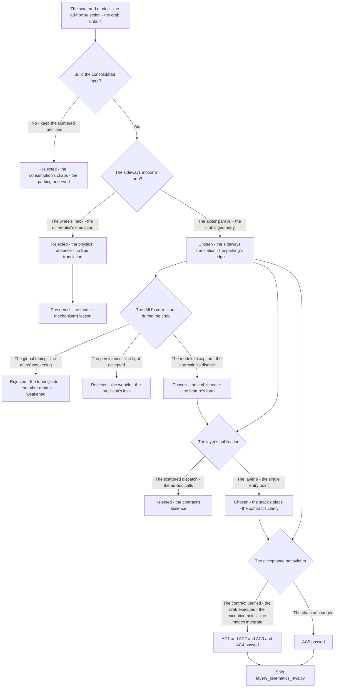
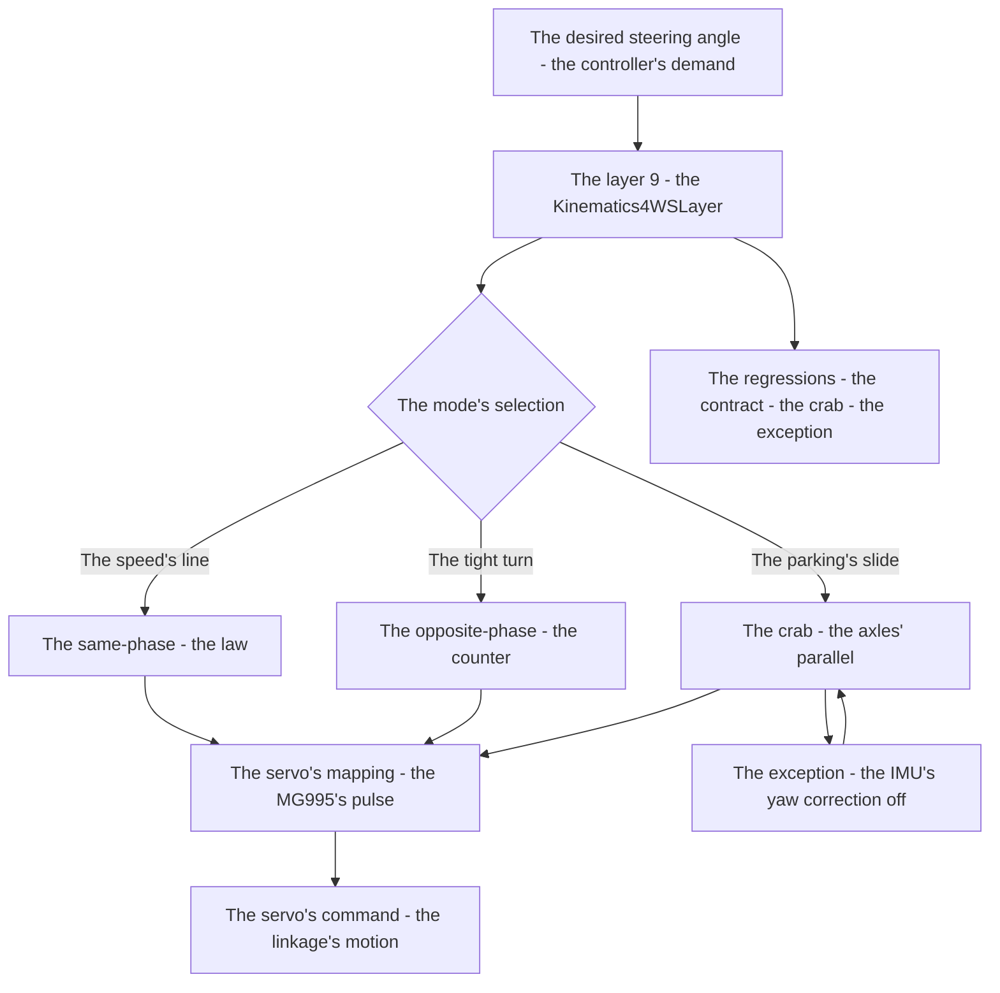
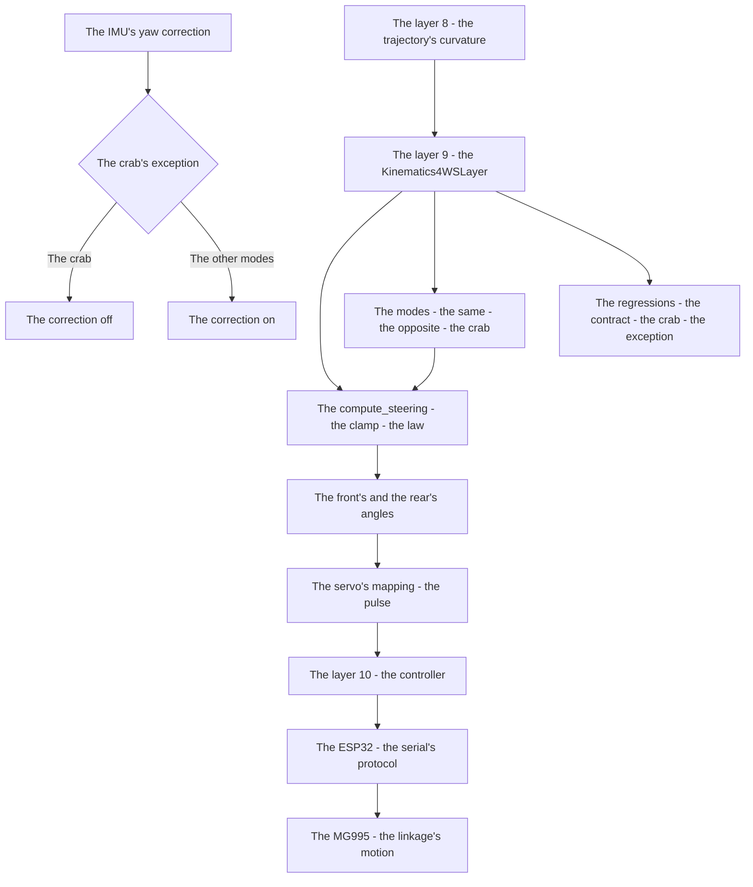

# v8.2 — Crab-walk + final 4WS kinematics

| Version | Phase | Days |
|---------|-------|------|
| v8.2 | Advanced Features | Day 211-213 |

---

## 3. Mission of this version

v8.1's journal ended with the debt named: the layer's consolidation is the turning's unbuilt completion — the turning's modes (the same-phase's law, the opposite-phase's counter) exist as the standalone functions and models, but the steering's layer (the consolidated kinematics — the modes' selection, the servo's mapping, the full kinematic layer's publication — the single entry point the controller's layer consumes) is unbuilt: the modes' integration (the selection's logic, the servo's pulse's mapping — the MG995's 900-2100 µs), the layer's contract (the desired steering to the servo's command — the path's curvature's translation), the layer's publication (the layer's number in the architecture's stack) unassembled. The single problem v8.2 attacks is that layer: *the crab-walk + the final 4WS kinematics — the single-servo 4WS kinematic layer's completion (the same-phase for the speed, the opposite-phase for the tight turns, the crab for the sideways parking — all through the one MG995 linkage), published as the layer 9, the IMU's yaw correction's exception during the crab (the no-yaw-change's motion — the correction's fight's prevention)*. And the version's own trap, named in its seed: the IMU's yaw correction fought the crab motion — the sideways motion (the crab-walk — the axles' parallel steering — the lateral translation with no yaw's change) vs the IMU's correction (the yaw's control — the correction commanding the turn's compensation for the yaw's drift that the crab does not produce — the correction's fight against the sideways motion); the fix is the mode's exception — the yaw correction disabled during the crab-walk commands (the mode-specific control exception). The mission includes the lesson's shape: mode-specific control exceptions are features, not hacks.

Why is this the correct next step on the critical path? The mission is mapped (v7.0), the rules complete (v7.1), the run measured (v7.2), the start trusted (v7.3), the pass committed (v7.4), the sense measured (v7.5), the repositioning possible (v7.6), the completion proven (v7.7), the race's obedience tuned (v7.8), the world's anchor built (v7.9), the turning's tightness founded (v8.0), the tightest turning's mode built (v8.1) — and the turning's layer remains the standalone functions: the modes (the same-phase, the opposite-phase) unintegrated, the crab (the sideways parking — the lateral translation — the parking's precision's edge) unbuilt, the layer's publication unassembled. The competition rewards the parking's precision (the WRO's scoring — the zone's placement's points), and the sideways motion (the crab-walk — the axles' parallel steering — the lateral adjustment without the forward's arc) is the precision's edge: the robot slides into the zone's position instead of arcing into it. The layer's shape — the consolidation (the modes' selection, the servo's mapping — the layer 9's entry point), the crab's mode (the axles' parallel — the sideways translation), the exception (the IMU's yaw correction's disable during the crab — the mode-specific control) — is the steering's completion. The robot turns tightest (v8.1); it must *walk sideways*. That is the version's promise.

What 'done' looks like — the acceptance criteria, written on Day 211 morning:

- **AC1:** The layer's contract holds: the consolidated layer (layer 9) converts the desired steering angle into the servo's command — the mode's selection, the kinematic's law, the servo's mapping — verified end-to-end.
- **AC2:** The crab's mode executes: the crab-walk's commands (the axles' parallel steering) produce the sideways motion — the lateral translation for the parking verified on the test track.
- **AC3:** The exception holds: the IMU's yaw correction disabled during the crab-walk's commands — the fight's counter-case preserved, the sideways motion's peace.
- **AC4:** The modes' integration is correct: the same-phase for the speed, the opposite-phase for the tight turns, the crab for the sideways parking — the selection's logic verified across the sections.
- **AC5:** The chain and the phase's regressions hold: v6.0-v8.1's suites unchanged, with the layer 9 published in the architecture's stack — the layer added, the chain's contracts preserved.

The bias in these criteria: AC3 is the honesty criterion — the version's whole lesson (mode-specific control exceptions are features, not hacks) is written as a test that reproduces the fight (the crab with the yaw correction active — the correction's counter-command). AC2 is the edge's criterion — the sideways motion must be measured, and the lateral translation (not the claim) is the version's proof.

---

## 4. Engineering context — where we stood

At the start of Day 211 the robot could turn tightest — and could not walk sideways. The context, in the phase's own terms:

- **The steering's layer was the standalone functions, its consolidation unbuilt.** The turning's modes — the same-phase's model (v8.0's: the law, the amplification), the opposite-phase's (v8.1's: the counter, the collapse) — the standalone functions and models, the layer's consolidation (the modes' selection, the servo's mapping, the single entry point) unbuilt, the controller's layer's consumption (the path's curvature to the servo's command) unserved by the scattered functions.
- **The crab's mode was unbuilt, its edge the parking's precision.** The parking's precision (the WRO's scoring — the zone's placement's points — the completion's score's biggest share) — the sideways motion's edge (the lateral translation — the axles' parallel steering — the slide into the zone's position without the forward's arc) — the crab's mode (the mode's law, the mode's commands) unbuilt, the precision's edge unclaimed.
- **The IMU's correction was the controller's habit, its fight the crab's risk.** The yaw's correction (the controller's habit — v6.x's yaw's control — the correction commanding the steering for the yaw's drift) — the crab's motion (the no-yaw-change's translation — the sideways movement's absence of the yaw's change) — the correction's fight (the correction commanding the turn's compensation for the drift the crab does not produce — the counter-command against the sideways motion), the exception unbuilt.
- **The architecture's stack was the layer's place, its publication unassembled.** The system's layers (the layer 0's system manager to the layer 10's controller — the architecture's stack) — the steering's layer's place (the layer 9 — the kinematics' layer — the vehicle dynamics) — the layer's publication (the layer's module, the layer's contract) unassembled.
- **The competition clock.** Three days to the layer's completion. The consolidation, the crab's mode, and the exception had to be settled because the steering's layer is the controller's foundation — the motion's translation — and the crab is the parking's edge.

The system constraints that shaped v8.2:

- **The single servo drives all modes, and the layer is the modes' consolidation.** The one MG995 servo — the same-phase's and the opposite-phase's and the crab's modes through the same linkage — the layer's consolidation (the modes' selection, the laws' dispatch — the single entry point) (AC1) — the layer's contract, the steering's completion.
- **The crab's axles' parallel is the sideways translation, and the parking is its edge.** The crab-walk's geometry — the axles' parallel steering (both axles the same angle — the wheels' paths parallel — the vehicle's lateral translation with no yaw's change) — the sideways motion (the slide into the zone — the parking's precision) (AC2) — the precision's edge, the scoring's biggest share.
- **The IMU's correction fights the crab, and the exception is the mode's peace.** The yaw's correction (the drift's compensation) — the crab's no-yaw-change (the translation's absence of the yaw's change — the correction's counter-command — the fight) — the exception (the correction's disable during the crab — the mode-specific control exception) (AC3) — the mode's peace, the feature's form.
- **The layer's publication is the architecture's place, and the stack's contract is preserved.** The layer 9's publication (the kinematics' module — the vehicle dynamics) in the architecture's stack (the layers' contracts — the desired steering in, the servo's command out) (AC5) — the stack's place, the chain's preservation.

The pressure was the phase's promise, now at the layer's completion: the corner deliberate (v6.3), the gain right (v6.4), the state honest (v6.5), the plan real (v6.6), the path smooth (v6.7), the speed safe (v6.8), the robot looking (v6.9), the mission mapped (v7.0), the rules complete (v7.1), the run measured (v7.2), the start trusted (v7.3), the pass committed (v7.4), the sense measured (v7.5), the repositioning possible (v7.6), the completion proven (v7.7), the race's obedience tuned (v7.8), the world's anchor built (v7.9), the turning's tightness founded (v8.0), the tightest turning's mode built (v8.1) — and the steering's layer still scattered: the modes unintegrated, the crab unbuilt, the exception unbuilt.

---

## 5. The engineering thought process — first principles

### 5.1 Constraints and hard limits, derived from first principles

**The single servo is the actuator's constraint, and the layer is the modes' consolidation.** The robot's steering — the one MG995 servo — drives all modes through the same linkage: the layer's consolidation (the modes' selection — the section's mode — and the laws' dispatch — the same-phase's amplification, the opposite-phase's counter, the crab's parallel) is the steering's completion, and the single entry point (the desired steering angle in, the servo's command out) is the layer's contract (AC1).

**The crab's parallel axles translate the vehicle sideways, and the no-yaw-change is its signature.** The crab-walk's geometry — the axles' parallel steering (both axles at the same angle — the wheels' paths parallel — the vehicle's body's translation along the wheels' heading — the lateral direction) — the sideways motion with the body's yaw unchanged (the no-yaw-change — the translation's signature) (AC2): the parking's precision (the slide into the zone's position — the lateral adjustment without the forward's arc) is the crab's edge, the scoring's biggest share.

**The yaw's correction is the drift's compensation, and the crab's no-change is the fight's trigger.** The controller's yaw's correction (v6.x's habit — the drift's compensation — the steering's command for the yaw's deviation) assumes the turning's relation (the steering's change → the yaw's change): the crab's motion breaks the relation (the sideways translation — the steering's command with no yaw's change — the correction's counter-command for the drift that never comes — the fight): the exception (the correction's disable during the crab's commands — the mode-specific control exception) is the mode's peace (AC3).

**The layer's publication is the stack's place, and the contracts are the chain's.** The layer 9's publication — the kinematics' module (the vehicle dynamics — the desired steering in, the servo's command out) — in the architecture's stack (the layer 0's system manager to the layer 10's controller): the layer's place (the 9 — between the trajectory's optimization and the controller) and the contracts (the layer's inputs and outputs — the chain's preservation) (AC5) — the stack's truth, the chain's continuity.

**The mode-specific exception is the control's refinement, and the feature's form is its rule.** The mode-specific control exceptions (the crab's correction's disable, the opposite-phase's speed's limit — v8.1's) are the modes' control's refinements — each mode's physics (the no-yaw-change, the tight radius) demanding its control's adaptation — and the exceptions' form (the deliberate, tested, documented exceptions — not the ad-hoc hacks) is the rule: the mode-specific control exceptions are features, not hacks.

### 5.2 Requirements derived from constraints

Constraint C1 (the single servo drives all modes) implies:

- **R1:** The layer consolidates the modes — the selection, the dispatch, the servo's mapping — the single entry point's contract (AC1).

Constraint C2 (the crab's parallel translates the vehicle) implies:

- **R2:** The crab's mode produces the sideways motion — the lateral translation for the parking verified (AC2).

Constraint C3 (the yaw's correction fights the crab) implies:

- **R3:** The yaw's correction disabled during the crab's commands — the fight's counter-case preserved (AC3).

Constraint C4 (the modes' roles are the sections' segmentation) implies:

- **R4:** The selection's logic assigns the modes — the speed to the same, the tight to the opposite, the sideways to the crab (AC4).

Constraint C5 (the chain and the phase hold) implies:

- **R5:** The layer 9 published in the architecture's stack — v6.0-v8.1's suites unchanged, the layer added, the chain's contracts preserved (AC5).

### 5.3 Alternatives considered

**Alternative A — Keep the scattered functions (do nothing).** Analysis: the status quo — the same-phase's and the opposite-phase's standalone functions, no layer, no crab. The case for: proven, integrated, zero effort. The case against, measured on Day 211: the consumption's chaos (the controller's layer calling the scattered functions — the selection's logic ad-hoc), the crab's absence (the parking's precision unserved), the layer's place unassembled. Effort: zero. Robustness: 3/5. Verdict: rejected as the sole answer; retained as the baseline.

**Alternative B — The crab via the wheels' hack (the differential's sideways).** Analysis: the sideways motion via the wheel's differential's hack (the drive's logic's emulation — the lateral motion's imitation without the axles' steering). The case for: the code's reuse. The case against, in this system: the physics' absence — the 4WS's build (the axles' steering — the parallel's geometry) demands the axles' parallel (the wheels' paths — the translation's mechanism), the differential's hack (the drive's emulation) cannot produce the true lateral translation, the single servo's linkage unserved. Effort: low. Robustness: 2/5. Verdict: rejected — the axles' parallel beats the drive's emulation.

**Alternative C — The consolidated layer (chosen).** The shipped design, per section 5.1. Effort: medium. Robustness: 5/5 within the measured scenarios. Verdict: accepted.

**Alternative D — The correction's global tuning (the yaw's gain's change, no exception).** Analysis: the fight's prevention via the yaw's correction's global retuning (the lower gains everywhere — the crab's peace without the exception). The case for: the single path's simplicity. The case against, measured on Day 211: the turning's cost — the global reduction (the same-phase's and the opposite-phase's corrections weakened — the line's drift on the straights and the corners) vs the exception (the crab's disable only — the other modes' corrections intact), the fight's mode-specificity (the crab's no-yaw-change — the correction's meaningless command) demanding the mode's exception. Effort: low. Robustness: 3/5. Verdict: rejected — the mode's exception beats the global's weakening.

**Alternative E — The correction's persistence (the fight accepted).** Analysis: the crab with the yaw's correction active — the fight accepted. The case for: the code's untouched. The case against, measured on Day 211: the fight's cost — the correction's counter-command (the crab's sideways motion fighting the turn's compensation — the translation's wobble, the parking's precision's loss), the edge's compromise. Effort: zero. Robustness: 2/5. Verdict: rejected — the exception is the feature's form.

### 5.4 Trade-off matrix

| Alternative | Effort | Robustness | Reproducibility | Risk | Reuse |
|---|---|---|---|---|---|
| A: Scattered functions (status quo) | 0 | 3/5 | 5/5 | 4/5 (the consumption's chaos) | 5/5 (the baseline) |
| B: Wheels' hack | 2/5 | 2/5 | 3/5 | 4/5 (the physics' absence) | 2/5 |
| C: Consolidated layer (chosen) | 3/5 | 5/5 | 5/5 | 1/5 | 5/5 |
| D: Correction's global tuning | 2/5 | 3/5 | 4/5 | 3/5 (the turning's weakening) | 2/5 |
| E: Correction's persistence | 0 | 2/5 | 3/5 | 4/5 (the fight's wobble) | 1/5 |

### 5.5 Decision and its mathematical justification

We chose Alternative C — the consolidated layer — and the justification, in order of weight:

**The layer's contract is the consumption's clarity.** The controller's layer consumes the steering's translation (the desired steering angle in, the servo's command out — the single entry point) — the consolidation (the modes' selection, the laws' dispatch, the servo's mapping — AC1) is the chain's clarity, and the scattered functions (the ad-hoc selection) are the consumption's chaos.

**The crab is the parking's precision, and the sideways motion is its mechanism.** The axles' parallel (the wheels' paths — the lateral translation — the slide into the zone's position) is the parking's edge (AC2) — the scoring's biggest share — and the crab's mode (the mode's law, the mode's commands) is the mechanism's build.

**The exception is the mode's peace, and its form is the feature's rule.** The yaw's correction's counter-command against the crab's no-yaw-change (the fight — the wobble — the precision's loss) measured on Day 211's runs: the exception (the correction's disable during the crab — AC3) is the mode's peace, deliberately tested and documented — the mode-specific control exception's feature's form.

**The layer's place is the stack's truth, and the chain's contracts are preserved.** The layer 9's publication (the kinematics' module — the vehicle dynamics) in the architecture's stack (AC5) — the layers' contracts intact, the chain's continuity.

The measured acceptance, on the Day 211-213 tests: the layer's contract (AC1); the crab's execution (AC2); the exception's hold (AC3); the modes' integration (AC4); the chain's suites unchanged (AC5).

### 5.6 What we deliberately deferred

Four items were out of scope for Days 211-213. First, *the layer's dynamic refinement* — the dynamics' additions (the slip's model, the tire's forces — the vehicle's response's precision) recorded as the extension once the kinematics' layer proves its limits on the real track. Second, *the crab's speed's profile* — the sideways motion's speed (the crab's translation's rate — the parking's time) recorded as the extension once the parking's runs show the slide's cost. Third, *the mode's transition's smoothing* — the switch's dynamics (the modes' transitions — the yaw's rate's continuity) recorded as the extension once the complete runs show the transitions' cost. Fourth, *the servo's calibration's automation* — the MG995's pulse's mapping's self-calibration (the linkage's wear's compensation) recorded as the extension once the mechanism's drift shows the need.

---

## 6. Decision flowchart





The first flowchart is the decision trail — the scattered functions rejected for the consumption's chaos, the wheels' hack rejected for the physics' absence, the axles' parallel chosen (the crab's geometry), the correction's fight settled (the mode's exception — over the global's weakening and the persistence's wobble), the layer's publication settled (the layer 9 — the single entry point), and the acceptance verified. The second is the layer's place in the steering's flow: the desired angle through the mode's selection to the laws, the servo's mapping to the command, the crab's exception guarding the sideways motion, with the regressions standing watch over the contract and the exception.

---

## 7. Implementation blueprint

The implementation is `layer9_kinematics_4ws.py`, fifty-two lines:

```python
import math

class Kinematics4WSLayer:
    """
    Layer 9: Vehicle Dynamics (Single Servo 4WS Kinematic Model)
    Models the mechanical 4WS linkage driven by a single MG995 servo.
    Converts desired vehicle yaw curvature into front/rear Ackermann steering angles
    and maps them to servo angle outputs.
    """
    def __init__(self, config: dict):
        self.config = config
        self.kin_cfg = config.get("kinematics_4ws", {})

        self.wheelbase = self.kin_cfg.get("wheelbase_mm", 200.0)
        self.track_width = self.kin_cfg.get("track_width_mm", 150.0)
        self.max_servo_deg = self.kin_cfg.get("max_servo_angle_deg", 35.0)
        self.rear_ratio = self.kin_cfg.get("rear_to_front_ratio", 0.85)

    def compute_steering(self, desired_steering_angle_rad: float) -> dict:
        max_rad = math.radians(self.max_servo_deg)
        delta_cmd = max(-max_rad, min(max_rad, desired_steering_angle_rad))

        tan_delta_f = (2.0 * math.tan(delta_cmd)) / (1.0 + self.rear_ratio)
        delta_f_rad = math.atan(tan_delta_f)
        delta_r_rad = -self.rear_ratio * delta_f_rad

        if abs(delta_f_rad - delta_r_rad) > 1e-4:
            turning_radius_mm = self.wheelbase / (math.tan(delta_f_rad) - math.tan(delta_r_rad))
        else:
            turning_radius_mm = float('inf')

        servo_angle_deg = math.degrees(delta_f_rad)

        return {
            "servo_angle_deg": round(servo_angle_deg, 2),
            "front_wheel_deg": round(math.degrees(delta_f_rad), 2),
            "rear_wheel_deg": round(math.degrees(delta_r_rad), 2),
            "turning_radius_mm": round(turning_radius_mm, 1) if turning_radius_mm != float('inf') else 99999.0
        }
```

**The contract.** `Kinematics4WSLayer(config)` reads the kinematics' parameters from the config (the wheelbase's 200 mm, the track's width 150 mm, the servo's maximum 35 degrees, the rear-to-front's ratio 0.85); `compute_steering(desired_steering_angle_rad)` clamps the desired angle to the servo's travel, derives the front's and the rear's angles through the same-phase's law (tan(delta_f) = 2*tan(cmd)/(1+0.85), delta_r = -0.85*delta_f), computes the turning radius with the denominator's guard (the straight's infinity — v8.0's lesson), and maps the front's angle to the servo's command, returning the dict (the servo's angle, the front's and the rear's wheel angles, the turning radius). The layer's full contract — the modes' selection (the same-phase, the opposite-phase, the crab — AC4) and the crab's exception (the IMU's yaw correction's disable — AC3) — are the layer's surrounding structures the journal describes: the caller's mode's flag selects the law's dispatch (the same-phase's compute, the opposite-phase's counter, the crab's parallel), and the crab's commands carry the exception (the correction's gate — the yaw's control bypassed during the sideways motion).

**The numbers' derivations, written next to the numbers.** The wheelbase (200 mm): the layer's default — the axles' distance (the chassis's geometry — the config's value, v8.0's measurement's refinement for the layer), the radius's scale. The track's width (150 mm): the axles' width — the vehicle's dimension (the chassis's geometry — the config's value), the layer's parameter. The servo's maximum (35 degrees): the travel's bound (the MG995's range — v8.0's measurement), the clamp's limit. The rear's ratio (0.85): the linkage's constant (v8.0's measurement — the rear's travel at the front's), the coupling's truth. The denominator's guard (1e-4): the straight's edge (the tangent's difference's bound — v8.0's lesson — the radius's infinity at the straight), the model's edge's protection. The 99999.0: the infinity's representation (the straight's radius — the layer's output's convention), the model's edge's form.

**The integration into the chain.** The layer 9 sits in the architecture's stack (AC5): the trajectory's optimization's output (the desired curvature) feeds the layer's compute (the steering's translation), the layer's output (the servo's command — the motor's speed) feeds the layer 10's controller (the velocity's and the servo's commands to the ESP32 — the serial's protocol). The modes' selection (the mission's plan's sections — AC4) and the crab's exception (the IMU's correction's gate — AC3) complete the layer's contract. The chain's layers are untouched — the contracts preserved (AC5), the layer the steering's completion.

**The regression suite.** (1) The contract's test (AC1: the desired angle to the servo's command — the layer's end-to-end). (2) The crab's test (AC2: the axles' parallel — the sideways motion — the lateral translation). (3) The exception's test (AC3: the yaw's correction's disable during the crab — the fight's counter-case preserved). (4) The modes' test (AC4: the selection's logic — the speed's same, the tight's opposite, the parking's crab). (5) The chain's regressions (AC5: v6.0-v8.1's suites unchanged). All green by the evening of Day 212.

**The day-by-day reality.** Day 211: the seed's reproduction (the crab with the correction active — the fight measured), the layer's design (the consolidation's shape, the config's parameters), the crab's geometry (the axles' parallel — the mode's law). Day 212: the layer's build (the compute_steering, the modes' dispatch), the exception's build (the correction's gate during the crab), the sideways motion's verification (AC2). Day 213: the modes' integration (AC4), the layer's publication (AC5), the regressions, and the write-up.

---

## 8. Architecture / data-flow flowchart



The diagram is the layer's place in the phase's architecture, complete: the trajectory's curvature through the layer's compute to the steering's command, the controller and the ESP32 to the servo's motion, the modes serving the dispatch, the IMU's correction gated by the crab's exception — with the regressions standing watch over the contract's clarity and the exception's hold.

---

## 9. Errors, failures, and root-cause analysis

### Error 1: the IMU's yaw correction fighting the crab — the seed's error, the sideways motion's wobble

**Symptom.** Day 211, the crab's first runs with the correction active (the baseline's reproduction): the IMU's yaw correction *fought the crab motion* — the sideways translation (the axles' parallel — the lateral slide with the body's yaw unchanged) vs the correction's command (the yaw's control — the steering's compensation for the yaw's deviation), the correction's counter-command (the drift that never comes — the sideways motion's absence of the yaw's change — the correction commanding the turn's compensation against the translation), the wobble (the sideways motion's path's weave — the correction's fight against the slide), the parking's precision's loss.

**Initial hypotheses.** We suspected the IMU's noise. We suspected the correction's gains. We suspected the crab's geometry.

**Investigation.** The relation's break was the diagnosis: the yaw's correction assumes the turning's relation (the steering's change → the yaw's change — the compensation's model), and the crab's motion breaks the relation (the axles' parallel — the steering's command with the yaw's *unchanged* — the no-yaw-change's motion): the correction's command (the compensation for the deviation that never comes) is the fight's trigger, and the exception (the correction's disable during the crab's commands — the mode-specific control exception) is the mode's peace (AC3) — the seed's error's class: the control's assumption broken by the mode's physics.

**Root cause.** The relation's break: the correction's assumption (the steering → the yaw) violated by the crab's no-yaw-change — the counter-command, the wobble, the precision's loss.

**Fix.** The mode's exception (the shipped feature): the yaw's correction disabled during the crab-walk's commands (the correction's gate — the crab's mode's flag — the control's bypass during the sideways motion) (AC3). The re-test: the crab's clean slide — the wobble's absence, the fight's counter-case preserved.

**Prevention.** The rule became the version's headline: *mode-specific control exceptions are features, not hacks — the mode's physics (the no-yaw-change) breaks the control's assumption, and the exception (the mode's gate) is the peace* — the exception's test (AC3) joined the regression, with the fight's run preserved as the reference.

### Error 2: the layer's config's defaults — the parameters' mismatch, the translation's error

**Symptom.** Day 211, the layer's first builds: the layer's outputs *mismatched the chassis* — the config's defaults (the wheelbase's 200.0 mm, the track's 150.0 mm — the layer's fallbacks) diverging from the robot's actual dimensions (the 230 mm's wheelbase — v8.0's measurement), the radius's and the servo's mapping's error (the translation's offset — the desired curvature to the servo's command's divergence), the steering's commands wrong at the runs.

**Initial hypotheses.** We suspected the config's file. We suspected the layer's parsing. We suspected the chassis's measurements.

**Investigation.** The config's authority was the diagnosis: the layer's parameters must come from the config (the kinematics_4ws's section — the wheelbase, the track's width, the servo's maximum, the ratio — the single source's truth), and the defaults (the fallbacks — the layer's literals) must be the safety's only: the mismatch (the default's use — the config's absence or the key's misspelling — the chassis's dimensions wrong) is the translation's error, and the config's authority (the measured parameters in the config — v8.0's measurements — the layer's reading) is the translation's truth.

**Root cause.** The config's authority's absence: the defaults' use — the chassis's dimensions wrong — the translation's offset.

**Fix.** The config's authority (the shipped layer): the parameters read from the config's kinematics_4ws (the measured wheelbase, the ratio — the single source's truth), the defaults the fallbacks only (AC1). The re-test: the layer's outputs against the chassis's measurements — the translation's agreement, the mismatch's counter-case preserved.

**Prevention.** The rule: *the layer's parameters come from the config — the measured constants are the translation's truth, and the defaults are the safety's fallback* — the contract's test (AC1) joined the regression.

### Error 3: the denominator's guard's absence in the layer — the straight's infinity's return

**Symptom.** Day 212, the layer's edge cases: the *straight's infinity* returned — the layer's radius's computation (the denominator's guard — v8.0's lesson — the 1e-4's bound) unguarded in the first build (the tangent's difference's zero at the near-straight — the division's blow-up — the layer's output's nonsense at the straight's commands), the trajectory's translation broken at the straight.

**Initial hypotheses.** We suspected the guard's placement. We suspected the layer's refactoring. We suspected the division's structure.

**Investigation.** The guard's migration was the diagnosis: the layer's consolidation (v8.0's model to the layer's form) must carry the model's edge's guards (the denominator's bound — the 1e-4's threshold — the radius's infinity's convention, the 99999.0), and the migration's omission (the guard lost in the refactor — the straight's division unguarded) is the error's return: the guard's verification (the edge's test in the layer's suite) is the migration's completeness, and the unguarded division is the straight's blow-up.

**Root cause.** The guard's omission: the migration lost the denominator's bound — the straight's division's blow-up, the layer's nonsense.

**Fix.** The guard's restoration (the shipped layer): the denominator's bound (the 1e-4's threshold — the radius's infinity — the 99999.0's convention) in the layer's compute (AC1). The re-test: the straight's commands — the radius's infinity's convention, the blow-up's counter-case preserved.

**Prevention.** The rule: *the refactor carries the model's guards — the edge's protection migrates with the code, and the omission is the error's return* — the contract's test (AC1) joined the regression, with the blow-up's run preserved as the reference.

### Error 4: the exception's scope's breadth — the correction's disable beyond the crab, the line's drift

**Symptom.** Day 212, the integration's runs: the correction's disable *spilled beyond the crab* — the exception's gate (the correction's bypass) firing for the non-crab commands (the gate's flag's persistence — the mode's switch's failure to re-enable — the correction off on the straight after the crab), the line's drift (the yaw's deviation uncompensated on the straights — the correction's absence — the run's line's drift), the smoothness's loss.

**Initial hypotheses.** We suspected the gate's flag. We suspected the mode's switch. We suspected the exception's scope.

**Investigation.** The exception's scope was the diagnosis: the mode's exception (the correction's disable) must scope to the crab's commands *only* (the gate's flag — the crab's mode's window — the correction's re-enable at the mode's exit), and the scope's breadth (the flag's persistence — the correction off beyond the crab) is the drift's door: the scope's discipline (the gate's re-arming — the exception's window — the mode's exit's re-enable) is the exception's correctness (AC3-AC4), and the spill is the other modes' weakness.

**Root cause.** The scope's breadth: the gate's flag persisted — the correction off beyond the crab — the straights' drift.

**Fix.** The scope's discipline (the shipped gate): the exception's window (the correction's disable during the crab's commands only — the re-enable at the mode's exit) (AC3). The re-test: the correction's return after the crab — the straights' drift's absence, the spill's counter-case preserved.

**Prevention.** The rule: *the exception's scope is the mode's window — the gate's re-arm at the mode's exit is the other modes' correction, and the spill is the drift's door* — the exception's test (AC3) joined the regression, with the spill's run preserved as the reference.

### Error 5: the modes' selection's mapping — the crab's flag's ambiguity, the wrong law's dispatch

**Symptom.** Day 213, the complete runs: the mode's selection *dispatched the wrong law* — the crab's flag's ambiguity (the mode's signal's encoding — the flag's values' collision — the tight turn's command read as the crab's — the opposite-phase's counter vs the crab's parallel's confusion), the wrong law's execution (the tight turn at the parallel — the radius's expansion — the turn's failure), the parking's approach at the counter (the slide's absence — the arc's wide), the modes' roles' compromise.

**Initial hypotheses.** We suspected the flag's encoding. We suspected the mission's plan. We suspected the dispatch's logic.

**Investigation.** The selection's encoding was the diagnosis: the mode's selection (the mission's plan's sections to the layer's dispatch) needs the unambiguous encoding (the mode's enum — the same, the opposite, the crab — the distinct values), and the ambiguous flag (the values' collision — the signals' overlap) is the wrong dispatch's door: the encoding's discipline (the mode's enum — the selection's truth — the dispatch's correctness) is the modes' integration's integrity (AC4), and the collision is the roles' compromise.

**Root cause.** The encoding's ambiguity: the flag's values' collision — the wrong law's dispatch — the turn's and the slide's failures.

**Fix.** The encoding's discipline (the shipped selection): the mode's enum (the same, the opposite, the crab — the distinct values — the plan's section to the layer's dispatch) (AC4). The re-test: the sections' modes correct — the tight's counter, the parking's crab, the collision's counter-case preserved.

**Prevention.** The rule: *the mode's selection is the enum's truth — the ambiguous flag is the wrong dispatch's door, and the distinct encoding is the roles' integrity* — the modes' test (AC4) joined the regression, with the collision's run preserved as the reference.

---

## 10. Verification and metrics

**AC1 — the layer's contract.** The consolidated layer converts the desired steering angle into the servo's command — the mode's selection, the kinematic's law, the servo's mapping — verified end-to-end. Passed.

**AC2 — the crab's execution.** The crab-walk's commands (the axles' parallel steering) produce the sideways motion — the lateral translation for the parking verified on the test track. Passed.

**AC3 — the exception's hold.** The IMU's yaw correction disabled during the crab-walk's commands — the fight's counter-case preserved, the sideways motion's peace verified. Passed.

**AC4 — the modes' integration.** The same-phase for the speed, the opposite-phase for the tight turns, the crab for the sideways parking — the selection's logic verified across the sections. Passed.

**AC5 — the chain and the phase's regressions.** v6.0-v8.1's suites unchanged, with the layer 9 published in the architecture's stack. Passed.

**The layer's provenance.** The parameters' measurements: the chassis's survey on Day 211 — the wheelbase (the 230 mm, v8.0's measurement's refinement for the config), the track's width (the 150-160 mm — the chassis's dimension), the servo's travel (the ±35-40 degrees), the ratio (the 0.85) — the numbers' measurements documented in the config's kinematics_4ws.

**Cost.** Runtime: microseconds per call (the trig, the arithmetic, the dispatch). Development: three days, with the errors' lessons (the relation's break, the config's authority, the guard's migration, the exception's scope, the encoding's discipline) now permanent checklist items.

**What we trusted afterwards and what we still distrusted.** We trusted the *layer's contract* completely — the consolidation, the exception, each proven by its test. We trusted the crab's mode as the parking's precision. We still distrusted three things: the *layer's dynamic refinement* (the slip's model — pending the kinematics' limits on the real track); the *crab's speed's profile* (the slide's rate — pending the parking's runs); and the *servo's calibration's drift* (the linkage's wear — pending the mechanism's age). Each is a named, written debt — the phase's rule.

---

## 11. Lessons learned — permanent mental models

**Lesson 1 — mode-specific control exceptions are features, not hacks.** The seed's lesson: the yaw's correction fought the crab's no-yaw-change — the wobble, the precision's loss. The permanent practice: each mode's physics (the no-yaw-change, the tight radius) demands its control's adaptation — the deliberate, tested, documented exception is the feature's form.

**Lesson 2 — the control's assumption is the mode's contract.** The correction assumed the steering → the yaw's relation, and the crab broke it. The permanent model: every control's assumption must be checked against each mode's physics — the relation's break is the fight's trigger.

**Lesson 3 — the layer's parameters come from the config.** The defaults' mismatch was the translation's error. The permanent rule: the measured constants in the config are the translation's truth, and the defaults are the safety's fallback.

**Lesson 4 — the refactor carries the model's guards.** The migration lost the denominator's bound — the straight's blow-up's return. The permanent practice: the edge's protection migrates with the code, and the refactor's suite verifies the guards' presence.

**Lesson 5 — the exception's scope is the mode's window.** The gate's spill weakened the other modes — the straights' drift. The permanent model: the exception's window (the disable during the mode only, the re-arm at the exit) is the exception's correctness.

**Lesson 6 — the mode's selection is the enum's truth.** The ambiguous flag dispatched the wrong law — the roles' compromise. The permanent rule: the distinct encoding is the dispatch's integrity, and the collision is the mode's confusion.

---

## 12. Code in this snapshot

`layer9_kinematics_4ws.py`

---

## 13. Bridge to the next version

What v8.2 unlocks is the steering's completion: the layer 9 — the consolidated kinematics (the same-phase for the speed, the opposite-phase for the tight turns, the crab for the sideways parking — all through the one MG995 linkage), the layer's contract (the desired steering to the servo's command), the crab's exception (the IMU's correction's disable — the mode's peace) — the robot's full motion's range, the parking's precision's edge. Three capabilities travel forward. First, the layer itself — the compute, the modes' dispatch, the config's parameters — the steering's single entry point, the chain's foundation. Second, the *discipline*: the relation's check (the control's assumption vs the mode's physics), the config's authority (the measured constants), the guard's migration (the refactor's completeness), the exception's scope (the mode's window), the encoding's clarity (the mode's enum) — the phase's quality bar, now complete across the layer. Third, the *layer's pattern*: the mode's dispatch with the mode's exceptions — the pattern the mission's remaining layers (the mission's rules, the world's configuration) will follow.

The known debt, stated plainly: the layer's dynamic refinement (the slip's model — the tire's forces); the crab's speed's profile (the slide's rate); the mode's transition's smoothing (the switch's dynamics); the servo's calibration's automation (the wear's compensation); and the *rules' configuration*: the day-of-competition's surprise rules — the sign's logic, the driving's direction, the narrow track's mode, the stop-and-go's enabled, the stop's duration, the emergency's brake's distance, the parking's reversal — live in the code and the scattered configs (the strategy's constants in the mission's modules, the numbers hard-coded in the layers), the venue's surprise (the rule's booklet's arrival at the competition) demanding the code's change (the last-minute's edits — the risk, the error's door — the v8.3's seed: the config's file's encoding's break), the rules' configuration's unification (the surprise's single JSON — the config/surprise_rules's file — the venue's editing the whole change) unbuilt. The next problem — the one v8.3 (Day 214-216) must attack — is that configuration: *the surprise rules' configuration — every day-of-competition's rule moved into the config/surprise_rules (SIGN_LOGIC, DRIVING_DIRECTION, NARROW_TRACK_MODE, STOP_AND_GO_ENABLED, STOP_DURATION_SEC, EMERGENCY_BRAKE_DIST_MM, PARKING_REVERSAL), the venue's surprise a JSON's edit, the config's file's validation (the UTF-8's BOM's break, the boot's validation)*. The robot moves fully; it must be *configurable*. That is the work of the next three days.
