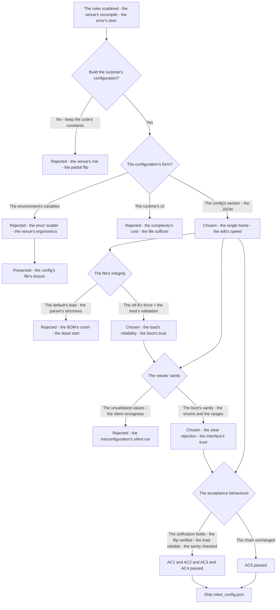
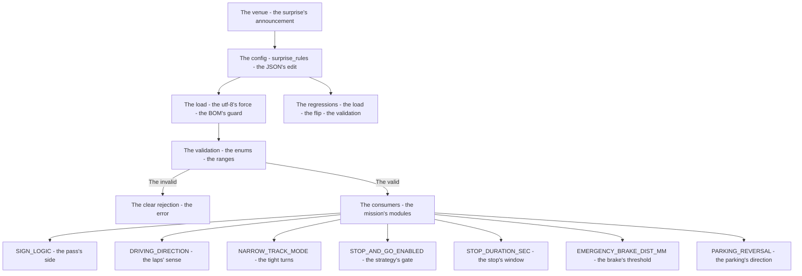
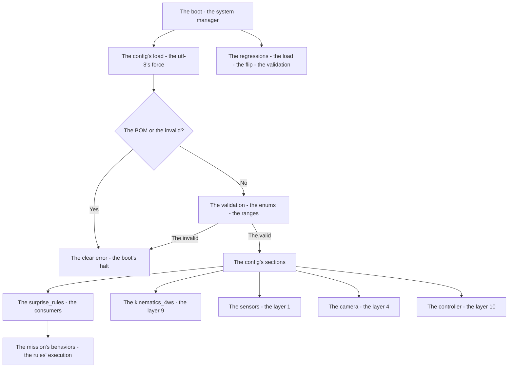

# v8.3 — Surprise rules configuration

| Version | Phase | Days |
|---------|-------|------|
| v8.3 | Advanced Features | Day 214-216 |

---

## 3. Mission of this version

v8.2's journal ended with the debt named: the rules' configuration is the day's unbuilt interface — the day-of-competition's surprise rules (the sign's logic, the driving's direction, the narrow track's mode, the stop-and-go's enabled, the stop's duration, the emergency's brake's distance, the parking's reversal) live in the code and the scattered configs (the strategy's constants in the mission's modules, the numbers hard-coded in the layers), the venue's surprise (the rule's booklet's arrival at the competition) demanding the code's change (the last-minute's edits — the risk, the error's door), the rules' configuration's unification unbuilt. The single problem v8.3 attacks is that configuration: *the surprise rules' configuration — every day-of-competition's rule moved into the config/surprise_rules (SIGN_LOGIC, DRIVING_DIRECTION, NARROW_TRACK_MODE, STOP_AND_GO_ENABLED, STOP_DURATION_SEC, EMERGENCY_BRAKE_DIST_MM, PARKING_REVERSAL), the venue's surprise a JSON's edit — the whole change*. And the version's own trap, named in its seed: the config's file loaded with the UTF-8's BOM broke the JSON's parsing — the file's byte-order-mark (the editor's save's artifact — the invisible characters at the file's start) before the JSON's opening brace — the parser's failure (the JSON's syntax's error — the config's load's crash at the boot); the fix is the encoding's force — the utf-8's encoding forced and the file validated at the boot (the BOM's rejection, the config's integrity). The mission includes the lesson's shape: config is an interface — treat it with versioning and validation.

Why is this the correct next step on the critical path? The mission is mapped (v7.0), the rules complete (v7.1), the run measured (v7.2), the start trusted (v7.3), the pass committed (v7.4), the sense measured (v7.5), the repositioning possible (v7.6), the completion proven (v7.7), the race's obedience tuned (v7.8), the world's anchor built (v7.9), the turning's geometry founded (v8.0), the tightest turning's mode built (v8.1), the steering's layer completed (v8.2) — and the day's surprise remains the code's change: the WRO's reality (the surprise rule's booklet — the round's announcement at the venue — the sign's logic's reversal, the driving's direction's change, the narrow track's mode, the stop's rule) — the venue's editing (the last-minute's code's edits — the recompile's risk, the error's door at the competition) unbuilt. The rules' configuration's shape — the unification (the surprise's single JSON — the config/surprise_rules's section — the seven rules in one place), the interface's contract (the JSON's edit the whole change — the venue's editing without the code's touch), the validation (the file's check at the boot — the encoding's force, the values' sanity) — is the day's preparedness. The robot moves fully (v8.2); it must be *configurable*. That is the version's promise.

What 'done' looks like — the acceptance criteria, written on Day 214 morning:

- **AC1:** The unification holds: every day-of-competition's rule moved into the config/surprise_rules — SIGN_LOGIC, DRIVING_DIRECTION, NARROW_TRACK_MODE, STOP_AND_GO_ENABLED, STOP_DURATION_SEC, EMERGENCY_BRAKE_DIST_MM, PARKING_REVERSAL — the seven rules in the one place.
- **AC2:** The interface's contract holds: the venue's surprise's change is the JSON's edit alone — the rule's flip verified without the code's change (the re-run with the edited config, the behavior's flip).
- **AC3:** The encoding's force holds: the config's file loaded with the utf-8's encoding — the BOM's break's counter-case preserved, the boot's load reliable.
- **AC4:** The validation holds: the file validated at the boot — the values' sanity (the enum's membership, the ranges) checked, the invalid config's rejection with the clear error.
- **AC5:** The chain and the phase's regressions hold: v6.0-v8.2's suites unchanged, with the config's section consumed by the rules' consumers — the interface added, the chain's contracts preserved.

The bias in these criteria: AC3 is the honesty criterion — the version's whole lesson (config is an interface — treat it with versioning and validation) is written as a test that reproduces the BOM's break (the editor's artifact — the parse's crash). AC2 is the venue's criterion — the interface's contract must be proven, and the edited config's run (not the claim) is the day's preparedness's proof.

---

## 4. Engineering context — where we stood

At the start of Day 214 the robot could move fully — and could not be reconfigured. The context, in the phase's own terms:

- **The rules were the code's constants, their changes the edits' risk.** The day-of-competition's surprise rules (the sign's logic — v8.4's coming; the driving's direction — the laps' sense; the narrow track's mode — v8.1's tight turns; the stop-and-go's enabled and the stop's duration — v8.0's strategy; the emergency's brake's distance — v7.1's; the parking's reversal — v7.7's) lived in the mission's modules and the layers' literals (the numbers hard-coded — the constants scattered), the venue's surprise (the rule's booklet's arrival) demanding the code's change (the last-minute's edits — the recompile's risk, the error's door at the competition).
- **The config existed, its surprise's section unbuilt.** The robot's config (v6.x's and v8.2's — the robot's name, the GPIO's pins, the kinematics' parameters, the controller's gains) — the single JSON's file — the surprise's section (the rules' home — the config/surprise_rules) unbuilt, the rules' unification absent.
- **The venue's moment was the interface's test, its preparedness unproven.** The competition's morning — the surprise's announcement (the rule's booklet's content — the day's settings) — the team's action (the config's edit — the robot's reconfiguration) — the interface's contract (the JSON's edit the whole change) unproven, the venue's moment's risk unguarded.
- **The file's integrity was the load's reliability, its encodings unguarded.** The config's file — the editors' and the systems' artifacts (the UTF-8's BOM — the byte-order-mark — the invisible prefix, the line-endings' variations) — the JSON's parsing's fragility (the parser's strictness — the artifact's break) — the load's reliability unguarded, the BOM's break unbuilt.
- **The competition clock.** Three days to the interface's completion. The unification, the contract, and the validation had to be settled because the surprise is the venue's reality — the day's settings — and the interface is the day's preparedness.

The system constraints that shaped v8.3:

- **The surprise is the venue's reality, and the configuration is its interface.** The WRO's surprise rules (the round's announcement at the venue — the sign's logic, the direction, the modes) — the configuration's interface (the JSON's edit — the whole change — the venue's editing without the code's touch) (AC2) — the day's preparedness, the interface's contract.
- **The rules' home is the single section, and the unification is its form.** The seven rules (SIGN_LOGIC, DRIVING_DIRECTION, NARROW_TRACK_MODE, STOP_AND_GO_ENABLED, STOP_DURATION_SEC, EMERGENCY_BRAKE_DIST_MM, PARKING_REVERSAL) in the config/surprise_rules (the one place — the rules' home) (AC1) — the unification's form, the configuration's clarity.
- **The file's encoding is the load's reliability, and the force is its guard.** The config's file's encodings (the UTF-8's BOM — the editor's artifact — the parse's break) — the load's reliability (the boot's config's read — the robot's start) — the utf-8's forced encoding and the file's validation at the boot (AC3-AC4) — the load's guard, the BOM's break's fix.
- **The validation is the config's interface, and the sanity is its check.** The config's values' sanity (the enums' membership — the SIGN_LOGIC's NORMAL/REVERSED, the directions' CCW/CW; the ranges — the durations' and the distances' bounds) — the validation at the boot (the invalid's rejection with the clear error) (AC4) — the interface's trust, the misconfiguration's prevention.

The pressure was the phase's promise, now at the interface's completion: the corner deliberate (v6.3), the gain right (v6.4), the state honest (v6.5), the plan real (v6.6), the path smooth (v6.7), the speed safe (v6.8), the robot looking (v6.9), the mission mapped (v7.0), the rules complete (v7.1), the run measured (v7.2), the start trusted (v7.3), the pass committed (v7.4), the sense measured (v7.5), the repositioning possible (v7.6), the completion proven (v7.7), the race's obedience tuned (v7.8), the world's anchor built (v7.9), the turning's geometry founded (v8.0), the tightest turning's mode built (v8.1), the steering's layer completed (v8.2) — and the day's surprise still the code's change: the constants scattered, the venue's editing unbuilt, the interface's contract unproven.

---

## 5. The engineering thought process — first principles

### 5.1 Constraints and hard limits, derived from first principles

**The surprise is the venue's reality, and the editing's window is the interface's constraint.** The WRO's competition — the surprise rule's booklet's arrival at the venue (the round's announcement — the morning's moment) — the team's editing's window (the minutes before the run — the reconfiguration's time) — the interface's constraint: the change must be the config's edit (the JSON's edit — the whole change — the seconds' window), not the code's change (the recompile's and the flash's minutes — the risk) (AC2).

**The rules' unification is the configuration's clarity, and the single section is its home.** The seven rules' scattered constants (the mission's modules, the layers' literals) are the change's error's door (the missed constant — the partial flip), and the unification (the rules' single section — the config/surprise_rules) is the change's clarity: the one place's edit flips the rule everywhere the consumer reads it (AC1) — the interface's form.

**The file's encoding is the load's fragility, and the force is the load's guard.** The config's file's artifact — the UTF-8's BOM (the byte-order-mark — the editor's save's invisible prefix — the EF BB BF's bytes before the JSON's brace) — the JSON's parser's strictness (the leading bytes' rejection — the parse's error — the load's crash at the boot): the load's reliability demands the encoding's force (the utf-8's explicit — the BOM's rejection or the strip — the parse's clean) and the boot's validation (the file's check before the robot's start) (AC3) — the load's guard, the boot's trust.

**The validation is the interface's trust, and the sanity is its check.** The config's values — the enums (the SIGN_LOGIC's NORMAL/REVERSED, the DRIVING_DIRECTION's CCW/CW), the numbers (the STOP_DURATION_SEC's seconds, the EMERGENCY_BRAKE_DIST_MM's millimeters — the ranges) — the misconfiguration (the typo's value, the out-of-range number) the run's silent wrongness: the validation at the boot (the membership's and the ranges' checks — the invalid's rejection with the clear error — the misconfiguration's early catch) (AC4) — the interface's trust, the silent wrongness's prevention.

**The config is an interface, and the versioning and the validation are its treatment.** The lesson's shape: the config — like any interface — must be treated with the discipline: the versioning (the file's history — the changes' traceability — the venue's edits' review) and the validation (the boot's checks — the file's integrity) — the interface's treatment, the day's reliability.

### 5.2 Requirements derived from constraints

Constraint C1 (the surprise is the venue's reality) implies:

- **R1:** The surprise's change is the JSON's edit alone — the rule's flip verified without the code's change (AC2).

Constraint C2 (the rules' unification is the clarity) implies:

- **R2:** Every day-of-competition's rule in the config/surprise_rules — the seven rules' single section (AC1).

Constraint C3 (the file's encoding is the load's fragility) implies:

- **R3:** The config loaded with the utf-8's encoding — the BOM's break's counter-case preserved (AC3).

Constraint C4 (the validation is the interface's trust) implies:

- **R4:** The file validated at the boot — the values' sanity checked, the invalid's rejection with the clear error (AC4).

Constraint C5 (the chain and the phase hold) implies:

- **R5:** The config's section consumed by the rules' consumers — v6.0-v8.2's suites unchanged, the interface added, the chain's contracts preserved (AC5).

### 5.3 Alternatives considered

**Alternative A — Keep the code's constants (do nothing).** Analysis: the status quo — the rules in the mission's modules and the layers' literals, the venue's changes the code's edits. The case for: proven, integrated, zero effort. The case against, measured on Day 214: the venue's risk (the last-minute's recompile — the error's door at the competition), the constants' scatter (the missed constant — the partial flip), the interface's absence. Effort: zero. Robustness: 3/5. Verdict: rejected as the sole answer; retained as the baseline.

**Alternative B — The environment's variables (the system's envs).** Analysis: the rules via the environment's variables (the system's settings — the shell's exports — the runtime's read). The case for: the deployment's commonality. The case against, in this system: the venue's ergonomics — the environment's variables (the shell's session — the Pi's boot's context) less editable than the JSON (the file's edit — the single change), the config's single-file's clarity (the robot's settings' home) split across the envs. Effort: low. Robustness: 3/5. Verdict: rejected — the config's file beats the envs' scatter.

**Alternative C — The config's section (chosen).** The shipped design, per section 5.1. Effort: medium. Robustness: 5/5 within the measured scenarios. Verdict: accepted.

**Alternative D — The runtime's UI (the touchscreen's editor).** Analysis: the rules via the robot's runtime's UI (the on-board editor — the venue's touchscreen's changes). The case for: the venue's friendliness. The case against, in this system: the complexity's cost — the UI's build (the touchscreen's interface, the input's handling) beyond the phase's scope, the JSON's edit (the laptop's or the phone's editor — the file's transfer) sufficient for the venue's change. Effort: high. Robustness: 4/5. Verdict: rejected — the file's edit beats the UI's complexity.

**Alternative E — The code's flags only (the argument's switches).** Analysis: the rules via the launch's arguments (the command-line's switches — the run's flags). The case for: the runtime's directness. The case against, in this system: the rules' number (the seven — the switches' sprawl — the launch's line's length), the persistence (the flags per launch — the reboot's re-entry), the config's single source (the file's home) absent. Effort: low. Robustness: 3/5. Verdict: rejected — the config's file beats the flags' sprawl.

### 5.4 Trade-off matrix

| Alternative | Effort | Robustness | Reproducibility | Risk | Reuse |
|---|---|---|---|---|---|
| A: Code's constants (status quo) | 0 | 3/5 | 5/5 | 5/5 (the venue's recompile) | 5/5 (the baseline) |
| B: Environment's variables | 2/5 | 3/5 | 4/5 | 3/5 (the envs' scatter) | 2/5 |
| C: Config's section (chosen) | 3/5 | 5/5 | 5/5 | 1/5 | 5/5 |
| D: Runtime's UI | 5/5 | 4/5 | 4/5 | 3/5 (the UI's complexity) | 1/5 |
| E: Code's flags | 1/5 | 3/5 | 4/5 | 3/5 (the flags' sprawl) | 2/5 |

### 5.5 Decision and its mathematical justification

We chose Alternative C — the config's section — and the justification, in order of weight:

**The venue's window is the interface's constraint, and the JSON's edit is the change's speed.** The surprise's announcement to the run's start — the minutes' window — the config's edit (the file's change — the seconds) against the code's change (the recompile and the flash — the minutes, the risk): the interface's contract (the JSON's edit the whole change — R1) is the day's preparedness, and the venue's window is its test (AC2).

**The unification is the change's clarity, and the single section is the error's prevention.** The seven rules' scattered constants (the missed constant — the partial flip) against the single section (the one place's edit — the rules' consumers' uniform read — R2): the unification (AC1) is the change's error's prevention, the configuration's clarity.

**The load's reliability is the boot's trust, and the encoding's force is its guard.** The BOM's artifact (the parse's crash at the boot — the robot's dead start) against the forced encoding and the boot's validation (the BOM's rejection — the clean parse — R3-R4): the load's guard (AC3) and the values' sanity (AC4) are the boot's trust, the interface's reliability.

**The chain's contract is preserved.** The config's section consumed by the rules' consumers — the chain's layers untouched, the interface the rules' home (AC5).

The measured acceptance, on the Day 214-216 tests: the unification (AC1); the interface's contract (AC2); the encoding's force (AC3); the validation (AC4); the chain's suites unchanged (AC5).

### 5.6 What we deliberately deferred

Four items were out of scope for Days 214-216. First, *the config's schema's versioning* — the file's schema's version (the config's structure's version — the migrations) recorded as the extension once the config's evolution (the new sections) shows the need. Second, *the surprise's multi-file's support* — the per-round's files (the rounds' configs — the venue's selection) recorded as the extension once the competition's format (the multiple rounds) is known. Third, *the config's remote's editing* — the wireless's interface (the Pi's file's access — the phone's editor) recorded as the extension once the venue's ergonomics (the laptop's absence) demands it. Fourth, *the validation's error's catalog* — the misconfigurations' catalog (the common errors — the clear messages' reference) recorded as the extension once the validation's failures' history grows.

---

## 6. Decision flowchart





The first flowchart is the decision trail — the code's constants rejected for the venue's risk, the environment's variables rejected for the scatter, the runtime's UI rejected for the complexity, the config's section chosen (the single home), the file's integrity settled (the utf-8's force and the boot's validation), the values' sanity settled (the boot's checks), and the acceptance verified. The second is the configuration's place in the day's flow: the venue's announcement through the config's edit to the load's and the validation's gates, the consumers' reads to the seven rules' behaviors, with the regressions standing watch over the load's reliability and the flip's correctness.

---

## 7. Implementation blueprint

The implementation is `robot_config.json`, the config's file with the surprise's section:

```json
{
  "system": {
    "robot_name": "WRO_4WS_Pro_2026",
    "serial_port": "/dev/ttyUSB0",
    "baud_rate": 115200,
    "loop_frequency_hz": 100,
    "log_level": "INFO"
  },
  "gpio": {
    "start_switch_pin":  16,
    "led1_system_pin":   5,
    "led2_sensors_pin":  6,
    "led3_camera_pin":   13,
    "led4_serial_pin":   19,
    "led5_race_pin":     26
  },
  "surprise_rules": {
    "SIGN_LOGIC": "NORMAL",
    "DRIVING_DIRECTION": "CCW",
    "NARROW_TRACK_MODE": false,
    "STOP_AND_GO_ENABLED": true,
    "STOP_DURATION_SEC": 3.0,
    "EMERGENCY_BRAKE_DIST_MM": 180,
    "PARKING_REVERSAL": false
  },
  "kinematics_4ws": {
    "wheelbase_mm": 230.0,
    "track_width_mm": 160.0,
    "max_servo_angle_deg": 40.0,
    "rear_to_front_ratio": 0.85,
    "servo_center_pwm_us": 1500,
    "servo_min_pwm_us": 1000,
    "servo_max_pwm_us": 2000
  },
  "sensors": {
    "i2c_bus": 1,
    "pins": { "front_xshut": 22, "left_xshut": 17, "right_xshut": 27 },
    "addresses": {
      "front_vl53l1x": "0x30", "left_vl53l0x": "0x31",
      "right_vl53l0x": "0x32", "mpu6050": "0x68"
    },
    "enable_magnetometer": false,
    "robot_length_mm": 300.0,
    "robot_width_mm": 160.0
  },
  "camera": {
    "device_index": 0, "frame_width": 640, "frame_height": 480, "fps": 30,
    "hsv_red1": { "low": [0, 120, 70], "high": [10, 255, 255] },
    "hsv_red2": { "low": [170, 120, 70], "high": [180, 255, 255] },
    "hsv_green": { "low": [36, 100, 80], "high": [85, 255, 255] },
    "hsv_blue": { "low": [95, 120, 80], "high": [130, 255, 255] },
    "hsv_magenta": { "low": [135, 80, 50], "high": [165, 255, 255] }
  },
  "controller": {
    "stanley_k": 0.75, "stanley_ks": 0.1,
    "target_speed_normal": 60, "target_speed_corner": 35,
    "max_speed": 100, "min_speed": 20,
    "pid_speed": { "kp": 1.2, "ki": 0.05, "kd": 0.1 }
  }
}
```

**The contract.** The config's file holds the robot's settings in the sections (the system, the GPIO, the surprise_rules, the kinematics_4ws, the sensors, the camera, the controller); the surprise_rules's section holds the seven rules (AC1): the SIGN_LOGIC ("NORMAL" — the pass's side's mapping — the green to the LEFT, the red to the RIGHT), the DRIVING_DIRECTION ("CCW" — the laps' sense), the NARROW_TRACK_MODE (false — the tight turns' mode's gate), the STOP_AND_GO_ENABLED (true — the strategy's gate), the STOP_DURATION_SEC (3.0 — the stop's window), the EMERGENCY_BRAKE_DIST_MM (180 — the brake's threshold), the PARKING_REVERSAL (false — the parking's direction's flip). The consumers (the mission's modules, the strategy's, the parking's) read their rules from the section — the venue's change is the section's edit (AC2). The load's side (the caller's structure the journal describes) forces the utf-8's encoding (the BOM's rejection — AC3) and validates the values at the boot (the enums' membership, the ranges — AC4).

**The numbers' derivations, written next to the numbers.** The surprise's defaults: the SIGN_LOGIC's "NORMAL" (the baseline's pass's side — v7.4's commitment), the DRIVING_DIRECTION's "CCW" (the laps' sense — v7.5's positive), the NARROW_TRACK_MODE's false (the mode's default off — v8.1's gate), the STOP_AND_GO_ENABLED's true (the strategy's gate — v8.0's), the STOP_DURATION_SEC's 3.0 (the stop's window — v8.0's default), the EMERGENCY_BRAKE_DIST_MM's 180 (the brake's threshold — v7.1's), the PARKING_REVERSAL's false (the parking's direction — v7.7's baseline) — each the measured or the established value, now in the rules' home. The encoding's force: the utf-8's explicit (the load's call — the encoding's parameter), the BOM's artifact (the EF BB BF's bytes — the editor's save), the rejection or the strip — the load's guard.

**The integration into the chain.** The config's file sits at the system's root: the system manager (v8.8's coming, v6.x's) loads the config at the boot (the file's read — the load's force and the validation), the consumers (the mission's modules, the strategy's, the parking's, the steering's) read their sections (the rules from the surprise_rules, the parameters from the kinematics) — the single source's truth, the change's one place. The chain's layers are untouched — the contracts preserved (AC5), the interface the rules' home.

**The regression suite.** (1) The unification's test (AC1: the seven rules in the section — the consumers' reads from the one place). (2) The interface's test (AC2: the rule's flip via the JSON's edit — the re-run's behavior's flip — the venue's change without the code's touch). (3) The encoding's test (AC3: the BOM'd file's load — the BOM's break's counter-case preserved — the clean parse). (4) The validation's test (AC4: the invalid values' rejection — the enums' and the ranges' checks — the clear errors). (5) The chain's regressions (AC5: v6.0-v8.2's suites unchanged). All green by the evening of Day 215.

**The day-by-day reality.** Day 214: the seed's reproduction (the BOM'd file's crash measured — the parse's error), the rules' survey (the seven rules' locations — the scattered constants), the section's design (the surprise_rules's home). Day 215: the unification's move (the consumers' reads — the section's authority), the encoding's force and the validation's build (AC3-AC4), the interface's verification (AC2). Day 216: the integration (AC5), the regressions, and the write-up.

---

## 8. Architecture / data-flow flowchart



The diagram is the configuration's place in the phase's architecture, complete: the boot's load through the encoding's force to the validation's gates, the sections to the consumers (the rules to the mission's behaviors, the parameters to the layers), the invalid's clear error at the boot — with the regressions standing watch over the load's reliability and the interface's contract.

---

## 9. Errors, failures, and root-cause analysis

### Error 1: the config's BOM — the seed's error, the UTF-8's artifact's parse's crash

**Symptom.** Day 214, the config's first load (the baseline's reproduction): the config's file loaded with the UTF-8's BOM *broke the JSON's parsing* — the file's byte-order-mark (the EF BB BF's bytes — the editor's save's artifact — the invisible prefix before the JSON's opening brace), the parser's rejection (the leading bytes before the `{` — the JSON's syntax's error — the load's exception), the boot's config's read's crash (the robot's start's failure — the dead boot), the robot unable to start with the venue's edited file.

**Initial hypotheses.** We suspected the editor's save. We suspected the parser's strictness. We suspected the file's transfer.

**Investigation.** The encoding's artifact was the diagnosis: the UTF-8's BOM (the byte-order-mark — the editor's save's signature — the invisible bytes at the file's start) is the artifact of the editors' and the systems' saves (the venue's laptop's editor, the transfer's tool), and the JSON's parser's strictness (the leading bytes' rejection — the syntax's error at the first character) turns the artifact into the load's crash: the load's force (the utf-8's explicit encoding — the BOM's rejection or the strip — the parse's clean) is the load's guard (AC3), and the unguarded load is the boot's dead start — the seed's error's class.

**Root cause.** The encoding's artifact unguarded: the BOM's bytes before the brace — the parser's rejection — the load's crash, the boot's dead start.

**Fix.** The encoding's force (the shipped guard): the config's load with the utf-8's encoding forced (the BOM's rejection or the strip — the parse's clean), the file validated at the boot (AC3). The re-test: the BOM'd file's load — the clean parse, the crash's counter-case preserved.

**Prevention.** The rule became the version's headline: *config is an interface — treat it with versioning and validation — the encoding's artifact is the load's crash, and the force and the validation are the boot's trust* — the encoding's test (AC3) joined the regression, with the BOM'd file preserved as the reference.

### Error 2: the rules' scatter — the consumers' mixed sources, the partial flip

**Symptom.** Day 214, the venue's simulation's first change: the rule's flip *partial* — the SIGN_LOGIC's change (the config's edit — the section's flip) leaving the mission's module's constant untouched (the consumer's read from the code's literal — the mixed source — the module's logic still the old value), the pass's side unflipped despite the config's edit, the interface's contract's illusion.

**Initial hypotheses.** We suspected the consumer's read. We suspected the section's name. We suspected the edit's propagation.

**Investigation.** The source's mix was the diagnosis: the rules' consumers (the mission's modules) read from the *scattered* sources (the code's literals in some, the config's in others — the mixed reads), and the flip's completeness demands the uniform source (every consumer reading from the section — the one place's authority): the unification (the consumers' migration to the section — the seven rules' single home) is the flip's completeness (AC1), and the mixed source (the literal's residue) is the partial flip — the interface's contract's illusion.

**Root cause.** The source's mix: the consumers' literals un-migrated — the section's flip partial — the rule's execution old.

**Fix.** The unification's completion (the shipped section): every consumer's read migrated to the section (the seven rules' single home — the literals' removal) (AC1). The re-test: the flip's completeness — the config's edit flips the execution everywhere, the partial's counter-case preserved.

**Prevention.** The rule: *the uniform source is the flip's completeness — the consumer's literal is the partial's door, and the section's authority is the interface's truth* — the unification's test (AC1) joined the regression, with the partial's run preserved as the reference.

### Error 3: the validation's absence — the typo's value's silent run, the day's wrongness

**Symptom.** Day 215, the venue's simulation's second change: the misconfigured value *ran silently* — the config's edit's typo (the STOP_DURATION_SEC's value — the stop's window's absurdity, or the SIGN_LOGIC's misspelling — the enum's typo) unvalidated at the boot (the load's acceptance — the wrong value's read), the run's behavior's wrongness (the stop's duration's nonsense, the pass's side's fallback), the day's run's silent failure.

**Initial hypotheses.** We suspected the typo's entry. We suspected the load's acceptance. We suspected the consumers' fallbacks.

**Investigation.** The sanity's gate was the diagnosis: the config's values — the enums (the SIGN_LOGIC's NORMAL/REVERSED, the DRIVING_DIRECTION's CCW/CW) and the numbers (the durations', the distances' ranges) — need the boot's validation (the membership's and the ranges' checks — the invalid's rejection with the clear error — the misconfiguration's early catch), and the unvalidated load (the acceptance — the wrong value's read) is the silent wrongness's door: the validation (AC4) is the interface's trust, and the silence is the day's failure's form.

**Root cause.** The validation's absence: the typo's value accepted — the silent wrongness — the day's run's failure.

**Fix.** The boot's validation (the shipped gate): the values' sanity at the load (the enums' membership, the ranges — the invalid's rejection with the clear error naming the key) (AC4). The re-test: the typo'd file's rejection — the clear error, the silent run's counter-case preserved.

**Prevention.** The rule: *the boot's validation is the interface's trust — the typo's value is the silent wrongness's door, and the clear rejection is the day's catch* — the validation's test (AC4) joined the regression, with the typo'd file preserved as the reference.

### Error 4: the load's path's mismatch — the config's location's error, the boot's file-not-found

**Symptom.** Day 215, the integration's first boot: the boot's load *failed to find the file* — the config's path's mismatch (the system manager's path — the launch's directory's relative path — the config's location's error — the run's cwd's difference), the file-not-found's exception (the boot's crash — the robot's dead start), the config's load's reliability broken by the path's assumption.

**Initial hypotheses.** We suspected the launch's directory. We suspected the path's format. We suspected the system manager's default.

**Investigation.** The path's absoluteness was the diagnosis: the config's path (the system manager's argument — the launch's context) must be robust to the run's directory (the absolute path — the project's root's resolution — the location's canonical form), and the relative path's assumption (the launch's cwd's dependence — the run's directory's change) is the boot's fragility: the path's resolution (the absolute — the config's canonical location) is the load's reliability (AC3), and the mismatch is the file-not-found's dead start.

**Root cause.** The path's assumption: the relative path's dependence — the run's cwd's difference — the file-not-found, the boot's crash.

**Fix.** The path's resolution (the shipped load): the config's path resolved absolutely (the project's root's canonical form — the run's directory's independence) (AC3). The re-test: the boot from any directory — the config's load, the mismatch's counter-case preserved.

**Prevention.** The rule: *the config's path is the absolute's truth — the relative's assumption is the boot's fragility, and the canonical location is the load's reliability* — the encoding's test (AC3) joined the regression.

### Error 5: the validation's over-reach — the boot's halt on the minor's drift, the day's deadlock

**Symptom.** Day 216, the venue's rehearsal: the validation *halted the boot* — the strict validation's rejection (the minor's drift — the value's slight deviation from the nominal — the range's tightness — the file's edit's float's representation) triggering the boot's halt (the invalid's rejection — the deadlock — the robot unable to start despite the rule's sanity), the day's readiness blocked by the validation's over-reach.

**Initial hypotheses.** We suspected the range's tightness. We suspected the float's representation. We suspected the validation's strictness.

**Investigation.** The validation's calibration was the diagnosis: the validation (the values' sanity) must reject the *meaningless* (the enums' typos, the ranges' absurdity) and accept the *sane* (the floats' representations' nuances — the same rule's value): the ranges' calibration (the bounds with the tolerances — the sane's acceptance, the absurd's rejection) is the validation's balance (AC4), and the over-reach (the tight bounds — the drift's halt) is the day's deadlock.

**Root cause.** The validation's over-reach: the bounds' tightness — the sane's rejection — the boot's halt, the day's deadlock.

**Fix.** The validation's calibration (the shipped balance): the bounds with the tolerances (the sane's acceptance — the floats' nuances — the absurd's rejection), the rejection's scoping to the meaningless (AC4). The re-test: the sane file's boot — the deadlock's absence, the over-reach's counter-case preserved.

**Prevention.** The rule: *the validation rejects the meaningless, not the sane — the bounds' calibration is the interface's balance, and the over-reach is the day's deadlock* — the validation's test (AC4) joined the regression, with the drift's file preserved as the reference.

---

## 10. Verification and metrics

**AC1 — the unification.** Every day-of-competition's rule in the config/surprise_rules — the seven rules' single section, the consumers' uniform reads. Passed.

**AC2 — the interface's contract.** The venue's surprise's change is the JSON's edit alone — the rule's flip verified without the code's change (the edited config's re-run, the behavior's flip). Passed.

**AC3 — the encoding's force.** The config's file loaded with the utf-8's encoding — the BOM's break's counter-case preserved, the boot's load reliable (the absolute path's resolution). Passed.

**AC4 — the validation.** The file validated at the boot — the values' sanity (the enums, the ranges with the tolerances) checked, the invalid's rejection with the clear error. Passed.

**AC5 — the chain and the phase's regressions.** v6.0-v8.2's suites unchanged, with the config's section consumed by the rules' consumers. Passed.

**The interface's provenance.** The rules' survey on Day 214: the seven rules' scattered locations (the mission's modules, the layers' literals) logged, the consumers' reads enumerated, the defaults' sources (the measured and the established values — v7.1's 180, v8.0's 3.0) documented next to the section's keys.

**Cost.** Runtime: milliseconds at the boot (the load, the validation). Development: three days, with the errors' lessons (the encoding's artifact, the source's uniformity, the sanity's gate, the path's absoluteness, the validation's balance) now permanent checklist items.

**What we trusted afterwards and what we still distrusted.** We trusted the *interface's contract* completely — the unification, the flip, each proven by its test. We trusted the validation as the boot's guard. We still distrusted three things: the *schema's versioning* (the config's evolution's migrations — pending the new sections); the *per-round's files* (the rounds' configs — pending the competition's format); and the *remote's editing* (the wireless's interface — pending the venue's ergonomics). Each is a named, written debt — the phase's rule.

---

## 11. Lessons learned — permanent mental models

**Lesson 1 — config is an interface: treat it with versioning and validation.** The seed's lesson: the BOM's artifact crashed the load — the dead boot. The permanent practice: the config's file is an interface like any other — the encoding's force, the boot's validation, the versioning's discipline.

**Lesson 2 — the uniform source is the flip's completeness.** The consumers' literals left the flip partial — the interface's illusion. The permanent model: the one place's authority (the section's home) is the change's truth, and the literal's residue is the partial's door.

**Lesson 3 — the boot's validation is the interface's trust.** The typo's value ran silently — the day's failure. The permanent rule: the sanity's gate (the enums, the ranges) at the boot is the misconfiguration's early catch.

**Lesson 4 — the config's path is the absolute's truth.** The relative's assumption broke the boot — the file-not-found. The permanent practice: the canonical location's resolution is the load's reliability.

**Lesson 5 — the validation rejects the meaningless, not the sane.** The over-reach halted the day — the deadlock. The permanent model: the bounds' calibration (the tolerances) is the interface's balance.

**Lesson 6 — the venue's surprise is a config, not a code change.** The day's settings' flip via the JSON's edit — the minutes' window. The permanent rule: the interface's contract (the edit's speed, the change's clarity) is the competition's preparedness.

---

## 12. Code in this snapshot

`robot_config.json`

---

## 13. Bridge to the next version

What v8.3 unlocks is the day's preparedness: the surprise's configuration — the seven rules' single section (the config/surprise_rules), the interface's contract (the JSON's edit the whole change), the load's reliability (the utf-8's force, the boot's validation) — the robot's reconfiguration at the venue, the day's settings' flip in the minutes' window. Three capabilities travel forward. First, the configuration itself — the section, the consumers' reads, the validation — the rules' home, the day's interface. Second, the *discipline*: the interface's treatment (the versioning, the validation), the source's uniformity (the one place's authority), the sanity's gate (the boot's checks), the path's absoluteness (the canonical location), the validation's balance (the meaningful's rejection) — the phase's quality bar, now complete across the configuration. Third, the *config's pattern*: the single JSON's sections with the validation — the pattern the mission's remaining rules' consumers (the pass's side, the parking's detection) will follow.

The known debt, stated plainly: the schema's versioning (the config's evolution's migrations); the per-round's files (the rounds' configs' selection); the remote's editing (the wireless's interface); the validation's error's catalog (the misconfigurations' reference); and the *pass's side's execution*: the SIGN_LOGIC's rule (the surprise's sign — the pass's side's mapping — the green to the LEFT, the red to the RIGHT) is configured (v8.3's section — the SIGN_LOGIC's key) but unexecuted: the mission's pass's behaviour (v7.4's pass's commitment — the pillar's avoidance's side) ignores the rule (the pass's side's logic hard-coded in the mission's module — the avoidance's direction from the color's literal — the LEFT for the green regardless of the day's logic), the surprise's sign's execution (the mapping's application through the mission's layer — the SurpriseRuleAdapter — the color to the direction's translation) unbuilt, the configured rule's silence at the run. The next problem — the one v8.4 (Day 217-219) must attack — is that execution: *the pillar pass-side tracker — the SurpriseRuleAdapter (the SIGN_LOGIC's NORMAL/REVERSED mapping the green/red to the LEFT/RIGHT avoidance — applied through the mission's layer), the pillar's events' cooldown (the 500 ms — the double counting's fix — the same pillar's two decisions)*. The robot is configurable; it must *obey the sign*. That is the work of the next three days.
