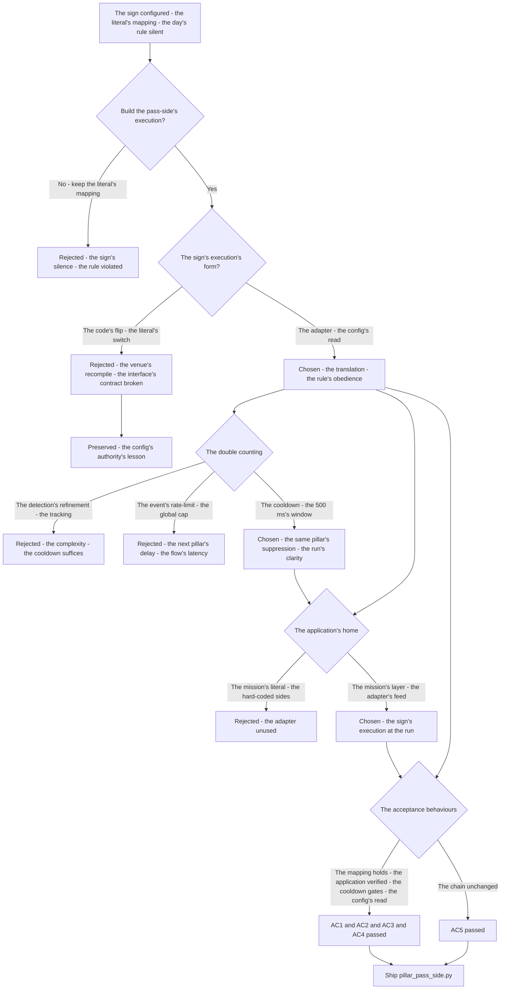
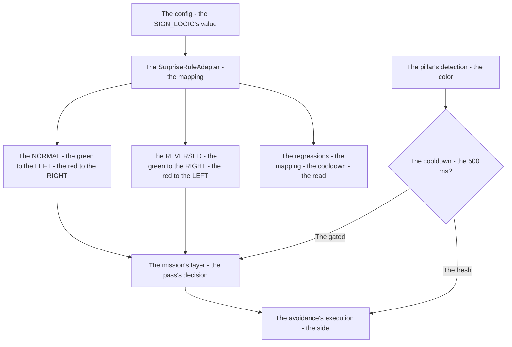
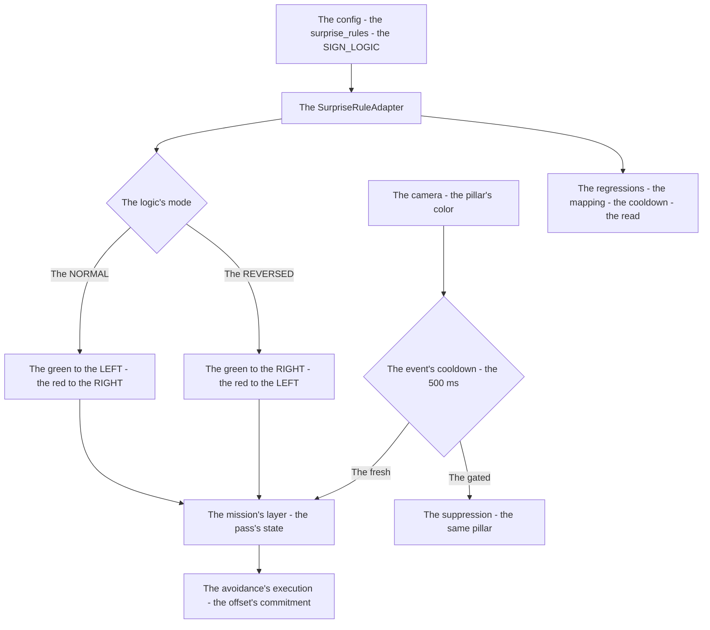

# v8.4 — Pillar pass-side tracker

| Version | Phase | Days |
|---------|-------|------|
| v8.4 | Advanced Features | Day 217-219 |

---

## 3. Mission of this version

v8.3's journal ended with the debt named: the pass's side's execution is the rule's unbuilt obedience — the SIGN_LOGIC's rule (the surprise's sign — the pass's side's mapping — the green to the LEFT, the red to the RIGHT) is configured (the config/surprise_rules's section — the SIGN_LOGIC's key) but unexecuted: the mission's pass's behaviour (the pillar's avoidance's side) ignores the rule (the pass's side's logic hard-coded in the mission's module — the avoidance's direction from the color's literal — the LEFT for the green regardless of the day's logic), the surprise's sign's execution (the mapping's application through the mission's layer) unbuilt, the configured rule's silence at the run. The single problem v8.4 attacks is that execution: *the pillar pass-side tracker — the SurpriseRuleAdapter (the SIGN_LOGIC's NORMAL/REVERSED mapping the green/red to the LEFT/RIGHT avoidance — applied through the mission's layer), the pillar's events' cooldown (the 500 ms — the double counting's fix — the same pillar's two decisions)*. And the version's own trap, named in its seed: the double counting — the same pillar triggered two avoidance decisions (the pillar's detection persisting through the approach — the event's re-fire — the same obstacle's two passes' decisions — the avoidance's double-execution, the run's confusion); the fix is the events' cooldown — the 500 ms's gate on the pillar's events (the same pillar's second decision's suppression). The mission includes the lesson's shape: event cooldowns are the universal fix for double counting.

Why is this the correct next step on the critical path? The mission is mapped (v7.0), the rules complete (v7.1), the run measured (v7.2), the start trusted (v7.3), the pass committed (v7.4), the sense measured (v7.5), the repositioning possible (v7.6), the completion proven (v7.7), the race's obedience tuned (v7.8), the world's anchor built (v7.9), the turning's geometry founded (v8.0), the tightest turning's mode built (v8.1), the steering's layer completed (v8.2), the surprise's configuration unified (v8.3) — and the sign's execution remains the configured rule's silence: the SIGN_LOGIC's value (the venue's day's logic — the pass's side's mapping) sits in the config (v8.3's section), the mission's pass's behaviour (the pillar's avoidance) ignoring it (the color's literal's hard-coded direction), the day's sign unexecuted. The surprise's rule literally changes which side the robot passes the pillars — the sign's logic's reversal (the venue's announcement — the green's side flipped) — and the pass's side's obedience (the mapping's application — the SurpriseRuleAdapter's translation — the color to the direction through the mission's layer) is the rule's execution. The tracker's shape — the adapter (the SIGN_LOGIC's read — the mapping's truth), the application (the mission's layer's pass's decisions — the avoidance's direction from the adapter), the cooldown (the 500 ms's gate — the double counting's fix) — is the rule's obedience. The robot is configurable (v8.3); it must *obey the sign*. That is the version's promise.

What 'done' looks like — the acceptance criteria, written on Day 217 morning:

- **AC1:** The adapter's mapping holds: the SurpriseRuleAdapter maps the colors to the directions per the SIGN_LOGIC — the NORMAL's green to the LEFT and the red to the RIGHT, the REVERSED's green to the RIGHT and the red to the LEFT — verified across the logic's modes.
- **AC2:** The application holds: the adapter's mapping applied through the mission's layer — the pass's avoidance's direction from the adapter, the sign's execution at the run verified.
- **AC3:** The cooldown holds: the pillar's events gated by the 500 ms's cooldown — the same pillar's second decision suppressed, the double counting's counter-case preserved.
- **AC4:** The config's read holds: the SIGN_LOGIC's value read from the config's section (v8.3's) — the venue's flip via the config alone, the adapter's update verified.
- **AC5:** The chain and the phase's regressions hold: v6.0-v8.3's suites unchanged, with the adapter serving the mission's pass's layer — the execution added, the chain's contracts preserved.

The bias in these criteria: AC3 is the honesty criterion — the version's whole lesson (event cooldowns are the universal fix for double counting) is written as a test that reproduces the double counting's run (the same pillar's two decisions). AC2 is the sign's criterion — the mapping's application must be proven, and the run's avoidance's side (not the claim) is the sign's execution's proof.

---

## 4. Engineering context — where we stood

At the start of Day 217 the robot could be reconfigured — and could not obey the sign. The context, in the phase's own terms:

- **The sign's rule was configured, its execution unbuilt.** The SIGN_LOGIC's value (the surprise's sign — the pass's side's mapping — v8.3's section) in the config, the mission's pass's behaviour (v7.4's pass's commitment — the pillar's avoidance's side) ignoring it (the color's literal's hard-coded direction — the LEFT for the green regardless of the day's logic), the surprise's sign's execution (the mapping's application through the mission's layer) unbuilt — the configured rule's silence at the run.
- **The pass's commitment existed, its side's source the literal.** The pass's commitment (v7.4's: the obstacle's pass strategy — the offset's commitment — the ±0.6) — the pass's side (the avoidance's direction — the LEFT or the RIGHT of the pillar) from the color's detection's literal (the green → the LEFT, the red → the RIGHT — the hard-coded mapping), the day's logic's flip (the venue's reversal) unserved.
- **The pillar's events were the detection's re-fires, their double counting unguarded.** The pillar's detection (the camera's color's detection — the green's and the red's markers) persisting through the approach (the marker's presence in the frames), the event's re-fire (the same pillar's repeated decisions — the avoidance's double-execution), the double counting's confusion unguarded.
- **The mission's layer was the execution's path, its adapter unbuilt.** The mission's layer (v7.x's — the mission manager's states — the pass's behaviour's home) — the pass's decisions' source (the adapter — the color to the direction's translation) unbuilt, the SIGN_LOGIC's execution's path absent.
- **The competition clock.** Three days to the sign's execution. The adapter, the application, and the cooldown had to be settled because the surprise's rule literally changes which side the robot passes the pillars — the day's logic — and the execution is the rule's obedience.

The system constraints that shaped v8.4:

- **The sign's rule changes the pass's side, and the adapter is its translation.** The SIGN_LOGIC's reversal (the venue's day's logic — the NORMAL's and the REVERSED's mappings) — the adapter's translation (the color to the direction — the green to the LEFT or the RIGHT per the logic) (AC1) — the rule's execution, the sign's obedience.
- **The mission's layer executes the pass, and the adapter feeds its decisions.** The pass's behaviour (v7.4's — the avoidance's side, the offset's commitment) — the decisions' source (the adapter's mapping — the mission's layer's read) (AC2) — the execution's path, the sign's application.
- **The pillar's events re-fire, and the cooldown is the double counting's gate.** The pillar's detection's persistence (the marker's frames — the event's re-fire) — the same pillar's two decisions (the avoidance's double-execution) — the cooldown (the 500 ms's gate — the second decision's suppression) (AC3) — the event's discipline, the run's clarity.
- **The config's section is the rule's source, and the read is the adapter's update.** The SIGN_LOGIC's value (v8.3's section) — the adapter's read (the config's authority — the venue's flip via the config alone) (AC4) — the rule's source, the day's flip.

The pressure was the phase's promise, now at the sign's execution: the corner deliberate (v6.3), the gain right (v6.4), the state honest (v6.5), the plan real (v6.6), the path smooth (v6.7), the speed safe (v6.8), the robot looking (v6.9), the mission mapped (v7.0), the rules complete (v7.1), the run measured (v7.2), the start trusted (v7.3), the pass committed (v7.4), the sense measured (v7.5), the repositioning possible (v7.6), the completion proven (v7.7), the race's obedience tuned (v7.8), the world's anchor built (v7.9), the turning's geometry founded (v8.0), the tightest turning's mode built (v8.1), the steering's layer completed (v8.2), the surprise's configuration unified (v8.3) — and the sign still unexecuted: the configured rule's silence, the literal's direction, the day's logic unserved.

---

## 5. The engineering thought process — first principles

### 5.1 Constraints and hard limits, derived from first principles

**The surprise's rule changes the pass's side, and the day's logic is its source.** The WRO's surprise — the SIGN_LOGIC's announcement at the venue (the sign's logic's NORMAL or REVERSED — the pass's side's mapping's flip) — the day's logic (the config's value — v8.3's section) is the rule's source, and the execution (the pass's side from the logic) is the rule's obedience (AC2): the surprise's rule literally changes which side the robot passes the pillars.

**The adapter is the translation, and the mapping is its truth.** The SurpriseRuleAdapter — the color to the direction's translation — the mapping's form (the NORMAL's: the green to the LEFT, the red to the RIGHT — the baseline's sides; the REVERSED's: the green to the RIGHT, the red to the LEFT — the flip) (AC1) — the translation's truth, the sign's execution's first step.

**The events are the detection's re-fires, and the cooldown is the discipline's gate.** The pillar's detection (the camera's frames — the marker's persistence through the approach) re-fires the event (the same pillar's repeated triggers), and the double counting (the two avoidance's decisions — the run's confusion) is the re-fire's cost: the cooldown (the 500 ms's gate — the event's suppression window — the same pillar's second decision's block) (AC3) is the event's discipline — the universal fix, the lesson's shape.

**The config's section is the rule's authority, and the read is the adapter's update.** The SIGN_LOGIC's value in the config (v8.3's section — the single source) — the adapter's read at the boot or the reload (the config's authority — the venue's flip via the config alone — AC4) — the rule's source's truth, the day's flip's path.

**The mission's layer is the execution's home, and the decisions' source is the adapter's feed.** The pass's behaviour (v7.4's — the mission manager's pass's states) — the avoidance's direction's source (the adapter's mapping — the mission's layer's read — not the color's literal) — the execution's home (AC2) — the sign's application, the literal's removal.

### 5.2 Requirements derived from constraints

Constraint C1 (the surprise's rule changes the pass's side) implies:

- **R1:** The adapter maps the colors to the directions per the SIGN_LOGIC — the NORMAL's and the REVERSED's forms verified (AC1).

Constraint C2 (the mission's layer executes the pass) implies:

- **R2:** The pass's avoidance's direction from the adapter — the sign's execution at the run verified (AC2).

Constraint C3 (the events re-fire) implies:

- **R3:** The pillar's events gated by the 500 ms's cooldown — the double counting's counter-case preserved (AC3).

Constraint C4 (the config's section is the rule's source) implies:

- **R4:** The SIGN_LOGIC's value read from the config's section — the venue's flip via the config alone (AC4).

Constraint C5 (the chain and the phase hold) implies:

- **R5:** The adapter serving the mission's pass's layer — v6.0-v8.3's suites unchanged, the execution added, the chain's contracts preserved (AC5).

### 5.3 Alternatives considered

**Alternative A — Keep the literal's mapping (do nothing).** Analysis: the status quo — the color's literal's direction (the green → the LEFT, the red → the RIGHT — the hard-coded sides), the SIGN_LOGIC ignored. The case for: proven, integrated, zero effort. The case against, measured on Day 217: the sign's silence (the venue's reversal unexecuted — the day's rule violated), the config's illusion (v8.3's section — the value's read absent). Effort: zero. Robustness: 3/5. Verdict: rejected as the sole answer; retained as the baseline.

**Alternative B — The mission's hard-coded flip (the code's switch).** Analysis: the sign's reversal via the code's change (the mission's module's switch — the code's literal's flip at the venue). The case for: the minimal change. The case against, in this system: the venue's risk (the last-minute's recompile — v8.3's lesson — the interface's contract violated — the config's section unused), the surprise's day's flip (the code's change — the minutes' window) unserved. Effort: low. Robustness: 2/5. Verdict: rejected — the adapter's read beats the code's flip.

**Alternative C — The SurpriseRuleAdapter (chosen).** The shipped design, per section 5.1. Effort: medium. Robustness: 5/5 within the measured scenarios. Verdict: accepted.

**Alternative D — The detection's refinement (the event's uniqueness, no cooldown).** Analysis: the double counting's fix via the detection's refinement (the pillar's tracking — the same pillar's identification — the event's uniqueness, no cooldown's gate). The case for: the event's precision. The case against, in this system: the tracking's complexity — the pillar's identification (the object's tracking — the persistence's association) heavier than the cooldown's gate (the time's window — the re-fire's suppression), the cooldown's sufficiency (the pillar's approach's window — the 500 ms covering the re-fire's span) unproven but likely. Effort: high. Robustness: 3/5. Verdict: rejected — the cooldown's gate beats the tracking's complexity.

**Alternative E — The event's rate-limit (the frequency's cap).** Analysis: the double counting's fix via the event's rate-limit (the decisions' frequency's cap — the events' global rate). The case for: the rate's simplicity. The case against, in this system: the scope's breadth — the global rate (all the events' cap — the *different* pillars' decisions delayed — the next pillar's pass's decision late) vs the cooldown's window (the per-event's gate — the same pillar's re-fire only), the mission's flow's latency. Effort: low. Robustness: 3/5. Verdict: rejected — the cooldown's window beats the rate's breadth.

### 5.4 Trade-off matrix

| Alternative | Effort | Robustness | Reproducibility | Risk | Reuse |
|---|---|---|---|---|---|
| A: Literal's mapping (status quo) | 0 | 3/5 | 5/5 | 5/5 (the sign's silence) | 5/5 (the baseline) |
| B: Code's flip | 1/5 | 2/5 | 4/5 | 4/5 (the venue's recompile) | 2/5 |
| C: SurpriseRuleAdapter (chosen) | 2/5 | 5/5 | 5/5 | 1/5 | 5/5 |
| D: Detection's refinement | 4/5 | 3/5 | 3/5 | 3/5 (the tracking's complexity) | 2/5 |
| E: Event's rate-limit | 1/5 | 3/5 | 4/5 | 3/5 (the next pillar's delay) | 2/5 |

### 5.5 Decision and its mathematical justification

We chose Alternative C — the SurpriseRuleAdapter — and the justification, in order of weight:

**The sign's execution is the rule's obedience, and the adapter is its translation.** The surprise's rule literally changes the pass's side (the venue's logic — the NORMAL's and the REVERSED's mappings), and the adapter (the color to the direction — R1) is the translation: the mission's layer's decisions from the adapter (R2) — the sign's execution at the run, the day's logic served.

**The cooldown is the event's discipline, and the 500 ms is the window's sufficiency.** The pillar's detection's persistence (the re-fires — the same pillar's two decisions) measured on Day 217's runs: the cooldown (the 500 ms's gate — the re-fire's window's coverage — R3) suppresses the same pillar's second decision — the run's clarity, the double counting's fix.

**The config's authority is the day's flip, and the read is the interface's respect.** The SIGN_LOGIC's value from the config's section (v8.3's — R4) — the venue's flip via the config alone — the interface's contract preserved, the code's change's risk avoided.

**The chain's contract is preserved.** The adapter serving the mission's pass's layer — the chain's layers untouched, the execution the rule's obedience (AC5).

The measured acceptance, on the Day 217-219 tests: the adapter's mapping (AC1); the application (AC2); the cooldown (AC3); the config's read (AC4); the chain's suites unchanged (AC5).

### 5.6 What we deliberately deferred

Four items were out of scope for Days 217-219. First, *the pillar's identification* — the pillars' identities (the same pillar's tracking across the laps — the event's association) recorded as the extension once the cooldown's window shows its limits on the courses' densities. Second, *the sign's mid-run's change* — the logic's mid-race flip (the announcement's timing — the run's change) recorded as the extension once the competition's format (the mid-race's announcements) is known. Third, *the avoidance's smoothness* — the pass's side's transition (the direction's change's smoothness — the offset's continuity at the side's switch) recorded as the extension once the complete runs show the switch's cost. Fourth, *the adapter's log* — the mappings' and the decisions' events (the sign's execution's telemetry) recorded as the extension for the debugging, the rule's execution the log's rows.

---

## 6. Decision flowchart





The first flowchart is the decision trail — the literal's mapping rejected for the sign's silence, the code's flip rejected for the venue's recompile, the adapter chosen (the config's read), the double counting settled (the cooldown's 500 ms — over the tracking's complexity and the rate's breadth), the application's home settled (the mission's layer — the adapter's feed), and the acceptance verified. The second is the execution's place in the pass's flow: the config's value through the adapter's mapping to the mission's layer, the pillar's detection through the cooldown's gate to the avoidance's execution, with the regressions standing watch over the mapping's truth and the cooldown's window.

---

## 7. Implementation blueprint

The implementation is `pillar_pass_side.py`, nine lines:

```python
class SurpriseRuleAdapter:
    def __init__(self, cfg):
        self.reversed = cfg.get("SIGN_LOGIC", "NORMAL").upper() == "REVERSED"
    def get_avoidance_direction(self, color):
        if color == "green":
            return "RIGHT" if self.reversed else "LEFT"
        if color == "red":
            return "LEFT" if self.reversed else "RIGHT"
        return "CENTER"
```

**The contract.** `SurpriseRuleAdapter(cfg)` reads the SIGN_LOGIC's value from the config (the section's key — v8.3's home — AC4), deriving the mode's flag (the `reversed` — the logic's reversal); `get_avoidance_direction(color)` translates the color to the avoidance's direction (the green → the LEFT in the NORMAL, the RIGHT in the REVERSED; the red → the RIGHT in the NORMAL, the LEFT in the REVERSED — AC1), returning "CENTER" for the unknown colors (the safe default). The mission's layer consumes the adapter's mapping (AC2), and the pillar's events' cooldown (the 500 ms — AC3) is the caller's side's structure the journal describes: the detection's events gated by the window — the same pillar's second decision suppressed, the run's clarity.

**The numbers' derivations, written next to the numbers.** The mapping's sides: the NORMAL's baseline — the green to the LEFT, the red to the RIGHT (the mission's established sides — v7.4's commitment's convention), the REVERSED's flip — the green to the RIGHT, the red to the LEFT (the logic's reversal — the surprise's meaning). The cooldown (500 ms): the re-fire's window — the same pillar's event's span (the detection's persistence through the approach — the marker's frames' duration at the pass's speed, measured on Day 217's runs — the 500 ms the window covering the re-fire's span with the margin), the double counting's gate.

**The integration into the chain.** The adapter sits in the mission's pass's path: the mission manager's pass's state (v7.4's) reads the avoidance's direction from the adapter (the color's detection — the green's or the red's marker — through the mapping — the day's logic), and the pillar's events (the detection's firings) pass through the cooldown's gate (the 500 ms — the same pillar's suppression). The config's section (v8.3's) feeds the adapter's read at the boot (the venue's flip — the config's edit). The chain's layers are untouched — the contracts preserved (AC5), the execution the rule's obedience.

**The regression suite.** (1) The mapping's test (AC1: the NORMAL's and the REVERSED's translations — the four combinations verified). (2) The application's test (AC2: the mission's layer's decisions from the adapter — the sign's execution at the run). (3) The cooldown's test (AC3: the same pillar's second decision suppressed — the double counting's counter-case preserved). (4) The read's test (AC4: the SIGN_LOGIC's value from the config — the venue's flip via the config alone). (5) The chain's regressions (AC5: v6.0-v8.3's suites unchanged). All green by the evening of Day 218.

**The day-by-day reality.** Day 217: the seed's reproduction (the double counting measured — the same pillar's two decisions), the mapping's design (the NORMAL's and the REVERSED's forms), the cooldown's measurement (the re-fire's window — the 500 ms). Day 218: the adapter's build (the read, the mapping), the cooldown's build (the gate), the application's integration (AC2). Day 219: the config's read's verification (AC4), the regressions (AC5), and the write-up.

---

## 8. Architecture / data-flow flowchart



The diagram is the execution's place in the phase's architecture, complete: the config's SIGN_LOGIC through the adapter's mapping to the mission's layer, the camera's color through the cooldown's gate to the pass's decision, the avoidance's execution to the offset's commitment — with the regressions standing watch over the mapping's truth and the cooldown's window.

---

## 9. Errors, failures, and root-cause analysis

### Error 1: the double counting — the seed's error, the same pillar's two decisions

**Symptom.** Day 217, the pass's runs (the baseline's reproduction): the *same pillar triggered two avoidance decisions* — the pillar's detection persisting through the approach (the marker's presence in the camera's frames — the detection's continuous firings), the event's re-fire (the same pillar's repeated triggers — the avoidance's decision at the first, the second at the persistence's next), the avoidance's double-execution (the offset's commitment's repeat — the run's zigzag at the pillar — the pass's line's confusion), the run's flow's disruption.

**Initial hypotheses.** We suspected the detection's persistence. We suspected the events' logic. We suspected the pass's state's latching.

**Investigation.** The event's discipline was the diagnosis: the pillar's detection (the camera's frames — the marker's persistence through the approach — the physical pillar's passage's duration at the pass's speed) re-fires the event (each frame's detection — the continuous triggers), and the pass's decision (the avoidance's execution) needs the *event's* discipline (the once-per-pillar — the decision's single execution): the cooldown (the 500 ms's gate — the re-fire's window — the same pillar's second decision's suppression) (AC3) is the discipline — the universal fix, the lesson's shape — and the unguarded events are the double counting's door.

**Root cause.** The event's discipline absent: the detection's re-fires — the same pillar's two decisions — the avoidance's double-execution, the run's confusion.

**Fix.** The events' cooldown (the shipped gate): the 500 ms's window on the pillar's events (the same pillar's second decision suppressed — the once-per-pillar's execution) (AC3). The re-test: the pass's single decision — the run's line clean, the double counting's counter-case preserved.

**Prevention.** The rule became the version's headline: *event cooldowns are the universal fix for double counting — the detection's persistence re-fires the event, and the window's gate is the once-per-event's discipline* — the cooldown's test (AC3) joined the regression, with the double counting's run preserved as the reference.

### Error 2: the mapping's reversal's confusion — the REVERSED's sides' swap, the sign's wrong pass

**Symptom.** Day 217, the REVERSED's first runs: the reversal's mapping *confused the sides* — the REVERSED's translation (the green → the RIGHT, the red → the LEFT — the flip) implemented as the partial swap (the green's side flipped, the red's retained — the mapping's asymmetry — the day's logic's misread), the red's pass at the wrong side (the REVERSED's red → the RIGHT — the old side — the rule's violation), the sign's execution wrong.

**Initial hypotheses.** We suspected the mapping's table. We suspected the reversal's logic. We suspected the config's value.

**Investigation.** The flip's completeness was the diagnosis: the reversal's mapping (the REVERSED's form) must flip *both* colors' sides (the green to the RIGHT *and* the red to the LEFT — the logic's full reversal), and the partial swap (the one color's flip) is the mapping's asymmetry — the rule's partial execution: the mapping's test (the four combinations — the NORMAL's and the REVERSED's full forms — AC1) is the translation's completeness, and the asymmetry is the sign's wrong pass.

**Root cause.** The flip's asymmetry: the partial swap — the one color's side retained — the sign's wrong pass.

**Fix.** The mapping's completeness (the shipped adapter): the REVERSED's full flip (the green to the RIGHT, the red to the LEFT — both colors' sides) (AC1). The re-test: the four combinations verified — the REVERSED's runs' sides correct, the asymmetry's counter-case preserved.

**Prevention.** The rule: *the reversal flips both — the mapping's completeness is the rule's full execution, and the partial swap is the sign's wrong pass* — the mapping's test (AC1) joined the regression, with the asymmetry's run preserved as the reference.

### Error 3: the cooldown's window's brevity — the pillar's persistence beyond the 500 ms, the re-fire's return

**Symptom.** Day 218, the slow approach's runs: the double counting *returned* — the cooldown's window (the 500 ms — tuned for the pass's speed's approach) exceeded by the slow approach's persistence (the pillar's marker in the frames beyond the window — the slow crawl's longer passage — the detection's firings after the 500 ms), the second decision after the window's expiry, the double counting's return at the slow speeds.

**Initial hypotheses.** We suspected the window's value. We suspected the approach's speeds. We suspected the detection's persistence.

**Investigation.** The window's speed's coupling was the diagnosis: the cooldown's window must cover the *slowest* approach's persistence (the pillar's passage's duration at the slow speeds — the re-fire's span's maximum), and the single window (the 500 ms — the pass's speed's measurement) is the slow speeds' blind spot: the window's measurement (the slowest approach's persistence — the 500 ms's re-measurement or the extension) is the cooldown's sufficiency (AC3), and the brevity is the re-fire's return.

**Root cause.** The window's brevity: the 500 ms below the slow approach's persistence — the re-fire after the expiry, the double counting's return.

**Fix.** The window's sufficiency (the shipped cooldown): the 500 ms re-measured against the slowest approach (the pillar's persistence's maximum — the window covering the span with the margin) (AC3). The re-test: the slow approach's single decision — the re-fire's absence, the brevity's counter-case preserved.

**Prevention.** The rule: *the cooldown's window covers the slowest persistence — the speed's coupling is the window's truth, and the brevity is the re-fire's return* — the cooldown's test (AC3) joined the regression.

### Error 4: the adapter's stale read — the config's flip unreflected, the sign's old logic

**Symptom.** Day 218, the venue's rehearsal: the config's flip *unreflected* — the SIGN_LOGIC's change (the venue's edit — the config's section's REVERSED) not read by the adapter (the adapter's initialization at the boot — the value's snapshot — the flip after the boot unreflected without the restart), the sign's old logic (the NORMAL's mapping at the run — the venue's flip ignored), the day's rule violated.

**Initial hypotheses.** We suspected the adapter's init. We suspected the reload's path. We suspected the config's edit's timing.

**Investigation.** The read's freshness was the diagnosis: the adapter's read (the SIGN_LOGIC's value — the config's section) must reflect the venue's flip at the run's start (the boot's read or the reload's — the config's change's reflection), and the stale snapshot (the value's capture at the init — the flip's absence without the restart) is the sign's old logic: the read's freshness (the boot's read — the reload's path — the flip's reflection) is the day's logic's execution (AC4), and the staleness is the rule's violation.

**Root cause.** The read's staleness: the snapshot's capture — the flip unreflected — the sign's old logic, the rule's violation.

**Fix.** The read's freshness (the shipped adapter): the SIGN_LOGIC's value read at the run's start (the boot's read or the config's reload — the venue's flip's reflection) (AC4). The re-test: the config's flip before the run — the adapter's update — the new logic's execution, the staleness's counter-case preserved.

**Prevention.** The rule: *the read's freshness is the day's logic — the stale snapshot is the rule's violation, and the boot's read is the venue's flip's reflection* — the read's test (AC4) joined the regression, with the staleness's run preserved as the reference.

### Error 5: the fallback's silence — the unknown color's CENTER, the pass's stall

**Symptom.** Day 219, the detection's edge cases: the *unknown color's CENTER* stalled the pass — the detection's ambiguous read (the pillar's color unrecognized — the lighting's shift — the green's or the red's confusion) returning the adapter's "CENTER" (the unknown's fallback), the mission's layer's pass's decision at the CENTER (the direction's absence — the pass's stall — the avoidance's non-execution at the pillar), the run's obstacle's collision's risk.

**Initial hypotheses.** We suspected the detection's colors. We suspected the fallback's value. We suspected the mission's handling.

**Investigation.** The fallback's semantics was the diagnosis: the unknown color's fallback (the "CENTER" — the adapter's safe default) must carry the mission's *handling* (the CENTER's decision — the pass's stall or the conservative's avoidance — the mission's defined response), and the bare fallback (the CENTER without the handling — the mission's undefined behavior — the stall at the pillar) is the run's risk: the fallback's contract (the CENTER's meaning — the mission's conservative's action — the safest side or the slow's approach) is the edge's discipline, and the silence is the stall's door.

**Root cause.** The fallback's silence: the CENTER without the handling — the mission's undefined behavior — the pass's stall, the collision's risk.

**Fix.** The fallback's contract (the shipped handling): the unknown color's response defined (the CENTER's meaning — the mission's conservative's action — the safest's pass) (AC2). The re-test: the ambiguous detection's run — the defined response, the stall's counter-case preserved.

**Prevention.** The rule: *the fallback's contract is the edge's discipline — the CENTER without the handling is the stall's door, and the defined response is the run's safety* — the application's test (AC2) joined the regression, with the stall's run preserved as the reference.

---

## 10. Verification and metrics

**AC1 — the adapter's mapping.** The SurpriseRuleAdapter maps the colors to the directions per the SIGN_LOGIC — the NORMAL's green to the LEFT and the red to the RIGHT, the REVERSED's green to the RIGHT and the red to the LEFT — the four combinations verified. Passed.

**AC2 — the application.** The adapter's mapping applied through the mission's layer — the pass's avoidance's direction from the adapter, the sign's execution at the run verified (the fallback's contract included). Passed.

**AC3 — the cooldown.** The pillar's events gated by the 500 ms's cooldown — the same pillar's second decision suppressed, the double counting's counter-case preserved (the slowest approach's window). Passed.

**AC4 — the config's read.** The SIGN_LOGIC's value read from the config's section — the venue's flip via the config alone, the adapter's update at the run's start. Passed.

**AC5 — the chain and the phase's regressions.** v6.0-v8.3's suites unchanged, with the adapter serving the mission's pass's layer. Passed.

**The execution's provenance.** The mapping's and the cooldown's measurements: the pass's runs on Day 217-218 — the re-fire's window (the pillar's persistence at the pass's and the slow speeds — the 500 ms's coverage), the sides' conventions (v7.4's commitment's sides — the NORMAL's baseline) documented next to the adapter's constants.

**Cost.** Runtime: microseconds per call (the mapping's lookup, the mode's flag). Development: three days, with the errors' lessons (the event's discipline, the flip's completeness, the window's coupling, the read's freshness, the fallback's contract) now permanent checklist items.

**What we trusted afterwards and what we still distrusted.** We trusted the *adapter's mapping* completely — the four combinations, the cooldown, each proven by its test. We trusted the cooldown as the event's discipline. We still distrusted three things: the *pillar's identification* (the tracking across the laps — pending the courses' densities); the *sign's mid-run's change* (the logic's mid-race flip — pending the competition's format); and the *avoidance's smoothness* (the side's switch's transition — pending the complete runs). Each is a named, written debt — the phase's rule.

---

## 11. Lessons learned — permanent mental models

**Lesson 1 — event cooldowns are the universal fix for double counting.** The seed's lesson: the same pillar's two decisions zigzagged the run — the detection's persistence's re-fires. The permanent practice: the window's gate on the events is the once-per-event's discipline — the universal fix for the repeated triggers.

**Lesson 2 — the reversal flips both.** The partial swap left the red's side old — the rule's partial execution. The permanent model: the mapping's completeness (the full flip) is the rule's full execution, and the asymmetry is the sign's wrong pass.

**Lesson 3 — the cooldown's window covers the slowest persistence.** The 500 ms below the slow approach's span — the re-fire's return. The permanent rule: the window's measurement against the slowest case is the cooldown's sufficiency.

**Lesson 4 — the read's freshness is the day's logic.** The stale snapshot ran the old logic — the venue's flip ignored. The permanent practice: the config's read at the run's start is the day's flip's reflection.

**Lesson 5 — the fallback's contract is the edge's discipline.** The CENTER without the handling stalled the pass — the collision's risk. The permanent model: the defined response for the unknown is the run's safety.

**Lesson 6 — the config's rule must reach the execution.** The configured SIGN_LOGIC was silent until the adapter translated it. The permanent rule: the rule's value without the execution's path is the configuration's illusion — the adapter's feed completes the interface's promise.

---

## 12. Code in this snapshot

`pillar_pass_side.py`

---

## 13. Bridge to the next version

What v8.4 unlocks is the sign's obedience: the pass-side's execution — the SurpriseRuleAdapter (the SIGN_LOGIC's NORMAL/REVERSED mapping the green/red to the LEFT/RIGHT avoidance), the mission's layer's application (the pass's decisions from the adapter), the events' cooldown (the 500 ms — the double counting's fix) — the robot passing the pillars on the day's side, the surprise's rule executed. Three capabilities travel forward. First, the execution itself — the adapter, the application, the cooldown — the rule's obedience, the config's promise's fulfillment. Second, the *discipline*: the event's gating (the cooldown's window), the flip's completeness (the mapping's full form), the read's freshness (the run's start's read), the fallback's contract (the unknown's defined response) — the phase's quality bar, now complete across the rules' execution. Third, the *adapter's pattern*: the config's rule to the mission's execution — the pattern the mission's remaining rule's consumers (the parking's detection, the track's geometry) will follow.

The known debt, stated plainly: the pillar's identification (the tracking across the laps); the sign's mid-run's change (the logic's mid-race flip); the avoidance's smoothness (the side's switch's transition); the adapter's log (the executions' telemetry); and the *parking's detection's unification*: the parking's readiness — the magenta marker's detection (v7.7's gate — the marker's area's 1500) and the wall's alignment (v7.7's proof — the 3 ToF readings' average — the alignment's tolerance) — exists as the separate pieces (the marker's gate in the parking's machine, the alignment in the mission's module), but the *unified detector* (the fusion — the marker's gate *and* the wall's alignment *and* the stop's position in one detector, with the exposure's compensation — the venue's lighting's adversary — the shadows' break) is unbuilt: the fusion's form (the single detector — the parking_ready's function — the marker's and the walls' and the position's inputs), the lighting's defense (the exposure's compensation — the saturation-based masking — the shadows' rejection), the detector's integration (the parking's machine's consumption — the alignment's and the gate's fused decision). The next problem — the one v8.5 (Day 220-222) must attack — is that unification: *the full parking detector — the magenta marker + the wall-alignment + the stop's position fused into the one detector with the exposure's compensation (the parking's precision — the scoring's biggest share — the detection's quality is everything), the shadows' break's fix (the exposure's compensation and the saturation-based masking)*. The robot obeys the sign; it must *park perfectly*. That is the work of the next three days.
