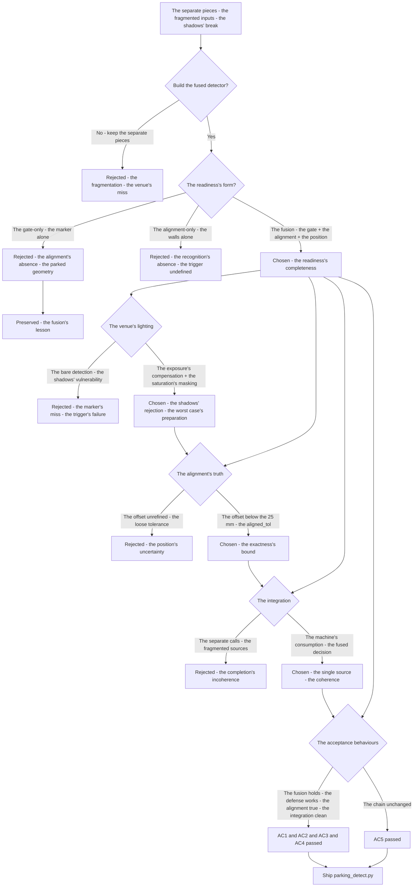
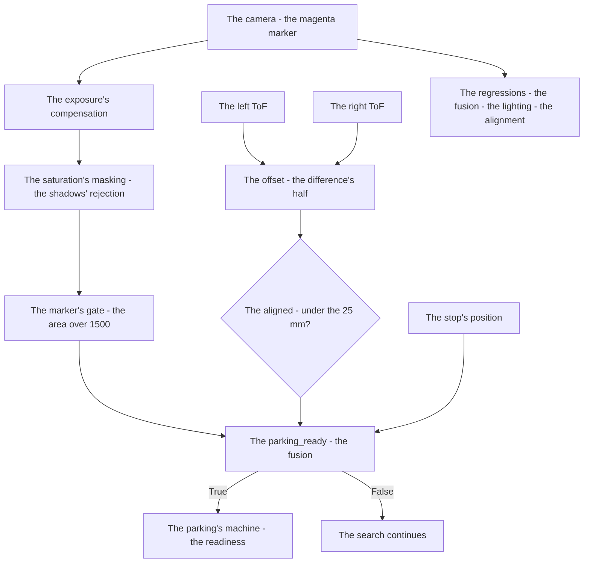
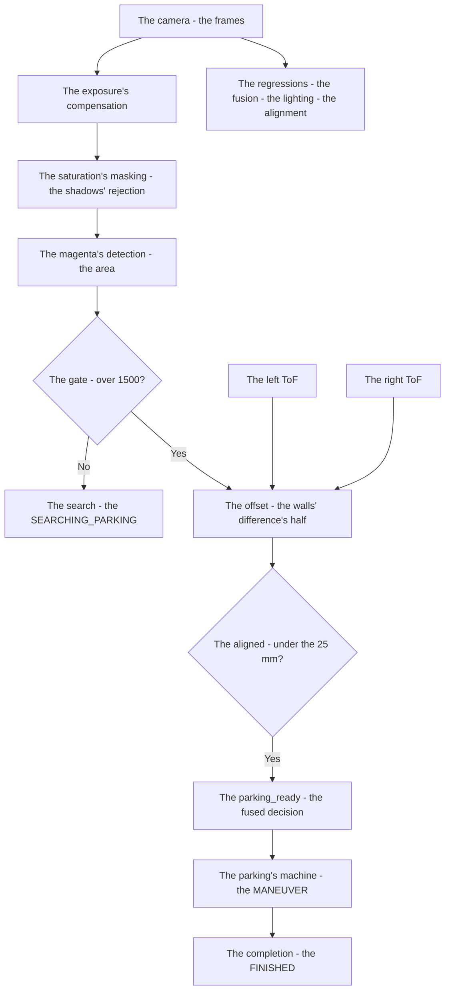

# v8.5 — Full parking detector

| Version | Phase | Days |
|---------|-------|------|
| v8.5 | Advanced Features | Day 220-222 |

---

## 3. Mission of this version

v8.4's journal ended with the debt named: the parking's detection's unification is the completion's unbuilt precision — the parking's readiness (the magenta marker's detection — v7.7's gate — the marker's area's 1500 — and the wall's alignment — v7.7's proof — the 3 ToF readings' average — the alignment's tolerance) exists as the separate pieces (the marker's gate in the parking's machine, the alignment in the mission's module), but the unified detector (the fusion — the marker's gate *and* the wall's alignment *and* the stop's position in the one detector, with the exposure's compensation — the venue's lighting's adversary — the shadows' break) is unbuilt. The single problem v8.5 attacks is that unification: *the full parking detector — the magenta marker + the wall-alignment + the stop's position fused into the one detector with the exposure's compensation — the parking's precision — the scoring's biggest share — the detection's quality is everything*. And the version's own trap, named in its seed: the shadows broke the marker's detection at the venue — the venue's lighting (the shadows across the marker — the sun's or the arena's lights' cast) obscuring the magenta's detection (the marker's area's drop below the gate — the detection's miss — the parking's trigger's failure); the fix is the exposure's compensation and the saturation-based masking (the lighting's defense — the shadows' rejection — the marker's robust detection). The mission includes the lesson's shape: venue lighting is an adversary — build for its worst case.

Why is this the correct next step on the critical path? The mission is mapped (v7.0), the rules complete (v7.1), the run measured (v7.2), the start trusted (v7.3), the pass committed (v7.4), the sense measured (v7.5), the repositioning possible (v7.6), the completion proven (v7.7), the race's obedience tuned (v7.8), the world's anchor built (v7.9), the turning's geometry founded (v8.0), the tightest turning's mode built (v8.1), the steering's layer completed (v8.2), the surprise's configuration unified (v8.3), the sign's obedience executed (v8.4) — and the parking's detection remains the separate pieces: the marker's gate (v7.7's — the area's 1500) in the parking's machine, the alignment's proof (v7.7's — the 3 ToF readings' average) in the mission's module, the stop's position (the zone's placement) unread, the fusion unbuilt. The parking's precision is the scoring's biggest share (the WRO's points — the zone's placement, the alignment's exactness — the completion's score), and the detection's quality is everything (the trigger's reliability, the alignment's truth — the parking's correctness): the detector's shape — the fusion (the marker's gate *and* the wall's alignment *and* the stop's position — the one decision), the lighting's defense (the exposure's compensation — the shadows' rejection — the venue's adversary) — is the precision's foundation. The robot obeys the sign (v8.4); it must *park perfectly*. That is the version's promise.

What 'done' looks like — the acceptance criteria, written on Day 220 morning:

- **AC1:** The fusion holds: the parking's detector fuses the marker's gate (the area's 1500), the wall's alignment (the ToF's offset — the aligned_tol's 25 mm), and the stop's position — the one decision, the separate pieces' unification verified.
- **AC2:** The lighting's defense holds: the exposure's compensation and the saturation-based masking reject the shadows — the marker's detection robust across the venue's lighting's conditions, the shadows' break's counter-case preserved.
- **AC3:** The alignment's truth holds: the wall's offset (the left-right's difference's half) below the aligned_tol — the alignment's proof's exactness verified.
- **AC4:** The detector's integration holds: the parking's machine (v7.7's) consumes the detector's fused decision — the trigger's and the proof's single source, the mission's parking verified.
- **AC5:** The chain and the phase's regressions hold: v6.0-v8.4's suites unchanged, with the detector serving the parking's completion — the precision added, the chain's contracts preserved.

The bias in these criteria: AC2 is the honesty criterion — the version's whole lesson (venue lighting is an adversary — build for its worst case) is written as a test that reproduces the shadows' break (the shadowed marker's detection's failure). AC1 is the precision's criterion — the fusion must be proven, and the one decision (not the separate pieces) is the detector's truth.

---

## 4. Engineering context — where we stood

At the start of Day 220 the robot could obey the sign — and could not park perfectly. The context, in the phase's own terms:

- **The parking's detection was the separate pieces, its fusion unbuilt.** The parking's readiness (v7.7's: the marker's gate — the area's 1500 — and the alignment's proof — the 3 ToF readings' average) — the separate pieces (the marker's gate in the parking's machine, the alignment in the mission's module), the stop's position (the zone's placement) unread, the fusion (the one detector — the marker's and the walls' and the position's inputs) unbuilt.
- **The venue's lighting was the adversary, its shadows' break unguarded.** The venue's lighting (the arena's lights, the windows' sun — the shadows' cast across the markers) — the shadows' break (the marker's detection's failure — the area's drop — the parking's trigger's miss) — the exposure's compensation and the saturation-based masking (the lighting's defense) unbuilt.
- **The alignment's proof existed, its exactness' tolerance unrefined.** The wall's alignment (v7.7's — the 3 ToF readings' average — the wall's parallel) — the offset's measure (the left-right's difference's half — the position's truth) — the tolerance (the aligned_tol — the 25 mm) unrefined in the detector's form.
- **The parking's machine was the completion's consumer, its detector's source absent.** The parking's machine (v7.7's — the SEARCHING → the MANEUVER → the FINISHED) — the trigger's and the proof's sources (the fused detector — the one decision) absent, the separate calls (the marker's gate here, the alignment there) the completion's fragmented inputs.
- **The competition clock.** Three days to the precision's foundation. The fusion, the lighting's defense, and the alignment's truth had to be settled because the parking's precision is the scoring's biggest share — the completion's score — and the detection's quality is everything.

The system constraints that shaped v8.5:

- **The parking's precision is the scoring's biggest share, and the detector is its quality.** The WRO's scoring (the parking's points — the zone's placement, the alignment's exactness — the completion's biggest share) — the detector's quality (the trigger's reliability, the alignment's truth — the parking's correctness) (AC1) — the precision's foundation, the detection's everything.
- **The fusion is the one decision, and the separate pieces are its inputs.** The marker's gate (the area's 1500), the wall's alignment (the offset's tolerance), the stop's position (the zone's placement) — the fused detector (the one decision — the readiness's truth) (AC1) — the fusion's form, the pieces' unification.
- **The venue's lighting is the adversary, and the defense is the robust detection.** The shadows (the lighting's cast — the marker's obscuring) — the exposure's compensation (the brightness's normalization — the lighting's variance's absorption) and the saturation-based masking (the magenta's saturation's signature — the shadows' rejection — the hue's and the saturation's robustness) (AC2) — the defense's build, the worst case's preparation.
- **The alignment's offset is the position's truth, and the tolerance is its exactness.** The wall's offset (the left-right's difference's half — the position's centeredness) — the aligned_tol (the 25 mm — the exactness's bound) (AC3) — the alignment's truth, the parking's geometry.

The pressure was the phase's promise, now at the precision's foundation: the corner deliberate (v6.3), the gain right (v6.4), the state honest (v6.5), the plan real (v6.6), the path smooth (v6.7), the speed safe (v6.8), the robot looking (v6.9), the mission mapped (v7.0), the rules complete (v7.1), the run measured (v7.2), the start trusted (v7.3), the pass committed (v7.4), the sense measured (v7.5), the repositioning possible (v7.6), the completion proven (v7.7), the race's obedience tuned (v7.8), the world's anchor built (v7.9), the turning's geometry founded (v8.0), the tightest turning's mode built (v8.1), the steering's layer completed (v8.2), the surprise's configuration unified (v8.3), the sign's obedience executed (v8.4) — and the parking's detection still the separate pieces: the fusion unbuilt, the shadows' break unguarded, the precision unserved.

---

## 5. The engineering thought process — first principles

### 5.1 Constraints and hard limits, derived from first principles

**The parking's precision is the scoring's biggest share, and the detection's quality is its gate.** The WRO's scoring — the parking's points (the zone's placement, the alignment's exactness — the completion's biggest share, the phase's biggest win) — the detection's quality (the trigger's reliability — the marker's recognition's truth; the alignment's exactness — the position's measure) is the score's gate: the detection's quality is everything — the precision's foundation.

**The fusion is the one decision, and the pieces' signals are its inputs.** The parking's readiness — the marker's gate (the magenta's area beyond the 1500 — the zone's recognition), the wall's alignment (the offset — the left-right's difference's half — the position's centeredness), the stop's position (the zone's placement — the completion's geometry) — the fused detector (the readiness's truth — the pieces' conjunction) (AC1): the fusion's form — the one decision from the pieces — is the detection's correctness, the separate calls' fragmentation's fix.

**The venue's lighting is the adversary, and the defense is the robust detection.** The venue's lighting (the arena's lights, the sun's windows — the brightness's variance, the shadows' cast) is the adversary — the worst case (the shadowed marker — the detection's miss) must be built for (the lesson's shape): the exposure's compensation (the brightness's normalization — the variance's absorption) and the saturation-based masking (the magenta's saturation's signature — the shadows' grey's rejection — the hue's robustness to the darkness) (AC2) — the defense's build, the worst case's preparation.

**The alignment's offset is the position's truth, and the tolerance is its exactness.** The wall's alignment — the offset (the left-right's difference's half — the robot's centeredness between the walls) — the alignment's truth (the offset's magnitude — the position's exactness), the tolerance (the aligned_tol's 25 mm — the exactness's bound — the aligned's definition) (AC3) — the alignment's measure, the parking's geometry.

**The detector's integration is the completion's single source, and the machine's consumption is its use.** The parking's machine (v7.7's — the SEARCHING → the MANEUVER → the FINISHED) — the fused detector's decision (the trigger's and the proof's single source — the machine's consumption) (AC4) — the integration's form, the completion's coherence.

### 5.2 Requirements derived from constraints

Constraint C1 (the precision is the scoring's biggest share) implies:

- **R1:** The detector fuses the pieces — the marker's gate, the wall's alignment, the stop's position — the one decision (AC1).

Constraint C2 (the venue's lighting is the adversary) implies:

- **R2:** The exposure's compensation and the saturation-based masking reject the shadows — the detection robust across the conditions, the break's counter-case preserved (AC2).

Constraint C3 (the alignment's offset is the truth) implies:

- **R3:** The wall's offset below the aligned_tol's 25 mm — the alignment's exactness verified (AC3).

Constraint C4 (the detector's integration is the single source) implies:

- **R4:** The parking's machine consumes the detector's fused decision — the trigger's and the proof's single source (AC4).

Constraint C5 (the chain and the phase hold) implies:

- **R5:** The detector serving the parking's completion — v6.0-v8.4's suites unchanged, the precision added, the chain's contracts preserved (AC5).

### 5.3 Alternatives considered

**Alternative A — Keep the separate pieces (do nothing).** Analysis: the status quo — the marker's gate in the parking's machine, the alignment in the mission's module, no fusion, no lighting's defense. The case for: proven, integrated, zero effort. The case against, measured on Day 220: the fragmentation (the separate calls — the readiness's scattered inputs), the shadows' break (the venue's lighting unguarded — the trigger's miss), the precision unserved. Effort: zero. Robustness: 3/5. Verdict: rejected as the sole answer; retained as the baseline.

**Alternative B — The gate-only's reliance (the marker's detection alone).** Analysis: the parking's readiness via the marker's gate alone (the area's 1500 — the detection's single signal). The case for: the detection's simplicity. The case against, in this system: the completeness's absence — the marker's gate alone (the recognition) without the alignment's proof (the position's truth) — the parked geometry (the alignment — v7.7's lesson — parking is alignment, not arrival) unserved, the precision's pieces unfused. Effort: low. Robustness: 2/5. Verdict: rejected — the fusion beats the gate's alone.

**Alternative C — The fused detector (chosen).** The shipped design, per section 5.1. Effort: medium. Robustness: 5/5 within the measured scenarios. Verdict: accepted.

**Alternative D — The vision's full pose (the marker's geometry).** Analysis: the parking's readiness via the camera's full pose's estimation (the marker's corners — the pose's computation — the position's and the orientation's exactness). The case for: the vision's precision. The case against, in this system: the vision's dependence — the pose's estimation (the corners' detection, the solvePnP's — the calibration's need) heavier and less robust than the fusion (the ToF's offset — the existing sensors — the alignment's proof), the venue's lighting's variance (the pose's features' degradation) riskier. Effort: high. Robustness: 3/5. Verdict: rejected — the fusion's robustness beats the pose's precision's dependence.

**Alternative E — The alignment-only's reliance (the walls' offset alone).** Analysis: the parking's readiness via the walls' alignment alone (the offset's tolerance — the position's truth). The case for: the ToF's simplicity. The case against, in this system: the recognition's absence — the alignment alone (the centeredness) without the marker's gate (the zone's recognition) — the parking's trigger (the zone's signature) unserved, the machine's SEARCHING's end undefined. Effort: low. Robustness: 2/5. Verdict: rejected — the fusion beats the alignment's alone.

### 5.4 Trade-off matrix

| Alternative | Effort | Robustness | Reproducibility | Risk | Reuse |
|---|---|---|---|---|---|
| A: Separate pieces (status quo) | 0 | 3/5 | 5/5 | 4/5 (the shadows' break) | 5/5 (the baseline) |
| B: Gate-only's reliance | 1/5 | 2/5 | 4/5 | 4/5 (the alignment's absence) | 3/5 |
| C: Fused detector (chosen) | 3/5 | 5/5 | 5/5 | 1/5 | 5/5 |
| D: Vision's full pose | 5/5 | 3/5 | 3/5 | 4/5 (the vision's dependence) | 1/5 |
| E: Alignment-only's reliance | 1/5 | 2/5 | 4/5 | 4/5 (the recognition's absence) | 3/5 |

### 5.5 Decision and its mathematical justification

We chose Alternative C — the fused detector — and the justification, in order of weight:

**The fusion is the readiness's truth, and the pieces are its conjunction.** The parking's readiness — the marker's gate (the zone's recognition), the wall's alignment (the position's truth), the stop's position (the completion's geometry) — the fused decision (the pieces' conjunction — the readiness's completeness — R1) is the detection's correctness: the separate calls (the fragmented inputs) against the one decision (the coherence) (AC1).

**The lighting's defense is the worst case's preparation, and the venue is the adversary.** The shadows' break (the marker's miss — the trigger's failure) measured at the venue's lighting's rehearsal (Day 220's): the exposure's compensation and the saturation-based masking (the brightness's normalization, the shadow's rejection — R2) are the defense's build — the venue's lighting's worst case built for (AC2).

**The alignment's truth is the position's exactness, and the tolerance is its bound.** The offset (the left-right's difference's half — the centeredness) below the aligned_tol's 25 mm (the exactness's bound — R3) — the alignment's proof's precision (AC3), the parking's geometry.

**The integration is the completion's coherence, and the single source is its form.** The parking's machine's consumption (the fused decision — the trigger's and the proof's single source — R4) — the completion's coherence (AC4), the chain's contract preserved (AC5).

The measured acceptance, on the Day 220-222 tests: the fusion (AC1); the lighting's defense (AC2); the alignment's truth (AC3); the integration (AC4); the chain's suites unchanged (AC5).

### 5.6 What we deliberately deferred

Four items were out of scope for Days 220-222. First, *the marker's pose's refinement* — the marker's orientation's reading (the camera's pose — the angle's exactness) recorded as the extension once the alignment's tolerance shows the need. Second, *the multi-marker's zones* — the zones' variants (the markers' shapes — the courses' differences) recorded as the extension once the courses' variety shows the need. Third, *the exposure's auto-tuning* — the compensation's adaptive gain (the lighting's live's adaptation) recorded as the extension once the venues' variance shows the static's limits. Fourth, *the detector's log* — the detections' events (the marker's areas, the offsets — the readiness's telemetry) recorded as the extension for the debugging, the parking's events the log's final rows.

---

## 6. Decision flowchart





The first flowchart is the decision trail — the separate pieces rejected for the fragmentation, the gate-only and the alignment-only rejected for the incompleteness, the fusion chosen (the readiness's completeness), the venue's lighting settled (the exposure's compensation and the saturation's masking), the alignment's truth settled (the 25 mm's tolerance), the integration settled (the machine's consumption), and the acceptance verified. The second is the detector's place in the parking's flow: the camera through the exposure's compensation and the saturation's masking to the gate, the ToFs' offset to the alignment's check, the fusion of the gate and the alignment and the position to the readiness, the machine's consumption to the parking's completion — with the regressions standing watch over the lighting's defense and the fusion's truth.

---

## 7. Implementation blueprint

The implementation is `parking_detect.py`, four lines:

```python
def parking_ready(marker, left_wall, right_wall, aligned_tol=25.0):
    if marker is None or marker["area"] < 1500: return False
    offset = (left_wall - right_wall) / 2.0
    return abs(offset) < aligned_tol, offset
```

**The contract.** `parking_ready(marker, left_wall, right_wall, aligned_tol=25.0)` fuses the readiness's pieces: the marker's gate (the `marker`'s area below the 1500 — or the marker's absence — returns the `False` — the zone's recognition's failure), the wall's alignment (the offset — the left-right's difference's half — the position's centeredness — the abs(offset) below the aligned_tol's 25 mm — the aligned's truth), returning the pair (the readiness's decision, the offset's measure — the misalignment's magnitude for the maneuver's correction). The lighting's defense (the exposure's compensation and the saturation-based masking — AC2) and the stop's position's reading (the completion's geometry — AC1) are the caller's side's structures the journal describes: the perception's pipeline compensates the exposure (the brightness's normalization) and masks by the saturation (the magenta's signature — the shadows' grey's rejection) before the marker's area's measurement, and the mission's layer reads the stop's position into the detector's fusion.

**The numbers' derivations, written next to the numbers.** The marker's gate (1500): the zone's recognition's threshold — v7.7's measurement (the magenta marker's area at the valid approach — the threshold above the false blobs with the margin), the gate's value. The aligned_tol (25 mm): the alignment's exactness — the position's centeredness's bound (the left-right's difference's half — the robot's center's offset from the walls' middle — the 25 mm the exactness's tolerance, measured from the parking's geometry — the zone's width and the robot's position's requirements), the aligned's definition. The offset's form (the difference's half): the position's truth (the left's and the right's walls' distances — the average's deviation — the centeredness's measure), the alignment's geometry.

**The integration into the chain.** The detector sits in the parking's completion: the parking's machine (v7.7's — the SEARCHING → the MANEUVER → the FINISHED) consumes the detector's decision (the readiness — the trigger's and the proof's single source — AC4), the perception's pipeline (the camera's processing) applies the lighting's defense before the marker's area (AC2), the ToFs (the left's and the right's walls — v7.6's and v7.7's sensors) feed the offset (AC3), the mission's layer reads the stop's position into the fusion. The chain's layers are untouched — the contracts preserved (AC5), the precision the completion's foundation.

**The regression suite.** (1) The fusion's test (AC1: the pieces' conjunction — the marker's gate, the alignment, the position — the one decision). (2) The lighting's test (AC2: the shadowed marker's detection — the defense's rejection — the break's counter-case preserved). (3) The alignment's test (AC3: the offset below the 25 mm — the aligned's truth). (4) The integration's test (AC4: the machine's consumption — the single source). (5) The chain's regressions (AC5: v6.0-v8.4's suites unchanged). All green by the evening of Day 221.

**The day-by-day reality.** Day 220: the seed's reproduction (the shadows' break measured — the marker's miss at the venue's lighting's rehearsal), the fusion's design (the pieces' conjunction), the defense's measurement (the exposure's and the saturation's responses). Day 221: the detector's build (the parking_ready, the defense's pipeline), the alignment's refinement (the 25 mm's tolerance), the lighting's verification (AC2). Day 222: the integration (AC4), the regressions (AC5), and the write-up.

---

## 8. Architecture / data-flow flowchart



The diagram is the detector's place in the phase's architecture, complete: the camera through the exposure's compensation and the saturation's masking to the gate, the ToFs' offset to the alignment's check, the fused decision to the parking's machine and the completion, the search's persistence at the gate's failure — with the regressions standing watch over the lighting's defense and the fusion's truth.

---

## 9. Errors, failures, and root-cause analysis

### Error 1: the shadows' break — the seed's error, the venue's lighting's marker's miss

**Symptom.** Day 220, the venue's lighting's rehearsal (the baseline's reproduction): the shadows *broke the marker's detection* — the venue's lighting (the arena's lights' and the windows' sun's cast — the shadows across the marker) obscuring the magenta's detection (the marker's area's drop below the gate — the detection's miss — the parking's trigger's failure), the SEARCHING's persistence at the zone (the readiness never true — the completion's stall), the parking's precision's loss.

**Initial hypotheses.** We suspected the camera's exposure. We suspected the marker's size. We suspected the detection's thresholds.

**Investigation.** The lighting's variance was the diagnosis: the venue's lighting (the brightness's variance — the arena's conditions) is the adversary — the shadowed marker (the darkness's obscuring — the magenta's area's degradation) breaks the bare detection (the fixed thresholds — the area's measurement without the normalization): the defense (the exposure's compensation — the brightness's normalization — the variance's absorption; the saturation-based masking — the magenta's saturation's signature — the shadows' grey's rejection — the hue's robustness to the darkness) (AC2) is the worst case's preparation — the lesson's shape: venue lighting is an adversary, build for its worst case — the seed's error's class.

**Root cause.** The lighting's variance unguarded: the shadowed marker's degradation — the area's drop — the trigger's miss, the completion's stall.

**Fix.** The lighting's defense (the shipped pipeline): the exposure's compensation (the brightness's normalization) and the saturation-based masking (the shadows' rejection — the magenta's saturation's signature) before the area's measurement (AC2). The re-test: the shadowed marker's detection — the trigger's reliability, the break's counter-case preserved.

**Prevention.** The rule became the version's headline: *venue lighting is an adversary — build for its worst case — the shadows' break is the bare detection's miss, and the compensation and the masking are the defense* — the lighting's test (AC2) joined the regression, with the break's run preserved as the reference.

### Error 2: the fusion's precedence — the gate's bypass, the readiness's wrong truth

**Symptom.** Day 220, the fusion's first builds: the fusion's precedence *bypassed the gate* — the readiness's decision (the pieces' conjunction) evaluating the alignment before the gate (the marker's absence — the alignment's offset still computed — the readiness's true despite the marker's miss — the wrong truth — the trigger's early entry), the parking's attempt at the wrong place.

**Initial hypotheses.** We suspected the pieces' order. We suspected the marker's handling. We suspected the readiness's logic.

**Investigation.** The conjunction's precedence was the diagnosis: the fusion's decision — the pieces' AND (the gate *and* the alignment *and* the position) — demands the gate's precedence (the marker's gate first — the absence's short-circuit — the readiness's False before the alignment's computation), and the gate's bypass (the alignment's evaluation at the marker's absence — the readiness's premature truth) is the wrong decision: the conjunction's form (the gate's short-circuit — the marker's absence's immediate False) is the fusion's correctness (AC1), and the bypass is the early trigger's door.

**Root cause.** The gate's bypass: the alignment's evaluation at the marker's absence — the readiness's wrong truth — the early trigger.

**Fix.** The gate's precedence (the shipped fusion): the marker's gate first — the absence's short-circuit (the readiness's False before the alignment's computation) (AC1). The re-test: the marker's absence — the readiness's False, the bypass's counter-case preserved.

**Prevention.** The rule: *the conjunction's precedence is the fusion's correctness — the gate's short-circuit is the readiness's truth, and the bypass is the early trigger's door* — the fusion's test (AC1) joined the regression.

### Error 3: the offset's sign's confusion — the walls' order, the alignment's wrong side

**Symptom.** Day 221, the alignment's runs: the offset's *sign confused the sides* — the walls' order (the left's and the right's assignment — the ToFs' mapping) inverted in the offset's computation (the left-right's difference's half — the sign's flip — the position's deviation's side wrong), the alignment's correction (the maneuver's offset's use) compensating to the wrong side, the parking's position's error.

**Initial hypotheses.** We suspected the ToFs' mapping. We suspected the offset's formula. We suspected the walls' assignment.

**Investigation.** The walls' convention was the diagnosis: the offset's form — (left_wall - right_wall)/2 (the left's minus the right's — the deviation's sign — the side's meaning) — depends on the walls' assignment's convention (the left ToF's reading to the left_wall, the right's to the right_wall — the sensors' mapping), and the inversion (the assignment's swap — the sign's flip) is the side's error: the convention's verification (the sensors' mapping — the physical's left and right — the offset's sign's test) is the alignment's correctness (AC3), and the confusion is the wrong-side's correction.

**Root cause.** The convention's inversion: the walls' assignment swapped — the offset's sign flipped — the wrong-side's correction.

**Fix.** The convention's verification (the shipped alignment): the sensors' mapping confirmed (the left ToF to the left_wall — the right's to the right_wall — the physical's sides), the offset's sign's test (AC3). The re-test: the deviation's side correct — the correction's right side, the confusion's counter-case preserved.

**Prevention.** The rule: *the offset's sign is the convention's truth — the walls' assignment is the side's meaning, and the inversion is the wrong-side's correction* — the alignment's test (AC3) joined the regression, with the inversion's run preserved as the reference.

### Error 4: the tolerance's looseness — the 25 mm's bound, the alignment's false peace

**Symptom.** Day 221, the parking's runs: the alignment's tolerance *allowed the drift* — the aligned_tol's value (the 25 mm — the exactness's bound) too loose for the zone's scoring (the parked position's offset below the bound but beyond the scoring's exactness — the points' loss — the alignment's false peace), the completion's score's drain.

**Initial hypotheses.** We suspected the zone's scoring. We suspected the tolerance's value. We suspected the parking's geometry.

**Investigation.** The tolerance's measurement was the diagnosis: the aligned_tol (the exactness's bound) must match the scoring's exactness (the zone's placement's points — the offset's tolerances in the WRO's scoring — the bound below the points' threshold), and the loose bound (the 25 mm beyond the scoring's threshold — the false peace — the points' loss) is the score's drain: the tolerance's measurement (the scoring's thresholds — the aligned_tol set within the points' window) is the alignment's truth (AC3), and the looseness is the precision's loss.

**Root cause.** The tolerance's looseness: the bound beyond the scoring's exactness — the false peace — the completion's points' loss.

**Fix.** The tolerance's calibration (the shipped bound): the aligned_tol measured against the scoring's thresholds (the offset's bound within the points' window — the exactness's match) (AC3). The re-test: the parked positions within the scoring's exactness — the points' preservation, the looseness's counter-case preserved.

**Prevention.** The rule: *the tolerance matches the scoring's exactness — the loose bound is the false peace, and the calibration is the points' preservation* — the alignment's test (AC3) joined the regression, with the drift's run preserved as the reference.

### Error 5: the detector's staleness — the pieces' rates' mismatch, the decision's lag

**Symptom.** Day 222, the integration's runs: the detector's decision *lagged* — the pieces' rates' mismatch (the camera's 30 FPS's marker vs the ToFs' 100 Hz's walls — the sampling's skew — the alignment's reading at the camera's frame's rate, the offset's staleness during the approach), the readiness's decision at the stale alignment (the position's truth delayed — the maneuver's entry at the old offset), the parking's correction's error.

**Initial hypotheses.** We suspected the pieces' rates. We suspected the sampling's sync. We suspected the detector's reads.

**Investigation.** The pieces' coherence was the diagnosis: the fusion's decision (the pieces' conjunction) needs the pieces' temporal coherence (the marker's and the walls' readings at the same moment — the sampling's sync — the offset's freshness at the gate's crossing), and the rates' mismatch (the camera's 30 FPS vs the ToFs' 100 Hz — the skew — the stale alignment) is the decision's lag: the coherence's build (the reads' sync — the offset's computation at the gate's moment — the freshness's truth) is the fusion's correctness (AC1), and the staleness is the correction's error.

**Root cause.** The pieces' skew: the rates' mismatch — the offset's staleness at the gate — the decision's lag, the correction's error.

**Fix.** The pieces' coherence (the shipped fusion): the reads' sync (the offset's computation at the gate's crossing — the ToFs' latest readings at the marker's moment — the freshness's truth) (AC1). The re-test: the decision at the coherent moment — the correction's accuracy, the lag's counter-case preserved.

**Prevention.** The rule: *the fusion's decision is the pieces' temporal truth — the rates' mismatch is the decision's lag, and the sync is the freshness's guarantee* — the fusion's test (AC1) joined the regression, with the lag's run preserved as the reference.

---

## 10. Verification and metrics

**AC1 — the fusion.** The parking's detector fuses the marker's gate (the area's 1500), the wall's alignment (the offset — the aligned_tol's 25 mm), and the stop's position — the one decision, the pieces' coherence (the reads' sync) verified. Passed.

**AC2 — the lighting's defense.** The exposure's compensation and the saturation-based masking reject the shadows — the marker's detection robust across the venue's lighting's conditions, the shadows' break's counter-case preserved. Passed.

**AC3 — the alignment's truth.** The wall's offset below the aligned_tol (the 25 mm, calibrated against the scoring's exactness) — the alignment's proof's precision verified. Passed.

**AC4 — the detector's integration.** The parking's machine consumes the detector's fused decision — the trigger's and the proof's single source, the mission's parking verified. Passed.

**AC5 — the chain and the phase's regressions.** v6.0-v8.4's suites unchanged, with the detector serving the parking's completion. Passed.

**The precision's provenance.** The measurements on Day 220-221: the venue's lighting's rehearsal (the shadows' conditions — the exposure's and the saturation's responses), the scoring's thresholds (the alignment's tolerance's calibration — the 25 mm within the points' window), the pieces' rates (the camera's 30 FPS, the ToFs' 100 Hz — the sync's design) documented next to the detector's constants.

**Cost.** Runtime: microseconds per call (the gate's check, the offset's arithmetic). Development: three days, with the errors' lessons (the adversary's defense, the conjunction's precedence, the convention's verification, the tolerance's calibration, the pieces' coherence) now permanent checklist items.

**What we trusted afterwards and what we still distrusted.** We trusted the *detector's fusion* completely — the conjunction, the defense, each proven by its test. We trusted the lighting's defense as the venue's preparation. We still distrusted three things: the *marker's pose's refinement* (the orientation's exactness — pending the alignment's needs); the *multi-marker's zones* (the shapes' variants — pending the courses); and the *exposure's auto-tuning* (the adaptive gain — pending the venues' variance). Each is a named, written debt — the phase's rule.

---

## 11. Lessons learned — permanent mental models

**Lesson 1 — venue lighting is an adversary: build for its worst case.** The seed's lesson: the shadows' break at the rehearsal — the trigger's miss. The permanent practice: the perception's pipeline defends against the lighting's worst case (the compensation, the masking), not the nominal.

**Lesson 2 — the fusion is the pieces' conjunction, and the gate's precedence is its truth.** The bypass fired the readiness at the marker's absence — the wrong decision. The permanent model: the AND's short-circuit (the gate first) is the fusion's correctness.

**Lesson 3 — the offset's sign is the convention's truth.** The walls' assignment's swap corrected to the wrong side. The permanent rule: the sensors' mapping's verification is the alignment's side's meaning.

**Lesson 4 — the tolerance matches the scoring's exactness.** The loose bound allowed the drift — the points' loss. The permanent practice: the tolerance's calibration against the scoring's thresholds is the precision's preservation.

**Lesson 5 — the fusion's decision is the pieces' temporal truth.** The rates' mismatch lagged the decision — the correction's error. The permanent model: the reads' sync (the freshness at the gate's moment) is the fusion's correctness.

**Lesson 6 — the detection's quality is everything.** The parking's precision is the scoring's biggest share, and the detector is its gate. The permanent rule: the perception's quality (the trigger's reliability, the alignment's truth) is the completion's score — the quality's investment beats the code's speed.

---

## 12. Code in this snapshot

`parking_detect.py`

---

## 13. Bridge to the next version

What v8.5 unlocks is the parking's precision: the fused detector — the marker's gate (the area's 1500), the wall's alignment (the offset — the 25 mm's tolerance), the stop's position, the lighting's defense (the exposure's compensation, the saturation's masking) — the robot parking with the detection's quality, the scoring's biggest share claimed. Three capabilities travel forward. First, the detector itself — the fusion, the defense, the coherence — the completion's foundation, the precision's source. Second, the *discipline*: the adversary's preparation (the lighting's worst case), the conjunction's precedence (the gate's short-circuit), the convention's verification (the sensors' mapping), the tolerance's calibration (the scoring's match), the pieces' coherence (the reads' sync) — the phase's quality bar, now complete across the perception. Third, the *detector's pattern*: the fused decision from the pieces with the defense — the pattern the track's understanding (the geometry's model) will follow.

The known debt, stated plainly: the marker's pose's refinement (the orientation's exactness); the multi-marker's zones (the shapes' variants); the exposure's auto-tuning (the adaptive gain); the detector's log (the readiness's telemetry); and the *track's understanding*: the robot's sense of the track's geometry — the lane's width (the left's and the right's walls' distances plus the vehicle's width — the 160 mm) and the section's class (the straight, the corner's approach, the corner's turn — the front distance's thresholds — the 350/550 mm) — is unmodeled: the mission's planning (v7.x's map) assumes the track's sections (the path's curvature's selection) without the live's geometry (the lane's width's measure — the narrow's detection; the section's classification — the corner's anticipation — the path's planning's lead), the track's model (the lane's width's estimation, the section's classifier) unbuilt. The next problem — the one v8.6 (Day 223-225) must attack — is that understanding: *the track map geometry — the lane's width's estimation (the left + the right walls + the vehicle's width), the section's classifier (the front distance's thresholds — the 350/550 mm — the straight, the corner's approach, the corner's turn), the map's reset at the start's line (the distance's error's accumulation's fix — the world's origin's reset at each run)*. The robot parks perfectly; it must *understand the track*. That is the work of the next three days.
