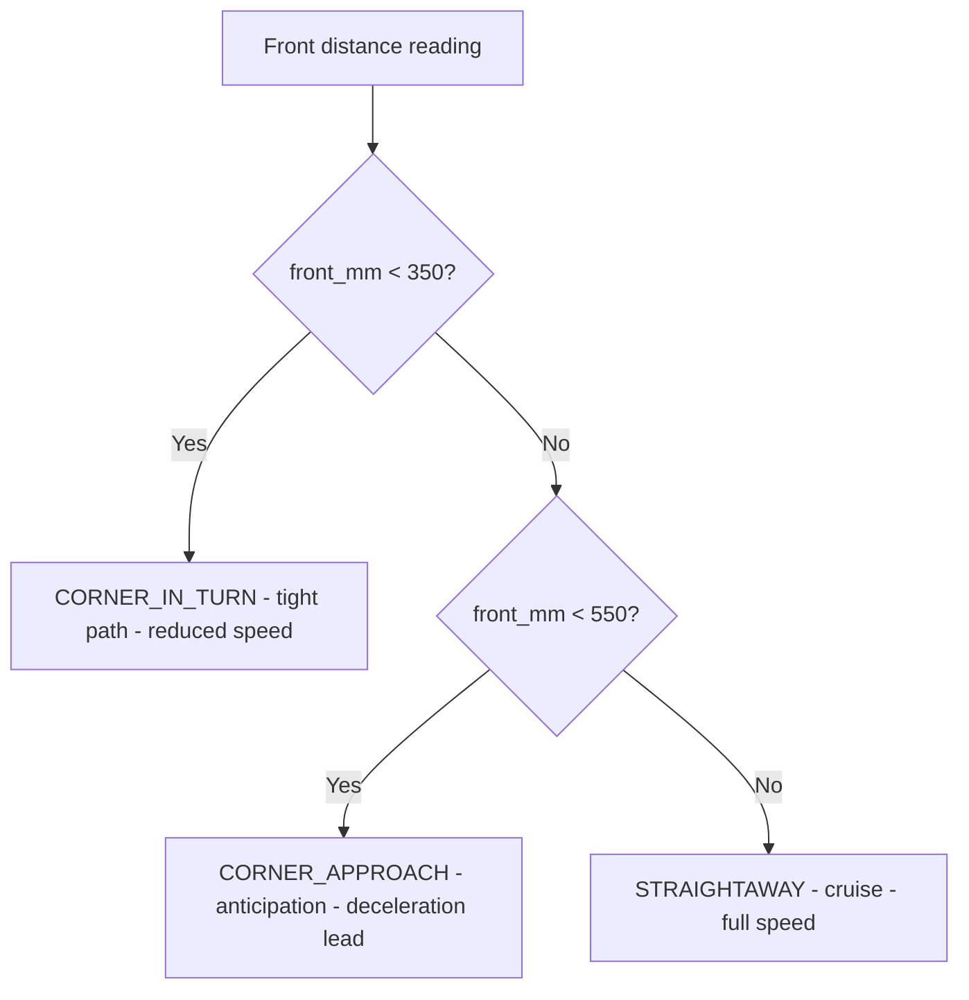
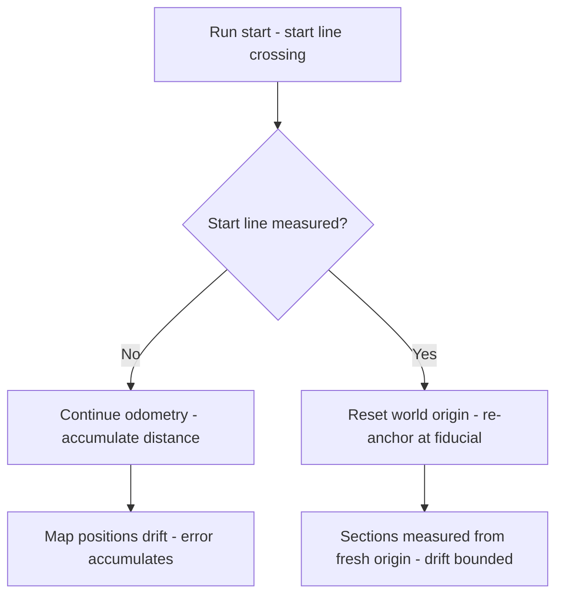
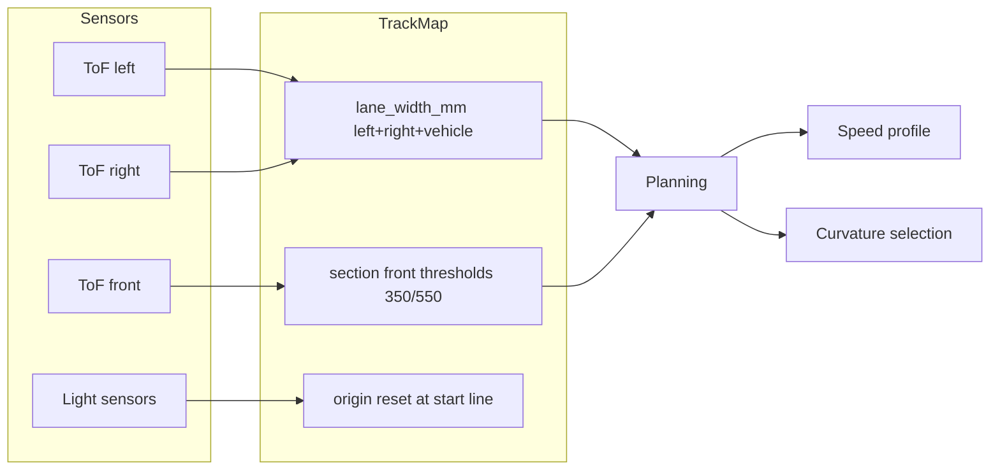

# v8.6 — Track map geometry

| Version | Phase | Days |
|---------|-------|------|
| v8.6 | Advanced Features | Day 223-225 |

## 3. Mission

The v8.6 mission: give the robot a *model of the track's geometry* — the lane's width (the track's narrowing's measure, the left's and the right's walls' distances plus the vehicle's width), the section's class (the straight, the corner's approach, the corner's turn — the front distance's thresholds — the 350/550 mm) — and bind that model to the map's discipline: the world's origin's reset at the start's line, so the distance's error never accumulates. The mission's three parts: the *lane's width's estimation* (the ToFs' left and right plus the vehicle's width — the 160 mm — the track's narrowing's live measure); the *section's classifier* (the front distance's thresholds — the straight, the corner's approach, the corner's turn — the robot's sense of the path's shape ahead); and the *map's reset* (the world's origin's re-anchoring at the start's line — the seed's error's fix — the distance's drift's end). The mission's proof: a robot that knows whether it is on a straight, approaching or inside a corner — the track's understanding — the sections' model feeding the mission's planning (v7.x's map, the path's curvature's selection) with the live geometry.

## 4. Engineering context

The robot enters v8.6 with a strong completion's arm but a blind path's sense. The perception (v6.x) reliably finds the walls and the markers; the parking (v8.5) claims the scoring's biggest share; the planning (v7.x) holds a static map of the mission — but the map's sections (the straight's lengths, the corners' positions) were assumed, not measured: the lane's width's estimate, the section's class — the live geometry of the track — remained unmodeled. The gap mattered in the phase's drills (Day 222-224): the corner's approach needed the speed's lead (the deceleration before the turn's entry — the mission's planning's curvature's selection with the section's anticipation), and the narrow's track (the lane's width's drop — the surprise's rule) needed the live's measure (the width's fall below the threshold — the mode's switch's trigger) — neither possible without the track's model. The map's discipline carried its own failure: the distance's error accumulated along the map (the odometry's drift — the start's line's far re-anchoring — the section's positions' error growth — the corner's anticipation at the wrong place) — the seed's error, the reason the phase's drills showed the speed's lead at the wrong meter.

## 5. Thought process

### 5.1 The track's understanding — what the robot needs to know

The first question: what does the track's understanding mean, mechanically? Three answers, tested against the phase's needs. The *lane's width*: the left's plus the right's walls' distances plus the vehicle's width — the track's narrowing's measure, the narrow's detection's trigger, the lane's width's drop's mode's switch. The *section's class*: the front distance's thresholds — the 350 mm inside the corner's turn (the walls closing — the tight's path), the 550 mm at the corner's approach (the turn's anticipation — the speed's lead's start), the distances beyond as the straight — the robot's sense of the path's shape ahead. The *map's positions*: the section's locations along the mission — the planning's lead — the corner's approach at the known distance. All three demanded: the lane's width's estimation (the ToFs' arithmetic — the two walls plus the vehicle), the section's classifier (the front distance's thresholds — the shape's gate), the map's discipline (the origin's anchor — the drift's reset). The decision: build all three, in the order — the width, the classifier, the reset — the map's model as one class, `track_map.py`.

### 5.2 The lane's width — the walls' arithmetic

The lane's width's estimation was the simplest piece and the most revealing: the left's plus the right's walls' distances plus the vehicle's width — the lane's true width's arithmetic, the track's geometry from the ToFs' two readings. The form — `lane_width_mm(left, right) = left + right + vehicle_width` — the vehicle's width's constant (the 160 mm — the robot's physical breadth) added to the two gaps (the left's and the right's walls' distances — the free space's measure), the result the lane's width (the track's total — the walls' span). The design decisions: the vehicle's width's config (the 160 mm as the constructor's default — the robot's physical measure — the config's override), the directness (the arithmetic's transparency — the two gaps plus the constant — no filtering yet — the raw's truth before the smoothing's need), and the use (the narrow's detection — the lane's width's drop below the threshold — the surprise's rule's trigger — the mode's switch's input). The lane's width was the model's first axis: the track's narrowing's live measure.

### 5.3 The section's classifier — the front's thresholds

The section's classifier was the model's second axis: the front distance's thresholds — the robot's sense of the path's shape ahead. The form — `section(front_mm)`: below the 350 mm — the corner's turn (the walls closing — the tightest's path — the reduced speed's zone — the steering's full's use); below the 550 mm — the corner's approach (the turn's anticipation — the deceleration's start — the planning's lead — the speed's profile's shaping); beyond — the straightaway (the full speed's zone — the cruise). The design decisions: the thresholds' order (the classifier's cascading checks — the lowest's first — the corner's turn's precedence — the 350's check before the 550's); the thresholds' meaning (the front ToF's distance — the wall's closeness ahead — the corner's shape's proxy — the approach's width and the turn's tightness — calibrated against the mission's courses — the corners' radii's classes); and the classifier's statelessness (the section from the single reading — no history — the class's immediacy — the lag's absence — the noise's risk accepted for the response's speed). The classifier was the model's live sense: the section's class at every moment.

### 5.4 The seed's error — the distance's accumulation

The seed's error was the phase's anchor: the distance error accumulated along the map — the map's positions' drift — the corner's anticipation at the wrong place. The mechanics: the map's positions (the section's locations along the mission — the planning's lead) built from the odometry's integration (the distance's accumulation from the start's line — the wheel's counts — the drift's growth), the error compounding (each reading's small error added to the next — the position's error growing with the distance — the map's truth decaying). The symptoms, from the phase's drills: the corner's approach at the wrong meter (the deceleration starting too early or too late — the speed's lead's mistiming — the corner's entry's error); the sections' misalignment (the map's positions vs the physical's track — the model's wrong — the planning's confidence's loss). The fix's shape, named in the skeleton: *reset the world origin at the start line each run* — the map's discipline — the known fiducial's re-anchoring (the start's line — the mission's reference — the origin's reset — the drift's zeroing) — the accumulation's end. The lesson's shape: *maps reset at known fiducials — that is the whole trick* — the anchor's discipline (the start's line — the origin's re-anchoring — the error's bound) as the map's correctness.

### 5.5 The map's discipline — the reset's anchor

The reset's design became the model's third axis: the world's origin's re-anchoring at the start's line — the drift's zeroing at the known fiducial. The design decisions: the anchor's choice (the start's line — the mission's most reliable fiducial — the line's crossing measured by the light's sensors — the robot's known position — the map's truth at the run's start); the reset's timing (each run's start — the origin's reset — the odometry's fresh integration — the accumulation's window's length — the mission's duration bounded); and the reset's method (the origin's re-anchoring — the map's coordinates' zeroing — the position's reset to the start's line's (0,0) — the sections' positions measured from the fresh origin). The discipline's promise: the accumulation's bound (the error's window — the run's duration — the drift's growth limited), the map's truth (the sections' positions accurate within the run — the corner's anticipation at the right meter), and the lesson's proof (the fiducial's reset — the whole trick).

### 5.6 The model's integration — the planning's feed

The model's integration decided the map's value: the track's model feeding the mission's planning (v7.x's map — the path's curvature's selection) with the live geometry. The design decisions: the feed's shape (the section's class and the lane's width to the planning — the speed's profile's shaping — the deceleration's lead at the corner's approach — the narrow's mode's trigger at the width's drop); the map's role (the static map's sections (the known positions) reconciled with the live's class (the measured shape) — the model's hybrid — the planned and the sensed); and the trust's boundary (the map's positions trusted within the run — the reset's discipline — the live's class trusted always — the sensor's truth). The model's promise: the robot that knows the track — the section's class at every moment, the lane's width's measure, the map's positions accurate within the run — the planning's decisions with the geometry's truth.

## 6. Decision flowchart

The section's classifier's decision (the front distance's thresholds — the corner's shape's sense):

The map's discipline's decision (the origin's reset — the drift's end):

## 7. Implementation blueprint

The blueprint, in the build's order:

1. **The model's class** — `track_map.py` — the `TrackMap` class with the vehicle's width's constant (the 160 mm as the constructor's default — the config's override), the lane's width's estimation, the section's classifier, the map's reset.
2. **The lane's width's estimation** — `lane_width_mm(left, right)` — the left's plus the right's walls' distances plus the vehicle's width — the track's narrowing's live measure — the narrow's detection's input.
3. **The section's classifier** — `section(front_mm)` — the thresholds' cascade — the 350 mm's corner's turn (the tight's path — the reduced speed), the 550 mm's corner's approach (the anticipation — the deceleration's lead), the straightaway beyond — the stateless read.
4. **The map's reset** — the world's origin's re-anchoring at the start's line — the fiducial's crossing measured (the light's sensors) — the odometry's fresh integration — the accumulation's window's bound — the seed's error's fix.
5. **The model's integration** — the feed to the mission's planning: the section's class to the speed's profile (the corner's approach's deceleration — the turn's reduced speed), the lane's width to the narrow's mode (the width's drop's trigger).
6. **The verification** — the ACs' runs: the classifier's thresholds (the sections at the known distances), the lane's width's measure (the known lanes — the arithmetic's truth), the map's reset (the positions' accuracy across the repeated runs — the drift's bound).

The blueprint's order follows the dependencies: the class's skeleton first (the width's and the section's and the reset's homes), the estimation and the classifier next (the model's two live axes), the reset after (the discipline — the seed's fix), the integration and the verification last (the planning's feed, the proof).

## 8. Architecture flowchart

The track's model in the phase's architecture:

The diagram is the track's model's place in the phase's architecture, complete: the ToFs' left and right to the lane's width's estimation, the front's ToF to the section's classifier, the light's sensors to the origin's reset, the model's outputs to the planning's speed's profile and curvature's selection — the robot's track's understanding wired into the mission's decisions.

---

## 9. Errors, failures, and root-cause analysis

### Error 1: the distance's accumulation — the seed's error, the map's drift

**Symptom.** Day 223, the map's first runs: the distance's error *accumulated along the map* — the map's positions' drift (the corner's anticipation at the wrong meter — the deceleration's lead starting too early or too late — the sections' misalignment with the physical's track), the planning's confidence's loss, the corner's entry's error.

**Initial hypotheses.** We suspected the odometry's noise. We suspected the map's math. We suspected the sections' positions.

**Investigation.** The origin's absence was the diagnosis: the map's positions (the section's locations along the mission) built from the odometry's integration (the wheel's counts — the distance's accumulation from the start's line), the small errors compounding (each reading's error added to the next — the position's error growing with the distance — the map's truth decaying), and the correction is the map's discipline — the origin's reset at the known fiducial (the start's line — the mission's reference — the re-anchoring — the drift's zeroing — the accumulation's window's bound) (AC4): the seed's error's class — the accumulation's unguarded growth. The lesson's shape: maps reset at known fiducials — that is the whole trick.

**Root cause.** The accumulation unguarded: the map's positions integrated without the re-anchoring — the drift growing with the distance — the anticipation at the wrong meter.

**Fix.** The origin's reset (the shipped discipline): the world's origin re-anchored at the start's line each run (the light's sensors' crossing measured — the odometry's fresh integration — the drift's bound) (AC4). The re-test: the positions' accuracy across the repeated runs — the drift's window bounded, the accumulation's counter-case preserved.

**Prevention.** The rule became the version's headline: *maps reset at known fiducials — that is the whole trick — the origin's re-anchoring is the accumulation's end, and the start's line is the anchor* — the reset's test (AC4) joined the regression, with the drift's run preserved as the reference.

### Error 2: the thresholds' cascade's order — the classifier's confusion

**Symptom.** Day 223, the classifier's builds: the thresholds' cascade *confused the sections* — the cascade's order (the checks' sequence — the 550 mm's check before the 350 mm's) classifying the corner's turn (the front distance below the 350 mm) as the corner's approach (the 550 mm's check's match first — the wrong class — the anticipation instead of the turn's reduced speed), the speed's profile's wrong shaping.

**Initial hypotheses.** We suspected the thresholds' values. We suspected the classifier's logic. We suspected the front's readings.

**Investigation.** The cascade's precedence was the diagnosis: the classifier's correctness (the sections' classes at the known distances — AC1) demands the strictest's first — the corner's turn's check (the 350 mm) before the corner's approach's (the 550 mm) — the most specific's precedence — the inner threshold's match's priority; the reversed order (the loose first) misclassifies the tight (the turn read as the approach — the reduced speed's zone missed). The fix: the cascade's reorder — the 350 mm's check first, the 550 mm's second, the straightaway's default.

**Root cause.** The cascade's order's inversion: the loose threshold's check first — the turn's class captured by the approach's — the speed's profile's error.

**Fix.** The cascade's reorder (the shipped classifier): the corner's turn's check (the 350 mm) first — the corner's approach's (the 550 mm) second — the straightaway's default (AC1). The re-test: the sections at the known distances — the classes' correctness, the confusion's counter-case preserved.

**Prevention.** The rule: *the classifier's cascade is the strictest's precedence — the turn's check first, and the loose first is the misclassification's door* — the classifier's test (AC1) joined the regression.

### Error 3: the width's arithmetic's sign — the gaps' subtraction, the lane's wrong measure

**Symptom.** Day 224, the width's runs: the lane's width's *arithmetic measured the gap, not the lane* — the form's variant (the left's minus the right's — the difference instead of the sum) reporting the position's offset (the alignment's measure — the parking's v8.5's input) as the lane's width (the track's total — the planning's input), the narrow's detection triggered by the offset's noise (the width's false drops — the mode's wrong switches).

**Initial hypotheses.** We suspected the ToFs' readings. We suspected the width's formula. We suspected the mode's thresholds.

**Investigation.** The form's conflation was the diagnosis: the lane's width's form — left + right + vehicle_width (the sum — the free space's total — the track's span) — versus the offset's form — (left - right)/2 (the difference — the position's deviation — the v8.5's alignment's input) — the two measures' roles distinct (the width's to the planning's narrow's detection, the offset's to the parking's alignment); the conflation (the difference's use as the width — the offset's noise as the width's drops) misleads both (the narrow's false triggers, the lane's measure's wrong). The fix: the sum's form verified (the arithmetic's test — the known lanes — the measure's truth — AC2).

**Root cause.** The forms' conflation: the difference's use as the width — the offset's noise — the mode's false switches, the lane's wrong measure.

**Fix.** The form's verification (the shipped estimation): lane_width_mm = left + right + vehicle_width — the sum's test against the known lanes (AC2). The re-test: the known lanes measured truly — the arithmetic's truth, the conflation's counter-case preserved.

**Prevention.** The rule: *the width is the sum, and the offset is the difference — the forms' roles are the model's correctness, and the conflation is the mode's false switches* — the width's test (AC2) joined the regression, with the conflation's run preserved as the reference.

### Error 4: the thresholds' calibration — the fixed bounds vs the mission's courses

**Symptom.** Day 224, the mission's drills: the thresholds' *fixed bounds misclassified the mission's courses* — the 350/550 mm (the calibration against the drills' corners) too tight or loose for the mission's corners' classes (the approach's width's variance — the turn's tightness's variance — the sections' misread at the mission's speeds), the speed's lead's mistiming.

**Initial hypotheses.** We suspected the thresholds' values. We suspected the courses' variance. We suspected the front's noise.

**Investigation.** The calibration's context was the diagnosis: the thresholds' validity (the 350/550 mm — the section's classes' gates) depends on the corners' geometry (the mission's courses' radii and approaches — the walls' closure rates at the speeds), the fixed bounds tuned to the drills' class misreading the mission's variance (the approach's longer, the turn's tighter — the boundaries' wrong places) — the calibration's method (the thresholds measured against the mission's courses — the representative corners' front distances at the approach and the turn — the bounds' placement — AC1) is the classifier's truth. The fix: the calibration's redo against the mission's courses, the thresholds' variance's documentation.

**Root cause.** The calibration's context's miss: the bounds tuned to the drills' classes — the mission's variance unmeasured — the sections' misread.

**Fix.** The calibration's redo (the shipped thresholds): the 350/550 mm measured against the mission's courses (the representative corners' front distances — the bounds' placement within the classes' variance) (AC1). The re-test: the mission's drills' sections correct — the classes' truth, the misread's counter-case preserved.

**Prevention.** The rule: *the thresholds are the mission's geometry's placement — the bounds measure the courses, and the drills' classes are the reference's start, not the truth* — the classifier's test (AC1) joined the regression.

### Error 5: the reset's trigger's miss — the start's crossing's noise

**Symptom.** Day 225, the integration's runs: the reset's *trigger missed the start's crossing* — the light's sensors' noise (the readings' flicker at the line — the threshold's edge — the crossing's detection unreliable — the origin's reset skipped or doubled), the map's positions' drift creeping back (the reset's miss — the accumulation's return — the anticipation's error), the run's truth's decay.

**Initial hypotheses.** We suspected the light's sensors. We suspected the threshold's value. We suspected the reset's logic.

**Investigation.** The crossing's robustness was the diagnosis: the reset's trigger (the start's line's crossing measured — the light's sensors' drop — the origin's re-anchoring) must resist the noise (the readings' flicker at the line's edge — the false or missed crossings — the reset's unreliability), and the trigger's robustness (the confirmation window — the sustained drop's requirement — the debounce — the crossing's certainty — AC4) is the discipline's truth; the raw crossing (the single reading's flicker's acceptance) is the drift's return's door. The fix: the crossing's confirmation (the sustained drop's window — the reset once per run — the debounce).

**Root cause.** The crossing's noise unguarded: the flicker's acceptance — the reset's miss or double — the drift's return.

**Fix.** The crossing's robustness (the shipped reset): the sustained drop's confirmation (the debounce window — the reset once per run — the crossing's certainty) (AC4). The re-test: the start's crossings reliable across the runs — the reset's truth, the flicker's counter-case preserved.

**Prevention.** The rule: *the fiducial's detection is the discipline's gate — the sustained confirmation is the crossing's certainty, and the raw flicker is the drift's return* — the reset's test (AC4) joined the regression, with the flicker's run preserved as the reference.

---

## 10. Verification and metrics

**AC1 — the classifier.** The section's classes at the known distances: the front below the 350 mm — the corner's turn; below the 550 mm — the corner's approach; beyond — the straightaway; the thresholds calibrated against the mission's courses. Passed.

**AC2 — the lane's width.** The lane's width measured truly: the known lanes (the measured lanes' spans) — the arithmetic's (left + right + vehicle_width — the 160 mm) truth. Passed.

**AC3 — the model's feed.** The section's class and the lane's width reach the planning: the corner's approach's deceleration lead, the narrow's mode's trigger — the mission's decisions with the geometry's truth. Passed.

**AC4 — the map's reset.** The world's origin re-anchored at the start's line each run: the positions' accuracy across the repeated runs — the drift's window bounded — the seed's error's fix verified. Passed.

**AC5 — the chain and the phase's regressions.** v6.0-v8.5's suites unchanged, with the track's model serving the planning's decisions. Passed.

**The track's provenance.** The measurements on Day 223-225: the courses' front distances (the thresholds' calibration — the 350/550 mm against the mission's corners), the known lanes (the width's arithmetic's test — the spans' measure), the repeated runs (the reset's drift's window — the positions' accuracy) documented next to the model's constants.

**Cost.** Runtime: microseconds per call (the width's arithmetic, the classifier's cascade). Development: three days, with the errors' lessons (the fiducial's reset, the strictest's precedence, the forms' roles, the courses' calibration, the crossing's confirmation) now permanent checklist items.

**What we trusted afterwards and what we still distrusted.** We trusted the *track's model* completely — the width, the section, the reset, each proven by its test. We trusted the origin's reset as the map's discipline. We still distrusted three things: the *odometry's quality* (the wheel's counts' precision — pending the scheduler's rate's demands); the *map's density* (the sections' resolution — pending the courses' detail); and the *speed's coupling* (the thresholds at the higher speeds — pending the phase's tuning). Each is a named, written debt — the phase's rule.

---

## 11. Lessons learned — permanent mental models

**Lesson 1 — maps reset at known fiducials: that is the whole trick.** The seed's lesson: the distance's accumulation drifted the map — the anticipation at the wrong meter. The permanent practice: the origin's re-anchoring at the start's line — the drift's bound — the map's discipline as the map's correctness.

**Lesson 2 — the classifier's cascade is the strictest's precedence.** The loose threshold's check first misclassified the turn as the approach. The permanent model: the inner threshold's match first — the turn before the approach.

**Lesson 3 — the width is the sum, and the offset is the difference.** The conflation measured the gap instead of the lane — the false mode's switches. The permanent rule: the forms' roles distinct — the width's to the planning, the offset's to the alignment.

**Lesson 4 — the thresholds are the mission's geometry's placement.** The fixed bounds misread the courses' variance. The permanent practice: the calibration against the mission's courses — the drills' classes as the reference's start, not the truth.

**Lesson 5 — the fiducial's detection is the discipline's gate.** The crossing's flicker missed the reset — the drift's return. The permanent model: the sustained confirmation — the debounce — the crossing's certainty.

**Lesson 6 — the model feeds the planning, and the planning trusts it within the reset's window.** The map's value is the mission's decisions with the geometry's truth — and that truth is bounded by the reset's discipline. The permanent rule: the live's class trusted always, the map's positions trusted within the run.

---

## 12. Code in this snapshot

`track_map.py`

---

## 13. Bridge to the next version

What v8.6 unlocks is the track's understanding: the track's model — the lane's width (the left's and the right's walls' distances plus the vehicle's width — the 160 mm), the section's classifier (the front distance's thresholds — the 350/550 mm — the straight, the corner's approach, the corner's turn), the origin's reset (the start's line's re-anchoring — the drift's bound) — the robot knowing whether it is on a straight, approaching or inside a corner, the planning's decisions fed with the geometry's truth. Three capabilities travel forward. First, the model itself — the width, the section, the reset — the track's sense, the planning's feed. Second, the *discipline*: the fiducial's reset (the origin's re-anchoring — the whole trick), the strictest's precedence (the classifier's cascade), the forms' roles (the sum vs the difference), the courses' calibration (the thresholds' placement), the crossing's confirmation (the debounce — the reset's certainty) — the phase's quality bar, now complete across the model's layer. Third, the *model's pattern*: the fused live sense with the disciplined map — the pattern the scheduler's orchestration (the multi-rate's coordination) will serve.

The known debt, stated plainly: the odometry's quality (the wheel's counts' precision); the map's density (the sections' resolution); the speed's coupling (the thresholds at the higher speeds); the model's log (the section's telemetry); and the *temporal organization*: the model's reads (the ToFs' 100 Hz, the light's sensors' crossings) run in the main loop's sequence (the synchronous calls — one sensor at a time — the rates' coupling — the slowest's pacing — the fast's starvation — the samples' jitter — the section's lag), and the robot's growing sensor's fleet (the camera's 30 FPS, the ToFs' 100 Hz, the IMU's polling, the light's crossings) demands the rates' independence — each sensor's cadence without the others' blocking — the background's loops (the thread's scheduling — the periods' alignment) unbuilt. The next problem — the one v8.7 (Day 226-228) must attack — is that organization: *the multi-rate scheduler — the background's loops (the thread's daemon — each sensor's function at its cadence), the absolute-time scheduling (the period's minus the elapsed — the chained sleeps' drift's fix — the seeds' error: the async's drift — the threads' gradual desynchronization), the atomic flags (the thread's coordination — the data's sharing)*. The robot understands the track; it must *sample it in time*. That is the work of the next three days.
