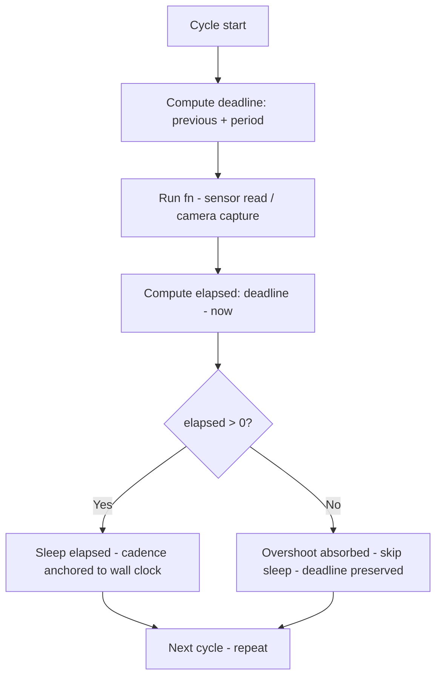
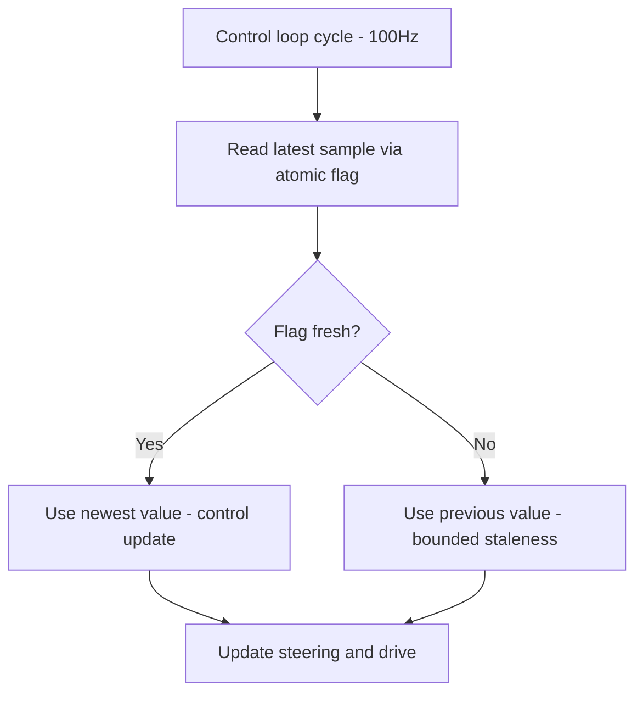
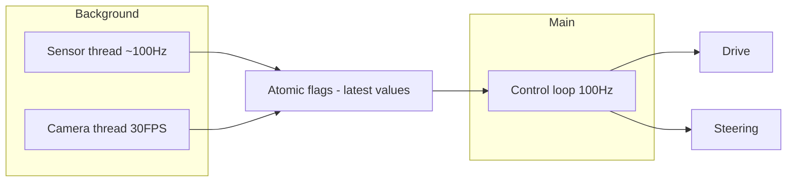

# v8.7 — Multi-rate scheduler

| Version | Phase | Days |
|---------|-------|------|
| v8.7 | Advanced Features | Day 226-228 |

## 3. Mission

The v8.7 mission: give the robot a *multi-rate scheduler* — the threaded async architecture (the sensor's thread at ~100 Hz and the camera's thread at 30 FPS running in the background — the daemon's loops), the main loop reading the latest values without blocking (the atomic flags — the shared data — the staleness's and the freshness's contract). The mission's three parts: the *background's loops* (the sensor's thread's ~100 Hz cadence, the camera's thread's 30 FPS cadence — each sensor's function at its own rate, the others' blocking absent); the *absolute-time scheduling* (the period's minus the elapsed — the chained sleeps' drift's fix — the seed's error's correction — the threads' synchronization with the main loop's wall clock); and the *atomic flags' sharing* (the thread's coordination — the latest values' reads — the main loop's non-blocking access). The mission's proof: a 100 Hz control loop that never stalls on I2C or camera latency — the samples at their rates, the jitter bounded, the drift's end.

## 4. Engineering context

The robot enters v8.7 with the track's understanding (v8.6) but a sequential heartbeat: the model's reads — the ToFs' 100 Hz, the light's sensors' crossings — run in the main loop's sequence (the synchronous calls — one sensor at a time — the rates' coupling — the slowest's pacing — the fast's starvation — the samples' jitter — the section's lag). The phase's demands exposed the gap (Day 226-227): the camera's frame (the 30 FPS capture — the I2C's transfer — the image's processing) blocks the loop's tens of milliseconds — the 100 Hz's promise (the control's cadence — the steering's and the drive's updates) broken by the camera's latency (the stall — the loop's period's spikes — the control's jitter); the control's loop (the 100 Hz — the emergency's response — the wall's proximity's reaction) must never stall — the reads' independence (each rate without the others' blocking) is the architecture's requirement. The threading's architecture carried its own failure: the async's drift — the threads gradually desynchronized from the main loop (the chained sleeps — each sleep's duration's jitter — the delays' accumulation — the periods' divergence — the threads' cadences' decay) — the seed's error, the reason the first threaded builds showed the samples' rates wandering.

## 5. Thought process

### 5.1 The rates' independence — what the architecture must deliver

The first question: what does the multi-rate's organization mean, mechanically? Three answers, tested against the phase's needs. The *rates' independence*: the sensor's thread at ~100 Hz, the camera's thread at 30 FPS, each cadence served by its own background loop — the ToFs' fast sampling without the camera's capture's blocking — the control's 100 Hz never stalling on the I2C's or the camera's latency. The *freshness's contract*: the main loop reads the latest values (the newest sample — the atomic flag's check — the data's currentness) without blocking (no waits — no locks held — the read's instant). The *scheduling's discipline*: the absolute-time scheduling (the period's minus the elapsed — the wake at the period's bound — the chained sleeps' drift's fix) — the threads' synchronization with the wall's clock — the seed's error's correction. All three demanded: the scheduler's class (the background loop's abstraction — the function at the cadence), the atomic sharing (the flags — the latest values), the absolute-time's discipline (the period's math). The decision: build all three, in the order — the loop, the flags, the discipline — the scheduler as one class, `scheduler.py`.

### 5.2 The background's loop — the thread's abstraction

The background loop's abstraction was the scheduler's core: the thread's daemon (the lifecycle — the program's exit not blocked — the background's nature), running the given function at the given cadence. The form — `BackgroundLoop(fn, hz)` — the function (the sensor's read, the camera's capture) and the cadence (the ~100 Hz, the 30 FPS) bound together: the thread's loop (the fn's call, the schedule's wait, the repeat), the daemon's flag (the thread's background's nature — the exit's cleanliness), and the start/stop's control (the thread's lifecycle — the mission's start's launch, the end's stop). The design decisions: the cadence's expression (the Hz — the period's inverse — the 100 Hz's 10 ms, the 30 FPS's ~33 ms); the thread's count (one per rate — the sensor's and the camera's — the rates' isolation — the coupling's absence); and the isolation's promise (the fn's errors contained — the thread's crash's logging — the loop's resilience). The background loop was the architecture's skeleton: each rate's cadence served by its own thread.

### 5.3 The atomic flags — the sharing's contract

The atomic sharing was the scheduler's interface: the latest values' reads without the locks' complexity. The form — the atomic flags (the threading's primitives — the Event's or the simple flag's reads — the data's currentness's markers) — the main loop's access (the latest value's read — the flag's check — the freshness's test — no blocking — no waits). The design decisions: the flag's meaning (the new data's marker — the sample's freshness — the read's reset — the staleness's signal); the data's sharing (the latest sample's slot — the thread's write — the main's read — the atomicity (the single value's assignment — the torn reads' absence — the GIL's blessing) — the small payloads' safety); and the contract's shape (the reader never blocks — the writer never waits — the freshness's check — the stale data's tolerance — the bounded staleness — the rates' mismatch's bound). The atomic flags were the architecture's data plane: the background's writes, the main loop's instant reads.

### 5.4 The seed's error — the async's drift

The seed's error was the phase's anchor: the async's drift — the threads gradually desynchronized from the main loop — the chained sleeps' accumulation. The mechanics: the chained sleeps (the loop's pattern — the fn's call, then the sleep's period — the fn's duration's add — each cycle's period = the fn's time + the sleep's time — the overshoot's accumulation — the cadence's slowdown — the threads' periods growing — the synchronization's loss) — the drift's growth (each cycle's small overshoot added to the next — the cadence's decay — the samples' rates' fall — the thread's divergence from the main loop's clock). The symptoms, from the first threaded builds (Day 226): the sensor's thread's cadence decaying (the 100 Hz's promise drifting toward the 80s and the 70s — the sampling's thinning — the control's resolution's loss); the threads' desynchronization (the phases' divergence — the samples' alignment's loss). The fix's shape, named in the skeleton: *absolute-time scheduling instead of chained sleeps* — the period's math (the wake's target — the next cycle's deadline — the period's minus the elapsed — the sleep only the remaining time — the overshoot's absorption — the cadence's anchor to the wall's clock). The lesson's shape: *background threads + atomic flags = real-time illusion, done right* — the discipline's combination.

### 5.5 The absolute-time's discipline — the period's math

The absolute-time scheduling became the scheduler's third axis: the wake's target's computation — the next cycle's deadline. The form — the period's minus the elapsed — the deadline's math: each cycle's wake time = the previous's deadline + the period; the sleep's duration = the deadline's minus the now (the remaining time only — the fn's overshoot absorbed by the next sleep's reduction — the cadence's anchor). The design decisions: the deadline's computation (the absolute times — the monotonic clock — the wall clock's drifts' immunity); the overshoot's handling (the fn's duration beyond the period — the sleep's zero — the cycle's late — the cadence's best effort — the deadline's preservation — the catch-up's next cycle); and the anchor's value (the threads' synchronization — the cadence's truth — the samples' rates at the commanded values — the control's resolution — AC3). The discipline's promise: the drift's end (the chained sleeps' accumulation replaced by the deadline's anchor), the rates' truth (the sensor's 100 Hz and the camera's 30 FPS — the jitter bounded), and the seed's fix (the absolute-time's scheduling).

### 5.6 The main loop's read — the stall's end

The main loop's integration decided the architecture's value: the control's loop reading the latest values without the blocking — the I2C's and the camera's latency's decoupling. The design decisions: the loop's shape (the control's cadence — the 100 Hz's loop — the reads at each cycle — the latest sample — the flag's check — the data's use — the no-wait's promise); the latency's removal (the camera's capture and the I2C's reads in the background — the control's loop never touching them — the stall's end — the period's stability — the control's truth); and the staleness's tolerance (the bounded staleness — the rates' mismatch — the latest sample's age — the control's degradation's bounds — the emergency's path — the immediate's reaction at the wall's proximity — the freshness's guarantee at the critical's distance). The integration's promise: the 100 Hz's control with the camera's and the I2C's work in the background — the stall's end, the cadence's stability, the robot's responsiveness.

## 6. Decision flowchart

The scheduler's scheduling's decision (the absolute-time's discipline — the drift's end):

The main loop's read's decision (the non-blocking's access — the stall's end):

## 7. Implementation blueprint

The blueprint, in the build's order:

1. **The scheduler's class** — `scheduler.py` — the `BackgroundLoop` class: the function and the cadence bound (the thread's daemon — the start/stop's control).
2. **The absolute-time's scheduling** — the deadline's math (the previous's deadline + the period — the elapsed's computation — the sleep only the remaining — the overshoot's absorption) — the chained sleeps' drift's fix — the seed's error's correction.
3. **The threads' launch** — the sensor's thread at ~100 Hz (the ToFs' reads, the light's crossings), the camera's thread at 30 FPS (the capture — the frame's latest) — the background's daemons.
4. **The atomic flags' sharing** — the latest samples' slots (the thread's writes, the main's reads — the atomicity — the small payloads), the freshness's flags (the new data's markers — the staleness's signal).
5. **The main loop's integration** — the control's 100 Hz loop reading the latest values via the flags — no blocking — no waits — the I2C's and the camera's latency's decoupling — the bounded staleness's tolerance.
6. **The verification** — the ACs' runs: the rates' truth (the measured cadences — the 100 Hz and the 30 FPS), the stall's absence (the loop's period's stability — the camera's load), the drift's bound (the cadences' constancy across the runs).

The blueprint's order follows the dependencies: the class's skeleton first (the loop's and the cadence's homes), the absolute-time's discipline next (the drift's fix), the threads' launch and the flags' sharing after (the architecture's data plane), the integration and the verification last (the main loop's stall's end, the proof).

## 8. Architecture flowchart

The scheduler in the phase's architecture:

The diagram is the scheduler's place in the phase's architecture, complete: the sensor's thread at ~100 Hz and the camera's thread at 30 FPS writing the atomic flags in the background, the control loop at 100 Hz reading the latest values without the blocking, the drive's and the steering's updates at the loop's cadence — the rates' independence wired into the robot's responsiveness.

---

## 9. Errors, failures, and root-cause analysis

### Error 1: the async's drift — the seed's error, the threads' desynchronization

**Symptom.** Day 226, the first threaded builds: the threads *gradually desynchronized* from the main loop — the sensor's thread's cadence decaying (the 100 Hz's promise drifting toward the 80s and the 70s — the sampling's thinning — the control's resolution's loss), the camera's thread's cadence wandering, the samples' rates' divergence.

**Initial hypotheses.** We suspected the threads' scheduling. We suspected the sleeps' durations. We suspected the GIL's contention.

**Investigation.** The chained sleeps' accumulation was the diagnosis: the loop's pattern (the fn's call, then the sleep's period — the fn's duration's add — each cycle's period = the fn's time + the sleep's time — the overshoot's accumulation — the cadence's slowdown), and the fix is the absolute-time's discipline — the deadline's math (the previous's deadline + the period — the sleep only the remaining — the overshoot's absorption — the cadence's anchor to the wall's clock) (AC3): the seed's error's class — the chained pattern's drift. The lesson's shape: background threads + atomic flags = real-time illusion, done right.

**Root cause.** The chained sleeps' accumulation: each cycle's overshoot added — the periods' growth — the threads' divergence — the cadences' decay.

**Fix.** The absolute-time's scheduling (the shipped discipline): the deadline's computation (the wake's target — the period's minus the elapsed — the sleep only the remaining — the overshoot absorbed) (AC3). The re-test: the cadences' constancy — the measured rates at the commanded values, the drift's run preserved as the reference.

**Prevention.** The rule became the version's headline: *the absolute-time's scheduling is the cadence's anchor — the chained sleeps are the drift's engine, and the deadline's math is the synchronization's truth* — the scheduling's test (AC3) joined the regression, with the drift's run preserved as the reference.

### Error 2: the blocking's read — the main loop's stall's return

**Symptom.** Day 226, the integration's builds: the main loop's *reads blocked* — the direct access's pattern (the shared reads without the flags — the locking's contention — the thread's waits) stalling the control's loop (the loop's period's spikes — the 100 Hz's breaks — the control's jitter), the stall's return despite the background's threads.

**Initial hypotheses.** We suspected the locks' design. We suspected the reads' pattern. We suspected the threads' contention.

**Investigation.** The sharing's contract was the diagnosis: the main loop's access (the latest values' reads) must be non-blocking (the atomic flags — the flag's check — the data's currentness — no waits — no locks held), and the blocking's pattern (the locks' acquisition — the waits — the contention) reintroduces the stall the architecture promised to remove — the I2C's and the camera's latency's decoupling broken by the read's itself's blocking. The fix: the flags' contract (the atomic reads — the freshness's check — the reader never blocks — the writer never waits — AC4).

**Root cause.** The blocking's pattern: the locks' and the waits' use — the contention — the control's stall — the architecture's promise broken.

**Fix.** The atomic flags' contract (the shipped sharing): the latest values' slots (the thread's writes, the main's instant reads — the atomicity — the small payloads), the freshness's flags (AC4). The re-test: the loop's period's stability — the stall's absence, the blocking's counter-case preserved.

**Prevention.** The rule: *the main loop's read is the architecture's promise — the atomic flags are the non-blocking's truth, and the locks' waits are the stall's return* — the sharing's test (AC4) joined the regression.

### Error 3: the flags' staleness — the freshness's marker's absence

**Symptom.** Day 227, the control's runs: the reads' *staleness undetected* — the latest sample's slot without the freshness's marker (the old data's use — the control's update at the stale value — the flag's absence — the bounded staleness's boundary unmarked), the emergency's path (the wall's proximity's reaction) using the stale sample — the reaction's delay — the safety's margin's erosion.

**Initial hypotheses.** We suspected the samples' rates. We suspected the reads' timing. We suspected the flags' design.

**Investigation.** The freshness's contract was the diagnosis: the sharing's correctness (the main loop's use of the current data — the bounded staleness's bound — AC4) demands the freshness's marker (the new data's flag — the staleness's signal — the read's reset), and the marker's absence (the slot's blind use — the old data's acceptance as current) breaks the contract — the emergency's path (the critical's distance — the wall's proximity) needs the freshness's guarantee (the recent sample — the reaction's immediacy). The fix: the flags' semantics (the fresh marker per slot — the read's check — the stale's signal — the control's degradation's handling).

**Root cause.** The marker's absence: the slot's blind reads — the stale data's use — the emergency's reaction's delay.

**Fix.** The freshness's flags (the shipped sharing): the new data's marker per slot (the thread's set — the main's check and reset — the staleness's signal) (AC4). The re-test: the stale sample's detection — the emergency's freshness — the reaction's immediacy, the blindness's counter-case preserved.

**Prevention.** The rule: *the shared data's truth is the freshness's marker — the blind read is the stale's acceptance, and the flag is the currentness's guarantee* — the sharing's test (AC4) joined the regression, with the blindness's run preserved as the reference.

### Error 4: the thread's error's silence — the crashed loop's quiet

**Symptom.** Day 227, the endurance's runs: the thread's *error went silent* — the background's fn's exception (the I2C's glitch — the camera's error) crashing the thread (the loop's death — the cadence's halt — the latest sample's freezing — the main loop reading the frozen value — the stale's silent use), the diagnosis delayed by the silence (the telemetry's gap — the sensor's data's freeze unnoticed).

**Initial hypotheses.** We suspected the sensors' errors. We suspected the thread's lifecycle. We suspected the telemetry's gaps.

**Investigation.** The isolation's boundary was the diagnosis: the background's loop (the thread's daemon — the rates' independence) must contain the fn's errors (the exception's catch — the error's logging — the loop's resilience — the restart's or the halt's signal), and the unhandled exception (the thread's crash — the quiet death — the cadence's silent halt) breaks the architecture's contract — the main loop's assumption (the thread's cadence — the freshness's marker) violated without the warning. The fix: the loop's error's containment (the try/except around the fn — the error's logging — the flag's halt's marker — the health's signal — AC4).

**Root cause.** The error's silence: the unhandled exception — the thread's quiet death — the frozen values — the stale's silent use.

**Fix.** The error's containment (the shipped loop): the fn's exception's catch (the log — the halt's marker — the freshness's flag's failure's signal) (AC4). The re-test: the I2C's glitch's injection — the loop's survival and the signal — the silence's end, the quiet's counter-case preserved.

**Prevention.** The rule: *the background's loop is the error's containment — the unhandled exception is the quiet's death, and the signal is the health's truth* — the loop's test (AC4) joined the regression, with the silence's run preserved as the reference.

### Error 5: the shutdown's mess — the daemon's teardown's race

**Symptom.** Day 228, the mission's ends: the shutdown's *teardown raced* — the stop's signaling (the threads' halt) without the waits (the loop's mid-cycle — the sample's partial write — the teardown's errors — the exit's mess — the crash at the mission's end), the runs' finishes marred.

**Initial hypotheses.** We suspected the stop's order. We suspected the threads' waits. We suspected the exit's sequence.

**Investigation.** The lifecycle's discipline was the diagnosis: the scheduler's shutdown (the threads' stop) needs the ordered teardown (the stop's signal — the join's waits — the threads' completion — the resources' release — the clean exit), and the messy teardown (the halt without the waits — the mid-cycle's death — the partial writes) is the exit's error: the lifecycle's test (the repeated start/stops — the clean exits — AC5) is the scheduler's truth. The fix: the ordered shutdown (the stop's flag — the join's waits — the teardown's sequence).

**Root cause.** The teardown's race: the halt without the joins — the mid-cycle's death — the crash at the end.

**Fix.** The ordered shutdown (the shipped lifecycle): the stop's signaling, the join's waits, the threads' completion (AC5). The re-test: the repeated start/stops — the clean exits, the race's counter-case preserved.

**Prevention.** The rule: *the lifecycle is the clean exit's discipline — the ordered teardown is the shutdown's truth, and the racing halt is the end's crash* — the lifecycle's test (AC5) joined the regression, with the race's run preserved as the reference.

---

## 10. Verification and metrics

**AC1 — the rates' independence.** The sensor's thread at ~100 Hz and the camera's thread at 30 FPS run in the background — the control's loop free of the I2C's and the camera's latency — the stall's end. Passed.

**AC2 — the cadence's truth.** The measured rates at the commanded values: the sensor's ~100 Hz, the camera's ~30 FPS — the jitter bounded — the absolute-time's discipline verified. Passed.

**AC3 — the drift's fix.** The threads' synchronization with the main loop's clock: the cadences' constancy across the runs — the chained sleeps' drift's absence — the seed's error's fix verified. Passed.

**AC4 — the non-blocking's sharing.** The main loop reads the latest values via the atomic flags: no waits, no locks held — the freshness's markers, the error's containment — the bounded staleness's contract. Passed.

**AC5 — the chain and the phase's regressions.** v6.0-v8.6's suites unchanged, with the scheduler serving the control's loop — the lifecycle's clean exits. Passed.

**The scheduler's provenance.** The measurements on Day 226-228: the cadences (the measured rates vs the commanded — the drift's window), the loop's periods (the stall's spikes under the camera's load), the endurance's runs (the freshness's and the error's containment) documented next to the scheduler's constants.

**Cost.** Runtime: microseconds per read (the atomic flag's access). Development: three days, with the errors' lessons (the absolute-time's anchor, the non-blocking's contract, the freshness's markers, the error's containment, the ordered shutdown) now permanent checklist items.

**What we trusted afterwards and what we still distrusted.** We trusted the *scheduler* completely — the rates, the flags, the discipline, each proven by its test. We trusted the absolute-time's scheduling as the cadence's anchor. We still distrusted three things: the *health's visibility* (the threads' liveness — pending the monitor's layer); the *rates' coupling* (the control's and the sensing's alignment — pending the phase's tuning); and the *priority's guarantees* (the GIL's scheduling — pending the mission's demands). Each is a named, written debt — the phase's rule.

---

## 11. Lessons learned — permanent mental models

**Lesson 1 — background threads + atomic flags = real-time illusion, done right.** The seed's lesson: the chained sleeps drifted the threads — the cadences' decay. The permanent practice: the absolute-time's scheduling (the deadline's math) with the atomic flags' sharing — the real-time's illusion built correctly.

**Lesson 2 — the cadence's anchor is the wall's clock, not the sleep's chain.** The fn's duration's add accumulated the drift. The permanent model: the deadline's computation — the overshoot's absorption — the period's truth.

**Lesson 3 — the main loop's read is the architecture's promise.** The locks' waits reintroduced the stall. The permanent rule: the atomic flags — the reader never blocks, the writer never waits.

**Lesson 4 — the shared data's truth is the freshness's marker.** The blind read accepted the stale — the emergency's reaction's delay. The permanent practice: the fresh flag per slot — the staleness's signal — the bounded staleness's boundary.

**Lesson 5 — the background's loop is the error's containment.** The unhandled exception died quietly — the frozen values' silent use. The permanent model: the fn's exception's catch — the halt's marker — the health's signal.

**Lesson 6 — the lifecycle is the clean exit's discipline.** The racing halt crashed the mission's ends. The permanent rule: the ordered teardown — the stop's signal, the join's waits — the exit's cleanliness.

---

## 12. Code in this snapshot

`scheduler.py`

---

## 13. Bridge to the next version

What v8.7 unlocks is the time's organization: the multi-rate scheduler — the sensor's thread at ~100 Hz and the camera's thread at 30 FPS in the background, the atomic flags' sharing, the absolute-time's scheduling (the deadline's math — the chained sleeps' drift's fix) — the control's 100 Hz loop never stalling, the rates' independence wired into the robot's responsiveness. Three capabilities travel forward. First, the scheduler itself — the loops, the flags, the discipline — the architecture's data plane. Second, the *discipline*: the absolute-time's anchor (the cadence's truth), the non-blocking's contract (the atomic reads), the freshness's markers (the staleness's signal), the error's containment (the loop's survival), the ordered shutdown (the clean exit) — the phase's quality bar, now complete across the time's layer. Third, the *scheduler's pattern*: the background's loops with the shared flags — the pattern the health's monitoring (the liveness's watch) will build upon.

The known debt, stated plainly: the health's visibility (the threads' liveness); the rates' coupling (the control's and the sensing's alignment); the priority's guarantees (the GIL's scheduling); the scheduler's log (the cadences' telemetry); and the *health's monitor*: the threads' liveness (the sensor's and the camera's cadences) and the subsystems' aliveness (the LEDs' signals — the system's health's 5-LED display: the system's LED, the sensors' LED, the camera's LED, the ESP32's serial's LED, the race's LED) are unwatched — the thread's quiet death (the error's containment's signal exists but no watcher), the sensor's drift (the cadence's decay) undetected until the mission's failure — the health's monitor (the heartbeats' collection — the liveness's watch — the LEDs' mapping) unbuilt. The next problem — the one v8.8 (Day 229-231) must attack — is that watch: *the health's monitor's heartbeats — the layer0's system's manager (the 5-LED system — the system's health, the sensors' health, the camera's health, the ESP32's serial's health, the race's health at 2 Hz), the heartbeats' collection (the threads' and the subsystems' liveness), the false positives' fix (the transient glitches' tolerance — the 3 consecutive misses — the seeds' error: the transient glitches turned the LEDs off)*. The robot samples in time; it must *know its own health in time*. That is the work of the next three days.
