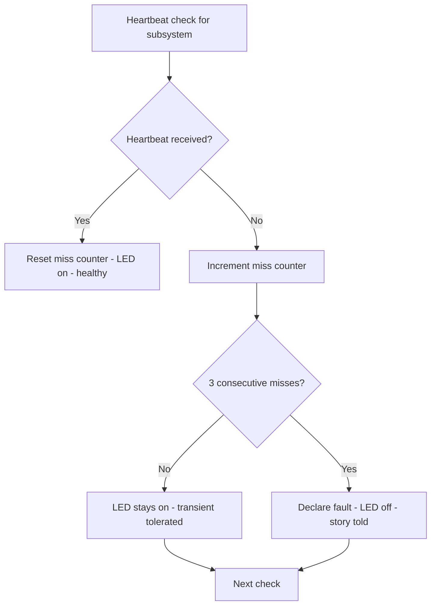
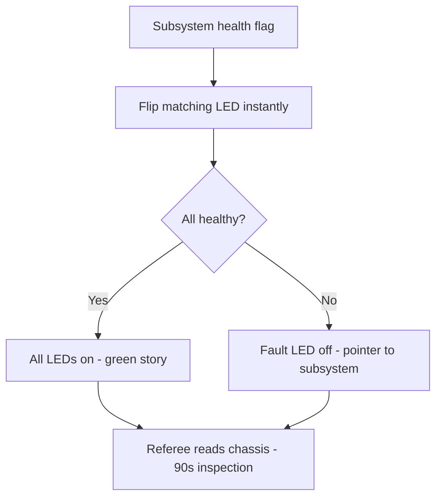
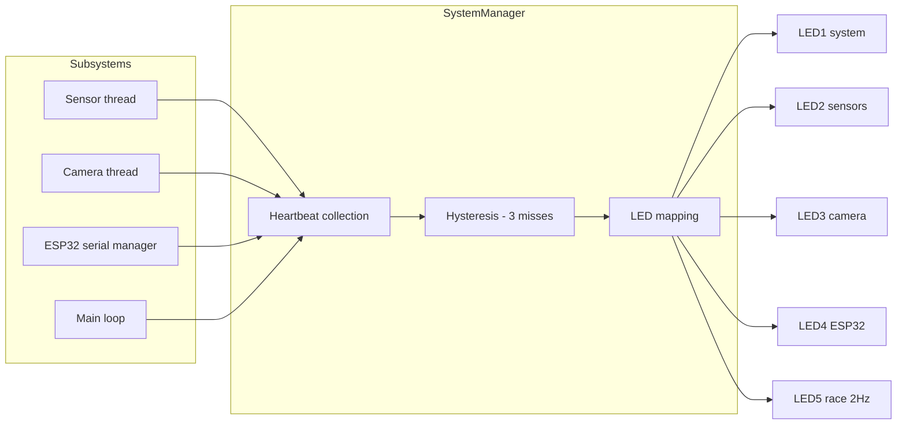

# v8.8 — Health monitor heartbeats

| Version | Phase | Days |
|---------|-------|------|
| v8.8 | Advanced Features | Day 229-231 |

## 3. Mission

The v8.8 mission: give the robot a *health's monitor* — the 5-LED system (LED1 the system's health, LED2 the sensors' health, LED3 the camera's health, LED4 the ESP32's serial's health, LED5 the race's blink at 2 Hz) — each subsystem reporting its health's flags (the heartbeats — the liveness's signals) that flip its LED instantly — the whole fault story on the chassis, readable in a 90-second referee inspection. The mission's three parts: the *LEDs' mapping* (the five GPIOs — the system's 5, the sensors' 6, the camera's 13, the ESP32's serial's 19, the race's 26 — the five subsystems' visible faces); the *heartbeats' collection* (the subsystems' health's flags — the liveness's reports — the threads' and the managers' cadences — the monitor's gathering); and the *fault's declaration's discipline* (the transient glitches' tolerance — the 3 consecutive misses before the fault — the seed's error's fix — the false positives' end). The mission's proof: a 90-second referee inspection reads the LEDs — the health's truth at a glance, the faults' story told on the chassis.

## 4. Engineering context

The robot enters v8.8 with the time's organization (v8.7) but a blind health's watch: the threads' liveness (the sensor's and the camera's cadences) and the subsystems' aliveness (the ESP32's serial's link, the managers' loops) were unwatched — the thread's quiet death (the error's containment's signal existed but no watcher), the sensor's drift (the cadence's decay) undetected until the mission's failure. The phase's demands exposed the gap (Day 229-230): the competition's inspection (the 90-second referee's walk — the robot's health's read) expects the health's truth at a glance — the fault's story visible on the chassis (the LEDs — the five subsystems' lights — the story without the laptop); the diagnoses after the runs (the fault's hunt — the log's scroll) were slow — the health's instant view (the LED's state at the fault's moment) is the diagnosis's speed. The monitor's design carried its own failure: the false positives — the transient glitches turned the LEDs off (the single miss — the heartbeat's jitter — the sensor's glitch — the I2C's hiccup — the LED's flip — the fault's false declaration — the referee's wrong read) — the seed's error, the reason the first builds showed the LEDs' flickering.

## 5. Thought process

### 5.1 The health's story — what the inspection must read

The first question: what does the health's monitor need to tell, mechanically? Three answers, tested against the phase's needs. The *subsystems' states*: the five systems — the system's own health (the main loop's liveness), the sensors' health (the ToFs' and the IMU's aliveness), the camera's health (the frames' flow), the ESP32's serial's health (the link's liveness), the race's state (the 2 Hz blink — the mission's aliveness) — each with its LED's face. The *instant's flips*: the health's flags (the heartbeats — the liveness's reports) flip the LEDs instantly (the flag's change — the LED's change — no polling delay — the truth's immediacy). The *fault's declaration's discipline*: the misses' tolerance (the 3 consecutive misses before the fault — the transient glitches' absorption — the seed's error's fix — the false positives' end). All three demanded: the LEDs' mapping (the five GPIOs' assignments), the heartbeats' collection (the flags' gathering), the hysteresis (the tolerance's discipline). The decision: build all three, in the order — the mapping, the collection, the discipline — the monitor as one manager, `layer0_system_manager.py`.

### 5.2 The LEDs' mapping — the five faces

The LED's mapping was the monitor's skeleton: the five GPIOs — LED1 the system's health (the GPIO 5 — the main loop's liveness — the system's on — the crash's off), LED2 the sensors' health (the GPIO 6 — the ToFs' and the IMU's aliveness — the readings' flow), LED3 the camera's health (the GPIO 13 — the frames' cadence — the capture's flow), LED4 the ESP32's serial's health (the GPIO 19 — the link's liveness — the packets' flow), LED5 the race's blink (the GPIO 26 — the 2 Hz — the mission's aliveness — the run's pulse). The design decisions: the mapping's fixity (the five GPIOs — the chassis's labeled faces — the referee's and the team's shared lexicon — the LED's meaning stable); the blink's cadence (the race's 2 Hz — the mission's heartbeat — the run's aliveness at a glance — the still LED's fault's signal); and the faces' legibility (the LEDs' placement and the brightness — the inspection's reading at the distance — the truth's visibility). The mapping was the monitor's visible plane: the five subsystems' lights.

### 5.3 The heartbeats' collection — the flags' gathering

The heartbeats' collection was the monitor's data plane: the subsystems' health's flags — the liveness's reports — gathered into the manager. The form: each subsystem (the sensor's thread from v8.7, the camera's thread, the serial's manager, the main loop) reports its health's flag (the heartbeat — the alive's mark — the cadence's proof — the samples' flow — the packets' flow), and the manager watches the flags (the heartbeats' counts — the liveness's accumulation — the fault's declaration's basis). The design decisions: the heartbeat's shape (the periodic mark — the alive's signal — the cadence's evidence — the report's rate per subsystem); the watch's loop (the manager's cadence — the heartbeats' checking — the flags' reading — the LEDs' updating); and the report's channel (the shared flags (v8.7's atomic pattern) — the manager's read — the non-blocking's watch). The collection was the monitor's gathering: the subsystems' aliveness into the manager's view.

### 5.4 The seed's error — the false positives

The seed's error was the phase's anchor: the false positives — the transient glitches turned the LEDs off. The mechanics: the single miss's judgment (the heartbeat's check — the one missed heartbeat — the fault's declaration — the LED's flip — the sensor's glitch — the I2C's hiccup — the camera's jitter — the transient's pause — the false positive — the fault's wrong story). The symptoms, from the first builds (Day 229): the LEDs' flickering (the transient's glitches — the LED's offs and ons — the fault's flapping — the referee's wrong read — the team's false alarms); the health's noise (the monitor's truth buried under the transients — the diagnosis's confusion). The fix's shape, named in the skeleton: *the tolerance of the 3 consecutive misses before declaring the fault* — the hysteresis — the misses' accumulation (the fault only at the third consecutive miss — the transient's absorption — the one-miss's tolerance — the two-miss's watch — the fault's confirmation). The lesson's shape: *health monitors need hysteresis* — the tolerance's discipline — the false positives' end.

### 5.5 The hysteresis — the tolerance's discipline

The hysteresis became the monitor's third axis: the misses' tolerance — the fault's declaration's threshold. The form — the miss's counter per subsystem (the consecutive misses' count — the reset at each heartbeat — the fault at the 3 consecutive — the recovery at the heartbeats' return — the LED's restoration) — the transient's absorption (the single glitch's pass — the LED's steady on — the false positive's absence). The design decisions: the threshold's value (the 3 consecutive misses — the transient's window's bound — the glitches' typical length vs the subsystems' cadences — the false positive's end without the fault's delay's cost); the recovery's path (the heartbeats' return — the counter's reset — the LED's on — the health's restoration — the hysteresis's loop — the fault's state's persistence vs the recovery's immediacy); and the declaration's effect (the LED's flip at the confirmed fault — the story's truth — the referee's read — the diagnosis's start). The discipline's promise: the false positives' end (the flicker's absence — the LEDs' steadiness), the fault's truth (the confirmed faults' stories), and the seed's fix (the hysteresis — the tolerance's discipline).

### 5.6 The inspection's read — the story's use

The inspection's integration decided the monitor's value: the 90-second referee's read — the whole fault story on the chassis. The design decisions: the story's shape (the five LEDs' states — the fault's subsystem at a glance — the healthy's all-on — the fault's LED's off — the diagnosis's pointer); the inspection's flow (the robot powered — the LEDs' steady states — the referee's read without the laptop — the story's legibility — the LED's brightness and the placement); and the story's trust (the hysteresis's truth — the confirmed faults only — the false positives' absence — the referee's confidence — the team's diagnosis's speed — the fault's subsystem's hunt's start). The integration's promise: the health's truth at a glance — the fault's story on the chassis — the inspection's and the diagnosis's speed.

## 6. Decision flowchart

The fault's declaration's decision (the hysteresis — the false positives' end):

The LED's mapping's decision (the story's legibility):

## 7. Implementation blueprint

The blueprint, in the build's order:

1. **The manager's class** — `layer0_system_manager.py` — the `SystemManager`: the five LEDs' mapping (the GPIOs 5, 6, 13, 19, 26), the heartbeats' collection, the fault's declaration.
2. **The LEDs' mapping** — LED1 the system's health (the GPIO 5), LED2 the sensors' (the GPIO 6), LED3 the camera's (the GPIO 13), LED4 the ESP32's serial's (the GPIO 19), LED5 the race's blink (the GPIO 26 — the 2 Hz).
3. **The heartbeats' collection** — the subsystems' health's flags (the v8.7's atomic pattern) — the threads' and the managers' reports — the manager's watch's loop.
4. **The hysteresis** — the miss's counter per subsystem — the 3 consecutive misses before the fault — the transient's absorption — the recovery's path — the seed's error's fix.
5. **The inspection's integration** — the LEDs' steady states at the inspection (the healthy's all-on, the fault's pointer) — the story's legibility — the referee's read.
6. **The verification** — the ACs' runs: the LEDs' states (the flips at the flags' changes), the hysteresis (the glitches' tolerance — the faults' confirmation), the inspection's read (the story's truth).

The blueprint's order follows the dependencies: the manager's skeleton first (the LEDs' and the watch's homes), the mapping and the collection next (the monitor's planes), the hysteresis after (the seed's fix), the inspection's integration and the verification last (the story's use, the proof).

## 8. Architecture flowchart

The health's monitor in the phase's architecture:

The diagram is the health's monitor's place in the phase's architecture, complete: the subsystems' heartbeats (the sensor's thread, the camera's thread, the serial's manager, the main loop) flowing into the manager's collection, the hysteresis's filter, the LED's mapping — the five faces on the chassis — the fault's story told for the inspection's read.

---

## 9. Errors, failures, and root-cause analysis

### Error 1: the false positives — the seed's error, the transient's flips

**Symptom.** Day 229, the first builds: the transient glitches *turned the LEDs off* — the LEDs' flickering (the single miss's judgment — the heartbeat's jitter — the sensor's glitch — the I2C's hiccup — the camera's pause — the LED's flip — the fault's false declaration), the health's noise (the monitor's truth buried under the transients — the diagnosis's confusion — the referee's wrong read).

**Initial hypotheses.** We suspected the heartbeats' rates. We suspected the LEDs' logic. We suspected the subsystems' stability.

**Investigation.** The single miss's judgment was the diagnosis: the heartbeat's check (the one missed heartbeat — the immediate fault) cannot distinguish the transient (the glitch's pause — the brief silence) from the fault (the sustained loss — the death), and the fix is the tolerance's discipline — the 3 consecutive misses before the declaration (the misses' accumulation — the transient's window — the fault's confirmation) (AC2): the seed's error's class — the judgment's lack of the memory. The lesson's shape: health monitors need hysteresis.

**Root cause.** The single miss's judgment: the immediate flip at the transient — the false positive — the LED's flicker — the health's noise.

**Fix.** The hysteresis (the shipped discipline): the miss's counter per subsystem — the 3 consecutive misses before the fault — the reset at the heartbeats' return — the transient's absorption (AC2). The re-test: the glitches' injection — the LEDs' steady states — the faults' confirmation, the flicker's run preserved as the reference.

**Prevention.** The rule became the version's headline: *health monitors need hysteresis — the single miss is the transient's noise, and the confirmation's tolerance is the fault's truth* — the hysteresis's test (AC2) joined the regression, with the flicker's run preserved as the reference.

### Error 2: the LED's mapping's collision — the GPIO's conflict

**Symptom.** Day 229, the wiring's tests: the LED's *mapping collided* — the GPIO's assignment (the 26's dual use — the LED5's race's blink sharing the pin with another function — the race's LED and the function's interference — the LED's wrong states — the blink's and the function's fighting), the chassis's story corrupted.

**Initial hypotheses.** We suspected the wiring. We suspected the GPIO's numbers. We suspected the functions' sharing.

**Investigation.** The pin's exclusivity was the diagnosis: the LEDs' mapping (the five GPIOs — the chassis's labeled faces) demands the pins' exclusivity (each GPIO assigned to the LED alone — the shared pin's interference — the two functions' fighting — the wrong states), and the collision (the 26's shared use — the blink's corruption) breaks the story's truth: the mapping's audit (the GPIOs' exclusivity — the conflict's absence — the chassis's legend's match — AC1) is the monitor's skeleton's correctness. The fix: the pin's reassignment (the exclusive GPIO — the conflict's removal — the legend's update).

**Root cause.** The pin's collision: the shared GPIO — the functions' fighting — the LED's wrong states — the story's corruption.

**Fix.** The exclusivity's audit (the shipped mapping): the five GPIOs' exclusive assignments (the conflict's absence — the chassis's legend's match) (AC1). The re-test: the LEDs' states at the flags' changes — the mapping's truth, the collision's counter-case preserved.

**Prevention.** The rule: *the LED's mapping is the pin's exclusivity — the shared GPIO is the story's corruption, and the audit is the face's truth* — the mapping's test (AC1) joined the regression.

### Error 3: the heartbeat's silence — the report's channel's loss

**Symptom.** Day 230, the integration's runs: the heartbeat's *reports went silent* — the report's channel's fault (the shared flag's write lost — the manager's read failing — the heartbeat's absence — the subsystem healthy but the monitor deaf), the faults' false declarations (the healthy subsystems' LEDs off — the monitor's blindness), the story's wrongness.

**Initial hypotheses.** We suspected the subsystems' reports. We suspected the flags' sharing. We suspected the manager's reads.

**Investigation.** The channel's reliability was the diagnosis: the heartbeats' collection (the flags' sharing — the v8.7's atomic pattern) must transport the reports reliably (the subsystem's write — the manager's read — the heartbeat's arrival), and the channel's loss (the report's silence — the healthy's false fault) is the monitor's blindness: the channel's test (the reports' delivery — the heartbeat's arrival — AC3) is the collection's correctness. The fix: the channel's verification (the write/read's integrity — the heartbeat's arrival's check).

**Root cause.** The channel's loss: the report's silence — the healthy's false fault — the monitor's blindness.

**Fix.** The channel's verification (the shipped collection): the flags' sharing's integrity (the subsystem's write delivered — the manager's read's truth) (AC3). The re-test: the reports' delivery — the false faults' absence, the silence's counter-case preserved.

**Prevention.** The rule: *the heartbeat's report is the collection's truth — the channel's loss is the monitor's blindness, and the verification is the arrival's guarantee* — the collection's test (AC3) joined the regression.

### Error 4: the recovery's deadlock — the stuck fault's state

**Symptom.** Day 230, the recovery's tests: the fault's *state stuck* — the recovery's path's miss (the heartbeats' return without the counter's reset — the fault's persistence — the LED's off despite the subsystem's recovery — the story's staleness), the diagnosis's confusion (the recovered subsystem shown as faulted — the team's wrong hunt).

**Initial hypotheses.** We suspected the recovery's logic. We suspected the counter's reset. We suspected the LED's updates.

**Investigation.** The hysteresis's loop was the diagnosis: the tolerance's discipline (the misses' accumulation — the fault's confirmation) needs the recovery's path (the heartbeats' return — the counter's reset — the LED's restoration — the health's renewal), and the stuck state (the reset's absence — the fault's persistence — the story's staleness) is the monitor's lag: the recovery's test (the glitch's injection then the recovery — the LED's restoration — AC2) is the hysteresis's completeness. The fix: the recovery's path's completion (the counter's reset at the heartbeat — the LED's on).

**Root cause.** The recovery's miss: the counter's reset absent — the fault's persistence — the story's staleness.

**Fix.** The recovery's path (the shipped hysteresis): the heartbeats' return — the counter's reset — the LED's restoration (AC2). The re-test: the glitch's then the recovery — the LED's on — the story's renewal, the deadlock's counter-case preserved.

**Prevention.** The rule: *the hysteresis is the loop — the recovery's path is the story's renewal, and the stuck state is the monitor's lag* — the hysteresis's test (AC2) joined the regression, with the deadlock's run preserved as the reference.

### Error 5: the race's blink's cadence — the 2 Hz's jitter

**Symptom.** Day 231, the mission's runs: the race's *blink's cadence jittered* — the LED5's 2 Hz (the mission's pulse) uneven (the manager's watch's loop's jitter — the other LEDs' updates' interference — the blink's irregularity — the race's aliveness's read confused), the mission's pulse's truth degraded.

**Initial hypotheses.** We suspected the blink's logic. We suspected the watch's loop. We suspected the updates' order.

**Investigation.** The blink's isolation was the diagnosis: the race's blink (the 2 Hz — the mission's aliveness — the run's pulse) needs its cadence's discipline (the absolute-time's pattern from v8.7 — the blink's deadline — the jitter's bound — the other LEDs' updates' isolation), and the jittered blink (the irregular pulse — the aliveness's read's confusion) is the pulse's degradation: the blink's test (the 2 Hz's measured regularity — AC4) is the cadence's truth. The fix: the blink's scheduling (the absolute-time's pattern — the blink's own deadline — the jitter's bound).

**Root cause.** The blink's jitter: the watch's loop's interference — the irregular pulse — the aliveness's read's confusion.

**Fix.** The blink's discipline (the shipped cadence): the absolute-time's scheduling for the race's blink (the 2 Hz's deadline — the jitter's bound — the isolation) (AC4). The re-test: the measured regularity — the pulse's truth, the jitter's counter-case preserved.

**Prevention.** The rule: *the race's blink is the mission's pulse — the cadence's discipline is the aliveness's truth, and the jitter is the read's confusion* — the blink's test (AC4) joined the regression, with the jitter's run preserved as the reference.

---

## 10. Verification and metrics

**AC1 — the mapping.** The five LEDs on the five exclusive GPIOs (the system's 5, the sensors' 6, the camera's 13, the ESP32's serial's 19, the race's 26) — the flags' flips' instant LED changes — the chassis's legend's match. Passed.

**AC2 — the hysteresis.** The 3 consecutive misses before the fault — the transients' tolerance — the recovery's path — the seed's error's fix verified. Passed.

**AC3 — the heartbeats' collection.** The subsystems' reports delivered reliably — the flags' sharing's integrity — the false faults' absence. Passed.

**AC4 — the race's blink.** The LED5's 2 Hz measured regular — the mission's pulse's truth — the jitter's bound. Passed.

**AC5 — the chain and the phase's regressions.** v6.0-v8.7's suites unchanged, with the monitor serving the health's watch — the story's legibility. Passed.

**The monitor's provenance.** The measurements on Day 229-231: the glitches' injections (the hysteresis's tolerance window), the pins' audit (the GPIOs' exclusivity), the blink's regularity (the 2 Hz's jitter's bound) documented next to the monitor's constants.

**Cost.** Runtime: microseconds per watch's cycle (the heartbeats' checks, the LED's writes). Development: three days, with the errors' lessons (the hysteresis's tolerance, the pins' exclusivity, the channel's verification, the recovery's path, the blink's discipline) now permanent checklist items.

**What we trusted afterwards and what we still distrusted.** We trusted the *health's monitor* completely — the mapping, the collection, the hysteresis, each proven by its test. We trusted the LEDs' story as the inspection's truth. We still distrusted three things: the *log's depth* (the fault's context beyond the LED — pending the logger's layer); the *fault's recovery's automation* (the self-healing — pending the phase's ambitions); and the *telemetry's stream* (the health's data to the laptop — pending the serial's protocol). Each is a named, written debt — the phase's rule.

---

## 11. Lessons learned — permanent mental models

**Lesson 1 — health monitors need hysteresis.** The seed's lesson: the transient's single miss flipped the LED — the false positive. The permanent practice: the confirmation's tolerance — the 3 consecutive misses — the fault's truth.

**Lesson 2 — the LED's mapping is the pin's exclusivity.** The shared GPIO corrupted the story. The permanent rule: each GPIO's exclusive assignment — the chassis's legend's match.

**Lesson 3 — the heartbeat's report is the collection's truth.** The channel's loss blinded the monitor — the healthy's false fault. The permanent model: the reports' delivery's verification — the arrival's guarantee.

**Lesson 4 — the hysteresis is the loop, and the recovery is its completion.** The stuck fault's state left the story stale. The permanent practice: the counter's reset at the heartbeats' return — the LED's restoration.

**Lesson 5 — the race's blink is the mission's pulse.** The jittered cadence confused the aliveness's read. The permanent rule: the absolute-time's discipline — the blink's own deadline — the pulse's truth.

**Lesson 6 — the health's story is the diagnosis's speed.** The chassis's LEDs told the fault at a glance — the hunt's start without the laptop. The permanent practice: the health's visibility as the mission's first line of defense.

---

## 12. Code in this snapshot

`layer0_system_manager.py`

---

## 13. Bridge to the next version

What v8.8 unlocks is the health's watch: the 5-LED system (LED1 the system's, LED2 the sensors', LED3 the camera's, LED4 the ESP32's serial's, LED5 the race's 2 Hz blink) — the subsystems' heartbeats collected, the hysteresis's tolerance (the 3 consecutive misses) — the whole fault story on the chassis, readable in the 90-second referee inspection. Three capabilities travel forward. First, the monitor itself — the mapping, the collection, the hysteresis — the health's watch, the diagnosis's speed. Second, the *discipline*: the hysteresis's tolerance (the fault's confirmation), the pins' exclusivity (the mapping's truth), the channel's verification (the reports' delivery), the recovery's path (the story's renewal), the blink's cadence (the pulse's discipline) — the phase's quality bar, now complete across the health's layer. Third, the *monitor's pattern*: the confirmed fault's declaration with the story's legibility — the pattern the error's logging (the fault's record's depth) will follow.

The known debt, stated plainly: the log's depth (the fault's context beyond the LED); the fault's recovery's automation (the self-healing); the telemetry's stream (the health's data to the laptop); the monitor's log (the faults' history); and the *error's recording*: the faults' and the anomalies' records (the errors' logging — the messages' stream to the laptop's console and the file) are raw — the message's spam (the repeated errors — the transient's storms — the log's flood — the important errors buried), the logger's discipline (the rate's limiting — the repeated warnings' cap — the fire alarm's principle: the critical's alarm, the warning's whisper) unbuilt. The next problem — the one v8.9 (Day 232-234) must attack — is that recording: *the rate-limited error logger — the serial's protocol's hardening (the CRC8's check — the packet's integrity — the 0xAA55's header — the 0x0D's footer — the 10-byte packets — the sequence's counter — the drive's, the emergency's stop's, the calibration's commands), the ESP32's watchdog's failsafe (the 200 ms — the motor's safe state), the rate-limiting's discipline (the severity's levels — the critical's always, the warnings' 1 per 2 s — the seeds' error: the rate-limiting dropped the important errors)*. The robot knows its health; it must *record its history without the noise*. That is the work of the next three days.
