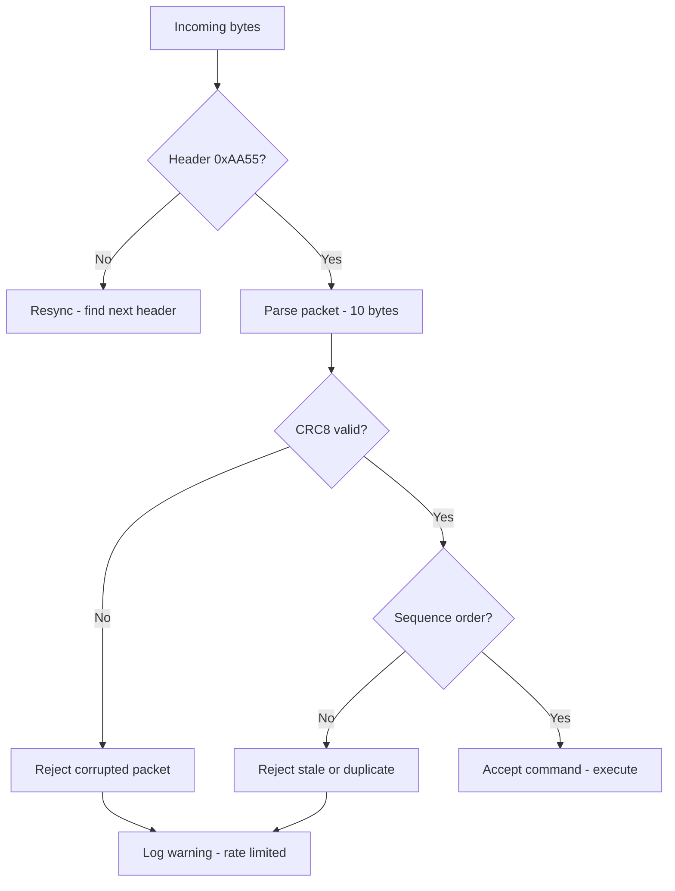
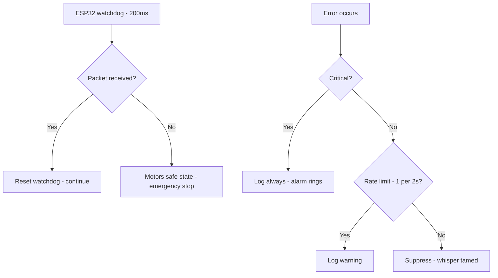
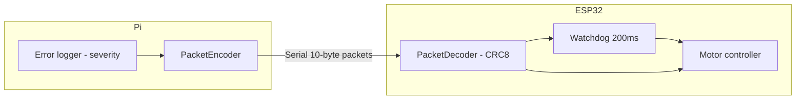

# v8.9 — Rate-limited error logger

| Version | Phase | Days |
|---------|-------|------|
| v8.9 | Advanced Features | Day 232-234 |

## 3. Mission

The v8.9 mission: give the robot a *trusted link and a disciplined log* — the CRC8-verified serial's protocol (the PacketEncoder/PacketDecoder — the packets' integrity — the header's 0xAA55, the footer's 0x0D, the 10-byte packets, the sequence's counter, the commands: the drive's 0x01, the emergency's stop's 0x02, the calibration's 0x03), the ESP32's firmware's watchdog's failsafe (the 200 ms — the motor's safe state at the lost link), and the rate-limited error's logging (the severity's levels — the critical's always, the warnings' 1 per 2 s). The mission's three parts: the *protocol's hardening* (the CRC8's checks — the poly 0x07 — the corruption's detection — the packet's integrity across the link); the *failsafe's trigger* (the ESP32's watchdog — the 200 ms — the link's loss's safe state — the motor's stop — the safety's truth); and the *logging's discipline* (the severity's levels — the fire alarm's principle — the critical's alarm, the warning's whisper — the seed's error's fix). The mission's proof: a corrupted or lost link triggers the failsafe on the ESP32, not just a log on the Pi — the link's trust and the log's signal.

## 4. Engineering context

The robot enters v8.9 with the health's watch (v8.8) but a fragile link and a noisy log: the serial's link (the Pi's ESP32's channel — the drive's commands, the emergency's stops, the calibrations) was unprotected — the corrupted packet (the noise's bit's flip — the checksum's absence — the wrong command's acceptance — the drive's corruption), the lost link (the cable's or the radio's fault — the Pi's silence — the ESP32's blind continuation — the motors' runaway) — the safety's gap; the error's logging was raw — the message's spam (the repeated errors — the transient's storms — the log's flood — the important errors buried under the noise — the diagnosis's slowness). The phase's demands exposed the gap (Day 232-233): the competition's rules (the robot's safe stop at the fault — the referee's expectation — the emergency's response) demand the failsafe at the motor's controller (the ESP32's own watchdog — the link's loss's safe state — not just the Pi's log); the fault's diagnosis (the log's scroll — the important error's find) demands the signal's clarity (the critical's alarm, the warning's whisper). The logger's discipline carried its own failure: the rate-limiting dropped the important errors — the seed's error — the naive cap (the repeated errors' suppression without the severity's distinction — the critical's loss — the fire alarm's silence at the fire).

## 5. Thought process

### 5.1 The link's trust — what the serial's channel must guarantee

The first question: what does the serial's link need to guarantee, mechanically? Three answers, tested against the phase's needs. The *integrity*: the packets' verification (the CRC8's checks — the poly 0x07 — the corruption's detection — the noise's bit's flip's rejection — the wrong command's non-acceptance). The *framing*: the packets' boundaries (the header's 0xAA55, the footer's 0x0D — the 10-byte packets — the sequence's counter — the loss's and the duplication's detection). The *safety*: the link's loss's handling (the ESP32's watchdog — the 200 ms — the lost link's failsafe — the motor's safe state — the emergency's truth at the motor's controller, not just the Pi's log). All three demanded: the encoder/decoder pair (the packets' build and parse), the CRC8's math (the checksum's verification), the watchdog's failsafe (the ESP32's firmware's own safety). The decision: build all three, in the order — the protocol, the failsafe, the logging — the link's trust and the log's discipline in `serial_protocol.py` and `esp32_controller.ino`.

### 5.2 The protocol's hardening — the packets' integrity

The protocol's hardening was the link's backbone: the CRC8-verified packets — the integrity across the noise. The form — `PacketEncoder`/`PacketDecoder` — the encoder's build (the command's and the payload's packing into the 10-byte frame: the header's 0xAA55, the command's byte, the payload's, the CRC8's checksum, the footer's 0x0D), the decoder's parse (the frame's recognition — the header's match, the length's check, the CRC8's verification, the footer's match — the corruption's rejection). The design decisions: the CRC8's choice (the poly 0x07 — the standard's polynomial — the small frame's adequate protection — the bit's flips' detection); the sequence's counter (the packet's ordinal — the loss's and the duplication's detection — the stale's rejection — the replay's absence); and the commands' set (the drive's 0x01 — the steering's and the speed's command; the emergency's stop's 0x02 — the immediate's halt; the calibration's 0x03 — the servo's and the sensor's calibration's trigger). The protocol was the link's trust: the commands' integrity verified at every packet.

### 5.3 The failsafe's trigger — the watchdog's watch

The failsafe was the safety's spine: the ESP32's own watchdog — the link's loss's safe state. The form — the 200 ms's watchdog (the ESP32's firmware's timer — the packets' arrival's reset — the timeout at the link's loss — the motor's safe state's entry — the stop's command's effect) — the failsafe's place: at the motor's controller (the ESP32), not the Pi (the Pi's crash — the link's loss — the ESP32's own watch — the motors' safe stop regardless). The design decisions: the timeout's value (the 200 ms — the command's cadence's window — the normal's flow's margin — the loss's detection's speed — the motors' runaway's window's bound); the safe state's shape (the motors' stop — the servos' neutral — the drive's zero — the robot's halt at the fault); and the recovery's path (the link's return — the packets' resume — the watchdog's reset — the normal's operation's restoration). The failsafe was the safety's truth: the corrupted or lost link's safe stop at the ESP32 — not just the log on the Pi.

### 5.4 The seed's error — the rate-limiting's drop

The seed's error was the phase's anchor: the rate-limiting dropped the important errors. The mechanics: the naive cap (the repeated errors' suppression — the rate's limit applied without the severity's distinction — the counter's exhaust — the critical error's message dropped at the cap — the fire alarm's silence at the fire). The symptoms, from the integration's runs (Day 233): the critical's loss (the emergency's condition's log suppressed by the storm of the warnings — the diagnosis's blindness at the worst moment); the log's false quiet (the cap's silence — the important error's absence — the team's confidence in the clean log — the fault's hidden). The fix's shape, named in the skeleton: *the severity's levels — the critical errors always log, the warnings rate-limited to 1 per 2 s* — the fire alarm's principle — the critical's alarm (the always — the suppression's immunity), the warning's whisper (the cap — the storm's taming — the log's signal). The lesson's shape: *logging is a fire alarm system — not everything is equally loud* — the severity's discipline.

### 5.5 The logging's discipline — the fire alarm's principle

The logging's discipline became the logger's core: the severity's levels — the messages' volume's control with the signals' preservation. The form — the severity's classes (the critical — the fault's and the emergency's conditions; the warning — the anomalies and the transients; the info — the telemetry and the states) — the rate's limiting per class (the critical's always (no cap — the alarm's guarantee), the warnings' 1 per 2 s (the storm's taming — the cap's window), the info's similar's cap). The design decisions: the levels' assignment (the messages' classes — the critical's rarity and importance vs the warning's frequency — the assignments' audit — the misclassifications' cost); the critical's immunity (the always's log — the suppression's absence — the fire alarm's guarantee — the seed's fix's core); and the window's value (the 2 s — the warning's rate — the storm's taming with the information's retention — the log's signal). The discipline's promise: the log's signal (the critical's alarm, the warning's whisper — the diagnosis's speed), the noise's taming (the storm's cap — the log's legibility), and the seed's fix (the severity's distinction).

### 5.6 The link's and the log's integration — the safety's and the diagnosis's truth

The integration decided the phase's value: the link's trust and the log's discipline working together. The design decisions: the failsafe's priority (the link's loss — the ESP32's watchdog — the motors' safe stop — the safety's truth before the logging's — the physical's protection); the logger's channel (the errors' stream — the Pi's console and the file — the v8.8's health's story's depth — the fault's context beyond the LED); and the diagnosis's flow (the critical's alarm at the fault — the hunt's start — the warning's whisper's context — the log's signal's speed). The integration's promise: the corrupted or lost link's failsafe at the ESP32, the log's signal at the fault — the safety's and the diagnosis's truth.

## 6. Decision flowchart

The decoder's decision (the packets' integrity):

The watchdog's and the logger's decisions (the failsafe's and the alarm's truths):

## 7. Implementation blueprint

The blueprint, in the build's order:

1. **The protocol's class** — `serial_protocol.py` — the `PacketEncoder`/`PacketDecoder`: the 10-byte frame's build and parse, the header's 0xAA55, the footer's 0x0D, the CRC8's checksum (the poly 0x07), the sequence's counter.
2. **The commands' set** — the drive's 0x01 (the steering's and the speed's command), the emergency's stop's 0x02, the calibration's 0x03 — the encoder's and the decoder's shared lexicon.
3. **The ESP32's firmware** — `esp32_controller.ino` — the decoder's implementation, the command's execution (the motors' drive, the emergency's stop, the calibration), the watchdog's failsafe (the 200 ms — the packets' arrival's reset — the safe state at the loss).
4. **The rate-limited logger** — the severity's levels (the critical, the warning, the info) — the critical's always, the warnings' 1 per 2 s — the seed's error's fix.
5. **The link's integration** — the Pi's encoder to the ESP32's decoder — the command's flow — the failsafe's priority — the watchdog's watch.
6. **The verification** — the ACs' runs: the integrity (the corrupted packets' rejection), the failsafe (the link's loss — the safe stop's timing), the logging (the critical's always, the warnings' cap).

The blueprint's order follows the dependencies: the protocol's classes first (the frame's and the checksum's homes), the commands' set next, the ESP32's firmware after (the decoder's and the watchdog's implementation), the logger and the integration and the verification last (the discipline, the trust, the proof).

## 8. Architecture flowchart

The link's and the log's architecture:

The diagram is the link's and the log's architecture, complete: the Pi's encoder framing the commands with the CRC8, the ESP32's decoder verifying and executing, the watchdog's failsafe at the link's loss, the logger's severity's discipline feeding the encoder's channel — the link's trust and the log's signal wired into the safety's truth.

---

## 9. Errors, failures, and root-cause analysis

### Error 1: the rate-limiting's drop — the seed's error, the critical's loss

**Symptom.** Day 233, the integration's runs: the rate-limiting *dropped the important errors* — the critical's loss (the emergency's condition's log suppressed by the storm of the warnings — the counter's exhaust — the diagnosis's blindness at the worst moment), the log's false quiet (the cap's silence — the important error's absence — the team's confidence in the clean log — the fault's hidden).

**Initial hypotheses.** We suspected the cap's values. We suspected the counters' logic. We suspected the errors' sources.

**Investigation.** The severity's absence was the diagnosis: the naive cap (the repeated errors' suppression without the severity's distinction — the fire alarm's silence at the fire), and the fix is the severity's discipline — the critical's always (the suppression's immunity — the alarm's guarantee), the warnings' rate-limited (the 1 per 2 s — the storm's taming) (AC4): the seed's error's class — the uniform cap's blindness. The lesson's shape: logging is a fire alarm system — not everything is equally loud.

**Root cause.** The uniform cap: the severity's distinction absent — the critical's suppression — the diagnosis's blindness.

**Fix.** The severity's levels (the shipped logger): the critical errors always log (the alarm's guarantee), the warnings rate-limited to the 1 per 2 s (AC4). The re-test: the storm's injection with the critical's presence — the critical's log at the cap — the signal's truth, the drop's run preserved as the reference.

**Prevention.** The rule became the version's headline: *logging is a fire alarm system — not everything is equally loud — the critical's alarm, the warning's whisper, and the uniform cap is the fire's silence* — the logger's test (AC4) joined the regression, with the drop's run preserved as the reference.

### Error 2: the CRC8's mismatch — the poly's confusion

**Symptom.** Day 232, the protocol's first tests: the CRC8's *checksums never matched* — the encoder's and the decoder's math (the polynomial's variants — the 0x07's interpretation — the init's and the final's XOR's differences — the checksum's mismatch — every packet's rejection), the link's total silence.

**Initial hypotheses.** We suspected the math's implementation. We suspected the polynomial's form. We suspected the frame's layout.

**Investigation.** The variant's consistency was the diagnosis: the CRC8's correctness (the corruption's detection — AC1) depends on the variant's consistency (the polynomial's 0x07, the init's value, the final's XOR, the reflection's flags — the encoder's and the decoder's identical parameters), and the mismatch (the parameters' divergence — the checksum's failure — the all-rejection) is the link's silence: the variant's documentation (the parameters' written form — the encoder's and the decoder's shared constants — the test's vector — AC1) is the protocol's truth. The fix: the parameters' unification (the shared constants — the documented variant — the test's vector's match).

**Root cause.** The parameters' divergence: the encoder's and the decoder's CRC8 variants differ — the checksum's failure — the link's silence.

**Fix.** The variant's unification (the shipped protocol): the shared CRC8 constants (the poly 0x07 — the init's and the final's values — the encoder's and the decoder's identity) (AC1). The re-test: the test's vector's match — the packets' acceptance, the mismatch's counter-case preserved.

**Prevention.** The rule: *the CRC8's truth is the parameters' identity — the variant's divergence is the link's silence, and the shared constants are the match* — the protocol's test (AC1) joined the regression.

### Error 3: the watchdog's false's trip — the timing's mismatch

**Symptom.** Day 233, the drive's runs: the watchdog *tripped falsely* — the 200 ms's timeout vs the command's cadence (the normal's gap — the scheduler's jitter (v8.7) — the command's delay beyond the window — the failsafe's false's entry — the motors' unexpected's stops at the healthy link), the runs' interruptions.

**Initial hypotheses.** We suspected the watchdog's value. We suspected the command's cadence. We suspected the scheduler's jitter.

**Investigation.** The window's calibration was the diagnosis: the watchdog's correctness (the link's loss's safe stop — AC2) depends on the window's margin (the 200 ms vs the command's cadence — the normal's gaps with the scheduler's jitter's headroom — the loss's detection without the false's trips), and the tight window (the cadence's edge — the jitter's trip — the false's stop) is the run's interruption: the calibration (the cadence's measurement — the jitter's bound — the window's margin — the tests at the link's loss and at the healthy's jitter — AC2) is the failsafe's truth. The fix: the window's calibration (the measured cadence + the jitter's bound — the margin's inclusion).

**Root cause.** The window's tightness: the cadence's edge — the jitter's trip — the false's stop.

**Fix.** The window's calibration (the shipped watchdog): the 200 ms's margin vs the command's cadence and the scheduler's jitter (the normal's headroom — the loss's detection) (AC2). The re-test: the healthy's jitter without the trips, the loss's safe stop — the failsafe's truth, the false's trip's counter-case preserved.

**Prevention.** The rule: *the watchdog's window is the cadence's margin — the tight bound is the false's trip, and the calibration is the failsafe's truth* — the watchdog's test (AC2) joined the regression, with the trip's run preserved as the reference.

### Error 4: the sequence's gap — the stale's acceptance

**Symptom.** Day 233, the lossy's tests: the sequence's *gap's handling accepted the stale* — the packets' loss (the radio's drop — the sequence's gap) without the sequence's check (the stale's or the out-of-order's acceptance — the old command's execution — the drive's wrong state at the new's expectation), the control's corruption.

**Initial hypotheses.** We suspected the packets' loss. We suspected the sequence's logic. We suspected the decoder's acceptance.

**Investigation.** The sequence's verification was the diagnosis: the decoder's correctness (the commands' order's truth — AC1) demands the sequence's check (the packet's ordinal — the expected's match — the stale's and the out-of-order's rejection — the gap's handling), and the check's absence (the out-of-order's acceptance — the old command's execution) is the control's corruption: the sequence's test (the gaps' and the reorder's injection — the rejections — AC1) is the protocol's correctness. The fix: the sequence's check (the expected's tracking — the stale's and the duplication's rejection).

**Root cause.** The sequence's check's absence: the out-of-order's acceptance — the old command's execution — the control's corruption.

**Fix.** The sequence's verification (the shipped decoder): the packet's ordinal's check — the expected's match — the stale's and the duplication's rejection (AC1). The re-test: the gaps' and the reorder's injections — the rejections — the commands' truth, the gap's counter-case preserved.

**Prevention.** The rule: *the command's truth is the sequence's verification — the gap's blindness is the stale's execution, and the check is the order's guarantee* — the decoder's test (AC1) joined the regression, with the gap's run preserved as the reference.

### Error 5: the failsafe's recovery's hang — the stuck's safe state

**Symptom.** Day 234, the endurance's runs: the failsafe's *recovery hung* — the link's return without the watchdog's reset's logic (the safe state's persistence — the packets' resume ignored — the motors' stuck's stop — the mission's stall at the healthy's link), the runs' halts.

**Initial hypotheses.** We suspected the recovery's logic. We suspected the watchdog's reset. We suspected the safe state's exit.

**Investigation.** The recovery's path was the diagnosis: the failsafe's completeness (the safe stop at the loss — the normal's restoration at the link's return — AC2) demands the recovery (the packets' resume — the watchdog's reset — the safe state's exit — the motors' restoration), and the hung state (the persistence — the resume's ignore — the stall) is the failsafe's incompleteness: the recovery's test (the loss then the return — the restoration — AC2) is the watchdog's truth. The fix: the recovery's path (the packets' resume's detection — the safe state's exit — the motors' restoration).

**Root cause.** The recovery's absence: the safe state's persistence — the resume's ignore — the mission's stall.

**Fix.** The recovery's path (the shipped failsafe): the packets' resume — the watchdog's reset — the safe state's exit (AC2). The re-test: the loss then the return — the motors' restoration — the failsafe's completeness, the hang's counter-case preserved.

**Prevention.** The rule: *the failsafe is the loop — the recovery's path is the run's continuation, and the hang is the failsafe's incompleteness* — the watchdog's test (AC2) joined the regression, with the hang's run preserved as the reference.

---

## 10. Verification and metrics

**AC1 — the protocol's integrity.** The CRC8-verified packets: the corrupted packets rejected (the header's match, the checksum's verification, the footer's match), the sequence's order enforced — the commands' truth. Passed.

**AC2 — the watchdog's failsafe.** The corrupted or lost link triggers the ESP32's safe state within the 200 ms — the motors' safe stop — not just the Pi's log — the recovery's path. Passed.

**AC3 — the commands' set.** The drive's 0x01, the emergency's stop's 0x02, the calibration's 0x03 — the encoder's and the decoder's shared lexicon verified. Passed.

**AC4 — the logger's discipline.** The critical errors always log, the warnings rate-limited to the 1 per 2 s — the seed's error's fix verified. Passed.

**AC5 — the chain and the phase's regressions.** v6.0-v8.8's suites unchanged, with the protocol's and the logger's truths serving the link's and the log's trust. Passed.

**The phase's provenance.** The measurements on Day 232-234: the test's vectors (the CRC8's variant's match), the cadence's and the jitter's bounds (the watchdog's window's margin), the loss's and the recovery's tests (the failsafe's timing), the storms' injections (the logger's cap's behavior) documented next to the protocol's and the logger's constants.

**Cost.** Runtime: microseconds per packet (the CRC8's computation, the frame's parse). Development: three days, with the errors' lessons (the severity's distinction, the variant's identity, the window's margin, the sequence's check, the recovery's path) now permanent checklist items.

**What we trusted afterwards and what we still distrusted.** We trusted the *link's trust and the log's discipline* completely — the protocol, the failsafe, the logger, each proven by its test. We trusted the ESP32's watchdog as the safety's spine. We still distrusted three things: the *comments' truth* (the code's documentation's freshness — pending the comments' pass); the *coverage's depth* (the tests' breadth — pending the CI's layer); and the *telemetry's richness* (the diagnosis's data beyond the errors — pending the phase's ambitions). Each is a named, written debt — the phase's rule.

---

## 11. Lessons learned — permanent mental models

**Lesson 1 — logging is a fire alarm system: not everything is equally loud.** The seed's lesson: the uniform cap silenced the critical — the diagnosis's blindness. The permanent practice: the severity's levels — the critical's alarm always, the warning's whisper capped.

**Lesson 2 — the CRC8's truth is the parameters' identity.** The variant's divergence silenced the link. The permanent rule: the shared constants — the documented variant — the test's vector's match.

**Lesson 3 — the watchdog's window is the cadence's margin.** The tight bound tripped falsely — the run's interruption. The permanent practice: the calibration — the measured cadence plus the jitter's headroom.

**Lesson 4 — the command's truth is the sequence's verification.** The stale's acceptance corrupted the drive. The permanent model: the ordinal's check — the stale's and the duplication's rejection.

**Lesson 5 — the failsafe is the loop, and the recovery is its completion.** The hung safe state stalled the run. The permanent practice: the resume's detection — the safe state's exit — the motors' restoration.

**Lesson 6 — the safety's truth lives at the motor's controller.** The Pi's log alone cannot stop the robot. The permanent rule: the watchdog at the ESP32 — the link's loss's safe state — the physical's protection first.

---

## 12. Code in this snapshot

`serial_protocol.py`, `esp32_controller.ino`

---

## 13. Bridge to the next version

What v8.9 unlocks is the link's trust and the log's signal: the CRC8-verified serial's protocol (the PacketEncoder/PacketDecoder — the 10-byte frames, the sequence's checks), the ESP32's watchdog's failsafe (the 200 ms — the motors' safe state at the link's loss), the rate-limited error's logger (the severity's levels — the critical's always, the warnings' 1 per 2 s) — the corrupted or lost link's safe stop at the ESP32, the log's signal at the fault. Three capabilities travel forward. First, the protocol's and the logger's truths themselves — the integrity, the failsafe, the severity — the link's and the log's foundations. Second, the *discipline*: the severity's distinction (the fire alarm's principle), the variant's identity (the CRC8's match), the window's margin (the watchdog's calibration), the sequence's verification (the commands' order), the recovery's path (the failsafe's loop) — the phase's quality bar, now complete across the link's and the log's layers. Third, the *trust's pattern*: the verified link with the disciplined log — the pattern the code's documentation (the comments' pass) will complete.

The known debt, stated plainly: the comments' truth (the code's documentation's freshness); the coverage's depth (the tests' breadth); the telemetry's richness (the diagnosis's data); the logger's records (the faults' history's search); and the *code's documentation*: the codebase (the layers 0-10, the protocol's classes, the scheduler, the managers) is uncommented — the modules' logic (the functions' purposes, the constants' meanings, the invariants' forms) unreadable at the first glance, the handoff's and the maintenance's friction (the fresh eyes' and the future selves' comprehension's tax) unaddressed, and the comments' *staleness* (the outdated notes contradicting the code — the false documentation — the readers' misled paths — the trust's erosion) unguarded. The next problem — the one v9.0 (Day 235-237) must attack — is that documentation: *the full code's comments — the pass over the entire codebase (the layers 0-10, the protocol's, the scheduler's, the managers'), the comments' freshness (the writing only after the behaviour's frozen — the seeds' error: the stale comments contradicted the code), the invariants' and the non-obvious' explanations*. The robot is safe and legible; its code must *read as cleanly*. That is the work of the next three days.
