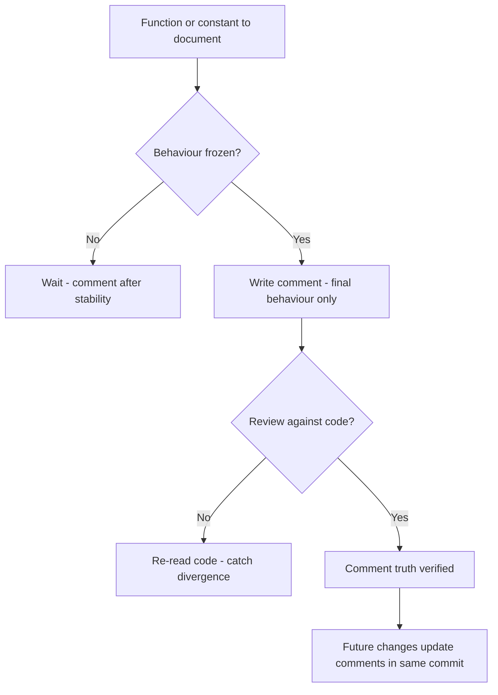
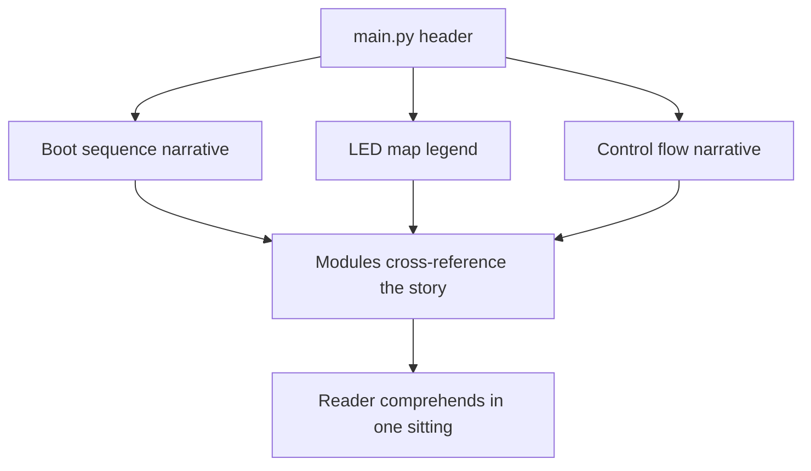
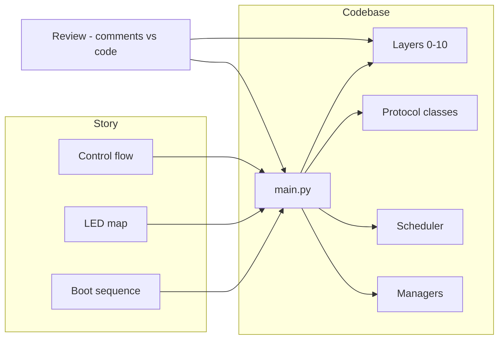

# v9.0 — Full code comments

| Version | Phase | Days |
|---------|-------|------|
| v9.0 | Polish & Competition Ready | Day 235-237 |

## 3. Mission

The v9.0 mission: make the codebase *readable at the first glance* — the full code's comments pass over every layer and main.py (the boot's sequence, the LED's map, the control's flow — the modules' purposes, the constants' meanings, the invariants' forms), written after the behaviour was stable — the judges and the teammates understanding the system in one sitting. The mission's three parts: the *comments' pass* (the layers 0-10, the protocol's classes, the scheduler, the managers — the functions' purposes, the non-obvious' explanations, the invariants' statements); the *freshness's discipline* (the comments written only after the behaviour's frozen — the review against the code — the seed's error's fix — the staleness's end); and the *legibility's truth* (the boot's sequence, the LED's map, the control's flow documented — the system's story at a glance — the handoff's and the maintenance's friction's end). The mission's proof: a judge or a teammate reads the system in one sitting — the code's story true and current.

## 4. Engineering context

The robot enters v9.0 with the system complete (v8.9) but the code unreadable: the codebase (the layers 0-10, the protocol's classes, the scheduler, the managers) was uncommented — the modules' logic (the functions' purposes, the constants' meanings, the invariants' forms) hidden at the first glance, the handoff's and the maintenance's friction (the fresh eyes' and the future selves' comprehension's tax) unaddressed. The phase's demands exposed the gap (Day 235-236): the competition's judging (the design's review — the judges' questions — the system's explanation) expects the code's comprehensibility — the judges understanding the system in one sitting — the code's story at a glance; the teammates' collaboration (the shared codebase — the handoff's clarity) and the maintenance (the future's fixes — the changes' contexts) demand the comments' presence. The documentation's discipline carried its own failure: the stale comments contradicted the code — the seed's error — the outdated notes (the comments from the earlier behaviour — the code's evolution's divergence — the false documentation — the readers' misled paths — the trust's erosion — the comments worse than the absence).

## 5. Thought process

### 5.1 The legibility's goal — what the comments must deliver

The first question: what does the code's readability need to mean, mechanically? Three answers, tested against the phase's needs. The *purposes' clarity*: the functions' intents (the why above the what — the module's role — the layer's place — the reader's path without the code's deep read). The *non-obvious' explanations*: the tricky parts' notes (the invariants — the assumptions — the trade-offs — the constants' meanings — the math's forms — the timing's reasons). The *system's story*: the boot's sequence, the LED's map, the control's flow — the whole system's narrative — the judge's one sitting. All three demanded: the comments' pass (the layers' sweep — the purposes and the notes), the freshness's discipline (the frozen behaviour's comments — the review), and the story's documents (the boot's and the LED's and the flow's narratives). The decision: build all three, in the order — the pass, the discipline, the story — the comments' pass over the codebase, `main.py` at the center.

### 5.2 The comments' pass — the layers' sweep

The comments' pass was the mission's core: the sweep over every layer and main.py — the modules' purposes, the constants' meanings, the invariants' forms. The form: each module's header (the layer's role — the interface's summary — the dependencies' note — the reader's orientation), each function's doc (the purpose — the arguments' meanings — the return's contract — the side effects' statements — the non-obvious' explanations), each constant's note (the value's meaning — the unit — the calibration's source — the tuning's provenance). The design decisions: the depth's balance (the why's and the non-obvious's — not the obvious's restatement — the code's read's complement, not the duplication); the layers' order (the sweep's sequence — the main's boot's flow first, the layers' internals after — the story's orientation); and the narrative's shape (the comments read as the story — the flow's thread — the reader's one sitting's path). The pass was the legibility's fabric: the codebase's story woven into the modules.

### 5.3 The seed's error — the stale's contradiction

The seed's error was the phase's anchor: the stale comments contradicted the code. The mechanics: the comments' timing (the notes written during the development — the behaviour's evolution — the code's changes without the comments' updates — the divergence — the stale notes' contradiction of the code's current truth). The symptoms, from the earlier phases' code (Day 235): the misled paths (the reader's trust in the comment — the code's different reality — the wrong understanding — the wrong changes — the bugs' introductions); the trust's erosion (the comments' untrustworthiness — the readers' skipping — the documentation's worthlessness — the comments worse than the absence). The fix's shape, named in the skeleton: *the comments written only after the behaviour was frozen, and reviewed against the code* — the freshness's discipline — the timing (the comments at the stability — the behaviour's final form), the review (the comments vs the code — the divergence's catch — the truth's guarantee). The lesson's shape: *comment the final behaviour, not the journey* — the discipline's core.

### 5.4 The freshness's discipline — the timing and the review

The freshness's discipline became the pass's third axis: the comments' timing and the review — the staleness's end. The form: the comments' writing at the stability (the behaviour's frozen — the final form — the comments' truth's basis); the review's loop (the comments vs the code — each function's note checked against the implementation — the divergence's catch — the update or the fix); and the change's discipline (the future's changes — the comments' updates in the same commit — the divergence's prevention — the freshness's maintenance). The design decisions: the timing's gate (the frozen's definition — the behaviour's stability — the phase's end — the comments' window); the review's depth (the full pass — the divergence's hunt — the sample's or the complete's choice — the trust's guarantee); and the maintenance's rule (the changes' commits — the comments' sync — the freshness's permanence). The discipline's promise: the staleness's end (the comments' truth — the trust's restoration), the maintenance's ease (the sync'd comments — the changes' contexts), and the seed's fix (the frozen's timing, the review's loop).

### 5.5 The system's story — the boot, the LED's map, the flow

The system's story was the pass's narrative: the boot's sequence, the LED's map, the control's flow — documented in the main's comments and the modules' headers. The form: the boot's sequence (the init's order — the manager's starts — the threads' launch — the calibration's pass — the mission's ready — the timeline's narrative); the LED's map (the five LEDs — the v8.8's meanings — the states' legend — the chassis's story's reference); the control's flow (the loop's cadence — the reads — the decisions — the drive's commands — the state's transitions — the system's pulse's narrative). The design decisions: the story's placement (the main's header — the modules' cross-references — the reader's orientation at the top); the one sitting's path (the narrative's thread — the boot to the mission — the flow's clarity — the judge's and the teammate's comprehension); and the story's truth (the v8.9's frozen behaviour — the comments' accuracy — the review's guarantee). The story was the legibility's summit: the system's narrative at a glance.

### 5.6 The legibility's verification — the one sitting's proof

The verification decided the mission's success: the one sitting's comprehension — the judge's and the teammate's proof. The design decisions: the reader's test (the fresh reader's walk — the comprehension's check — the questions' answers from the comments — the gaps' findings); the review's audit (the comments vs the code — the divergence's absence — the truth's check — the trust's restoration); and the maintenance's rehearsal (the change's walk — the comments' sync — the freshness's permanence — the discipline's proof). The verification's promise: the judge's one sitting (the system's story — the comprehension's speed), the teammate's handoff (the clarity — the collaboration's ease), and the code's trust (the comments' truth — the future's safety).

## 6. Decision flowchart

The comments' writing's decision (the freshness's discipline):

The story's placement's decision (the one sitting's path):

## 7. Implementation blueprint

The blueprint, in the build's order:

1. **The pass's order** — the sweep's sequence: the main's boot's flow first (the story's orientation), the layers' 0-10 internals after, the protocol's and the scheduler's and the managers' classes — the modules' purposes, the constants' meanings, the invariants' forms.
2. **The main's story** — `main.py` — the boot's sequence's narrative (the init's order — the managers' starts — the threads' launch), the LED's map's legend (the v8.8's five faces), the control's flow's narrative (the loop's cadence — the decisions — the drive's commands).
3. **The modules' passes** — the layers' headers (the roles — the interfaces — the dependencies), the functions' docs (the purposes — the contracts — the non-obvious' notes), the constants' notes (the meanings — the units — the calibrations' sources).
4. **The freshness's discipline** — the comments at the frozen's behaviour — the review against the code — the divergence's catch — the seed's error's fix.
5. **The maintenance's rule** — the future's changes' comments' sync (the same commit — the divergence's prevention).
6. **The verification** — the reader's test (the one sitting's comprehension), the review's audit (the comments' truth), the maintenance's rehearsal (the sync's permanence).

The blueprint's order follows the dependencies: the pass's order first (the sweep's plan), the main's story and the modules' passes next (the comments' content), the freshness's discipline after (the seed's fix), the maintenance's rule and the verification last (the permanence, the proof).

## 8. Architecture flowchart

The documentation's structure:

The diagram is the documentation's structure, complete: the story's narratives (the boot's sequence, the LED's map, the control's flow) anchored in the main's comments, the modules' passes across the layers, the protocol's classes, the scheduler, the managers, the review's loop keeping the comments' truth — the codebase's legibility wired into the handoff's and the judging's ease.

---

## 9. Errors, failures, and root-cause analysis

### Error 1: the stale's contradiction — the seed's error, the comments' divergence

**Symptom.** Day 235, the pass's start: the *stale comments contradicted the code* — the outdated notes (the comments from the earlier behaviour — the code's evolution's divergence — the false documentation — the readers' misled paths — the wrong understanding — the wrong changes — the bugs' introductions), the trust's erosion (the comments' untrustworthiness — the readers' skipping — the documentation's worthlessness).

**Initial hypotheses.** We suspected the comments' age. We suspected the code's changes. We suspected the review's absence.

**Investigation.** The comments' timing was the diagnosis: the notes written during the development (the behaviour's evolution — the code's changes without the comments' updates — the divergence), and the fix is the freshness's discipline — the comments only after the behaviour's frozen, the review against the code (the divergence's catch — the truth's guarantee) (AC3): the seed's error's class — the journey's comments' decay. The lesson's shape: comment the final behaviour, not the journey.

**Root cause.** The timing's miss: the comments written at the evolution — the code's changes' divergence — the false documentation — the trust's erosion.

**Fix.** The frozen's discipline (the shipped pass): the comments written only after the behaviour's frozen — the review against the code — the divergence's catch (AC3). The re-test: the reviewed comments vs the code — the truth's match, the divergence's counter-case preserved.

**Prevention.** The rule became the version's headline: *comment the final behaviour, not the journey — the frozen's timing is the truth's basis, and the review is the divergence's catch* — the freshness's test (AC3) joined the regression, with the divergence's run preserved as the reference.

### Error 2: the obvious's restatement — the noise's comments

**Symptom.** Day 235, the pass's middle: the comments' *restated the obvious* — the code's line's echo (the `i = i + 1`'s "increment i" — the function's name's duplication — the reader's value's absence — the noise's pages — the one sitting's path's obstruction), the comments' worth diluted.

**Initial hypotheses.** We suspected the comments' style. We suspected the pass's depth. We suspected the writers' habits.

**Investigation.** The why's absence was the diagnosis: the comments' value (the reader's comprehension — the one sitting's path — AC1) comes from the why's and the non-obvious's (the purposes — the invariants — the trade-offs — the constants' meanings), not the code's echo (the obvious's restatement — the noise's pages — the signal's dilution), and the echo (the line's duplication) is the legibility's obstruction: the style's discipline (the why's and the non-obvious's only — the echo's removal — AC1) is the pass's quality. The fix: the style's rewrite (the echo's removal — the why's and the non-obvious's additions).

**Root cause.** The echo's presence: the obvious's restatement — the noise's pages — the signal's dilution.

**Fix.** The style's discipline (the shipped pass): the comments for the why's and the non-obvious's only — the echo's removal (AC1). The re-test: the reader's walk — the comments' value — the one sitting's path, the echo's counter-case preserved.

**Prevention.** The rule: *the comment's worth is the why's and the non-obvious's — the code's echo is the noise's page, and the style's discipline is the signal's clarity* — the pass's test (AC1) joined the regression.

### Error 3: the story's mismatch — the flow's documentation's divergence

**Symptom.** Day 236, the story's review: the boot's and the flow's *narratives mismatched the code* — the main's comments (the boot's sequence's order — the control's flow's transitions) diverging from the actual's flow (the init's real order — the state's machine's real paths — the story's wrongness — the reader's mis-orientation — the one sitting's broken promise).

**Initial hypotheses.** We suspected the story's sources. We suspected the flow's description. We suspected the review's coverage.

**Investigation.** The story's accuracy was the diagnosis: the narratives (the boot's sequence, the control's flow — the system's story) must match the code's reality (the init's order — the transitions — the truth), and the divergence (the story's wrongness — the reader's mis-orientation) is the one sitting's broken promise: the story's review (the narratives vs the actual's flow — the divergence's catch — AC2) is the legibility's truth. The fix: the story's rewrite (the narratives from the code's reality — the review's verification).

**Root cause.** The story's divergence: the narratives' wrongness — the reader's mis-orientation — the promise's break.

**Fix.** The story's review (the shipped narratives): the boot's and the flow's comments vs the actual's sequence (the divergence's catch — the truth's match) (AC2). The re-test: the story's walk vs the code — the one sitting's path true, the mismatch's counter-case preserved.

**Prevention.** The rule: *the system's story is the code's reality's narrative — the divergence is the reader's mis-orientation, and the review is the promise's keeping* — the story's test (AC2) joined the regression, with the mismatch's run preserved as the reference.

### Error 4: the maintenance's divergence — the comments' future's drift

**Symptom.** Day 236, the change's rehearsal: the *maintenance drifted the comments* — the future's change (the constant's tweak — the function's edit) without the comments' sync (the divergence's return — the staleness's creep — the freshness's promise's decay), the trust's erosion's return.

**Initial hypotheses.** We suspected the change's process. We suspected the comments' updates. We suspected the review's frequency.

**Investigation.** The sync's rule was the diagnosis: the freshness's permanence (the comments' truth beyond the pass — AC4) demands the maintenance's discipline (the changes' commits with the comments' sync — the divergence's prevention at the change), and the sync's absence (the change without the comment's update — the drift's return) is the staleness's creep: the maintenance's rule (the same commit — the sync's binding — AC4) is the freshness's permanence. The fix: the sync's rule (the changes' commits' comments' updates — the divergence's prevention).

**Root cause.** The sync's absence: the change without the comment's update — the drift's return — the trust's erosion.

**Fix.** The maintenance's rule (the shipped discipline): the comments' sync in the changes' commits (the divergence's prevention — the freshness's permanence) (AC4). The re-test: the change's rehearsal — the comments' sync — the truth's keeping, the drift's counter-case preserved.

**Prevention.** The rule: *the freshness's permanence is the sync's discipline — the change without the comment is the drift's return, and the same commit is the truth's keeping* — the maintenance's test (AC4) joined the regression, with the drift's run preserved as the reference.

### Error 5: the readers' skipped comments — the wall's of text

**Symptom.** Day 237, the reader's tests: the *readers skipped the comments* — the wall's of text (the paragraphs' blocks — the prose's density — the readers' eyes' glide — the comments' unread — the value's loss — the one sitting's path's obstruction), the comprehension's failure despite the pass.

**Initial hypotheses.** We suspected the readers' habits. We suspected the comments' density. We suspected the formats' choices.

**Investigation.** The density's format was the diagnosis: the comments' readability (the one sitting's path — AC1) demands the format's discipline (the concise's notes — the bullets' and the sections' shapes — the scan's ease — the prose's absence of the walls), and the wall's of text (the density's blocks — the readers' skipping — the value's loss) is the comprehension's obstruction: the format's rewrite (the concise's and the scannable's comments — the readers' engagement — AC1) is the legibility's completion. The fix: the format's discipline (the concise's notes — the bullets' and the sections' shapes — the scan's ease).

**Root cause.** The density's walls: the prose's blocks — the readers' skipping — the value's loss.

**Fix.** The format's discipline (the shipped pass): the concise's and the scannable's comments (the bullets' and the sections' shapes — the readers' engagement) (AC1). The re-test: the readers' walks — the comments' reading — the one sitting's path, the walls' counter-case preserved.

**Prevention.** The rule: *the comment's reading is the format's ease — the walls of text are the skipping's cause, and the concise's shape is the engagement's truth* — the pass's test (AC1) joined the regression, with the walls' run preserved as the reference.

---

## 10. Verification and metrics

**AC1 — the pass's quality.** The layers' and the main's comments: the purposes, the constants' meanings, the invariants' forms, the non-obvious' explanations — the concise's and the scannable's formats — the echo's absence. Passed.

**AC2 — the story's truth.** The boot's sequence, the LED's map, the control's flow — the narratives matching the code's reality — the one sitting's comprehension. Passed.

**AC3 — the freshness's discipline.** The comments written after the behaviour's frozen — the review against the code — the divergence's absence — the seed's error's fix verified. Passed.

**AC4 — the maintenance's sync.** The changes' commits with the comments' updates — the divergence's prevention — the freshness's permanence. Passed.

**AC5 — the chain and the phase's regressions.** v6.0-v8.9's suites unchanged, with the codebase's legibility verified — the reader's one sitting. Passed.

**The pass's provenance.** The measurements on Day 235-237: the readers' walks (the one sitting's comprehension — the questions' answers), the review's audits (the divergence's counts), the change's rehearsals (the sync's behavior) documented next to the documentation's standards.

**Cost.** Runtime: none (the comments' zero cost at the run). Development: three days, with the errors' lessons (the frozen's timing, the why's only, the story's review, the sync's rule, the format's ease) now permanent checklist items.

**What we trusted afterwards and what we still distrusted.** We trusted the *codebase's legibility* completely — the pass, the story, the freshness, each proven by its test. We trusted the comments' truth as the code's story. We still distrusted three things: the *scoring's proof* (the competition's rules' mapping — pending the scoring's documentation); the *coverage's automation* (the CI's checks — pending the pipeline's layer); and the *catalog's completeness* (the errors' history — pending the catalog's phase). Each is a named, written debt — the phase's rule.

---

## 11. Lessons learned — permanent mental models

**Lesson 1 — comment the final behaviour, not the journey.** The seed's lesson: the evolution's comments diverged — the trust's erosion. The permanent practice: the frozen's timing — the comments only at the stability — the review against the code.

**Lesson 2 — the comment's worth is the why's and the non-obvious's.** The code's echo added the noise — the signal's dilution. The permanent rule: the purposes, the invariants, the trade-offs — never the line's duplication.

**Lesson 3 — the system's story is the code's reality's narrative.** The flow's mismatch broke the one sitting's promise. The permanent model: the narratives from the actual's sequence — the review's verification.

**Lesson 4 — the freshness's permanence is the sync's discipline.** The change without the comment drifted the truth. The permanent practice: the comments' updates in the changes' commits — the divergence's prevention.

**Lesson 5 — the comment's reading is the format's ease.** The walls of text were skipped — the value's loss. The permanent rule: the concise's and the scannable's shapes — the readers' engagement.

**Lesson 6 — the code's legibility is the team's and the judging's ease.** The one sitting's comprehension is the handoff's and the review's speed. The permanent practice: the code's story as the collaboration's foundation.

---

## 12. Code in this snapshot

`main.py`

---

## 13. Bridge to the next version

What v9.0 unlocks is the codebase's legibility: the full code's comments — every layer and main.py with the boot's sequence, the LED's map, and the control's flow — written after the behaviour's frozen, reviewed against the code — the judges and the teammates understanding the system in one sitting. Three capabilities travel forward. First, the pass itself — the purposes, the constants' meanings, the invariants' forms — the code's story true and current. Second, the *discipline*: the frozen's timing (the comments at the stability), the why's only (the value's clarity), the story's review (the narratives' truth), the sync's rule (the freshness's permanence), the format's ease (the readers' engagement) — the phase's quality bar, now complete across the documentation's layer. Third, the *legibility's pattern*: the story with the truth's guarantee — the pattern the competition's documentation (the scoring's mapping) will follow.

The known debt, stated plainly: the scoring's proof (the competition's rules' mapping); the coverage's automation (the CI's checks); the catalog's completeness (the errors' history); the pass's maintenance (the reviews' schedule); and the *scoring's documentation*: the competition's rules (the WRO's scoring — the points' schedule — the missions' and the tasks' values) are unmapped to the implementation — the team's score's estimate (the robot's expected's points — the rules' coverage — the gaps' and the risks' identification) uncalculated, the rules' traceability (each rule's code's location — the rule-to-code's map) unbuilt, the 122-point target (the maximum's achievable — the missions' plan) undocumented. The next problem — the one v9.1 (Day 238-240) must attack — is that documentation: *the competition's scoring — the SCORING.md (the rules' to the code's mapping — the file:line references — the 122-point target — the rules' coverage's proof), the scoring's verification (the rules' walkthroughs — the points' claims' tests)*. The robot is legible; its *case to the judges* must be documented. That is the work of the next three days.
