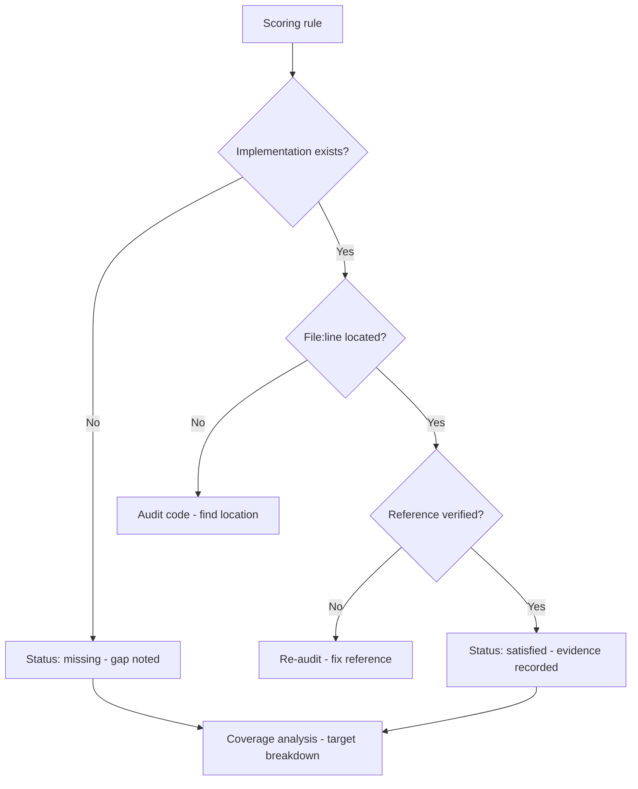
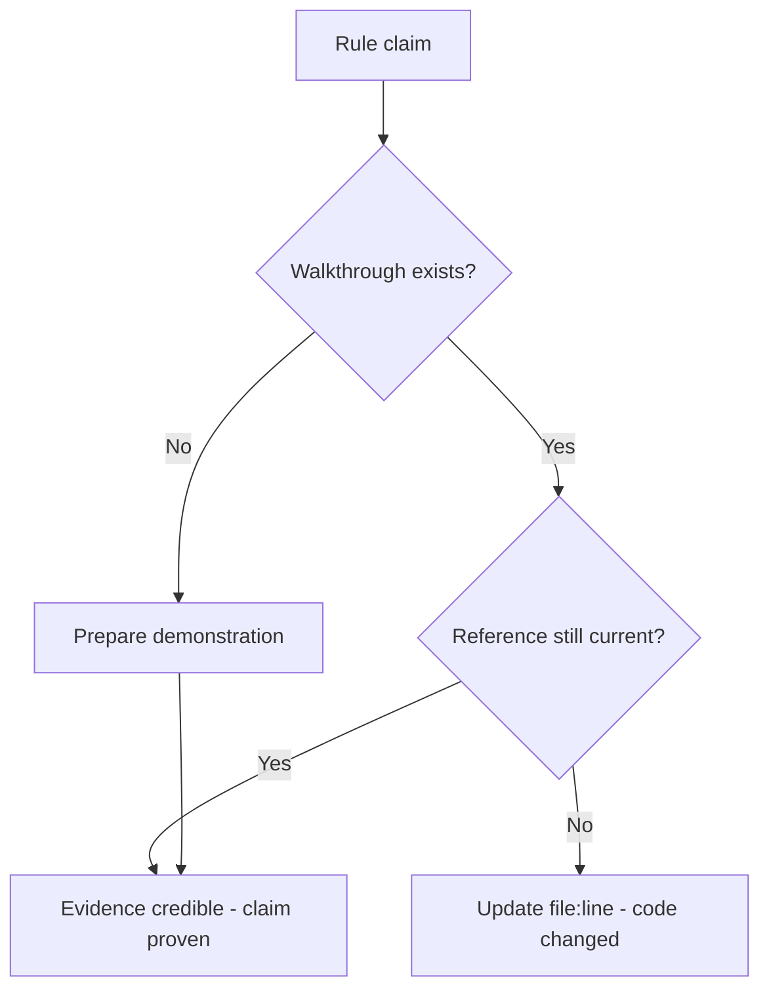
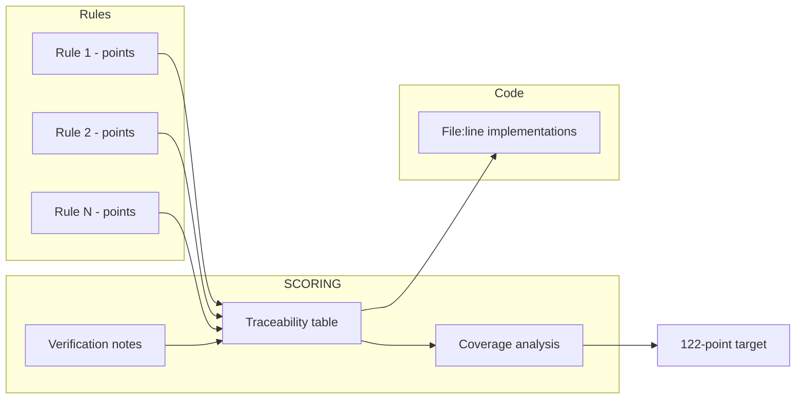

# v9.1 — Competition scoring documentation

| Version | Phase | Days |
|---------|-------|------|
| v9.1 | Polish & Competition Ready | Day 238-240 |

## 3. Mission

The v9.1 mission: give the team *evidence, not claims* — the competition's scoring's documentation — the SCORING.md mapping every scoring rule to its implementing file:line — the team proving the robot satisfies the rules — the 122-point target credible with the evidence. The mission's three parts: the *rules' mapping* (each scoring rule's implementing code's location — the file:line references — the rule-to-code's map — the traceability's proof); the *coverage's analysis* (the rules' coverage — the points' schedule — the robot's expected's points — the gaps' and the risks' identification — the 122-point target's breakdown); and the *evidence's discipline* (the claims' verification — the walkthroughs — the file:line references' accuracy — the seed's error's fix — the claims without the evidence's end). The mission's proof: a team that can show the judges the robot's satisfaction of each rule — the evidence's pages, the target's credibility.

## 4. Engineering context

The robot enters v9.1 with the code's legibility (v9.0) but the competition's case undocumented: the competition's rules (the WRO's scoring — the points' schedule — the missions' and the tasks' values) were unmapped to the implementation — the team's score's estimate (the robot's expected's points — the rules' coverage — the gaps' and the risks' identification) uncalculated, the rules' traceability (each rule's code's location) unbuilt, the 122-point target undocumented. The phase's demands exposed the gap (Day 238-239): the competition's review (the judges' scrutiny — the rules' satisfaction's questions) expects the evidence (the rule's implementation's location — the proof's pages — not the claims); the team's planning (the target's credibility — the gaps' focus — the practice's priorities) demands the analysis (the points' schedule — the coverage's map). The documentation's discipline carried its own failure: the claims without the evidence (the rule names in the comments only — the assertions unlinked — the review's questions unanswered — the credibility's absence) — the seed's error, the reason the earlier attempts at the rule's mapping failed to convince.

## 5. Thought process

### 5.1 The evidence's goal — what the scoring's documentation must deliver

The first question: what does the scoring's documentation need to prove, mechanically? Three answers, tested against the phase's needs. The *traceability*: each rule's implementing location (the file:line references — the rule's code's home — the judge's verification's path). The *coverage*: the rules' map (the points' schedule — the satisfied and the partial and the missing — the gaps' and the risks' view — the target's breakdown). The *credibility*: the evidence's pages (the walkthroughs — the claims' verifications — the references' accuracy — the target's believability). All three demanded: the SCORING.md (the rules' table — the references — the coverage's analysis), the walkthroughs (the rules' satisfaction's proofs), and the audit (the references' accuracy). The decision: build all three, in the order — the mapping, the analysis, the verification — the evidence's document, `SCORING.md`.

### 5.2 The rules' mapping — the traceability's table

The rules' mapping was the document's core: each scoring rule's implementing file:line — the rule-to-code's map. The form — the SCORING.md's table: the rule (the WRO's rule's identifier — the points' value — the task's description), the implementation (the file:line — the code's home — the function's and the class's names), the status (the satisfied, the partial, the missing — the evidence's claim). The design decisions: the rule's granularity (each scoring element's row — the points' schedule's resolution — the claims' precision); the reference's form (the file:line — the reader's and the judge's jump — the verification's path — the v9.0's legibility's complement); and the table's completeness (every rule's row — the coverage's totality — the gaps' visibility). The mapping was the evidence's skeleton: the rules' traceability's table.

### 5.3 The coverage's analysis — the target's breakdown

The coverage's analysis was the document's substance: the points' schedule — the robot's expected's points — the target's credibility. The form: the satisfied rules' points summed (the robot's expected's score — the 122-point target's breakdown — the points' provenance), the partials' and the missing's rows (the gaps' and the risks' identification — the points' at risk — the practice's and the fixes' priorities). The design decisions: the target's calculation (the satisfied's sum vs the 122-point target — the gap's size — the risks' weights); the risks' view (the partials' and the missing's lists — the mitigations' notes — the practice's focus); and the coverage's honesty (the partials' claims' labels — the false satisfaction's absence — the credibility's foundation). The analysis was the evidence's argument: the target's breakdown, the risks' visibility.

### 5.4 The seed's error — the claims without the evidence

The seed's error was the phase's anchor: the claims without the evidence — the rule names in the comments only. The mechanics: the assertions' unlink (the rule's name noted in the comments — the implementation's location ungiven — the claim's proof absent — the judge's and the team's verification impossible — the credibility's absence). The symptoms, from the earlier attempts (Day 238): the review's questions unanswered (the rule's satisfaction's claim — the "where?" — the silence — the credibility's loss); the target's weakness (the 122-point target's assertion without the breakdown — the plan's unbelievability). The fix's shape, named in the skeleton: *the SCORING.md with the rule → file:line references* — the evidence's form — each rule's implementation's location — the verification's path — the claim's proof. The lesson's shape: *docs with file:line references are the only docs that get read* — the evidence's discipline.

### 5.5 The verification — the references' accuracy

The verification became the document's third axis: the file:line references' accuracy — the claims' truths. The form: the references' audit (each rule's file:line checked against the code — the location's accuracy — the v9.0's review's pattern); the walkthroughs (the rules' satisfaction's proofs — the judge's path — the scenario's runs — the points' claims' demonstrations); and the update's rule (the code's changes — the references' updates — the v9.0's sync's discipline — the evidence's freshness). The design decisions: the audit's depth (the full pass — the references' correctness — the stale's absence); the walkthroughs' scope (the critical's rules — the big points' proofs — the demonstration's readiness); and the evidence's maintenance (the changes' sync — the freshness's permanence). The verification's promise: the references' truth (the judge's jump lands on the code), the claims' proofs (the walkthroughs' demonstrations), and the seed's fix (the evidence's form).

### 5.6 The evidence's use — the judge's and the team's paths

The integration decided the document's value: the evidence's paths for the judge and the team. The design decisions: the judge's path (the rule's question — the table's jump — the code's verification — the satisfaction's proof — the review's speed); the team's path (the target's breakdown — the gaps' and the risks' focus — the practice's priorities — the fixes' sequence); and the evidence's place (the SCORING.md at the repo's root — the handoff's and the review's reference — the v9.0's story's complement). The integration's promise: the 122-point target credible with the evidence — the rules' satisfaction's proof at the ready.

## 6. Decision flowchart

The rules' mapping's decision (the evidence's form):

The verification's decision (the claims' truth):

## 7. Implementation blueprint

The blueprint, in the build's order:

1. **The rules' list** — the WRO's scoring's rules' inventory (the identifier — the points' value — the task's description) — the coverage's totality.
2. **The mapping's table** — the SCORING.md's core: each rule's implementing file:line (the code's home — the function's and the class's names), the status (the satisfied, the partial, the missing).
3. **The coverage's analysis** — the satisfied's points' sum (the robot's expected's score — the 122-point target's breakdown), the partials' and the missing's risks (the points' at risk — the mitigations' notes — the practice's priorities).
4. **The verification** — the references' audit (the file:line's accuracy against the code), the walkthroughs (the rules' satisfaction's proofs — the critical's rules' demonstrations).
5. **The evidence's maintenance** — the code's changes' references' updates (the v9.0's sync's discipline — the freshness's permanence).
6. **The verification's runs** — the ACs' checks: the mapping's completeness, the references' accuracy, the target's credibility.

The blueprint's order follows the dependencies: the rules' list first (the coverage's totality), the mapping's table next (the evidence's core), the coverage's analysis after (the target's breakdown), the verification and the maintenance and the runs last (the truths, the freshness, the proof).

## 8. Architecture flowchart

The scoring's documentation's structure:

The diagram is the scoring's documentation's structure, complete: the rules' inventory flowing into the traceability's table, the table's references into the code's locations, the coverage's analysis into the 122-point target's breakdown, the verification's notes keeping the references' truth — the evidence's pages wired into the judges' and the team's paths.

---

## 9. Errors, failures, and root-cause analysis

### Error 1: the claims without the evidence — the seed's error, the unlinked assertions

**Symptom.** Day 238, the review's rehearsals: the *claims without the evidence* — the rule names in the comments only (the assertions unlinked — the implementation's locations ungiven — the verification's impossibility — the review's questions unanswered — the credibility's absence), the target's weakness (the 122-point target's assertion without the breakdown — the plan's unbelievability).

**Initial hypotheses.** We suspected the comments' content. We suspected the rules' mapping. We suspected the review's expectations.

**Investigation.** The evidence's form was the diagnosis: the rule's satisfaction's claim (the assertion) needs the evidence (the implementation's location — the verification's path), and the unlinked claim (the comments' name only — the "where?" unanswered) is the credibility's loss: the fix's form — the SCORING.md with the rule → file:line references (the evidence's table — the verification's path — the claim's proof) (AC2). The lesson's shape: docs with file:line references are the only docs that get read.

**Root cause.** The evidence's absence: the assertions unlinked — the verification's impossibility — the credibility's loss.

**Fix.** The SCORING.md's mapping (the shipped document): each rule's implementing file:line — the rule-to-code's map — the verification's path (AC2). The re-test: the review's walkthrough — the references' jumps — the claims' proofs, the silence's counter-case preserved.

**Prevention.** The rule became the version's headline: *docs with file:line references are the only docs that get read — the claim's proof is the location, and the unlinked assertion is the credibility's loss* — the mapping's test (AC2) joined the regression, with the unlinked's run preserved as the reference.

### Error 2: the reference's staleness — the code's change's drift

**Symptom.** Day 239, the audit's start: the *references drifted* — the file:line's locations (the v9.0's code's change — the line's shifts — the function's moves) stale against the current's code (the judge's jump lands wrong — the verification's failure — the evidence's untrustworthiness), the credibility's erosion.

**Initial hypotheses.** We suspected the code's changes. We suspected the references' maintenance. We suspected the audit's frequency.

**Investigation.** The audit's discipline was the diagnosis: the references' truth (the judge's jump's landing — the verification's success — AC3) demands the audit (the file:line's checks against the code — the changes' detection — the updates' application), and the drift (the stale's locations — the wrong lands) is the evidence's untrustworthiness: the maintenance's rule (the code's changes with the references' updates — the v9.0's sync's pattern — AC3) is the evidence's freshness. The fix: the audit's loop (the references' verification — the changes' sync — the freshness's permanence).

**Root cause.** The reference's drift: the code's changes without the updates — the wrong lands — the evidence's erosion.

**Fix.** The audit's discipline (the shipped document): the references' verification against the code — the changes' sync (AC3). The re-test: the code's change then the audit — the references' currentness — the jumps' truth, the drift's counter-case preserved.

**Prevention.** The rule: *the reference's truth is the audit's discipline — the code's drift is the evidence's erosion, and the sync is the jump's landing* — the audit's test (AC3) joined the regression, with the drift's run preserved as the reference.

### Error 3: the coverage's inflation — the partial's counted as the satisfied

**Symptom.** Day 239, the target's calculation: the coverage's *analysis inflated the score* — the partial's implementation (the rule's partial's satisfaction — the condition's half — the points' partial's claim) counted as the full's points (the target's inflation — the plan's false confidence — the review's reveal — the credibility's damage), the breakdown's wrongness.

**Initial hypotheses.** We suspected the statuses' labels. We suspected the points' sums. We suspected the rules' readings.

**Investigation.** The statuses' honesty was the diagnosis: the coverage's credibility (the target's believability — AC4) demands the statuses' truth (the satisfied, the partial, the missing — the partial's partial points — the honest labels), and the inflation (the partial as the satisfied — the false sums — the plan's false confidence) is the credibility's damage: the statuses' audit (the rules' readings — the partials' verifications — the honest points — AC4) is the analysis's truth. The fix: the statuses' correction (the partials' honest labels — the points' recalculation — the target's truth).

**Root cause.** The inflation's labeling: the partial's counted as the satisfied — the false sums — the credibility's damage.

**Fix.** The statuses' honesty (the shipped analysis): the partial's partial points — the missing's zero — the satisfied's full — the honest breakdown (AC4). The re-test: the target's recalculation — the points' truths — the plan's credibility, the inflation's counter-case preserved.

**Prevention.** The rule: *the coverage's credibility is the statuses' honesty — the inflation is the credibility's damage, and the partial's truth is the plan's foundation* — the analysis's test (AC4) joined the regression, with the inflation's run preserved as the reference.

### Error 4: the walkthrough's absence — the claim's demonstration's gap

**Symptom.** Day 240, the judges' rehearsal: the *walkthroughs were missing* — the critical's rules' claims (the big points' satisfaction — the demonstration's absence — the judge's question — the silent claim — the evidence's incompleteness), the review's flow's stumbles.

**Initial hypotheses.** We suspected the walkthroughs' scope. We suspected the claims' readiness. We suspected the review's expectations.

**Investigation.** The demonstration's proof was the diagnosis: the evidence's completeness (the judge's satisfaction — AC5) demands the walkthroughs (the rules' satisfaction's demonstrations — the scenario's runs — the points' claims' proofs), and the absence (the claim without the demonstration — the silent answer) is the evidence's gap: the walkthroughs' build (the critical's rules' proofs — the demonstration's readiness — AC5) is the review's flow's completeness. The fix: the walkthroughs' build (the critical's rules' demonstrations — the scenarios' runs — the proofs' readiness).

**Root cause.** The demonstration's absence: the claim without the proof's run — the silent answer — the evidence's gap.

**Fix.** The walkthroughs' build (the shipped evidence): the critical's rules' demonstrations — the scenarios' runs — the points' claims' proofs (AC5). The re-test: the judges' rehearsal — the questions' answers — the flow's smoothness, the gap's counter-case preserved.

**Prevention.** The rule: *the claim's completeness is the demonstration's proof — the silent answer is the evidence's gap, and the walkthrough is the review's flow* — the walkthrough's test (AC5) joined the regression, with the gap's run preserved as the reference.

### Error 5: the reference's granularity's mismatch — the function's level's jump

**Symptom.** Day 240, the review's walk: the *references' granularity mismatched* — the file:line's level (the module's header instead of the rule's implementing function — the jump's vagueness — the judge's search — the verification's slowness), the evidence's path's friction.

**Initial hypotheses.** We suspected the references' forms. We suspected the locations' precision. We suspected the audit's depth.

**Investigation.** The reference's precision was the diagnosis: the traceability's usability (the judge's jump — the verification's speed — AC2) demands the granularity's precision (the rule's implementing function's line — the exact's home — the search's absence), and the vagueness (the module's header — the search's burden) is the path's friction: the granularity's audit (the references' precisions — the exact's lines — AC2) is the traceability's usability. The fix: the granularity's refinement (the rule's function's exact lines — the jumps' precision).

**Root cause.** The granularity's vagueness: the module's level — the judge's search — the verification's slowness.

**Fix.** The granularity's refinement (the shipped mapping): the rule's implementing function's exact line — the jump's precision (AC2). The re-test: the judge's walk — the jumps' landings — the verification's speed, the vagueness's counter-case preserved.

**Prevention.** The rule: *the traceability's usability is the reference's precision — the module's vagueness is the path's friction, and the exact's line is the jump's truth* — the mapping's test (AC2) joined the regression, with the vagueness's run preserved as the reference.

---

## 10. Verification and metrics

**AC1 — the mapping's completeness.** Every scoring rule mapped — the traceability's totality — the gaps' visibility. Passed.

**AC2 — the references' precision.** Each rule's implementing file:line — the exact's lines — the judge's jumps' landings — the verification's speed. Passed.

**AC3 — the references' freshness.** The audit's discipline — the code's changes' sync — the evidence's currentness — the drift's absence. Passed.

**AC4 — the coverage's honesty.** The statuses' truths (the satisfied, the partial, the missing) — the target's breakdown accurate — the 122-point target's credibility. Passed.

**AC5 — the chain and the phase's regressions.** v6.0-v9.0's suites unchanged, with the evidence's walkthroughs ready for the review — the judges' rehearsal's smoothness. Passed.

**The evidence's provenance.** The measurements on Day 238-240: the rules' inventory (the coverage's totality), the references' audits (the jumps' landings), the target's calculations (the statuses' truths) documented next to the document's structure.

**Cost.** Runtime: none (the documentation's zero cost at the run). Development: three days, with the errors' lessons (the evidence's form, the audit's discipline, the statuses' honesty, the walkthrough's proof, the granularity's precision) now permanent checklist items.

**What we trusted afterwards and what we still distrusted.** We trusted the *evidence's document* completely — the mapping, the analysis, the verification, each proven by its test. We trusted the file:line references as the only docs that get read. We still distrusted three things: the *catalog's completeness* (the errors' history — pending the catalog's phase); the *pipeline's automation* (the CI's checks — pending the CI's layer); and the *rules' final reading* (the WRO's rulebook's updates — pending the competition's week). Each is a named, written debt — the phase's rule.

---

## 11. Lessons learned — permanent mental models

**Lesson 1 — docs with file:line references are the only docs that get read.** The seed's lesson: the unlinked claims left the questions unanswered. The permanent practice: the evidence's form — the rule's implementing location — the verification's path.

**Lesson 2 — the reference's truth is the audit's discipline.** The code's drift sent the jumps astray. The permanent rule: the references' verification against the code — the changes' sync.

**Lesson 3 — the coverage's credibility is the statuses' honesty.** The inflation of the partials damaged the plan's believability. The permanent model: the honest labels — the partial's partial points — the target's truth.

**Lesson 4 — the claim's completeness is the demonstration's proof.** The silent answer was the evidence's gap. The permanent practice: the walkthroughs — the scenarios' runs — the review's flow.

**Lesson 5 — the traceability's usability is the reference's precision.** The module's vagueness burdened the verification. The permanent rule: the exact's line — the jump's landing — the search's absence.

**Lesson 6 — the evidence is the plan's foundation.** The target's credibility carries the practice's priorities. The permanent practice: the scoring's documentation as the competition's case, maintained with the code.

---

## 12. Code in this snapshot

`SCORING.md`

---

## 13. Bridge to the next version

What v9.1 unlocks is the competition's case: the SCORING.md mapping every scoring rule to its implementing file:line — the rule-to-code's map, the coverage's analysis, the 122-point target's breakdown — the team proving the robot satisfies the rules, the target credible with the evidence. Three capabilities travel forward. First, the evidence's document itself — the mapping, the analysis, the verification — the rules' satisfaction's proof at the ready. Second, the *discipline*: the evidence's form (the file:line's references), the audit's loop (the freshness's permanence), the statuses' honesty (the coverage's truth), the walkthrough's proofs (the review's flow), the granularity's precision (the jumps' landings) — the phase's quality bar, now complete across the evidence's layer. Third, the *documentation's pattern*: the traceable evidence with the maintenance's discipline — the pattern the error's catalog (the bugs' history) will follow.

The known debt, stated plainly: the catalog's completeness (the errors' history); the pipeline's automation (the CI's checks); the rules' final reading (the rulebook's updates); the evidence's maintenance (the audits' schedule); and the *errors' catalog*: the project's bug history (the errors of the phases v1.0-v8.9 — the symptoms, the root causes, the fixes) is scattered — the fixes' records (the CHANGE.md's per-version notes) spread across the chapters, the search's slowness (the recurring's bug's hunt — the pattern's recognition — the prevention's reuse) unaddressed, the catalog's completeness (the 85+ bugs' inventory — the searchable's reference — the cheapest insurance) unbuilt. The next problem — the one v9.2 (Day 241-243) must attack — is that catalog: *the error's reference catalog — the ERROR_CATALOG.md (the 85+ bugs' inventory — the symptoms, the root causes, the fixes — the searchable's index), the recurrence's prevention (the catalog's review at the new errors — the old patterns' recognition)*. The robot's case is proven; its *history's lessons* must be searchable. That is the work of the next three days.
