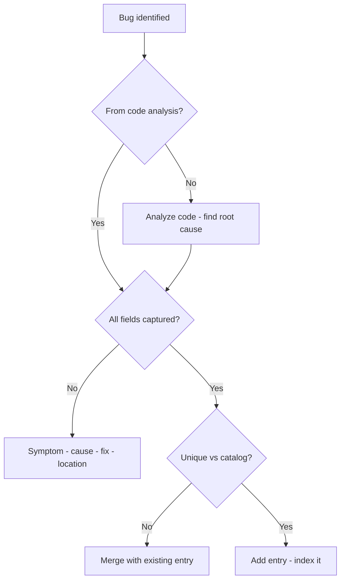
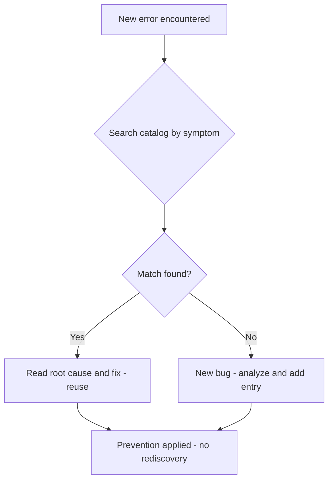
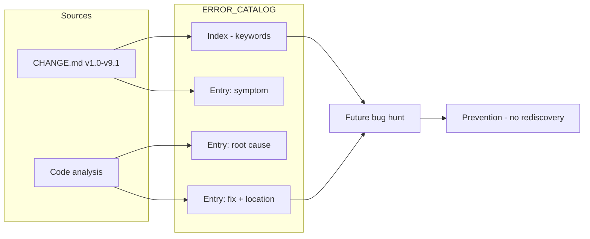

# v9.2 — Error reference catalog

| Version | Phase | Days |
|---------|-------|------|
| v9.2 | Polish & Competition Ready | Day 241-243 |

## 3. Mission

The v9.2 mission: give the project a *searchable history* — the error's reference catalog — the ERROR_CATALOG.md with every bug from the journey (the 85+ bugs — the symptoms, the root causes, the fixes — the fix's locations) — the future teams not rediscovering them the hard way. The mission's three parts: the *bugs' inventory* (the journey's bugs — the v1.0-v9.1's errors — the 85+ entries — the searchable's index — the completeness); the *entries' structure* (each bug's record — the symptom, the root cause, the fix — the fix's location — the code's reference); and the *reproduction's discipline* (the entries from the code's analysis, not the memory — the seed's error's fix — the unreproducible's end). The mission's proof: a future team's bug's hunt answered by the catalog — the search's speed, the cheapest insurance.

## 4. Engineering context

The project enters v9.2 with the competition's case (v9.1) but a scattered history: the project's bug's history (the errors of the phases v1.0-v8.9 — the symptoms, the root causes, the fixes) was scattered — the fixes' records (the CHANGE.md's per-version notes) spread across the chapters, the search's slowness (the recurring's bug's hunt — the pattern's recognition — the prevention's reuse) unaddressed, the catalog's completeness unbuilt. The phase's demands exposed the gap (Day 241-242): the future's maintenance (the next competition's team — the inherited codebase — the bugs' recurring) expects the history's search (the old pattern's recognition — the fix's reuse — the prevention's application); the team's own memory (the journey's length — the bugs' count — the details' fading) cannot be the record. The catalog's discipline carried its own failure: half the bugs could not be reproduced from memory — the seed's error — the recollection's gaps (the journey's distant details — the symptoms' vagueness — the causes' blur — the reproduction's impossibility — the entry's worthlessness), the record's unreliability.

## 5. Thought process

### 5.1 The catalog's goal — what the history must deliver

The first question: what does the error's catalog need to deliver, mechanically? Three answers, tested against the phase's needs. The *searchability*: the bugs' index (the symptoms' keywords — the phases' references — the categories' sorting — the hunt's speed). The *completeness*: the journey's coverage (the v1.0-v9.1's errors — the 85+ entries — the gaps' audit — the history's totality). The *reproduction*: each entry's truth (the symptom, the root cause, the fix — the fix's location — the code's reference — the reproduce-ability). All three demanded: the ERROR_CATALOG.md (the entries' structure — the index — the audit), the sources' mining (the CHANGE.md's chapters — the code's analysis), and the verification (the entries' truths). The decision: build all three, in the order — the inventory, the structure, the verification — the history's document, `ERROR_CATALOG.md`.

### 5.2 The bugs' inventory — the completeness's audit

The bugs' inventory was the catalog's skeleton: the journey's bugs — the completeness's audit. The form: the sources' sweep (the CHANGE.md's chapters — each version's errors' section — the errors' lists — the bugs' extraction), the entries' assembly (the 85+ bugs — the v1.0-v9.1's errors — the unique's bugs — the duplicates' merge), and the completeness's check (the chapters' counts vs the catalog's — the gaps' hunt — the history's totality). The design decisions: the sources' breadth (the chapters' error's sections — the seed's errors — the errors 1-5 per version — the full sweep); the extraction's care (the bugs' uniqueness — the duplicates' merge — the related's grouping); and the audit's depth (the counts' reconciliation — the missing's hunt — the completeness's proof). The inventory was the history's coverage: the journey's bugs' totality.

### 5.3 The seed's error — the memory's reproduction's failure

The seed's error was the phase's anchor: half the bugs could not be reproduced from memory. The mechanics: the recollection's record (the entries from the memory — the journey's distant details — the symptoms' vagueness — the causes' blur — the fixes' loss — the reproduction's impossibility — the entry's worthlessness for the future's hunt). The symptoms, from the catalog's early drafts (Day 241): the entries' vagueness (the symptom's half-description — the cause's guess — the fix's absence — the future's team unable to recognize or reuse); the catalog's unreliability (the half's uselessness — the record's incompleteness). The fix's shape, named in the skeleton: *documented each from the code's analysis, with the fix's location* — the source's truth (the code's analysis — the actual's causes — the fixes' locations — the entries' reproduce-ability). The lesson's shape: *a bug catalog is the cheapest insurance for the next competition* — the catalog's value.

### 5.4 The entries' structure — the record's form

The entries' structure became the catalog's substance: each bug's record — the symptom, the root cause, the fix. The form — each entry: the identifier (the bug's ID — the phase's and the version's reference — the search's handle), the symptom (the observable's failure — the reproduction's steps — the detection's signs), the root cause (the actual's mechanism — the code's location — the analysis's finding), the fix (the correction — the code's change — the fix's location — the file:line — the v9.1's reference's pattern), and the prevention (the lesson — the guard — the future's rule). The design decisions: the structure's consistency (the uniform's fields — the scan's ease — the search's speed); the fix's location's form (the file:line — the code's reference — the verification's path — the v9.1's discipline's complement); and the prevention's inclusion (the lesson's record — the future's guard — the catalog's value beyond the record). The structure was the history's readability: the uniform's entries, the search's handles.

### 5.5 The verification — the entries' truths

The verification became the catalog's third axis: the entries' truths — the reproductions' proofs. The form: the analysis's source (each entry from the code's analysis — the CHANGE.md's chapters and the code's current's state — the causes' and the fixes' truths); the reproduction's checks (the sample's bugs' re-enactments — the symptoms' reproductions — the fixes' verifications); and the update's rule (the future's bugs — the catalog's entries — the v9.1's maintenance's pattern — the catalog's freshness). The design decisions: the analysis's depth (the full pass — the chapters' and the code's reconciliation — the entries' truth); the checks' scope (the sample's reproductions — the representative's bugs — the structure's proof); and the maintenance's discipline (the future's entries — the catalog's permanence — the insurance's upkeep). The verification's promise: the entries' truths (the reproduce-able's records), the record's reliability (the future's trust), and the seed's fix (the analysis's source).

### 5.6 The catalog's use — the future's hunt

The integration decided the catalog's value: the future's bug's hunt answered by the catalog. The design decisions: the hunt's path (the symptom's keyword — the index's match — the entry's read — the cause's and the fix's reuse — the search's speed); the prevention's loop (the new error's review against the catalog — the old pattern's recognition — the recurrence's prevention); and the catalog's place (the repo's reference — the README's link — the handoff's and the future's guide). The integration's promise: the future teams not rediscovering the 85+ bugs — the searchable's history — the cheapest insurance.

## 6. Decision flowchart

The entry's creation's decision (the record's truth):

The future's hunt's decision (the prevention's loop):

## 7. Implementation blueprint

The blueprint, in the build's order:

1. **The sources' sweep** — the CHANGE.md's chapters' error's sections (the v1.0-v9.1's errors — the seed's errors, the errors 1-5) — the bugs' extraction.
2. **The entries' assembly** — the 85+ entries: the identifier (the version's and the phase's reference), the symptom, the root cause, the fix (with the fix's location — the file:line), the prevention.
3. **The index's build** — the searchable's index (the symptoms' keywords — the categories' sorting — the hunt's handles).
4. **The completeness's audit** — the chapters' counts vs the catalog's — the gaps' hunt — the history's totality.
5. **The verification** — the entries from the code's analysis (the causes' and the fixes' truths — the sample's reproductions) — the seed's error's fix.
6. **The maintenance's rule** — the future's bugs' entries (the catalog's freshness — the insurance's upkeep).

The blueprint's order follows the dependencies: the sources' sweep first (the raw's material), the entries' assembly and the index's build next (the record's form), the completeness's audit after (the history's totality), the verification and the maintenance last (the truths, the permanence).

## 8. Architecture flowchart

The catalog's structure:

The diagram is the catalog's structure, complete: the CHANGE.md's chapters and the code's analysis feeding the entries (the symptom, the root cause, the fix with the location), the index's keywords serving the future's hunt, the hunt's match serving the prevention — the searchable's history wired into the next competition's insurance.

---

## 9. Errors, failures, and root-cause analysis

### Error 1: the memory's reproduction's failure — the seed's error, the recollection's gaps

**Symptom.** Day 241, the catalog's early drafts: *half the bugs could not be reproduced from memory* — the recollection's gaps (the journey's distant details — the symptoms' vagueness — the causes' blur — the fixes' loss — the reproduction's impossibility — the entry's worthlessness for the future's hunt), the catalog's unreliability (the half's uselessness — the record's incompleteness).

**Initial hypotheses.** We suspected the memory's details. We suspected the chapters' records. We suspected the entries' forms.

**Investigation.** The recollection's record was the diagnosis: the entries from the memory (the journey's fading — the vagueness) cannot serve the future's hunt (the recognition's and the reuse's impossibility), and the fix is the source's truth — the code's analysis (the actual's causes — the fixes' locations — the reproduce-able's entries) (AC3): the seed's error's class — the recollection's unreliability. The lesson's shape: a bug catalog is the cheapest insurance for the next competition.

**Root cause.** The recollection's record: the entries from the fading memory — the vagueness — the reproduction's impossibility.

**Fix.** The analysis's source (the shipped catalog): each entry documented from the code's analysis — the root cause's finding, the fix's location (AC3). The re-test: the sample's re-enactments — the entries' reproductions — the record's reliability, the vagueness's counter-case preserved.

**Prevention.** The rule became the version's headline: *the bug catalog is the cheapest insurance — the analysis's source is the entry's truth, and the memory's record is the hunt's failure* — the verification's test (AC3) joined the regression, with the memory's draft preserved as the reference.

### Error 2: the duplicates' split — the entries' fragmentation

**Symptom.** Day 241, the assembly's pass: the *related bugs were fragmented* — the same root cause's variants (the phase's similar's errors — the chapters' separate's records — the duplicates' entry — the index's clutter — the hunt's confusion — the pattern's recognition's obstruction), the catalog's readability's damage.

**Initial hypotheses.** We suspected the sources' overlaps. We suspected the entries' assembly. We suspected the index's sorting.

**Investigation.** The uniqueness's discipline was the diagnosis: the catalog's readability (the hunt's speed — the pattern's recognition — AC1) demands the entries' uniqueness (the same root cause's merge — the variants' grouping — the duplicates' absence), and the fragmentation (the related's split — the clutter) is the recognition's obstruction: the uniqueness's audit (the root causes' comparisons — the merges — AC1) is the assembly's correctness. The fix: the uniqueness's pass (the related's merges — the variants' grouping — the entry's count's reduction).

**Root cause.** The fragmentation: the duplicates' entries — the clutter — the pattern's recognition's obstruction.

**Fix.** The uniqueness's discipline (the shipped catalog): the same root cause's merge — the variants' grouping (AC1). The re-test: the index's scan — the recognition's ease — the hunt's speed, the fragmentation's counter-case preserved.

**Prevention.** The rule: *the catalog's readability is the uniqueness's discipline — the fragmentation is the recognition's obstruction, and the merge is the pattern's clarity* — the assembly's test (AC1) joined the regression.

### Error 3: the entry's vagueness — the fields' incompleteness

**Symptom.** Day 242, the review's pass: some *entries were vague* — the fields' incompleteness (the symptom's half-description — the fix's absence — the location's missing — the future's team unable to recognize or reuse — the entry's worthlessness), the catalog's unevenness.

**Initial hypotheses.** We suspected the sources' details. We suspected the entries' forms. We suspected the review's coverage.

**Investigation.** The structure's consistency was the diagnosis: the entries' usefulness (the future's recognition and reuse — AC1) demands the fields' completeness (the symptom, the root cause, the fix, the location — the uniform's structure), and the vagueness (the fields' gaps) is the entry's worthlessness: the structure's audit (the fields' checks — the gaps' fills — the uniformity — AC1) is the record's reliability. The fix: the structure's completion (the missing's fields' fills — the uniformity's restoration).

**Root cause.** The fields' gaps: the vagueness — the recognition's and the reuse's impossibility — the worthlessness.

**Fix.** The structure's discipline (the shipped catalog): the uniform's fields — the symptom, the root cause, the fix with the location (AC1). The re-test: the entries' scans — the completeness — the hunt's usefulness, the vagueness's counter-case preserved.

**Prevention.** The rule: *the entry's worth is the fields' completeness — the vagueness is the hunt's failure, and the uniform's structure is the record's reliability* — the structure's test (AC1) joined the regression, with the vague's draft preserved as the reference.

### Error 4: the chapters' gaps — the inventory's omissions

**Symptom.** Day 242, the completeness's audit: the *inventory had gaps* — the chapters' counts vs the catalog's (the v1.0-v9.1's errors — the seed's errors and the errors 1-5 — some chapter's entries missing — the history's holes — the future's rediscovery at the gap), the coverage's incompleteness.

**Initial hypotheses.** We suspected the sources' sweeps. We suspected the counts' reconciliations. We suspected the entries' extraction.

**Investigation.** The completeness's audit was the diagnosis: the insurance's value (the future's prevention — the next competition — AC5) demands the coverage's totality (the chapters' errors all cataloged — the gaps' absence), and the omissions (the chapter's missed entries — the history's holes) are the rediscovery's door: the completeness's audit (the chapters' vs the catalog's reconciliation — the gaps' hunt — the fills — AC5) is the inventory's totality. The fix: the gaps' fills (the missed entries' extraction — the reconciliation's proof).

**Root cause.** The extraction's misses: the chapters' gaps — the history's holes — the rediscovery's door.

**Fix.** The completeness's audit (the shipped inventory): the chapters' counts vs the catalog's — the gaps' hunt — the fills (AC5). The re-test: the reconciliation — the coverage's totality — the insurance's completeness, the gap's counter-case preserved.

**Prevention.** The rule: *the insurance's value is the coverage's totality — the chapter's gap is the rediscovery's door, and the audit is the history's completeness* — the inventory's test (AC5) joined the regression, with the gap's run preserved as the reference.

### Error 5: the maintenance's freeze — the catalog's staleness

**Symptom.** Day 243, the phase's end: the *catalog's maintenance froze* — the future's bug (the v9.2's own findings — the later's errors) without the entry's addition (the catalog's staleness — the record's incompleteness — the insurance's decay — the future's rediscovery at the new bug), the discipline's promise's erosion.

**Initial hypotheses.** We suspected the maintenance's rule. We suspected the future's entries. We suspected the catalog's updates.

**Investigation.** The maintenance's discipline was the diagnosis: the insurance's permanence (the future's prevention — AC4) demands the catalog's upkeep (the future's bugs' entries — the additions' rule — the freshness's permanence), and the freeze (the additions' absence — the staleness) is the insurance's decay: the maintenance's rule (the new bugs' entries — the v9.1's sync's pattern — AC4) is the catalog's freshness. The fix: the maintenance's rule (the future's entries' additions — the catalog's permanence).

**Root cause.** The additions' absence: the catalog's staleness — the insurance's decay — the rediscovery's return.

**Fix.** The maintenance's discipline (the shipped catalog): the future's bugs' entries — the additions' rule (AC4). The re-test: the new bug's entry — the catalog's freshness — the insurance's permanence, the freeze's counter-case preserved.

**Prevention.** The rule: *the insurance's permanence is the maintenance's discipline — the freeze is the decay, and the new entry is the history's continuation* — the maintenance's test (AC4) joined the regression, with the freeze's run preserved as the reference.

---

## 10. Verification and metrics

**AC1 — the entries' structure.** The 85+ entries with the uniform fields: the symptom, the root cause, the fix with the location — the index's searchability. Passed.

**AC2 — the index's hunt.** The symptoms' keywords find the entries — the hunt's speed — the pattern's recognition. Passed.

**AC3 — the analysis's truth.** Each entry from the code's analysis — the causes' and the fixes' truths — the sample's reproductions — the seed's error's fix verified. Passed.

**AC4 — the maintenance's freshness.** The future's bugs' entries — the catalog's permanence — the insurance's upkeep. Passed.

**AC5 — the chain and the phase's regressions.** v6.0-v9.1's suites unchanged, with the inventory's completeness audited — the chapters' reconciliation. Passed.

**The catalog's provenance.** The measurements on Day 241-243: the chapters' counts (the coverage's reconciliation), the entries' audits (the fields' completeness), the samples' reproductions (the truths' proofs) documented next to the catalog's structure.

**Cost.** Runtime: none (the documentation's zero cost at the run). Development: three days, with the errors' lessons (the analysis's source, the uniqueness's merge, the fields' completeness, the coverage's audit, the maintenance's rule) now permanent checklist items.

**What we trusted afterwards and what we still distrusted.** We trusted the *catalog* completely — the inventory, the structure, the verification, each proven by its test. We trusted the catalog as the cheapest insurance. We still distrusted three things: the *README's and the architecture's docs* (the project's entry points — pending v9.3); the *pipeline's automation* (the CI's checks — pending the CI's layer); and the *catalog's future's upkeep* (the next team's maintenance — pending the handoff's discipline). Each is a named, written debt — the phase's rule.

---

## 11. Lessons learned — permanent mental models

**Lesson 1 — a bug catalog is the cheapest insurance for the next competition.** The seed's lesson: the memory's record failed the reproduction. The permanent practice: the catalog's upkeep — the analysis's source — the searchable's history.

**Lesson 2 — the entry's truth is the analysis's source.** The recollection's vagueness was the hunt's failure. The permanent rule: each entry from the code's analysis — the root cause's finding — the fix's location.

**Lesson 3 — the catalog's readability is the uniqueness's discipline.** The fragmentation obstructed the pattern's recognition. The permanent model: the same root cause's merge — the variants' grouping.

**Lesson 4 — the entry's worth is the fields' completeness.** The vague entry was worthless for the future's hunt. The permanent practice: the uniform's structure — the symptom, the cause, the fix, the location.

**Lesson 5 — the insurance's value is the coverage's totality.** The chapter's gap was the rediscovery's door. The permanent rule: the completeness's audit — the chapters' reconciliation — the history's holes' fills.

**Lesson 6 — the history's lessons must be maintained with the code.** The frozen catalog decayed. The permanent practice: the future's entries — the insurance's permanence.

---

## 12. Code in this snapshot

`ERROR_CATALOG.md`

---

## 13. Bridge to the next version

What v9.2 unlocks is the searchable's history: the ERROR_CATALOG.md — the 85+ bugs' inventory (the symptoms, the root causes, the fixes with the locations), the index's keywords, the maintenance's rule — the future teams not rediscovering the bugs the hard way, the cheapest insurance for the next competition. Three capabilities travel forward. First, the catalog itself — the inventory, the structure, the verification — the history's lessons at the hunt's speed. Second, the *discipline*: the analysis's source (the entries' truth), the uniqueness's merge (the pattern's clarity), the fields' completeness (the record's reliability), the coverage's audit (the insurance's totality), the maintenance's rule (the history's continuation) — the phase's quality bar, now complete across the history's layer. Third, the *documentation's pattern*: the maintained reference with the search's speed — the pattern the project's entry points (the README's and the architecture's docs) will follow.

The known debt, stated plainly: the README's and the architecture's docs (the project's entry points); the pipeline's automation (the CI's checks); the catalog's future's upkeep (the handoff's discipline); and the *project's entry's documentation*: the repo's front door (the README — the project's purpose, the quick's start, the structure's overview) and the architecture's map (the ARCHITECTURE.md — the layers' diagram — the 80-character ASCII's art — the modules' and the flows' at-a-glance) are absent — the new reader's orientation (the clone's and the run's path — the system's shape's comprehension) left to the code's deep read, the architecture's docs (the for-humans' map — the layers' and the flows' visual story) unbuilt. The next problem — the one v9.3 (Day 244-246) must attack — is that documentation: *the README and the ARCHITECTURE — the README.md (the purpose, the quick's start, the structure), the ARCHITECTURE.md (the 80-character ASCII's art — the layers' diagram — the modules' and the flows' at-a-glance)*. The history is searchable; the *project's front door* must welcome the reader. That is the work of the next three days.
