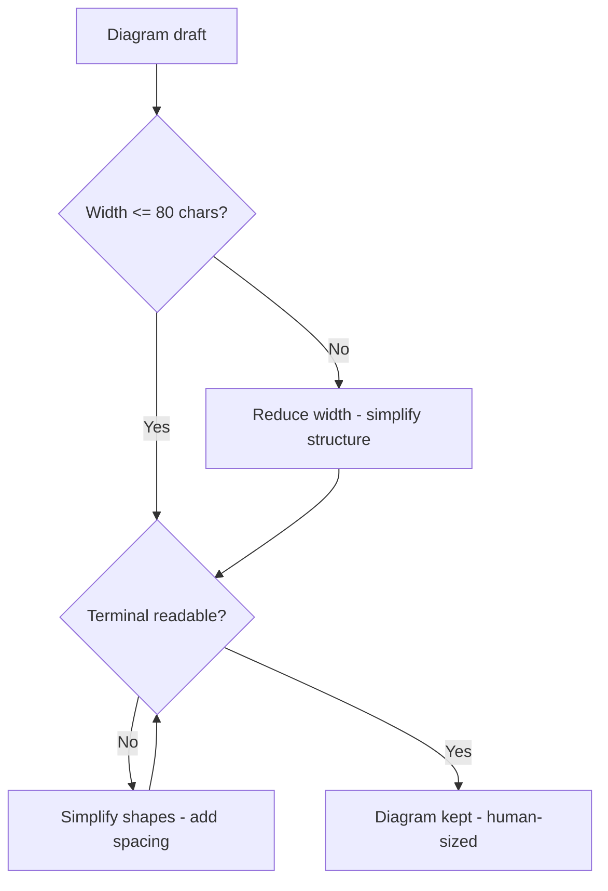
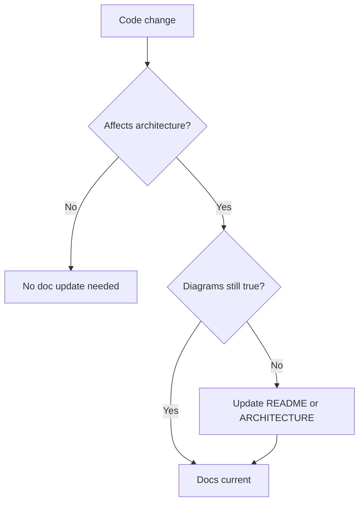
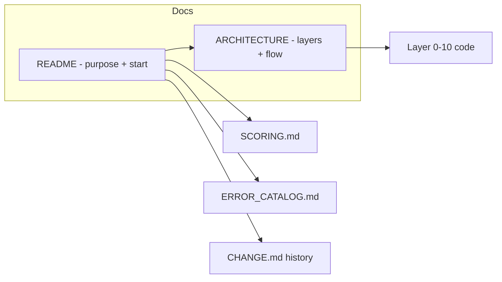

# v9.3 — README + ARCHITECTURE

| Version | Phase | Days |
|---------|-------|------|
| v9.3 | Polish & Competition Ready | Day 244-246 |

## 3. Mission

The v9.3 mission: make the repo *self-explanatory* — the README (the quickstart, the hardware, the wiring) and the ARCHITECTURE.md (the 11-layer diagram, the data's flow, the boot's sequence) — the next teammate's orientation without the code's deep read. The mission's three parts: the *README's door* (the project's purpose, the quick's start — the clone's and the run's path, the hardware's and the wiring's lists — the build's guide); the *architecture's map* (the ARCHITECTURE.md — the 11-layer diagram — the layers' stack, the data's flow — the modules' connections, the boot's sequence — the system's timeline); and the *diagrams' discipline* (the 80-character ASCII's art — the narrow's and the structured's shapes — the plain text's terminals' readability — the seed's error's fix — the unreadable's end). The mission's proof: a new reader's orientation from the README and the ARCHITECTURE — the repo's self-explanation, the next teammate's path.

## 4. Engineering context

The project enters v9.3 with the history's lessons (v9.2) but a closed front door: the repo's entry's documentation was absent — the README (the project's purpose, the quick's start, the structure's overview) and the ARCHITECTURE.md (the layers' diagram — the modules' and the flows' at-a-glance) unbuilt — the new reader's orientation (the clone's and the run's path — the system's shape's comprehension) left to the code's deep read. The phase's demands exposed the gap (Day 244-245): the next teammate's handoff (the inherited repo — the first hour's orientation — the clone's and the run's path) expects the front door's welcome; the judges' and the teammates' system's comprehension (the layers' stack — the data's flow — the boot's sequence) expects the architecture's map — the for-humans' document. The diagrams' discipline carried its own failure: the diagrams were unreadable in the plain text's terminals — the seed's error — the wide's and the complex's shapes (the ASCII's art's breadth — the terminal's wrap — the characters' jumble — the map's illegibility — the doc's worthlessness).

## 5. Thought process

### 5.1 The door's goal — what the repo must explain

The first question: what does the repo's front door need to explain, mechanically? Three answers, tested against the phase's needs. The *purpose's clarity*: the project's what and why (the WRO's robot — the mission — the reader's first minute). The *start's path*: the quick's start (the clone — the dependencies — the config — the run — the first launch's steps). The *system's shape*: the architecture's map (the layers — the flows — the boot — the at-a-glance). All three demanded: the README (the door's text — the lists — the steps), the ARCHITECTURE (the diagrams — the narratives), and the discipline (the human-sized's shapes). The decision: build all three, in the order — the README, the ARCHITECTURE, the discipline — the repo's welcome, `README.md` and `ARCHITECTURE.md`.

### 5.2 The README's door — the purpose and the start

The README was the repo's front door: the project's purpose and the quick's start. The form: the title and the summary (the WRO's robot — the mission's one-liner — the reader's first minute); the quick's start (the clone's command, the dependencies' install, the config's preparation — the robot_config.json's note, the run's command — the first launch's steps); the hardware's and the wiring's lists (the Pi, the ESP32, the sensors, the motors, the LEDs — the wiring's pins — the v8.8's LED's map's reference — the build's guide). The design decisions: the start's brevity (the steps' minimum — the launch's path — the reader's momentum); the hardware's completeness (the parts' and the pins' lists — the build's reference — the next team's assembly); and the README's links (the ARCHITECTURE's, the SCORING's, the ERROR_CATALOG's, the CHANGE.md's — the docs' map — the reader's paths). The README was the door's welcome: the purpose, the start, the structure's overview.

### 5.3 The architecture's map — the layers' and the flows' at-a-glance

The ARCHITECTURE was the system's map: the 11-layer diagram, the data's flow, the boot's sequence. The form: the layers' diagram (the stack — layer 0's system's manager through layer 10 — the ASCII's art — the layers' names and the roles — the vertical's stack — the human's view); the data's flow (the sensors' to the perception's to the planning's to the control's — the arrows' story — the modules' connections); the boot's sequence (the init's order — the managers' starts — the threads' launch — the mission's ready — the timeline's narrative — the v9.0's story's complement). The design decisions: the diagram's level (the layers' and the flows' at-a-glance — the human's comprehension — the depth's avoidance — the details' pointers to the code); the ASCII's form (the 80-character's width — the narrow's and the structured's shapes — the plain text's terminals' readability); and the narrative's threads (the data's flow's story — the boot's sequence's story — the reader's orientation). The ARCHITECTURE was the map's clarity: the system's shape at a glance.

### 5.4 The seed's error — the unreadable's diagrams

The seed's error was the phase's anchor: the diagrams were unreadable in the plain text's terminals. The mechanics: the wide's and the complex's shapes (the ASCII's art's breadth — the box-drawing's characters' density — the terminal's wrap — the characters' jumble — the map's illegibility — the reader's abandonment — the doc's worthlessness). The symptoms, from the first drafts (Day 244): the terminal's wraps (the wide's diagrams' horizontal's scroll — the shape's destruction — the connections' loss); the jumble's confusion (the dense's characters — the reader's squint — the map's failure). The fix's shape, named in the skeleton: *the 80-char ASCII's art, kept narrow and structured* — the discipline's form — the width's bound (the 80 characters — the terminal's view — the wrap's absence), the structure's clarity (the narrow's shapes — the simple's lines — the spaced's elements — the human's readability). The lesson's shape: *architecture docs are for humans — keep them human-sized* — the discipline's core.

### 5.5 The human-sized discipline — the 80-characters' bound

The human-sized discipline became the docs' third axis: the diagrams' shapes — the readers' terminals' truth. The form: the 80-character's bound (the diagram's width's cap — the terminal's default's view — the wrap's absence — the shape's integrity); the structure's clarity (the simple's boxes, the straight's lines — the spacing's air — the characters' restraint — the jumble's absence); and the human's scale (the layers' count's readability — the text's size — the at-a-glance's promise — the details' pointers to the code). The design decisions: the width's enforcement (the 80 characters' measure — the drafts' checks — the bound's binding); the style's restraint (the ASCII's simplicity — the box-drawing's sparing use — the monospace's compatibility); and the map's usability (the reader's terminal — the plain text's view — the comprehension's ease). The discipline's promise: the diagrams' readability (the terminal's fit — the shape's clarity), the docs' worth (the read's probability — the orientation's speed), and the seed's fix (the 80-character's art).

### 5.6 The docs' integration — the front door's welcome

The integration decided the mission's success: the repo's self-explanation — the next teammate's path. The design decisions: the docs' coherence (the README's and the ARCHITECTURE's links — the story's threads — the v9.1's and the v9.2's docs' map — the reader's paths); the maintenance's rule (the code's changes — the docs' updates — the v9.0's sync's pattern — the docs' freshness); and the welcome's proof (the new reader's walk — the orientation's speed — the first hour's success — the self-explanation's test). The integration's promise: the repo's front door open — the next teammate's orientation without the deep read.

## 6. Decision flowchart

The diagram's width's decision (the human-sized discipline):

The docs' maintenance's decision (the freshness's permanence):

## 7. Implementation blueprint

The blueprint, in the build's order:

1. **The README's draft** — the purpose and the summary, the quick's start (the clone, the dependencies, the config, the run), the hardware's and the wiring's lists (the parts, the pins — the LED's map's reference).
2. **The ARCHITECTURE's draft** — the 11-layer diagram (the stack — the ASCII's art — the layers' names and the roles), the data's flow (the sensors' to the control's — the arrows' story), the boot's sequence (the init's order — the mission's ready).
3. **The 80-character's discipline** — the drafts' width's checks (the narrow's and the structured's shapes) — the seed's error's fix.
4. **The docs' coherence** — the README's and the ARCHITECTURE's links — the docs' map (the SCORING's, the ERROR_CATALOG's, the CHANGE.md's).
5. **The maintenance's rule** — the code's changes' docs' updates (the v9.0's sync's pattern — the freshness's permanence).
6. **The verification** — the reader's walk (the orientation's speed — the self-explanation's test), the widths' checks (the terminal's readability).

The blueprint's order follows the dependencies: the README's draft first (the door's welcome), the ARCHITECTURE's draft next (the map's clarity), the 80-character's discipline after (the seed's fix), the coherence and the maintenance and the verification last (the paths, the freshness, the proof).

## 8. Architecture flowchart

The docs' structure:

The diagram is the docs' structure, complete: the README's door linking to the ARCHITECTURE's map, the SCORING's evidence, the ERROR_CATALOG's history, the CHANGE.md's journey — the ARCHITECTURE's map pointing into the layers' code — the repo's front door's welcome wired into the next teammate's orientation.

---

## 9. Errors, failures, and root-cause analysis

### Error 1: the unreadable's diagrams — the seed's error, the terminal's jumble

**Symptom.** Day 244, the first drafts: the diagrams were *unreadable in the plain text's terminals* — the terminal's wraps (the wide's diagrams' horizontal's scroll — the shape's destruction — the connections' loss), the jumble's confusion (the dense's characters — the reader's squint — the map's failure — the doc's worthlessness).

**Initial hypotheses.** We suspected the diagrams' widths. We suspected the shapes' complexity. We suspected the terminals' views.

**Investigation.** The width's and the structure's shapes were the diagnosis: the diagrams' readability (the terminal's fit — the comprehension's ease — AC1) demands the 80-character's bound (the width's cap — the terminal's default's view — the wrap's absence) and the structure's clarity (the simple's shapes — the spacing — the jumble's absence), and the wide's and the dense's drafts (the wrap — the jumble) are the map's failure: the fix's form — the 80-char ASCII's art, kept narrow and structured (AC1). The lesson's shape: architecture docs are for humans — keep them human-sized.

**Root cause.** The width's and the density's excess: the wraps — the jumble — the reader's abandonment — the doc's worthlessness.

**Fix.** The 80-character's discipline (the shipped docs): the diagrams' width's cap — the narrow's and the structured's shapes (AC1). The re-test: the terminals' reads — the shapes' integrities — the comprehension's ease, the jumble's draft preserved as the reference.

**Prevention.** The rule became the version's headline: *architecture docs are for humans — keep them human-sized — the 80-character's bound is the terminal's truth, and the jumble is the map's failure* — the width's test (AC1) joined the regression, with the jumble's draft preserved as the reference.

### Error 2: the README's depth — the doc's wall of text

**Symptom.** Day 245, the reader's tests: the README's *depth repelled the readers* — the wall of text (the paragraphs' density — the details' flood — the quick's start buried — the reader's momentum lost — the door's welcome failed), the orientation's slowness.

**Initial hypotheses.** We suspected the readers' patience. We suspected the README's length. We suspected the content's order.

**Investigation.** The start's prominence was the diagnosis: the README's usability (the new reader's momentum — the first hour's success — AC2) demands the quick's start's prominence (the steps' minimum — the brevity — the launch's path — the details' pointers), and the wall (the depth's flood — the start's burial) is the welcome's failure: the README's structure (the summary's brevity — the start's steps — the details' links — AC2) is the door's usability. The fix: the README's restructure (the brevity's front — the start's steps — the details' pointers).

**Root cause.** The depth's flood: the start's burial — the momentum's loss — the welcome's failure.

**Fix.** The README's structure (the shipped door): the summary's brevity — the quick's start's steps — the details' links (AC2). The re-test: the readers' walks — the momentum's keeping — the orientation's speed, the wall's counter-case preserved.

**Prevention.** The rule: *the door's welcome is the start's prominence — the wall of text is the momentum's loss, and the brevity is the orientation's speed* — the README's test (AC2) joined the regression, with the wall's draft preserved as the reference.

### Error 3: the layers' count's mismatch — the diagram's wrongness

**Symptom.** Day 245, the review's pass: the layers' *diagram mismatched the code* — the 11-layer diagram (the stack's shape) diverging from the code's actual's structure (the layers' names or the count — the v9.0's comments' truth vs the diagram's simplification — the reader's mis-orientation — the map's untrustworthiness), the doc's credibility's damage.

**Initial hypotheses.** We suspected the diagram's sources. We suspected the layers' count. We suspected the review's coverage.

**Investigation.** The diagram's accuracy was the diagnosis: the map's truth (the reader's orientation — the trust — AC3) demands the diagram's match (the layers' names and the count vs the code's actual's structure — the v9.0's comments' reference), and the divergence (the mismatch — the mis-orientation) is the credibility's damage: the diagram's review (the layers' vs the code's — the divergence's catch — AC3) is the map's truth. The fix: the diagram's correction (the layers' match — the review's verification).

**Root cause.** The diagram's divergence: the layers' mismatch — the mis-orientation — the trust's damage.

**Fix.** The diagram's review (the shipped map): the 11-layer diagram vs the code's structure — the divergence's catch (AC3). The re-test: the readers' orientations — the map's truth — the trust's restoration, the mismatch's counter-case preserved.

**Prevention.** The rule: *the map's truth is the diagram's match — the divergence is the mis-orientation, and the review is the trust's keeper* — the diagram's test (AC3) joined the regression, with the mismatch's draft preserved as the reference.

### Error 4: the boot's sequence's incompleteness — the timeline's gaps

**Symptom.** Day 246, the walkthrough's test: the boot's *sequence's narrative had gaps* — the timeline's omissions (the calibration's pass — the manager's starts' order — the threads' launch's placement — the narrative's jumps — the reader's boot's comprehension's holes), the orientation's incompleteness.

**Initial hypotheses.** We suspected the narrative's sources. We suspected the boot's order. We suspected the walkthrough's coverage.

**Investigation.** The timeline's completeness was the diagnosis: the boot's narrative (the system's start's story — the reader's orientation — AC4) demands the sequence's totality (the init's order — the managers' starts — the threads' launch — the calibration's pass — the mission's ready — the timeline's fullness), and the gaps (the jumps — the holes) are the orientation's incompleteness: the walkthrough's review (the boot's run vs the narrative — the gaps' fills — AC4) is the timeline's truth. The fix: the gaps' fills (the sequence's completion — the narrative's fullness).

**Root cause.** The timeline's omissions: the jumps — the comprehension's holes — the orientation's incompleteness.

**Fix.** The walkthrough's review (the shipped narrative): the boot's run vs the narrative — the gaps' fills (AC4). The re-test: the reader's boot's comprehension — the timeline's fullness — the orientation's truth, the gaps' counter-case preserved.

**Prevention.** The rule: *the boot's story is the sequence's totality — the timeline's gap is the comprehension's hole, and the walkthrough is the fullness' proof* — the narrative's test (AC4) joined the regression, with the gaps' draft preserved as the reference.

### Error 5: the docs' drift — the maintenance's freeze

**Symptom.** Day 246, the phase's end: the docs' *drift began* — the code's changes (the phase's final's tweaks) without the docs' updates (the README's and the ARCHITECTURE's staleness — the map's untruth — the future's reader misled), the freshness's promise's erosion.

**Initial hypotheses.** We suspected the changes' scope. We suspected the docs' updates. We suspected the maintenance's rule.

**Investigation.** The maintenance's discipline was the diagnosis: the docs' freshness (the future's trust — AC5) demands the sync's rule (the code's changes with the docs' updates — the v9.0's pattern — the divergence's prevention), and the freeze (the updates' absence — the drift) is the trust's erosion: the maintenance's rule (the changes' commits' docs' updates — AC5) is the docs' permanence. The fix: the maintenance's rule (the changes' sync — the freshness's permanence).

**Root cause.** The updates' absence: the docs' drift — the map's untruth — the future's misdirection.

**Fix.** The maintenance's discipline (the shipped docs): the code's changes with the docs' updates — the sync's rule (AC5). The re-test: the change's rehearsal — the docs' currentness — the trust's keeping, the drift's counter-case preserved.

**Prevention.** The rule: *the docs' freshness is the maintenance's discipline — the drift is the future's misdirection, and the sync is the trust's keeper* — the maintenance's test (AC5) joined the regression, with the drift's run preserved as the reference.

---

## 10. Verification and metrics

**AC1 — the diagrams' readability.** The 80-character's bound — the narrow's and the structured's shapes — the plain text's terminals' reads — the seed's error's fix verified. Passed.

**AC2 — the README's door.** The purpose, the quick's start, the hardware's and the wiring's lists — the reader's momentum — the orientation's speed. Passed.

**AC3 — the map's truth.** The 11-layer diagram matching the code's structure — the readers' orientations — the trust. Passed.

**AC4 — the boot's story.** The sequence's totality — the init's order, the managers' starts, the threads' launch, the mission's ready — the reader's comprehension. Passed.

**AC5 — the chain and the phase's regressions.** v6.0-v9.2's suites unchanged, with the docs' maintenance's rule verified — the self-explanation's test. Passed.

**The docs' provenance.** The measurements on Day 244-246: the widths' checks (the terminal's reads), the readers' walks (the orientation's speeds), the walkthroughs' reviews (the narratives' fullness) documented next to the docs' standards.

**Cost.** Runtime: none (the documentation's zero cost at the run). Development: three days, with the errors' lessons (the human's scale, the start's prominence, the map's match, the timeline's fullness, the maintenance's sync) now permanent checklist items.

**What we trusted afterwards and what we still distrusted.** We trusted the *docs* completely — the README, the ARCHITECTURE, the discipline, each proven by its test. We trusted the human-sized shapes as the terminal's truth. We still distrusted three things: the *CI's automation* (the repo's checks — pending v9.4); the *cleanup's completeness* (the repo's tidiness — pending v9.5); and the *integration's tests* (the hardware's truth — pending v9.6). Each is a named, written debt — the phase's rule.

---

## 11. Lessons learned — permanent mental models

**Lesson 1 — architecture docs are for humans: keep them human-sized.** The seed's lesson: the jumble's diagrams failed the terminal's readers. The permanent practice: the 80-character's bound — the narrow's and the structured's shapes — the human's scale.

**Lesson 2 — the door's welcome is the start's prominence.** The wall of text lost the reader's momentum. The permanent rule: the quick's start's steps first — the details' pointers after.

**Lesson 3 — the map's truth is the diagram's match.** The layers' mismatch mis-oriented the readers. The permanent model: the diagram vs the code's structure — the review's verification.

**Lesson 4 — the boot's story is the sequence's totality.** The timeline's gaps left the comprehension's holes. The permanent practice: the walkthrough's review — the narrative's fullness.

**Lesson 5 — the docs' freshness is the maintenance's discipline.** The drift misled the future's readers. The permanent rule: the code's changes with the docs' updates — the sync's binding.

**Lesson 6 — the repo's door is the handoff's first hour.** The self-explanation is the next teammate's orientation. The permanent practice: the front door's welcome as the collaboration's first step.

---

## 12. Code in this snapshot

`ARCHITECTURE.md`, `README.md`

---

## 13. Bridge to the next version

What v9.3 unlocks is the repo's front door: the README (the quickstart, the hardware, the wiring) and the ARCHITECTURE.md (the 11-layer diagram, the data's flow, the boot's sequence) — the 80-character's ASCII's art, the narrow's and the structured's shapes — the repo's self-explanation for the next teammate. Three capabilities travel forward. First, the docs themselves — the door, the map, the narratives — the orientation's speed, the welcome's warmth. Second, the *discipline*: the human's scale (the terminal's truth), the start's prominence (the momentum's keeping), the map's match (the trust's keeper), the timeline's fullness (the comprehension's completeness), the maintenance's sync (the freshness's permanence) — the phase's quality bar, now complete across the documentation's layer. Third, the *repo's health's pattern*: the documented system with the maintained truth — the pattern the automation's pipeline (the CI's checks) will guard.

The known debt, stated plainly: the CI's automation (the repo's checks); the cleanup's completeness (the repo's tidiness); the integration's tests (the hardware's truth); and the *automation's pipeline*: the repo's quality's checks (the syntax's validation, the tests' run, the lint's pass) are manual — the team's memory (the run's commands — the checks' discipline) the only gate, the regression's risk (the broken's push — the unnoticed's break — the race's day's failure) unguarded, the continuous's integration (the GitHub's Actions — the ci.yml — the ubuntu's latest, the python's 3.11 — the automated's gate) unbuilt. The next problem — the one v9.4 (Day 247-249) must attack — is that automation: *the CI pipeline — the GitHub's Actions (the ci.yml — the ubuntu's latest — the python's 3.11 — the syntax's checks, the tests' run, the lint's pass — the pull's request's gate), the parity's discipline (the CI's OS — the target's OS family — the seeds' error: the environment's mismatch)*. The repo welcomes the reader; it must *guard its own health*. That is the work of the next three days.
