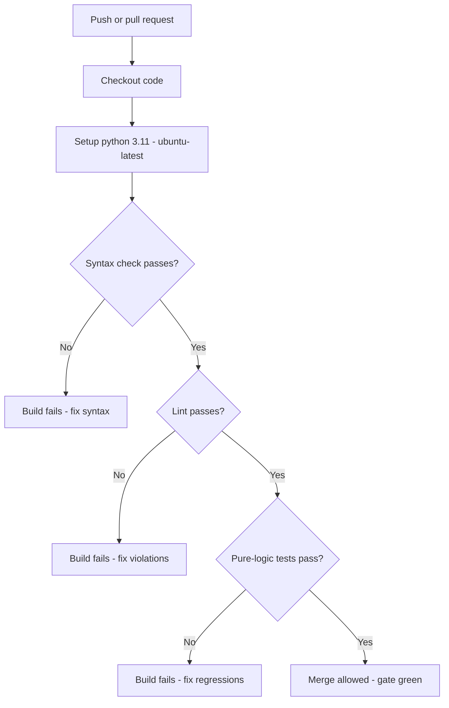
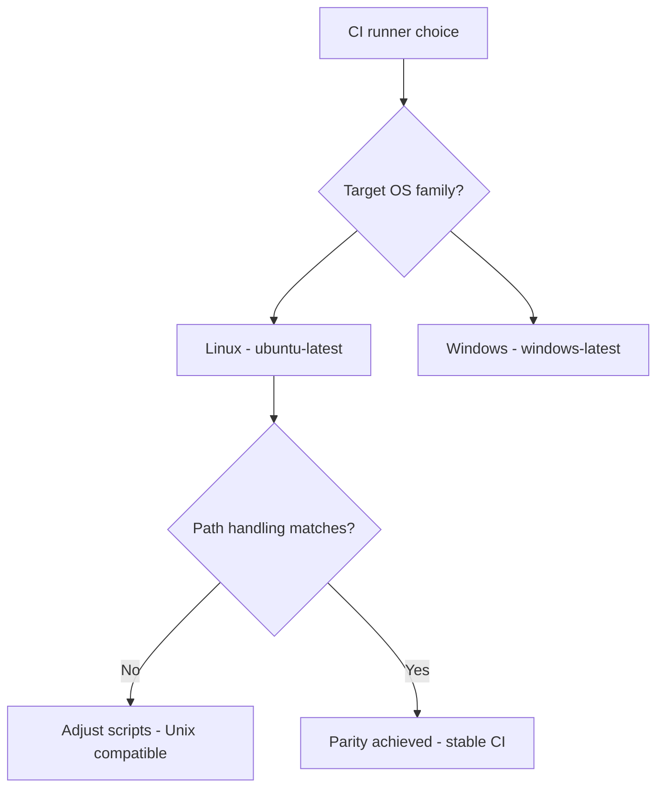
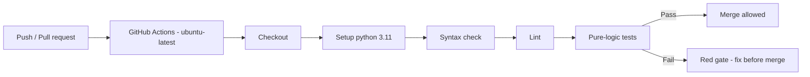

# v9.4 — CI pipeline

| Version | Phase | Days |
|---------|-------|------|
| v9.4 | Polish & Competition Ready | Day 247-249 |

## 3. Mission

The v9.4 mission: give the repo an *automated gate* — the CI pipeline — the GitHub's Actions (the ci.yml — the ubuntu-latest — the python's 3.11 — the syntax's checks of all the Python files, the lint, the pure-logic tests' run on the ubuntu-latest) — the bug that would have failed in the CI never reaching the pit lane. The mission's three parts: the *pipeline's build* (the GitHub's Actions' workflow — the trigger's rules — the job's steps: the checkout, the python's setup, the syntax's checks, the lint, the tests); the *parity's discipline* (the CI's OS — the target's OS family — the ubuntu-latest — the seed's error's fix — the Windows's path's failure's end); and the *gate's use* (the pull's request's checks — the failures' visibility — the regression's prevention — the team's discipline). The mission's proof: a broken push fails the CI — the syntax's and the lint's and the tests' gates, the pit lane's surprise's end.

## 4. Engineering context

The project enters v9.4 with the repo's door (v9.3) but a manual gate: the repo's quality's checks (the syntax's validation, the tests' run, the lint's pass) were manual — the team's memory (the run's commands — the checks' discipline) the only gate, the regression's risk (the broken's push — the unnoticed's break — the race's day's failure) unguarded, the continuous's integration unbuilt. The phase's demands exposed the gap (Day 247-248): the pit lane's discipline (the competition's repairs — the last-minute's changes — the break's cost — the bug found at the pit lane as the CI's failure) demands the automated's gate — the changes' checks before the merge, not the practice's discovery; the team's velocity (the shared's repo — the parallel's changes — the merge's safety) demands the pull's request's gate. The pipeline's build carried its own failure: the CI failed on the Windows's path's handling — the seed's error — the CI's OS (the Windows's runner — the path's separators' and the commands' differences) mismatching the project's assumptions — the pipeline's breakage, the environment's mismatch.

## 5. Thought process

### 5.1 The gate's goal — what the CI must catch

The first question: what does the CI's gate need to catch, mechanically? Three answers, tested against the phase's needs. The *syntax's errors*: the broken files (the parse's failures — the import's breaks — the code's non-loading — the first gate). The *lint's violations*: the style's and the smell's issues (the conventions' breaks — the potential's bugs — the second gate). The *tests' failures*: the logic's regressions (the pure-logic tests — the v9.6's and the earlier's suites — the behaviour's breaks — the third gate). All three demanded: the workflow's build (the trigger's and the job's configuration), the tests' selection (the pure-logic's — the hardware's absence), and the parity's discipline (the OS's match). The decision: build all three, in the order — the workflow, the checks, the parity — the automated's gate, `ci.yml`.

### 5.2 The pipeline's build — the workflow's steps

The pipeline's build was the gate's skeleton: the GitHub's Actions' workflow — the trigger's rules, the job's steps. The form — the ci.yml: the trigger (the push's and the pull's request's events — the changes' gate — the check's timing); the job (the ubuntu-latest's runner — the steps' sequence: the checkout — the code's fetch; the python's setup — the 3.11's version — the explicit's configuration; the syntax's checks — the Python's compile — all the files' parse; the lint — the style's and the smell's checks; the tests' run — the pure-logic's suites — the pytest's or the unittest's). The design decisions: the steps' order (the fast's first — the syntax before the lint before the tests — the failures' speed); the tests' scope (the pure-logic's only — the hardware's absence in the CI — the sensors' and the motors' mock — the run's portability); and the gate's enforcement (the pull's request's required's checks — the merge's block at the failure — the team's discipline). The pipeline was the gate's automation: the checks' sequence at every change.

### 5.3 The seed's error — the Windows's path's failure

The seed's error was the phase's anchor: the CI failed on the Windows's path's handling. The mechanics: the environment's mismatch (the CI's OS — the Windows's runner — the path's separators (the backslashes) — the commands' differences (the shell's, the tools') — the project's assumptions (the Unix's paths — the Linux's commands) — the pipeline's breakage). The symptoms, from the first workflow (Day 247): the path's failures (the file's locations' misses — the backslashes' vs the forwardslashes' — the checks' false's failures — the pipeline's red); the environment's differences (the commands' unavailability — the paths' resolutions — the CI's instability). The fix's shape, named in the skeleton: *moved the CI to the ubuntu-latest with the explicit python 3.11 setup* — the parity's discipline — the OS's match (the ubuntu-latest — the Linux's family — the project's assumptions' home — the path's handling's end — the environment's stability). The lesson's shape: *CI must run on the same OS family as the target (the Linux)* — the parity's truth.

### 5.4 The parity's discipline — the OS's match

The parity's discipline became the pipeline's third axis: the CI's environment — the target's truth. The form: the runner's choice (the ubuntu-latest — the Linux's family — the robot's Pi's OS (the Linux's arm) — the family's match — the commands' and the paths' compatibility); the python's setup (the explicit 3.11 — the versions' pinning — the runtime's match — the behavior's consistency); and the differences' audit (the CI's vs the target's environment — the path's handling's checks — the commands' portability — the parity's maintenance). The design decisions: the family's matching (the ubuntu-latest for the Linux's target — the Windows's runner's rejection — the seed's fix's core); the dependencies' pinning (the requirements' versions — the CI's and the target's consistency — the reproducibility); and the environment's documentation (the CI's and the target's notes — the parity's record). The discipline's promise: the pipeline's stability (the path's and the command's failures' end), the CI's truth (the checks' validity — the environment's match), and the seed's fix (the ubuntu-latest's parity).

### 5.5 The tests' selection — the pure-logic's scope

The tests' selection decided the gate's value: the pure-logic's tests' run — the hardware's absence. The form: the pure-logic's suites (the geometry's math (v8.x's), the planning's logic, the protocol's (v8.9's CRC8's), the parking's fusion — the tests without the hardware); the mocks' pattern (the sensors' and the motors' stubs — the hardware's absence's simulation — the test's portability); and the hardware's tests' exclusion (the run's on the robot — the --simulate's pattern (v9.6's) — the CI's scope's clarity). The design decisions: the suites' inventory (the pure-logic's tests' list — the CI's run's coverage); the mocks' maintenance (the stubs' updates — the hardware's changes' sync); and the exclusion's documentation (the hardware's tests' notes — the CI's scope's record). The selection's promise: the gate's portability (the CI's runs without the robot), the regressions' catch (the logic's breaks at the change), and the CI's speed (the pure-logic's suites' quickness).

### 5.6 The gate's use — the pit lane's surprise's end

The integration decided the pipeline's value: the gate's use — the bug found at the pit lane as the CI's failure. The design decisions: the pull's request's gate (the required's checks — the merge's block at the failure — the team's discipline — the changes' verification before the integration); the failures' visibility (the red's checks — the logs' links — the fix's path — the team's response); and the pit lane's discipline (the last-minute's changes' CI's waits — the competition's repairs' checks — the bug's catch before the field). The integration's promise: the broken push fails the CI — the regression's prevention — the pit lane's surprise's end.

## 6. Decision flowchart

The workflow's gate's decision (the checks' sequence):

The runner's choice's decision (the parity's discipline):

## 7. Implementation blueprint

The blueprint, in the build's order:

1. **The workflow's draft** — the ci.yml: the trigger (the push's and the pull's request's events), the job (the ubuntu-latest's runner, the steps' sequence).
2. **The checks' steps** — the syntax's checks (the Python's compile — all the files' parse), the lint (the style's and the smell's checks), the tests' run (the pure-logic's suites).
3. **The parity's discipline** — the ubuntu-latest with the explicit python 3.11 setup — the seed's error's fix — the path's handling's end.
4. **The tests' selection** — the pure-logic's suites with the mocks (the hardware's absence — the portability), the hardware's tests' exclusion.
5. **The gate's enforcement** — the pull's request's required's checks — the merge's block at the failure.
6. **The verification** — the ACs' runs: the pipeline's green (the checks' pass), the break's catch (the injected's failure — the red's gate), the parity's stability.

The blueprint's order follows the dependencies: the workflow's draft first (the gate's skeleton), the checks' steps next (the gate's content), the parity's discipline after (the seed's fix), the tests' selection and the enforcement and the verification last (the scope, the discipline, the proof).

## 8. Architecture flowchart

The pipeline's flow:

The diagram is the pipeline's flow, complete: the push's and the pull's request's triggers flowing into the ubuntu-latest's runner, the checkout and the python's setup, the syntax's check and the lint and the pure-logic tests' gates, the merge's allowance at the green, the red's gate at the failure — the automated's gate wired into the pit lane's surprise's end.

---

## 9. Errors, failures, and root-cause analysis

### Error 1: the Windows's path's failure — the seed's error, the environment's mismatch

**Symptom.** Day 247, the first workflow: the CI *failed on the Windows's path's handling* — the path's failures (the file's locations' misses — the backslashes' vs the forwardslashes' — the checks' false's failures — the pipeline's red), the environment's differences (the commands' unavailability — the paths' resolutions — the CI's instability — the gate's untrustworthiness).

**Initial hypotheses.** We suspected the scripts' paths. We suspected the runner's choice. We suspected the checks' commands.

**Investigation.** The environment's mismatch was the diagnosis: the CI's OS (the Windows's runner — the path's separators — the commands' differences) mismatching the project's assumptions (the Unix's paths — the Linux's commands), and the fix is the parity's discipline — the ubuntu-latest (the Linux's family — the project's assumptions' home — the path's handling's end), the explicit python's 3.11 setup (the versions' pinning) (AC3): the seed's error's class — the environment's mismatch. The lesson's shape: CI must run on the same OS family as the target (the Linux).

**Root cause.** The OS's mismatch: the Windows's runner — the path's and the command's differences — the pipeline's false's failures.

**Fix.** The parity's move (the shipped pipeline): the ubuntu-latest with the explicit python 3.11 setup (AC3). The re-test: the pipeline's stability — the checks' validity — the green's gate, the mismatch's run preserved as the reference.

**Prevention.** The rule became the version's headline: *CI must run on the same OS family as the target — the environment's mismatch is the pipeline's failure, and the parity is the gate's truth* — the parity's test (AC3) joined the regression, with the Windows's run preserved as the reference.

### Error 2: the hardware's coupling — the CI's tests' hang

**Symptom.** Day 248, the tests' inclusion: the *tests hung on the hardware* — the suite's coupling (the sensors' and the motors' access in the tests — the CI's runner's hardware's absence — the I2C's errors, the serial's timeouts — the tests' hangs — the pipeline's timeout's red), the gate's uselessness at the hardware's dependency.

**Initial hypotheses.** We suspected the tests' scope. We suspected the mocks' absence. We suspected the hardware's access.

**Investigation.** The pure-logic's scope was the diagnosis: the CI's runs (the runner's hardware's absence — the gate's portability — AC1) demand the pure-logic's tests only (the hardware's exclusion — the mocks' pattern — the stubs' simulation), and the coupling (the hardware's access — the hangs — the timeouts) is the gate's failure: the tests' selection (the pure-logic's inventory — the mocks — the hardware's exclusion — AC1) is the pipeline's portability. The fix: the tests' selection (the pure-logic's suites — the mocks — the hardware's exclusion).

**Root cause.** The hardware's coupling: the sensors' and the motors' access — the hangs — the pipeline's red.

**Fix.** The pure-logic's scope (the shipped pipeline): the suites' inventory with the mocks — the hardware's tests' exclusion (AC1). The re-test: the CI's run without the robot — the gate's green — the portability, the hang's counter-case preserved.

**Prevention.** The rule: *the CI's portability is the pure-logic's scope — the hardware's coupling is the gate's hang, and the mock is the run's truth* — the selection's test (AC1) joined the regression, with the hang's run preserved as the reference.

### Error 3: the lint's noise — the style's gate's false's failures

**Symptom.** Day 248, the lint's first run: the *lint flooded the gate* — the style's violations (the conventions' breaks — the existing's code's dust — the lint's hundreds of the findings — the gate's red at the style — the team's noise — the gate's discipline's erosion), the signal's drowning.

**Initial hypotheses.** We suspected the lint's rules. We suspected the code's style. We suspected the gate's thresholds.

**Investigation.** The noise's taming was the diagnosis: the lint's gate's value (the smell's and the potential's bugs' catch — AC2) demands the noise's taming (the rules' tuning — the existing's dust's acceptance or the fix — the gate's thresholds — the new's violations' catch), and the flood (the hundreds' findings — the red at the style) is the gate's erosion: the lint's configuration (the rules' scope — the dust's handling — the gate's signal — AC2) is the style's gate's usefulness. The fix: the lint's tuning (the rules' scope — the dust's acceptance — the new's violations' gate).

**Root cause.** The lint's flood: the existing's dust — the red at the style — the gate's erosion.

**Fix.** The lint's configuration (the shipped pipeline): the rules' scope — the dust's handling — the new's violations' gate (AC2). The re-test: the gate's signal — the noise's taming — the smell's catch, the flood's counter-case preserved.

**Prevention.** The rule: *the lint's gate is the noise's taming — the flood is the signal's drowning, and the tuning is the gate's usefulness* — the lint's test (AC2) joined the regression, with the flood's run preserved as the reference.

### Error 4: the gate's bypass — the merge's unguarded path

**Symptom.** Day 249, the team's practice: the *gate was bypassed* — the merge's path (the direct's pushes to the main — the required's checks' absence — the pull's request's gate's skip — the broken's code's entry — the regression's return), the gate's promise's erosion.

**Initial hypotheses.** We suspected the merge's habits. We suspected the branch's protection. We suspected the required's checks.

**Investigation.** The enforcement's binding was the diagnosis: the gate's promise (the pit lane's surprise's end — AC5) demands the enforcement (the branch's protection — the required's checks — the merge's block at the failure — the direct's pushes' prohibition), and the bypass (the unguarded's merge — the regression's return) is the promise's erosion: the enforcement's setup (the branch's protection's rules — the required's status — AC5) is the gate's binding. The fix: the enforcement's setup (the branch's protection — the required's checks — the merge's block).

**Root cause.** The enforcement's absence: the unguarded's merge — the broken's entry — the regression's return.

**Fix.** The enforcement's binding (the shipped gate): the branch's protection — the required's checks — the merge's block at the failure (AC5). The re-test: the bypass's attempts — the blocks — the gate's promise, the bypass's counter-case preserved.

**Prevention.** The rule: *the gate's promise is the enforcement's binding — the unguarded's merge is the regression's return, and the required's checks are the merge's truth* — the enforcement's test (AC5) joined the regression, with the bypass's run preserved as the reference.

### Error 5: the versions' drift — the CI's and the target's divergence

**Symptom.** Day 249, the phase's end: the *versions drifted* — the CI's and the target's python's and the dependencies' versions (the CI's installs' floating — the requirements' unpinned — the CI's green at the new's versions vs the target's behavior's difference — the gate's false's confidence), the parity's promise's erosion.

**Initial hypotheses.** We suspected the requirements' pins. We suspected the versions' choices. We suspected the parity's maintenance.

**Investigation.** The pinning's discipline was the diagnosis: the parity's promise (the CI's truth — the target's match — AC3) demands the versions' pinning (the requirements' exact's versions — the CI's and the target's consistency — the divergence's absence), and the drift (the floating's installs — the divergence — the false's confidence) is the parity's erosion: the pinning's rule (the requirements' pins — the versions' records — AC3) is the parity's permanence. The fix: the pinning's discipline (the requirements' exact's versions — the CI's and the target's match).

**Root cause.** The versions' drift: the floating's installs — the divergence — the false's confidence.

**Fix.** The pinning's discipline (the shipped pipeline): the requirements' exact's versions — the CI's and the target's consistency (AC3). The re-test: the installs' reproducibility — the divergence's absence — the parity's truth, the drift's counter-case preserved.

**Prevention.** The rule: *the parity's permanence is the pinning's discipline — the version's drift is the false's confidence, and the exact's pins are the match's truth* — the pinning's test (AC3) joined the regression, with the drift's run preserved as the reference.

---

## 10. Verification and metrics

**AC1 — the pipeline's portability.** The pure-logic's suites with the mocks — the CI's run without the robot — the syntax's checks, the lint, the tests' gates. Passed.

**AC2 — the lint's signal.** The rules' scope — the noise's taming — the smell's and the potential's bugs' catch. Passed.

**AC3 — the parity's discipline.** The ubuntu-latest with the explicit python 3.11 — the target's OS family's match — the path's handling's end — the seed's error's fix verified. Passed.

**AC4 — the regression's catch.** The injected's failure — the red's gate — the tests' regressions' prevention. Passed.

**AC5 — the chain and the phase's regressions.** v6.0-v9.3's suites unchanged, with the gate's enforcement verified — the merge's block at the failure. Passed.

**The pipeline's provenance.** The measurements on Day 247-249: the runners' tests (the OS's parity), the suites' runs (the pure-logic's scope), the injected's failures (the gate's catches), the pinning's audits (the versions' consistency) documented next to the workflow's configuration.

**Cost.** Runtime: the minutes per run (the pipeline's checks). Development: three days, with the errors' lessons (the OS's parity, the pure-logic's scope, the lint's taming, the enforcement's binding, the pinning's discipline) now permanent checklist items.

**What we trusted afterwards and what we still distrusted.** We trusted the *pipeline* completely — the workflow, the checks, the parity, each proven by its test. We trusted the green's gate as the repo's health. We still distrusted three things: the *repo's tidiness* (the artifacts' clutter — pending v9.5); the *integration's tests* (the hardware's truth — pending v9.6); and the *bug's batch's fixes* (the pending's corrections — pending v9.7). Each is a named, written debt — the phase's rule.

---

## 11. Lessons learned — permanent mental models

**Lesson 1 — CI must run on the same OS family as the target.** The seed's lesson: the Windows's path's handling broke the pipeline. The permanent practice: the ubuntu-latest for the Linux's target — the parity's discipline.

**Lesson 2 — the CI's portability is the pure-logic's scope.** The hardware's coupling hung the gate. The permanent rule: the pure-logic's suites with the mocks — the hardware's exclusion.

**Lesson 3 — the lint's gate is the noise's taming.** The flood drowned the signal — the gate's erosion. The permanent practice: the rules' tuning — the existing's dust's handling — the new's violations' catch.

**Lesson 4 — the gate's promise is the enforcement's binding.** The bypassed merge returned the regressions. The permanent model: the branch's protection — the required's checks — the merge's block.

**Lesson 5 — the parity's permanence is the pinning's discipline.** The versions' drift gave the false's confidence. The permanent rule: the requirements' exact's pins — the CI's and the target's consistency.

**Lesson 6 — the pit lane's bug is the CI's failure.** The competition's repairs deserve the gate's check. The permanent practice: the gate's waits at the last-minute's changes — the bug's catch before the field.

---

## 12. Code in this snapshot

`ci.yml`

---

## 13. Bridge to the next version

What v9.4 unlocks is the repo's automated's gate: the GitHub's Actions' CI — the syntax's checks of all the Python files, the lint, the pure-logic tests' run on the ubuntu-latest with the explicit python's 3.11 — the bug that should have failed in the CI never reaching the pit lane. Three capabilities travel forward. First, the pipeline itself — the workflow, the checks, the gate — the repo's health's guard. Second, the *discipline*: the OS's parity (the environment's truth), the pure-logic's scope (the portability), the lint's taming (the signal's clarity), the enforcement's binding (the merge's truth), the pinning's discipline (the versions' consistency) — the phase's quality bar, now complete across the automation's layer. Third, the *gate's pattern*: the automated's checks with the enforcement's binding — the pattern the repo's tidiness (the cleanup's pass) will serve.

The known debt, stated plainly: the repo's tidiness (the artifacts' clutter); the integration's tests (the hardware's truth); the bug's batch's fixes (the pending's corrections); and the *repo's cleanup*: the repository's artifacts (the scratch's files, the drafts, the old's binaries, the unneeded's copies — the clutter's accumulation over the journey) are uncleaned — the clone's weight (the repo's size — the artifacts' bulk), the reader's confusion (the drafts' and the unneeded's presence — the structure's noise), the maintenance's tax (the files' hunt — the repo's health) unaddressed, the cleanup's discipline (the CLEANUP_NOTES.md — the removals' and the reasons' records) unbuilt. The next problem — the one v9.5 (Day 250-252) must attack — is that tidiness: *the repository's cleanup — the artifacts' removal (the scratch's files, the drafts, the old's binaries — the deletions' audits), the CLEANUP_NOTES.md (the removals' and the reasons' records — the repo's health's history), the clone's weight's reduction*. The repo's gate is green; its *house* must be tidy. That is the work of the next three days.
