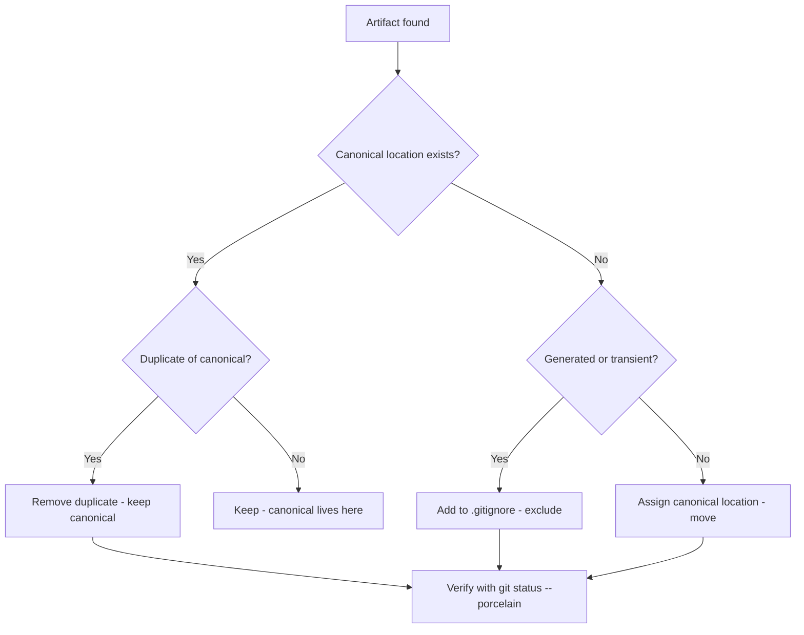
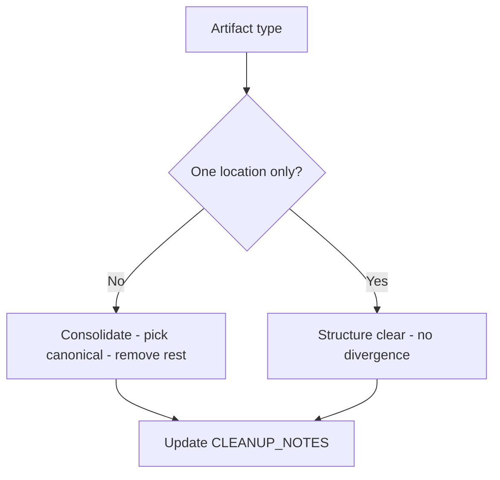
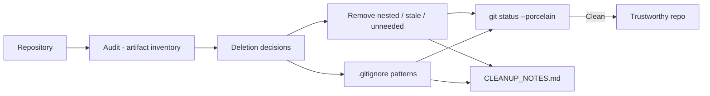

# v9.5 — Repository cleanup

| Version | Phase | Days |
|---------|-------|------|
| v9.5 | Polish & Competition Ready | Day 250-252 |

## 3. Mission

The v9.5 mission: make the repo *trustworthy* — the repository's cleanup — the nested artifacts, the calibration's logs, and the stale scripts removed — the clone's weight reduced, the reader's confusion ended, verified with the git status --porcelain — a clean repo, a trustworthy repo. The mission's three parts: the *artifacts' removal* (the nested's artifacts, the calibration's logs, the stale's scripts — the deletions' audits — the one canonical location per artifact's type); the *canonical's discipline* (the duplication's end — the one location's rule — the .gitignore for the rest — the seed's error's fix); and the *cleanup's record* (the CLEANUP_NOTES.md — the removals' and the reasons' records — the repo's health's history). The mission's proof: a clone's weight down, the structure's clarity — nobody reviews a junk drawer.

## 4. Engineering context

The project enters v9.5 with the gate's green (v9.4) but a cluttered house: the repository's artifacts (the scratch's files, the drafts, the old's binaries, the unneeded's copies — the clutter's accumulation over the journey) were uncleaned — the clone's weight (the repo's size — the artifacts' bulk), the reader's confusion (the drafts' and the unneeded's presence — the structure's noise), the maintenance's tax (the files' hunt — the repo's health) unaddressed. The phase's demands exposed the gap (Day 250-251): the release's readiness (the competition's package — the clean's branch — the judges' and the teammates' review) expects the repo's tidiness; the trust's promise (a clean repo is a trustworthy repo — nobody reviews a junk drawer — the review's speed — the confidence) demands the removal's discipline. The cleanup's pass carried its own failure: the nested artifact's directories duplicated the files — the seed's error — the copies' sprawl (the same artifact's multiple's locations — the versions' divergence — the reader's confusion — the repo's bloat), the canonical's absence.

## 5. Thought process

### 5.1 The trust's goal — what the clean's repo must deliver

The first question: what does the repo's cleanup need to deliver, mechanically? Three answers, tested against the phase's needs. The *clutter's removal*: the artifacts' deletions (the nested's, the calibration's logs, the stale's scripts — the audit's care — the deletion's safety). The *canonical's order*: the one location per artifact's type (the duplication's end — the .gitignore for the generated — the structure's clarity). The *record's trust*: the CLEANUP_NOTES (the removals' and the reasons' — the repo's health's history — the future's reference). All three demanded: the audit (the artifacts' inventory — the deletions' decisions), the canonical's rule (the locations' assignment — the .gitignore's pattern), and the record (the CLEANUP_NOTES.md). The decision: build all three, in the order — the audit, the removal, the record — the repo's tidiness, `CLEANUP_NOTES.md`.

### 5.2 The audit — the artifacts' inventory

The audit was the cleanup's skeleton: the artifacts' inventory — the deletions' decisions. The form: the repo's scan (the files' and the directories' survey — the artifacts' identification — the nested's, the logs', the stale's, the unneeded's classes); the decisions' record (each artifact's fate — the removal, the move, the keep — the reasons' notes — the safety's audit); and the verification's plan (the git status --porcelain — the removals' confirmation — the clean's state). The design decisions: the classes' identification (the artifacts' types — the nested's copies, the calibration's logs, the stale's scripts — the unneeded's recognition); the decisions' care (the deletion's safety — the versions' control — the backups' absence's confidence — the git's history's recovery); and the audit's completeness (the repo's sweep — the corners' and the hidden's files — the inventory's totality). The audit was the cleanup's plan: the artifacts' fate, the reasons' record.

### 5.3 The seed's error — the nested's duplication

The seed's error was the phase's anchor: the nested artifact's directories duplicated the files. The mechanics: the copies' sprawl (the same artifact's multiple's locations — the nested's directories — the versions' divergence — the updates' multiple's places — the reader's confusion — the repo's bloat). The symptoms, from the repo's survey (Day 250): the duplications' confusion (the same file's several's copies — which is current — the versions' divergence — the wrong's use); the bloat's weight (the copies' bulk — the clone's size — the maintenance's tax). The fix's shape, named in the skeleton: *the one canonical location per artifact's type; the .gitignore for the rest* — the canonical's discipline — the single's home (each artifact's type's one location — the divergence's end — the updates' one place), the .gitignore's pattern (the generated's and the logs' and the transient's exclusion — the repo's health). The lesson's shape: *cleanup is a feature: it protects the release's branch* — the cleanup's value.

### 5.4 The canonical's discipline — the one location's rule

The canonical's discipline became the cleanup's third axis: the one location per artifact's type — the duplication's end. The form: the locations' assignment (each artifact's type's canonical's home — the config's, the tests', the docs', the history's — the structure's map); the .gitignore's patterns (the generated's, the logs', the transient's, the calibration's outputs — the exclusion's rules — the repo's health's guard); and the verification's loop (the git status --porcelain — the untracked's check — the ignore's effectiveness — the clean's state's proof). The design decisions: the canonical's map (the structure's clarity — the reader's paths — the v9.3's docs' complement); the .gitignore's completeness (the patterns' coverage — the artifacts' exclusion — the future's additions); and the verification's frequency (the clean's checks — the releases' hygiene — the discipline's permanence). The discipline's promise: the duplication's end (the one location's truth — the divergence's absence), the repo's weight (the artifacts' exclusion — the clone's lightness), and the seed's fix (the canonical's rule).

### 5.5 The record — the CLEANUP_NOTES's history

The record became the cleanup's memory: the CLEANUP_NOTES.md — the removals' and the reasons' records. The form: the removals' log (each removal's entry — the artifact, the reason, the date — the history's record); the canonical's map (the locations' assignments — the structure's reference — the future's guide); and the hygiene's rules (the artifacts' prevention — the .gitignore's patterns — the canonical's discipline — the future's cleanliness). The design decisions: the record's completeness (the removals' totality — the reasons' clarity — the future's trust); the reference's usefulness (the structure's map — the future's placement — the guide's value); and the maintenance's rule (the future's cleanups' entries — the record's continuation — the v9.2's catalog's pattern). The record's promise: the history's trust (the removals' reasons — the future's confidence), the discipline's permanence (the hygiene's rules — the cleanliness's continuation).

### 5.6 The clean's verification — the porcelain's truth

The verification decided the mission's success: the git status --porcelain — the clean's state's proof. The design decisions: the verification's form (the porcelain's output — the untracked's and the modified's absence — the clean's truth — the removal's confirmation); the verification's timing (the cleanup's end — the release's checks — the hygiene's gate); and the trust's proof (the reviewers' confidence — the clone's weight — the reader's clarity — the trustworthy's repo). The verification's promise: the removal's proof (the porcelain's clean), the repo's trust (the reviewers' ease — the release's readiness).

## 6. Decision flowchart

The artifact's fate's decision (the deletion's safety):

The canonical's discipline's decision (the structure's truth):

## 7. Implementation blueprint

The blueprint, in the build's order:

1. **The audit** — the repo's scan (the artifacts' inventory — the nested's, the calibration's logs, the stale's scripts, the unneeded's classes), the decisions' record (each artifact's fate — the removal, the move, the keep — the reasons).
2. **The canonical's map** — the one location per artifact's type (the structure's assignments — the divergence's end).
3. **The removals** — the nested's duplicates and the stale's scripts and the unneeded's files' deletions — the seed's error's fix.
4. **The .gitignore's patterns** — the generated's, the logs', the transient's, the calibration's outputs' exclusion — the repo's health's guard.
5. **The CLEANUP_NOTES.md** — the removals' log (the artifact, the reason, the date), the canonical's map, the hygiene's rules.
6. **The verification** — the git status --porcelain's clean — the removal's confirmation — the trust's proof.

The blueprint's order follows the dependencies: the audit first (the plan), the canonical's map next (the structure), the removals and the .gitignore after (the action), the record and the verification last (the memory, the proof).

## 8. Architecture flowchart

The cleanup's flow:

The diagram is the cleanup's flow, complete: the repository's scan into the audit's inventory, the deletion's decisions into the removals and the .gitignore's patterns, the porcelain's verification into the trustworthy's repo, the removals' and the patterns' records into the CLEANUP_NOTES — the repo's tidiness wired into the release's readiness.

---

## 9. Errors, failures, and root-cause analysis

### Error 1: the nested's duplication — the seed's error, the copies' sprawl

**Symptom.** Day 250, the repo's survey: the nested artifact's directories *duplicated the files* — the copies' sprawl (the same artifact's multiple's locations — the nested's directories — the versions' divergence — the updates' multiple's places — the reader's confusion — the repo's bloat), the canonical's absence (the current's identification's impossibility — the wrong's use).

**Initial hypotheses.** We suspected the copies' sources. We suspected the directories' nesting. We suspected the versions' divergence.

**Investigation.** The canonical's absence was the diagnosis: the copies' sprawl (the same artifact's multiple's homes — the divergence — the confusion) cannot serve the trust's promise, and the fix is the canonical's discipline — the one location per artifact's type (the single's home — the divergence's end), the .gitignore for the rest (the generated's and the logs' and the transient's exclusion) (AC2): the seed's error's class — the structure's sprawl. The lesson's shape: cleanup is a feature — it protects the release's branch.

**Root cause.** The canonical's absence: the multiple's homes — the divergence — the confusion — the bloat.

**Fix.** The canonical's discipline (the shipped cleanup): the one location per artifact's type — the duplicates' removal — the .gitignore's patterns (AC2). The re-test: the inventory's scan — the duplicates' absence — the structure's clarity, the sprawl's state preserved as the reference.

**Prevention.** The rule became the version's headline: *cleanup is a feature — it protects the release's branch — the canonical's location is the duplication's end, and the sprawl is the confusion's source* — the canonical's test (AC2) joined the regression, with the sprawl's survey preserved as the reference.

### Error 2: the deletion's overreach — the needed's removal

**Symptom.** Day 251, the removals' pass: the cleanup *removed the needed* — the overreach (the artifact's misclassification — the calibration's script still useful — the stale's judgment wrong — the needed's file deleted — the function's loss — the recovery's hassle from the git's history), the trust's setback.

**Initial hypotheses.** We suspected the classifications. We suspected the deletions' decisions. We suspected the audit's care.

**Investigation.** The decisions' care was the diagnosis: the deletions' safety (the function's preservation — AC1) demands the decisions' audit (each artifact's classification's care — the stale's verification — the needed's recognition — the deletion's caution), and the overreach (the needed's removal) is the trust's setback: the decisions' review (the classifications' audit — the deletions' confirmation — AC1) is the cleanup's safety. The fix: the decisions' review (the classifications' care — the deletions' caution — the recovery's readiness).

**Root cause.** The overreach's judgment: the misclassification — the needed's deletion — the function's loss.

**Fix.** The decisions' audit (the shipped cleanup): the classifications' review — the stale's verification — the deletion's caution (AC1). The re-test: the inventory's audit — the needed's preservation — the safety's truth, the overreach's counter-case preserved.

**Prevention.** The rule: *the cleanup's safety is the decisions' care — the overreach is the function's loss, and the audit is the needed's preservation* — the decisions' test (AC1) joined the regression, with the overreach's run preserved as the reference.

### Error 3: the .gitignore's gaps — the artifacts' return

**Symptom.** Day 251, the runs' aftermath: the .gitignore's *patterns missed the artifacts* — the generated's and the logs' and the calibration's outputs (the unlisted's patterns — the untracked's reappearance — the porcelain's noise — the clean's promise's decay), the hygiene's failure.

**Initial hypotheses.** We suspected the patterns' coverage. We suspected the outputs' types. We suspected the ignores' lists.

**Investigation.** The patterns' completeness was the diagnosis: the repo's health (the clean's state's permanence — AC3) demands the .gitignore's coverage (the generated's, the logs', the transient's, the calibration's outputs' patterns — the untracked's exclusion), and the gaps (the unlisted's reappearance — the porcelain's noise) are the hygiene's failure: the patterns' audit (the run's outputs' survey — the patterns' additions — the porcelain's verification — AC3) is the ignore's completeness. The fix: the patterns' completion (the run's outputs' patterns — the porcelain's verification).

**Root cause.** The patterns' gaps: the unlisted's reappearance — the porcelain's noise — the clean's decay.

**Fix.** The patterns' audit (the shipped cleanup): the generated's and the logs' and the transient's patterns — the porcelain's verification (AC3). The re-test: the runs' outputs — the untracked's absence — the clean's state, the gaps' counter-case preserved.

**Prevention.** The rule: *the repo's health is the .gitignore's coverage — the pattern's gap is the artifact's return, and the audit is the clean's permanence* — the patterns' test (AC3) joined the regression, with the gaps' run preserved as the reference.

### Error 4: the record's gaps — the removals' unexplained

**Symptom.** Day 252, the record's review: the CLEANUP_NOTES' *entries were incomplete* — the removals' log's gaps (the deletions without the reasons — the dates' absence — the future's confusion — the why's of the removals lost — the trust's erosion), the record's worthlessness.

**Initial hypotheses.** We suspected the records' fields. We suspected the removals' logs. We suspected the review's coverage.

**Investigation.** The reasons' record was the diagnosis: the CLEANUP_NOTES' value (the future's trust — the hygiene's guidance — AC4) demands the entries' completeness (the artifact, the reason, the date — the removals' log's fullness), and the gaps (the unexplained's deletions — the why's loss) are the trust's erosion: the record's audit (the entries' fields' checks — the gaps' fills — AC4) is the history's truth. The fix: the record's completion (the entries' fields' fills — the reasons' clarity).

**Root cause.** The reasons' absence: the unexplained's removals — the why's loss — the trust's erosion.

**Fix.** The record's discipline (the shipped notes): the entries' fields — the artifact, the reason, the date — the removals' log's fullness (AC4). The re-test: the record's review — the reasons' clarity — the trust's keeping, the gaps' counter-case preserved.

**Prevention.** The rule: *the record's worth is the reasons' clarity — the unexplained's removal is the trust's erosion, and the entry's fullness is the history's truth* — the record's test (AC4) joined the regression, with the gaps' draft preserved as the reference.

### Error 5: the hygiene's decay — the cleanup's one-time nature

**Symptom.** Day 252, the phase's end: the *hygiene decayed* — the cleanup's one-time pass (the future's artifacts — the new's additions without the canonical's check — the clutter's return — the trust's promise's decay), the discipline's permanence's failure.

**Initial hypotheses.** We suspected the additions' paths. We suspected the hygiene's rules. We suspected the maintenance's discipline.

**Investigation.** The discipline's permanence was the diagnosis: the clean's promise (the release's branch's protection — AC5) demands the hygiene's maintenance (the future's artifacts' canonical's checks — the .gitignore's additions — the clean's reviews — the discipline's continuation), and the one-time's nature (the decay — the clutter's return) is the promise's failure: the hygiene's rule (the additions' canonical's check — the clean's verification — AC5) is the tidiness's permanence. The fix: the hygiene's rule (the future's checks — the clean's reviews — the discipline's continuation).

**Root cause.** The one-time's nature: the future's clutter — the clean's decay — the promise's failure.

**Fix.** The hygiene's discipline (the shipped cleanup): the additions' canonical's checks — the clean's verification's reviews (AC5). The re-test: the future's additions — the clean's keeping — the trust's permanence, the decay's counter-case preserved.

**Prevention.** The rule: *the clean's promise is the hygiene's permanence — the one-time's pass is the clutter's return, and the review is the tidiness's continuation* — the hygiene's test (AC5) joined the regression, with the decay's run preserved as the reference.

---

## 10. Verification and metrics

**AC1 — the deletion's safety.** The removals' decisions audited — the needed's preservation — the git's history's recovery — the function's loss' absence. Passed.

**AC2 — the canonical's order.** The one location per artifact's type — the duplicates' absence — the structure's clarity — the seed's error's fix verified. Passed.

**AC3 — the .gitignore's coverage.** The generated's, the logs', the transient's, the calibration's outputs' exclusion — the porcelain's clean state. Passed.

**AC4 — the record's truth.** The CLEANUP_NOTES' entries complete — the artifact, the reason, the date — the future's reference. Passed.

**AC5 — the chain and the phase's regressions.** v6.0-v9.4's suites unchanged, with the porcelain's verification clean — the release's readiness. Passed.

**The cleanup's provenance.** The measurements on Day 250-252: the inventory's counts (the removals' and the keeps'), the porcelain's states (the clean's verification), the record's audits (the entries' fullness) documented in the CLEANUP_NOTES.md.

**Cost.** Runtime: none (the repo's health's zero cost at the run). Development: three days, with the errors' lessons (the canonical's location, the decisions' care, the patterns' coverage, the reasons' record, the hygiene's permanence) now permanent checklist items.

**What we trusted afterwards and what we still distrusted.** We trusted the *repo's tidiness* completely — the audit, the canonical, the record, each proven by its test. We trusted the porcelain's clean as the release's readiness. We still distrusted three things: the *integration's tests* (the hardware's truth — pending v9.6); the *bug's batch's fixes* (the pending's corrections — pending v9.7); and the *performance's headroom* (the CPU's budget — pending v9.8). Each is a named, written debt — the phase's rule.

---

## 11. Lessons learned — permanent mental models

**Lesson 1 — cleanup is a feature: it protects the release's branch.** The seed's lesson: the nested's sprawl confused and bloated the repo. The permanent practice: the canonical's location — the one home per artifact — the structure's clarity.

**Lesson 2 — the cleanup's safety is the decisions' care.** The overreach removed the needed. The permanent rule: the classifications' audit — the stale's verification — the deletion's caution.

**Lesson 3 — the repo's health is the .gitignore's coverage.** The pattern's gap returned the artifacts. The permanent model: the generated's and the logs' and the transient's patterns — the porcelain's clean.

**Lesson 4 — the record's worth is the reasons' clarity.** The unexplained's removal eroded the trust. The permanent practice: the entries' fullness — the artifact, the reason, the date.

**Lesson 5 — the clean's promise is the hygiene's permanence.** The one-time's pass decayed into the clutter. The permanent rule: the additions' canonical's checks — the clean's reviews — the tidiness's continuation.

**Lesson 6 — a clean repo is a trustworthy repo.** The reviewers' confidence follows the structure's clarity. The permanent practice: the repo's tidiness as the release's readiness.

---

## 12. Code in this snapshot

`CLEANUP_NOTES.md`

---

## 13. Bridge to the next version

What v9.5 unlocks is the repo's trust: the repository's cleanup — the nested artifacts, the calibration's logs, and the stale scripts removed — the one canonical location per artifact's type, the .gitignore for the rest, the CLEANUP_NOTES.md with the removals' and the reasons' records — verified with the git status --porcelain — a clean repo, a trustworthy repo. Three capabilities travel forward. First, the tidiness itself — the audit, the canonical, the record — the release's branch's protection. Second, the *discipline*: the canonical's location (the duplication's end), the decisions' care (the needed's preservation), the patterns' coverage (the clean's permanence), the reasons' record (the history's truth), the hygiene's permanence (the tidiness's continuation) — the phase's quality bar, now complete across the repository's layer. Third, the *trust's pattern*: the clean's state with the hygiene's review — the pattern the integration's testing (the hardware's truth) will follow.

The known debt, stated plainly: the integration's tests (the hardware's truth); the bug's batch's fixes (the pending's corrections); the performance's headroom (the CPU's budget); and the *integration's testing*: the robot's hardware's truth (the sensors' readings — the ToFs' and the IMU's and the camera's actuals — the motors' commands — the wiring's correctness) is untested in the automated's sense — the pure-logic's suites (v9.4's CI) cover the math but not the hardware's integration (the sensors' wiring's errors, the I2C's addresses' mismatches, the serial's link's faults — the pit lane's discoveries), the integration's test (the test_sensors.py — the --simulate's flag — the hardware's live's checks — the fast's tests everywhere, the slow's tests before the robot) unbuilt. The next problem — the one v9.6 (Day 253-255) must attack — is that testing: *the integration's test — the test_sensors.py (the --simulate's mode — the mock's readings — the CI's runs; the live's mode — the real's sensors — the pit lane's runs), the hardware's checks (the sensors' readings' sanity — the wiring's and the addresses' verification — the serial's link's test)*. The repo is tidy; the *hardware's truth* must be proven before the field. That is the work of the next three days.
