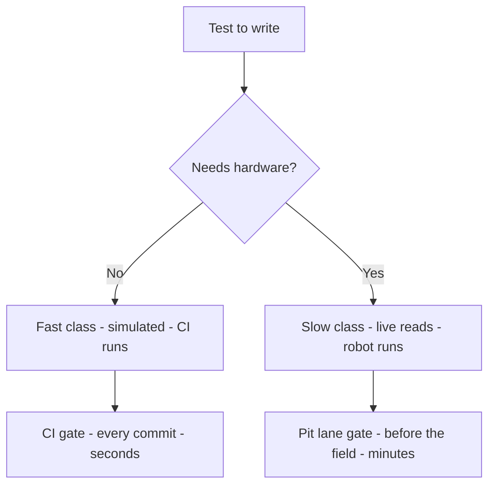
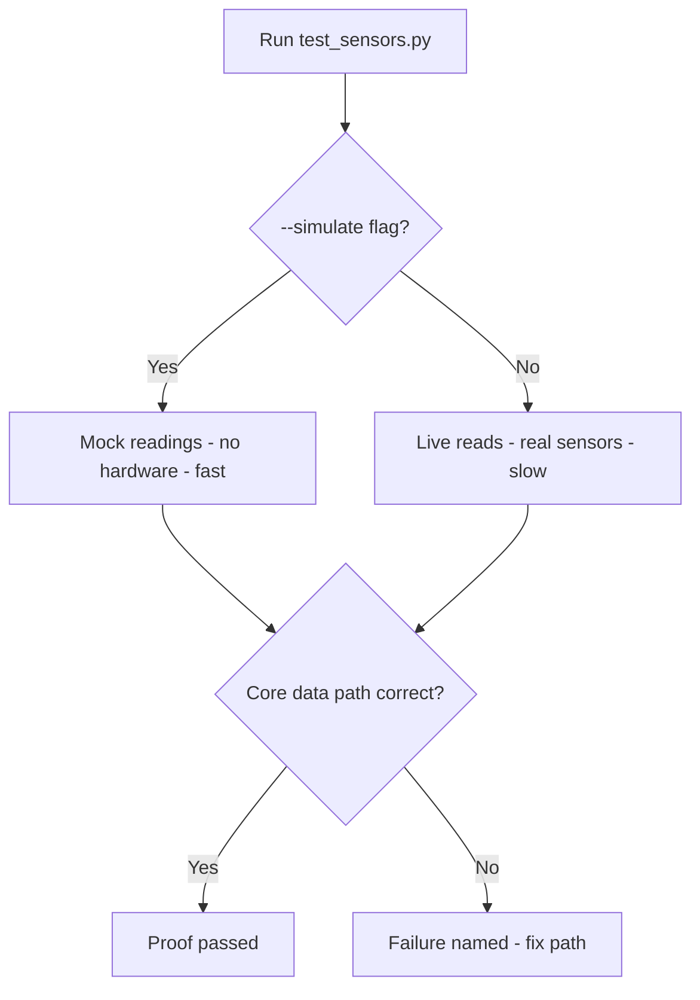
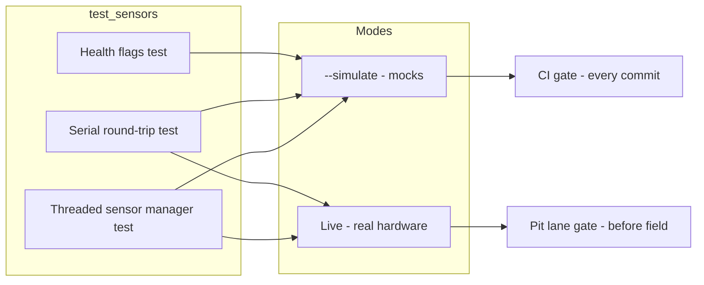

# v9.6 — Integration test

| Version | Phase | Days |
|---------|-------|------|
| v9.6 | Polish & Competition Ready | Day 253-255 |

## 3. Mission

The v9.6 mission: give the repo a *core data path's proof* — the integration's test — the test_sensors.py exercising the threaded sensor's manager, the serial's protocol's encode/decode round-trip, and the health's flags without the hardware (the --simulate) — every commit proving the core data path still works before it reaches the robot. The mission's three parts: the *integration's suite* (the threaded sensor's manager's exercise — the reads' flow; the serial's round-trip — the encode/decode's pairs; the health's flags — the liveness's checks — all without the hardware); the *speed's discipline* (the fast's and the slow's classes — the pure-logic's suite in the CI — the hardware's tests before the robot — the seed's error's fix — the 5-minute suite's end); and the *gate's extension* (the CI's integration's suite — the core's path's proof at every commit — the pit lane's discoveries' end). The mission's proof: the core's data path proven at every commit — the tests fast everywhere, the slow ones before the robot.

## 4. Engineering context

The project enters v9.6 with the repo's trust (v9.5) but a hardware's blind spot: the robot's hardware's truth was untested in the automated's sense — the pure-logic's suites (v9.4's CI) covered the math but not the hardware's integration (the sensors' wiring's errors, the I2C's addresses' mismatches, the serial's link's faults — the pit lane's discoveries), the integration's testing unbuilt. The phase's demands exposed the gap (Day 253-254): the competition's pit lane (the last-minute's checks — the field's failures) expects the integration's proof before the arrival; the commit's discipline (every change's core's path's verification) expects the automated's suite. The testing's speed carried its own failure: the full suite took 5 minutes on the Pi — the seed's error — the hardware's tests' slowness (the sensors' reads' waits — the serial's timeouts — the suite's drag — the CI's infeasibility — the gate's bypass — the tests' skipped), the speed's discipline absent.

## 5. Thought process

### 5.1 The proof's goal — what the integration's test must cover

The first question: what does the core's data path's proof need to cover, mechanically? Three answers, tested against the phase's needs. The *sensors' flow*: the threaded sensor's manager's exercise (the reads' cadence — the latest's values — the atomic's flags — the v8.7's architecture's truth). The *protocol's truth*: the serial's round-trip (the encode/decode's pairs — the CRC8's verification — the commands' fidelity — the v8.9's protocol's truth). The *health's flags*: the liveness's checks (the v8.8's heartbeats — the flags' flows — the monitor's truth). All three demanded: the integration's suite (the three exercises — the simulated's mode), the speed's classes (the fast's and the slow's), and the gate's integration (the CI's run). The decision: build all three, in the order — the suite, the classes, the gate — the core's proof, `test_sensors.py`.

### 5.2 The integration's suite — the three exercises

The integration's suite was the proof's core: the three exercises without the hardware. The form — the test_sensors.py: the threaded sensor's manager's exercise (the manager's launch in the simulated's mode — the reads' cadence's observation — the latest's values' verification — the flags' freshness); the serial's round-trip (the encoder's build — the decoder's parse — the command's fidelity — the CRC8's verification — the corrupted's packet's rejection); the health's flags (the heartbeats' flow — the liveness's signals — the flags' settings — the v8.8's monitor's inputs). The design decisions: the simulation's mode (the --simulate's flag — the mock's readings — the sensors' and the motors' stubs — the hardware's absence); the exercises' integration (the three flows' joint's run — the core's path's end-to-end — the data's journey's proof); and the assertions' depth (the values' checks — the flags' states — the round-trips' fidelity — the failures' clarity). The suite was the proof's substance: the core's path exercised end-to-end.

### 5.3 The seed's error — the 5-minute's suite

The seed's error was the phase's anchor: the full suite took 5 minutes on the Pi. The mechanics: the hardware's tests' slowness (the sensors' reads' waits (the I2C's polling — the timeouts), the serial's round-trips' waits (the baud's rates — the bytes' flows), the camera's captures' waits — the suite's drag — the 5 minutes' total) — the CI's infeasibility (the every-commit's run's impossibility — the gate's bypass — the tests' skipped — the proof's absence). The symptoms, from the first suites (Day 253): the CI's timeout (the suite's run's hours' scale — the pipeline's red — the gate's uselessness); the tests' skipping (the slowness's workaround — the proof's loss — the regressions' return). The fix's shape, named in the skeleton: *marked the hardware tests as slow and ran the pure-logic's suite in the CI* — the speed's classes (the fast's — the pure-logic's and the simulated's — the CI's run; the slow's — the hardware's — the robot's runs), the gate's speed (the fast's suite's minutes' to the seconds — the every-commit's proof). The lesson's shape: *fast tests run everywhere; slow tests run before the robot* — the speed's discipline.

### 5.4 The speed's classes — the fast's and the slow's

The speed's classes became the suite's third axis: the tests' partitioning — the runs' truths. The form: the fast's class (the pure-logic's and the simulated's tests — the seconds' run — the CI's every-commit's proof — the v9.4's gate's content); the slow's class (the hardware's tests — the sensors' live's reads — the motors' commands — the minutes' run — the robot's pit lane's proof); and the marker's discipline (the slow's annotations — the runs' selections — the --simulate's and the live's modes — the classes' clarity). The design decisions: the classes' boundaries (the hardware's dependence — the fast's simulation — the slow's liveness — the partitioning's correctness); the runs' rules (the CI's fast's only — the robot's slow's before the field — the discipline's binding); and the coverage's maintenance (the new's tests' classes' assignments — the speed's audits — the suite's health). The discipline's promise: the gate's speed (the CI's seconds — the every-commit's proof), the hardware's truth (the slow's before the robot), and the seed's fix (the classes' partitioning).

### 5.5 The gate's integration — the commit's proof

The gate's integration decided the mission's value: the core's path's proof at every commit. The form: the CI's integration (the test_sensors.py's fast's suite in the v9.4's workflow — the new's step — the core's path's gate); the failure's clarity (the red's checks — the exercised flow's name — the fix's path); and the pit lane's discipline (the slow's suite's runs before the field — the hardware's truth's final's check). The design decisions: the gate's order (the syntax's and the lint's first — the integration's suite's after — the failures' speed); the suite's portability (the --simulate's default — the CI's runner's compatibility — the v9.4's parity's pattern); and the evidence's record (the runs' logs — the proofs' history — the trust's basis). The integration's promise: the commit's proof (the core's path's every-change's verification), the pit lane's calm (the hardware's truth's pre-check).

### 5.6 The verification — the proof's runs

The verification decided the mission's success: the suite's runs — the proof's confirmation. The form: the fast's run's verification (the CI's run — the seconds' duration — the core's path's green); the slow's run's verification (the robot's run — the hardware's truths — the readings' sanity — the round-trips' liveness); and the regressions' watch (the injected's failures — the suite's catches — the proof's sensitivity). The design decisions: the catches' depth (the injected's break's detection — the assertions' sensitivity — the proof's truth); the runs' records (the evidence's logs — the trust's basis); and the discipline's maintenance (the suite's updates — the speed's audits — the proof's permanence). The verification's promise: the core's path's proof (the fast's everywhere, the slow's before the robot), the regressions' end (the injected's catches).

## 6. Decision flowchart

The tests' class's decision (the speed's discipline):

The run's selection's decision (the suite's truth):

## 7. Implementation blueprint

The blueprint, in the build's order:

1. **The suite's skeleton** — test_sensors.py — the three exercises' structure (the sensor's manager's, the serial's round-trip's, the health's flags').
2. **The --simulate's mode** — the mock's readings (the sensors' and the motors' stubs — the hardware's absence) — the CI's portability.
3. **The exercises** — the threaded sensor's manager's test (the reads' cadence — the latest's values — the flags' freshness); the serial's round-trip's test (the encode/decode's pairs — the CRC8's verification — the corrupted's rejection); the health's flags' test (the heartbeats' flows — the liveness's signals).
4. **The speed's classes** — the fast's (the simulated's — the CI's), the slow's (the hardware's — the robot's) — the markers — the seed's error's fix.
5. **The gate's integration** — the CI's workflow's step (the fast's suite's run — the every-commit's proof).
6. **The verification** — the fast's run's green (the seconds), the slow's run's truth (the hardware's), the injected's failures' catches.

The blueprint's order follows the dependencies: the suite's skeleton first (the exercises' homes), the --simulate's mode next (the portability), the exercises after (the proof's substance), the speed's classes and the gate's integration and the verification last (the discipline, the gate, the proof).

## 8. Architecture flowchart

The integration's test's place:

The diagram is the integration's test's place, complete: the three exercises (the sensor's manager's, the serial's round-trip's, the health's flags') running in the simulated's mode for the CI's gate and in the live's mode for the pit lane's gate — the core's data path's proof wired into the commit's and the field's trust.

---

## 9. Errors, failures, and root-cause analysis

### Error 1: the 5-minute's suite — the seed's error, the gate's drag

**Symptom.** Day 253, the first suites: the full suite *took 5 minutes on the Pi* — the CI's infeasibility (the every-commit's run's impossibility — the gate's bypass — the tests' skipped — the proof's absence), the hardware's waits (the sensors' reads' — the serial's timeouts' — the suite's drag).

**Initial hypotheses.** We suspected the tests' count. We suspected the hardware's waits. We suspected the suite's structure.

**Investigation.** The speed's classes were the diagnosis: the hardware's tests' slowness (the reads' and the timeouts' waits — the 5 minutes' total) cannot run at every commit, and the fix is the partitioning — the fast's class (the simulated's — the CI's seconds) and the slow's class (the hardware's — the robot's minutes) (AC3): the seed's error's class — the uniform's suite's drag. The lesson's shape: fast tests run everywhere; slow tests run before the robot.

**Root cause.** The uniform's suite: the hardware's waits — the gate's drag — the tests' skipping — the proof's loss.

**Fix.** The speed's classes (the shipped suite): the fast's simulated's tests in the CI — the slow's hardware's tests before the robot (AC3). The re-test: the CI's seconds' run — the gate's speed — the proof's return, the 5-minute's suite preserved as the reference.

**Prevention.** The rule became the version's headline: *fast tests run everywhere; slow tests run before the robot — the speed's classes are the gate's truth, and the uniform's suite is the proof's loss* — the classes' test (AC3) joined the regression, with the slow's suite preserved as the reference.

### Error 2: the simulate's leak — the mock's hardware's call

**Symptom.** Day 254, the CI's first run: the simulated's mode *leaked into the hardware* — the mock's incompleteness (the stubs' gaps — the I2C's calls' leaks — the real's sensor's access in the simulated's run — the CI's runner's absence — the suite's hangs — the gate's red), the portability's failure.

**Initial hypotheses.** We suspected the stubs' coverage. We suspected the managers' paths. We suspected the simulate's flags.

**Investigation.** The mocks' completeness was the diagnosis: the simulated's mode's promise (the CI's portability — the hardware's absence — AC1) demands the mocks' totality (the stubs' coverage of the hardware's paths — the I2C's and the serial's and the camera's stubs — the leaks' absence), and the leak (the real's access — the hang — the red) is the portability's failure: the mocks' audit (the hardware's calls' inventory — the stubs' coverage — the leaks' hunt — AC1) is the simulation's truth. The fix: the mocks' completion (the hardware's paths' stubs — the leaks' elimination).

**Root cause.** The mocks' gaps: the hardware's calls' leaks — the hangs — the gate's red.

**Fix.** The mocks' audit (the shipped suite): the hardware's paths' stubs — the leaks' elimination (AC1). The re-test: the CI's run — the hardware's absence — the green's gate, the leak's counter-case preserved.

**Prevention.** The rule: *the simulation's truth is the mocks' totality — the stub's gap is the hardware's leak, and the audit is the portability's keeper* — the mocks' test (AC1) joined the regression, with the leak's run preserved as the reference.

### Error 3: the round-trip's blind spot — the corruption's pass

**Symptom.** Day 254, the round-trip's tests: the serial's *round-trip missed the corruption* — the test's blind spot (the encode/decode's happy path only — the corrupted's packet's acceptance — the CRC8's rejection untested — the v8.9's guarantee unproven), the protocol's truth's gap.

**Initial hypotheses.** We suspected the tests' coverage. We suspected the round-trip's paths. We suspected the assertions' depth.

**Investigation.** The corruption's test was the diagnosis: the round-trip's proof (the protocol's truth — AC2) demands the corrupted's path's test (the bit's flips' injection — the CRC8's rejection's verification — the guarantee's proof), and the happy path's only (the blind spot — the unproven's rejection) is the truth's gap: the round-trip's completion (the corruption's tests — the rejections' assertions — AC2) is the protocol's proof's fullness. The fix: the round-trip's completion (the corruption's tests — the rejections' verification).

**Root cause.** The happy path's only: the corruption's untested — the rejection's unproven — the truth's gap.

**Fix.** The corruption's tests (the shipped suite): the bit's flips' injection — the CRC8's rejections' assertions (AC2). The re-test: the corruption's catches — the rejection's proof — the protocol's truth, the blind spot's counter-case preserved.

**Prevention.** The rule: *the round-trip's proof is the corruption's test — the happy path's only is the truth's gap, and the rejection's assertion is the guarantee's proof* — the round-trip's test (AC2) joined the regression, with the blind spot's run preserved as the reference.

### Error 4: the health's flags' staleness — the liveness's untested

**Symptom.** Day 255, the health's tests: the health's *flags' exercise missed the staleness* — the liveness's test (the heartbeats' flow's observation only — the missed's and the stale's paths' untested — the v8.8's hysteresis's truth unproven), the monitor's proof's gap.

**Initial hypotheses.** We suspected the flags' paths. We suspected the health's tests. We suspected the assertions' scope.

**Investigation.** The staleness's test was the diagnosis: the health's flags' proof (the monitor's truth — AC4) demands the staleness's paths' tests (the missed's heartbeats' injection — the hysteresis's declaration — the recovery's restoration — the v8.8's guarantees' proofs), and the flow's only (the liveness's untested paths — the proof's gap) is the monitor's truth's incompleteness: the flags' completion (the staleness's and the recovery's tests — the assertions — AC4) is the health's proof's fullness. The fix: the flags' completion (the missed's and the stale's and the recovery's tests).

**Root cause.** The flow's only: the staleness's untested — the hysteresis's unproven — the proof's gap.

**Fix.** The staleness's tests (the shipped suite): the missed's heartbeats' injection — the declaration's and the recovery's assertions (AC4). The re-test: the staleness's catches — the hysteresis's proof — the monitor's truth, the gap's counter-case preserved.

**Prevention.** The rule: *the health's proof is the staleness's test — the flow's only is the monitor's gap, and the hysteresis's assertion is the liveness's truth* — the flags' test (AC4) joined the regression, with the gap's run preserved as the reference.

### Error 5: the slow's skip — the field's blindness

**Symptom.** Day 255, the phase's end: the *slow's suite was skipped* — the pit lane's discipline's absence (the hardware's tests' runs unbound — the field's morning's hurry — the skip — the hardware's truth unproven — the pit lane's discovery), the lesson's promise's decay.

**Initial hypotheses.** We suspected the runs' rules. We suspected the discipline's binding. We suspected the field's habits.

**Investigation.** The slow's binding was the diagnosis: the lesson's promise (the slow's tests before the robot — AC5) demands the discipline's binding (the pit lane's checklist — the slow's suite's required's run — the hardware's proof before the field), and the skip (the unbound's runs — the field's blindness) is the promise's decay: the discipline's rule (the field's checklist — the slow's suite's binding — AC5) is the lesson's keeping. The fix: the discipline's rule (the pit lane's checklist — the slow's run's binding).

**Root cause.** The runs' unbound: the skip — the hardware's truth's absence — the pit lane's discovery.

**Fix.** The discipline's binding (the shipped suite): the pit lane's checklist — the slow's suite's required's run (AC5). The re-test: the field's rehearsal — the slow's run — the hardware's proof, the skip's counter-case preserved.

**Prevention.** The rule: *the lesson's promise is the slow's binding — the unbound's skip is the field's blindness, and the checklist is the hardware's proof* — the discipline's test (AC5) joined the regression, with the skip's run preserved as the reference.

---

## 10. Verification and metrics

**AC1 — the simulation's truth.** The --simulate's mode with the complete mocks — the hardware's leaks' absence — the CI's portability. Passed.

**AC2 — the round-trip's proof.** The encode/decode's pairs — the CRC8's verification — the corruption's rejection's tests — the protocol's truth. Passed.

**AC3 — the speed's classes.** The fast's simulated's suite in the CI (the seconds) — the slow's hardware's suite before the robot (the minutes) — the seed's error's fix verified. Passed.

**AC4 — the health's proof.** The heartbeats' flows — the staleness's and the recovery's tests — the hysteresis's truth. Passed.

**AC5 — the chain and the phase's regressions.** v6.0-v9.5's suites unchanged, with the core's data path's proof at every commit — the pit lane's discipline. Passed.

**The suite's provenance.** The measurements on Day 253-255: the suite's durations (the fast's seconds vs the slow's minutes), the mocks' audits (the leaks' counts), the corruption's and the staleness's catches (the proofs' depths) documented next to the suite's structure.

**Cost.** Runtime: the seconds per CI's run (the fast's suite). Development: three days, with the errors' lessons (the speed's classes, the mocks' totality, the corruption's tests, the staleness's tests, the slow's binding) now permanent checklist items.

**What we trusted afterwards and what we still distrusted.** We trusted the *integration's proof* completely — the suite, the classes, the gate, each proven by its test. We trusted the fast's everywhere and the slow's before the robot. We still distrusted three things: the *bug's batch's fixes* (the pending's corrections — pending v9.7); the *performance's headroom* (the CPU's budget — pending v9.8); and the *release's packaging* (the final's bundle — pending v9.9). Each is a named, written debt — the phase's rule.

---

## 11. Lessons learned — permanent mental models

**Lesson 1 — fast tests run everywhere; slow tests run before the robot.** The seed's lesson: the 5-minute's suite killed the gate. The permanent practice: the speed's classes — the simulated's in the CI, the hardware's at the field.

**Lesson 2 — the simulation's truth is the mocks' totality.** The stub's gap leaked into the hardware. The permanent rule: the mocks' audit — the hardware's paths' stubs — the leaks' elimination.

**Lesson 3 — the round-trip's proof is the corruption's test.** The happy path's only left the rejection unproven. The permanent model: the bit's flips' injection — the CRC8's rejections' assertions.

**Lesson 4 — the health's proof is the staleness's test.** The flow's only missed the hysteresis's truth. The permanent practice: the missed's heartbeats' injection — the declaration's and the recovery's assertions.

**Lesson 5 — the lesson's promise is the slow's binding.** The unbound's skip blinded the field. The permanent rule: the pit lane's checklist — the hardware's proof before the field.

**Lesson 6 — the core's path's proof is the commit's trust.** The exercised flow at every change is the regression's guard. The permanent practice: the integration's suite as the gate's content.

---

## 12. Code in this snapshot

`test_sensors.py`

---

## 13. Bridge to the next version

What v9.6 unlocks is the core's data path's proof: the test_sensors.py — the threaded sensor's manager's exercise, the serial's protocol's encode/decode round-trip, the health's flags — without the hardware (the --simulate) — the speed's classes (the fast's everywhere, the slow's before the robot) — every commit proving the core's path still works. Three capabilities travel forward. First, the integration's suite itself — the exercises, the mocks, the classes — the gate's content. Second, the *discipline*: the speed's classes (the gate's truth), the mocks' totality (the simulation's truth), the corruption's tests (the protocol's proof), the staleness's tests (the liveness's truth), the slow's binding (the field's proof) — the phase's quality bar, now complete across the testing's layer. Third, the *proof's pattern*: the exercised path with the speed's classes — the pattern the bug's fixes (the corrections' verifications) will follow.

The known debt, stated plainly: the bug's batch's fixes (the pending's corrections); the performance's headroom (the CPU's budget); the release's packaging (the final's bundle); and the *bug's batch's fixes*: the codebase's known's defects (the layer1_sensors.py's and the serial_protocol.py's accumulated's bugs — the off-by-one's packet's parsing, the STBY's read's fault, the div-by-zero's guards, the clamp's order, the flag's defaults — the 12 bugs of the journey's residue) are unfixed — the defects' catalog (the v9.2's entries — the known's and the pending's) unclosed, the fixes' batch (the 12 corrections — the verifications' tests — the catalog's closing) unbuilt. The next problem — the one v9.7 (Day 256-258) must attack — is that batch: *the 12 bug fixes — the layer1_sensors.py's and the serial_protocol.py's corrections (the off-by-one's packet's parsing, the STBY's read's fault, the div-by-zero's guards, the clamp's order, the flag's defaults — the seeds' error: the div-by-zero when the sensor returned exactly the 0 mm), the verifications (the tests' additions — the catalog's entries' closing)*. The core's path is proven; the *known's defects* must be closed. That is the work of the next three days.
