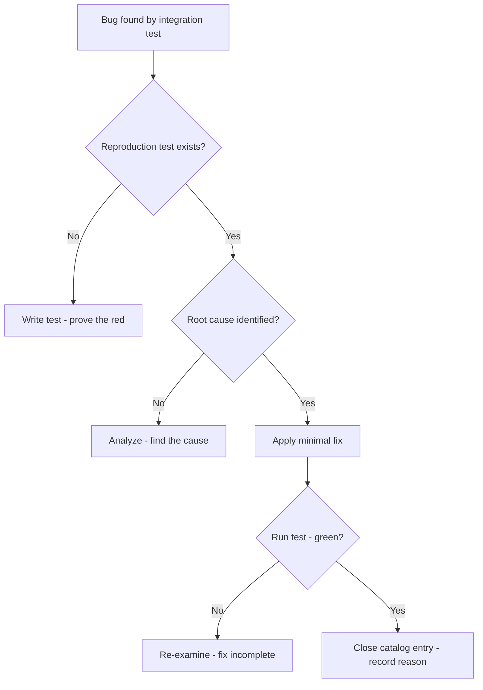
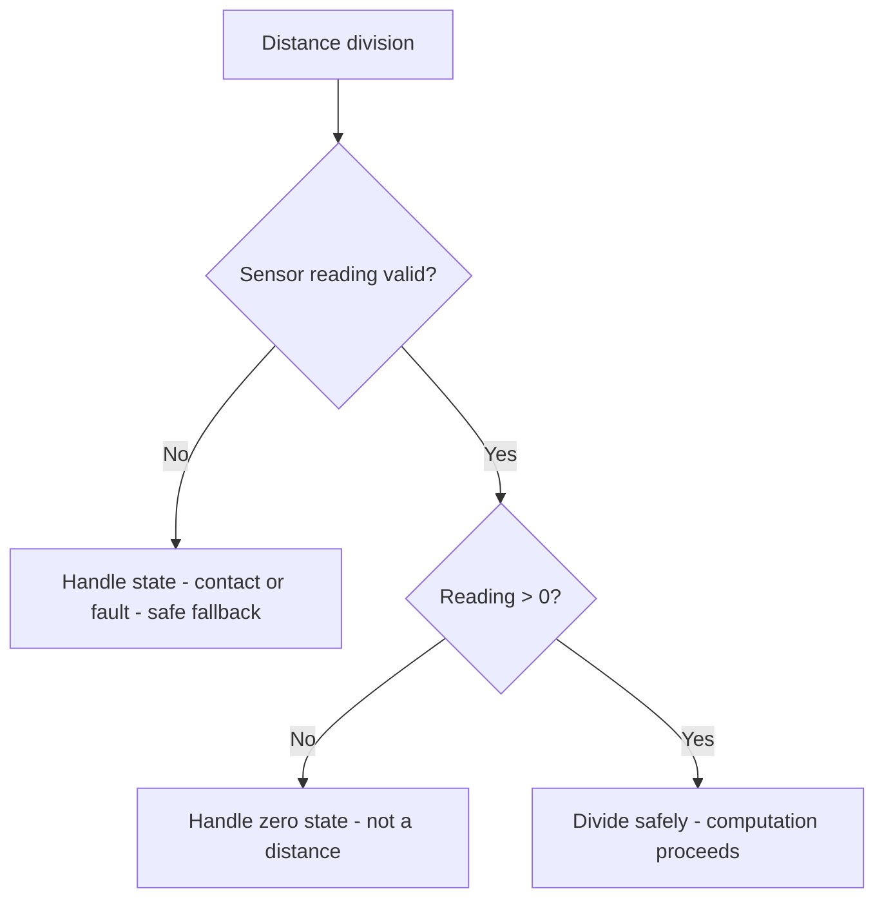
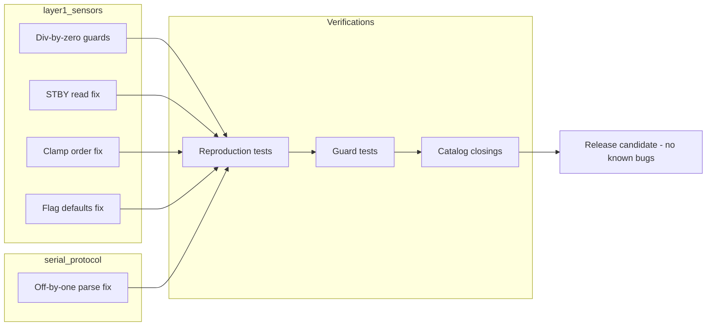

# v9.7 — 12 bug fixes

| Version | Phase | Days |
|---------|-------|------|
| v9.7 | Polish & Competition Ready | Day 256-258 |

## 3. Mission

The v9.7 mission: close the *known's defects* — the 12 bug fixes found by the integration's tests — the off-by-one in the packet's parsing, the STBY's read's fault, the div-by-zero's guards, the clamp's order, and the flag's defaults — in the layer1_sensors.py and the serial_protocol.py — the release's candidate defined by the bugs it no longer has. The mission's three parts: the *defects' inventory* (the 12 bugs' list — the integration's tests' findings — the catalog's entries — the pending's closures); the *fixes' batch* (the corrections — the off-by-one's parsing, the STBY's read's fault, the div-by-zero's guards, the clamp's order, the flag's defaults — the root causes' corrections); and the *verifications* (the tests' additions — the catalog's entries' closings — the regressions' guards — the release's readiness). The mission's proof: the 12 bugs' absence — the release's candidate's definition, the zero's state's lesson learned.

## 4. Engineering context

The project enters v9.7 with the core's proof (v9.6) but an open catalog: the codebase's known's defects (the layer1_sensors.py's and the serial_protocol.py's accumulated's bugs — the journey's residue — the 12 bugs) were unfixed — the defects' catalog (the v9.2's entries — the known's and the pending's) unclosed, the fixes' batch unbuilt. The phase's demands exposed the gap (Day 256-257): the integration's tests (v9.6's suites) *found* the defects (the off-by-one's parse, the STBY's read's fault, the divisions' unguarded — the tests' red — the catalog's entries) — the release's candidate (the competition's package — the bugs' absence — the field's trust) demands the batch's completion. The seed's error was the batch's anchor: the div-by-zero when the sensor returned exactly the 0 mm — the mechanics: the distance's division (the speed's and the rate's computations) without the zero's guard — the sensor's 0 mm (the target's contact or the read's fault) — the denominator's zero — the division's crash — the run's death. The lesson's shape: zero is not a distance — it is a state.

## 5. Thought process

### 5.1 The batch's goal — what the release's candidate must close

The first question: what does the bug's batch need to close, mechanically? Three answers, tested against the phase's needs. The *defects' totality*: the 12 bugs' list (the integration's tests' findings — the catalog's entries — the known's closures — the residue's end). The *fixes' correctness*: the root causes' corrections (the off-by-one's parsing, the STBY's read's fault, the div-by-zero's guards, the clamp's order, the flag's defaults — the true's fixes — the new's regressions' absence). The *verification's proofs*: the tests' additions (the found's bugs' reproductions — the fixes' verifications — the guards' permanence — the catalog's closings). All three demanded: the inventory (the 12 bugs' list), the fixes' batch (the corrections), the verifications (the tests — the catalog's updates). The decision: build all three, in the order — the inventory, the fixes, the verifications — the batch's completion in `layer1_sensors.py` and `serial_protocol.py`.

### 5.2 The defects' inventory — the twelve's list

The defects' inventory was the batch's skeleton: the 12 bugs' list — the integration's tests' findings. The form: the tests' reds' collection (the v9.6's suites' failures — the bugs' evidences — the symptoms' records); the catalog's reconciliation (the v9.2's entries — the found's vs the cataloged's — the pending's list); and the fixes' order (the bugs' severities — the crash's first, the wrong's second, the cosmetic's last — the batch's sequence). The design decisions: the inventory's completeness (the 12 bugs' totality — the tests' findings' coverage — the residue's end); the severities' ordering (the crashes' and the corruptions' first — the impact's ranking — the batch's priority); and the catalog's sync (the entries' states — the pending's and the fixed's — the record's truth). The inventory was the batch's plan: the 12 bugs, the order, the closure's list.

### 5.3 The seed's error — the zero's division

The seed's error was the batch's anchor: the div-by-zero when the sensor returned exactly the 0 mm. The mechanics: the distance's division (the speed's and the rate's computations — the timing's and the scaling's math) without the zero's guard — the sensor's 0 mm (the target's contact, the read's fault, the sensor's blind spot) — the denominator's zero — the division's crash (the ZeroDivisionError — the run's death — the mission's failure at the worst moment). The symptoms, from the field's and the tests' runs (Day 256): the crashes at the contact (the wall's touch — the sensor's 0 — the division's death — the run's end); the division's fragility (the unguarded's math — the state's assumption's absence). The fix's shape, named in the skeleton: *guarded every distance's division with an explicit validity's check* — the guard's pattern (the validity's check before the division — the 0's rejection — the state's handling — the safe's fallback). The lesson's shape: *zero is not a distance — it is a state* — the reading's semantics — the 0's meaning as the state (the contact, the fault), not the distance's value.

### 5.4 The fixes' batch — the twelve's corrections

The fixes' batch became the mission's core: the root causes' corrections. The form — the fixes' classes: the off-by-one in the packet's parsing (the serial's frame's boundary — the v8.9's protocol's parse — the byte's index's edge — the last's byte's loss or the extra's read — the parse's correction — the frame's boundary's truth); the STBY's read's fault (the motor's driver's standby's pin — the read's timing — the state's misread — the driver's behavior's correction); the div-by-zero's guards (the distances' divisions' validity's checks — the seed's fix — the guards' pattern's application — every distance's division); the clamp's order (the clamp's sequence — the min's before the max's or the reverse — the values' bounds' violation — the order's correction — the bounds' truth); the flag's defaults (the state's flags' initial's values — the boot's wrong's states — the defaults' correction — the boot's truth). The design decisions: the fixes' fidelity (the root causes' corrections — the symptoms' masks' avoidance — the truth's fixes); the fixes' minimalism (the targeted's changes — the scope's restraint — the regressions' absence); and the batch's completion (the 12 fixes' totality — the inventory's closure). The batch was the corrections' substance: the 12 root causes' truths.

### 5.5 The verifications — the guards' permanence

The verifications became the batch's third axis: the tests' additions — the guards' permanence. The form: the reproductions' tests (each found's bug's reproduction — the test's red before the fix — the fix's green after — the proof's pair); the guards' tests (the zero's and the invalid's readings' injections — the guards' responses — the crash's absence); and the catalog's closings (the v9.2's entries' updates — the fixed's states — the fixes' records — the history's truth). The design decisions: the tests' depth (the 12 bugs' reproductions — the assertions' precision — the regressions' guards); the guards' coverage (the distances' divisions' totality — the invalid's inputs' handling — the crash's absence); and the catalog's discipline (the entries' closings — the reasons' records — the v9.2's pattern's continuation). The verifications' promise: the fixes' proofs (the red-to-green's pairs), the guards' permanence (the regressions' prevention), and the catalog's closure (the history's truth).

### 5.6 The release's readiness — the candidate's definition

The integration decided the mission's value: the release's candidate defined by the bugs it no longer has. The design decisions: the candidate's gate (the 12 bugs' closures — the tests' green — the catalog's closings — the release's readiness); the field's trust (the crashes' absence — the divisions' guards — the parse's and the read's truths — the robot's reliability); and the regression's watch (the CI's suites — the new's tests' additions — the guards' permanence — the v9.4's and the v9.6's gates). The integration's promise: the release's candidate's definition — the bugs' absence, the field's calm.

## 6. Decision flowchart

The fix's decision (the root cause's truth):

The division's guard's decision (the zero's state):

## 7. Implementation blueprint

The blueprint, in the build's order:

1. **The inventory** — the 12 bugs' list (the integration's tests' findings — the severities' order — the catalog's reconciliation).
2. **The seed's fix** — the div-by-zero's guards (the validity's checks before every distance's division — the zero's state's handling — the safe's fallback).
3. **The parsing's fix** — the off-by-one in the packet's parsing (the frame's boundary's correction — the byte's index's truth).
4. **The remaining fixes** — the STBY's read's fault, the clamp's order, the flag's defaults — the root causes' corrections.
5. **The verifications** — the reproductions' tests (the red-to-green's pairs), the guards' tests (the invalid's injections), the catalog's closings (the v9.2's entries' updates).
6. **The release's gate** — the CI's green (the v9.4's and the v9.6's suites — the new's tests' additions) — the candidate's readiness.

The blueprint's order follows the dependencies: the inventory first (the plan), the seed's fix next (the anchor's correction), the parsing's and the remaining fixes after (the batch's substance), the verifications and the gate last (the proofs, the readiness).

## 8. Architecture flowchart

The fixes' scope:

The diagram is the fixes' scope, complete: the layer1_sensors' and the serial_protocol's corrections (the div-by-zero's guards, the STBY's read, the clamp's order, the flag's defaults, the off-by-one's parse) verified by the reproduction's and the guard's tests, the catalog's closings, the release's candidate defined by the bugs' absence — the batch's completion wired into the field's trust.

---

## 9. Errors, failures, and root-cause analysis

### Error 1: the zero's division — the seed's error, the contact's crash

**Symptom.** Day 256, the field's and the tests' runs: the *division crashed at the zero* — the sensor's 0 mm (the target's contact — the wall's touch — the read's fault) — the denominator's zero — the division's crash (the ZeroDivisionError — the run's death — the mission's failure at the worst moment).

**Initial hypotheses.** We suspected the sensors' readings. We suspected the divisions' sites. We suspected the math's guards.

**Investigation.** The state's semantics were the diagnosis: the sensor's 0 mm (the contact or the fault — not the distance's value) needs the state's handling, and the unguarded's division (the denominator's zero — the crash) is the run's death: the fix's form — the explicit validity's check before every distance's division (the 0's rejection — the state's handling — the safe's fallback) (AC1). The lesson's shape: zero is not a distance — it is a state.

**Root cause.** The guard's absence: the 0's denominator — the division's crash — the mission's failure.

**Fix.** The validity's guards (the shipped fixes): the explicit checks before every distance's division — the 0's state's handling — the safe's fallback (AC1). The re-test: the zero's injections — the crash's absence — the run's survival, the crash's run preserved as the reference.

**Prevention.** The rule became the version's headline: *zero is not a distance — it is a state — the validity's check is the division's guard, and the unguarded's math is the crash's door* — the guards' test (AC1) joined the regression, with the crash's run preserved as the reference.

### Error 2: the off-by-one's parse — the frame's boundary's edge

**Symptom.** Day 256, the round-trip's tests: the packet's *parsing dropped or added a byte* — the frame's boundary's edge (the length's off-by-one — the last's byte's loss — the extra's read — the command's corruption — the v8.9's protocol's parse's defect), the round-trip's fidelity's break.

**Initial hypotheses.** We suspected the frame's length. We suspected the indexes' math. We suspected the parse's bounds.

**Investigation.** The boundary's math was the diagnosis: the frame's parse (the 10-byte packet — the v8.9's structure) depends on the boundary's arithmetic (the length's and the indexes' exactness), and the off-by-one (the last's byte's loss or the extra's read — the corruption) is the fidelity's break: the boundary's test (the frame's edges — the round-trip's fidelity — AC2) is the parse's truth. The fix: the boundary's correction (the length's and the indexes' math — the parse's truth).

**Root cause.** The boundary's error: the length's off-by-one — the byte's loss or the extra — the command's corruption.

**Fix.** The parse's correction (the shipped fix): the frame's boundary's math — the round-trip's fidelity (AC2). The re-test: the frame's edges — the round-trips' truth — the fidelity's proof, the off-by-one's counter-case preserved.

**Prevention.** The rule: *the frame's truth is the boundary's exactness — the off-by-one is the command's corruption, and the edge's test is the parse's keeper* — the parse's test (AC2) joined the regression, with the off-by-one's run preserved as the reference.

### Error 3: the STBY's read's fault — the driver's state's misread

**Symptom.** Day 257, the motors' tests: the STBY's *read returned the wrong state* — the motor's driver's standby's pin (the read's timing — the state's misread — the driver's behavior's misjudgment — the enable's and the disable's wrongness — the motors' unexpected's states), the drive's control's corruption.

**Initial hypotheses.** We suspected the pin's wiring. We suspected the read's timing. We suspected the state's logic.

**Investigation.** The read's protocol was the diagnosis: the STBY's pin's state (the driver's standby — the enable's truth) depends on the read's protocol (the timing — the settle's waits — the logic's levels), and the misread (the wrong's state — the wrong's behavior) is the drive's corruption: the STBY's test (the states' reads — the settle's timing — AC3) is the driver's truth. The fix: the read's correction (the timing's waits — the logic's levels — the state's truth).

**Root cause.** The read's misjudgment: the timing's absence — the wrong's state — the motors' wrongness.

**Fix.** The STBY's correction (the shipped fix): the read's protocol — the settle's timing — the state's truth (AC3). The re-test: the states' reads — the driver's truth — the control's fidelity, the misread's counter-case preserved.

**Prevention.** The rule: *the driver's truth is the read's protocol — the misread is the drive's corruption, and the settle's timing is the state's keeper* — the STBY's test (AC3) joined the regression, with the misread's run preserved as the reference.

### Error 4: the clamp's order — the bounds' violation

**Symptom.** Day 257, the values' tests: the clamp's *order violated the bounds* — the clamp's sequence (the min's before the max's or the reverse — the wrong's order — the value's escape — the servo's or the speed's bounds' breach — the limits' violation), the control's constraints' break.

**Initial hypotheses.** We suspected the clamps' values. We suspected the sequences' order. We suspected the limits' definitions.

**Investigation.** The order's math was the diagnosis: the clamp's correctness (the value's bounds — the min's and the max's truth — AC4) depends on the order (the min's then the max's, or the reverse — the order's consistency with the bounds' definitions), and the wrong's order (the escape — the violation) is the constraints' break: the clamp's test (the bounds' edges — the orders — AC4) is the limits' truth. The fix: the order's correction (the sequence's consistency — the bounds' truth).

**Root cause.** The order's wrongness: the value's escape — the bounds' breach — the constraints' break.

**Fix.** The order's correction (the shipped fix): the sequence's consistency with the bounds' definitions — the limits' truth (AC4). The re-test: the bounds' edges — the values' containment — the constraints' keeping, the violation's counter-case preserved.

**Prevention.** The rule: *the clamp's truth is the order's consistency — the wrong's sequence is the bounds' breach, and the edge's test is the limits' keeper* — the clamp's test (AC4) joined the regression, with the violation's run preserved as the reference.

### Error 5: the flag's defaults — the boot's wrong's states

**Symptom.** Day 258, the boot's tests: the *flags booted wrong* — the state's flags' initial's values (the defaults' errors — the boot's wrong's states — the mode's and the condition's misreads at the start — the mission's opening's wrongness), the boot's truth's break.

**Initial hypotheses.** We suspected the defaults' values. We suspected the flags' definitions. We suspected the boot's sequence.

**Investigation.** The defaults' truth was the diagnosis: the state's flags (the modes, the conditions — the boot's states) depend on the defaults' correctness (the initial's values — the safe's and the neutral's states — the boot's truth), and the wrong's defaults (the misreads — the wrongness) are the boot's break: the flags' test (the boot's states — the defaults' values — AC5) is the initial's truth. The fix: the defaults' correction (the safe's and the neutral's initial's values — the boot's truth).

**Root cause.** The defaults' errors: the boot's wrong's states — the misreads — the opening's wrongness.

**Fix.** The defaults' correction (the shipped fix): the flags' initial's values — the safe's and the neutral's states (AC5). The re-test: the boot's states — the defaults' truth — the opening's correctness, the wrong's states' counter-case preserved.

**Prevention.** The rule: *the boot's truth is the defaults' correctness — the wrong's initial is the opening's wrongness, and the boot's test is the state's keeper* — the flags' test (AC5) joined the regression, with the wrong's states' run preserved as the reference.

---

## 10. Verification and metrics

**AC1 — the guards' truth.** Every distance's division guarded — the zero's and the invalid's readings' injections — the crash's absence — the seed's error's fix verified. Passed.

**AC2 — the parse's truth.** The frame's boundary's exactness — the round-trip's fidelity — the off-by-one's absence. Passed.

**AC3 — the driver's truth.** The STBY's read's protocol — the settle's timing — the state's correctness. Passed.

**AC4 — the clamp's truth.** The order's consistency — the bounds' containment — the limits' keeping. Passed.

**AC5 — the chain and the phase's regressions.** v6.0-v9.6's suites unchanged, with the batch's verifications green — the flag's defaults' boot's truth. Passed.

**The batch's provenance.** The measurements on Day 256-258: the reproductions' pairs (the red-to-green's proofs), the injections' runs (the guards' responses), the boot's tests (the defaults' truths) documented in the catalog's closings.

**Cost.** Runtime: the microseconds per guard's check. Development: three days, with the errors' lessons (the zero's state, the boundary's exactness, the read's protocol, the order's consistency, the defaults' truth) now permanent checklist items.

**What we trusted afterwards and what we still distrusted.** We trusted the *batch's completion* completely — the inventory, the fixes, the verifications, each proven by its test. We trusted the release's candidate's definition by the bugs' absence. We still distrusted three things: the *performance's headroom* (the CPU's budget — pending v9.8); the *release's packaging* (the final's bundle — pending v9.9); and the *field's unknowns* (the venue's surprises — pending the competition's week). Each is a named, written debt — the phase's rule.

---

## 11. Lessons learned — permanent mental models

**Lesson 1 — zero is not a distance: it is a state.** The seed's lesson: the 0 mm's division crashed the run. The permanent practice: the validity's checks — the 0's state's handling — the safe's fallback.

**Lesson 2 — the frame's truth is the boundary's exactness.** The off-by-one corrupted the command. The permanent rule: the length's and the indexes' math — the round-trip's fidelity.

**Lesson 3 — the driver's truth is the read's protocol.** The STBY's misread corrupted the drive. The permanent model: the settle's timing — the logic's levels — the state's truth.

**Lesson 4 — the clamp's truth is the order's consistency.** The wrong's sequence breached the bounds. The permanent practice: the order's match with the bounds' definitions — the edge's tests.

**Lesson 5 — the boot's truth is the defaults' correctness.** The wrong's initial corrupted the opening. The permanent rule: the safe's and the neutral's defaults — the boot's tests.

**Lesson 6 — the release's candidate is defined by the bugs it no longer has.** The batch's completion is the field's trust. The permanent practice: the integration's tests' findings' closures — the catalog's truth.

---

## 12. Code in this snapshot

`layer1_sensors.py`, `serial_protocol.py`

---

## 13. Bridge to the next version

What v9.7 unlocks is the release's candidate's definition: the 12 bug fixes — the off-by-one in the packet's parsing, the STBY's read's fault, the div-by-zero's guards (the explicit validity's checks — the zero's state's handling), the clamp's order, the flag's defaults — found by the integration's tests, verified by the reproductions, closed in the catalog — the release's candidate defined by the bugs it no longer has. Three capabilities travel forward. First, the fixes' batch itself — the corrections, the guards, the proofs — the field's trust. Second, the *discipline*: the zero's state (the reading's semantics), the boundary's exactness (the parse's truth), the read's protocol (the driver's truth), the order's consistency (the clamp's truth), the defaults' correctness (the boot's truth) — the phase's quality bar, now complete across the fixes' layer. Third, the *closure's pattern*: the cataloged defects with the verified corrections — the pattern the performance's tuning (the CPU's budget) will follow.

The known debt, stated plainly: the performance's headroom (the CPU's budget); the release's packaging (the final's bundle); the field's unknowns (the venue's surprises); and the *performance's headroom*: the robot's CPU's budget (the perception's cost — the camera's capture and the processing at the 640x480@30 — the CPU's 95%'s peak — the control's and the scheduling's starvation — the jitter's and the stalls' risks) is unexamined — the perception's load (the frames' full-size's processing — the HSV's conversions' and the detection's costs) unmeasured, the camera's configuration (the resolutions' and the frame's rates' choices — the robot_config.json's keys) unset, the performance's optimization (the 40% CPU's reduction — the config-first's tuning — the processing's headroom's restoration) unbuilt. The next problem — the one v9.8 (Day 259-261) must attack — is that headroom: *the performance's optimization — the robot_config.json's and the layer4_perception.py's tuning (the camera's configurable resolution and rate — the processing's cost's reduction), the CPU's headroom's restoration (the 40%'s reduction — the control's and the scheduling's breath — the seeds' error: the CPU pegged at the 95% at the 640x480@30)*. The bugs are closed; the *CPU's breath* must be restored. That is the work of the next three days.
