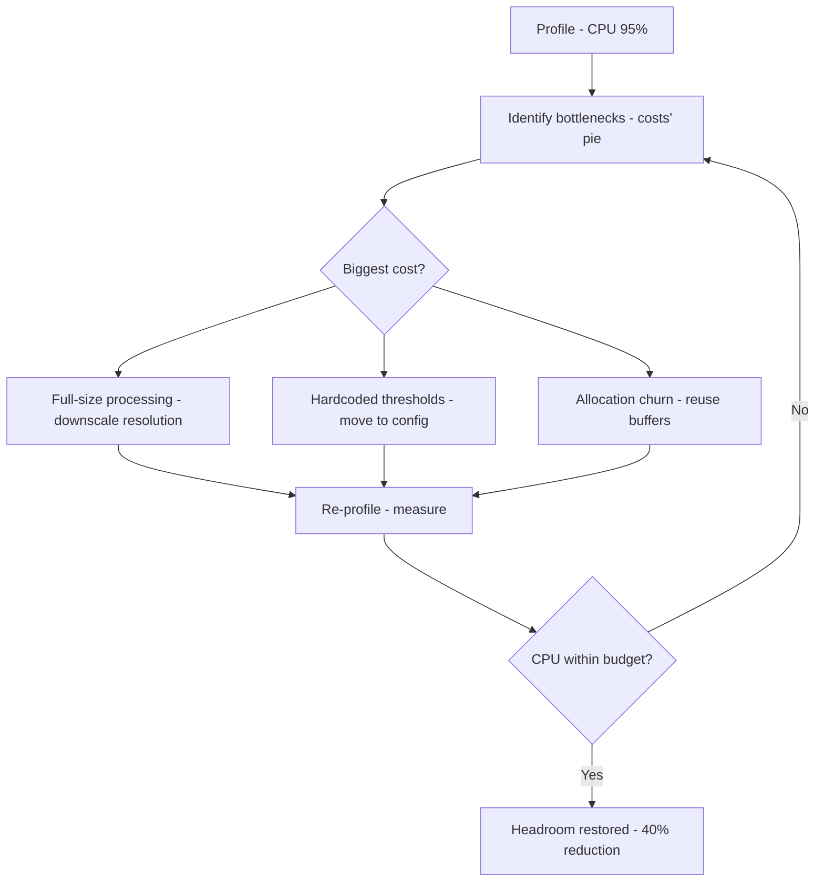
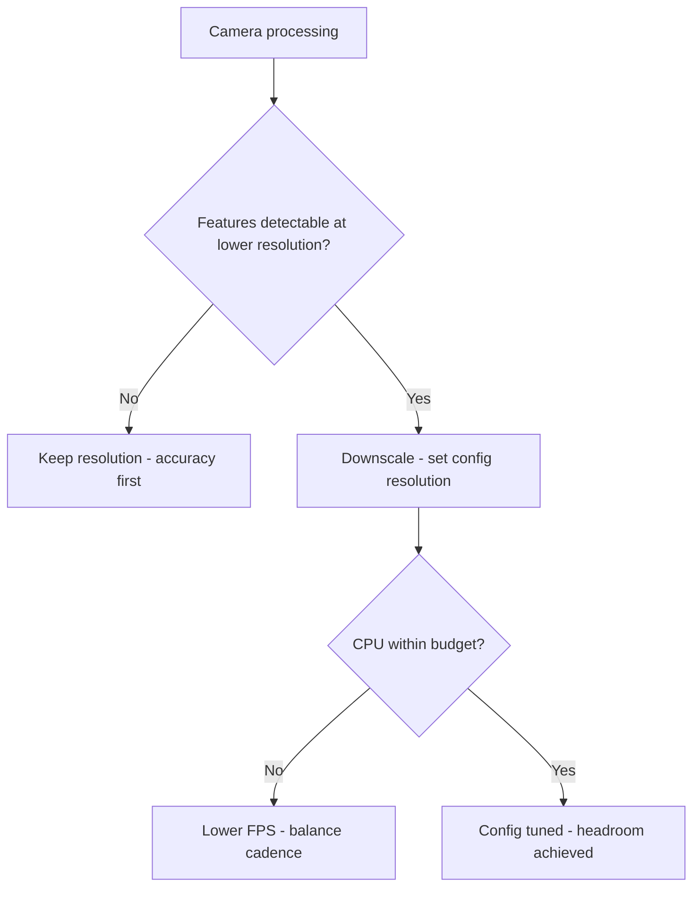
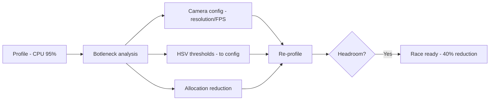

# v9.8 — Performance optimization

| Version | Phase | Days |
|---------|-------|------|
| v9.8 | Polish & Competition Ready | Day 259-261 |

## 3. Mission

The v9.8 mission: give the Pi *headroom for the unexpected* — the performance's optimization — the profile-driven pass — the configurable camera's resolution and FPS, the HSV's thresholds in the config, and the reduced allocations in the hot's loop — the 40% CPU's reduction — the robot's breath restored. The mission's three parts: the *profile's truth* (the CPU's budget's measurement — the perception's cost's identification — the 95%'s peak's anatomy); the *optimization's pass* (the configurable camera's resolution and FPS — the downscaled processing — the HSV's thresholds' config's move — the hot's loop's allocations' reduction — the 40%'s reduction); and the *config-first's discipline* (the thresholds' and the camera's settings in the robot_config.json — the tuning's path — the seed's error's fix — the performance's work in the config's design). The mission's proof: the Pi's headroom at the race — the 40%'s reduction, the control's and the scheduling's breath.

## 4. Engineering context

The project enters v9.8 with the bugs' closure (v9.7) but a pegged CPU: the robot's CPU's budget (the perception's cost — the camera's capture and the processing at the 640x480@30 — the CPU's 95%'s peak) was unexamined — the perception's load (the frames' full-size's processing — the HSV's conversions' and the detection's costs) unmeasured, the camera's configuration (the resolutions' and the frame's rates' choices) unset, the performance's optimization unbuilt. The phase's demands exposed the gap (Day 259-260): the race's unexpected (the venue's surprises — the new's conditions — the extra's processing — the Pi's response) demands the headroom (the CPU's margin — the control's and the scheduling's breath — the jitter's and the stalls' absence); the profile's evidence (the CPU's peaks — the perception's share) demanded the measurement before the tuning. The performance's state carried its own failure: the CPU pegged at the 95% with the camera at the 640x480@30 — the seed's error — the full-size's processing (the frames' capture and the conversions and the detection at the full's resolution — the CPU's saturation — the control's starvation — the jitter's and the stalls' risks — the headroom's absence).

## 5. Thought process

### 5.1 The headroom's goal — what the Pi must reserve

The first question: what does the Pi's headroom need to mean, mechanically? Three answers, tested against the phase's needs. The *CPU's margin*: the headroom for the unexpected (the race's surprises — the extra's processing — the control's and the scheduling's breath — the 95%'s peak's reduction). The *perception's cost*: the camera's load's reduction (the resolution's and the frame's rate's choices — the processing's downscale — the allocations' reduction — the hot's loop's lightness). The *tuning's path*: the config's keys (the camera's settings, the HSV's thresholds — the robot_config.json — the tuning without the code's changes). All three demanded: the profile (the CPU's measurement — the costs' anatomy), the optimization's pass (the camera's config, the downscale, the allocations), and the config-first's design (the thresholds' move). The decision: build all three, in the order — the profile, the pass, the discipline — the headroom's restoration in `robot_config.json` and `layer4_perception.py`.

### 5.2 The profile's truth — the 95%'s anatomy

The profile was the optimization's skeleton: the CPU's budget's measurement — the costs' anatomy. The form: the CPU's sampling (the perception's runs — the core's usage's measurements — the peak's and the average's records); the costs' breakdown (the camera's capture's share, the HSV's conversions', the detection's, the control's — the anatomy's pie); and the bottlenecks' identification (the hot's spots — the allocation's churn — the conversions' cost — the full-size's processing). The design decisions: the profile's instrument (the sampling's tool — the per-function's costs — the truth's evidence); the runs' representativeness (the race's conditions — the frames' content — the measurements' validity); and the priorities' ordering (the bottlenecks' ranking — the biggest's first — the optimization's sequence). The profile was the evidence's base: the 95%'s anatomy, the bottlenecks' list.

### 5.3 The seed's error — the 95%'s peak

The seed's error was the phase's anchor: the CPU pegged at the 95% with the camera at the 640x480@30. The mechanics: the full-size's processing (the camera's capture at the 640x480 — the frames' transfer, the HSV's conversions (the full's frames' per-pixel's math), the detection's scans (the full's resolution's regions) — the CPU's saturation at the 95% — the control's and the scheduling's starvation — the jitter's and the stalls' risks — the headroom's absence — the race's unexpected's unhandled). The symptoms, from the profiling runs (Day 259): the control's jitter (the loop's period's spikes at the frames' processing — the v8.7's scheduler's cadence's stress); the stalls' risks (the emergency's response's latency at the saturation — the safety's margin's erosion). The fix's shape, named in the skeleton: *moved all the thresholds to the config and downscaled the processing's resolution* — the optimization's pass — the config's move (the HSV's thresholds — the camera's settings — the tuning's path), the downscale (the processing's resolution's reduction — the costs' cut — the detection's sufficiency). The lesson's shape: *performance's work belongs in the config-first's design* — the discipline's core.

### 5.4 The optimization's pass — the camera's config and the allocations

The optimization's pass became the mission's core: the costs' reductions. The form: the camera's configuration (the configurable resolution and FPS — the robot_config.json's keys — the capture's downscale — the processing's resolution's reduction — the 640x480's to the sufficient's resolution — the costs' cut); the HSV's thresholds' config's move (the thresholds from the code to the robot_config.json — the tuning's path — the calibrations' without the code's changes — the v9.3's calibrate_hsv's complement); the allocations' reduction (the hot's loop's arrays' and the objects' reuse — the churn's cut — the garbage's collector's relief). The design decisions: the resolution's choice (the sufficient's for the detection — the markers' and the walls' features' resolution's need — the downscale's bound — the detection's accuracy's preservation); the FPS's choice (the frame's rate's sufficiency — the detection's cadence — the CPU's cost's balance); and the allocations' targets (the hot's loop's churn's identification — the reuse's patterns — the GC's relief). The pass was the headroom's substance: the 40%'s reduction's mechanics.

### 5.5 The config-first's discipline — the tuning's path

The config-first's discipline became the optimization's third axis: the thresholds' and the camera's settings' homes — the tuning's path. The form: the robot_config.json's sections (the camera's resolution and FPS, the HSV's thresholds, the detection's parameters — the config's keys — the v8.3's config's pattern's continuation); the tuning's flow (the venue's adjustments — the config's edits — the calibrations' without the code's changes — the field's speed); and the defaults' sanity (the shipped values — the safe's and the tested's — the boot's validation — the v8.3's pattern). The design decisions: the config's completeness (the thresholds' and the camera's and the detection's keys — the tuning's totality); the validation's rigor (the keys' checks — the ranges' bounds — the boot's rejection — the config's truth); and the calibration's complement (the calibrate_hsv.py's outputs' writing to the config — the loop's closure — the venue's tuning's flow). The discipline's promise: the tuning's speed (the config's edits — the field's adjustments), the code's stability (the thresholds' absence from the code — the changes' minimalism), and the seed's fix (the config's home).

### 5.6 The headroom's verification — the 40%'s proof

The verification decided the mission's success: the CPU's headroom's proof. The form: the re-profile (the optimized's runs — the CPU's measurements — the 40%'s reduction's confirmation — the headroom's margin); the function's checks (the detection's accuracy at the downscaled's resolution — the perceptions' truths — the regressions' absence); and the race's rehearsal (the mission's runs at the headroom — the control's and the scheduling's breath — the unexpected's handling's capacity). The design decisions: the reduction's target (the 40% — the measured's baseline vs the optimized's — the headroom's truth); the accuracy's preservation (the detection's sufficiency — the downscale's bound — the perception's truths); and the rehearsal's proof (the race's conditions — the headroom's margin — the readiness). The verification's promise: the headroom's restoration (the 40%'s reduction), the race's readiness (the unexpected's capacity).

## 6. Decision flowchart

The optimization's decision (the costs' reduction):

The camera's configuration's decision (the resolution's choice):

## 7. Implementation blueprint

The blueprint, in the build's order:

1. **The profile** — the CPU's sampling (the perception's runs — the costs' breakdown — the bottlenecks' identification — the 95%'s anatomy).
2. **The camera's config** — the configurable resolution and FPS (the robot_config.json's keys — the downscale's choice — the sufficient's resolution).
3. **The thresholds' move** — the HSV's thresholds and the detection's parameters to the robot_config.json (the tuning's path — the calibration's complement).
4. **The allocations' reduction** — the hot's loop's buffers' reuse — the churn's cut — the GC's relief.
5. **The config-first's discipline** — the keys' validation — the defaults' sanity — the boot's checks.
6. **The verification** — the re-profile (the 40%'s confirmation — the headroom's margin), the accuracy's checks (the detection's truths), the race's rehearsal (the unexpected's capacity).

The blueprint's order follows the dependencies: the profile first (the evidence), the camera's config and the thresholds' move and the allocations after (the reductions), the discipline and the verification last (the tuning's path, the proof).

## 8. Architecture flowchart

The optimization's flow:

The diagram is the optimization's flow, complete: the profile's evidence into the bottleneck's analysis, the camera's configuration and the thresholds' move and the allocations' reduction into the re-profile, the headroom's check into the race's readiness — the Pi's breath wired into the unexpected's capacity.

---

## 9. Errors, failures, and root-cause analysis

### Error 1: the 95%'s peak — the seed's error, the saturation's saturation

**Symptom.** Day 259, the profiling's runs: the CPU *pegged at the 95%* with the camera at the 640x480@30 — the control's jitter (the loop's period's spikes at the frames' processing — the v8.7's scheduler's cadence's stress), the stalls' risks (the emergency's response's latency at the saturation — the safety's margin's erosion), the headroom's absence.

**Initial hypotheses.** We suspected the camera's load. We suspected the conversions' cost. We suspected the detection's scans.

**Investigation.** The full-size's processing was the diagnosis: the camera's capture at the 640x480 (the transfer, the HSV's conversions (the full's frames' per-pixel's math), the detection's scans) saturated the CPU — the control's starvation — and the fix is the optimization's pass — the camera's configuration (the configurable resolution and FPS — the downscale), the thresholds' config's move, the allocations' reduction (AC2): the seed's error's class — the unmeasured's load's saturation. The lesson's shape: performance's work belongs in the config-first's design.

**Root cause.** The full-size's processing: the 640x480's costs — the CPU's saturation — the headroom's absence.

**Fix.** The optimization's pass (the shipped tuning): the configurable camera's resolution and FPS — the processing's downscale — the allocations' reduction (AC2). The re-test: the re-profile — the 40%'s reduction — the headroom's margin, the 95%'s run preserved as the reference.

**Prevention.** The rule became the version's headline: *performance's work belongs in the config-first's design — the profile's truth precedes the tuning, and the saturation is the unexpected's door* — the optimization's test (AC2) joined the regression, with the 95%'s profile preserved as the reference.

### Error 2: the downscale's overreach — the accuracy's loss

**Symptom.** Day 260, the accuracy's tests: the downscale *lost the detections* — the resolution's over-reduction (the markers' and the walls' features' resolution's need — the small's markers' blur — the detections' misses — the HSV's conversions' and the scans' savings at the accuracy's cost), the perception's truths' break.

**Initial hypotheses.** We suspected the resolution's choice. We suspected the features' sizes. We suspected the detection's thresholds.

**Investigation.** The sufficiency's bound was the diagnosis: the downscale's benefit (the costs' cut — AC3) must preserve the detection's accuracy (the features' resolution's need — the markers' and the walls' detectability at the chosen's resolution), and the over-reduction (the misses — the truths' break) is the perception's cost: the sufficiency's test (the resolutions' sweep — the accuracy's measurements — the bound's finding — AC3) is the downscale's truth. The fix: the resolution's balance (the sufficient's resolution — the accuracy's preservation — the costs' cut).

**Root cause.** The over-reduction: the features' blur — the misses — the perception's truths' break.

**Fix.** The sufficiency's calibration (the shipped config): the resolution's sweep — the accuracy's measurements — the bound's choice (AC3). The re-test: the detections' truths at the chosen's resolution — the accuracy's preservation, the overreach's counter-case preserved.

**Prevention.** The rule: *the downscale's truth is the sufficiency's bound — the over-reduction is the accuracy's loss, and the sweep is the bound's finder* — the sufficiency's test (AC3) joined the regression, with the overreach's run preserved as the reference.

### Error 3: the config's break — the boot's rejection

**Symptom.** Day 260, the config's move: the *config broke the boot* — the keys' and the values' errors (the thresholds' move's typos — the types' mismatches — the ranges' violations — the boot's parse's failure — the robot's non-start), the config's trust's damage.

**Initial hypotheses.** We suspected the keys' names. We suspected the values' types. We suspected the boot's validation.

**Investigation.** The validation's rigor was the diagnosis: the config-first's design (the tuning's path — AC4) demands the boot's validation (the keys' presence — the types' checks — the ranges' bounds — the errors' messages — the boot's rejection at the invalid), and the unvalidated's move (the typos' and the mismatches' passes — the boot's break) is the trust's damage: the validation's build (the keys' and the values' checks — the ranges' bounds — the boot's safety — AC4) is the config's truth. The fix: the validation's completion (the keys' checks — the types' and the ranges' bounds — the boot's safety).

**Root cause.** The validation's absence: the typos' pass — the boot's break — the trust's damage.

**Fix.** The boot's validation (the shipped config): the keys' presence, the types' and the ranges' checks, the errors' messages (AC4). The re-test: the invalid's configs — the boot's rejections — the safety's truth, the break's counter-case preserved.

**Prevention.** The rule: *the config's trust is the boot's validation — the unvalidated's key is the boot's break, and the check is the start's safety* — the validation's test (AC4) joined the regression, with the break's run preserved as the reference.

### Error 4: the allocations' churn's return — the GC's stalls

**Symptom.** Day 261, the endurance's runs: the *GC's stalls returned* — the allocations' churn (the hot's loop's temporary's arrays and the objects — the garbage's collector's pauses — the loop's period's spikes — the control's jitter's return), the reduction's incompleteness.

**Initial hypotheses.** We suspected the temporaries' count. We suspected the reuse's patterns. We suspected the GC's behavior.

**Investigation.** The churn's anatomy was the diagnosis: the hot's loop's costs (the temporaries' allocations — the GC's pauses — the jitter — AC1) demand the reuse's patterns (the buffers' and the objects' reuse — the churn's cut — the GC's relief), and the churn's return (the pauses — the jitter) is the reduction's incompleteness: the churn's audit (the allocations' count — the temporaries' identification — the reuse's application — AC1) is the hot's loop's truth. The fix: the reuse's completion (the buffers' reuse — the churn's cut — the GC's relief).

**Root cause.** The temporaries' churn: the GC's pauses — the jitter's return — the reduction's incompleteness.

**Fix.** The reuse's patterns (the shipped tuning): the hot's loop's buffers' and the objects' reuse — the churn's cut (AC1). The re-test: the endurance's runs — the pauses' absence — the loop's stability, the churn's counter-case preserved.

**Prevention.** The rule: *the hot's loop's truth is the churn's absence — the temporary's allocation is the GC's stall, and the reuse is the jitter's keeper* — the churn's test (AC1) joined the regression, with the stalls' run preserved as the reference.

### Error 5: the rehearsal's regression — the tuning's accuracy's drift

**Symptom.** Day 261, the race's rehearsal: the *tuning drifted the accuracy* — the venue's conditions (the lighting's variance — the v8.5's adversary) vs the tuned's thresholds (the config's values — the calibration's venue — the mismatch — the detections' misses — the race's points' loss), the tuning's truth's decay.

**Initial hypotheses.** We suspected the thresholds' values. We suspected the venue's conditions. We suspected the calibration's currency.

**Investigation.** The calibration's loop was the diagnosis: the config-first's tuning (the venue's adjustments — AC5) demands the calibration's closure (the calibrate_hsv.py's outputs' writing to the config — the venue's re-calibration — the thresholds' currency), and the stale's values (the venue's mismatch — the misses) are the tuning's decay: the calibration's loop (the venue's runs — the re-calibrations — the config's updates — AC5) is the tuning's permanence. The fix: the calibration's closure (the venue's re-calibration — the config's updates — the thresholds' currency).

**Root cause.** The calibration's staleness: the venue's mismatch — the misses — the points' loss.

**Fix.** The calibration's loop (the shipped discipline): the calibrate_hsv.py's outputs' writing to the config — the venue's re-calibration (AC5). The re-test: the venue's rehearsal — the thresholds' currency — the detections' truths, the drift's counter-case preserved.

**Prevention.** The rule: *the tuning's permanence is the calibration's loop — the stale's threshold is the venue's miss, and the re-calibration is the points' keeper* — the calibration's test (AC5) joined the regression, with the drift's run preserved as the reference.

---

## 10. Verification and metrics

**AC1 — the hot's loop's truth.** The allocations' churn cut — the buffers' reuse — the GC's stalls' absence — the loop's stability. Passed.

**AC2 — the headroom's restoration.** The re-profile — the 40%'s CPU's reduction — the control's and the scheduling's breath — the seed's error's fix verified. Passed.

**AC3 — the accuracy's preservation.** The downscale's sufficiency — the detections' truths at the chosen's resolution — the misses' absence. Passed.

**AC4 — the config's trust.** The keys' validation — the types' and the ranges' checks — the boot's safety — the tuning's path. Passed.

**AC5 — the chain and the phase's regressions.** v6.0-v9.7's suites unchanged, with the calibration's loop verified — the venue's rehearsal's truths. Passed.

**The tuning's provenance.** The measurements on Day 259-261: the CPU's profiles (the baseline's 95% vs the optimized's), the resolutions' sweeps (the sufficiency's bound), the churn's audits (the allocations' counts), the rehearsal's runs (the accuracy's truths) documented next to the config's keys.

**Cost.** Runtime: the 40%'s CPU's reduction (the headroom's restoration). Development: three days, with the errors' lessons (the profile's truth, the sufficiency's bound, the validation's rigor, the reuse's patterns, the calibration's loop) now permanent checklist items.

**What we trusted afterwards and what we still distrusted.** We trusted the *headroom* completely — the profile, the pass, the discipline, each proven by its test. We trusted the Pi's breath for the unexpected. We still distrusted three things: the *release's packaging* (the final's bundle — pending v9.9); the *field's unknowns* (the venue's surprises — pending the competition's week); and the *calibration's currency* (the venue's re-calibration — pending the field's morning). Each is a named, written debt — the phase's rule.

---

## 11. Lessons learned — permanent mental models

**Lesson 1 — performance's work belongs in the config-first's design.** The seed's lesson: the hardcoded's thresholds and the fixed's camera blocked the tuning. The permanent practice: the config's keys — the tuning's path without the code's changes.

**Lesson 2 — the profile's truth precedes the tuning.** The 95%'s peak was the unmeasured's cost. The permanent rule: the CPU's sampling — the bottlenecks' anatomy — the optimization's sequence.

**Lesson 3 — the downscale's truth is the sufficiency's bound.** The over-reduction lost the detections. The permanent model: the resolutions' sweep — the accuracy's measurements — the bound's choice.

**Lesson 4 — the config's trust is the boot's validation.** The unvalidated's key broke the boot. The permanent practice: the keys' and the values' checks — the ranges' bounds — the boot's safety.

**Lesson 5 — the hot's loop's truth is the churn's absence.** The temporary's allocation stalled the GC. The permanent rule: the buffers' reuse — the churn's cut — the jitter's keeper.

**Lesson 6 — the tuning's permanence is the calibration's loop.** The stale's threshold missed at the venue. The permanent practice: the calibrator's outputs to the config — the venue's re-calibration — the points' keeper.

---

## 12. Code in this snapshot

`robot_config.json`, `layer4_perception.py`

---

## 13. Bridge to the next version

What v9.8 unlocks is the Pi's breath: the performance's optimization — the configurable camera's resolution and FPS, the HSV's thresholds in the config, the reduced allocations in the hot's loop — the 40%'s CPU's reduction — the headroom for the unexpected during the race. Three capabilities travel forward. First, the headroom itself — the profile, the pass, the discipline — the unexpected's capacity. Second, the *discipline*: the profile's truth (the measurement's evidence), the sufficiency's bound (the downscale's truth), the validation's rigor (the config's trust), the reuse's patterns (the hot's loop's truth), the calibration's loop (the tuning's permanence) — the phase's quality bar, now complete across the performance's layer. Third, the *config-first's pattern*: the tunable's system with the validated's keys — the pattern the release's packaging (the final's bundle) will follow.

The known debt, stated plainly: the release's packaging (the final's bundle); the field's unknowns (the venue's surprises); the calibration's currency (the venue's re-calibration); and the *release's packaging*: the competition's bundle (the RELEASE_NOTES.md, the main.py, the layers 0-10, the robot_config.json, the esp32_controller.ino, the serial_protocol.py, the calibrate_imu.py, the calibrate_hsv.py, the test_sensors.py) is unassembled — the final's checks (the integration's truths, the calibration's runs, the hardware's proofs) unscripted, the release's notes (the version's summary, the changes' list, the known's issues) unwritten, and the final's bugs (the three — the UTF-8's BOM in the config, the default's flags wrong on the boot, the serial's read's timeout too short) uncaught. The next problem — the one v9.9 (Day 262-270) must attack — is that packaging: *the release's candidate — the final's bundle (the RELEASE_NOTES.md, the complete's files), the final's verifications (the integration's suite, the calibrations, the hardware's proofs), the three final's bugs' fixes (the UTF-8's BOM in the config — the default's flags on the boot — the serial's read's timeout — the seeds' error: the last 1%'s bugs hide in the defaults and the encodings)*. The Pi breathes; the *final's bundle* must be sealed. That is the work of the next nine days.
