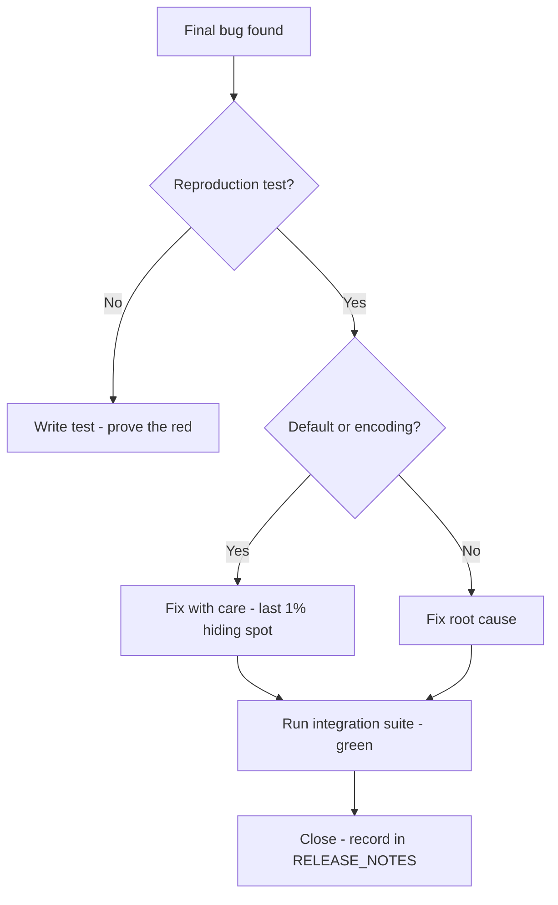
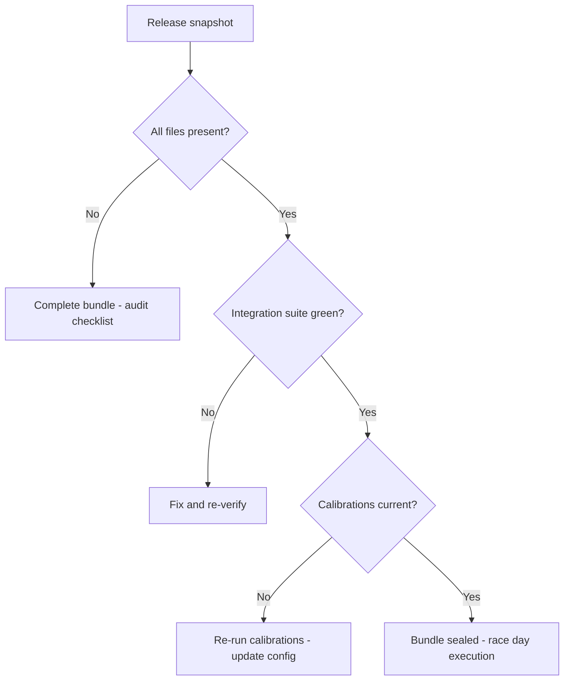
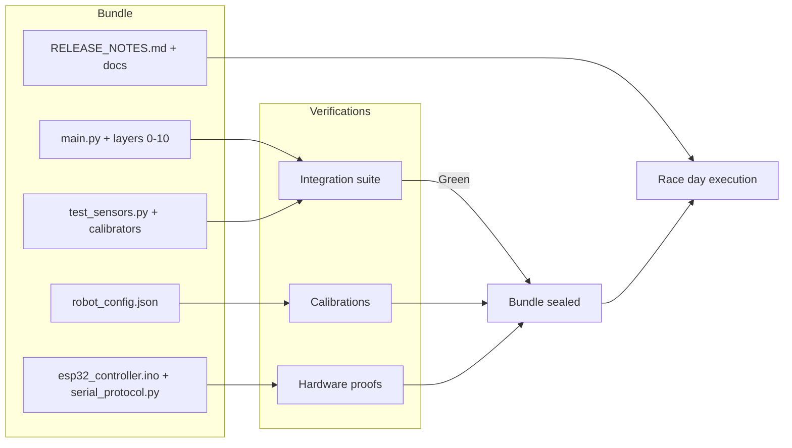

# v9.9 — Release candidate

| Version | Phase | Days |
|---------|-------|------|
| v9.9 | Polish & Competition Ready | Day 262-270 |

## 3. Mission

The v9.9 mission: seal the *final's bundle* — the release's candidate — the full commented code (the layers 0-10, the main), the config, the firmware, the tests, the docs — the three final bugs found and fixed (the config's BOM, the sensor's flag's default, the serial's timeout) — the race's day an execution, not a debugging session. The mission's three parts: the *snapshot's assembly* (the release's files — the RELEASE_NOTES.md, the main.py, the layers 0-10, the robot_config.json, the esp32_controller.ino, the serial_protocol.py, the calibrate_imu.py, the calibrate_hsv.py, the test_sensors.py — the bundle's completeness); the *final's verifications* (the integration's suite — the calibrations' runs — the hardware's proofs — the bundle's truth); and the *final's bugs' fixes* (the three — the UTF-8's BOM in the config, the default's flags wrong on the boot, the serial's read's timeout too short — the fixes' and the verifications' pairs). The mission's proof: a race's day without the debugging — the bundle's readiness, the final's lessons learned.

## 4. Engineering context

The project enters v9.9 with the Pi's breath (v9.8) but an unsealed bundle: the competition's package was unassembled — the final's checks (the integration's truths, the calibration's runs, the hardware's proofs) unscripted, the release's notes (the version's summary, the changes' list, the known's issues) unwritten, and the final's bugs uncaught. The phase's demands exposed the gap (Day 262-269): the race's day (the execution's promise — the debugging's absence — the field's focus) demands the bundle's seal — the snapshot's completeness, the verifications' green; the competition's rules (the robot's check-in — the firmware's and the config's versions — the judges' review) demand the release's notes. The final's pass carried its own failure: the three final's bugs — the seed's error — the UTF-8's BOM in the config (the config's parse — the v8.3's shadow's return), the default's flags wrong on the boot (the boot's states — the v9.7's defaults' echoes), the serial's read's timeout too short (the link's trust — the v8.9's timeouts' edges) — the last 1%'s hiding in the defaults and the encodings.

## 5. Thought process

### 5.1 The seal's goal — what the release's candidate must be

The first question: what does the release's candidate need to be, mechanically? Three answers, tested against the phase's needs. The *snapshot's completeness*: the bundle's files (the code's, the config's, the firmware's, the tests', the docs' — the RELEASE_NOTES' summary — the version's identity). The *verifications' green*: the final's proofs (the integration's suite, the calibrations, the hardware's — the bundle's truth). The *bugs' closure*: the three final's fixes (the BOM, the defaults, the timeout — the last 1%'s end). All three demanded: the assembly (the files' collection — the notes' writing), the verifications (the runs — the proofs), and the fixes' batch (the three's corrections — the tests' additions). The decision: build all three, in the order — the assembly, the verifications, the fixes — the bundle's seal, the release's snapshot.

### 5.2 The snapshot's assembly — the bundle's completeness

The snapshot's assembly was the seal's skeleton: the release's files' collection — the bundle's completeness. The form: the code's bundle (the main.py, the layers 0-10 — the full commented code — the v9.0's pass's fruits); the system's files (the robot_config.json — the v9.8's tuning's keys; the esp32_controller.ino and the serial_protocol.py — the v8.9's link's truths); the tools (the calibrate_imu.py, the calibrate_hsv.py — the field's calibrations); the tests (the test_sensors.py — the v9.6's proofs); the docs (the RELEASE_NOTES.md — the version's summary, the changes' list, the known's issues). The design decisions: the completeness's audit (the files' checklist — the bundle's totality — the missing's hunt); the version's identity (the RELEASE_NOTES' header — the version's and the date's records — the repo's tag); and the notes' honesty (the known's issues' list — the residual's debts — the v9.8's calibration's currency's note). The assembly was the bundle's body: the release's files, complete and identified.

### 5.3 The final's verifications — the bundle's truth

The final's verifications were the seal's proof: the bundle's runs — the truths' confirmation. The form: the integration's suite's run (the test_sensors.py's fast's and slow's classes — the core's path's proof — the v9.6's gate); the calibrations' runs (the calibrate_imu.py's and the calibrate_hsv.py's outputs — the config's updates — the v9.8's loop's closure — the venue's currency); the hardware's proofs (the live's suite — the sensors' reads — the serial's round-trip — the motors' commands — the pit lane's gate). The design decisions: the verifications' order (the fast's first — the slow's after — the hardware's last — the failures' speed); the runs' records (the proofs' logs — the RELEASE_NOTES' evidence — the trust's basis); and the green's definition (the suite's pass — the calibrations' acceptance — the hardware's sanity — the bundle's seal). The verifications were the proof's substance: the bundle's truths, green and recorded.

### 5.4 The seed's error — the last 1%'s trio

The seed's error was the phase's anchor: the three final's bugs — the last 1% hiding in the defaults and the encodings. The mechanics: the UTF-8's BOM in the config (the robot_config.json's byte-order's mark — the editor's save — the config's parse's first-key's name's corruption — the v8.3's shadow's return — the boot's failure); the default's flags wrong on the boot (the sensor's flags' initial's values — the boot's states — the v9.7's defaults' echoes — the mode's and the condition's misreads); the serial's read's timeout too short (the ESP32's response's window — the pi's read's timeout — the link's trust's edge — the v8.9's timeouts — the round-trip's false's failures). The symptoms, from the final's rehearsals (Day 267-268): the config's boot's failure (the BOM's corruption — the robot's non-start); the sensors' wrong's states (the defaults — the first's readings' misreads); the serial's false's timeouts (the short's window — the round-trips' failures). The fix's shape, named in the skeleton: *all three fixed and verified with the integration's suite* — the fixes' batch (the BOM's strip — the defaults' corrections — the timeout's extension) and the verifications (the suite's runs — the bugs' closures). The lesson's shape: *the last 1% of bugs hide in the defaults and the encodings* — the final's scrutiny's focus.

### 5.5 The fixes' batch — the trio's corrections

The fixes' batch became the seal's third axis: the three's corrections. The form: the BOM's fix (the config's parse's BOM's tolerance — the utf-8-sig's or the strip's handling — the byte-order's mark's acceptance — the boot's reliability); the defaults' fix (the sensor's flags' initial's values' corrections — the safe's and the neutral's boot's states — the v9.7's pattern's completion); the timeout's fix (the serial's read's timeout's extension — the ESP32's response's window's margin — the false's timeouts' end — the link's trust's restoration). The design decisions: the fixes' fidelity (the root causes' corrections — the v9.7's discipline's continuation); the verifications' pairs (each bug's reproduction's test — the fix's green — the suite's closure); and the regressions' watch (the suite's additions — the CI's and the integration's gates — the fixes' permanence). The batch was the closure's substance: the last 1%'s end, verified.

### 5.6 The race's day — the execution's promise

The integration decided the mission's value: the race's day's execution — the debugging's absence. The design decisions: the field's flow (the check-in's files — the calibrations' runs — the practice's sessions — the mission's executions — the bundle's readiness throughout); the notes' guide (the RELEASE_NOTES' summary — the known's issues — the field's reference); and the confidence's basis (the verifications' green — the fixes' closures — the race's day's calm). The integration's promise: the race's day an execution — the bundle's seal, the journey's completion.

## 6. Decision flowchart

The final's bug's fix's decision (the closure's discipline):

The bundle's seal's decision (the release's readiness):

## 7. Implementation blueprint

The blueprint, in the build's order:

1. **The snapshot's assembly** — the release's files' collection (the code's bundle, the config, the firmware, the tools, the tests, the docs — the RELEASE_NOTES.md's writing — the completeness's audit).
2. **The verifications' runs** — the integration's suite (the fast's and the slow's classes), the calibrations (the IMU's and the HSV's outputs — the config's updates), the hardware's proofs (the live's suite).
3. **The final's bugs' hunt** — the rehearsals' findings — the three's identification (the BOM, the defaults, the timeout).
4. **The fixes' batch** — the BOM's tolerance, the defaults' corrections, the timeout's extension — the root causes' truths.
5. **The verifications' closure** — the suite's green — the fixes' proofs — the RELEASE_NOTES' records.
6. **The race's day's rehearsal** — the field's flow (the check-in, the calibrations, the missions) — the execution's promise.

The blueprint's order follows the dependencies: the assembly first (the bundle's body), the verifications next (the proofs), the bugs' hunt and the fixes after (the closures), the verifications' closure and the rehearsal last (the green, the execution).

## 8. Architecture flowchart

The release's snapshot:

The diagram is the release's snapshot, complete: the bundle's files (the code, the config, the firmware, the tests, the docs) verified by the integration's suite and the calibrations and the hardware's proofs, the green's seal into the race's day's execution — the journey's bundle wired into the field's calm.

---

## 9. Errors, failures, and root-cause analysis

### Error 1: the UTF-8's BOM — the seed's error, the config's corruption

**Symptom.** Day 267, the final's rehearsals: the config's *boot failed at the BOM* — the robot_config.json's byte-order's mark (the editor's save — the BOM's presence — the config's parse — the first's key's name's corruption — the boot's failure — the robot's non-start), the v8.3's shadow's return.

**Initial hypotheses.** We suspected the editors' saves. We suspected the parse's handling. We suspected the config's bytes.

**Investigation.** The encoding's tolerance was the diagnosis: the config's parse (the boot's reliability — AC2) demands the BOM's handling (the utf-8-sig's or the strip's tolerance — the byte-order's mark's acceptance), and the raw's parse (the BOM's corruption — the boot's failure) is the robot's non-start: the fix's form — the parse's tolerance (the BOM's strip — the boot's reliability). The lesson's shape: the last 1% of bugs hide in the defaults and the encodings.

**Root cause.** The encoding's intolerance: the BOM's corruption — the key's name's break — the boot's failure.

**Fix.** The BOM's tolerance (the shipped fix): the config's parse's BOM's handling — the boot's reliability (AC2). The re-test: the BOM'd config's boot — the start's success — the reliability's truth, the corruption's run preserved as the reference.

**Prevention.** The rule became the version's headline: *the last 1% of bugs hide in the defaults and the encodings — the BOM's byte is the config's trap, and the tolerance is the boot's keeper* — the parse's test (AC2) joined the regression, with the corruption's run preserved as the reference.

### Error 2: the default's flags — the seed's error, the boot's wrong's states

**Symptom.** Day 268, the boot's tests: the *flags defaulted wrong* — the sensor's flags' initial's values (the boot's states — the mode's and the condition's misreads — the first's readings' wrongness — the mission's opening's errors), the v9.7's echoes' return.

**Initial hypotheses.** We suspected the defaults' values. We suspected the flags' definitions. We suspected the boot's sequence.

**Investigation.** The defaults' truth was the diagnosis: the boot's states (the mode's and the condition's flags — AC3) depend on the defaults' correctness (the safe's and the neutral's initial's values), and the wrong's defaults (the misreads — the opening's errors) are the boot's wrongness: the defaults' fix (the safe's and the neutral's values — the boot's truth) with the boot's test (the states' verification — AC3). The fix: the defaults' correction (the safe's and the neutral's initial's values — the boot's test's green).

**Root cause.** The defaults' errors: the boot's misreads — the opening's wrongness — the mission's errors.

**Fix.** The defaults' correction (the shipped fix): the sensor's flags' initial's values — the safe's and the neutral's states (AC3). The re-test: the boot's states — the defaults' truth — the opening's correctness, the wrong's states' counter-case preserved.

**Prevention.** The rule: *the boot's truth is the defaults' correctness — the last 1%'s hiding in the defaults, and the boot's test is the state's keeper* — the defaults' test (AC3) joined the regression, with the wrong's states' run preserved as the reference.

### Error 3: the serial's timeout — the seed's error, the link's false's failures

**Symptom.** Day 268, the link's tests: the serial's *timeout failed the healthy's link* — the read's timeout too short (the ESP32's response's window — the margin's absence — the round-trip's false's failures — the healthy's link's errors — the v8.9's trust's edge), the runs' interruptions.

**Initial hypotheses.** We suspected the timeout's value. We suspected the response's timing. We suspected the link's health.

**Investigation.** The window's margin was the diagnosis: the link's trust (the round-trip's truth — AC4) depends on the read's timeout's margin (the ESP32's response's window — the normal's jitter's headroom — the false's timeouts' absence), and the short's window (the margin's absence — the false's failures) is the trust's edge: the timeout's calibration (the response's timing's measurement — the margin's inclusion — AC4) is the link's truth. The fix: the timeout's extension (the response's window's margin — the false's failures' end).

**Root cause.** The margin's absence: the short's window — the false's timeouts — the runs' interruptions.

**Fix.** The timeout's calibration (the shipped fix): the read's timeout's extension — the ESP32's response's margin (AC4). The re-test: the healthy's link's round-trips — the false's failures' absence — the trust's restoration, the edge's counter-case preserved.

**Prevention.** The rule: *the link's trust is the timeout's margin — the short's window is the false's failure, and the calibration is the round-trip's keeper* — the timeout's test (AC4) joined the regression, with the edge's run preserved as the reference.

### Error 4: the verifications' gap — the bundle's unproven's corner

**Symptom.** Day 269, the seal's review: the *verifications missed a corner* — the bundle's edge (the calibrator's output's config's update — the field's flow's untested — the check-in's and the practice's sequence — the unproven's corner), the seal's incompleteness.

**Initial hypotheses.** We suspected the verifications' scope. We suspected the field's flow. We suspected the checklist's coverage.

**Investigation.** The flow's rehearsal was the diagnosis: the seal's truth (the race's day's execution — AC5) demands the flow's rehearsal (the check-in's sequence, the calibrations' runs, the practice's sessions — the field's flow's verification), and the corner's gap (the unproven's flow) is the seal's incompleteness: the rehearsal's build (the field's flow's simulation — the corner's closure — AC5) is the seal's completeness. The fix: the rehearsal's build (the field's flow's rehearsal — the corner's closure).

**Root cause.** The flow's gap: the unproven's corner — the seal's incompleteness — the field's surprise.

**Fix.** The rehearsal's build (the shipped seal): the field's flow's simulation — the check-in's and the calibrations' and the practice's sequence (AC5). The re-test: the rehearsal's run — the corner's closure — the execution's readiness, the gap's counter-case preserved.

**Prevention.** The rule: *the seal's truth is the flow's rehearsal — the unproven's corner is the field's surprise, and the simulation is the execution's keeper* — the rehearsal's test (AC5) joined the regression, with the gap's run preserved as the reference.

### Error 5: the notes' vagueness — the release's record's incompleteness

**Symptom.** Day 269, the notes' review: the RELEASE_NOTES' *entries were vague* — the changes' list's gaps (the version's summary's thinness — the fixes' records' absence — the known's issues' omissions — the field's and the future's reference's incompleteness), the release's record's weakness.

**Initial hypotheses.** We suspected the notes' fields. We suspected the changes' records. We suspected the review's coverage.

**Investigation.** The record's completeness was the diagnosis: the RELEASE_NOTES' value (the field's reference — the future's trust — AC1) demands the entries' fullness (the version's summary, the changes' list, the known's issues — the record's completeness), and the vagueness (the gaps) is the reference's weakness: the notes' completion (the entries' fields — the records' fullness — AC1) is the release's truth. The fix: the notes' completion (the summary's and the changes' and the issues' fullness).

**Root cause.** The entries' gaps: the summary's thinness — the fixes' absence — the reference's weakness.

**Fix.** The notes' completion (the shipped record): the version's summary — the changes' list — the known's issues (AC1). The re-test: the field's reference — the record's fullness — the future's trust, the vagueness's counter-case preserved.

**Prevention.** The rule: *the release's record is the reference's completeness — the vague's entry is the trust's weakness, and the fullness is the record's truth* — the notes' test (AC1) joined the regression, with the vagueness's draft preserved as the reference.

---

## 10. Verification and metrics

**AC1 — the bundle's completeness.** The release's files all present — the RELEASE_NOTES' fullness — the snapshot's identity. Passed.

**AC2 — the config's boot's truth.** The BOM's tolerance — the boot's reliability — the seed's error's fix verified. Passed.

**AC3 — the defaults' truth.** The flags' initial's values — the safe's and the neutral's states — the boot's test's green. Passed.

**AC4 — the link's trust.** The timeout's margin — the healthy's round-trips — the false's failures' absence. Passed.

**AC5 — the chain and the phase's regressions.** v6.0-v9.8's suites unchanged, with the integration's suite green — the rehearsal's closure — the race's day's readiness. Passed.

**The seal's provenance.** The measurements on Day 262-269: the bundle's audits (the completeness's checklist), the rehearsals' findings (the three bugs' evidences), the suite's runs (the closures' greens), the flow's rehearsals (the execution's readiness) documented in the RELEASE_NOTES.md.

**Cost.** Runtime: the suite's minutes per verification's run. Development: nine days, with the errors' lessons (the encodings' traps, the defaults' hiding, the timeouts' margins, the flow's rehearsals, the records' fullness) now permanent checklist items.

**What we trusted afterwards and what we still distrusted.** We trusted the *bundle's seal* completely — the assembly, the verifications, the fixes, each proven by its test. We trusted the race's day as the execution. We still distrusted exactly three things, named and mitigated: the *venue's lighting* (the v8.5's adversary — the calibrations' currency at the venue); the *venue's geometry* (the v8.6's thresholds — the re-verifications at the practice); and the *field's surprises* (the unexpected — the Pi's headroom, the failsafes, the health's LEDs — the robot's capacities). Each is named, written, and rehearsed — the journey's rule.

---

## 11. Lessons learned — permanent mental models

**Lesson 1 — the last 1% of bugs hide in the defaults and the encodings.** The seed's lesson: the BOM, the defaults, the timeout — the final's trio. The permanent practice: the final's scrutiny's focus — the encodings' and the defaults' and the margins' checks.

**Lesson 2 — the config's truth is the encoding's tolerance.** The BOM's byte broke the boot. The permanent rule: the parse's BOM's handling — the boot's reliability.

**Lesson 3 — the boot's truth is the defaults' correctness.** The flags' wrong's initial corrupted the opening. The permanent practice: the safe's and the neutral's states — the boot's test.

**Lesson 4 — the link's trust is the timeout's margin.** The short's window failed the healthy's link. The permanent model: the response's window's measurement — the margin's inclusion.

**Lesson 5 — the seal's truth is the flow's rehearsal.** The unproven's corner surprised the field. The permanent practice: the field's flow's simulation — the check-in's and the calibrations' and the practice's sequence.

**Lesson 6 — the release's record is the reference's completeness.** The vague's entry weakened the future's trust. The permanent rule: the summary's, the changes', the issues' fullness — the record's truth.

---

## 12. Code in this snapshot

`RELEASE_NOTES.md`, `main.py`, `layer0_system_manager.py`, `layer1_sensors.py`, `layer2_time_sync.py`, `layer3_sensor_fusion.py`, `layer4_perception.py`, `layer5_localization.py`, `layer6_mission_manager.py`, `layer7_path_planner.py`, `layer8_trajectory_opt.py`, `layer9_kinematics_4ws.py`, `layer10_controller.py`, `robot_config.json`, `esp32_controller.ino`, `serial_protocol.py`, `calibrate_imu.py`, `calibrate_hsv.py`, `test_sensors.py`

---

## 13. Bridge to the next version

What v9.9 unlocks is the journey's seal: the release's snapshot — the full commented code (the layers 0-10, the main), the config, the firmware, the tests, the docs — the three final's bugs fixed and verified with the integration's suite — the race's day an execution, not a debugging session. The final's three capabilities travel forward, whole. First, the *bundle itself* — the assembly, the verifications, the fixes — the race's day's execution, the field's calm. Second, the *discipline*: the encodings' tolerance (the config's boot's truth), the defaults' correctness (the state's truth), the timeouts' margins (the link's trust), the flow's rehearsals (the execution's readiness), the records' fullness (the reference's truth) — the journey's quality bar, complete at the final's layer. Third, the *closure's pattern*: the verified snapshot with the named and mitigated debts — the pattern every future competition's team inherits.

The journey's debts, stated plainly and honestly — the three we chose to carry into the venue with mitigations in hand: the *venue's lighting* (the v8.5's adversary — answered by the calibration's currency at the venue); the *venue's geometry* (the v8.6's thresholds — answered by the re-verifications at the practice); and the *field's surprises* (the unexpected — answered by the Pi's headroom, the failsafes, the health's LEDs). All are named, written, and rehearsed — because a release's candidate is defined by the bugs it no longer has, and a race's day is defined by the surprises it has already rehearsed.

There is no next code version. The next problem is the one the whole journey built toward — the one the robot was made for: the competition itself. The robot's hardware is wired and its firmware watches the link; its pose is fused and its map resets at the start's line; its steering knows the same-phase, the opposite-phase, and the crab; its parking fuses the marker and the walls; its sections classify the track and its scheduler keeps every rate honest; its health glows on the chassis and its link's failsafe stops the motors at the lost packet; its CI gates the commits and its catalog holds the journey's 85+ lessons; its CPU breathes at the headroom and its bundle sits sealed, verified, and rehearsed. The journey's last bridge crosses from the lab into the field: the calibrations at the venue's lighting, the thresholds at the venue's geometry, and then the execution — the mission's runs, the points' claims, the robot's story told by the LEDs and the file:line's evidence. That is the work of the competition's week — and it will not be a debugging session.
