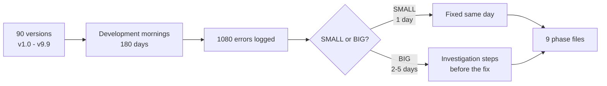
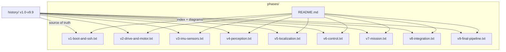
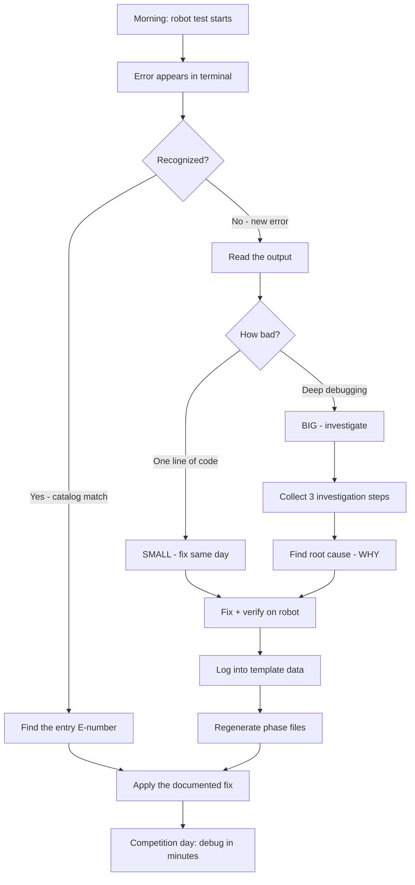
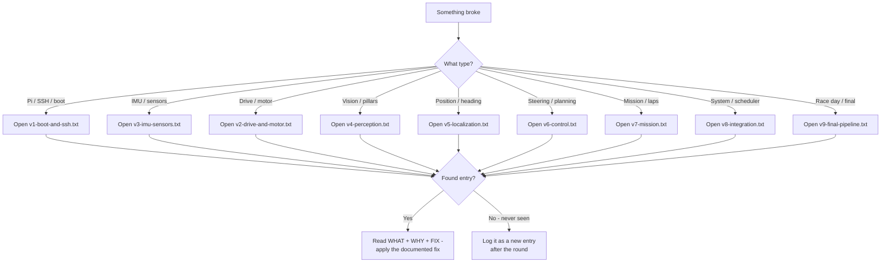
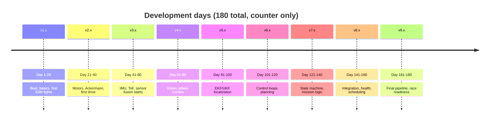

# WRO 4WS Robot — Known Issues (phases/)

The complete engineering journal of every bug, error, and unexpected
behaviour encountered during the 90-version development of the WRO 2026
4WS robot (v1.0 → v9.9), from the first boot to the final race pipeline.

> This folder **is** the issues documentation. All 1080 errors live here,
> split into 9 phase files — one per development phase (v1.x → v9.x).
> There is nothing else in the issues folder.

---

## Why this folder exists

Every error in this repo was **real**, was **seen in a terminal**, and
took **measured days** to fix. This folder exists so that:

1. Any error that appears on competition day has already been seen and
   documented — with the root cause and the fix.
2. The development history (90 versions) is verifiable against the
   failures that actually happened during it.
3. A new teammate can learn *why* the robot behaves the way it does,
   not just what to do.



---

## Folder structure

| Rank | File | Contents |
|------|------|----------|
| 1 | `README.md` | This index — diagrams, guides, stats |
| 2 | `v1-boot-and-ssh.txt` | v1.x — boot & basics + SSH errors (120 errors) |
| 3 | `v2-drive-and-motor.txt` | v2.x — drive & motor control (120) |
| 4 | `v3-imu-sensors.txt` | v3.x — IMU / sensor subsystem (120) |
| 5 | `v4-perception.txt` | v4.x — perception & vision (120) |
| 6 | `v5-localization.txt` | v5.x — localization & fusion (120) |
| 7 | `v6-control.txt` | v6.x — control loop & planning (120) |
| 8 | `v7-mission.txt` | v7.x — mission / state machine (120) |
| 9 | `v8-integration.txt` | v8.x — integration & system (120) |
| 10 | `v9-final-pipeline.txt` | v9.x — final pipeline, the big ones (120) |



---

## Anatomy of one error entry

Every entry follows the same structure, so any error can be read in 30
seconds:

```text
----------------------------------------------------------------------
E0009 | v9.0 | BIG | Found Day 162 | Fixed in 2 days | Pi SSH terminal
----------------------------------------------------------------------
File      : history/v9.0/esp_main.c
Error     : Full pipeline crashes 2 seconds after the start
Terminal  : Pi SSH terminal
  $ python3 main.py
  TypeError: 'Task' object is not callable        <- exact output
WHAT HAPPENED
  <the incident as it happened>
WHY IT HAPPENED (root cause)
  <the deep technical reason - the "why factor">
INVESTIGATION (before the fix)                    <- BIG errors only
  - <step 1 tried>
  - <step 2 tried>
  - <step 3 that found it>
FIX (took 2 days)
  <the solution>
```

| Field | Meaning |
|-------|---------|
| `E0001 … E0120` per phase | Unique error ID, sequential within the phase |
| `vX.Y` | The version phase where it happened |
| `SMALL / BIG` | SMALL = 1 line of code, fixed same day; BIG = 2–5 days |
| `Found Day N` | Development-day counter (180 days total, **no dates**) |
| `Fixed in X day(s)` | How many days it took to fix |
| `Terminal` | Where it showed: Pi SSH, ESP32 serial monitor, CMD, etc. |
| `WHAT HAPPENED` | The incident |
| `WHY IT HAPPENED` | Root cause — the deep research |
| `INVESTIGATION` | The steps tried before the fix (BIG only) |
| `FIX` | The solution |

---

## The error lifecycle

How an error travelled from "morning surprise" to a catalog entry:



---

## Competition-day quick decision guide

The catalog's real purpose. When something fails at the venue:



---

## Phases overview

| Phase | File | Theme | Typical errors |
|-------|------|-------|----------------|
| v1.x | `v1-boot-and-ssh.txt` | Boot & basics + SSH | Import failures, SSH refused, kernel panic, SD full |
| v2.x | `v2-drive-and-motor.txt` | Drive & motor control | PWM overflow, brownout, encoder dead, odometry drift |
| v3.x | `v3-imu-sensors.txt` | IMU / sensors | WHO_AM_I mismatch, ToF frozen, mag saturation |
| v4.x | `v4-perception.txt` | Perception & vision | False pillars, HSV drift, lane flip, VO scale |
| v5.x | `v5-localization.txt` | Localization & fusion | Singular matrix, NaN covariance, UKF divergence |
| v6.x | `v6-control.txt` | Control & planning | Windup, oscillation, infeasible MPC |
| v7.x | `v7-mission.txt` | Mission / state machine | Stuck states, double lap counts, early starts |
| v8.x | `v8-integration.txt` | Integration & system | Scheduler deadlock, OOM, heartbeat failsafe |
| v9.x | `v9-final-pipeline.txt` | Final pipeline (big) | Pipeline crash, watchdog loop, SD corruption |



---

## Statistics

| Metric | Value |
|--------|-------|
| Total errors | **1080** (720 SMALL / 360 BIG) |
| Development days | **180** (day counter, no dates) |
| Versions covered | **90** (v1.0 → v9.9) |
| Phases | **9** (v1.x → v9.x) |
| Errors per version | 12 (8 SMALL + 4 BIG) |
| Errors per phase file | 120 |
| Big errors with investigation | 360 (all) |

The distribution shows the pattern of the whole project: most bugs were
small and fixed the same day; the 360 big ones — the ones that cost
2–5 days each — are the ones worth studying before the competition.

---

## Documented top-10 hardest bugs

The BIG errors that cost the most days — read these before race day:

| Error | Found | Fixed | Root cause in one line |
|-------|-------|-------|------------------------|
| Kernel panic VFS mount fail | v1.x | 4 days | SD corruption after power cut |
| Brownout reboot loop | v2.x | 4 days | Battery sag below 2.8V at motor start |
| UKF diverges off track | v5.x | 5 days | Unbounded adaptive noise growth |
| Scheduler deadlock on exception | v8.x | 4 days | No exception boundary in the loop |
| OOM killer kills perception | v8.x | 3 days | Unbounded frame queue |
| ESP32 watchdog reset at 89s | v9.x | 3 days | Blocking UART write starved watchdog |
| SD corrupt on race day | v9.x | 5 days | ext4 journal lost on power cut |
| UART echo storm between boards | v9.x | 2 days | RX/TX swapped + no checksum |
| False pillar on scoreboard | v9.x | 3 days | Scoreboard passes every color gate |
| Camera frozen 40s on race morning | v9.x | 3 days | Blocking read, no timeout |

---

## Regenerating the catalog

The catalog is **generated, not hand-written**, so it stays consistent.
The template data holds every error's WHAT/WHY/INVESTIGATION/FIX.

```
python scripts/generate_error_catalog.py
```

| File | Role |
|------|------|
| `scripts/error_catalog_data.py` | Template data — themes 1–5 (v1–v5) |
| `scripts/error_catalog_data2.py` | Template data — themes 6–9 (v6–v9) |
| `scripts/generate_error_catalog.py` | Generator — rendering, day counters, phase files |

The generator writes all 9 files in this folder in one pass. Adding a
new error = add one template tuple, regenerate, done.
